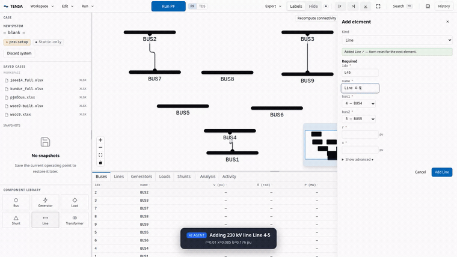

# ANDES App

An interactive, web-based workbench for power system modeling, simulation, and analysis. You build a system visually, run power flow and dynamic studies with one click, watch the results stream in live, and drive the whole thing from a scriptable API. It runs locally in your browser. ANDES App is built on the [ANDES](https://github.com/CURENT/andes) power system simulator.

[](./LICENSE)
[](https://www.python.org/)
[](https://github.com/CURENT/andes)
[](./llms.txt)


## See it in action

An AI agent builds the WSCC 9-bus system from scratch through the real UI. It places every bus, line, transformer, machine, exciter, and governor, lays out the one-line, saves the case to a file and reloads it, then runs power flow, a three-phase fault with a streaming time-domain simulation, continuation power flow, and eigenvalue analysis.

[](https://github.com/Roger-GO/ANDES_App/raw/main/docs/demo/ieee9-agent-demo.mp4)

The clip above is sped up. [Watch the full 2-minute walkthrough (MP4)](https://github.com/Roger-GO/ANDES_App/raw/main/docs/demo/ieee9-agent-demo.mp4). Every step uses the same HTTP API any script or agent can call, and you can [record it yourself](#run-the-demo-yourself).

## What you can do

- **Build a system visually.** Add buses, lines, transformers, generators (static and GENROU), exciters, governors, loads, and shunts from the UI. The one-line diagram lays itself out and is fully draggable, so you can build a complete dynamic case without touching a file.
- **Run five analyses, one click each.** Power flow, time-domain simulation, eigenvalue (small-signal), continuation power flow with PV and QV curves, and state estimation. Each runs as a non-blocking job with live progress and a cancel button.
- **Watch a simulation while it runs.** Time-domain results stream over a WebSocket as Apache Arrow frames and fill the plots while the run is still going, with a voltage-band overlay animating on the diagram in step.
- **Read the network at a glance.** A traditional busbar one-line, with feeders, machines, and loads sitting cleanly around each bus, voltage and MW/MVAr flow labels after a power flow, and color when a bus crosses its limits.
- **Add disturbances interactively.** Bus faults, breaker toggles, and parameter changes, set up before a run and replayed when you reload the case.
- **Edit parameters without fear.** Changes are clone-on-write, with full undo/redo and a diff view. Nothing touches the loaded case until you commit it.
- **See your results.** Voltage and angle plots, an eigenvalue scatter you can zoom and pan, PV nose curves, and residual histograms, all in a dedicated full-screen results view.
- **Save, reload, and reproduce.** Write systems back to xlsx, raw, or json, reload them later, and export a self-contained bundle that captures the case, its layout, and the results.
- **Automate it.** A documented REST and WebSocket API with an OpenAPI schema. Anything you can do in the UI, a script or an AI agent can do too.
- **Keep it local.** Everything runs on your machine. The server binds to loopback by default, there is no account, and nothing phones home.

## Quick start

You need Python 3.12 or newer, and Node 22 with [pnpm](https://pnpm.io/). Node is only used to build the UI once.

```bash
# 0. Clone
git clone https://github.com/Roger-GO/ANDES_App.git
cd ANDES_App

# 1. Install the server (pulls in ANDES, FastAPI, pyarrow)
python -m venv .venv && source .venv/bin/activate     # Windows: .venv\Scripts\activate
pip install -e ./server

# 2. Build the web UI (one time)
cd web && pnpm install && pnpm build && cd ..

# 3. Warm the ANDES symbolic cache (one time, about 30 s; rerun after upgrading ANDES)
andes-app warm-cache

# 4. Serve the UI and API on one port, then open the browser
andes-app serve --workspace ~/andes-cases --port 8000 --open
```

Open `http://127.0.0.1:8000`. On first run an empty workspace is seeded with three example cases (IEEE-14, Kundur, and WSCC-9) so there is something to open right away. Load a case or build one from scratch, run a power flow, add a disturbance, and stream a time-domain simulation.

To use your own cases, drop any `.xlsx`, `.raw`, `.dyr`, or `.json` file into the `--workspace` directory and it shows up in the file picker.

## Run the demo yourself

[`web/scripts/agent-demo.mjs`](web/scripts/agent-demo.mjs) records the video at the top of this README. It drives the real UI with Playwright: it builds WSCC 9-bus from scratch, then runs every analysis.

```bash
# Terminal 1: serve on a fixed port
andes-app serve --workspace ~/andes-cases --port 18800

# Terminal 2: record (writes demo-video/ieee9-agent-demo.webm)
cd web && pnpm exec playwright install chromium   # one time
node scripts/agent-demo.mjs http://127.0.0.1:18800
```

## For agents and scripts

The whole app is driven by a documented HTTP and WebSocket API. Anything the UI can do, a script or an LLM agent can do.

- The OpenAPI schema is at `GET /openapi.json`, with interactive docs at `/docs` (Swagger) and `/redoc`.
- [llms.txt](./llms.txt) is a condensed API map written for LLM consumption: endpoints, workflow ordering, enums, and the gotchas worth knowing.
- [examples/](./examples/) has curl walkthroughs and a self-contained Python client.
- The MCP server exposes sessions, case loading, power flow, TDS, and disturbances as [Model Context Protocol](https://modelcontextprotocol.io) tools, so an assistant like Claude can run simulations directly:
  ```bash
  pip install -e './server[mcp]'
  andes-app mcp --workspace ~/andes-cases
  ```

A typical programmatic flow:

```
POST /api/sessions                         -> session_id
POST /api/sessions/{id}/case               -> load a case (xlsx/raw/dyr/json/m)
POST /api/sessions/{id}/disturbances       -> add faults/toggles/alters (pre-setup)
POST /api/sessions/{id}/pflow              -> solve power flow
POST /api/sessions/{id}/tds                -> batch TDS, or stream via WS /api/ws/{id}
GET  /api/sessions/{id}/operating-point    -> bus voltages and angles
```

## Development mode

```bash
# Terminal 1: backend
andes-app serve --workspace ~/andes-cases --port 8000

# Terminal 2: frontend with hot reload
cd web && VITE_ANDES_PORT=8000 pnpm dev    # -> http://localhost:5173
```

## Network access and security

To reach the app from another machine on your network:

```bash
andes-app serve --workspace ~/andes-cases --port 8000 \
  --bind 0.0.0.0 --allow-origin http://<your-lan-ip>:8000
```

Security note: ANDES App has no authentication. It binds to `127.0.0.1` (loopback) by default and trusts the local OS user. Binding to a non-loopback address opens the API to everyone who can reach that interface, including case-file parsing, which evaluates expressions. Only do this on a network you trust, and do not load untrusted case files in that mode. See [SECURITY.md](./SECURITY.md) for details.

## Architecture

```
┌──────────────┐  REST + WebSocket   ┌───────────────────┐  multiprocessing  ┌──────────────┐
│ React 19 SPA │ ◄────────────────►  │ FastAPI substrate │ ◄──────────────►  │ ANDES worker │
│ (or any HTTP │     /api/* + /ws    │  sessions, jobs,  │   data + control  │  one System  │
│  client)     │                     │  Arrow streaming  │       pipes       │  per session │
└──────────────┘                     └───────────────────┘                   └──────────────┘
```

Each session gets its own `andes.System` in a separate subprocess. The API process never blocks on a running simulation, and a crash in one run cannot take the server down.

## Project layout

| Path | What is there |
|---|---|
| [`server/`](./server) | Python backend. FastAPI routers, per-session subprocess workers, Arrow streaming, clone-on-write editing, and the `andes-app` CLI. |
| [`web/`](./web) | React 19 and TypeScript UI. Interactive SLD (React Flow), uPlot result plots, Radix UI, Tailwind v4, Zustand. |
| [`examples/`](./examples) | curl and Python client walkthroughs for the API. |
| [`llms.txt`](./llms.txt) | API map written for LLMs. |
| [`docs/`](./docs) | Images and the demo video. |

## Citation

If you use ANDES App in your work, please cite it. GitHub's "Cite this repository" button builds a citation from [CITATION.cff](./CITATION.cff). The short form:

> Gracia Otalvaro, R. (2026). ANDES App: an interactive web workbench for power system simulation. https://github.com/Roger-GO/ANDES_App

ANDES App runs on ANDES, which does the underlying power system computation. If you cite this project, please also credit the authors behind ANDES, the [CURENT/ANDES](https://github.com/CURENT/andes) project by Cui et al.

## Contributing

PRs are welcome. See [CONTRIBUTING.md](./CONTRIBUTING.md) for setup, test commands, and conventions. Notes for AI coding agents live in [AGENTS.md](./AGENTS.md), and notable changes are tracked in [CHANGELOG.md](./CHANGELOG.md).

## License

ANDES App is licensed under the [GNU General Public License v3.0](./LICENSE), the same license as ANDES.
