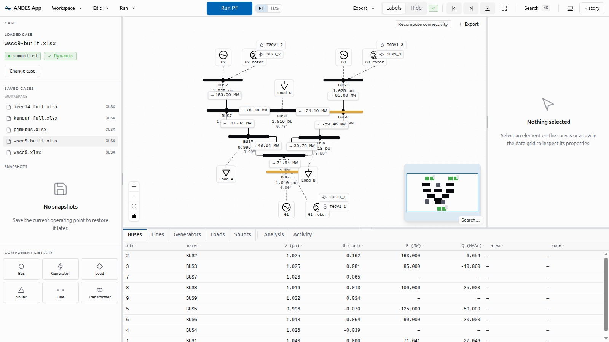

# ANDES App

**An interactive, web-based workbench for [ANDES](https://github.com/CURENT/andes)** — the open-source Python power-system simulator. Build, edit, simulate, and analyze power systems from your browser, with live-streaming time-domain results, an interactive single-line diagram, and a fully scriptable HTTP API designed for both humans and AI agents.

ANDES App is **not a wrapper around the ANDES CLI**. It is a substrate built on the ANDES Python API that adds capabilities native ANDES does not have: interactive model building, live result streaming, session management, undo/redo parameter editing, and a machine-readable API surface for interoperability with other tools and frameworks.



## What you can do

| Capability | ANDES (CLI/notebook) | ANDES App |
|---|---|---|
| Build a system from scratch | Hand-edit xlsx/raw files | Visual builder: add buses, lines, machines, exciters, governors from the UI |
| Run power flow / TDS / EIG / CPF / SE | Scripted, batch | One click, non-blocking jobs with progress + cancel |
| Watch a simulation evolve | Wait, then plot | Live Arrow-IPC streaming into interactive plots + animated SLD overlay |
| Disturbances | Edit case files | Add faults, breaker toggles, load/parameter changes interactively |
| Parameter studies | Write loops yourself | Built-in sweeps with per-iteration results and progress |
| Edit parameters safely | Mutate in place | Clone-on-write editing with undo/redo and diff view |
| Share/reproduce a study | Zip things manually | One-click reproducibility bundle export/import |
| Drive it from other tools | Python imports | REST + WebSocket API with OpenAPI schema; usable from curl, Python, MATLAB, or LLM agents |
| Remote access | — | Serve on your LAN; any browser becomes a client |

## Quick start

Requirements: **Python 3.12+** and **Node 22+ with pnpm** (Node only needed to build the UI once).

```bash
# 1. Install the server (pulls in ANDES, FastAPI, pyarrow)
python -m venv .venv && source .venv/bin/activate
pip install -e ./server

# 2. Build the web UI (one time)
cd web && pnpm install && pnpm build && cd ..

# 3. Warm the ANDES cache (one time, ~30 s; rerun after upgrading ANDES)
andes-app warm-cache

# 4. Serve — UI and API on one port
andes-app serve --workspace ~/andes-cases --port 8000 --open
```

Open `http://127.0.0.1:8000` — load a case from your workspace (or build one from scratch), run a power flow, add a disturbance, and stream a time-domain simulation. An empty workspace is auto-seeded with IEEE-14, Kundur, and WSCC-9 example cases so there's something to open on first run.

### Watch an agent build a system end-to-end

`web/scripts/agent-demo.mjs` records a captioned video of an AI agent driving the real UI: dragging each component onto the canvas to build the WSCC 9-bus system from scratch, laying it out, saving it to a file and reloading it, then running power flow, a fault + streaming time-domain simulation, continuation power flow, and eigenvalue analysis — every step through the same API a script or LLM agent would use.

```bash
andes-app serve --workspace ~/andes-cases --port 18800   # in one terminal
cd web && node scripts/agent-demo.mjs http://127.0.0.1:18800
# → demo-video/ieee9-agent-demo.webm
```

### Development mode

```bash
# Terminal 1 — backend
andes-app serve --workspace ~/andes-cases --port 8000

# Terminal 2 — frontend with hot reload
cd web && VITE_ANDES_PORT=8000 pnpm dev   # → http://localhost:5173
```

### Access from other machines on your network

```bash
andes-app serve --workspace ~/andes-cases --port 8000 \
  --bind 0.0.0.0 --allow-origin http://<your-lan-ip>:8000
```

> **Security note:** ANDES App has no authentication — it binds to `127.0.0.1` (loopback) by default and trusts the local OS user. Binding to a non-loopback address exposes the API (including case-file parsing, which evaluates expressions) to everyone on that network. Only do this on networks you trust. See [SECURITY.md](./SECURITY.md).

## For agents and scripts

The entire app is driven by a documented HTTP + WebSocket API — everything the UI can do, a script or LLM agent can do.

- **OpenAPI schema:** `GET /openapi.json` — interactive docs at `/docs` (Swagger) and `/redoc`
- **[llms.txt](./llms.txt)** — a condensed API map written for LLM consumption: endpoints, workflow ordering, enums, and gotchas
- **[examples/](./examples/)** — curl walkthroughs and a self-contained Python client
- **MCP server** — expose sessions, case loading, power flow, TDS, and disturbances as [Model Context Protocol](https://modelcontextprotocol.io) tools: `pip install -e './server[mcp]'`, then `andes-app mcp`

Typical programmatic flow:

```
POST /api/sessions                         → session_id
POST /api/sessions/{id}/case               → load a case (xlsx/raw/dyr/json/m)
POST /api/sessions/{id}/disturbances       → add faults/toggles/alters (pre-setup)
POST /api/sessions/{id}/pflow              → solve power flow
POST /api/sessions/{id}/tds                → batch TDS (or stream via WS /api/ws/{id})
GET  /api/sessions/{id}/operating-point    → bus voltages/angles
```

## Architecture

```
┌──────────────┐  REST + WebSocket   ┌───────────────────┐  multiprocessing  ┌──────────────┐
│ React 19 SPA │ ◄────────────────►  │ FastAPI substrate │ ◄──────────────►  │ ANDES worker │
│ (or any HTTP │     /api/* + /ws    │  sessions, jobs,  │   data + control  │  one System  │
│  client)     │                     │  Arrow streaming  │       pipes       │  per session │
└──────────────┘                     └───────────────────┘                   └──────────────┘
```

- `server/` — Python substrate: FastAPI routers, per-session subprocess workers, Apache Arrow IPC streaming, clone-on-write editing
- `web/` — React 19 + TypeScript UI: interactive SLD (React Flow), uPlot result plots, Radix UI, Tailwind v4, Zustand
- One `andes.System` per session lives in an isolated subprocess; the API process never blocks on a simulation

## Contributing

PRs welcome — see [CONTRIBUTING.md](./CONTRIBUTING.md) for setup, test commands, and conventions. Conventions for AI coding agents live in [AGENTS.md](./AGENTS.md).

## License

[MIT](./LICENSE)
