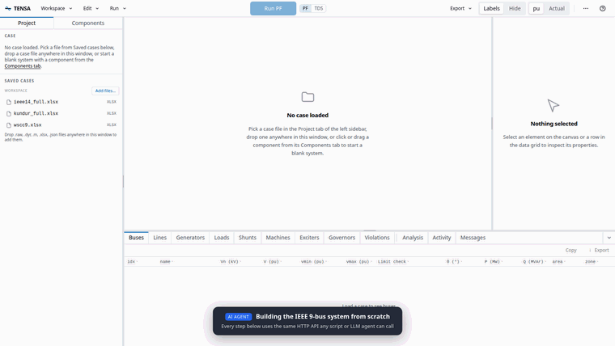

# TENSA

**T**ransients, **E**igenvalues & **N**etwork **S**imulation **A**pplication: an interactive, web-based workbench for power system modeling, simulation, and analysis. You build a system visually, run power flow and dynamic studies with one click, watch the results stream in live, and drive the whole thing from a scriptable API. It runs locally in your browser. TENSA is built on the [ANDES](https://github.com/CURENT/andes) power system simulator. (This project was briefly shared as "ANDES App" during its beta; same tool, new name.)

[](https://pypi.org/project/tensa/)
[](https://roger-go.github.io/TENSA/)
[](./LICENSE)
[](https://www.python.org/)
[](https://github.com/CURENT/andes)
[](./llms.txt)


## Quick start

You need Python 3.12 or newer. The package on PyPI ships with the UI already built:

```bash
pip install tensa
tensa serve --open
```

`tensa serve` starts the server on a free port, and `--open` opens your browser there. The first time, it fills its workspace (`~/.tensa/cases`, or the directory you give with `--workspace`) with three example cases, IEEE 14, Kundur and WSCC 9-bus, so there is something to open right away. Load one, run a power flow, add a fault, and stream a time-domain simulation. The [quick start](https://roger-go.github.io/TENSA/quickstart/) in the documentation walks through exactly that.

The browser keeps your finished runs and recent cases for the address it loaded the page from. Add `--port 8000` to get the same address every time.

To use your own cases, drop `.xlsx`, `.raw`, `.dyr`, `.m` or `.json` files onto the browser window, or put them in the workspace directory. A `.raw` dropped together with its `.dyr` opens as the pair.

To get the app in a window of its own instead of a browser tab, add the desktop extra:

```bash
pip install "tensa[desktop]"
tensa desktop
```

On Linux the window also needs a GUI toolkit, which the extra does not bring: use `pip install "tensa[desktop]" "pywebview[qt]"`. The command checks what it needs before it starts anything and says what is missing. [Install](https://roger-go.github.io/TENSA/install/#a-window-of-its-own) has the details for every system.

TENSA runs on Linux, macOS (Apple silicon) and Windows, with Python 3.12 and 3.13. Windows on ARM is not supported, because two of the packages it needs publish no wheels for it. To build from source, follow [Install from source](https://roger-go.github.io/TENSA/install/#install-from-source).

## See it in action

An AI agent builds the WSCC 9-bus system from scratch through the real UI. It places every bus, line, transformer, machine, exciter, and governor on the one-line, saves the case to a file and reloads it, then runs power flow, a three-phase fault with a streaming time-domain simulation, continuation power flow, and eigenvalue analysis.

[](https://github.com/Roger-GO/TENSA/raw/main/docs/demo/ieee9-agent-demo.mp4)

The clip above is sped up. [Watch the full 2-minute walkthrough (MP4)](https://github.com/Roger-GO/TENSA/raw/main/docs/demo/ieee9-agent-demo.mp4). Every step uses the same HTTP API any script or agent can call, and you can [record it yourself](#run-the-demo-yourself).

## What you can do

**Build and edit**

- **Build a system visually.** Add buses, lines, transformers, generators, machines, exciters, governors, loads, shunts and a battery from the Components tab, or open a case file (`.xlsx`, `.raw` with its `.dyr`, `.m`, `.json`). You can build a complete dynamic case without touching a file.
- **Draw on the diagram.** Drop a component where you want it, and it stands there as a draft until you have filled it in. Drop it on a bus to connect it, or draw a line from one bus to another.
- **A one-line diagram that stays tidy.** Nothing is drawn over anything else: lines route around symbols and labels as you drag, **Tidy diagram** cleans up a whole drawing, and you can still move any line by hand.
- **Edit without fear.** Change values in the tables or the Inspector, paste a block from a spreadsheet, delete any element, and undo or redo every edit and every move.

**Analyze**

- **Five analyses, one click each.** Power flow, time-domain simulation, eigenvalue (small-signal) analysis, continuation power flow with PV and QV curves, and state estimation. Each runs as a job with live progress and a cancel button.
- **A power flow you can tune and check.** Set the tolerance, the iteration limit, a flat start and reactive limits, read the system summary, and get a Violations table of every limit the solution breaks.
- **Watch a simulation while it runs.** Results stream into the plots as the run goes. Add faults, line trips and parameter changes, record any ANDES variable by name, and read nadir, rate of change, settling time, overshoot and damping off the plot.
- **Find the loading margin.** Continuation power flow with generator reactive limits, a choice of what grows, and every generator's reactive power along the curve.
- **Batteries and frequency control.** Add a battery (ANDES's ESD1) and close a frequency loop on it with a droop or a fast frequency response.

**Read and share the results**

- **Read the network at a glance.** Voltages, flows and loading on the diagram, with a color and a marker when a bus, a line or a generator nears or passes a limit.
- **Compare and report.** Set two power flows side by side, and save a self-contained HTML report of your runs that opens in any browser.
- **Take the results with you.** CSV from the tables and the plots, a COMTRADE record of a time-domain run, a figure of the diagram for a paper (SVG, PDF or PNG), and a bundle that reproduces the study.

**Run it your way**

- **In the browser, or in a window of its own.** The app opens in your browser, or `tensa desktop` gives it a native window.
- **Automate it.** A documented REST and WebSocket API with an OpenAPI schema. Anything you can do in the UI, a script or an AI agent can do too.
- **Keep it local.** Everything runs on your machine. The server binds to loopback by default, there is no account, and nothing phones home.
- **Easy to look after.** `GET /api/health` for a health check, and `--log-level`, `--log-file` and `--log-json` on `tensa serve` when you need to see what the server did.

The [changelog](./CHANGELOG.md) lists everything that is new in this release.

## Documentation

The documentation site is at **<https://roger-go.github.io/TENSA/>**.

| If you want to | Read |
|---|---|
| Install TENSA on Linux, macOS or Windows | [Install](https://roger-go.github.io/TENSA/install/) |
| Load a case, run a power flow and a fault study | [Quick start](https://roger-go.github.io/TENSA/quickstart/) |
| Know what each part of the window does | [UI tour](https://roger-go.github.io/TENSA/ui-tour/) |
| Understand sessions, the workspace and why a run locks the case | [Concepts](https://roger-go.github.io/TENSA/concepts/) |
| Drive TENSA from a script or an AI assistant | [API guide](https://roger-go.github.io/TENSA/api/) and [Agents and MCP](https://roger-go.github.io/TENSA/agents/) |
| Look up a `tensa` command or option | [Command line reference](https://roger-go.github.io/TENSA/reference/cli/) |
| Fix something that does not work | [Troubleshooting](https://roger-go.github.io/TENSA/troubleshooting/) |

## For agents and scripts

The whole app is driven by a documented HTTP and WebSocket API. Anything the UI can do, a script or an LLM agent can do.

- The OpenAPI schema is at `GET /openapi.json`, with interactive docs at `/docs` (Swagger) and `/redoc`.
- The [API guide](https://roger-go.github.io/TENSA/api/) explains the routes, the errors and the streaming protocol, and the [route reference](https://roger-go.github.io/TENSA/reference/api/) lists every one of them.
- [llms.txt](./llms.txt) is a condensed API map written for LLM consumption: endpoints, workflow ordering, enums, and the gotchas worth knowing.
- [examples/](./examples/) has a curl walkthrough (a bash script) and a self-contained Python client.
- The MCP server exposes sessions, case loading, power flow, time-domain simulation and disturbances as [Model Context Protocol](https://modelcontextprotocol.io) tools, so an assistant like Claude can run simulations directly ([Agents and MCP](https://roger-go.github.io/TENSA/agents/) shows how to connect one):
  ```bash
  pip install "tensa[mcp]"
  tensa mcp --workspace ~/tensa-cases
  ```

A typical programmatic flow:

```
POST /api/sessions                         -> session_id
POST /api/sessions/{id}/case               -> load a case (xlsx/raw/dyr/json/m)
POST /api/sessions/{id}/disturbances       -> add faults/toggles/alters (pre-setup)
POST /api/sessions/{id}/pflow              -> solve power flow (optional tolerance, iterations, flat start, Q limits)
POST /api/sessions/{id}/tds                -> batch TDS, or stream via WS /api/ws/{id}
GET  /api/sessions/{id}/operating-point    -> bus voltages and angles
```

A request with a JSON body needs the `Content-Type: application/json` header.

## Run the demo yourself

[`web/scripts/agent-demo.mjs`](web/scripts/agent-demo.mjs) records the demo above. It drives the real UI with Playwright: it builds WSCC 9-bus from scratch, then runs every analysis. It needs a source checkout with the UI built ([CONTRIBUTING.md](./CONTRIBUTING.md) has the setup).

```bash
# Terminal 1: serve on a fixed port
tensa serve --port 18800

# Terminal 2: record (writes demo-video/ieee9-agent-demo.webm)
cd web
pnpm exec playwright install chromium
node scripts/agent-demo.mjs http://127.0.0.1:18800
```

## Security

TENSA has no authentication. It binds to `127.0.0.1` (loopback) by default and trusts the local OS user, and loading a case file can run code, so load only case files you trust. Binding to another address with `--bind` opens the API to everyone who can reach it: do that only on a network you trust. [SECURITY.md](./SECURITY.md) has the details, and [Troubleshooting](https://roger-go.github.io/TENSA/troubleshooting/#reaching-the-server-from-another-machine) shows how to reach the server from another machine.

## Architecture

```
┌──────────────┐  REST + WebSocket   ┌───────────────────┐  multiprocessing  ┌──────────────┐
│ React 19 SPA │ ◄────────────────►  │ FastAPI substrate │ ◄──────────────►  │ ANDES worker │
│ (or any HTTP │     /api/* + /ws    │  sessions, jobs,  │   data + control  │  one System  │
│  client)     │                     │  Arrow streaming  │       pipes       │  per session │
└──────────────┘                     └───────────────────┘                   └──────────────┘
```

Each session gets its own `andes.System` in a separate subprocess. The API process never blocks on a running simulation, and a crash in one run cannot take the server down.

## Project layout

| Path | What is there |
|---|---|
| [`server/`](./server) | Python backend. FastAPI routers, per-session subprocess workers, Arrow streaming, clone-on-write editing, and the `tensa` CLI. |
| [`web/`](./web) | React 19 and TypeScript UI. Interactive SLD (React Flow), uPlot result plots, Radix UI, Tailwind v4, Zustand. |
| [`examples/`](./examples) | curl and Python client walkthroughs for the API. |
| [`llms.txt`](./llms.txt) | API map written for LLMs. |
| [`docs/`](./docs) | The source of the [documentation site](https://roger-go.github.io/TENSA/) (MkDocs, configured in [`mkdocs.yml`](./mkdocs.yml)), and the images and the demo video this README uses. |

## Citation

If you use TENSA in your work, please cite it. GitHub's "Cite this repository" button builds a citation from [CITATION.cff](./CITATION.cff). The short form:

> Gracia Otalvaro, R. (2026). TENSA: an interactive web workbench for power system simulation. https://github.com/Roger-GO/TENSA

TENSA runs on ANDES, which does the underlying power system computation. If you cite this project, please also credit the authors behind ANDES, the [CURENT/ANDES](https://github.com/CURENT/andes) project by Cui et al.

## Contributing

PRs are welcome. See [CONTRIBUTING.md](./CONTRIBUTING.md) for a source checkout, the UI with hot reload, the test commands, and the conventions. Notes for AI coding agents live in [AGENTS.md](./AGENTS.md), and notable changes are tracked in [CHANGELOG.md](./CHANGELOG.md).

## License

TENSA is licensed under the [GNU General Public License v3.0](./LICENSE), the same license as ANDES.
