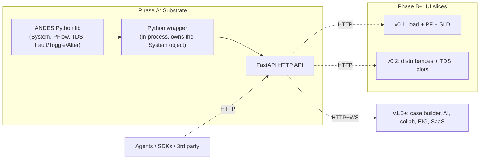

# Accessible ANDES Power Systems App

## Problem Frame

Power-systems software is dominated by expensive, Windows-bound, decades-old commercial tools (PowerWorld, PSS/E, PowerFactory). Open-source alternatives exist but ship without a real GUI — users edit text/spreadsheet case files, run CLI commands, and parse output by hand. ANDES (CURENT/andes) is a research-grade Python power-system simulator with strong dynamics support (PF, TDS, EIG) but no GUI today.

**Primary persona for v0.1: a power-systems researcher iterating on cases.** They already have ANDES installed, already have case files, and run PF/TDS studies as their daily work. Their pain is the CLI-and-text-file loop: load case → edit case → run from terminal → open .lst/.npz output → matplotlib in a notebook → repeat. They are productive in Python today, but the iteration loop is slow and the visual feedback is poor.

Secondary audiences (students learning power systems; working engineers without commercial licenses; the broader ANDES community) benefit from the same v0.1 surface but are not what the requirements optimize for. Where their needs and the researcher's diverge, the researcher wins.

The wedge is **modern open-source UX vs. legacy commercial tools** — a free, web-based, cross-platform interface that handles the workflows researchers already do (load case, run PF/TDS, study disturbances, visualize results) but with a UX that doesn't feel like Windows 95. The doc treats UX as the *visible* wedge and acknowledges that the *durable* wedges — open/free, ANDES-native extensibility, agent-readiness from day one, future web-native collaboration — live in the architecture and surface progressively over time. If incumbents close the UX gap with their own refreshes, the durable wedges keep the project differentiated.

The path is substrate-first: build a stable Python-API-backed automation layer for ANDES with an HTTP surface (Phase A), then build the UI in tight independently-demoable slices on top (Phase B+). The same substrate eventually serves a SaaS deployment without a rewrite.

## Architecture Sketch

Note on **CLI-Anything**: HKUDS/CLI-Anything is a one-shot code generator, not a runtime layer. Its 7-phase pipeline (Analyze → Design → Implement → Plan Tests → Write Tests → Document → Publish) produces a Click-based Python CLI package + tests + SKILL.md that the team owns and maintains. After it runs, it is no longer a dependency. CLI-Anything is therefore an *optional dev-time tool* — it may help scaffold an initial version of the Python wrapper, but the substrate's runtime architecture is direct: Python wrapper → FastAPI, calling the ANDES Python API (`andes.load`, `ss.PFlow.run()`, `ss.TDS.run()`, plus the disturbance-injection mechanism chosen in planning per the lifecycle note below) in-process. A 30-minute spike pointing CLI-Anything at the ANDES CLI is the falsification test for whether to use it at all; if it doesn't help, drop it.

The substrate is **not** a CLI-shell-out architecture. The ANDES CLI exposes only `andes run | plot | doc | misc | prepare | selftest` and disturbances are not CLI-accessible — `Fault`, `Toggle`, and `Alter` are case-file rows or Python-API model entities. TDS results stream out of `ss.dae.ts` arrays in-process; the CLI writes `.lst/.npz` only at end-of-run. Both PF and TDS are implementable end-to-end via the Python API in a long-lived process, which is what Phase A builds.

**ANDES `setup()` lifecycle constraint.** ANDES rejects `ss.add(...)` after `setup()` has been called, and `andes.load()` calls `setup()` by default. This means a naive "load case → user defines disturbance → run" flow is not directly supported. Phase A must pick one of: (a) load with `setup=False`, hold the System in a pre-setup state until disturbances are committed, then `setup()` and run; (b) reload the case from disk on each disturbance edit (loses long-lived-System property); (c) bypass the setup gate via direct DAE manipulation or a custom injection path; (d) attach disturbances via the existing `callpert(t, system)` per-step hook (the only safely-supported in-process mechanism). The choice is deferred to planning but materially shapes R1's contract and the disturbance editor's UX (R11). TDS live streaming has the same character: ANDES's `streaming_step` is DiME-gated; in-process streaming requires `callpert`-as-observer, monkey-patching `streaming_step`, or polling `dae.ts._ys` from a worker thread — none are documented public extension points, so the substrate pins an ANDES version range.

## Phasing

| Release | Capability | Demoable as |
|---|---|---|
| Phase A (substrate) | In-process Python wrapper around ANDES + FastAPI surface; covers PF + TDS + basic disturbances (all three: `Fault`, `Toggle`, `Alter`); supports both result-on-completion and websocket streaming for TDS | Curl/SDK demo: load case, run PF, define a fault + a line trip + a parameter change, run TDS, stream time-series back |
| v0.1 | Load existing case → auto-generated interactive single-line diagram → run PF → results overlaid on diagram + table | Screen recording: file in, animated voltages out |
| v0.2 | Disturbance/event editor (timeline-based) + TDS run with live streaming + animated time-series plots with state-variable picker + animated SLD scrub | TDS demo: define fault, run, watch frequency response live |
| **v1.0** | **Phase A + v0.1 + v0.2** | Researcher's complete loop: load → inspect → study → visualize |
| v1.5+ | Visual case builder (full topology editing), EIG, AI/agent UI workflows, multi-user collaboration, SaaS multi-tenancy, advanced viz | Out of scope for this brainstorm |

## Requirements

**Substrate (Phase A) — ANDES automation layer**
- R1. Substrate exposes a stable HTTP API (FastAPI) backed by an in-process Python wrapper that owns a long-lived ANDES `System` instance per session and exposes operations needed by v0.1 + v0.2: load case (with optional addfile), introspect topology, run PF, define disturbances (Fault/Toggle/Alter), run TDS, stream results.
- R2. Substrate supports both batch result delivery (return at run completion) and websocket-based streaming during TDS runs (state-variable values keyed by simulation time). The choice between the two is a per-call API parameter, not a separate endpoint family.
- R3. Substrate is usable independently of the UI. **Acceptance test: a curl-only walkthrough script in CI loads IEEE 14-bus, runs PF, defines a fault, runs TDS, and reads back state-variable time series — no UI involvement, no UI-side state required.** This script is part of Phase A definition-of-done.
- R4. Substrate accepts the case formats ANDES already reads natively (xlsx, raw, dyr, json, m). PSS/E `.raw` (steady-state) and `.dyr` (dynamics) are paired via ANDES's `--addfile` mechanism — the substrate API models a primary case file plus optional addfile(s), not five independent drop-targets. No new format parsers in Phase A.
- R5. Substrate persists case files and computed results. SLD layout coordinates are *not* substrate state — they live as a UI-managed sidecar file (`<case>.layout.json`) alongside the case in v0.1. This keeps the substrate domain-only (calculation + topology + results), which preserves R3 (usable without UI) and avoids forcing the substrate to model UI presentation concerns.

**MVP UI (v0.1) — Load, view, run PF**
- R6. User can open an existing ANDES-supported case file (with optional addfile pairing); the substrate parses it and the UI displays an auto-generated single-line diagram of the topology.
- R7. The single-line diagram renders buses, lines, transformers, generators, and loads using **IEC 60617 power-systems iconography** as the starting reference (most common in academic power systems literature). The standard itself is a paid IEC publication and existing open-source SVG sets are either unlicensed or GPL-bundled, so the project authors original SVG following 60617 conventions for the small set required (~15-30 symbols: bus, breaker, transformer, generator types, load, shunt, line). Custom symbology may extend or refine 60617 where modern UX benefits, but the visual must be recognizable to power-systems professionals at first glance.
- R8. User can trigger a PF run from the UI; the UI shows progress and surfaces ANDES errors using a structured taxonomy: **(a) parse errors** (file format / unreadable), **(b) solver non-convergence** (PF fails to converge — surface the converged-iteration log inline; offer "view input data" affordance), **(c) runtime crash** (uncaught exception — surface a friendly message + technical detail collapsed by default). Each maps to a distinct UI surface (inline banner / overlay panel / modal) defined in the design direction.
- R9. PF results are overlaid on the diagram (bus voltages with color encoding for limit violations; line flows with directional arrows) and shown in a sortable, filterable results table beside it.
- R10. The diagram supports zoom, pan, and click-to-inspect on any element (open a side panel showing that element's parameters and computed results). Click-to-inspect drives the side panel; the side panel is dockable and persistent across runs.

**Disturbance + TDS (v0.2) — Dynamics**
- R11. User can define disturbances against a loaded case using a **timeline-based editor** (events on a time axis, scrubbable, draggable to reschedule): 3-phase-to-ground faults (ANDES's native `Fault` model — single-phase faults are not natively supported and are out of scope unless an ANDES upstream change adds them), line trips and generator trips (ANDES `Toggle` model), load steps and parameter changes at scheduled times (ANDES `Alter` model). Scope is the subset of ANDES events most commonly used in study workflows; full ANDES event coverage is not required for v0.2.
- R12. User can run a TDS with the configured disturbances and a chosen end time / time step. The UI requests websocket streaming by default (R2) so progress and intermediate values appear live.
- R13. Time-series results are visualized in animated plots with a state-variable picker (bus voltages, generator angles, frequency, etc.); plots support multi-series overlay, zoom, pan, CSV export, and a synchronized time cursor shared with the SLD scrub control.
- R14. The single-line diagram animates during/after TDS — voltages and flows update over the simulated timeline with a scrub control. **The plot time-cursor and the SLD scrub control are synchronized — moving one moves the other.**

**Single-line diagram (cross-cutting)**
- R15. SLD layout is hybrid with a **curated-fallback** strategy: (a) for known IEEE standard cases (14, 39, 57, 118, 300), ship hand-curated layouts authored from scratch as part of the package — ANDES does not ship coordinate data, so this is real authoring work and the in-app SLD editor is the authoring tool; (b) for unknown cases below ~30 buses, run auto-layout (algorithm chosen at planning time after a benchmark spike); (c) for unknown cases above ~30 buses, render best-effort auto-layout with a dismissible "this layout will need cleanup" banner — the user is expected to drag-arrange before sharing screenshots; (d) the user can drag elements to refine in any case; (e) layout persists as a UI-side `<case>.layout.json` sidecar.
- R16. Auto-layout is acknowledged as imperfect on cases above ~30 buses. The product does not promise PowerWorld-quality on arbitrary input — only that small/standard cases look good out of the box and arbitrary cases are tractable to clean up by hand. The wedge-demo target case set explicitly includes one researcher-realistic non-IEEE case (e.g., the ANDES `kundur` case or a custom 100+ bus synthetic) so the demo doesn't hide the gap.

**Design direction (cross-cutting)**

The "modern UX" wedge depends on this section. Without concrete commitments, the result drifts toward shadcn/Tailwind-default AI slop indistinguishable from any 2026 SaaS dashboard.

- R17. UI feels modern in 2026 terms — clean typography, restrained color, responsive layout, fast interactions. **Concrete commitment: the design system is built on Radix primitives or equivalent unstyled headless components, *not* a stock shadcn theme. Color, type scale, and spacing are project-defined, not framework-defined.** Specific component-library choice deferred to planning but constrained to one capable of hosting a custom-rendered SLD canvas alongside dockable side panels.
- R18. **Information architecture is split-pane**: SLD canvas occupies the primary canvas region (≥60% of viewport); a dockable right-side region holds the inspector, results table, and (in v0.2) plots; a thin top bar holds run/disturbance controls; a thin left rail holds case nav and view-mode toggles. Modal dialogs are reserved for destructive confirmations only — never for routine workflow steps.
- R19. **Interaction state matrix.** Every primary surface defines: empty / loading / in-progress / success / error / animation-active states. The doc does not enumerate every state-cell here, but planning must produce the matrix before v0.1 implementation begins.
- R20. UI targets the spirit of accessibility — **defined floor:** keyboard navigation works for the v0.1 critical path (open case → run PF → inspect element → view results); SLD elements are reachable via tab order with visible focus rings; contrast meets WCAG AA on the primary surfaces; error messages are screen-reader-readable. Formal WCAG certification is not in scope.

**Security & Trust Boundaries (cross-cutting)**

- R21. **Trust model statement.** ANDES case files (`.dyr` and `.xlsx` in particular) can include user expressions evaluated by ANDES at parse time. **Loading a case file is therefore equivalent to executing user-provided code in the substrate process.** The v0.1 trust model is: (a) the local OS user is trusted with arbitrary code execution (the substrate runs as the user); (b) loopback-reaching web origins from random browser tabs are *not* trusted (R22 defends); (c) case files received from third-party sources are *not* trusted by the system but are trusted by the user when they choose to load them (the user accepts the risk consciously, like opening an .xlsx in Excel). Before any SaaS / shared / multi-tenant deployment, this trust model must be revisited (sandboxing, sub-process isolation, format-specific parser, or curated case allow-listing).
- R22. **Local-mode binding posture.** `andes-app serve` binds **loopback only (127.0.0.1)** by default. Binding to any other interface requires an explicit `--bind` flag. A simple per-launch random token (printed to terminal) gates the API even on loopback to defeat DNS-rebinding from random browser tabs. Users on the same machine do not get implicit access.
- R23. **Path validation on case-file ingestion.** All user-supplied paths are canonicalized server-side and constrained to a configurable workspace directory (default: `~/.andes-app/cases`). Absolute paths and `..`-traversals outside the workspace are rejected with a clear error.
- R24. **Rate-limit and CSRF posture for the HTTP and WebSocket surfaces.** PF and TDS runs are gated by a per-token concurrency limit (default: 1 in-flight run per token in local mode); CSRF is mitigated by requiring the per-launch token in an explicit header (not cookie-attached) and by CORS restrictions to a precise allow-list (`http://127.0.0.1:<port>` and `http://localhost:<port>` only — no wildcards, no `null` origin). **WebSocket upgrade requests must present the same per-launch token** before any data flows — either via the `Sec-WebSocket-Protocol` sub-protocol field or as the first message on the channel, before the server begins streaming. The server also performs a server-side `Host` / `Origin` header check on every request as defense-in-depth against DNS rebinding. SaaS-mode posture is deferred but the local-mode shape is forward-compatible.

**Architectural principles (cross-cutting, design guidelines not gates)**

R25 and R26 are downgraded from binding requirements to *design guidelines* applied as judgment calls during planning and code review, not as testable cross-cutting gates. They reflect future-state intent without committing v0.1 to speculative breadth.

- R25. **Agent-readiness principle.** The substrate API should be tool-shaped — every operation returns structured data, takes structured input, and is described by an OpenAPI 3.1 spec with `operationId` per endpoint. No requirement that an agent actually call it in v1.0; only that the surface would not need a redesign for one to. Concrete checkpoint: run an OpenAPI-to-MCP-tool generator at end of Phase A and confirm the output is sensible.
- R26. **SaaS-readiness principle.** Endpoints accept (and locally ignore) a tenant/user context parameter; case files and results are stored in workspace-relative paths (no hard-coded absolute paths or implicit user-home assumptions); session state is keyed by an explicit session ID rather than process-global state. Multi-tenant auth, isolation, and storage encryption land in a future phase, not v0.1.

## Success Criteria

- **First-result latency.** A new user with ANDES already installed and the app's first-run cache warm can load IEEE 14-bus, run a power flow, and see annotated results inside their browser within five minutes of starting the app. *t=0 is "after `pip install andes-app` and `andes-app serve`, browser open."* This excludes ANDES install and the first ANDES code-generation pass. **Mitigation for cold-start UX:** the `andes-app` package ships a precomputed ANDES code-gen cache for IEEE 14 (and other curated cases per R15a), so a fresh-install user does not pay the multi-minute `andes prepare` cost on their first run for these stock cases.
- **Wedge demo.** A side-by-side screenshot of this app vs. PowerWorld / PSS/E makes the "modern UX" wedge self-evident — no explanation needed.
- **Substrate independence.** The Phase A curl-only walkthrough script (R3) runs green in CI: load IEEE 14, PF, fault, TDS, time-series readback — without any UI process running.
- **Researcher iteration speed.** A power-systems researcher who today does load → run → matplotlib in a notebook can do the same loop in this app in materially less time. (Concrete benchmark TBD in planning — likely "fewer keystrokes/clicks to first plot" on a defined scenario.)
- **Phase boundaries hold.** Each release (Phase A, v0.1, v0.2) ships independently demoable. None requires a later release to be useful.
- **Case round-trip integrity.** Case files loaded in v0.1 / v0.2 are byte-identical on save unless the user explicitly edited them (no silent format normalization).
- **v1.0 SaaS-pitchable.** v1.0 (Phase A + v0.1 + v0.2) is competitive enough as a basis for a SaaS pitch *to ANDES-native users* (academic / research / labs). The industrial-utility SaaS market is acknowledged as a different ICP requiring multi-backend support that is out of scope.

## Scope Boundaries

### Future / Deferred Features (not in v0.1–v1.0)

- AI/agent UI features (substrate is agent-ready, but UI doesn't ship a chat surface)
- Real-time multi-user collaboration
- Hosted SaaS deployment
- Account/authentication system
- Billing
- Visual case builder — drag/drop topology authoring (deferred to v1.5; the foregrounded researcher pain is run-and-view, not build-from-scratch; v1.0 may include limited "edit existing case" affordances if researcher feedback demands them)
- Air-gappable / locked-down-laptop deployment artifact (single-binary, offline wheelhouse) — utility-engineer segment is acknowledged as out of v1.0 scope; revisit post-v1.0
- Formal WCAG accessibility certification (target spirit per R20, not certification)

### Analysis & Methods Out of Scope (not in v0.1–v1.0)

- Eigenvalue (EIG) analysis
- Contingency / N-1 studies
- Optimal power flow
- Market simulation
- Protection relay modeling beyond what ANDES provides natively
- PSCAD-style EMTP simulation
- Custom user-defined dynamic models authored *in the UI* (advanced users still edit ANDES models in Python directly)

### Format & Backend Constraints

- CIM/CGMES import — not in v0.1–v1.0
- Reimplementing ANDES — not in scope at all
- Replacing the ANDES Python API for power users — not in scope at all
- Supporting non-ANDES backends (e.g., pandapower, Matpower runtime) — not in scope at all. ANDES is the single calculator. SaaS pitch is therefore to ANDES-native users; industrial-utility SaaS would require multi-backend, which is a different product.

### Deferred to Separate Tasks

- Hosted SaaS deployment with multi-tenancy and auth: a future post-v1.0 phase, building on the same substrate.
- Standalone agent / chat UI surface: future phase, building on the same substrate.

## Key Decisions

- **Substrate is Python-API-backed, not CLI-wrapping.** The ANDES CLI surface is too thin for disturbances/TDS (no `Fault`/`Toggle`/`Alter` verbs; results land in files at end-of-run). The substrate runs in-process Python with a long-lived `System` instance per session. This makes both PF and TDS naturally implementable, with disturbance definition via the same `ss.add(...)` API ANDES users already know.
- **CLI-Anything is optional dev-time scaffolding, not a runtime dependency.** Falsification test before adopting: 30-minute spike pointing it at the ANDES CLI. If the generated artifact helps bootstrap the Python wrapper, use it; if not, hand-roll. The substrate's contract does not depend on which path produced the wrapper.
- **Substrate-first phasing kept** despite delaying UX feedback. Honest rationale: substrate-first buys agent-readiness and SaaS optionality (R25/R26) at the cost of delayed feedback from the primary v0.1 persona, who values UI most. A Python-fluent researcher with `import andes` already in their notebook gets little immediate value from a localhost FastAPI hop — Phase A's actual customers are agents, future SaaS tenants, third-party SDK consumers, and the v0.1 UI itself. We accept the trade because (a) the substrate work is small enough under the Python-API approach to keep the gap manageable, and (b) the agent/SaaS optionality is load-bearing for the durable wedges named in the Problem Frame.
- **Web app, not desktop.** React UI in browser, FastAPI backend. Local mode = `serve` opens localhost; SaaS mode = same code hosted later. Air-gapped utility engineers are explicitly deferred.
- **ANDES-only backend.** Single calculator. SaaS pitch is to ANDES-native users; industrial multi-backend is a different product.
- **v1.0 = Phase A + v0.1 + v0.2.** Visual case builder (former v0.3) deferred to v1.5. v1.0 is "complete loop for the load-and-study workflow."
- **Auto-layout has a curated-fallback** (R15): hand-curated layouts ship for IEEE 14/39/57/118/300; auto-layout for arbitrary input. Replaces the original "auto only with manual fine-tune" decision after feasibility flagged auto-layout-on-arbitrary-cases as a research-grade problem.
- **Trust model is named, not assumed.** Loading a case file is code execution; v0.1 single-user local treats local user as trusted; SaaS revisits before launch.

## Dependencies / Assumptions

- ANDES Python package and CLI are installed and stable in the runtime environment (Phase A pins a version range).
- ANDES Python API (`andes.load`, `andes.System`, `ss.PFlow.run()`, `ss.TDS.run()`, `ss.add('Fault'|'Toggle'|'Alter', ...)`, `ss.dae.ts`) remains stable across the supported version range — verified by the Phase A curl-walkthrough running on each pinned version.
- ANDES's natively supported case formats (xlsx, raw, dyr, json, m, with `--addfile` pairing for `.raw + .dyr`) cover v0.1–v1.0 case import scope. New parsers are out of scope.
- Browser-deployed React UI is acceptable for the *researcher* persona (their daily environment is a laptop with a browser already open). Local-mode UX must still feel native — file picker uses the substrate-mediated workspace, not browser-mediated chunked uploads.
- CLI-Anything (HKUDS/CLI-Anything) is optional. The substrate does not depend on it at runtime regardless of whether it's used at dev time.

## Prior Art

The CURENT organization (which maintains ANDES) also maintains adjacent projects worth evaluating before assuming greenfield:
- `CURENT/agvis` — geo-visualization for energy systems. Not a general-purpose GUI but may overlap with R7/R10 (iconography, click-to-inspect). Planning should evaluate integrate-vs-replace.
- `CURENT/andes_addon` — addons for ANDES. May provide reusable functionality.

Adjacent open-source visualization patterns to study (not necessarily integrate): pandapower's `pandapower.plotting`, PyPSA plotting modules, PowerSybl's diagram conventions.

## Outstanding Questions

### Resolve Before Planning

(none — product framing is settled enough for planning to proceed)

### Deferred to Planning

- [Affects R1, R2][Needs research] **30-minute CLI-Anything spike** against `andes` to confirm whether it's useful as dev-time scaffolding. Outcome: use / drop / use partially.
- [Affects R1, R2, R11][Technical] **ANDES `setup()` lifecycle strategy.** Pick the disturbance-injection mechanism: pre-setup add-then-commit, reload-on-edit, direct DAE injection, or `callpert` per-step hook. Each propagates differently through R11's editor UX (does adding a fault require a "commit" gesture? can disturbances be edited mid-run?) and R1's substrate API shape.
- [Affects R1, R2][Technical] In-process worker model: per-session subprocess vs. threaded; how `TDS.run()` (synchronous, GIL-holding) interacts with FastAPI's async loop and concurrent websocket emit. Likely: per-session worker subprocess with IPC streaming. Note that "in-process" in R1 may need to be reworded to "in-the-substrate-process-tree" once this is decided.
- [Affects R2, R12, R13][Technical] **TDS streaming source selection.** ANDES's `streaming_step` is DiME-gated; available alternatives are repurposing `callpert(t, system)` as an observer hook, monkey-patching `streaming_step`, or polling `dae.ts._ys` from a worker thread. None are public extension points — pin an ANDES version range and choose one.
- [Affects R6, R15][Needs research] **Auto-layout benchmark spike**: dagre, ELK, d3-force, custom hierarchical, evaluated against IEEE 14, 39, 118, 300. Pass/fail rubric to be defined as part of the spike.
- [Affects R7, R10, R14][Needs research] Diagram library evaluation: React Flow, Cytoscape.js, Konva, or custom SVG/Canvas. Constraints: must support custom iconography (R7), arbitrary overlays (R9), animated state updates (R14), and click-to-inspect with stable element identity across re-renders.
- [Affects R12, R13, R14][Technical] TDS streaming protocol: websocket message shape, backpressure model, reconnect/resume semantics, time-series sample rate negotiation.
- [Affects R8][Technical] ANDES error taxonomy: enumerate distinguishable error categories from `ss.PFlow.run()` and `ss.TDS.run()`, map to UI surfaces.
- [Affects R11][Technical] Disturbance editor data model: how the UI represents (and edits) Fault/Toggle/Alter rows; round-trip with the underlying case file (do edits write back to the case, or live in a sidecar overlay?).
- [Affects R17, R18, R19][Design] Concrete design-system selection (Radix vs Mantine vs custom on top of Tailwind) plus 1-2 reference screen mocks for the v0.1 main view. This is the falsification test for the wedge claim — if the mocks don't make the wedge self-evident, R17 needs to be tightened.
- [Affects R5, R15][Technical] `<case>.layout.json` sidecar schema: case-identity (filename hash? content hash? UUID?); drift handling (case edited externally, topology no longer matches stored layout — detect / repair / discard).
- [Affects R26][Technical] Session ID + tenant-context placeholder shape in v0.1 endpoints — minimal version that doesn't break when SaaS auth is added.
- [Affects R21, R22][Technical] Per-launch token mechanism (where it's printed; how it's passed by the UI on first connect; rotation policy).
- [Affects success criteria][Needs research] Researcher-iteration-speed benchmark: define the scenario, baseline (notebook+matplotlib loop), and the target improvement.

## Alternatives Considered

- **CLI-wrapping substrate (the original framing of this brainstorm).** Rejected: ANDES CLI surface (`andes run | plot | doc | misc | prepare | selftest`) does not expose disturbances, line/gen trips, parameter changes, or live result streaming. Wrapping the CLI delivers PF reliably and nothing else cleanly. Python-API-backed substrate covers PF, TDS, and disturbance definition naturally because that is the API ANDES already exposes for these operations.
- **CLI-Anything as runtime substrate dependency.** Rejected on factual grounds: CLI-Anything is a one-shot code generator (Click CLI + tests + SKILL.md), not a runtime layer. After it runs, its output is owned by the team. The "agent-friendly out of the box" property comes from the generated SKILL.md, not from a live integration — which we get equivalently from running an OpenAPI-to-MCP generator over the FastAPI surface (R25).
- **Hand-rolled Python wrapper with no scaffolding.** Possible — kept as the default path if the CLI-Anything spike (deferred) shows no value-add.
- **Desktop-first (Tauri/Electron).** Rejected: web-first delivers the same desktop experience via local serve for the primary persona (researcher on a laptop), and additionally enables SaaS later without a UI rewrite. Air-gapped utility engineers are explicitly deferred to a future phase.
- **PF-only Phase A, defer TDS to a later substrate revision.** Rejected per user direction: both PF and TDS are required in v1.0, and Python-API-backed substrate covers both naturally.
- **Single big v0.1 with everything.** Rejected: 6-9 month silent build, no feedback loop, scope-creep risk.
- **Visual case builder in v1.0 (former v0.3).** Rejected after review: foregrounded researcher pain is run-and-study, not build-from-blank. Deferred to v1.5. v1.0 may include limited "edit existing case" affordances if researcher feedback demands them.
- **Pure auto-layout with no curated fallbacks.** Rejected after feasibility review: auto-layout on arbitrary power-system topologies above ~30 buses is a research-grade problem; pre-built layouts for IEEE stock cases plus auto for unknown gives the demo property without the research risk.
- **Generic shell over multiple backends (ANDES + pandapower + Matpower).** Rejected: different product, dilutes ANDES-native extensibility wedge.
- **Native PyQt/PySide UI.** Rejected: single-language stack is appealing but UI feels less modern out of the box, and SaaS path would require a parallel web UI.

## Next Steps

`Resolve Before Planning` is empty.

→ `/compound-engineering:ce-plan` for structured implementation planning. Planning will start with Phase A (Python wrapper around ANDES + FastAPI surface) since that's the ordered dependency for everything else. The 30-minute CLI-Anything spike (deferred above) and the auto-layout benchmark spike are both expected first-week-of-planning tasks. The design-system selection plus reference-screen mocks (also deferred) are the falsification test for the wedge claim and should also land in week one of planning.
