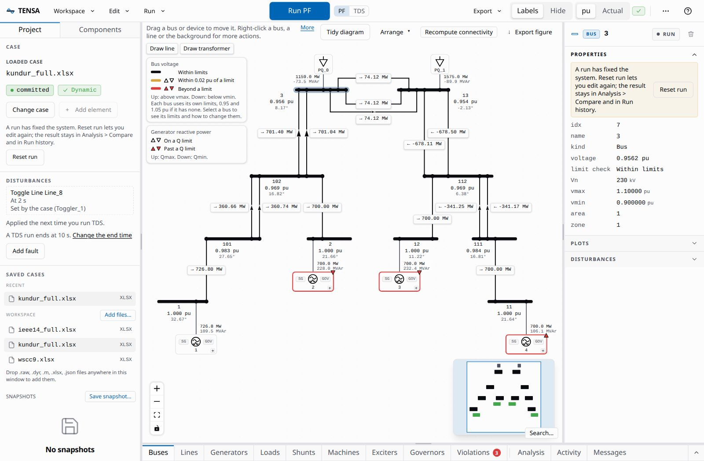

# TENSA

**T**ransients, **E**igenvalues & **N**etwork **S**imulation **A**pplication is an interactive, web-based workbench for power system modeling, simulation and analysis. You build a system visually, run power flow and dynamic studies with one click, watch the results stream in while a run is still going, and drive the same operations from a documented API. It runs on your own machine, in your browser.

TENSA is built on [ANDES](https://github.com/CURENT/andes), the power system simulator from CURENT, which does the computation. TENSA adds the workbench around it: the one-line diagram, the tables, the plots, the job handling, and an HTTP and WebSocket API that scripts and AI agents can use as well as the UI can.

## What you can do

- **Build or open a system.** Open one of the example cases (IEEE 14, Kundur and WSCC 9-bus), drop in your own `.xlsx`, `.raw`, `.dyr`, `.m` or `.json` files, or start blank and add buses, lines, transformers, generators, exciters, governors, a battery, loads and shunts from the UI.
- **Run five analyses.** Power flow, time-domain simulation, eigenvalue (small-signal) analysis, continuation power flow with PV and QV curves, and state estimation. Each runs as a job you can watch and cancel.
- **Disturb the system.** Bus faults, line or device trips, and scheduled parameter changes, applied in a time-domain run.
- **Read the results.** Voltage, flow and loading on the diagram, tables of every device, plots with cursors and response metrics, a list of the limits a power flow breaks, and a comparison of two power flows.
- **Keep and share them.** Save a system, take snapshots, export a self-contained HTML report, a COMTRADE record, CSV, or a reproducibility bundle.
- **Automate it.** Everything the UI does goes through the [API](api.md), so a script or an agent can do it too, and an [MCP server](agents.md) lets an assistant such as Claude run simulations as tools.

## Where to go next

| If you want to | Read |
| --- | --- |
| Install TENSA on Linux, macOS or Windows | [Install](install.md) |
| Load a case, run a power flow and a fault study | [Quick start](quickstart.md) |
| Know what each part of the window does | [UI tour](ui-tour.md) |
| Understand sessions, the workspace and why a run locks the case | [Concepts](concepts.md) |
| Drive TENSA from a script | [API guide](api.md) and the [route reference](reference/api.md) |
| Let an AI assistant run simulations | [Agents and MCP](agents.md) |
| Look up a `tensa` command or option | [Command line reference](reference/cli.md) |
| Fix something that does not work | [Troubleshooting](troubleshooting.md) |

## Good to know

- **It is local.** The server binds to loopback by default, there is no account, and nothing phones home. It has no authentication, so it trusts the user who runs it. [Concepts](concepts.md#trust-model) says what that means for case files and for network access.
- **Versions.** These pages describe the version of TENSA in the repository they were built from. `tensa --version` prints the TENSA and ANDES versions you have installed.
- **License.** TENSA is released under the GNU General Public License v3.0, the same license as ANDES.
