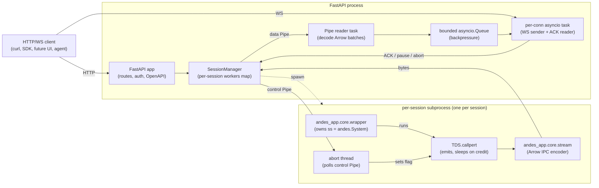

# feat: ANDES App — Phase A substrate (Python wrapper + FastAPI)

## Overview

Build the first phase of the ANDES App: a Python substrate that wraps ANDES (CURENT/andes) behind a stable FastAPI HTTP + WebSocket surface, with end-to-end coverage of power-flow (PF) and time-domain simulation (TDS) including basic disturbances (`Fault`, `Toggle`, `Alter`). The substrate is independently usable — agents, SDKs, and curl can drive ANDES through it without any UI. Phase A is followed by v0.1 (load + PF + SLD UI) and v0.2 (disturbance editor + TDS streaming UI), each in their own plan documents.

This plan covers Phase A only.

## Problem Frame

ANDES is a research-grade Python power-system simulator with no GUI today. The brainstorm (see origin: `docs/brainstorms/2026-05-07-accessible-andes-power-systems-app-requirements.md`) settled on a substrate-first architecture: build a stable HTTP/WebSocket surface around ANDES first, then layer a React UI on top in slices. Phase A is the substrate.

The primary persona is a power-systems researcher who currently runs ANDES from the CLI + edits text/spreadsheet case files + parses output in matplotlib notebooks. Phase A doesn't directly serve that persona (UI lands in v0.1+) — Phase A's customers are the v0.1 UI itself, future agents/SDKs, and the SaaS-hosted deployment that comes post-v1.0.

The substrate is **not a CLI shell-out architecture**. The ANDES CLI is too thin (only `run | plot | doc | misc | prepare | selftest`) and disturbances aren't CLI-accessible at all. Phase A calls the ANDES Python API in-process. CLI-Anything (HKUDS/CLI-Anything, named in the brainstorm) is a one-shot code generator for CLIs — not a runtime layer — and structurally mismatched to a Python-API-direct wrapper. We document this once in `docs/solutions/` and do not run a spike.

## Requirements Trace

Phase A satisfies the substrate-side requirements from the origin doc:

- R1. Stable FastAPI HTTP API backed by an in-process Python wrapper that owns a long-lived ANDES `System` instance per session
- R2. Both batch result delivery and websocket streaming for TDS; streaming choice is a per-call parameter
- R3. Substrate independently usable — Phase A definition-of-done is a curl-only walkthrough script that runs in CI
- R4. Accept ANDES-native case formats (xlsx, raw, dyr, json, m) with `.raw + .dyr` paired via `--addfile`
- R5 (substrate-side). Substrate persists case files and computed results. SLD layout coordinates are *not* substrate state — they live as a UI sidecar in v0.1.
- R21. Trust model statement implemented in code (case-load = code execution; local OS user trusted; loopback web origins not trusted; third-party case files not trusted by system but trusted by user when they choose to load)
- R22. Loopback-only binding by default; explicit `--bind` to expose elsewhere; per-launch random token gates the API. Token valid until process exit (per brainstorm).
- R23. Path canonicalization to a configurable workspace directory; symlinks resolved before boundary check; absolute paths and `..` traversals rejected at the FastAPI surface. ANDES's own internal file resolution is logged as best-effort, not enforced — see Key Technical Decisions.
- R24. Per-token concurrency limit; CSRF mitigated via token-in-explicit-header (not cookie); CORS allow-list precise; WebSocket upgrade requires same token (first-message handshake)
- R25. OpenAPI 3.1 with `operationId` per endpoint; description on every Pydantic field; explicit `responses[4xx]` declarations referencing `ProblemDetails`; OpenAPI-to-MCP generator runs at end of Phase A and the resulting MCP tool list has non-empty descriptions on every input field (R25 acceptance checkpoint)
- R26. Endpoints accept (and locally ignore) a `session_id` parameter via the URL path (the path slot is reserved); case files and results stored in workspace-relative paths; no implicit user-home or process-global state assumptions

## Scope Boundaries

- **No UI** in Phase A. React frontend, SLD canvas, design system, IEC 60617 iconography, time-series plots, scrub controls, disturbance timeline editor — all are v0.1 / v0.2.
- **No SLD layout coordinate persistence** in the substrate.
- **No multi-tenant SaaS** in Phase A. The forward-compat seams (R26) ship; auth, isolation, encryption, billing, multi-machine session routing do not.
- **No daily token rotation, no `andes-app warm-cache` subcommand, no signed release-asset cache distribution.** These are SaaS-grade operational features and belong in a future plan with the threat model in front of you.
- **No microbenchmark suite across IEEE 39/118/NPCC 140 with p95 latency targets.** Acceptance is the curl walkthrough on IEEE 14 only. Larger-case performance work belongs in v0.1+.
- **No structured access logger with `--log-format` flag.** Phase A disables uvicorn's access log and applies ASGI-scope token redaction; that's enough.
- **No EIG, contingency, OPF, market simulation, EMTP, custom user-defined dynamic models authored at runtime, CIM/CGMES import.** These are outside v0.1–v1.0 entirely.
- **No streaming protocol negotiation flexibility.** Phase A picks Apache Arrow IPC over WebSocket. Alternative wire formats are not supported.

### Deferred to Separate Tasks

- **v0.1 UI plan** (load case → SLD → run PF → results overlay) — separate plan document, written after Phase A lands.
- **v0.2 UI plan** (disturbance timeline editor + TDS streaming + animated plots + SLD scrub) — separate plan document, written after v0.1 lands. v0.2 owns the iterative disturbance-editor UX design and decides how the substrate's reload-on-edit cost is presented to the user.
- **Hosted SaaS deployment** with multi-tenancy, auth, and encryption — post-v1.0 phase. Daily token rotation, sandboxed case-file execution (Firecracker/gVisor), warm-cache distribution, multi-case microbenchmarks, structured observability — all in this phase.
- **Windows path-canonicalization implementation** — Phase A runs on Windows with a clear stderr warning about the limitation; full POSIX-equivalent enforcement is a follow-on plan.

## Context & Research

### Relevant Code and Patterns

- **Origin requirements doc**: `docs/brainstorms/2026-05-07-accessible-andes-power-systems-app-requirements.md` — single source of truth for product decisions.
- **ANDES upstream**: `github.com/CURENT/andes` (version 2.0.x as of 2026-Q2) — pinned via PEP 621 `[project.dependencies]`. The ANDES Python API used by Phase A: `andes.load(...)`, `andes.System.PFlow.run()`, `andes.System.TDS.run()`, the `Fault`/`Toggle`/`Alter` model entities, the `TDS.callpert` per-step hook, the `dae.ts` time-series store. **Verified against `andes/system/facade.py`, `andes/routines/tds.py`, `andes/io/__init__.py` during planning** — the lifecycle constraints (all `add()` calls require pre-setup; PFlow.run triggers setup; format detection uses path extension) shape the API contract.
- **CURENT sibling projects** (inspiration only, **not** dependencies — both GPLv3): `CURENT/agvis`, `CURENT/dime`.
- **Closest contemporary reference architecture**: `SanPen/VeraGrid` (formerly GridCal) — three-package engine/server/GUI split.
- **Closest sibling for HTTP shape**: `cerealkill/pandapower_api` — resource-shape reference.
- **PandaHub** (`e2nIEE/pandahub`) — useful auth/multi-project isolation reference for the post-v1.0 SaaS phase.

### Institutional Learnings

`docs/solutions/` does not exist yet. Two memories saved during brainstorming are relevant:
- `reference_andes_quirks.md` — non-obvious ANDES API constraints
- `project_andes_app.md` — project-level context

### External References

- **FastAPI 0.119.x** + Starlette ≥ 0.46. Pin `>=0.119,<0.120`.
- **WebSocket auth**: first-message handshake (simplest, costs one RTT); local-mode-only. (`peterbraden.co.uk/article/websocket-auth-fastapi/`.)
- **WebSocket backpressure**: bounded `asyncio.Queue` between IPC reader and WebSocket sender; credit-based flow control.
- **Per-session subprocess via `multiprocessing.Process` + `Pipe`** — pragmatic, zero-extra-deps. Jupyter Kernel Manager pattern.
- **Apache Arrow IPC over WebSocket** for time-series. FINOS Perspective is the production reference.
- **ANDES TDS hooks** (verified against ANDES source): `TDS.callpert(t, system)` is invoked once per step in the integration loop. Setting `tds.busted = True` cooperatively aborts the loop. `streaming_step` is gated on `system.runtime.dime_enabled`; we route streaming through `callpert`.
- **ANDES `setup()` lifecycle** (verified): `andes.load(...)` calls `setup()` by default; `ss.add(...)` is rejected post-setup for ALL model types (no structural/scheduled distinction). Phase A loads with `setup=False`, accepts disturbance definitions before commit, then `setup()` and runs. To add more disturbances after a PF or TDS run, the wrapper offers `reload_case()` which calls `andes.load(setup=False)` again — honest cost, no fake fast path.
- **Sandboxing prior art** (deferred to SaaS phase): Firecracker microVMs (E2B/Modal), gVisor.

## Key Technical Decisions

This section captures decisions whose reversal would change the API contract or the architectural shape. Tunable numeric defaults live in the Configuration Defaults table further down.

- **Substrate is Python-API-direct, not CLI-shell-out.** Verified: ANDES CLI doesn't expose disturbances; Python API exposes everything we need.
- **Per-session subprocess via `multiprocessing.Process` + two `multiprocessing.Pipe`s (data + control).** Pragmatic, zero-extra-deps. Threads-in-process rejected (ANDES is GIL-bound and stateful).
- **TDS streaming via `TDS.callpert` hook.** The callback emits a per-step state snapshot (selected DAE variables) into the data Pipe; FastAPI's WebSocket task pulls from a bounded `asyncio.Queue` fed by the Pipe reader. We do *not* monkey-patch `streaming_step` — `callpert` is the documented public hook.
- **Worker thread structure: main thread runs the wrapper command dispatch and the TDS integration loop (where `callpert` fires); a separate thread polls the control Pipe for `abort` signals.** When `callpert` is at the credit ceiling it `time.sleep`s briefly — this pauses the integration loop, but the abort thread is independent and can still set the abort flag. The wrapper's `callpert` callback checks the flag each invocation and sets `ss.TDS.busted = True` to terminate. (The earlier "yields the integration step" framing was misleading — `callpert` is a synchronous void callback inside ANDES's loop, not a coroutine. The mechanism is sleep-with-separate-abort-thread.)
- **Streaming wall-clock contract: when `?stream=ws` is requested, TDS integration wall-clock time is gated by streaming throughput.** Slow client → callpert sleeps → integration pauses. Batch mode (`?stream=ws` omitted) decouples — the worker runs at native ANDES speed and the result is delivered on completion. SessionManager watchdog escalates to `process.terminate()` if a session has unacked frames > credit window for > 30 s.
- **Single disturbance API.** All `Fault`/`Toggle`/`Alter` disturbances require pre-setup state in ANDES (verified against `andes/system/facade.py:362-407`). One endpoint `POST /sessions/{id}/disturbances` accepts a discriminated union; the wrapper rejects all `add()` calls if the System is already committed, with a clear `DisturbanceCommitError` payload directing the caller to `reload_case`.
- **`reload_case()`** is the only way to return to editable state after a PF or TDS run. It calls `andes.load(setup=False)` again — full re-parse. Cost is honest; no fake fast path. (Brainstorm reference_andes_quirks.md confirms ANDES has no public mechanism for skipping the parse.) v0.2 plan owns the question of how the iterative editor UX presents this cost to the user.
- **Session lifecycle in walkthrough order:** create session → load case (`setup=False`) → add disturbances → run PF (the wrapper calls `ss.setup()` explicitly first if not yet committed; `PFlow.run()` itself does NOT auto-call setup — verified against ANDES 2.0.0) → run TDS → optionally `reload_case` to add more disturbances → run PF/TDS again. The walkthrough script and sequence diagrams reflect this order. (Earlier "load → run PF → add Fault → run TDS" was structurally impossible.)
- **Apache Arrow IPC over WebSocket for time-series streaming.** Server-side `pyarrow.ipc.new_stream`; client-side `apache-arrow` JS library. JSON for control messages.
- **N-rows-per-Arrow-batch is the default emit shape.** Each emit aggregates `1/max_rate_hz` worth of source steps into one RecordBatch.
- **Anti-aliased decimation by default; raw-rate `?decimation=none` opt-out for spectral debugging.** Default mode emits the boxcar mean over the aggregation window; researchers wanting raw integration steps for spectral analysis pass `?decimation=none&max_rate_hz=very-high`. Stream-start metadata declares `decimation: {algorithm, source_rate_hz, output_rate_hz, mode}` so a v0.2 UI can render a "downsampled — not suitable for spectral analysis" indicator. Note: boxcar mean over adaptive-step samples is not formally anti-aliased; the implementer is encouraged to require fixed-step TDS (`h` configured) when streaming, or to label the metadata honestly. Pin: when `?decimation=mean` is active and the integrator is fixed-step, label `algorithm: "boxcar-mean"`; otherwise label `algorithm: "boxcar-mean-best-effort"` with a comment that the math is only valid for uniform sampling.
- **WebSocket auth via first-message handshake** for v0.1. `accept()`, then client sends `{type: "auth", token}` within a 2-second deadline; on auth failure the server `close(code=4401)`. (Subprotocol-based auth was considered; rejected as v0.1 requirement because Sec-WebSocket-Protocol values leak via reverse-proxy logs and browser dev-tools and the security gain over first-message handshake is small. SaaS phase will design a real WS auth mechanism — likely short-lived upgrade ticket fetched via authenticated HTTP.)
- **Token storage: file at `~/.andes-app/run-<pid>.token` with mode `0600`.** The directory itself is created with mode `0700`. Stderr prints the **path** to the token file, not the token value. Token is valid until process exit (per brainstorm R22 — no rotation in v0.1).
- **Token redaction at the ASGI scope level.** The auth middleware replaces the `X-Andes-Token` header value with sentinel `b"<redacted>"` in the request scope's headers list before passing to any downstream log formatter or exception handler. uvicorn's default `access_log` is disabled. FastAPI's default exception responses are configured to omit `request.headers` and `request.body` in non-debug mode. Custom 422 handler strips token-shaped string values from any `loc` position before formatting (not only the header location) — a constant-time match against the active token catches the wrong-field-leak case.
- **Loopback-only binding by default.** `andes-app serve` binds `127.0.0.1`. `--bind` accepts an alternate; emits a stderr warning every startup. No `--insecure-no-auth` flag — tests use `--token-file <fixture>` to inject a known token.
- **CORS allow-list is precise:** `http://127.0.0.1:<port>` and `http://localhost:<port>` only. Reject wildcards, `null`, and `chrome-extension://` / `moz-extension://` origins.
- **Server-side Host/Origin check** as **pure ASGI middleware** (not `BaseHTTPMiddleware`) so it covers HTTP and WebSocket-upgrade scopes. Verified by an explicit test that fires a WS upgrade with bad Host and asserts rejection.
- **Workspace directory model.** Default workspace is `~/.andes-app/cases`, created mode `0700` if missing. `--workspace` overrides; the configured root is canonicalized once at startup. All client-supplied paths are resolved relative to the root, opened with `O_NOFOLLOW | O_CLOEXEC`, canonicalized via the underlying file descriptor, and rejected if the canonical target escapes the root. Absolute client paths rejected. **Important:** ANDES is invoked with the canonical real path (with original extension preserved), not `/proc/self/fd/N`, because ANDES's format detection (`andes/io/__init__.py:78-116`) uses `os.path.splitext` and would silently misclassify fd-paths. The TOCTOU window between canonicalization and ANDES `open()` is acknowledged as a residual risk and mitigated by directory permissions (`0700`) — no other local user can swap symlinks.
- **`--strict-fs` is best-effort logging, not a security boundary.** A worker-side `sys.audit("open", ...)` hook (Python 3.8+) logs all Python-level file opens during `load`/`setup`/`run`. Reads from C extensions (numpy/openpyxl/pandas/SymEngine) are NOT caught by this hook — kernel-level enforcement (Linux seccomp `openat`/`openat2`, or Landlock) would be required for an actual boundary, and that is deferred to the SaaS phase. R21 docstring names this gap explicitly: in v0.1 single-user-trusted mode, the audit hook surfaces unexpected reads for debugging but does not prevent them.
- **Session creation has its own concurrency cap, separate from in-flight runs.** `--max-sessions` for new session creation; 1 in-flight `run_pflow` or `run_tds` per session. Returns 429 when at the cap.
- **`session_id` is server-generated only.** `POST /sessions` rejects body-supplied `session_id` with 422.
- **Session ID, ANDES `idx`, and human names all visible at the HTTP boundary.** Topology and result responses use ANDES `idx` (the persona already knows it from notebooks) plus the human-readable `name` field; both fields are documented as the stable contract. (No opaque substrate-ID layer — that abstraction was removed during deepening review for adding cross-cutting complexity without protecting against an actual ANDES API change. ANDES_VERSIONS.md monitors `idx` stability across version bumps; if a future ANDES major changes `idx` semantics, the substrate adds a remapping layer at that point.)
- **OpenAPI 3.1 with stable `operationId`s, descriptions on every Pydantic field, and explicit `responses[4xx]` declarations referencing `ProblemDetails`.** R25 acceptance: a CI test runs an OpenAPI-to-MCP generator and asserts the resulting MCP tool list contains the expected operationIds AND every input/output field has a non-empty description.
- **macOS orphan-detection.** Linux uses `PR_SET_PDEATHSIG(SIGTERM)`. macOS has no equivalent — a worker-side watchdog thread polls `os.getppid() == 1` every 1 s and self-SIGTERMs on detect.
- **No CLI-Anything in the runtime path; no spike unit.** `docs/solutions/2026-05-07-cli-anything-andes-architectural-mismatch.md` documents the architectural mismatch (one-shot CLI generator vs. Python-API-direct wrapper) as institutional learning. No 30-minute spike — the decision is settled.
- **Phase A runs on Linux, macOS, and Windows.** Path canonicalization is implemented for POSIX; on Windows it falls back to `pathlib.Path.resolve()` with an explicit stderr warning naming the limitation: workspace boundary is best-effort on Windows; loading case files from outside the workspace is not prevented. Consistent with R21's "user accepts the risk consciously when loading case files."

## Configuration Defaults

These are starting values; the implementer tunes them from microbenchmark data during Unit 8. Each is reversible without changing the API contract.

| Setting | Default | Notes |
|---|---|---|
| `--bind` | `127.0.0.1` | Non-loopback bind warns at startup |
| `--port` | OS-assigned ephemeral | Printed to stderr at startup |
| `--workspace` | `~/.andes-app/cases` | Created mode `0700` if missing |
| `--max-sessions` | `min(4, max(1, cpu_count // 2))` | Defends ~16 GB laptop with ~500 MB worker RSS |
| `--idle-timeout-seconds` | `180` | 3 min; reaped if no command sent |
| `--worker-rss-limit-mb` | `1500` | Enforced via `RLIMIT_AS` on Linux; macOS coverage best-effort |
| WS auth deadline | `2 s` | Time after `accept()` before close-on-no-auth |
| `max_rate_hz` (per-call default) | `60` | Decimation output rate; configurable per TDS run |
| Credit window | `max(2 × max_rate_hz, 200)` frames | `outstanding > N` stalls callpert |
| `asyncio.Queue` size | = credit window | One bound dominates |
| WS reconnect ring buffer | `30 s × max_rate_hz` frames | Sized at session start |
| Watchdog escalation | `30 s` no-ACK → `terminate`; `5 s` grace → `kill` | |

## Open Questions

### Resolved During Planning

- **CLI-Anything role**: documented architectural mismatch in `docs/solutions/`; not used. No spike.
- **In-process worker model**: per-session subprocess via `multiprocessing.Process` + two `Pipe`s.
- **TDS streaming source**: `TDS.callpert` per-step hook; sleep-on-credit-ceiling with separate abort thread.
- **ANDES setup() lifecycle strategy**: load with `setup=False`, accept disturbances pre-commit, then setup-and-run. No structural/scheduled split (verified: ANDES rejects all post-setup `add()` calls). `reload_case()` is the only escape hatch and is honest about cost.
- **Wire format for streaming**: Apache Arrow IPC over WebSocket; N-rows-per-batch.
- **WebSocket auth pattern**: first-message handshake only for v0.1; subprotocol pattern explicitly deferred to SaaS phase with a real auth mechanism.
- **Token rotation**: not in v0.1 (per brainstorm R22, valid until process exit).
- **Windows policy**: run on Windows with a stderr warning about the path-canonicalization limitation. Full implementation deferred.
- **Substrate ID minting**: not in Phase A. ANDES `idx` + `name` are the stable HTTP contract.
- **Frontend stack** (informational only — out of Phase A scope): Vite 6 + React 19 + TypeScript + Tailwind v4 + Radix Primitives + react-resizable-panels + React Flow 12 + ELK. Decision belongs to v0.1 plan but Phase A's API shape is designed knowing this stack.

### Deferred to Implementation

- **Exact ANDES version pin**. CI matrix probes ANDES 2.0.x; final pin is the latest stable that passes the Unit 6 streaming-hook verification.
- **Pydantic schemas for disturbance definitions.** Implementer derives the canonical shape from ANDES `Fault`/`Toggle`/`Alter` model `params` after touching code; the plan specifies the contract (start time, end time, location reference by ANDES `idx`, parameter map) but not the field-level schema.
- **Decimation algorithm details.** Default declared in Key Technical Decisions: boxcar mean (with the "best-effort" caveat for adaptive-step) and `?decimation=none` opt-out. Implementer picks the exact filter shape (boxcar, windowed mean, or simple lowpass).
- **Specific OpenAPI-to-MCP generator chosen for the R25 acceptance check.**
- **Pydantic field-description audit tooling.** The R25 acceptance test asserts every Pydantic field has a non-empty `description`; implementer picks the audit mechanism (custom pytest fixture, schemathesis-derived check, or similar).
- **macOS watchdog cadence.** Worker watchdog polls `os.getppid() == 1` every 1 s as the floor; implementer may tune.
- **`asyncio.Queue` size if it ends up needing to differ from credit window.** Default plan has them equal.
- **Backoff policy on session reaper.** When idle-timeout reaps a session, default = silent reap; an explicit error fires on the next API call referencing the dead session.

## Output Structure

```text
.
├── docs/
│   ├── brainstorms/
│   │   └── 2026-05-07-accessible-andes-power-systems-app-requirements.md
│   ├── plans/
│   │   └── 2026-05-07-001-feat-andes-app-phase-a-substrate-plan.md
│   └── solutions/
│       └── 2026-05-07-cli-anything-andes-architectural-mismatch.md
├── server/
│   ├── pyproject.toml
│   ├── README.md
│   ├── ANDES_VERSIONS.md
│   ├── src/
│   │   └── andes_app/
│   │       ├── __init__.py
│   │       ├── __main__.py
│   │       ├── cli.py
│   │       ├── api/
│   │       │   ├── __init__.py
│   │       │   ├── app.py
│   │       │   ├── auth.py
│   │       │   ├── routes/
│   │       │   │   ├── __init__.py
│   │       │   │   ├── sessions.py
│   │       │   │   ├── cases.py
│   │       │   │   ├── pflow.py
│   │       │   │   ├── disturbances.py
│   │       │   │   ├── tds.py
│   │       │   │   └── ws.py
│   │       │   └── schemas.py
│   │       ├── core/
│   │       │   ├── __init__.py
│   │       │   ├── session.py
│   │       │   ├── worker.py
│   │       │   ├── wrapper.py
│   │       │   ├── disturbance.py
│   │       │   └── stream.py
│   │       ├── security/
│   │       │   ├── __init__.py
│   │       │   ├── token.py
│   │       │   ├── paths.py
│   │       │   └── middleware.py
│   │       └── workspace/
│   │           └── (runtime case storage; not committed)
│   └── tests/
│       ├── unit/
│       ├── integration/
│       └── acceptance/
│           └── walkthrough.sh
├── scripts/
│   └── ci-matrix.sh
├── .github/
│   └── workflows/
│       └── server.yml
├── AGENTS.md
├── README.md
├── LICENSE
└── .gitignore
```

## High-Level Technical Design

> *This illustrates the intended approach and is directional guidance for review, not implementation specification. The implementing agent should treat it as context, not code to reproduce.*

### Component shape



### Sequence: load case → add disturbances → run PF → run TDS

```mermaid
sequenceDiagram
    participant C as Client
    participant A as FastAPI
    participant S as SessionManager
    participant W as Worker subprocess
    C->>A: POST /sessions (with X-Andes-Token)
    A->>S: create session
    S->>W: spawn process, init wrapper
    W-->>S: ready
    S-->>A: {session_id}
    A-->>C: 201 {session_id}
    C->>A: POST /sessions/{id}/case (path: workspace/IEEE14.xlsx)
    A->>S: validate path, forward
    S->>W: load_case(setup=False)
    W-->>S: topology summary (idx + name)
    S-->>A: {topology}
    A-->>C: 200 {topology}
    C->>A: POST /sessions/{id}/disturbances (Fault on bus 4 at t=1.0s)
    A->>S: forward
    S->>W: add disturbance (pre-setup)
    W-->>S: assigned ANDES idx
    S-->>A: {disturbance_idx}
    A-->>C: 200
    C->>A: POST /sessions/{id}/pflow
    A->>S: forward
    S->>W: ss.setup() (explicit, if not committed) + PFlow.run()
    W-->>S: PF results
    S-->>A: results
    A-->>C: 200 {pf_results}
    C->>A: POST /sessions/{id}/tds (with stream=ws)
    A-->>C: 200 {run_id, streaming_url: "/ws/{session_id}"}
    Note over C,W: Client opens WebSocket; auth handshake; streaming begins
    C->>A: (optional) POST /sessions/{id}/reload to add more disturbances
    A->>S: reload
    S->>W: andes.load(setup=False) (full re-parse)
    W-->>S: topology summary
    S-->>A: {topology}
    A-->>C: 200
```

### Trust boundary

- HTTP/WS surface trusts only callers that present `X-Andes-Token` (HTTP) or pass token in first WS message.
- FastAPI process trusts the SessionManager, which trusts worker subprocesses.
- Worker subprocess loads case files, which **may execute arbitrary Python at parse time**. The local OS user is trusted with that execution; in v0.1 single-user local mode the worker runs as the user. SaaS phase adds subprocess sandboxing (gVisor/Firecracker) — not in Phase A.
- `--strict-fs` audit hook surfaces unexpected file reads from ANDES's secondary path resolution (addfile, dynamic-model paths) but does not prevent them — kernel-level enforcement (seccomp / Landlock) is SaaS-phase work.

## Implementation Units

- [ ] **Unit 1: Project scaffolding and tooling**

**Goal:** Stand up the monorepo skeleton, Python project metadata, dev tooling, CI workflow, license, and AGENTS.md.

**Requirements:** R26 (workspace-relative paths in tooling).

**Dependencies:** None.

**Files:**
- Create: `.gitignore`, `LICENSE` (MIT), `README.md`, `AGENTS.md`
- Create: `server/pyproject.toml` (PEP 621; runtime deps include `fastapi>=0.119,<0.120`, `uvicorn[standard]`, `pyarrow`, `pydantic>=2`, `andes>=2.0,<3.0`, `typer`)
- Create: `server/README.md`, `server/ANDES_VERSIONS.md`
- Create: `server/src/andes_app/__init__.py`, `server/src/andes_app/__main__.py`
- Create: `.github/workflows/server.yml`, `scripts/ci-matrix.sh`
- Create: `docs/solutions/2026-05-07-cli-anything-andes-architectural-mismatch.md` (one-paragraph note on why CLI-Anything is structurally mismatched to a Python-API-direct wrapper; future ANDES wrapper projects can read this and skip a spike)

**Approach:**
- Single-package Python project under `server/`, src layout.
- AGENTS.md is short and prescriptive: pinned versions, "Python-API direct, no CLI shell-out," "no opaque ID layer — ANDES `idx` + `name` are the contract," "workspace-relative paths," security posture summary.
- CI runs `ruff check`, `mypy --strict`, `pytest -m "not acceptance"`, then `pytest -m acceptance`.

**Patterns to follow:** PEP 621 + src layout.

**Test scenarios:** Test expectation: none — pure scaffolding.

**Verification:**
- `pip install -e ./server` works in a fresh venv.
- `pytest server/tests` collects zero tests, no failures.
- `ruff check` and `mypy --strict` pass.
- CI workflow runs green.

---

- [ ] **Unit 2: ANDES Python wrapper + per-session subprocess worker**

**Goal:** Build the in-worker Python module that owns an ANDES `System` instance, with a per-session subprocess host. The wrapper exposes a small domain API consumed by the FastAPI surface via two `multiprocessing.Pipe`s.

**Requirements:** R1, R2, R26.

**Dependencies:** Unit 1.

**Files:**
- Create: `server/src/andes_app/core/__init__.py`
- Create: `server/src/andes_app/core/wrapper.py`
- Create: `server/src/andes_app/core/worker.py`
- Create: `server/src/andes_app/core/session.py`
- Create: `server/src/andes_app/core/disturbance.py`
- Test: `server/tests/integration/test_wrapper.py`
- Test: `server/tests/integration/test_session_lifecycle.py`

**Approach:**
- Wrapper is a synchronous Python class. Lives inside the subprocess, never inside the FastAPI event loop.
- `load_case(path, addfiles)` calls `andes.load(path, addfile=addfiles, setup=False)`.
- `add_disturbance(spec)` accepts a discriminated-union spec for `Fault` / `Toggle` / `Alter`. Calls `ss.add('Fault'|'Toggle'|'Alter', ...)` on the still-pre-setup System. Returns the assigned ANDES `idx`. Raises `DisturbanceCommitError` if the System is already committed (caller must `reload_case` to add more).
- `run_pflow()` first calls `ss.setup()` if `not ss.is_setup` (PFlow.run does *not* auto-call setup — verified against ANDES 2.0.0; calling PFlow.run on a non-setup System raises `IndexError` because `ss.dae` has no allocated address space). After successful setup + PF, `add_disturbance` will fail until `reload_case` is called. If `ss.setup()` returns False or raises, the wrapper surfaces a structured `SetupFailedError` (HTTP 422 with rfc7807 `ProblemDetails`) and marks the session as "requires reload" so the next call referencing the broken state guides the caller to `/reload`.
- `run_tds(spec, on_step, abort_flag)` configures `tf` and `h`, sets `ss.TDS.callpert = lambda t, system: on_step(t, system, abort_flag)`, calls `ss.TDS.run()`. The callback aggregates `1/max_rate_hz` of source steps into one Arrow batch and emits via the data Pipe. When at credit ceiling, `time.sleep(small)`. Checks `abort_flag` each invocation and sets `ss.TDS.busted = True` if requested.
- `reload_case()` calls `andes.load(path, setup=False)` again — full re-parse. Documented in the OpenAPI spec as having "case-load cost; expect multi-second latency on large cases."
- `topology_snapshot()` returns ANDES `idx` + `name` for buses/lines/transformers/generators/loads. Pre-setup vs post-setup field availability is exposed via a `state: "pre-setup" | "committed"` field; post-setup-only computed fields are nullable until commit.
- Worker subprocess: main thread runs the wrapper command dispatch loop and the TDS integration loop. **Dedicated abort thread** owns a separate read end of the control Pipe (or a `multiprocessing.Event`) and watches independently of `callpert` — sets a thread-safe abort flag that `callpert` checks. **Linux**: `PR_SET_PDEATHSIG(SIGTERM)` set in subprocess entry. **macOS**: orphan-detection thread polls `os.getppid() == 1` every 1 s.
- `SessionManager` tracks `{session_id: (process, control_pipe, data_pipe, async_reader_task, watchdog_task)}`. Spawn on `POST /sessions`; cleanup on `DELETE /sessions/{id}` and on idle timeout. **Watchdog** calls `process.terminate()` if a session has unacked frames > credit window for > 30 s.
- Idle-timeout default 180 seconds.
- `RLIMIT_AS` enforced in subprocess entry on Linux; documented as best-effort on macOS.

**Execution note:** Start with a failing integration test that drives the wrapper end-to-end against IEEE 14 (load → add Fault → PF → TDS → assert callpert fired N times). The wrapper API shape settles when this test passes.

**Patterns to follow:**
- Jupyter Kernel Manager pattern.
- `multiprocessing.Process` + `multiprocessing.Pipe`.
- `PR_SET_PDEATHSIG(SIGTERM)` on Linux.

**Test scenarios:**
- Happy path: load IEEE 14, add Fault on bus 4 at t=1.0s, run PF (auto-setup), assert PF converged and slack-bus voltage ≈ 1.0∠0°. Then run 5 s TDS, assert ≥ 600 callpert invocations and final time ≥ 4.99s.
- Happy path: load IEEE 14 + IEEE 14 dyr via addfile.
- Edge case: call `add_disturbance` after PF has run. Expected: `DisturbanceCommitError` directing caller to `reload_case`.
- Edge case: call `reload_case` after a TDS run, add another Fault, run TDS again. Expected: works — fresh System, full re-parse.
- Edge case: call `run_pflow` before `load_case`. Expected: `NoCaseLoadedError`.
- Edge case: `add_disturbance` with bad bus idx. Expected: clear validation error.
- Error path: load a non-existent case path. Expected: `CaseLoadError` with the path.
- Error path: load a malformed case. Expected: error wraps the underlying ANDES exception; worker survives.
- Error path: `ss.setup()` returns False (e.g., addressing collision) when called inside `run_pflow`. Expected: `SetupFailedError` with structured detail; session is marked "requires reload"; subsequent calls referencing the broken state return 422 directing the caller to `/reload`.
- Error path: `ss.setup()` raises mid-way (partial mutation possible — e.g., calc_pu_coeff already ran). Expected: same `SetupFailedError` path; `reload_case` called on the next caller request fully restores the System from disk.
- Integration: spawn worker, send `load_case` over control Pipe, receive topology over data Pipe within 5 s.
- Integration: run TDS, send `abort` mid-run at t=2.0s, verify TDS terminates within next 2 integration steps and worker reports `busted=True`.
- Integration: kill the FastAPI parent on Linux, verify worker exits within 1 s (PR_SET_PDEATHSIG).
- Integration: simulate parent death on macOS (set parent's pid temporarily to 1 in test), verify watchdog thread reaps worker within 2 s.
- Integration: idle a session for 4 minutes (with shortened test timeout), verify reaper kills it.

**Verification:**
- `pytest` integration tests pass.
- `mypy --strict` passes.
- Worker process is observable via `SessionManager.list_sessions()`; killing reflects in subsequent calls.

---

- [ ] **Unit 3: FastAPI app skeleton + auth + session resource routes**

**Goal:** Stand up the FastAPI application with auth middleware, session lifecycle endpoints, OpenAPI metadata, and the path-canonicalization service.

**Requirements:** R1, R3, R22, R23, R24, R26.

**Dependencies:** Unit 2.

**Files:**
- Create: `server/src/andes_app/cli.py` (Typer-based; flags from Configuration Defaults table)
- Create: `server/src/andes_app/api/__init__.py`, `server/src/andes_app/api/app.py`, `server/src/andes_app/api/auth.py`, `server/src/andes_app/api/schemas.py`
- Create: `server/src/andes_app/api/routes/__init__.py`, `server/src/andes_app/api/routes/sessions.py`
- Create: `server/src/andes_app/security/__init__.py`, `server/src/andes_app/security/token.py`, `server/src/andes_app/security/paths.py`, `server/src/andes_app/security/middleware.py`
- Test: `server/tests/unit/test_paths.py`, `server/tests/unit/test_token.py`, `server/tests/integration/test_sessions_api.py`

**Approach:**
- `andes-app serve` binds `127.0.0.1` by default. `--bind` accepts an alternate; emits a stderr warning.
- **On Windows**, prints a stderr warning at startup naming the path-canonicalization limitation, then continues. (Phase A runs on Windows; full POSIX-equivalent enforcement is deferred.)
- **Token**: 32 random bytes, hex-encoded, generated at process start. Written to `~/.andes-app/run-<pid>.token`, mode `0600`; parent dir `~/.andes-app/` created mode `0700` if missing. Stderr prints the path. Validated as a FastAPI dependency via `X-Andes-Token` header. Optional `--token-file <path>` overrides location for CI fixtures.
- **CORS allow-list precise**: `http://127.0.0.1:<port>` and `http://localhost:<port>` only. Rejects wildcards, `null`, `chrome-extension://*`, `moz-extension://*`.
- **Host/Origin check** as **pure ASGI middleware** (covers HTTP and WebSocket-upgrade scopes).
- **Path canonicalization** (`security/paths.py`):
  - Open user-supplied path with `O_NOFOLLOW | O_CLOEXEC`.
  - Canonicalize via the open file descriptor (Linux: `os.readlink("/proc/self/fd/<n>")`; macOS: `fcntl(F_GETPATH)`).
  - Reject if canonical path is not under workspace root.
  - Reject absolute client paths and paths with `\x00`.
  - Pass the **canonical real path** (with original extension preserved) to ANDES — *not* the fd-path, because ANDES's format detection uses extension. The TOCTOU window is bounded by workspace `0700` permissions (no other local user can swap symlinks).
- **Workspace dir** auto-created mode `0700` if missing; `--workspace` flag warns if pointing to a directory with broader permissions.
- **Session creation cap** + **per-session run cap** as separate `asyncio.Semaphore`s. 429 with `Retry-After` when at the cap.
- **Server-generated `session_id`**. Body-supplied `session_id` returns 422.
- **Per-worker `RLIMIT_AS`** in subprocess entry (Linux; best-effort macOS).
- **OpenAPI**: every route gets a stable `operationId`. Every Pydantic field has an explicit `description`. Every route has a docstring summary. Every route has explicit `responses[4xx]` declarations referencing `ProblemDetails`.
- **Token redaction at the ASGI scope level**: the auth middleware replaces `X-Andes-Token` value with `b"<redacted>"` in the request scope before any downstream handler/log/exception sees it. Custom 422 handler strips token-shaped values from any field by constant-time match against the active token.
- **uvicorn `access_log` disabled.** No structured access logger ships with v0.1; the substrate is local-only.

**Patterns to follow:** FastAPI `Depends(...)` for auth and session resolution; pydantic v2 separate request/response models.

**Test scenarios:**
- Happy path: `POST /sessions` with valid token returns 201; `GET /sessions/{id}` returns metadata; `DELETE /sessions/{id}` returns 204 and reaps the worker.
- Edge case: `POST /sessions` without token → 401; with invalid token → 401.
- Edge case: `Host: example.com` on a localhost-bound server → 400.
- Edge case: `Origin: http://evil.example.com` → CORS reject; `Origin: chrome-extension://xyz` → reject; `Origin: null` → reject.
- Edge case: WS upgrade with bad Host → also rejected (proves middleware applies to WS scope).
- Edge case: `POST /sessions` with body `{session_id: "attacker"}` → 422.
- Error path: case path with `..` → 400.
- Error path: symlink within workspace pointing outside → 400 (after symlink resolution).
- Error path: absolute path `/etc/passwd` → 400.
- Edge case: `~/.andes-app/` doesn't exist → server creates it mode `0700` and proceeds; verified by `os.stat`.
- Edge case: Token file is mode `0600`; verified by `os.stat`.
- Integration: per-session run concurrency — start 2 PF runs concurrently; second returns 429.
- Integration: per-token session-creation cap — at limit, next `POST /sessions` returns 429.
- Integration: token leak check — grep all stdout/stderr/log output across a 100-request run for the token's first 8 chars and last 8 chars; expect zero matches.

**Verification:**
- All tests pass.
- `andes-app serve --workspace /tmp/cases` prints token-file path; `curl -H "X-Andes-Token: $(cat <path>)" http://127.0.0.1:<port>/sessions -X POST` returns 201.
- `curl http://127.0.0.1:<port>/openapi.json | jq '.paths'` enumerates expected operationIds with descriptions.

---

- [ ] **Unit 4: Case load + power-flow endpoints**

**Goal:** Wire `/sessions/{id}/case`, `/sessions/{id}/topology`, `/sessions/{id}/pflow`, `/sessions/{id}/reload` through to the wrapper.

**Requirements:** R1, R3, R4, R5.

**Dependencies:** Unit 3.

**Files:**
- Create: `server/src/andes_app/api/routes/cases.py` (`POST /sessions/{id}/case`, `GET /sessions/{id}/topology`, `POST /sessions/{id}/reload`)
- Create: `server/src/andes_app/api/routes/pflow.py` (`POST /sessions/{id}/pflow`, `GET /sessions/{id}/pflow/{run_id}`)
- Modify: `server/src/andes_app/api/schemas.py` (`LoadCaseRequest`, `TopologySummary`, `BusEntry`, `LineEntry`, `GeneratorEntry`, `PflowRunRequest`, `PflowResult`)
- Modify: `server/src/andes_app/api/app.py` (register routers)
- Test: `server/tests/integration/test_cases_api.py`, `server/tests/integration/test_pflow_api.py`

**Approach:**
- `LoadCaseRequest`: `{primary_path: str, addfiles: list[str] | None}`, both relative to workspace root.
- Path validation per Unit 3; canonical real path passed to ANDES (preserving extension).
- `TopologySummary`: `{state: "pre-setup" | "committed", buses: [...], lines: [...], transformers: [...], generators: [...], loads: [...]}`. Each entry includes ANDES `idx`, `name`, `kind` (model class), and pre-setup-stable fields. Post-setup-required computed fields are nullable until the System is committed.
- `POST /sessions/{id}/topology` is read-only.
- `POST /sessions/{id}/pflow` synchronously runs PF. The wrapper calls `ss.setup()` first if needed (PFlow.run does not auto-call setup; see Unit 2). Returns `PflowResult`: `{run_id, converged, iterations, mismatch, buses: [{idx, name, voltage, angle, p_inj, q_inj, limit_violations: [...]}], lines: [...]}`. If `setup()` fails (returns False or raises), the response is 422 with `SetupFailedError` body and a hint to call `/reload`.
- `POST /sessions/{id}/reload` reverts the wrapper to pre-setup state by calling `andes.load(setup=False)` again. Returns the new `TopologySummary`. Documented in OpenAPI as "case-load cost; expect multi-second latency on large cases — see ANDES_VERSIONS.md for measured times."
- Stored result: each PF run persists to `<workspace>/sessions/<session_id>/runs/<run_id>.json` via atomic write (temp + fsync + rename).
- ANDES secondary file reads are logged via the worker's `sys.audit("open", ...)` hook — best-effort visibility, not enforcement (R23 caveat in trust-model docstring).

**Patterns to follow:** Resource shape per `cerealkill/pandapower_api`; pydantic v2 discriminated unions where applicable.

**Test scenarios:**
- Happy path: load IEEE 14 (xlsx); topology has 14 buses + 20 branches + 5 generators with `state: "pre-setup"`. Run PF; topology re-fetched has `state: "committed"` and computed fields populated.
- Happy path: load IEEE 14 (.raw) + IEEE 14 (.dyr) via addfile.
- Happy path: PV-bus Q-limit hit — PF result has the bus flagged in `limit_violations`.
- Edge case: load with empty addfile list — same as no addfile.
- Edge case: PF non-convergence — 200 with `converged: false`, full iteration log, last mismatch. Session stays alive.
- Edge case: `reload` after PF run — 200 with `state: "pre-setup"`, fresh topology.
- Error path: case path with `..` → 400.
- Error path: case path doesn't exist in workspace → 400 (clear path-not-found, not "ANDES failed").
- Error path: malformed case → 422 with underlying error message; session alive.
- Integration: load IEEE 14, run PF twice, both runs queryable by `run_id`.

**Verification:**
- All tests pass.
- OpenAPI spec at `/openapi.json` includes `loadCase`, `getTopology`, `runPflow`, `getPflowResult`, `reloadCase` with stable operationIds and descriptions.

---

- [ ] **Unit 5: Disturbance management + TDS endpoints (batch mode)**

**Goal:** Wire single `POST /sessions/{id}/disturbances` (with discriminated-union Fault/Toggle/Alter), `GET /sessions/{id}/disturbances`, `DELETE /sessions/{id}/disturbances/{andes_idx}`, and `POST /sessions/{id}/tds` (batch result delivery — streaming added in Unit 6).

**Requirements:** R1, R2 (batch path), R3.

**Dependencies:** Unit 4.

**Files:**
- Create: `server/src/andes_app/api/routes/disturbances.py`
- Create: `server/src/andes_app/api/routes/tds.py` (`POST /sessions/{id}/tds`, `GET /sessions/{id}/tds/{run_id}`)
- Modify: `server/src/andes_app/api/schemas.py` (`DisturbanceDef` discriminated union; `TdsRunRequest`; `TdsBatchResult`)
- Test: `server/tests/integration/test_disturbances_api.py`, `server/tests/integration/test_tds_batch.py`

**Approach:**
- `DisturbanceDef` is a discriminated union over `kind: "fault" | "toggle" | "alter"`. Each variant carries the fields needed by the corresponding ANDES model. Bus / line / generator references use ANDES `idx`.
- `POST /sessions/{id}/disturbances` accepts a list of definitions. Wrapper rejects with `DisturbanceCommitError` (409) if the System is already committed; response body includes guidance: "call `POST /sessions/{id}/reload` to return to pre-setup state."
- `GET /sessions/{id}/disturbances` returns the current pre-setup disturbance list (ANDES idx + spec).
- `DELETE /sessions/{id}/disturbances/{andes_idx}` works only pre-setup; same `DisturbanceCommitError` post-setup.
- `POST /sessions/{id}/tds` calls `ss.setup()` if needed (same rule as PF — TDS.run does not auto-call setup), then `TDS.run()`. Without `?stream=ws`, blocks until completion and returns `TdsBatchResult`. Streaming is Unit 6.
- `TdsBatchResult` is `{run_id, converged, final_t, state_vars: [...], time: [...], values: [[...]]}` (compact array form).

**Patterns to follow:** Same as Unit 4.

**Test scenarios:**
- Happy path: load IEEE 14 (.raw + .dyr), add Fault on bus 4, run TDS batch with `tf=5, h=1/120`. Assert response has `converged: true`, `final_t: 5.0`, and `values` has at least 600 timesteps.
- Happy path: add Fault + Toggle (line trip) + Alter (parameter change at scheduled time), run TDS, all three apply at their times.
- Happy path: list disturbances pre-setup; delete one; re-list shows N-1.
- Edge case: add disturbance after PF has run → 409 with `DisturbanceCommitError` payload directing to `/reload`.
- Edge case: delete disturbance after PF run → 409.
- Edge case: `reload` after PF, then add another Fault, then run TDS → works.
- Error path: `Fault` at non-existent bus idx → clear validation error.
- Error path: TDS step fails (non-convergent step) → response includes structured error category and the wrapper aborts cleanly; session alive.
- Error path: kill worker subprocess mid-TDS-batch → request returns 500 with structured error; session reaped.
- Integration: walkthrough — load → add Fault → PF → TDS batch → reload → add another Fault → TDS batch (proves the lifecycle).

**Verification:**
- All tests pass.
- OpenAPI documents `addDisturbance`, `listDisturbances`, `deleteDisturbance`, `runTds`, `getTdsResult` with explicit 409 response shape for the post-setup case.

---

- [ ] **Unit 6: TDS streaming via WebSocket + Arrow IPC**

**Goal:** Add `?stream=ws` mode to `POST /sessions/{id}/tds` and the WebSocket route. The `TDS.callpert` hook emits Arrow IPC frames; credit-based flow control with worker-side `time.sleep` at credit ceiling.

**Requirements:** R1, R2 (streaming), R3 (curl + WS walkthrough), R24 (WS auth).

**Dependencies:** Unit 5.

**Files:**
- Create: `server/src/andes_app/api/routes/ws.py` (`WS /ws/{session_id}` — first-message auth then Arrow streaming)
- Create: `server/src/andes_app/core/stream.py` (Arrow IPC encoder; per-step snapshot builder; credit/ACK accounting)
- Modify: `server/src/andes_app/core/wrapper.py` (TDS callpert wiring)
- Modify: `server/src/andes_app/api/routes/tds.py` (handle `?stream=ws` query — return `streaming_url`)
- Modify: `server/src/andes_app/api/schemas.py` (`WsAuthMessage`, `WsAckMessage`, `WsErrorMessage`, `WsStreamStartMessage`)
- Test: `server/tests/integration/test_tds_streaming.py`

**Approach:**
- WS upgrade flow: client opens `WS /ws/{session_id}`; server `accept()`s; client sends `{type: "auth", token}` within the WS auth deadline (default 2 s); on invalid or timeout → `close(code=4401)`.
- Streaming wire format: each WS binary frame is one Arrow IPC RecordBatch with N rows (aggregated `1/max_rate_hz` of source steps). Schema: `t: float64` plus one float64 column per requested state variable, named by `<andes_kind>_<andes_idx>_<var>` (e.g., `Bus_4_v`, `GENROU_2_omega`).
- First WS binary message is preceded by a JSON text message: `{type: "stream-start", run_id, schema_version, decimation: {algorithm, source_rate_hz, output_rate_hz, mode}, var_columns: [...], schema_arrow_b64: "..."}`.
- Worker-side: `callpert` callback aggregates source steps until the aggregation window is full, encodes a RecordBatch, and `pipe.send_bytes(...)` to the data Pipe. When at credit ceiling (`outstanding > N`), `time.sleep(small)` and retry. The separate abort thread polls the control Pipe independently and sets the abort flag — `callpert` checks it each invocation and sets `ss.TDS.busted = True` on demand.
- FastAPI side: Pipe-reader async task drains the Pipe into a bounded `asyncio.Queue` (size = credit window). WS sender task pulls from the queue, sends as binary frames. WS receiver task reads ACKs / abort messages and forwards to control Pipe.
- Credit-based flow control on the wire: client sends `{type: "ack", up_to_seq: N}` every 32 frames or every 1 s. Server forwards via control Pipe.
- Reconnect/resume: server keeps a 30-second ring buffer (sized at session start by `max_rate_hz`). On WS reconnect with `{type: "resume", run_id, last_seq}`, server replays from `last_seq+1` if in the buffer, else `{type: "resync", t_current}` and the client re-fetches batch.
- Abort: client sends `{type: "abort"}`; server forwards to abort thread; abort thread sets flag; next `callpert` invocation sets `tds.busted = True`. TDS terminates within next 2 integration steps; server emits `{type: "done", aborted: true}`.
- `?decimation=none` opt-out for raw integration steps (no aggregation).

**Execution note:** Start with a failing integration test — full TDS streaming end-to-end against IEEE 14 with one Fault, asserting that ≥ 30 Arrow batches arrive over 5 s simulated time, and the schema decodes correctly.

**Patterns to follow:** FINOS Perspective's Arrow-over-WebSocket; credit-based flow control (Kafka, gRPC, HTTP/2).

**Technical design:** *(directional only)*

```
worker (subprocess)              │  FastAPI process (asyncio)        │  client
───────────────────────────────  │  ─────────────────────────────    │  ──────
TDS.callpert(t, ss):             │  pipe_reader_task:                │  WS client
  aggregate(t, ss)               │    while True:                    │    on_message:
  if window_full:                │      pkt = await pipe.recv()      │      if json: handle ctrl
    pkt = arrow_encode_batch(...)│      await queue.put(pkt)         │      else: arrow_decode
    data_pipe.send_bytes(pkt)    │                                   │      send ack every K frames
    while outstanding_unacked    │  ws_sender_task:                  │
        > credit_window:         │    while True:                    │
      time.sleep(small)          │      pkt = await queue.get()      │
  if abort_flag.is_set():        │      await ws.send_bytes(pkt)     │
    ss.TDS.busted = True         │      seq += 1                     │
                                 │                                   │
abort thread (independent):      │  ws_receiver_task:                │
  while running:                 │    on {type: "ack", up_to_seq}:   │
    cmd = control_pipe.recv()    │      forward to control Pipe      │
    if cmd == "abort":           │    on {type: "abort"}:            │
      abort_flag.set()           │      forward to control Pipe      │
```

**Test scenarios:**
- Happy path: load IEEE 14 (.raw + .dyr), add Fault on bus 4, `POST /sessions/{id}/tds?stream=ws`, connect WS, auth, receive ≥ 30 binary frames over 5 s. Decode first frame and verify schema column for bus 4 voltage.
- Happy path: `?decimation=none` — receive raw integration steps (more frames per simulated second).
- Edge case: slow client (no ACKs) — server queue fills, worker sleeps in `callpert`, simulation pauses, no memory blowup; resume after client drains.
- Edge case: client-initiated abort mid-run (`{type: "abort"}`) — server propagates; TDS terminates within 2 integration steps; server emits `{type: "done", aborted: true}`.
- Edge case: WS dropped at frame seq=500; reconnect with `{type: "resume", last_seq: 500}` within 30 s; receive frames 501+.
- Edge case: WS dropped, reconnect after 60 s out of buffer; server sends `{type: "resync"}`; client re-fetches via batch endpoint.
- Error path (auth): WS upgrade, no auth message within 2 s → `close(4401)`.
- Error path (auth): WS upgrade, bad token → `close(4401)`.
- Error path (auth): WS upgrade, valid token but `session_id` doesn't match → `close(4404)`.
- Error path (TDS): non-convergent step — structured error frame, simulation aborts, session alive.
- Error path (worker death): kill worker mid-stream — WS receives `{type: "error", category: "worker-died"}`; session reaped.
- Integration: watchdog escalation — stall the client for > 30 s; server calls `process.terminate()`; WS receives `{type: "error", category: "watchdog-killed"}`.

**Verification:**
- All TDS streaming tests pass.
- A WS frame can be decoded with `pyarrow.ipc.open_stream` server-side and with `apache-arrow` JS library.
- `mypy --strict` passes for `core/stream.py`.

---

- [ ] **Unit 7: Security baseline as a system**

**Goal:** Centralize the security primitives from earlier units, add the cross-cutting tests, document the trust model in code, and update AGENTS.md.

**Requirements:** R21, R22, R23, R24.

**Dependencies:** Units 3, 4, 5, 6.

**Files:**
- Modify: `server/src/andes_app/security/middleware.py` (consolidate Host/Origin + token-redaction middleware)
- Modify: `server/src/andes_app/__init__.py` (top-level docstring with the trust model)
- Modify: `AGENTS.md` (security posture summary block)
- Test: `server/tests/integration/test_security.py`

**Approach:**
- Trust-model docstring at the top of `__init__.py`:

  > "v0.1 trust model: the local OS user is trusted to execute arbitrary code — case files contain Python expressions evaluated by ANDES at parse time, and the local user is the only authorized actor. Loopback web origins from random browser tabs are NOT trusted (defended via per-launch token + Host/Origin ASGI middleware + CORS allow-list). Browser extensions and other processes with read access to the user's filesystem CAN read the token file (mode 0600 mitigates but does not prevent privileged-process access); this is consistent with 'local OS user trusted' but is named explicitly. Third-party case files are NOT trusted by the system but are trusted by the user when they choose to load them. ANDES's secondary file-read machinery (addfile, dynamic-model paths) is logged via `sys.audit` (best-effort, Python-level only — does not catch C-extension reads); for actual workspace enforcement, kernel-level controls (seccomp/Landlock) are required and are deferred to the SaaS phase. On Windows, path canonicalization is best-effort: workspace boundary is not enforced for ANDES-internal reads, and a stderr warning is emitted at startup."

- AGENTS.md gets a one-block summary linking to the docstring.
- The cross-cutting test (`test_security.py`) verifies the integration of all primitives: token gate, Host check (HTTP and WS), CORS, path canon, session caps, run caps, log redaction.
- Default `audit` hook (Python `sys.audit`) wired to log all `open` events from the worker process to the session log; out-of-workspace reads emit a warning. (Not blocking — `--strict-fs` is best-effort, not enforcement; documented in trust-model docstring.)

**Patterns to follow:** Pure ASGI middleware ordering; rfc7807 `ProblemDetails`.

**Test scenarios:**
- All edge cases from Unit 3 re-verified at the system level.
- 1000-request stress with token in `X-Andes-Token`; grep all log output for first/last 8 chars of token; expect zero matches.
- Pydantic 422 error: send malformed body containing the token value as a body field; response body has the token redacted.
- Audit-hook smoke: load a case file that ANDES happens to read an addfile from; verify the audit hook fired with the file path; if path is outside workspace, a warning is logged.
- AGENTS.md security section is non-empty and references the trust-model docstring.

**Verification:**
- `pytest server/tests/integration/test_security.py` passes.
- Trust-model docstring is the canonical statement; future contributors land on it via AGENTS.md.

---

- [ ] **Unit 8: Phase A acceptance — curl-only walkthrough + IEEE 14 cache + R25 OpenAPI-MCP check**

**Goal:** Ship the curl-only walkthrough that proves R3, ship the IEEE 14 precomputed `andes prepare` cache for first-result latency, and verify R25.

**Requirements:** R3, R25, brainstorm Success Criteria (first-result latency).

**Dependencies:** Units 3-7.

**Files:**
- Create: `server/tests/acceptance/walkthrough.sh`
- Create: `server/tests/acceptance/decode_arrow.py`
- Create: `server/tests/acceptance/test_walkthrough.py` (pytest wrapper)
- Create: `server/tests/acceptance/test_openapi_mcp.py`
- Create: `server/tests/acceptance/test_openapi_descriptions.py` (audits Pydantic field descriptions, route summaries, error responses)
- Create: `server/src/andes_app/cache/` (precomputed `andes prepare` artifacts for IEEE 14, keyed by ANDES version: `andes_app/cache/<andes-version>/ieee14/`)
- Create: `server/build_hooks/prepare_cache.py` (build-time hook)
- Modify: `server/pyproject.toml` (build hook + cache files included in wheel)
- Modify: `.github/workflows/server.yml` (acceptance job)
- Modify: `README.md` (Quick Start mirroring walkthrough)

**Approach:**
- Walkthrough script (curl + websocat only, no jq required):
  1. `andes-app serve --workspace ./tmp` in background; wait for token-file path on stderr; read token from file.
  2. Negative test: `POST /sessions` with body `{session_id: "attacker"}` → expect 422.
  3. `POST /sessions` (clean body) → save `session_id`.
  4. `POST /sessions/{id}/case` with primary path `IEEE14.xlsx`.
  5. `GET /sessions/{id}/topology` → expect 14 buses (verify by ANDES `idx` values 1-14 and `name` field), `state: "pre-setup"`.
  6. `POST /sessions/{id}/disturbances` with one Fault on bus 4 at t=1.0s, one Toggle (line trip), one Alter (parameter change).
  7. `POST /sessions/{id}/pflow` → expect `converged: true`. (Verify topology has flipped to `state: "committed"`.)
  8. Negative test: `POST /sessions/{id}/disturbances` (another Fault) → expect 409 with `DisturbanceCommitError`.
  9. `POST /sessions/{id}/reload` → expect new topology with `state: "pre-setup"`.
  10. Re-add disturbances, then `POST /sessions/{id}/tds?stream=ws` → save `streaming_url`.
  11. Open WS via `websocat` with first-message auth, receive ≥ 30 binary frames over 5 s simulated time.
  12. Negative test: open WS, never send auth → expect close within 2.5 s.
  13. Run `decode_arrow.py` over the captured frames — verify ≥ 30 batches; schema uses ANDES `idx`+`name` column naming; stream-start metadata is well-formed.
  14. `DELETE /sessions/{id}` → 204.
  15. Stop server.
- **IEEE 14 cache**: at wheel build time, `prepare_cache.py` runs `andes prepare` on a fresh ANDES install and stores artifacts under `andes_app/cache/<andes-version>/ieee14/`. Runtime wrapper checks the matching cache on first load; falls back to live `andes prepare` (with stderr log) on miss. Documentation: ANDES_VERSIONS.md tracks which versions ship cache artifacts.
- **OpenAPI description audit** (R25 acceptance): `test_openapi_descriptions.py` walks `app.openapi()` and asserts:
  - Every Pydantic field on every request/response model has a non-empty `description`.
  - Every route has a non-empty `summary`.
  - Every route has explicit `responses[4xx]` declarations referencing `ProblemDetails`.
- **OpenAPI-to-MCP audit**: `test_openapi_mcp.py` runs a chosen MCP generator against `/openapi.json`, parses the output, asserts the MCP tool list contains the expected operationIds AND every input/output field on every tool has a non-empty description.
- README "Quick Start" mirrors `walkthrough.sh` in human prose, including reading the token from the file.

**Patterns to follow:** Acceptance tests as a separate pytest marker.

**Test scenarios:**
- Happy path: `walkthrough.sh` runs green on a fresh checkout with ANDES installed; end-to-end in < 60 seconds (excluding precompute).
- Happy path: with cache present, first IEEE 14 PF on a fresh install completes in < 5 seconds.
- Happy path: with cache absent (force-skip), first PF still works; stderr log clearly says "no cache for ANDES X.Y.Z; running live `andes prepare` (~30-90 s)".
- Error path: walkthrough run with port in use → CI retries with a different port.
- Integration: `pytest -m acceptance` runs the walkthrough on Linux + macOS in CI (Windows in CI is a follow-on).
- Integration: OpenAPI description audit — fail the build if any field has an empty description.
- Integration: OpenAPI-to-MCP — generator output has tools for every operationId; every tool input has typed schemas with non-empty field descriptions.

**Verification:**
- CI "acceptance" job is green.
- `pip install andes-app` on a fresh venv → `andes-app serve` → another shell can run `walkthrough.sh` against that server, produces success indicators.
- `test_openapi_mcp.py` writes the MCP tool list to `tests/acceptance/output/`; review confirms it's sensible.
- README Quick Start, executed by hand, produces the same first-result behavior.

## System-Wide Impact

- **Interaction graph:** FastAPI dependencies wire SessionManager → Worker (subprocess) → ANDES (in-worker). The TDS callpert hook bridges worker → SessionManager → asyncio.Queue → WebSocket sender. Worker has three concurrent execution contexts: main thread (wrapper command dispatch + TDS run), abort thread (control-Pipe watcher + abort flag), orphan-detection thread (macOS only). Path-validation runs as pure ASGI middleware; token validation as per-route dependency. Host/Origin check is pure ASGI middleware so it covers HTTP and WebSocket-upgrade scopes uniformly.
- **Error propagation:** Errors travel as structured rfc7807-shaped `ProblemDetails` objects over HTTP and as `{type: "error", category, detail}` JSON frames over WebSocket. ANDES exceptions are caught at the wrapper boundary and wrapped — they never leak raw to the client. `DisturbanceCommitError` is the canonical 409 for post-setup add/delete attempts and includes guidance pointing to `/reload`. Worker crashes surface as `{type: "error", category: "worker-died"}`. Watchdog-killed sessions surface as `{type: "error", category: "watchdog-killed"}`.
- **State lifecycle:**
  - Linux: `PR_SET_PDEATHSIG(SIGTERM)` reaps orphaned workers when FastAPI parent dies.
  - macOS: watchdog thread polls `os.getppid() == 1` every 1 s; self-SIGTERM on detect.
  - Stale workspace files: atomic writes (write-temp + fsync + rename) for persisted PF/TDS results.
  - Memory growth on slow-client streaming: bounded asyncio.Queue + credit-based flow control + worker-side `time.sleep` at credit ceiling (which pauses TDS integration). SessionManager watchdog escalates to `process.terminate()` after 30 s of no ACKs.
  - Per-session memory: `--max-sessions` cap + per-worker `RLIMIT_AS` (Linux; best-effort macOS).
  - WebSocket reconnect-resume: bounded ring buffer (~30 s of frames at the configured rate).
  - Token: written to mode-`0600` file in mode-`0700` directory; valid until process exit; logs cannot see the value (ASGI-scope redaction); uvicorn access_log disabled.
- **API surface parity:** Every operation has a synchronous batch path (HTTP) and (where streaming is meaningful) a WebSocket path. Disturbance management is HTTP-only via a single endpoint. Topology and PF results are HTTP-only. ANDES `idx` + `name` are used uniformly across HTTP and WebSocket surfaces.
- **Integration coverage:** The Phase A curl-only walkthrough (Unit 8) is the load-bearing integration test. It exercises the disturbance lifecycle (pre-setup add → PF triggers setup → post-setup add fails → reload → re-add → TDS), first-message WS auth, server-generated session_id rejection on creation, and the ANDES `idx`-based contract.
- **Unchanged invariants:** ANDES itself is not modified. Pin range `>=2.0,<3.0`; new ANDES versions land via deliberate plan, not automatic. `ANDES_VERSIONS.md` tracks the seven API contracts the substrate depends on: (1) `ss.models` introspection, (2) `Fault`/`Toggle`/`Alter` param shape, (3) `callpert` hook, (4) `dae.ts` structure, (5) `andes.load(setup=False)` semantics, (6) **`PFlow.run` and `TDS.run` require an explicit prior `ss.setup()` call** (verified against ANDES 2.0.0; if a future ANDES version starts auto-calling setup, the wrapper's explicit `ss.setup()` call becomes a no-op-with-warning and the wrapper must handle that case rather than treating "second setup returned False" as a failure), (7) `sys.audit` coverage of the open events ANDES makes through Python.
- **Trust-boundary surface:** Three named threats with named mitigations: (1) loopback web origins from random browser tabs — defended via per-launch token + Host/Origin ASGI middleware + CORS allow-list. (2) Browser extensions / processes with filesystem read access — token file at mode `0600` is mitigation, not prevention; gap named in R21 docstring. (3) Untrusted third-party case files — `--strict-fs` audit hook surfaces unexpected reads (best-effort, Python-level); user accepts code-execution risk consciously when loading. Windows: workspace boundary is best-effort; warning emitted at startup.

## Risks & Dependencies

| Risk | Likelihood | Impact | Mitigation |
|---|---|---|---|
| ANDES API drift breaks `callpert`, `setup=False`, or DAE timeseries semantics in a future ANDES version | Med | High | CI matrix runs the walkthrough against multiple ANDES versions; pin to `>=2.0,<3.0`; ANDES_VERSIONS.md documents the six API contracts; treat ANDES upgrade as a deliberate plan |
| Worker subprocess crashes leak file descriptors or zombie processes | Med | Med | `PR_SET_PDEATHSIG(SIGTERM)` on Linux; macOS watchdog; cleanup ladder; idle-timeout reaper; CI test verifies fd count returns to baseline |
| Streaming silent correctness failure via aliasing of TDS dynamics | Med | High | Boxcar mean default with `?decimation=none` opt-out for raw steps; metadata declared in stream-start (with `mode: "best-effort"` when integrator is adaptive-step); CI test injects a known above-Nyquist frequency and asserts the metadata accurately reflects what was applied |
| Backpressure cliff if Pipe OS buffer fills before client ACKs | Med | High | Worker-side `time.sleep` at credit ceiling pauses integration cleanly; separate abort thread keeps abort responsive; SessionManager watchdog escalates after 30 s |
| Per-launch token leaked via terminal scrollback / IDE history / extension read | Med | High | Token written to mode-`0600` file; stderr prints PATH only; ASGI-scope redaction of token header; uvicorn access_log disabled; named in R21 |
| ANDES secondary file reads escape the workspace boundary | Med | Med | `sys.audit` hook logs Python-level reads as best-effort; gap named in R21 docstring (kernel-enforcement is SaaS-phase work) |
| Local DoS via session-creation flood (compromised process reusing leaked token) | Low | Med | Per-token session-creation cap separate from in-flight run cap; per-worker `RLIMIT_AS` on Linux; documented limitations on macOS |
| Path canonicalization bypass via TOCTOU | Low | Med | Workspace dir mode `0700`; only same user can swap symlinks; canonical real path passed to ANDES (extension preserved for format detection) |
| Windows path semantics gap | Med | Med | Stderr warning at startup names limitation; consistent with R21 user-trusts-case-file model; full implementation deferred |
| Researcher's case file contains intentional or accidental malicious Python | Low (single-user trusted) → High (SaaS) | Critical | v0.1 trust model documented; `sys.audit` surfaces unexpected reads. SaaS phase MUST add subprocess sandboxing before opening to multi-tenant. Out-of-scope-but-named here. |
| Arrow IPC schema mismatch between server and client | Med | Med | Pin pyarrow on server; ship a known-compatible apache-arrow version with v0.1; record schema_version in stream-start; reject mismatches early |
| `andes prepare` precompute cache fails to build for a target ANDES version | Med | Low | Wheel ships a single curated cache (IEEE 14); runtime falls back to live `andes prepare` with clear stderr log on cache miss |
| The OpenAPI-to-MCP generator chosen in Unit 8 is unmaintained or buggy | Med | Low | Acceptance tests assert artifact-level properties (descriptions present, error responses declared) directly on the OpenAPI spec; generator is a downstream check, not the source of truth |

## Documentation / Operational Notes

- **README.md** (repo root): pitch, quick start mirroring `walkthrough.sh`, license. Short.
- **server/README.md**: detailed install, run, and dev instructions. Includes the trust-model statement verbatim. Documents the precompute cache and the curl-only walkthrough.
- **server/ANDES_VERSIONS.md**: matrix of verified ANDES versions × the six API contracts the substrate depends on (`ss.models` introspection, `Fault`/`Toggle`/`Alter` param shape, `callpert` hook, `dae.ts` structure, `andes.load(setup=False)` lifecycle, `sys.audit` coverage of ANDES Python-level opens).
- **AGENTS.md**: pinned versions, architectural decisions (Python-API-direct, no CLI shell-out, per-session subprocess, ANDES `idx`+`name` as the contract), security posture summary, repo-relative paths only.
- **`docs/solutions/2026-05-07-cli-anything-andes-architectural-mismatch.md`**: one-paragraph note on why CLI-Anything is structurally mismatched. Future ANDES-wrapper projects can read this and skip a spike.
- **OpenAPI spec at `/openapi.json`**: the API contract; versioned via the FastAPI `version` field.
- **Operational rollout:** `pip install andes-app`. No SaaS deployment in Phase A. The walkthrough is the smoke test.
- **Monitoring:** Phase A is dev/research-only; structured logs to stderr. SaaS phase adds proper observability.
- **Versioning:** SemVer. Phase A ships as `0.1.0` (pre-1.0).

## Sources & References

- **Origin document**: [docs/brainstorms/2026-05-07-accessible-andes-power-systems-app-requirements.md](../brainstorms/2026-05-07-accessible-andes-power-systems-app-requirements.md)
- ANDES upstream: `github.com/CURENT/andes`
- ANDES TDS source (verified during planning): `andes/routines/tds.py` (callpert hook at lines 446-456); `andes/system/facade.py` (setup lifecycle at lines 296-407); `andes/io/__init__.py` (extension-based format detection at lines 78-116)
- FastAPI release notes: `fastapi.tiangolo.com/release-notes/`
- WebSocket auth in FastAPI: `peterbraden.co.uk/article/websocket-auth-fastapi/`
- WebSocket backpressure: `hexshift.medium.com/managing-websocket-backpressure-in-fastapi-applications-893c049017d4`
- Apache Arrow IPC: `arrow.apache.org/docs/python/ipc.html`
- FINOS Perspective: `perspective.finos.org/`
- VeraGrid (engine/server/GUI split reference): `github.com/SanPen/VeraGrid`
- pandapower_api (resource shape reference): `github.com/cerealkill/pandapower_api`
- HKUDS/CLI-Anything (architectural-mismatch reference; see `docs/solutions/`): `github.com/HKUDS/CLI-Anything`
