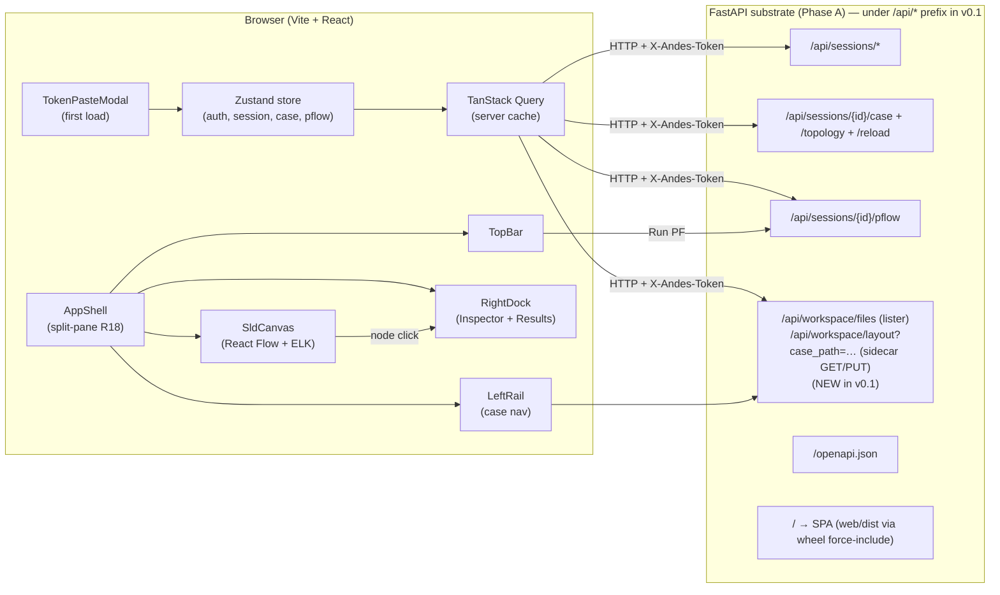

# feat: v0.1 UI — load case + auto-SLD + run PF + results overlay

## Overview

Build the first user-facing release on top of the now-complete Phase A substrate. v0.1 is the screenshot moment: a researcher opens an ANDES case, sees its single-line diagram auto-generated from topology, runs power flow, and sees voltages + flows annotated on the diagram + a sortable results table. **No streaming, no disturbance editor** — those land in v0.2 against the same UI shell.

This is the "wedge demo" — the brainstorm settled on "modern open-source UX vs. legacy commercial tools" as the primary wedge, and Phase A is invisible to it. Until v0.1 ships, the project's value proposition is unverified.

## Problem Frame

Per origin doc R6–R10 + R15–R20 (cross-cutting). Researcher persona has ANDES installed, a case file in their workspace, and wants to:

1. Load the case into the substrate.
2. See the topology rendered as a recognizable single-line diagram (not a generic graph).
3. Click an element, inspect its parameters.
4. Run power flow.
5. See voltages + line flows annotated on the diagram.
6. Read a sortable results table.

Phase A serves all of this via HTTP today (curl walkthrough proves it). v0.1 builds the UI on top of that contract.

## Requirements Trace

This plan satisfies the v0.1-side requirements from the origin doc:

- **R6.** Open existing case → auto-generated SLD displays topology
- **R7.** SLD uses **IEC 60617 power-systems iconography** (project-authored SVG; existing OSS sets are GPL or unlicensed)
- **R8.** PF run with **structured error taxonomy** — parse error / solver non-convergence / runtime crash → distinct UI surfaces (inline banner / overlay panel / modal)
- **R9.** PF results overlaid on the diagram (bus voltages with limit-violation color encoding; line flows with directional arrows) + sortable, filterable results table beside it
- **R10.** Diagram zoom, pan, click-to-inspect → dockable side panel showing element params + PF results
- **R15.** SLD layout **hybrid with curated-fallback**: IEEE 14/39/57/118/300 ship hand-curated; unknown <30 buses use auto-layout (ELK layered + orthogonal); ≥30 buses use best-effort + cleanup banner; user can drag-arrange in any case; layout persists as `<case>.layout.json` UI-side sidecar
- **R16.** Auto-layout acknowledged as imperfect on >30 buses; UI signals this honestly
- **R17.** **Modern UX with concrete commitment**: design system on Radix Primitives + Tailwind v4 with project-defined tokens (color, type scale, spacing). NOT a stock shadcn theme.
- **R18.** **Split-pane IA**: SLD canvas ≥60% of viewport; dockable right region (inspector + results table); thin top bar (run/case controls); thin left rail (case nav). Modals reserved for destructive confirmations only.
- **R19.** **Interaction state matrix** produced before v0.1 implementation begins (loading / empty / in-progress / success / error / animation-active across primary surfaces).
- **R20.** **Keyboard floor** for v0.1 critical path: open case → run PF → inspect element → view results. WCAG AA contrast on primary surfaces. SLD elements reachable via Tab with visible focus rings.

## Scope Boundaries

- **No disturbance editor.** v0.2 owns the timeline-based editor (R11). v0.1 surfaces zero UI for fault/trip/parameter-change events. The substrate already supports them; the UI ignores them.
- **No TDS / streaming.** v0.2 owns the WebSocket plot pipeline (R12–R14). v0.1 only calls `POST /sessions/{id}/pflow` (HTTP, batch).
- **No case authoring or topology editing.** v0.1 loads existing cases; does not let users build a case from scratch (deferred to v1.5; foregrounded researcher pain is run-and-view, not build-from-blank).
- **No multi-tenant SaaS, account UI, or login screens.** v0.1 is single-user local; auth is a token paste modal on first load (sessionStorage, cleared on tab close).
- **No EIG, contingency, OPF, or non-PF analyses.**
- **No mobile / responsive layout.** v0.1 targets desktop-class viewports (≥1280×720). Responsive lands later if needed.
- **No formal WCAG certification.** R20 sets a *floor* (keyboard nav for the critical path, AA contrast on primary surfaces); certification is post-v1.0.
- **No drag-and-drop file upload.** v0.1 lists files already present in the workspace directory; users place files there before running the app. Drag-and-drop upload is a v0.5+ enhancement.

### Deferred to Separate Tasks

- **v0.2 plan** (`docs/plans/2026-05-07-003-feat-v02-ui-disturbance-tds-streaming-plan.md`) — disturbance timeline editor + animated time-series + SLD scrub. Builds on v0.1's design system, layout shell, SLD canvas, and API client.
- **Drag-drop file upload + workspace browser tree** — separate enhancement plan after v0.1 lands.
- **Pre-built layouts for IEEE 57 / 118 / 300 stock cases only** — authored in a follow-on task using v0.1's SLD editor itself (since v0.1 ships the editor that authors them; pre-curated layouts are content, not code). IEEE 14 + IEEE 39 ship in v0.1 (Unit 8) since they are the wedge-demo cases.

## Context & Research

### Relevant Code and Patterns

- **Origin doc**: `docs/brainstorms/2026-05-07-accessible-andes-power-systems-app-requirements.md` — single source of truth for product decisions. R6-R20 own this plan's scope.
- **Phase A plan**: `docs/plans/2026-05-07-001-feat-andes-app-phase-a-substrate-plan.md` — what we built underneath.
- **Server API surface (the contract this UI consumes)**:
  - `server/src/andes_app/api/routes/sessions.py` — `POST /sessions`, `GET /sessions/{id}`, `DELETE /sessions/{id}`
  - `server/src/andes_app/api/routes/cases.py` — `POST /sessions/{id}/case`, `GET /sessions/{id}/topology`, `POST /sessions/{id}/reload`
  - `server/src/andes_app/api/routes/pflow.py` — `POST /sessions/{id}/pflow`
  - `server/src/andes_app/api/schemas.py` — Pydantic models that the OpenAPI spec is generated from. Every field has a description (R25).
  - `server/openapi.json` (generated at runtime via `GET /openapi.json`) — the canonical API contract for codegen.
- **Server auth**: `X-Andes-Token` header on every HTTP request. The token is per-launch, valid until process exit. Read from `~/.andes-app/run-<pid>.token` (mode 0600). v0.1 UI prompts the user to paste it on first load.
- **Server CORS allow-list**: `http://127.0.0.1:<port>` and `http://localhost:<port>` only. Vite's dev server must run on a port the user passes via `--bind-port` to `andes-app serve` (or it's added to the allow-list explicitly via the existing `extra_allowed_origins` parameter on `make_app`).

### Institutional Learnings

- `docs/solutions/2026-05-07-cli-anything-andes-architectural-mismatch.md` — backstop for "why no scaffolding tool"; not directly relevant to UI work.
- Memory: `reference_andes_quirks.md` — ANDES API constraints. Relevant for the UI: PF triggers setup; post-setup add of disturbances raises 409 directing the caller to `/reload`. v0.1 doesn't expose disturbance editing so this is mostly a substrate concern, but the inspector should be aware that post-PF, `state: "committed"` shows in topology.

### External References

The brainstorm settled the stack via Phase 1 research:

- **Vite 6 + React 19 + TypeScript** — the appropriate SPA stack for a localhost FastAPI backend (Next.js features are dead weight here). `redaxle.com/blog/faster-frontend-builds-in-2026-with-next-js-16-and-vite-8` covers the Vite-vs-Next decision for 2026.
- **Tailwind v4 + Radix Primitives** (NOT stock shadcn) — `pkgpulse.com/guides/shadcn-ui-vs-base-ui-vs-radix-components-2026`. Radix gives behavior + ARIA; Tailwind owns the visual tokens.
- **react-resizable-panels** — split-pane layout (the library shadcn's `<Resizable>` wraps).
- **React Flow 12** (`@xyflow/react`) — `xyflow.com/blog/react-flow-12-release` and `reactflow.dev/learn/customization/custom-nodes`. Custom React-component nodes are the fit for IEC 60617 SVG iconography. `node.measured` (v12 addition) lets ELK lay out SVG nodes whose dimensions are only known after mount.
- **elkjs** with `layered` + orthogonal routing — `reactflow.dev/examples/layout/elkjs`. Best generic auto-layout for ≤30-bus power systems; supports port constraints (transformer primary/secondary on different sides).
- **TanStack Query v5** — HTTP cache + invalidation for the API client. The API is small enough that we don't need GraphQL or RPC machinery.
- **State**: Zustand for app-level state (current session, current case, current PF run); TanStack Query for server-state.
- **IEC 60617 SVG**: no permissively-licensed complete set exists in the wild (QElectroTech is GPL, chille/electricalsymbols is CC-BY-SA + thin coverage, others are similar). The brainstorm settled on "author original SVG following 60617 conventions" for the ~20 symbols required (bus, breaker, transformer 2-winding/3-winding, generator, load, shunt, line, ground, etc.).

## Key Technical Decisions

These are settled now; reversing any of them changes the API surface or the visual identity, which would warrant a plan revision.

- **Vite 6 + React 19 + TypeScript strict** for the frontend. Output is a static SPA bundle; the same code serves both local mode (Vite dev server in development; bundled assets served by FastAPI in production) and any future SaaS deployment.
- **Tailwind v4 with project-defined tokens** in `web/src/styles/tokens.css`. NO stock shadcn theme. Tokens cover color (with explicit dark + light variants designed from scratch), type scale, spacing, border radii, shadows, motion (durations + easing). The visible "modern UX vs. PowerWorld Windows-95" wedge depends on these being deliberate.
- **Radix Primitives** for behavioral components (Dialog, Popover, Tooltip, Tabs, Toggle, ContextMenu, ScrollArea, Slider, Select). Wrapped in project-styled components — never used as raw shadcn copy-paste.
- **react-resizable-panels** for the main split layout per R18 (SLD canvas + dockable right region; top bar; left rail).
- **Modals reserved for destructive confirmations only** per R18. PF non-convergence uses an overlay banner at the top of the right dock (above inspector + results table) with a non-modal slide-out for details — NOT a modal, NOT a takeover of the inspector region.
- **React Flow 12** for the SLD canvas. Custom node templates per element kind (Bus, Line, Transformer, Generator, Load, ShuntCap, etc.) — each renders an `<svg>` fragment using the IEC 60617 icon set.
- **elkjs** with `layered` algorithm + `orthogonal` edge routing for auto-layout. Run async via `useLayoutEffect`; persist coordinates to `<case>.layout.json` after first auto-layout AND after every user drag.
- **TanStack Query v5** for HTTP. One query per endpoint; mutations for state-changing calls. Auth header injection via a global fetch wrapper that reads the token from Zustand.
- **Zustand** for app-level state — single store with slices for `auth` (token), `session` (active session_id), `case` (loaded path + topology), `pflow` (latest run + result). Persisted to `sessionStorage`: persists across same-tab reloads; clears on tab close. The real cliffs are (a) 401 on any request → server process restarted → clear auth + reopen modal; (b) 404 on `/sessions/{id}/*` → worker reaped (180s idle) → clear `session_id` + recreate session + re-load case if path is in case slice.
- **OpenAPI client codegen**: `openapi-typescript` generates TS types from `GET /openapi.json` at build time. Codegen target: `web/src/api/generated.ts`. Each generated type has the description from the substrate's Pydantic model docstrings (R25 acceptance).
- **Auth flow**: `andes-app serve --open` (v0.1 scope) constructs `http://<host>:<port>/#token=<value>` and calls `webbrowser.open()` on launch. UI extracts the token from `location.hash`, stores it in sessionStorage, and clears the fragment from `location` immediately (`history.replaceState`). The TokenPasteModal stays as a fallback for SSH-tunneled / remote-desktop scenarios where `webbrowser.open()` won't help. Modal accepts the per-launch token from the server's stderr-printed `~/.andes-app/run-<pid>.token` file. Persisted in `sessionStorage`; persists across same-tab reloads; cleared on tab close.
- **Workspace file lister, not upload**: v0.1 needs to discover what case files are available. Adds a small new server endpoint `GET /workspace/files` that lists files matching ANDES's supported extensions (.xlsx, .raw, .dyr, .json, .m) under the workspace root. UI displays the list; user picks one. Drag-drop upload is deferred (R6's "from disk" satisfied by "from the workspace dir on disk").
- **SLD layout sidecar**: `<workspace>/<case>.layout.json` adjacent to the case file, accessed via `GET /workspace/layout?case_path=<rel>` and `PUT /workspace/layout?case_path=<rel>` (body = sidecar JSON). Contains `{schema_version, andes_version, bus_idx_to_xy: {...}, last_modified}`. Read on case load; written on first auto-layout result and after user drag operations (debounced ~500 ms). Drift handling (case edited externally → topology no longer matches stored layout) → mismatched-element auto-layouted, matched ones use stored coords, dismissible warning banner shown.
- **Substrate-as-blob-sidecar (deliberate exception to R5)**: R5 said "substrate is domain-only." This plan adds substrate endpoints for layout sidecars (`/workspace/layout`). This is a named, deliberate exception: substrate gains a generic blob-sidecar endpoint family (currently only layout, but the door is open). The substrate does not parse or interpret the JSON; it is a thin storage shim with size cap + path validation. The trade-off is accepted because the alternative (IndexedDB keyed by case-content-hash) loses cross-machine portability of layouts and complicates the agent-readiness story (R25). Future plans may revisit if the sidecar surface grows.
- **PF results overlay**: bus voltage rendered as both a numeric label adjacent to each bus AND a color encoding (green for in-band, amber for limit-near, red for limit-violation) on the bus icon's outline. Line flows shown as directional arrows on the line edge with magnitude labels. Toggle in the top bar lets users hide labels for screenshot purposes (the wedge demo's clean look).
- **Error taxonomy mapping** (R8 → R18): three structured categories from the substrate map to three distinct UI surfaces:
  - Parse error (load failed) → inline banner at the top of the case nav, with "view raw error" disclosure
  - Solver non-convergence (PF didn't converge) → overlay banner at top of right dock (above inspector + results table) + click-to-expand non-modal slide-out with iteration log + last mismatch + "edit & retry" affordance (NOT a modal, NOT a takeover)
  - Runtime crash (uncaught exception) → modal exception (the one allowed non-destructive modal because alternatives are insufficient for a crash)
- **Interaction state matrix as a Phase 1 deliverable** (R19): produced as a markdown artifact at `web/docs/interaction-states.md` before SLD canvas implementation begins. Lists every primary surface × every state (loading, empty, in-progress, success, error, animation-active where applicable). Implementer references it during component build.

## Open Questions

### Resolved During Planning

- **File upload vs. workspace lister**: lister wins for v0.1. Browsers can't write arbitrary disk paths; multipart upload requires a new server endpoint and adds drag-drop UX surface that's not v0.1-essential. The lister approach reuses the existing workspace-relative path validation in `server/src/andes_app/security/paths.py`.
- **Auth flow on first load**: `andes-app serve --open` URL-fragment handoff is v0.1 scope (the happy path); the token paste modal + sessionStorage stays as a fallback for remote-desktop / SSH-tunnel users.
- **Plot library choice**: not in v0.1 scope (no plots yet). Decided in v0.2 plan.
- **Layout sidecar storage**: filesystem-relative `<case>.layout.json` (UI-managed via the existing path-canon-validated workspace endpoints), not a database. Simpler and aligns with R5's "substrate is domain-only; layout is UI sidecar" decision from the brainstorm.
- **Component library on top of Radix**: project-built (no shadcn copy-paste), gated by Unit 2's Phase 0 falsification test. The boilerplate cost is small (~30-40 components) and the design-quality dividend is large (R17 wedge claim) IF the falsification gate passes; otherwise the unit downgrades to shadcn-with-tokens. Implementer authors components in `web/src/components/ui/` matching the design tokens.
- **OpenAPI codegen tool**: pinned to `openapi-typescript` (lighter, types-only). `orval` was considered and rejected — types-only output is sufficient for v0.1's small API surface, and TanStack Query hook generation isn't worth the extra dependency weight.
- **Click-to-inspect semantics**: single-click on a node sets `selectedElement` + opens the inspector (React Flow `onNodeClick`); Enter on a focused node has the same effect. Double-click is reserved for v0.5 (focus-zoom).

### Deferred to Implementation

- **Exact color tokens** (concrete hex values, contrast ratios per surface). Designed during Unit 2 (design tokens) with reference screenshots; not pre-specified here.
- **Specific motion durations + easing** for transitions (modal open, panel resize, results-overlay fade-in). Designer picks during component build; aim for "tactile, fast, restrained" (200-300 ms ease-out).
- **Exact ELK layout options** for the IEEE-spec topologies — `nodePlacement.strategy`, `spacing.nodeNode`, etc. Tuned during Unit 8 (SLD canvas) using IEEE 14 + IEEE 39 as test cases.
- **Drag-drop reorder of left-rail items** — implementer applies the interaction-state-matrix conventions; small variations OK.
- **Token rotation handling** — the substrate doesn't rotate tokens in v0.1 (per R22), but the UI should still gracefully handle 401 responses by clearing stored token + re-prompting. Concrete recovery UX deferred to Unit 5.
- **Empty-state copy** for case nav, results table, inspector. Designer-author writes during Unit 4 alongside the layout shell.

## Output Structure

```text
.
├── docs/
│   ├── brainstorms/
│   │   └── 2026-05-07-accessible-andes-power-systems-app-requirements.md
│   └── plans/
│       ├── 2026-05-07-001-feat-andes-app-phase-a-substrate-plan.md
│       └── 2026-05-07-002-feat-v01-ui-load-pf-sld-plan.md
├── web/
│   ├── package.json
│   ├── pnpm-lock.yaml          # or package-lock.json depending on chosen package manager
│   ├── tsconfig.json
│   ├── tsconfig.node.json
│   ├── vite.config.ts
│   ├── tailwind.config.ts
│   ├── postcss.config.js
│   ├── index.html
│   ├── README.md
│   ├── docs/
│   │   ├── interaction-states.md       # R19 deliverable
│   │   └── design-system-decision.md   # Phase 0 falsification gate (Unit 2)
│   ├── src/
│   │   ├── main.tsx                    # entry point
│   │   ├── App.tsx                     # root component
│   │   ├── styles/
│   │   │   ├── tokens.css              # Tailwind @theme + design tokens
│   │   │   └── globals.css
│   │   ├── api/
│   │   │   ├── generated.ts            # codegenned from /openapi.json
│   │   │   ├── types.ts                # branded SessionId/RunId + parse wrappers
│   │   │   ├── client.ts               # fetch wrapper + token injection
│   │   │   └── queries.ts              # TanStack Query hooks
│   │   ├── store/
│   │   │   ├── auth.ts                 # token slice
│   │   │   ├── session.ts              # active session
│   │   │   ├── case.ts                 # loaded case + topology
│   │   │   └── pflow.ts                # latest PF run state
│   │   ├── components/
│   │   │   ├── ui/                     # project-styled Radix-wrapped primitives
│   │   │   │   ├── button.tsx
│   │   │   │   ├── dialog.tsx
│   │   │   │   ├── tooltip.tsx
│   │   │   │   ├── tabs.tsx
│   │   │   │   └── … (~30-40 components)
│   │   │   ├── shell/
│   │   │   │   ├── AppShell.tsx        # split-pane layout (R18)
│   │   │   │   ├── TopBar.tsx
│   │   │   │   ├── LeftRail.tsx
│   │   │   │   └── RightDock.tsx
│   │   │   ├── auth/
│   │   │   │   └── TokenPasteModal.tsx
│   │   │   ├── case/
│   │   │   │   ├── WorkspaceFilePicker.tsx
│   │   │   │   └── CaseNav.tsx
│   │   │   ├── sld/
│   │   │   │   ├── SldCanvas.tsx       # React Flow + ELK
│   │   │   │   ├── SldLayoutSkeleton.tsx  # placeholder while ELK runs (Unit 8)
│   │   │   │   ├── nodes/              # custom IEC 60617 nodes
│   │   │   │   │   ├── BusNode.tsx
│   │   │   │   │   ├── LineNode.tsx
│   │   │   │   │   ├── TransformerNode.tsx
│   │   │   │   │   ├── GeneratorNode.tsx
│   │   │   │   │   └── LoadNode.tsx
│   │   │   │   ├── edges/
│   │   │   │   │   └── PowerFlowEdge.tsx
│   │   │   │   ├── curated/            # hand-authored layouts (Unit 8)
│   │   │   │   │   ├── ieee14.layout.json
│   │   │   │   │   ├── ieee39.layout.json
│   │   │   │   │   └── index.ts        # case-name → curated layout map
│   │   │   │   ├── layout.ts           # ELK invocation + sidecar persistence
│   │   │   │   ├── sidecar.ts          # sidecar schema + persistence helpers
│   │   │   │   └── overlay.ts          # PF results → node/edge overlay state
│   │   │   ├── inspector/
│   │   │   │   ├── ElementInspector.tsx
│   │   │   │   └── ResultsTable.tsx
│   │   │   └── pflow/
│   │   │       ├── RunButton.tsx
│   │   │       ├── ConvergenceErrorPanel.tsx  # banner + non-modal slide-out
│   │   │       ├── RuntimeCrashModal.tsx
│   │   │       └── ParseErrorBanner.tsx
│   │   └── icons/
│   │       └── iec60617/               # ~10 hand-authored SVG, MIT-licensed
│   │           ├── bus.svg
│   │           ├── line.svg
│   │           ├── transformer-2w.svg
│   │           ├── transformer-3w.svg
│   │           ├── generator.svg
│   │           ├── generator-syngen.svg
│   │           ├── load.svg
│   │           ├── shunt-cap.svg
│   │           ├── shunt-reactor.svg
│   │           └── ground.svg
│   │           # Deferred (authored when a target case requires them):
│   │           # breaker-open, breaker-closed, fuse, surge-arrester,
│   │           # instrument-ct, instrument-vt, motor, earthing-transformer,
│   │           # voltage-source, current-source, switch.
│   └── tests/
│       ├── setup.ts
│       ├── unit/
│       │   ├── api/
│       │   ├── store/
│       │   ├── components/ui/
│       │   └── components/sld/
│       └── e2e/                         # Playwright
│           ├── playwright.config.ts
│           └── load-pf-flow.spec.ts
└── server/                              # existing Phase A package
    ├── src/andes_app/
    │   ├── api/
    │   │   ├── app.py                   # MODIFIED: /api/* prefix, PUT in CORS, register workspace + StaticFiles
    │   │   ├── routes/
    │   │   │   └── workspace.py         # NEW: GET /workspace/files; GET/PUT /workspace/layout (Unit 5b)
    │   │   └── schemas.py               # MODIFIED: PflowResult.line_flows + TopologyEntry.params (Unit 5b)
    │   ├── core/wrapper.py              # MODIFIED: populate line_flows post-PF (Unit 5b)
    │   ├── security/paths.py            # MODIFIED: list_workspace_files + open_workspace_file_for_write (Unit 5b)
    │   ├── cli.py                       # MODIFIED: --allow-origin and --open flags (Unit 1)
    │   └── static/                      # NEW: web/dist/ included via wheel force-include (Unit 10)
    ├── pyproject.toml                   # MODIFIED: hatch force-include web/dist (Unit 10)
    └── tests/acceptance/walkthrough.sh  # MODIFIED: /api/* curl URLs (Unit 10)
```

## High-Level Technical Design

> *This illustrates the intended approach and is directional guidance for review, not implementation specification.*

### Component shape



### v0.1 user flow

```mermaid
sequenceDiagram
    participant User
    participant UI as React UI
    participant Server as FastAPI substrate
    User->>UI: andes-app serve --open opens browser at http://127.0.0.1:<port>/#token=<value>
    UI->>UI: extract token from location.hash; persist to sessionStorage; clear fragment
    UI->>Server: GET /api/sessions (smoke check the token works)
    Server-->>UI: 200 (token valid)
    UI->>Server: POST /api/sessions
    Server-->>UI: 201 {session_id}
    UI->>Server: GET /api/workspace/files
    Server-->>UI: [{name: "ieee14.raw", ...}, ...]
    User->>UI: pick "ieee14.raw" + "ieee14.dyr"
    UI->>Server: POST /api/sessions/{id}/case {primary_path: "ieee14.raw", addfiles: ["ieee14.dyr"]}
    Server-->>UI: 200 {state: "pre-setup", buses: [...], lines: [...], generators: [...]}
    UI->>Server: GET /api/workspace/layout?case_path=ieee14.raw
    Server-->>UI: 404 OR sidecar JSON
    UI->>UI: If 404 / drift: run ELK auto-layout. Else use stored coords (curated layout for IEEE14/39 takes precedence).
    UI->>UI: Render SLD on canvas with IEC 60617 nodes + computed coords
    User->>UI: click "Run PF"
    UI->>Server: POST /api/sessions/{id}/pflow {}
    Server-->>UI: 200 {converged: true, bus_voltages: {...}, line_flows: {...}, ...}
    UI->>UI: Annotate diagram with voltages + flows; populate results table; flip topology state to "committed"
    User->>UI: single-click bus 4
    UI->>UI: Set selectedElement=bus4; open inspector with bus params + computed voltage
```

### Error-surface taxonomy (R8)

| Error category | Server response | UI surface |
|---|---|---|
| Workspace path validation | HTTP 400 with `ProblemDetails` | Inline toast at the top of the file picker |
| Case parse error (`CaseLoadError`) | HTTP 422 with `ProblemDetails.detail` containing the underlying ANDES message | Inline banner at the top of the case nav with "view raw error" disclosure |
| Solver non-convergence | HTTP 200 with `PflowResult.converged: false` | Overlay banner at top of right dock + click-to-expand non-modal slide-out with iteration log + last mismatch + "open case in editor" affordance (deferred to v0.5) + dismiss button |
| ANDES setup failed (`SetupFailedError`) | HTTP 422 with detail + "/reload" hint | Modal: "Case in inconsistent state. Reload to recover." with Reload button as the primary action |
| Worker crashed / 5xx | HTTP 5xx | Modal exception with technical detail collapsed by default + "report issue" link |

## Implementation Units

The plan is **phased**: Phase A (foundations, no real user flow) lands first and is independently runnable as "the app loads, shows the empty shell, but does nothing"; Phase B (the actual user flow) builds on it. This matches the brainstorm's "each release independently demoable" principle at the unit level too — a partial v0.1 still demonstrates progress.

### Phase 1: Foundations

- [ ] **Unit 1: Web project scaffolding**

**Goal:** Stand up the `web/` package with Vite 6 + React 19 + TS strict + Tailwind v4 + Radix Primitives baseline. CI runs `pnpm install`, `pnpm typecheck`, `pnpm lint`, `pnpm test`, `pnpm build` on every push touching `web/`.

**Requirements:** R17 (Tailwind + Radix; not stock shadcn), R18 (layout shell foundation; actual shell in Unit 4).

**Dependencies:** None (greenfield).

**Files:**
- Create: `web/package.json` (deps: react@19, react-dom@19, vite@^6, typescript@^5.7, tailwindcss@^4, @radix-ui/* primitives, react-resizable-panels, @xyflow/react@^12, elkjs, @tanstack/react-query@^5, zustand). Note: v0.2-only deps (apache-arrow, uplot) install in v0.2's scaffolding unit.
- Create: `web/tsconfig.json`, `web/tsconfig.node.json` (strict mode; `noUncheckedIndexedAccess`)
- Create: `web/vite.config.ts` (proxy `/api` and `/ws` to `http://127.0.0.1:<port>` for dev; static build output to `web/dist/`)
- Create: `web/tailwind.config.ts`, `web/postcss.config.js`
- Create: `web/index.html`, `web/src/main.tsx`, `web/src/App.tsx` (placeholder)
- Create: `web/.eslintrc.cjs` or `eslint.config.js`, `web/prettier.config.js`
- Create: `web/README.md` (dev quick start; how to run against `andes-app serve`; CORS config note)
- Modify: `.github/workflows/web.yml` (new CI workflow for the web/ package; Node 22 LTS; pnpm)
- Modify: `AGENTS.md` (add web/ section: package manager, scripts, lint/format conventions)
- Modify: `server/src/andes_app/cli.py` (add `--allow-origin <multi-valued>` flag, threading values into both `extra_allowed_origins` AND `extra_allowed_hosts` on `make_app()`; document the dev workflow as `andes-app serve --allow-origin http://127.0.0.1:5173`. Also add `--open` flag: on launch, construct `http://<host>:<port>/#token=<value>` and call `webbrowser.open()` so the UI extracts the token from the URL fragment on first load.)

**Approach:**
- Use `pnpm` as the package manager (faster + smaller node_modules than npm). Document the requirement in README.
- Tailwind v4 uses `@import "tailwindcss"` + native CSS-based config; the `tailwind.config.ts` file becomes minimal. Project tokens are defined in `web/src/styles/tokens.css` as CSS custom properties (lands in Unit 2).
- TypeScript strict + `noUncheckedIndexedAccess` (the latter catches a class of bugs around array/dict access that React + a substrate API surface make easy to write).
- Vite proxy: in dev, the UI runs at `http://127.0.0.1:5173` (or similar) and proxies `/api/*` to `http://127.0.0.1:<server-port>`. In production, FastAPI serves `web/dist/` as static + the API at `/api/*`. Either way, the API is at `/api/*` from the UI's POV. The substrate's CORS allow-list needs to include the dev port; document the `extra_allowed_origins` config in README.
- ESLint + Prettier with project conventions: 2-space indent, single quotes, trailing commas, no default exports for components (named exports only).

**Patterns to follow:**
- Server's `pyproject.toml` PEP 621 conventions — translate equivalents for `package.json` (script names, lint config).
- Server's `AGENTS.md` security posture format — mirror in the web/ section.

**Test scenarios:**

Test expectation: none — pure scaffolding, no behavioral change. CI verifies the scaffold compiles + lints + an empty test suite passes.

**Verification:**
- `pnpm install && pnpm build` succeeds in a fresh checkout.
- `pnpm typecheck` passes (an empty `App.tsx` with no errors).
- `pnpm lint` passes.
- `pnpm test` collects 0 tests, no errors.
- CI workflow runs green.

---

- [ ] **Unit 2: Design tokens + Radix-wrapped component library**

**Goal:** Author the project-defined design system: color tokens (light + dark), type scale, spacing scale, motion tokens. Build the Radix-Primitive-wrapped UI components (`Button`, `Dialog`, `Tooltip`, `Popover`, `Tabs`, `ScrollArea`, `Select`, `Slider`, `ToggleGroup`, `ContextMenu`, plus thin layout primitives like `Stack`, `Inline`, `Box`). Document the system in `web/docs/interaction-states.md` (R19 deliverable).

**Requirements:** R17, R19, R20 (component-level keyboard + ARIA via Radix).

**Dependencies:** Unit 1.

**Files:**
- Create: `web/src/styles/tokens.css` (CSS custom properties; light + dark variants; Tailwind v4's `@theme` directive references them)
- Create: `web/src/styles/globals.css` (resets, base layer)
- Create: `web/src/components/ui/{button,dialog,tooltip,popover,tabs,scroll-area,select,slider,toggle-group,context-menu,stack,inline,box}.tsx`
- Create: `web/src/components/ui/index.ts` (barrel)
- Create: `web/docs/design-system-decision.md` (Phase 0 falsification gate output — see Approach)
- Create: `web/docs/interaction-states.md` (R19 — the matrix; primary surfaces × states; seeded with the cells listed below)
- Test: `web/tests/unit/components/ui/` (one `.test.tsx` per component covering key states)

**Approach:**

**Phase 0 — Falsification gate (BEFORE authoring the component library):** produce 1-2 reference screen mocks of the v0.1 main view rendered with (a) shadcn-default-with-tokens vs (b) project-built-on-Radix. If the visual difference is not self-evident at a glance, downgrade to shadcn-with-tokens and skip the bespoke component library. Document the comparison + decision in `web/docs/design-system-decision.md`. This is the brainstorm's own falsification test for R17 — if the wedge claim ("modern UX vs. legacy commercial tools") doesn't survive this test, the project-built component cost isn't justified.

- Color tokens use OKLCH for perceptually-uniform interpolation (a 2026-modern choice; `color-mix(in oklch, ...)` is well-supported). Dark mode is a class-based toggle on `<html>`, with Tailwind v4's native `dark:` variant. Specific palette decided during this unit using "modern technical research tool" reference vibes (clean, restrained, slightly cool — think Linear / Figma / Vercel-flavored, NOT teal-and-orange ANDES brand colors).
- Type scale: 6 sizes (xs, sm, base, lg, xl, 2xl) with paired line-heights. Body font: Inter or system-ui. Numeric font: JetBrains Mono or system-monospace for results-table / iteration-log readability.
- Spacing: 4px-baseline scale, 8 steps (1=4px, 2=8px, 3=12px, 4=16px, 6=24px, 8=32px, 12=48px, 16=64px). Tailwind's default scale is fine; just ensure tokens are referenced not hardcoded.
- Motion: 3 durations (fast=120ms, base=200ms, slow=300ms), one easing (cubic-bezier(0.16, 1, 0.3, 1) — a tactile spring-like ease-out).
- Each Radix wrapper exports the trigger + content as named components, applies the design tokens via Tailwind classes, and forwards Radix's behavior unchanged. Never re-implement Radix's logic.
- The interaction-states matrix doc lists, for every primary surface (case nav, SLD canvas, inspector, results table, run controls): empty / loading / in-progress / success / error / animation-active states with brief descriptions of the visual treatment (no implementation code; this is design intent).

**Seeded matrix cells (pre-fill these; implementer adds visual treatment details):**

- **SLD canvas:**
  - *Pre-load empty* — full-canvas EmptyState: "Pick a case file to begin." with subtle illustration.
  - *Case-loaded loading* — `SldLayoutSkeleton`: 5-7 grey rounded-rectangle placeholder nodes in a vague layered pattern with "Computing layout…" caption below; soft fade.
  - *Case-loaded success (pre-PF)* — full SLD with neutral-stroke buses; no voltage/flow labels.
  - *Post-PF success* — voltage labels visible; bus stroke colored by limit-violation band (green/amber/red); line edges show directional arrows + flow magnitude labels.
  - *Error banner* — drift banner ("Topology changed since layout was saved…") or auto-layout-fallback banner above the canvas; canvas content remains visible underneath.
  - *Scrub-active (v0.2 placeholder)* — reserved cell in the matrix; filled in v0.2 plan.
- **Inspector:**
  - *Empty no-case* — "Load a case to inspect elements."
  - *Empty no-element-selected* — "Click an element on the diagram to inspect it."
  - *Element-selected pre-PF* — Properties tab populated; Results tab shows "Run power flow to see results."
  - *Element-selected post-PF* — both tabs populated; Results tab default.
  - *Convergence-error banner present* — banner at top of right dock; inspector remains visible underneath in its current state (no takeover).
  - *Runtime-error modal open* — inspector visually unchanged; modal overlay locks foreground.
- **Results table:**
  - *Empty pre-PF* — "Run power flow to see results."
  - *Populated post-PF* — sortable rows; default sort = `idx` ascending per the column-definition tables in Unit 9.
  - *Sort active* — column-header chevron + sort applied.
  - *Filter active* — filter input populated; row count badge shows N matching.
  - *Empty tab* (e.g., no generators in case) — "No generators in this case."
- **Run controls:**
  - *Idle (no case)* — Run PF button disabled with tooltip "Load a case first."
  - *Idle (case loaded)* — Run PF button enabled, primary style.
  - *Running* — Run PF button shows spinner; button disabled; "Cancel" affordance optional in v0.1.
  - *Success* — toast: "PF converged in N iterations."
  - *Error* — button returns to enabled; appropriate error surface (banner / overlay-banner / modal) rendered per R8 taxonomy.
- **Case nav (left rail):**
  - *Empty workspace* — "No supported case files in workspace. Place a `.raw`/`.xlsx`/`.json`/`.m` file in the workspace dir."
  - *Populated list* — file list, primary case selectable; `.dyr` addfile selector visible when a `.raw` is picked.
  - *Loading* — list skeleton (3-5 grey rows) while `GET /workspace/files` is in flight.
  - *Parse error* — inline banner above the list with the substrate's `detail` field + dismiss.

**Execution note:** Author the interaction-states.md matrix BEFORE coding the components — it forces explicit decisions about each state's visual treatment.

**Patterns to follow:**
- Radix docs' wrapping examples — use `forwardRef` and `asChild` patterns where they exist.
- `pkgpulse.com/guides/shadcn-ui-vs-base-ui-vs-radix-components-2026` — for what NOT to copy from shadcn.

**Test scenarios:**

- Happy path: each component renders with default props; default text/labels are correct.
- Edge case (Dialog): `open=true` controlled state shows content; `open=false` hides; `onOpenChange` fires with the new state on Esc.
- Edge case (Tabs): default-selected tab renders its panel; clicking another tab swaps panels; keyboard arrows cycle tabs.
- Error path (Tooltip): tooltip with no children doesn't crash (empty fragment).
- Edge case (Slider): controlled vs uncontrolled — both work; min/max/step honored; arrow keys + Page Up/Down step correctly.
- Integration (Dialog × Tooltip): tooltip inside a Dialog is z-indexed above the dialog overlay.
- Accessibility: every component has appropriate ARIA via Radix; focus-visible styles render on keyboard focus, NOT on click (R20 floor).

**Verification:**
- All component unit tests pass.
- `pnpm storybook` (if added) renders every component in every state from the matrix.
- Manual screenshot review: each component matches the project tokens, none looks like generic shadcn.
- The interaction-states.md matrix is non-empty and committed.

---

- [ ] **Unit 3: IEC 60617 SVG icon set**

**Goal:** Author ~10 power-systems icons as MIT-licensed SVG, following IEC 60617 geometric conventions. The set covers exactly what IEEE 14 / 39 / 118 / 300 + Kundur stock cases require — nothing more. Icons for elements not present in those cases are deferred and authored on demand.

**Requirements:** R7.

**Dependencies:** None (parallelizable with Unit 1+2).

**Files:**
- Create: `web/src/icons/iec60617/{bus,line,transformer-2w,transformer-3w,generator,generator-syngen,load,shunt-cap,shunt-reactor,ground}.svg` (~10 files)
- Create: `web/src/icons/iec60617/README.md` (provenance: "Authored from scratch following IEC 60617 conventions; MIT-licensed; not derived from the IEC publication.")
- Create: `web/src/icons/iec60617/manifest.ts` (TypeScript map: ANDES model name → icon path; e.g., `Bus → bus.svg`, `PV → generator.svg`, `Slack → generator.svg`, `GENROU → generator-syngen.svg`, `PQ → load.svg`)
- **Deferred** (authored when a target case requires them): `breaker-open`, `breaker-closed` (verify against stock cases first — keep if present), `fuse`, `surge-arrester`, `instrument-ct`, `instrument-vt`, `motor`, `earthing-transformer`, `voltage-source`, `current-source`, `switch`. Document the deferred set in the README.

**Approach:**
- Each SVG is on a 24×24 viewBox by default (matches Lucide-style sizing for compatibility with Tailwind size classes). Some elements (bus, line) may use 24×6 (horizontal) or 6×24 (vertical) for natural aspect.
- All strokes use `stroke="currentColor"` so the parent component controls color via CSS — enables limit-violation coloring (R9) without per-icon variants.
- No fills except for filled shapes (closed switches, generator interior). Use `fill="currentColor"` consistently.
- Stroke width: 1.5 absolute (standard Lucide-style). Line caps: `round`. Line joins: `round`.
- Reference geometry from publicly-available power-systems iconography references (academic textbooks, university course materials, ANDES's own documentation diagrams). The IEC publication itself is paid; we author conventions, not copies.
- Manifest maps ANDES model class names to icon files. Used by the SLD canvas in Unit 8 to pick the right icon per element.

**Patterns to follow:**
- Lucide icon conventions for sizing, currentColor, stroke-width.
- Existing `icons/` directories in popular React libs — flat file structure, one `.svg` per icon.

**Test scenarios:**

Test expectation: none — static SVG assets. Manual review verifies they look correct and are consistent.

**Verification:**
- All ~10 SVG files render correctly when imported and dropped into a 24×24 container at various color/scale.
- The manifest covers every ANDES model class the topology endpoint returns for IEEE 14 / 39 / 118 / 300 + Kundur stock cases (verified by loading each via the substrate and asserting all returned `kind` values map to an icon).
- Side-by-side render of all icons at 24px + 48px + 96px shows visual consistency (stroke weight scales appropriately).
- README provenance + deferred-icons list is in place.

---

- [ ] **Unit 4: Layout shell**

**Goal:** Build the split-pane app shell per R18 (SLD canvas ≥60%; dockable right region; thin top bar; thin left rail). Modals reserved for destructive only. The shell renders empty placeholders for the inner regions; Phase 2 fills them.

**Requirements:** R18, R19, R20.

**Dependencies:** Unit 1, 2.

**Files:**
- Create: `web/src/components/shell/{AppShell,TopBar,LeftRail,RightDock}.tsx`
- Create: `web/src/components/shell/EmptyState.tsx` (placeholder used by inner regions before they have content)
- Create: `web/src/App.tsx` (modify scaffold to use AppShell)
- Test: `web/tests/unit/components/shell/AppShell.test.tsx`

**Approach:**
- Use `react-resizable-panels` for the main horizontal split (left rail | main canvas | right dock) and a vertical sub-split inside the right dock (inspector | results table) per R18.
- Top bar: fixed height (~44px). Slot architecture: `TopBar` accepts `<TopBar.Left>`, `<TopBar.Center>`, `<TopBar.Right>` children so other units can inject controls (case picker, run button, view toggles).
- Left rail: fixed width (~240px), collapsible to ~48px (icon-only). Hosts case nav (Unit 7) and view-mode toggles.
- Main canvas: holds the SLD in Unit 8. v0.1's shell shows an EmptyState ("Pick a case file to begin.") until case is loaded.
- Right dock: dockable + collapsible. Vertically split between inspector (top, default ~60%) and results table (bottom, default ~40%). Both regions show EmptyState placeholders until populated.
- Persist resize handle positions to `localStorage` so the layout sticks across sessions for the same user.
- Keyboard navigation floor (R20): Tab cycles between top bar → left rail → main → right dock; Esc dismisses any open Dialog/Popover; visible focus ring on every focused interactive element.
- Token paste modal (Unit 5) renders OUTSIDE the AppShell as a top-level overlay (the only Dialog in v0.1's foreground state machine).

**Patterns to follow:**
- `react-resizable-panels` README examples for split-pane composition.
- IDE-style "panel" metaphor: docks have a small grip handle; resize feels tactile.

**Test scenarios:**

- Happy path: AppShell renders with all regions visible.
- Edge case: collapse left rail → main canvas + right dock fill the freed space.
- Edge case: persistent panel sizes — set sizes, reload, sizes restored from localStorage.
- Edge case: viewport too small (<1024px wide) — graceful collapse behavior; no broken layout.
- Keyboard: Tab cycles regions in DOM order; Shift+Tab reverses; Esc dismisses open overlays.
- Integration: AppShell hosts the TokenPasteModal (Unit 5) without blocking the underlying shell from being keyboard-navigable once the modal is dismissed.

**Verification:**
- All shell tests pass.
- Manual visual review: layout matches the IA matrix in interaction-states.md.
- Keyboard-only navigation works for the critical path (the empty shell before any case is loaded — the shell's keyboard floor is independent of content).

---

- [ ] **Unit 5: API client + auth + Zustand stores**

**Goal:** Generate a typed API client from the substrate's OpenAPI spec, build the auth flow (token paste modal + sessionStorage), and set up the Zustand store slices that subsequent units read from.

**Requirements:** R6 (data plumbing for case load), R8 (error envelope handling), R20 (keyboard nav for the modal).

**Dependencies:** Units 1, 2, 4.

**Files:**
- Create: `web/src/api/client.ts` (fetch wrapper; injects `X-Andes-Token` from the auth store; canonicalizes `ProblemDetails` → typed errors)
- Create: `web/src/api/queries.ts` (TanStack Query hooks for each endpoint)
- Create: `web/src/api/types.ts` (re-export from generated.ts; maybe project-narrowed types)
- Create: `web/src/api/codegen.config.ts` (configures `openapi-typescript`)
- Create: `web/scripts/regenerate-api-types.sh` (developer script to re-run codegen against a running `andes-app serve`)
- Create: `web/src/store/{auth,session,case,pflow}.ts` (Zustand slices)
- Create: `web/src/store/index.ts` (combined store)
- Create: `web/src/components/auth/TokenPasteModal.tsx`
- Modify: `web/src/App.tsx` (mount QueryClientProvider; mount TokenPasteModal as conditional overlay)
- Modify: `web/package.json` (add codegen script + dev dep on `openapi-typescript`)
- Test: `web/tests/unit/api/client.test.ts`, `web/tests/unit/store/auth.test.ts`, `web/tests/unit/components/auth/TokenPasteModal.test.tsx`

**Approach:**
- **OpenAPI codegen**: `openapi-typescript` (lightweight, types-only). Runs against the substrate's `/openapi.json` at build time (or pre-commit). Output: `web/src/api/generated.ts` with TypeScript types for every request/response model. `openapi-typescript` produces structural types only, so after codegen, hand-author `SessionId = string & {__brand: 'SessionId'}` brands (plus `RunId`, `WorkspacePath`) in `web/src/api/types.ts` along with `parseSessionId(s: string): SessionId` wrappers used at the API boundary to narrow incoming strings to their branded form.
- **fetch wrapper** in `client.ts`:
  - Reads `X-Andes-Token` from the auth store on every request.
  - Translates HTTP errors into typed `ProblemDetailsError` (with `type`, `title`, `status`, `detail`).
  - On 401 → clears the auth store, opens the TokenPasteModal.
  - On 429 → returns a typed `RateLimitedError` (with `Retry-After`); UI shows a toast.
  - On 5xx → returns a typed `ServerError`; UI surfaces via the runtime-crash modal pathway (R8).
- **TanStack Query hooks** wrap the fetch wrapper. One hook per endpoint: `useCreateSession`, `useLoadCase`, `useTopology`, `useRunPflow`, `useReloadCase`, `useListWorkspaceFiles`. Mutations use `useMutation`; reads use `useQuery`. Cache invalidation: case load invalidates topology; PF run invalidates topology (state flips to "committed").
- **Zustand store**:
  - `auth`: `{token: string | null, setToken, clearToken}`. Persisted to `sessionStorage` only.
  - `session`: `{sessionId: string | null, setSessionId, clearSession}`. Cleared on token clear.
  - `case`: `{primaryPath, addfiles, topology, layoutSidecar}`. Cleared on session clear or case change.
  - `pflow`: `{lastRun, isRunning, error}`. Cleared on case change.
- **TokenPasteModal**:
  - Mounted at the top level of `App.tsx`, conditional on `auth.token === null`.
  - Modal cannot be dismissed without entering a token (no Esc-to-close, no overlay-click-to-close — the app is locked behind it).
  - **First-load URL-fragment fast path**: on mount, check `location.hash` for `#token=<value>`. If present, validate format, run smoke check, and on success persist to sessionStorage + clear the fragment from `location` immediately (`history.replaceState(null, '', location.pathname + location.search)`) so the token doesn't linger in browser history. Modal never appears in this path.
  - **Pasted-token handling**: `trim()` the pasted value (handles `cat run-pid.token` newline). Format validate against `^[0-9a-f]{64}$` before sending; reject inline if it doesn't match.
  - On submit: token validated against `GET /sessions` (smoke check); if 401, error inline; if 200, persist to sessionStorage + close.
  - **Recovery affordances**:
    - sessionStorage write failure (Safari private mode, quota exceeded): fall back to in-memory token + show a warning banner ("Token won't survive a tab reload — Safari private mode detected").
    - Network error on smoke check (server down, CORS misconfig): show "Try again" button + a "Show debug detail" disclosure with the underlying error message.
    - 401: show inline error "Token rejected. Check `~/.andes-app/run-<pid>.token` for the current value."
  - Help text references the server's stderr-printed token file path.
  - Keyboard: focus trapped in modal; Enter on the input submits.

**Execution note:** Start with a failing integration test for the request/response contract: "load IEEE 14 case via the typed client, get back a typed TopologySummary". The codegen + client shape settle when this test passes.

**Patterns to follow:**
- TanStack Query v5 docs for the `useMutation` + invalidation pattern.
- Zustand docs for slice composition + sessionStorage middleware.

**Test scenarios:**

- Happy path: `useLoadCase` sends `POST /sessions/{id}/case` with the right shape; on 200 the topology is in the cache; on next `useTopology` no network call (cache hit).
- Happy path: `useRunPflow` sends `POST /sessions/{id}/pflow {}`; on 200 invalidates the topology query (state flip); subsequent `useTopology` re-fetches.
- Edge case: token paste modal rejects empty token; submits a too-short token, server returns 401, modal stays open with inline error.
- Edge case: 401 mid-session (token rotated or process died) → auth store cleared, modal re-opens, current session/case cleared.
- Edge case: 429 from session creation → toast with retry-after countdown; `useCreateSession` retries automatically when the countdown ends (or user-triggers retry).
- Error path: `ProblemDetails` body parsed correctly even if some fields are missing (`type`, `instance` are optional per RFC 7807).
- Error path: network timeout. Per-endpoint timeouts: 10s for `/sessions/*` lifecycle; 60s for `/sessions/{id}/case` (load may include first-time prep); 60s for `/sessions/{id}/pflow`. Timeout surfaces as a typed `NetworkError`.
- Integration: full flow against a running `andes-app serve` test fixture — paste token, create session, load IEEE 14, fetch topology, run PF, assert response shape matches generated types.

**Verification:**
- `pnpm test web/tests/unit/api/` and `pnpm test web/tests/unit/components/auth/` all pass.
- Codegen script regenerates types cleanly when run against a fresh substrate.
- Manual: starting `andes-app serve`, opening the UI, pasting the token from `~/.andes-app/run-<pid>.token` works end-to-end and the auth modal disappears.

---

- [ ] **Unit 5b: Substrate API extensions for v0.1**

**Goal:** Land the server-side changes that v0.1 depends on but the existing units glossed over: the workspace file lister + layout sidecar endpoints, the topology/PF schema extensions that the inspector and overlay need, and the security helpers required to make the workspace endpoints safe.

**Requirements:** R5 (substrate-as-domain, with the explicit blob-sidecar exception documented in Key Technical Decisions), R6 (workspace lister), R9 (line flow data for directional arrows), R10 (element params for the Inspector Properties tab), R15(d) (sidecar persistence).

**Dependencies:** None on the web side; depends only on the existing Phase A substrate.

**Files:**
- Modify: `server/src/andes_app/api/schemas.py` — extend `PflowResult` with `line_flows: dict[str, {p: float, q: float, from_idx: int|str, to_idx: int|str}]` so R9's "directional arrows + magnitude" can be implemented.
- Modify: `server/src/andes_app/core/wrapper.py` — populate `line_flows` from `ss.Line` post-PF state.
- Modify: `server/src/andes_app/api/schemas.py` — extend `TopologyEntry` with `params: dict[str, float|int|str|bool]` so the Inspector Properties tab can show element params (R10).
- Create: `server/src/andes_app/api/routes/workspace.py` — new endpoints: `GET /workspace/files` (lister), `GET /workspace/layout?case_path=<rel>`, `PUT /workspace/layout?case_path=<rel>`. Auth-gated.
- Modify: `server/src/andes_app/security/paths.py` — add `list_workspace_files(workspace, allowed_extensions) -> list[Path]` using `os.scandir` + `entry.is_file(follow_symlinks=False)` + reject symlinks. Add `open_workspace_file_for_write(workspace, client_path) -> ContextManager[Path]` (atomic write via tempfile + rename, parent-dir symlink check, mode 0600).
- Modify: `server/src/andes_app/api/app.py` — register workspace router; add `PUT` to CORS `allow_methods` (currently `["GET","POST","DELETE","OPTIONS"]`) so the new sidecar PUT endpoint is permitted. The OPTIONS preflight is already covered.
- Test: `server/tests/unit/test_paths.py` (extend with the new helpers — symlink-rejection coverage; atomic-write rollback on failure).
- Test: `server/tests/integration/test_workspace_api.py` — list happy path; layout GET 404; layout PUT then GET round-trip; PUT exceeding 256 KB → 413; PUT with invalid JSON → 422; auth-gated; path-traversal blocked.
- Test: `server/tests/integration/test_pflow_api.py` (extend) — assert `line_flows` shape on a converged IEEE 14 run.
- Test: `server/tests/integration/test_topology_api.py` (extend) — assert `params` populated for at least one bus + one generator on IEEE 14.

**Approach:**
- **Workspace lister** mirrors the Phase A endpoint patterns: auth-gated, returns `{files: [{name, size_bytes, modified_iso, format}]}` for files matching the supported extensions (.xlsx, .raw, .dyr, .json, .m). Hidden files (dotfiles) excluded; subdirectories ignored in v0.1; rejects symlinks.
- **Layout sidecar PUT validation**: enforce `Content-Length <= 256 * 1024` (256 KB cap; ProblemDetails 413 if exceeded). Body validated as a Pydantic model (`SidecarLayout` — `schema_version`, `andes_version`, `coordinates: dict[str, {x: float, y: float}]`, `last_modified`). Atomic write via `tempfile.NamedTemporaryFile` in the same directory + `os.replace()` to avoid partial-write corruption.
- **`PflowResult.line_flows` shape**: keyed by line idx; each value `{p: float (MW), q: float (MVAr), from_idx, to_idx}` populated from `ss.Line` post-PF arrays (`ss.Line.a1.v` / `Line.v1.v` etc., depending on ANDES version — `core/wrapper.py` is the right home for the version-aware extraction).
- **`TopologyEntry.params` shape**: a flat dict of model-input parameters (e.g., for a Bus: `{Vn: 100.0, vmax: 1.05, vmin: 0.95, ...}`). The substrate already has these in `ss.<Model>.<param>.v`; this is just an extraction.

**Patterns to follow:**
- `server/src/andes_app/api/routes/sessions.py` for endpoint + schema + router registration pattern.
- `server/tests/integration/test_sessions_api.py` for the integration-test pattern.
- `server/src/andes_app/security/paths.py` existing path-canonicalization helpers; add new helpers in the same module with consistent semantics.

**Test scenarios:**
- Happy path: `GET /workspace/files` returns alphabetical list; ignores extensions outside the allowed set; ignores hidden files.
- Edge case: workspace contains a symlink to outside the workspace → not listed.
- Happy path (sidecar): PUT a 1 KB layout JSON → GET returns the same JSON byte-for-byte.
- Edge case (sidecar): PUT a 300 KB body → 413.
- Edge case (sidecar): PUT invalid JSON → 422 with ProblemDetails detail.
- Edge case (sidecar): GET for a case file with no sidecar → 404.
- Auth: all three endpoints reject missing/invalid X-Andes-Token with 401.
- Path validation: case_path containing `..` rejected with 400.
- Schema: `PflowResult.line_flows` populated on IEEE 14 PF (post-PF, all branches present).
- Schema: `TopologyEntry.params` populated for buses + generators on IEEE 14.

**Verification:**
- All new + extended server tests pass.
- `pnpm run regenerate-api-types` (from the web side) picks up the new schemas without manual edits.
- Manual: `curl -H "X-Andes-Token: $T" http://127.0.0.1:8765/workspace/files` returns the IEEE 14 workspace contents.

---

### Phase 2: User flow

- [ ] **Unit 7: Workspace file picker + case load flow**

**Goal:** Build the left-rail file picker UI on top of Unit 5b's `GET /workspace/files` endpoint, and wire case load (with optional `.dyr` addfile pairing for `.raw` cases) end-to-end.

**Requirements:** R4 (substrate already accepts the formats; UI exposes them), R6 (open from disk).

**Dependencies:** Units 5, 5b.

**Files:**
- Create: `web/src/components/case/WorkspaceFilePicker.tsx`
- Create: `web/src/components/case/CaseNav.tsx` (left-rail container; renders the picker + the loaded case summary)
- Modify: `web/src/components/shell/LeftRail.tsx` (mount `CaseNav`)
- Test: `web/tests/unit/components/case/WorkspaceFilePicker.test.tsx` (UI side)

**Approach:**
- **Server endpoint** (built in Unit 5b, consumed here): `GET /workspace/files` returns `{files: [{name, size_bytes, modified_iso, format}]}`. Path validation uses Unit 5b's new `list_workspace_files()` helper in `security/paths.py` (symlink-rejecting, dotfile-excluding). The `format` field is detected from extension.
- **UI picker**:
  - Lists files; user clicks a primary case (.raw, .xlsx, .json, .m).
  - For `.raw`, the picker shows a "+ pair with .dyr" affordance that lists `.dyr` files in the same workspace; user can pick one as addfile.
  - "Load" button is disabled until a primary is selected. Loading state during the substrate call.
  - On load success: case stored in Zustand, topology fetched, left-rail collapses the picker and shows a "Loaded: ieee14.raw + ieee14.dyr" summary with a "Change case" affordance.
  - On load failure: error surface per R8 taxonomy (parse error → inline banner; etc.).
- **Case nav state**: when a case is loaded, the picker is replaced by a summary card showing case name + addfiles + state (pre-setup/committed). Clicking "Change case" triggers a destructive-confirmation modal ("Discard current session? Loaded case + PF results will be cleared.") — this is the appropriate use of a modal per R18 (destructive-only). On confirm: clears the current session via `DELETE /sessions/{id}`, creates a new session, reopens the picker. On cancel: nothing changes.
- **"Change case" disabled while PF run is in-flight**: the button is greyed and a tooltip explains "Wait for power flow to finish." (avoids tearing down a session mid-RPC).

**Patterns to follow:**
- `server/src/andes_app/api/routes/sessions.py` for endpoint + schema + router registration pattern.
- `server/tests/integration/test_sessions_api.py` for the integration-test pattern.

**Test scenarios:**

Server:
- Happy path: `GET /workspace/files` returns all `.xlsx`/`.raw`/`.dyr`/`.json`/`.m` files in the workspace; ignores other files; alphabetical order.
- Edge case: empty workspace → `{files: []}`.
- Edge case: hidden files (`.foo`) excluded.
- Edge case: subdirectories — v0.1 lists top-level only; subdirectories are ignored.
- Auth: missing/invalid token → 401.

UI:
- Happy path: picker renders the files from the API; user clicks one, "Load" enables; clicks Load → topology loads.
- Happy path: `.raw` picked → addfile `.dyr` selector appears; pairing them and loading sends both paths.
- Edge case: no `.dyr` files in workspace → addfile selector hidden.
- Edge case: load fails with parse error → inline banner shows the underlying ANDES error; user can dismiss + try another case.
- Edge case: API returns 5xx → modal exception (R8 taxonomy).
- Integration: load IEEE 14 → topology renders in main canvas (Unit 8, but the topology in the store is observable here).

**Verification:**
- Server + UI tests pass.
- Manual: with IEEE 14 fixtures in the workspace, the picker shows them; selecting + loading produces a populated topology in the Zustand store.

---

- [ ] **Unit 8: SLD canvas with IEC 60617 nodes + ELK auto-layout**

**Goal:** Render the loaded case's topology as a single-line diagram on the main canvas. Custom React Flow nodes per element kind (Bus, Line, Transformer, Generator, Load, etc.) using the IEC 60617 SVG icons. ELK does first-time auto-layout; user drags persist to the `<case>.layout.json` sidecar.

**Requirements:** R7, R10 (zoom/pan/click-to-inspect), R15 (hybrid + curated-fallback), R16, R20 (keyboard nav floor).

**Dependencies:** Units 3, 4, 5b, 7.

**Files:**
- Create: `web/src/components/sld/SldCanvas.tsx` (the React Flow integration)
- Create: `web/src/components/sld/SldLayoutSkeleton.tsx` (the "while ELK runs" placeholder — see Approach)
- Create: `web/src/components/sld/nodes/{BusNode,LineNode,TransformerNode,GeneratorNode,LoadNode,ShuntNode}.tsx`
- Create: `web/src/components/sld/edges/{TopologyEdge}.tsx` (line-and-transformer connection edges)
- Create: `web/src/components/sld/layout.ts` (ELK invocation + sidecar read/write + drift detection)
- Create: `web/src/components/sld/sidecar.ts` (sidecar schema + canonical persistence)
- Create: `web/src/components/sld/curated/ieee14.layout.json` (hand-arranged using v0.1's SLD editor itself)
- Create: `web/src/components/sld/curated/ieee39.layout.json` (hand-arranged using v0.1's SLD editor itself)
- Create: `web/src/components/sld/curated/index.ts` (case-name → curated layout map; IEEE 57/118/300 land later as content)
- Modify: `web/src/components/shell/AppShell.tsx` (render `SldCanvas` in the main region when a case is loaded)
- Test: `web/tests/unit/components/sld/{layout,sidecar}.test.ts`, `web/tests/unit/components/sld/SldCanvas.test.tsx`, `web/tests/e2e/sld-canvas.spec.ts` (Playwright)

**Approach:**
- **React Flow setup**: `<ReactFlow nodes={...} edges={...} nodeTypes={...} edgeTypes={...} fitView />`. `nodeTypes` maps `kind` → custom node component (BusNode, etc.). Each node receives `data: {idx, name, kind, model, voltage?, angle?, ...}`.
- **Custom node templates**: each renders an `<svg>` containing the relevant IEC 60617 icon plus a label below it. Bus voltage label appears when PF has run (Unit 9 wires this through). Bus icon stroke color = limit-violation state (green/amber/red) when post-PF.
- **Edge templates**: `TopologyEdge` is a polyline (NOT bezier) connecting bus nodes via the line/transformer. After PF, edges show a directional arrow + flow magnitude label.
- **ELK auto-layout**: `layout.ts` exposes `autoLayout(topology) → coordsByIdx` that builds an ELK graph (each ANDES element as ELK node; lines/transformers as ELK edges between buses), runs `elk.layered.layered + orthogonal` with sensible spacing, and returns `{busIdx → {x, y}}`. Async; called via `useEffect` on case load.
- **Layout-computing visual** (resolves "what shows while ELK runs"): render `SldLayoutSkeleton` — 5-7 grey rounded-rectangle placeholder nodes arranged in a vague layered pattern (mimicking the eventual SLD layering), with "Computing layout…" text below and a soft fade-in. Do NOT show the generic `EmptyState` here — the case is loaded; the canvas is just computing positions. Skeleton is dismissed once `layout.ts` resolves.
- **Sidecar persistence (R15(d))**:
  - On case load: fetch `<case>.layout.json` via `GET /workspace/layout?case_path=<rel>`. If 404, run auto-layout. If found, validate against the topology — bus idx values present in both → use stored coords; bus idx values only in the case → run auto-layout for those + show "topology drift" banner; bus idx values only in the sidecar → discard them (silently).
  - On user drag (debounced ~500 ms): write the updated coords to the sidecar via `PUT /workspace/layout?case_path=<rel>` (body = sidecar JSON).
  - Sidecar schema: `{schema_version: "1", andes_version: <string>, source_case: <relative-path>, generated_at: <iso>, coordinates: {bus_idx: {x: number, y: number}}}`.
- **Curated layouts (R15(a))**: v0.1 ships hand-arranged curated layouts for **IEEE 14 + IEEE 39** — the wedge-demo cases. They are authored using the v0.1 SLD editor itself (drag elements; the layout sidecar persistence captures the result; the JSON gets copied into `web/src/components/sld/curated/`). On case load, the curated layout (if present) takes precedence over auto-layout; user drags still override and persist to the per-workspace sidecar. IEEE 57/118/300 curated layouts are deferred as a follow-on content task using the same authoring path.
- **Voltage band thresholds (R9)**: green = 0.97-1.03 pu; amber = 0.95-0.97 pu and 1.03-1.05 pu (within 0.02 pu of either limit); red = <0.95 or >1.05. Configurable via design tokens; default ANSI C84.1-aligned.
- **>30-bus banner (R16)**: If the loaded case has >30 buses AND no curated layout AND no user-edited sidecar, show a dismissible banner above the canvas: "Auto-layout on cases this size is best-effort. Drag elements to clean up; your layout is saved per-case."
- **Click-to-inspect (R10)**: pinned semantics — **single-click on a node sets `selectedElement` + opens the inspector**, using React Flow's `onNodeClick`. If React Flow's default selection conflicts, override `selectionMode="single"` so the selection state mirrors `selectedElement` exactly. Double-click is reserved for v0.5 (focus-zoom).
- **Keyboard navigation (R20)**: Tab moves between nodes in idx order; arrow keys pan; +/- zoom; Enter on a focused node = same effect as single-click (opens inspector).

**Execution note:** Start with a failing test that loads IEEE 14 via the case store and asserts that the SLD canvas shows 14 bus nodes + 20 branch edges, all positioned (no overlapping at 0,0). The ELK + node-templates path settles when this passes.

**Patterns to follow:**
- React Flow's "Custom Nodes" example (`reactflow.dev/learn/customization/custom-nodes`) for the template structure.
- `reactflow.dev/examples/layout/elkjs` for the ELK integration pattern.

**Test scenarios:**

- Happy path (small): IEEE 14 loads → 14 bus nodes + 20 branch edges rendered with auto-layout coords (no overlap; reasonable bounds).
- Happy path (medium): IEEE 39 loads → 39 buses + 46 branches rendered; >30-buses banner shows.
- Happy path (sidecar): load IEEE 14 → drag bus 4 → reload page → bus 4 keeps its dragged position (sidecar persisted + read).
- Edge case (drift): load IEEE 14, save sidecar; manually edit IEEE 14 to add a new bus; reload — banner shows; existing buses keep stored coords; new bus is auto-laid-out.
- Edge case (no PF yet): bus voltage labels are hidden; bus stroke is the default neutral color.
- Edge case (post-PF): voltage labels appear; bus stroke = green for in-band (0.95-1.05 pu), amber for limit-near, red for violations.
- Edge case (line trip / disconnected): in v0.1 there's no line trip, but topology can have islanded buses on some cases — render them; auto-layout should not crash.
- Error path: ELK throws (rare) → fallback to a grid layout + log warning + show banner.
- Error path: sidecar JSON is corrupted → discard + auto-layout + banner.
- Keyboard (R20 floor): Tab cycles nodes in idx order; Enter opens inspector; +/- zoom; arrows pan.
- Integration: `e2e/sld-canvas.spec.ts` Playwright test loads IEEE 14 via the substrate, takes a screenshot, asserts the diagram has 14 visible bus nodes by accessibility tree query.

**Verification:**
- All SLD canvas tests pass.
- Playwright e2e for IEEE 14 + IEEE 39 passes.
- Manual visual review: the SLD looks like a single-line diagram, NOT a generic graph (the wedge depends on this).
- Sidecar round-trip: drag, reload, position preserved.

---

- [ ] **Unit 9: Element inspector + PF run + results overlay**

**Goal:** Wire the click-to-inspect side panel (R10), the run-PF button + progress states (R8), the results overlay on the SLD (R9), and the sortable results table (R9). The structured error taxonomy maps to the three distinct UI surfaces from R8.

**Requirements:** R8, R9, R10.

**Dependencies:** Units 5, 5b, 7, 8.

**Files:**
- Create: `web/src/components/inspector/ElementInspector.tsx` (right-dock top region)
- Create: `web/src/components/inspector/ResultsTable.tsx` (right-dock bottom region; sortable, filterable)
- Create: `web/src/components/pflow/{RunButton,ParseErrorBanner,ConvergenceErrorPanel,RuntimeCrashModal}.tsx`
- Modify: `web/src/components/shell/{TopBar,RightDock}.tsx` (mount the new components)
- Modify: `web/src/components/sld/{nodes,edges}/*.tsx` (read PF results from the case store; render voltage/flow overlays)
- Modify: `web/src/components/sld/overlay.ts` (NEW: maps PF results to per-node + per-edge visual state — voltage label, color, flow direction)
- Test: `web/tests/unit/components/inspector/*.test.tsx`
- Test: `web/tests/unit/components/pflow/*.test.tsx`
- Test: `web/tests/e2e/load-pf-flow.spec.ts` (Playwright; the flagship v0.1 e2e: paste token → load IEEE 14 → run PF → assert overlays + table)

**Approach:**
- **ElementInspector**:
  - Reads `inspectedElement` from the case store; renders a tabbed panel: "Properties" (input parameters) + "Results" (computed values, only after PF).
  - Properties tab: a definition-list of the element's fields (idx, name, params from the topology response). Read-only in v0.1; editing lands in v1.5.
  - Results tab: shows PF-computed values (voltage, angle, p_inj, q_inj for buses; p_flow, q_flow for lines). Empty state pre-PF: "Run power flow to see results."
  - Empty state when no element selected: "Click an element on the diagram to inspect it."
- **ResultsTable**:
  - Right-dock bottom region; tabs for "Buses" / "Lines" / "Generators".
  - Each tab: sortable, filterable table of results; columns per tab below.
  - Row click on any tab → sets `inspectedElement` in the store (cross-pane interaction).
  - Empty state pre-PF: "Run power flow to see results."
  - Empty state for an empty tab (e.g., no generators in the case): "No {generators} in this case."

  **Column definitions:**

  | Tab | Columns (name, type, format, default sort) |
  |---|---|
  | Buses | `idx` (int, raw, asc default sort); `name` (str); `voltage_mag` (float, pu, 4-decimal); `voltage_angle` (float, deg, 2-decimal); `p_inj` (float, MW, 2-decimal); `q_inj` (float, MVAr, 2-decimal) |
  | Lines | `idx` (int, raw, asc default sort); `name` (str); `from_bus` (int); `to_bus` (int); `p_flow` (float, MW, 2-decimal); `q_flow` (float, MVAr, 2-decimal); `loading_pct` (float, %, 1-decimal) |
  | Generators | `idx` (int, raw, asc default sort); `name` (str); `bus_idx` (int); `p` (float, MW, 2-decimal); `q` (float, MVAr, 2-decimal); `v_setpoint` (float, pu, 4-decimal) |
- **RunButton**:
  - Top bar; primary action; disabled while running. Disabled when no case loaded.
  - Click → `useRunPflow().mutate()`; on success → toast "PF converged in N iterations"; on non-convergence → opens ConvergenceErrorPanel; on parse error → ParseErrorBanner; on 5xx → RuntimeCrashModal.
- **ParseErrorBanner**: dismissible inline banner above CaseNav. Shows the substrate's `detail` field. Dismissing also clears the failed-load state.
- **ConvergenceErrorPanel**: an **overlay banner at the top of the right dock** (above both the inspector and results table — NOT a takeover of either) showing "PF did not converge in {N} iterations. View details ▸". Click-to-expand opens a non-modal slide-out (anchored to the banner) with iteration count, last mismatch, and a tabular per-iteration mismatch log if the substrate exposes it (defer if not; the substrate currently returns last `mismatch` only). User can dismiss the slide-out to keep their inspected element + results table visible. This preserves R8 (distinct surface for non-convergence) without destroying user state. The banner stays until the user explicitly dismisses it or runs PF again.
- **RuntimeCrashModal**: the one allowed non-destructive modal (per R18 + R8 mapping). Title: "Something went wrong on the server." Body: structured detail collapsed by default behind "View technical detail". Actions: "Reload the page" (primary), "Copy error report" (secondary).
- **PF results overlay**:
  - `overlay.ts` reads `pflow.lastRun.bus_voltages` + `bus_angles` from the store; computes per-bus visual state: `{voltage_label: "1.060 pu", color_class: "stroke-emerald-500" | "stroke-amber-400" | "stroke-rose-500", angle_label: "0.0°"}` based on limit thresholds (0.95 / 1.05 default, configurable in v0.5).
  - Bus nodes consume the visual state via the overlay store; line edges consume per-line `p_flow` for direction + magnitude.
  - "Hide labels" toggle in the top bar (for screenshots): clears voltage/flow labels but keeps color encoding.

**Execution note:** Start with the e2e flagship test in `load-pf-flow.spec.ts`. It encodes the v0.1 demo: paste token, pick IEEE 14, run PF, assert the diagram shows annotated voltages and the results table has 14 rows. This test is the wedge demo's executable form; everything else exists to make it pass.

**Patterns to follow:**
- TanStack Query mutation patterns for the run button (loading state, optimistic invalidation).
- Radix Tabs for the inspector's Properties/Results split.

**Test scenarios:**

- Happy path: load IEEE 14 → click bus 1 → inspector shows bus 1 properties → run PF → inspector adds Results tab content → diagram shows bus voltages annotated; results table has 14 bus rows.
- Happy path: click a line → inspector shows line params + (post-PF) p_flow/q_flow.
- Happy path: sort results table by voltage descending; click a row → diagram pans to that bus + selects it.
- Edge case: limit violation — PF result has bus 14 voltage = 0.92 pu → bus 14 shows red stroke + violation label; results table flags row.
- Edge case: PF non-convergence — load a case configured to not converge → run PF → ConvergenceErrorPanel banner appears at top of right dock; inspector + results table remain visible underneath; click-to-expand reveals the iteration log slide-out; diagram returns to pre-PF visual state (no overlays); user dismisses; can reload + try again.
- Edge case: case reload between PF runs — load IEEE 14, run PF (committed); click "Change case" → confirms; loads IEEE 39; previous PF results cleared.
- Edge case: "Hide labels" toggle → voltage/flow labels disappear; color encoding remains; toggle off restores.
- Error path: load fails (parse error) → ParseErrorBanner appears at the top of the case nav; PF run button stays disabled.
- Error path: PF returns 5xx → RuntimeCrashModal appears; backdrop is locked (the only allowed non-destructive modal per R18).
- Integration: e2e flagship test (`load-pf-flow.spec.ts`) — paste token → pick IEEE 14 → run PF → assert overlays + table.
- Keyboard (R20): Tab cycles run-button → file picker → SLD canvas → inspector → results table; Enter on RunButton triggers PF; Esc dismisses ParseErrorBanner.

**Verification:**
- All inspector + pflow + overlay tests pass.
- The flagship e2e (`load-pf-flow.spec.ts`) passes against a running `andes-app serve` + Vite dev server.
- Manual side-by-side screenshot vs. PowerWorld for IEEE 14 — the wedge ("modern UX vs. legacy commercial tools") is self-evident per the brainstorm Success Criteria.

---

- [ ] **Unit 10: Wheel bundling + static asset serving**

**Goal:** Bundle the built `web/dist/` into the `andes-app` Python wheel and have FastAPI serve it as the SPA at `/`. CI builds the UI before publishing the wheel. Resolve the API path-prefix question explicitly so substrate routes don't conflict with the SPA mount.

**Requirements:** Rollout (per "Documentation / Operational Notes" — v0.1 ships as a single PyPI install).

**Dependencies:** Units 1, 5, 5b, 7, 8, 9 (everything that produces buildable web output + server routes).

**Files:**
- Modify: `server/pyproject.toml` — add `[tool.hatch.build.targets.wheel] force-include = { "../web/dist" = "andes_app/static" }` so the wheel ships the built SPA bundle inside the Python package.
- Modify: `server/src/andes_app/api/app.py` — `app.mount("/", StaticFiles(directory=<resolved path to andes_app/static>, html=True))` mounted **AFTER all routers** (so `/openapi.json` and `/api/sessions/*` aren't shadowed by the SPA fallback).
- Modify: `server/src/andes_app/api/app.py` (continued) — prefix substrate routes with `/api`: `app.include_router(sessions_router, prefix='/api')`, same for cases / pflow / workspace. The OpenAPI spec at `/openapi.json` is unaffected.
- Modify: `server/tests/acceptance/walkthrough.sh` — update curl URLs from `/sessions/*` to `/api/sessions/*` (and similarly for `/case`, `/topology`, `/pflow`, `/workspace/*`).
- Modify: `.github/workflows/web.yml` — add a `pnpm build` step (in the wheel-publish job) before `python -m build`, so the wheel-build step finds `web/dist/` populated.
- Modify: `web/vite.config.ts` — confirm `/api` proxy target points at the dev server's `/api`-prefixed routes (was already directional in Unit 1; this unit confirms).
- Modify: `web/src/api/client.ts` — confirm fetch base URL is `/api` (relative; works in both dev with Vite proxy and prod with FastAPI mount).
- Test: `server/tests/integration/test_static_serving.py` — assert `GET /` returns `index.html`; `GET /index.html` returns 200; `GET /openapi.json` returns the spec (not shadowed); `GET /api/sessions/...` returns the API response (not the SPA HTML); unknown route under `/` (e.g., `/some-frontend-path`) returns `index.html` so client-side routing works.

**Approach:**
- **API path prefix decision (option (b))**: substrate routes move under `/api/*`. The cost is updating `walkthrough.sh` + any external curl docs. The benefit is a clean SPA mount at `/` with no fallback ambiguity. Option (a) — keep `/sessions/*` at root + mount SPA at `/app` — was rejected because `/` should be the SPA URL users type into the browser.
- **Wheel size**: `web/dist/` is expected to be 1-3 MB minified+gzipped; adds negligible install time. Document the size in `web/README.md`.
- **Dev mode unchanged**: in dev, Vite serves `/` and proxies `/api/*` to `http://127.0.0.1:<port>/api/*`. The path prefix change is consistent across dev and prod.
- **CI wheel job**: `pnpm install --frozen-lockfile && pnpm build` runs before `python -m build`. The wheel-build step asserts `web/dist/index.html` exists (fail loudly if not).

**Patterns to follow:**
- FastAPI's `StaticFiles` mount-after-routers idiom (`app.mount("/", StaticFiles(...), name="spa")` last).
- Hatch's `force-include` for cross-directory packaging.

**Test scenarios:**
- Happy path: `pip install andes-app` (from a built wheel), `andes-app serve` → `GET http://127.0.0.1:<port>/` returns `index.html`; `GET /openapi.json` returns the spec; `GET /api/sessions` returns 401 (auth-gated, but reaches the router).
- Edge case: client-side route → `GET /some-frontend-path` returns `index.html` (SPA fallback).
- Edge case: `GET /api/<unknown>` returns 404 from the router, NOT the SPA HTML.
- Integration: `walkthrough.sh` runs end-to-end against the bundled wheel.

**Verification:**
- The published wheel installs cleanly + `andes-app serve` ships a working UI at `/` with no extra steps.
- `walkthrough.sh` passes with the `/api/*` URLs.
- CI wheel-publish job runs green.

## System-Wide Impact

- **Interaction graph:** UI runs in the browser; talks to FastAPI substrate over HTTP; auth via per-launch `X-Andes-Token` header on every request. Workspace file access is gated by the substrate's path canonicalization (the UI only sends relative paths). The browser's same-origin policy + the substrate's CORS allow-list are the trust boundary.
- **Error propagation:** every `ProblemDetails` 4xx surfaces to a typed error in the API client; the client maps server categories (`disturbance-commit`, `no-case-loaded`, `CaseLoadError`, `SetupFailedError`, runtime crashes) to the three R8 UI surfaces. 5xx is always the modal-exception fallback.
- **State lifecycle risks:**
  - sessionStorage persists across same-tab reloads; clears on tab close. The real cliffs are (a) 401 on any request → server process restarted → clear auth + reopen modal; (b) 404 on `/sessions/{id}/*` → worker reaped (180s idle) → clear `session_id` + recreate session + re-load case if path is in case slice.
  - Layout sidecar can drift if the user edits the case file externally between sessions. Drift handling: matched-element coords used; mismatched-element auto-layouted; banner shown.
  - PF results stored only in memory + sessionStorage. Tab close = results gone. Substrate retains run history per-session in worker memory; future feature could add a persistent run-history endpoint.
- **API surface parity:** v0.1 adds three new server endpoints (`GET /workspace/files`, `GET /workspace/layout?case_path=…`, `PUT /workspace/layout?case_path=…`) plus extends `PflowResult.line_flows` and `TopologyEntry.params`. CORS `allow_methods` adds `PUT`. All existing routes move under an `/api/*` prefix (Unit 10) so the SPA can mount at `/`; `walkthrough.sh` is updated accordingly. The OpenAPI spec is regenerated and the UI's typed client auto-reflects all changes.
- **Integration coverage:** the flagship `load-pf-flow.spec.ts` Playwright e2e is the wedge demo encoded as a test. It exercises the full stack: paste token → list files → load case → render SLD → run PF → assert overlays + table. Unit tests cover individual components in isolation; e2e proves the chain.
- **Unchanged invariants (within `/api/*`):** Phase A's substrate route semantics (sessions / case / topology / pflow / reload) are unchanged in shape; only the URL prefix moves to `/api/*` (Unit 10) and `PflowResult.line_flows` + `TopologyEntry.params` are additive extensions. No breaking semantic changes.

## Risks & Dependencies

| Risk | Mitigation |
|---|---|
| SLD aesthetics fall short of the wedge claim (looks like a graph-theory blob) | Author IEC 60617 icons before the canvas (Unit 3 first); test against IEEE 14/39 visually before committing the canvas direction; the >30-buses banner manages expectations honestly per R16 |
| ELK auto-layout produces unreadable layouts on >30-bus cases | Hybrid + curated-fallback per R15; v0.1 ships the editor (the curated layouts land later as content). The banner sets honest expectations |
| Design system drifts toward generic-shadcn AI slop | Token authoring before component build (Unit 2); Radix-only base; manual screenshot review part of every commit; reference vibes named explicitly (Linear / Figma / Vercel) |
| Token paste UX is friction; users get stuck on the modal | v0.1 ships `andes-app serve --open` for the happy-path URL-fragment handoff (no paste required); modal stays as fallback with copy that includes the exact stderr line to look for |
| OpenAPI codegen drifts (substrate adds an endpoint, UI types stale) | Codegen runs in CI; pre-commit hook regenerates if `/openapi.json` differs |
| Layout sidecar storage on the substrate side becomes a maintenance burden | Sidecar lives at `<case>.layout.json` adjacent to the case file; substrate just exposes get/put for it. No DB. Storage size is negligible (<10 KB per case) |
| Performance on IEEE 118 / NPCC 140 — too many React Flow nodes | React Flow handles ~hundreds of nodes well; worst-case escape hatch is canvas virtualization (defer until measured) |
| Browser file pickers prompt for "any disk path" but we want workspace-only | We don't use the browser file picker — UI lists workspace files via the substrate endpoint. Drag-drop file upload is deferred specifically to avoid this |
| 401 mid-flow (token rotated externally — currently impossible per R22 but hardened) | Client clears auth + reopens modal; current state preserved in the store survives until next user action |
| CORS misconfiguration locks dev environment out | README documents the `extra_allowed_origins` config + Vite proxy fallback |
| WCAG-level a11y regressions during component build | R20 sets a floor; manual keyboard test on every PR; visible focus rings as a Tailwind plugin |
| Multi-tab researcher workflow blocked by sessionStorage scope (each tab needs to paste the token separately) | v0.1 accepts this tradeoff: sessionStorage scopes to the tab, which aligns token lifetime with server-process lifetime cleanly. v0.5 may revisit with a server-process-pid-bound localStorage approach (token stored under `andes-app:token:<pid>`, cleared when the pid is no longer running) so multiple tabs share auth without leaking token across server restarts |

## Documentation / Operational Notes

- **README** (root + `web/README.md`): Quick Start updates to include the v0.1 flow — start `andes-app serve`, open `http://127.0.0.1:<port>`, paste token, load case, run PF.
- **AGENTS.md**: extend with web-specific conventions (pnpm, lint config, component naming) and a section on "Visual review for design quality" — every UI PR must include before/after screenshots.
- **`web/docs/interaction-states.md`**: the R19 deliverable, authored in Unit 2.
- **CHANGELOG.md** (NEW at repo root): start tracking releases; v0.1 is the first user-visible release.
- **CI**: extend `.github/workflows/web.yml` to also run e2e tests against a spawned `andes-app serve` subprocess + the built UI.
- **Rollout**: v0.1 ships as part of the next `andes-app` PyPI release; the wheel includes `web/dist/` and FastAPI serves the static bundle at `/`.

## Sources & References

- **Origin document**: [docs/brainstorms/2026-05-07-accessible-andes-power-systems-app-requirements.md](../brainstorms/2026-05-07-accessible-andes-power-systems-app-requirements.md)
- **Phase A plan**: [docs/plans/2026-05-07-001-feat-andes-app-phase-a-substrate-plan.md](2026-05-07-001-feat-andes-app-phase-a-substrate-plan.md)
- React Flow 12 release notes: `xyflow.com/blog/react-flow-12-release`
- Custom Nodes guide: `reactflow.dev/learn/customization/custom-nodes`
- ELKjs example: `reactflow.dev/examples/layout/elkjs`
- Vite 6 docs: `vite.dev/`
- Tailwind v4 docs: `tailwindcss.com/`
- Radix Primitives: `radix-ui.com/primitives`
- TanStack Query v5 docs: `tanstack.com/query/v5`
- Zustand: `zustand-demo.pmnd.rs`
