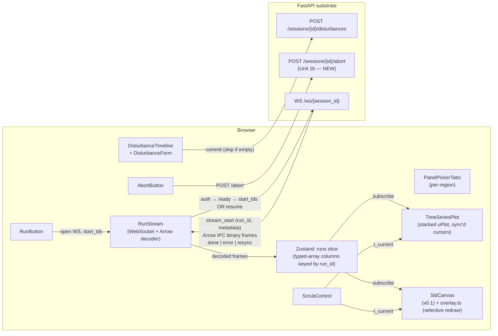

# feat: v0.2 UI — disturbance timeline + TDS streaming + animated SLD

## Overview

v0.1 demonstrated load-and-view + power flow. v0.2 turns the same UI into a dynamic-simulation tool: define disturbances (faults, line trips, parameter changes) on a timeline, run TDS, watch state variables stream over the WebSocket while bus voltages animate on the SLD, scrub through results with a synchronized cursor.

Together with v0.1, this completes **v1.0** per the brainstorm's phasing decision (v1.0 = Phase A + v0.1 + v0.2). After this lands, a researcher can do everything they would otherwise reach for PowerWorld / PSS/E for in steady-state + small-signal-via-TDS workflows.

## Problem Frame

Per origin doc R11–R14 + R18–R20 (cross-cutting). v0.1's persona — "researcher iterating on cases" — wants more than steady-state. The wedge demo is incomplete without:

1. Defining disturbances on a timeline (fault at 1.0s, clear at 1.1s, trip line 7-8 at 1.5s, etc.).
2. Running TDS with those disturbances applied.
3. Watching the simulation stream — state variables on plots, bus voltages animating on the SLD — in real time as ANDES integrates.
4. Scrubbing through completed runs to inspect state at any timestamp.

Phase A's substrate already exposes this end-to-end via WebSocket + Apache Arrow IPC streaming + run_id resume protocol (the Unit 6 + follow-on items). v0.2's job is to surface it in the UI.

## Requirements Trace

This plan satisfies the v0.2-side requirements from the origin doc:

- **R11.** Timeline-based disturbance editor — add events at specific times; types: 3-phase fault on bus, line trip, generator trip, parameter step change. Edit/delete events; reorder within the same timestamp.
- **R12.** TDS run with WebSocket streaming, structured progress (current sim time / total), abort affordance, error taxonomy (parse-error / numerical-instability / runtime-crash → distinct UI surfaces).
- **R13.** Animated time-series plots — multi-series, zoom/pan, state-variable picker (bus voltages, generator angles, frequencies, line flows). Scrub cursor synchronized with the SLD animation. (R13's CSV export is explicitly deferred to v1.5; documented in Scope Boundaries — keeping this trace honest rather than claiming export coverage we don't ship.)
- **R14.** SLD animates during/after TDS — bus voltage colors update per stream frame; flow magnitudes update; scrub cursor on the timeline drives both the plot cursor and the SLD state.
- **R15(d) carry-forward.** Layout sidecar still authoritative; TDS animation overlays on the same React Flow canvas v0.1 built — no new layout decisions.
- **R18.** **Same split-pane IA** — the disturbance editor + plots dock alongside the inspector, NOT in modals. Plot region replaces or splits the results-table region from v0.1.
- **R19.** Interaction state matrix extended — disturbance editor states (empty / draft / committed / running / done), TDS run states (idle / streaming / paused / aborted / done / error), plot states (no data / streaming / scrubbing / done).
- **R20.** Keyboard floor extended — add disturbance via keyboard; play/pause/abort TDS; scrub timeline with arrow keys.

## Scope Boundaries

- **No case authoring or topology editing.** Same scope boundary as v0.1.
- **No multi-tenant / accounts.** Same single-user-local trust model as v0.1.
- **No EIG, modal analysis, contingency analysis, OPF.** TDS-only dynamic analysis in v0.2.
- **No comparison runs** (overlay multiple TDS runs on one plot). Single-run UX in v0.2; multi-run comparison is v0.5+.
- **No export of plot images, results CSV, or run history persistence.** All in-memory; tab close = data gone. Persistence + export are v1.5 / v2.0 features.
- **No 3D visualization, geographic maps, or substation drill-down.** SLD remains 2D single-line.
- **No mobile / responsive.** Desktop-only.
- **No streaming-during-edit semantics.** Disturbances are committed when "Run TDS" is clicked; mid-run edits aren't supported (the substrate doesn't support post-setup `add()` per ANDES contract — would require a `/reload`-and-restart cycle, deferred).
- **No saved disturbance presets / scenario templates.** Each session starts with an empty timeline.

### Deferred to Separate Tasks

- **Run-history persistence** + **comparison overlay** — separate v1.5 plan.
- **Plot data export (CSV/PNG)** — separate v1.5 plan.
- **Stop-on-condition (custom triggers)** — v2.0+.
- **Disturbance presets / scenario library** — v2.0+.
- **Reduced-order plot rendering for very long sims (>60s)** — handled by the substrate's existing decimation; v0.2 UI consumes whatever the server sends. If the client can't keep up with high-rate streams, the substrate's `decimation=mean` mode kicks in (already implemented).

## Context & Research

### Relevant Code and Patterns

- **Origin doc**: `docs/brainstorms/2026-05-07-accessible-andes-power-systems-app-requirements.md` — R11-R14 own this plan's scope.
- **Phase A plan**: `docs/plans/2026-05-07-001-feat-andes-app-phase-a-substrate-plan.md` — substrate side of streaming.
- **v0.1 plan**: `docs/plans/2026-05-07-002-feat-v01-ui-load-pf-sld-plan.md` — UI shell, design tokens, IEC iconography, SLD canvas, API client. v0.2 layers onto it; does NOT re-decide.
- **Server API surface (the contract this UI consumes — verified against Phase A source, not invented)**:
  - `server/src/andes_app/api/routes/disturbances.py` — `POST /sessions/{id}/disturbances {disturbances: [...]}`. Pre-setup gated. Body schema is `AddDisturbancesRequest` with field name `disturbances` (NOT `events`) and `min_length=1` — so the empty case must NOT post.
  - `server/src/andes_app/api/routes/tds.py` — `POST /sessions/{id}/tds {tf, h?}` is **batch only**. There is no `streaming` flag and no `run_id` returned for streaming; the route always blocks until completion and returns `TdsBatchResult`. Streaming TDS does NOT go through HTTP at all.
  - `server/src/andes_app/api/routes/ws.py` — `WS /ws/{session_id}` (note the path: `/ws/{id}`, not `/sessions/{id}/ws`). The full streaming protocol lives here. Wire flow: client sends `{type: "auth", token}` within 2 s → server replies `{type: "ready"}` → client sends EITHER `{type: "start_tds", tf, h, decimation?, max_rate_hz?, vars?}` to begin a new run OR `{type: "resume", run_id, last_seq}` to resume an existing one → server sends `{type: "stream_start", run_id, metadata: {...}}` → server sends binary frames (one Arrow IPC stream chunk per WS binary message) → server sends `{type: "done", run_id, converged, final_t, callpert_count}` OR `{type: "error", code, reason}` OR `{type: "resync", run_id, current_seq, reason}` (terminal: client must reset). Auth failures close 4401; unknown session/run id close 4404; worker/internal errors close 4500.
  - `server/src/andes_app/core/stream.py` — defines the Arrow schema; `make_bus_voltage_schema(bus_idx_values)` builds `{t: float64, Bus_<idx>_v: float64, ...}`. v0.2's Unit 1 extends this with generator state + line flow.
  - `server/src/andes_app/core/session.py` — `SessionManager.start_streaming_run` assigns the `run_id` server-side; `SessionManager.signal_abort(session_id)` exists but is **session-scoped, not run-scoped**, and there is currently no HTTP route exposing it (Unit 1b adds one).
  - `server/src/andes_app/core/worker.py` — `_handle_run_tds` is the streaming branch (gated by `args["stream"] == True`); it owns the per-step Arrow encode + decimation aggregator wiring.
  - `server/src/andes_app/core/disturbance.py` — `FaultSpec`, `ToggleSpec`, `AlterSpec` discriminated union. Field-level descriptions on every Pydantic field (R25).
- **Substrate trust model & auth**: same as v0.1 — `X-Andes-Token` header on HTTP; first-message auth on WebSocket. UI passes the token from the auth store; on 401 reopens the TokenPasteModal (already wired in v0.1).
- **Streaming reconnect protocol**: per-run ring buffer with ~30 s retention (`RUN_BUFFER_RETENTION_SECONDS = 30.0` in `core/session.py`). Client opens a new WS, sends auth, waits for `ready`, then sends `{type: "resume", run_id, last_seq}`; server re-emits `stream_start` (so the JS Arrow decoder can rebuild) then replays buffered frames > `last_seq` then continues live. If `last_seq` has fallen out of the ring, the server emits `{type: "resync", current_seq, reason}` and closes — this is terminal. If the run id is unknown (e.g., server restarted), the WS closes with code 4404. Validated by `server/tests/acceptance/test_tds_streaming.py::test_streaming_resume_after_disconnect`.

### Institutional Learnings

- Memory: `reference_andes_quirks.md` — ANDES rejects all post-setup `ss.add()` calls. Disturbances must be committed before TDS starts; mid-run edits require `/reload`-and-restart.
- Memory: `feedback_deepening_needs_source_grounding.md` — for any plan refinement, verify against ANDES source (the disturbance/TDS contracts here are well-tested in Phase A; less risk).
- Memory: `feedback_collab_style.md` — user prefers comprehensive scope; engages with adversarial pressure-testing.
- `docs/solutions/2026-05-07-cli-anything-andes-architectural-mismatch.md` — backstop; not directly relevant to UI work.

### External References

The brainstorm settled the streaming-UI stack via Phase 1 research:

- **Apache Arrow JS** (`apache-arrow` npm) — decodes Arrow IPC streams in the browser. The substrate sends `pyarrow.ipc.new_stream` byte streams over WS binary messages; the JS side consumes them with `RecordBatchStreamReader.readAll()`.
- **WebSocket binary frames** — native `WebSocket` API supports `binaryType = "arraybuffer"`. No library needed.
- **uPlot** (`uplot` npm, ~45 KB gz) — the only mainstream lib that handles streaming time-series with hundreds-to-thousands of points at 30+ Hz update rates without dropping frames. Canvas-based, not React-native — wrapped in a thin `<UPlot>` React component.
- **react-resizable-panels** — already in v0.1; reused for plot-vs-table split inside the right dock.
- **Same Vite 6 + React 19 + Tailwind v4 + Radix + Zustand + TanStack Query stack** as v0.1.

## Key Technical Decisions

These are settled now; reversing any of them changes the streaming protocol or the visual identity, which would warrant a plan revision.

- **Plot library: uPlot** (canvas-based, ~45 KB gz). Wrapped in `<UPlot>` React component (`web/src/components/plots/UPlot.tsx`). Recharts/Plotly evaluated and rejected — Recharts drops frames at >10 Hz on >500 series points; Plotly is too heavy (~3 MB, slow init). visx / D3 are too DIY for the v0.2 timeframe. Decision is reversible later (the plot component is encapsulated) but committed for v0.2.
- **WebSocket client architecture**:
  - One `RunStream` instance per active TDS run (`web/src/streaming/RunStream.ts`).
  - Owns: connection lifecycle, auth handshake, run start (`start_tds`) OR resume, incremental Arrow decoding, frame buffering, reconnect-with-resume on disconnect.
  - Exposes: an event emitter (`onStart`, `onFrame`, `onDone`, `onError`, `onResync`, `onConnectionStatus`) + a Zustand-store-backed accumulated frame buffer keyed by `run_id`.
  - **WS-only protocol** — there is no HTTP step that returns a `run_id`. The flow is: open WS to `/ws/{session_id}` → send `{type: "auth", token}` → wait for `{type: "ready"}` (within the substrate's 2 s deadline) → send `{type: "start_tds", tf, h, decimation: "mean", max_rate_hz: 30, vars: [...]}` → receive `{type: "stream_start", run_id, metadata}` (the `run_id` is **server-assigned and arrives in this message**, not via HTTP) → consume binary frames (each = one Arrow IPC stream chunk = one record batch) → receive `{type: "done", ...}` OR `{type: "error", ...}` OR `{type: "resync", ...}`.
  - Uses native `WebSocket` API + `apache-arrow`'s `RecordBatchStreamReader`. Each WS binary message is one Arrow record batch; decoded incrementally.
  - **Frame sequencing**: the WS wire format does NOT expose a per-frame `seq` field. The client tracks `last_seq` as a count of binary frames received since `stream_start` (TCP guarantees ordering within one WS connection); on reconnect, the client sends the count it last decoded as `{type: "resume", run_id, last_seq}`. The substrate's internal frame counter matches this count, so the math lines up.
  - **Backpressure**: client doesn't send `ack` frames in v0.2 (substrate doesn't require them — `decimation=mean` + `max_rate_hz=30` prevent the substrate from outpacing the client). Memory cap lives in the runs slice (see "Frame buffer cap" below).
- **Streaming state in Zustand**: a `runs` slice keyed by `run_id`, each with `{run_id, started_at, t_max, t_current, seq_count, t: Float64Array, columns: Record<string, Float64Array>, state: "starting" | "streaming" | "done" | "error" | "aborted", connection: "connected" | "reconnecting" | "disconnected", aborted_locally: boolean}`. Plots + SLD overlay both subscribe to the active run. `aborted_locally` is set when the UI sends an abort; the UI uses this flag (NOT a server-side flag — see below) to distinguish "user-aborted" from "numerical instability" when `state` becomes `done` with `final_t < tf`.
- **Decoded frame storage — typed-array columnar layout**: each run holds one `Float64Array` for `t` and one `Float64Array` per variable column, all sized to `seq_count`. Append on each frame extends the arrays (geometric growth: double on overflow). This avoids JS object overhead, which in V8 is 30–50 bytes per property and would 5–10× the memory cost of an `Array<{seq, t, columns: {...}}>` design. With the typed-array layout: a 30 s sim at 30 Hz × 14 buses = 900 frames × 15 columns × 8 bytes ≈ 108 KB. NPCC 140 + 60 s + 30 Hz × 141 columns ≈ 1800 × 141 × 8 ≈ 2 MB. Even IEEE 300 + 60 s + 30 Hz × 301 columns ≈ 4.3 MB. The previous "60M floats × 8 bytes = 480 MB" claim was for 1000 Hz unbounded — but the UI now explicitly clamps to `max_rate_hz=30` (see Unit 7), so the true working set fits comfortably under 200 MB even at the worst v0.2 case.
- **Frame buffer cap (single-source-of-truth)**: the cap lives in the **runs slice** as a total-memory budget over all retained runs (default 200 MB given typed-array storage). On insert, if the running total exceeds the cap, evict completed runs' frames first (oldest completed first); if no completed runs exist, drop the oldest 10 % of the active run's frames + emit a `connectionStatus: "lagged"` event so the UI can surface a non-modal toast. This is the only place in v0.2 where a frame cap is described; references in `RunStream` and the runs store both delegate to this rule. Comparison-runs eviction policy: keep at most 1 completed run + 1 active run (no comparison overlay in v0.2 → no need for more); on Reset run, evict the run's buffers fully; on a fresh `start_tds` while a previous run is still in store, evict the oldest.
- **Output rate clamp (UI-side contract)**: the UI **always** sends `decimation: "mean"` + `max_rate_hz: 30` in the `start_tds` message (configurable in `TdsConfigPanel` for power users; default 30). This is the only honest way to make the per-frame budget claims (~33 ms / frame) survive contact with NPCC 140 / IEEE 300; the substrate's stock default is `max_rate_hz=None`, so explicit UI-side clamping is required. Documented in Unit 7's start flow.
- **Disturbance editor model**:
  - Zustand `disturbance` slice: `{disturbances: DisturbanceLocal[], dirty: boolean, committed: boolean}` (field name mirrors the substrate body field for consistency).
  - `DisturbanceLocal = { id: string (client-generated UUID), spec: FaultSpec | ToggleSpec | AlterSpec }` where the `spec` is the same Pydantic-mirroring discriminated-union shape the server expects.
  - Disturbances sorted by `spec.t` (or `tf` for faults) for display; ties broken by insertion order.
  - On "Run TDS": **if** the local list is non-empty, commit via `POST /sessions/{id}/disturbances` body `{disturbances: [...]}`; **else skip the POST entirely** (the substrate schema has `min_length=1` and would 422 on an empty list — and a free-evolution simulation is a valid v0.2 run anyway). After the optional commit, open the WS and send `start_tds`. If commit fails (422 validation error from substrate), surface as inline error on the failing disturbance row.
- **Disturbance editor UI** — see "Layout: co-resident dockable panels" below; the disturbance editor is one of the dockable panel candidates, not a global mode.
- **Layout: co-resident dockable panels (replaces 3-mode toggle)**:
  - The right dock has two regions: **top** and **bottom**. Each region is a "panel slot" with a small picker tab strip in its header that lets the user pick which panel is mounted there.
  - Top-region candidates: **TimeSeriesPlot** OR **DisturbanceTimeline** (and editor). The vertical split is user-resizable via the existing `react-resizable-panels` grip handle.
  - Bottom-region candidates: **Inspector** (v0.1 default) OR **ResultsTable** (v0.1 default after PF) OR **NumericalErrorDetails** (slide-out triggered by the error banner; see "Error surfaces" below).
  - **No global mode toggle.** This eliminates the cognitive overhead of "what mode am I in" and the friction of switching out of Disturbance mode just to read the inspector. While a TDS run is in progress the disturbance editor's picker tab is greyed (mid-run edits aren't possible per ANDES contract), but the inspector remains accessible at all times.
  - Default panel composition on app open: top = TimeSeriesPlot (empty state), bottom = Inspector. Default after switching to disturbance authoring: top = DisturbanceTimeline. The picker is sticky per session.
- **Plot layout**:
  - Default: TimeSeriesPlot occupies the right-dock top region; bottom region is Inspector or ResultsTable.
  - During TDS run + after: plot fills with streaming data immediately; the user can keep the disturbance editor visible by giving it the bottom region, OR replace the inspector with the results table.
  - **Multi-axis: stacked uPlot instances synced via `uPlot.sync('group')`** — voltages (~1 pu), gen omega (~1 pu but distinct y-range to read drift), line MW (-100 to +500 range) cannot share one Y-scale, so the plot region renders one uPlot instance per **variable group** (one for `bus_v`, one for `gen_state`, one for `line_flow`), each with its own Y-axis, all stacked vertically and joined via uPlot's built-in cursor-sync API (`uPlot.sync('group-' + run_id)`) so hover/scrub/cursor lines align across instances. Empty groups (none of that family selected) collapse to zero height.
  - **State-variable picker — tree, not chips**: a tree picker grouped by variable kind (Bus voltages → Bus 1, Bus 2, ...; Generator state → Gen 2 ω, Gen 2 δ, ...; Line flows → Line 4-5 P, Line 5-6 P, ...). Each top-level node expands; user multi-selects within or across groups. Chips are unworkable at NPCC 140 scale (140 buses × 2 = 280 chips). The tree filters live as the user types.
- **Scrub control**:
  - Continuous timeline strip below the plot. During streaming: cursor pinned at the latest frame; user can drag back to scrub history (plot redraws + SLD reflects historical state at that t).
  - After streaming: cursor freely draggable; play/pause/speed buttons (1x, 2x, 5x).
  - "Live" button snaps cursor to head and resumes following.
- **SLD animation overlay — selective redraw is a first-class deliverable, not a cleanup chore**:
  - Reuses v0.1's `web/src/components/sld/overlay.ts`. Extended to read frame data from the active run's frame at `t_current` (scrub position) instead of the static PF result.
  - Bus stroke color lerps between in-band/limit-near/violation thresholds (smooth color animation; not stepped).
  - Flow arrows on lines update direction + magnitude per frame.
  - Performance must be earned, not assumed. The component graph for selective redraw at 30 Hz:
    - `BusNode` and `LineNode` wrapped in `React.memo` with a custom equality fn that compares only the visible-state slice (voltage rounded to color-class threshold, color class, label).
    - Per-bus selector hooks (`useBusOverlayAtT(busIdx, t)`) subscribe via Zustand's selector API to ONLY the column for that bus; voltage changes on other buses don't re-render this one.
    - The React Flow `nodes` prop is updated **only on topology change**, not on overlay change — overlay state lives outside the `nodes` prop and is applied via the per-bus hooks. (React Flow re-renders the entire `nodes` array on every prop change, so this is the make-or-break optimization.)
    - **Benchmark gate**: a Unit 5 verification step measures selective-redraw frame time on IEEE 39 + 30 Hz; if > 16 ms / frame, animation work is paused and the team picks a fallback (further memoization, switching to canvas overlay, or capping animation to scrub-only) before continuing.
- **Reconnect/resume integration**:
  - `RunStream` listens for `WebSocket.onclose`; if `code !== 1000` (clean) and run state is "streaming", reconnects with exponential backoff (250 ms / 500 ms / 1 s / 2 s / 4 s / 8 s — capped, max 5 attempts).
  - On successful reconnect, opens a **new** WS, sends `{type: "auth", token}`, waits for `{type: "ready"}`, then sends `{type: "resume", run_id, last_seq: <client-tracked count>}`. Server re-emits `stream_start` (the JS Arrow decoder rebuilds from this) and resumes binary frames.
  - During disconnect: connection status badge shows "Reconnecting…"; plot continues showing buffered data; scrub still works.
  - Three terminal failure paths the WS can take after reconnect:
    1. **Auth failed (close 4401)** — token is invalid/stale. `RunStream.onError({code: "auth_failed"})` → clear token + reopen the v0.1 TokenPasteModal.
    2. **Run not found (close 4404)** — the server may have restarted between disconnect and reconnect, or the retention window elapsed. `RunStream.onError({code: "run_not_found"})` → non-modal warning: "The simulation run is no longer available on the server (the server may have restarted). Reset and re-run."
    3. **Resync emitted (`{type: "resync", current_seq, reason}` then close)** — `last_seq` fell out of the retention ring buffer (disconnect lasted longer than 30 s). `RunStream.onError({code: "buffer_evicted"})` → non-modal warning: "Connection dropped too long; partial buffer retained. Re-run to resume." Do NOT auto-reconnect after a resync — it is terminal.
- **Abort affordance** (R12) — depends on a server-side route that does NOT exist in stock Phase A; v0.2 adds it as Unit 1b:
  - Server-side: new endpoint `POST /sessions/{session_id}/abort` (session-scoped, matching the underlying `SessionManager.signal_abort(session_id)` API; runs are 1-per-session in v0.2 so this is sufficient). Auth-gated. The worker sees the abort_event flip; `callpert` checks the flag and sets `ss.TDS.busted = True`; TDS exits at next callpert tick.
  - Client-side: top-bar "Abort" button while running → calls `POST /sessions/{id}/abort` → sets `runs[run_id].aborted_locally = true` → waits for the WS to emit `{type: "done", final_t < tf}` → flips state to `"aborted"`.
  - **Important: the WS `done` message has no `aborted` flag.** The UI infers "aborted" by combining local + remote state: if `aborted_locally === true` and `final_t < tf` → `"aborted"`; if `aborted_locally === false` and `final_t < tf` → `"error"` (numerical instability surface); else → `"done"`. Documented in Unit 7.
- **Error surfaces** (R12 → R8 taxonomy carry-forward):
  - **Disturbance commit error** (e.g., bus_idx not in topology) → inline error on the failing disturbance row in the timeline editor. Doesn't open modal.
  - **TDS numerical instability / step-reduction-to-zero** → **non-modal banner above the right dock** ("TDS halted at t={t}: numerical instability. View details ▸"). Click expands a non-modal slide-out with last 5 frames, mismatch values, "Reset run" affordance. Inspector + scrub remain accessible — researchers can scrub through the partial buffer and inspect bus state at the moment of failure. (Mirrors the v0.1 plan's same correction for PF non-convergence.)
  - **Worker crash / 5xx** → modal exception (same as v0.1; the only allowed non-destructive modal).
  - **WebSocket connection lost (transient)** → top-bar status badge, NOT a modal. User can keep working with already-buffered data.
  - **WebSocket connection lost (permanent — server died)** → modal: "Connection to the server was lost. Reload to reconnect."
  - **Resync (buffer evicted)** + **run-not-found (server restart)** → non-modal warnings, see Reconnect section above.

## Open Questions

### Resolved During Planning

- **Plot library choice**: uPlot, settled above. Wrapped in a thin React component so future swaps remain encapsulated.
- **How fast does the SLD animate during streaming?** Decoupled from frame rate. SLD redraw runs in `requestAnimationFrame` (max 60 Hz); reads the latest frame at each tick. If frames arrive faster than redraws (rare given substrate's `max_rate_hz` default of 30), the previous frame is skipped — animation is the latest state, not every state.
- **Scrub UI primitive**: custom timeline strip (not a Radix Slider). Slider UX feels wrong for a continuous time domain with potentially thousands of buffered frames; the timeline strip directly visualizes the buffered range + uses a draggable cursor.
- **Disturbance time conflicts** (e.g., two disturbances at t=1.0s): allowed; ANDES processes them in insertion order. UI sorts by time then by insertion order; visualizes stacked markers on the timeline strip.
- **What if disturbance spec validation fails server-side after the user committed locally?** The error rolls back the local "committed" state; inline error on the failing disturbance row. User edits + recommits.
- **How does the user start fresh after an aborted/failed run?** "Reset run" button in the top bar (visible after a run is in `done`/`error`/`aborted` state) calls `POST /sessions/{id}/reload` (substrate has this for re-setting up). The disturbance timeline is preserved (still in Zustand), but the run frame buffer + plot state clear.
- **Layout for disturbance editor**: docked in the right-dock top region as one of the candidate panels (see "Layout: co-resident dockable panels" in Key Technical Decisions). User picks via the panel-picker tab strip; no global mode toggle.

### Deferred to Implementation

- **Exact Arrow schema for generator-angle and line-flow streams**. Phase A's stream schema is bus-voltage-only (`stream.py::make_bus_voltage_schema`). v0.2 needs to extend it. Concrete schema decided in Unit 1 (server-side schema extension).
- **Plot color palette** — picked during Unit 4 from v0.1's design tokens. ~10 distinguishable colors with WCAG AA contrast against plot background.
- **Disturbance form layout for compound specs** (Alter with multiple field changes) — implementer designs during Unit 3.
- **Empty-state copy for the disturbance timeline + plot** — designer-author writes during Unit 2 / Unit 4.
- **Animation easing for SLD voltage colors** — picked during Unit 5 (160-200 ms ease-out feels right, but verified visually).
- **Mobile/touch handling for scrub** — out of scope for v0.2 (desktop only).
- **Plot zoom/pan gesture conventions** — Mac trackpad pinch + two-finger drag standard; explicit zoom in/out buttons as fallback. Implementer wires during Unit 4.

## Output Structure

```text
.
├── docs/
│   └── plans/
│       ├── 2026-05-07-001-feat-andes-app-phase-a-substrate-plan.md
│       ├── 2026-05-07-002-feat-v01-ui-load-pf-sld-plan.md
│       └── 2026-05-07-003-feat-v02-ui-disturbance-tds-streaming-plan.md
├── server/
│   └── src/andes_app/core/stream.py    # extend schemas for gen-angle + line-flow streams
├── web/
│   ├── package.json                     # add: uplot, apache-arrow (already in v0.1's deps), uuid
│   ├── src/
│   │   ├── components/
│   │   │   ├── disturbance/
│   │   │   │   ├── DisturbanceTimeline.tsx       # the t-axis strip
│   │   │   │   ├── DisturbanceMarker.tsx
│   │   │   │   ├── DisturbanceForm.tsx           # discriminated union → form
│   │   │   │   ├── FaultSpecForm.tsx
│   │   │   │   ├── ToggleSpecForm.tsx
│   │   │   │   ├── AlterSpecForm.tsx
│   │   │   │   ├── AddEventDialog.tsx            # primary entry point: Radix Dialog wrapping DisturbanceForm
│   │   │   │   └── DisturbancePanel.tsx          # right-dock panel content (replaces DisturbanceModeShell)
│   │   │   ├── plots/
│   │   │   │   ├── UPlot.tsx                     # thin uPlot React wrapper
│   │   │   │   ├── TimeSeriesPlot.tsx            # stacked uPlot instances per variable group, sync'd cursors
│   │   │   │   ├── VariableTreePicker.tsx        # state-variable tree multi-select (replaces chip picker)
│   │   │   │   └── ScrubControl.tsx              # custom timeline strip + play/pause
│   │   │   ├── tds/
│   │   │   │   ├── RunButton.tsx                 # extends/replaces v0.1's RunButton with TDS branch
│   │   │   │   ├── RunStatusBadge.tsx            # streaming / reconnecting / done indicator
│   │   │   │   ├── NumericalErrorBanner.tsx      # non-modal banner above the right dock
│   │   │   │   ├── NumericalErrorDetails.tsx     # slide-out triggered by the banner
│   │   │   │   └── TdsConfigPanel.tsx            # tf, h override, vars, max_rate_hz (Unit 8)
│   │   │   └── shell/
│   │   │       └── PanelPickerTabs.tsx           # per-region tabs to swap dockable panels
│   │   ├── streaming/
│   │   │   ├── RunStream.ts                      # WebSocket + Arrow decoder + reconnect
│   │   │   ├── arrow.ts                          # Arrow stream decoding helpers
│   │   │   └── reconnect.ts                      # exponential backoff helper
│   │   ├── store/
│   │   │   ├── disturbance.ts                    # disturbance editor state slice (NEW in v0.2)
│   │   │   ├── runs.ts                           # active runs + frame buffer slice (NEW in v0.2)
│   │   │   └── ui.ts                             # panel-picker state + per-region resize state (NEW in v0.2)
│   │   ├── api/
│   │   │   ├── generated.ts                      # regenerated to include disturbance + TDS + abort + alterable-params schemas
│   │   │   └── queries.ts                        # add useCommitDisturbances, useAbortRun, useResetRun, useAlterableParams
│   │   └── components/sld/
│   │       └── overlay.ts                        # extended to consume run frames
│   └── tests/
│       ├── unit/
│       │   ├── components/disturbance/
│       │   ├── components/plots/
│       │   ├── components/tds/
│       │   ├── streaming/
│       │   └── store/
│       └── e2e/
│           └── tds-streaming-flow.spec.ts        # the v0.2 flagship e2e
```

## High-Level Technical Design

> *This illustrates the intended approach and is directional guidance for review, not implementation specification.*

### Streaming pipeline



### v0.2 user flow

```mermaid
sequenceDiagram
    participant User
    participant UI as React UI
    participant Server as FastAPI
    participant WS as WebSocket
    User->>UI: Start from v0.1 state (case loaded, PF run)
    User->>UI: Open DisturbanceTimeline panel (top region)
    UI->>UI: Show DisturbanceTimeline (empty) + "Add event" button
    User->>UI: Click "Add event"; pick Fault, bus 4, tf=1.0, tc=1.1
    UI->>UI: Form saves to local store
    User->>UI: (optionally) Click "Add event" again for a Toggle at t=1.5
    User->>UI: Click "Run TDS" (in top bar)
    alt local list non-empty
      UI->>Server: POST /sessions/{id}/disturbances {disturbances: [...]}
      Server-->>UI: 200 (committed)
    else local list empty
      UI->>UI: skip POST (substrate min_length=1; free-evolution run)
    end
    UI->>WS: open WS to /ws/{session_id}
    UI->>WS: {type: "auth", token}
    WS-->>UI: {type: "ready"}
    UI->>WS: {type: "start_tds", tf: 10, h: null, decimation: "mean", max_rate_hz: 30, vars: ["bus_v"]}
    WS-->>UI: {type: "stream_start", run_id, metadata}
    UI->>UI: Pre-first-frame skeleton + "Starting simulation…"
    loop streaming
      WS-->>UI: Arrow IPC binary (one record batch)
      UI->>UI: Decode → append columns to typed arrays in runs slice
      UI->>UI: Plot redraws (uPlot setData); SLD overlay updates (selective)
    end
    WS-->>UI: {type: "done", run_id, converged, final_t, callpert_count}
    UI->>UI: Run state → "done" (or "aborted" if aborted_locally && final_t < tf, or "error" if !aborted_locally && final_t < tf)
    UI->>UI: scrub cursor pinned at head
    User->>UI: Drag scrub cursor to t=1.05s
    UI->>UI: Plot cursor moves; SLD reflects state at t=1.05s
```

### Disturbance editor state machine (R19 extension)

| State | Trigger | Visual |
|---|---|---|
| empty | initial | "No disturbances yet. Click 'Add event' to schedule one (or run TDS as a free-evolution sim)." |
| draft | first disturbance added | Marker on timeline; "Add event" + edit affordance |
| committed | "Run TDS" clicked + commit succeeds (or skipped if empty) | All disturbances become read-only; Run button greys out (in-progress) |
| running | TDS started | Run button → Abort; status badge in top bar; disturbance editor's panel-picker tab greyed (mid-run edits aren't possible per ANDES contract) |
| done | streaming `done` received with `final_t == tf` | Run button reappears; "Reset run" affordance; disturbances still visible |
| aborted | `done` received with `aborted_locally==true && final_t < tf` | "Aborted at t={final_t}"; Reset run; partial buffer scrubbable |
| error | `done` with `aborted_locally==false && final_t < tf`, OR `error`, OR `resync`, OR run_not_found | Non-modal banner above the right dock; click expands NumericalErrorDetails slide-out; inspector remains accessible |

### Error-surface taxonomy (R12)

| Error category | Server response | UI surface |
|---|---|---|
| Disturbance validation | `POST /disturbances` 422 with `ProblemDetails` | Inline error badge on the failing disturbance row in the timeline |
| Disturbance commit conflict (case already setup) | `POST /disturbances` 409 ("disturbance-commit") | Inline banner in disturbance editor: "Case state requires reload. Reload + retry." with Reload button |
| TDS numerical instability | WS `done` with `final_t < tf` and the UI did not send abort | Non-modal banner above the right dock ("TDS halted at t={final_t}: numerical instability. View details ▸") + slide-out details; inspector + scrub remain accessible |
| Buffer evicted on resume | WS `{type: "resync", current_seq, reason}` then close | Non-modal warning toast: "Connection dropped too long; partial buffer retained. Re-run to resume." |
| Run not found on resume (server restart) | WS close with code 4404 after resume attempt | Non-modal warning toast: "The simulation run is no longer available on the server. Reset and re-run." |
| Worker crash / wrapper error | WS `{type: "error", code, reason}` then close 4500 | Modal exception (same surface as v0.1's runtime crash) |
| Auth failed on (re)connect | WS close with code 4401 | Clear token + reopen TokenPasteModal (v0.1 wiring) |
| Transient WS disconnect | `WebSocket.onclose` with code != 1000 and not auth/4404 | Top-bar status badge "Reconnecting…"; auto-resume on reconnect; no modal |
| Permanent WS failure (5+ retry attempts) | exhausted retries | Modal: "Connection lost. Reload to reconnect." |

## Implementation Units

The plan is **phased**: Phase 1 lands the streaming pipeline + plot (largest risk; demonstrates the wedge claim independently). Phase 2 lands the disturbance editor + TDS integration + animation overlay. Each phase is independently demoable: Phase 1 can stream a TDS run that has no disturbances (a free-evolution simulation); Phase 2 makes it useful.

### Phase 1: Streaming pipeline + plot

- [x] **Unit 1: Server-side stream schema extension** *(server-side; can run in parallel with v0.1 implementation — this is misclassified as "UI plan" but is pure server work and must land before any v0.2 UI unit can integrate)*

**Goal:** Extend the existing bus-voltage Arrow schema (`server/src/andes_app/core/stream.py`) to also stream generator state (`δ`, `ω`) + line active power (`p_flow`). Extend the WebSocket `start_tds` handler to accept and validate a `vars` field selecting which variable groups to stream. Wire through the worker.

**Requirements:** R13 (state-variable picker requires the data), R12 (substrate carries the streaming contract).

**Dependencies:** None — pure server change. Independent of v0.1.

**Files:**
- Modify: `server/src/andes_app/core/stream.py` (add `make_generator_state_schema`, `make_line_flow_schema`, plus a `make_combined_schema(vars: list[str], system)` composer that returns the unified schema for the requested variable groups)
- Modify: `server/src/andes_app/core/worker.py` (extend `_handle_run_tds` streaming branch to read multiple variable groups per callpert tick + emit them in the same Arrow record batch)
- Modify: `server/src/andes_app/api/routes/ws.py` (extend the `start_tds` config parser to accept `vars: list[Literal["bus_v","gen_state","line_flow"]]`, default `["bus_v"]`, validate against the literal set, forward to `mgr.start_streaming_run` args)
- Modify: `server/src/andes_app/api/schemas.py` (extend the existing `TdsRunRequest` class to also accept `vars` for the batch path so the OpenAPI surface is consistent; the streaming path is the primary consumer)
- Test: `server/tests/acceptance/test_tds_streaming.py` (extend with new variable-group cases)
- Test: `server/tests/unit/test_stream_schemas.py` (NEW: schema correctness)

**Approach:**
- The existing schema is `{t: float64, Bus_<idx>_v: float64, …}`. New columns: `Gen_<idx>_delta`, `Gen_<idx>_omega`, `Line_<idx>_p`.
- One Arrow record batch per emit (no separate streams) — keeps the WS protocol simple. Each frame has `t` + columns for whichever variables the user requested.
- ANDES exposes generator state vars via `ss.SynGen.delta.v[i]`, `ss.SynGen.omega.v[i]` (where `SynGen` is the parent class for `GENROU` / `GENCLS`). Line flows via `ss.Line.a1.v` + `Line.v1.v` etc — actual power computed `S = V·conj(I)`. Detail decided during implementation; goal is to expose what each plot series needs without re-running PF.
- The stream-start metadata (already sent once per run by `_handle_run_tds`) carries the schema description; extend it to enumerate all included columns so the client can wire its picker.
- `vars` validation lives in `ws.py` (not just at Pydantic model level) because the WS path doesn't go through the FastAPI request-body machinery. Reject `vars=[]` with a structured error close.

**Patterns to follow:**
- `server/src/andes_app/core/stream.py::make_bus_voltage_schema` — mirror its structure.
- `server/tests/unit/test_stream_aggregator.py` — mirror its structure for the new schemas.

**Test scenarios:**
- Happy path: WS `start_tds` with `vars: ["bus_v","gen_state"]` produces frames whose Arrow schema has both bus voltage + gen delta/omega columns.
- Happy path: stream-start metadata enumerates all included columns for the chosen `vars` set.
- Edge case: `vars=[]` rejected with structured WS error (close 4500 + `{type: "error", code, reason}`).
- Edge case: `vars=["line_flow"]` on a case with zero lines — the schema is well-formed (zero columns of that prefix); doesn't crash.
- Edge case: aggregation modes (`decimation: "mean"`) work with the extended schema (mean of multi-column rows).
- Backward compat: `vars` omitted → defaults to `["bus_v"]` → identical wire format to v0.1.

**Verification:**
- All server-side stream tests pass.
- Manual: open a WS, auth, send `start_tds` with `vars: ["bus_v","gen_state","line_flow"]`; receive frames; decode with `pyarrow.ipc.open_stream`; assert all expected columns present.

---

- [x] **Unit 1b: Substrate abort endpoint + alterable-params endpoint** *(server-side; depends on Unit 1 only for shared file ownership; can run in parallel)*

**Goal:** The plan's UI flow assumes a `POST /sessions/{id}/tds/abort/{run_id}` endpoint exists — it does NOT in stock Phase A. Add an HTTP route that exposes the existing `SessionManager.signal_abort` API. Also add a topology-introspection endpoint the AlterSpec form uses to populate its parameter dropdown (currently planned as "best-effort UI-side", which leaks substrate knowledge into the UI).

**Requirements:** R12 (abort affordance), R11 (AlterSpec UX).

**Dependencies:** None — pure server change.

**Files:**
- Modify: `server/src/andes_app/api/routes/tds.py` (or new file `routes/abort.py` — pick during impl): add `POST /sessions/{session_id}/abort` (auth-gated, calls `SessionManager.signal_abort(session_id)`, returns `{aborted: true}` or 404 if session unknown). The route is **session-scoped, not run-scoped**, mirroring the underlying API; v0.2 has 1 active run per session so this is sufficient.
- Modify: `server/src/andes_app/core/session.py` if needed: thread the abort signal through to the WS done message ONLY if doing so is trivial; otherwise the UI infers aborted status from local state (preferred — see Unit 7).
- Modify: `server/src/andes_app/api/routes/topology.py` (or wherever it lives in v0.1): add `GET /sessions/{session_id}/topology/models/{model}/alterable_params` returning the list of parameter names ANDES will accept for `src` on that model. UI populates the AlterSpec parameter dropdown from this endpoint. If the introspection turns out to be infeasible in the v0.2 timeframe, fall back to a hardcoded common subset shipped with the UI: `load.p0`, `load.q0`, `Bus.v0`, `GENROU.M`, `GENROU.D`, `Line.r`, `Line.x`.
- Test: `server/tests/acceptance/test_abort.py` (NEW): assert that a streaming run aborts within ~100ms of `POST /abort`; assert WS `done` arrives with `final_t < tf`.
- Test: `server/tests/acceptance/test_topology_alterable_params.py` (NEW or extension).

**Approach:**
- Abort: identical pattern to other session-scoped routes (auth, manager lookup, error mapping). Returns 200 immediately; the actual TDS exit happens at the next `callpert` tick on the worker.
- Alterable-params: best-effort introspection of the model's `params` collection on the loaded `System`. ANDES exposes `model.params` as an OrderedDict; filter to the alterable subset (skip read-only / derived params).

**Test scenarios:**
- Happy path: start a streaming TDS via WS; from another HTTP client, POST /abort; the WS receives `done` with `final_t < tf` within 1 sim-second of wall clock.
- Edge case: POST /abort with no active run → 200 (no-op; abort_event set but never read).
- Edge case: POST /abort on closed session → 404.
- Auth: missing or wrong token → 401.

**Verification:**
- All abort + alterable-params tests pass.
- Manual: start a 60s sim, abort at 5s, confirm WS `done` arrives + `final_t ≈ 5`.

---

- [x] **Unit 2: WebSocket client + Arrow decoder + reconnect (+ R19 interaction-states matrix extension)**

**Goal:** Implement `web/src/streaming/RunStream.ts` — a class that owns the WS lifecycle for a single TDS run, decodes Arrow IPC binary frames into typed-array columns, and feeds the runs Zustand slice. Includes auth, start/resume, exponential-backoff reconnect, resync handling, and connection-status events. Also extend the R19 interaction-states matrix for the new v0.2 surfaces (plot, scrub, run lifecycle, banner) **before** Unit 3, so plot/scrub state-cells are designed before code lands.

**Requirements:** R12 (streaming contract), R19 (interaction-states matrix; previously deferred to Unit 8 — promoted here to Phase 1).

**Dependencies:** Unit 1 (uses extended schema), Unit 1b (uses abort + alterable-params endpoints — referenced by later units, but RunStream itself does not call them), v0.1's auth store + API client.

**Files:**
- Create: `web/src/streaming/RunStream.ts`
- Create: `web/src/streaming/arrow.ts` (`decodeArrowBatch(buffer: ArrayBuffer) → DecodedFrame`)
- Create: `web/src/streaming/reconnect.ts` (exponential backoff helper with cap + max attempts)
- Create: `web/src/store/runs.ts` (Zustand slice keyed by `run_id`; typed-array columnar storage)
- Modify: `web/docs/interaction-states.md` (extend R19 matrix with v0.2 surfaces — disturbance editor, run lifecycle, plot, scrub, banner)
- Test: `web/tests/unit/streaming/RunStream.test.ts` (uses `mock-socket` lib for WebSocket mocking)
- Test: `web/tests/unit/streaming/arrow.test.ts`
- Test: `web/tests/unit/store/runs.test.ts`

**Approach:**
- `RunStream` constructor: `new RunStream({sessionId, token, wsUrl, tdsArgs: {tf, h?, vars}, onStart, onFrame, onDone, onError, onResync, onConnectionStatus})`. Note: `runId` is NOT a constructor argument — it arrives in the server's `stream_start` message and is captured by `RunStream` for resume bookkeeping.
- Lifecycle (new run): `start()` opens WS to `/ws/{sessionId}` → immediately sets `binaryType = "arraybuffer"` → sends `{type: "auth", token}` → awaits `{type: "ready"}` (substrate has a 2s deadline) → sends `{type: "start_tds", tf, h, decimation: "mean", max_rate_hz: 30, vars}` → awaits `{type: "stream_start", run_id, metadata}` → captures `run_id` and `metadata` → enters streaming loop. Binary messages = Arrow record batches; JSON messages = lifecycle events.
- Lifecycle (reconnect/resume): on `WebSocket.onclose` with code != 1000, opens a new WS → auth → `ready` → sends `{type: "resume", run_id, last_seq: client_frame_count}` → awaits a re-emitted `stream_start` (server re-sends so the JS Arrow decoder can rebuild from a fresh schema) → continues frame loop.
- **`last_seq` accounting**: the WS wire format does NOT expose a per-frame `seq` field. The client tracks `last_seq` as the count of binary frames decoded since `stream_start`. TCP guarantees ordering within one WS connection, so this count matches the server's internal `frame_seq`. Document this clearly in `RunStream.ts` so future maintainers don't search the wire format for a `seq` field that doesn't exist.
- **Resync handling**: when the server emits `{type: "resync", run_id, current_seq, reason}` (because `last_seq` fell out of the ring), `RunStream` treats this as **terminal**: emits `onError({code: "buffer_evicted", current_seq, reason})` + tears the WS down. Does NOT auto-reconnect (the reason for resync is "we waited too long"; reconnecting would reopen the same gap). UI surfaces a non-modal warning ("Connection dropped too long; partial buffer retained. Re-run to resume.").
- **Run-not-found handling**: WS close code 4404 after a `resume` → `onError({code: "run_not_found"})` → non-modal warning (server may have restarted; user must reset and re-run). Distinguish from 4401 (auth failed → clear token + reopen the v0.1 TokenPasteModal).
- Arrow decoding: each binary message is one record batch. Use `RecordBatchStreamReader.from(new Uint8Array(buffer))` (apache-arrow JS API). For each row in the batch, push the values into the typed-array columns in the runs slice (geometric growth on overflow).
- Runs store maintains the typed-array columnar layout per `run_id`; `last_seq` is just `t.length` after appending.
- Connection status: emit `{state: "connected" | "reconnecting" | "disconnected"}` events; UI subscribes via `onConnectionStatus`. The "lagged" state from the runs slice cap is also surfaced via this channel.
- Frame buffer cap: defers to the runs slice cap rule (Key Technical Decisions → "Frame buffer cap"); RunStream does NOT have its own cap.

**Patterns to follow:**
- `server/src/andes_app/api/routes/ws.py` for the WS protocol shape (the docstring at the top is the canonical wire spec).
- Apache Arrow JS docs: `arrow.apache.org/docs/js/`.

**Test scenarios:**
- Happy path: simulated WS responds with `ready` + `stream_start` + 100 binary frames + `done`; `RunStream` emits 1 `onStart` (with run_id from stream_start), 100 `onFrame`s with correctly decoded values, 1 `onDone`; runs store has 100 frames' worth of t-values + column values in order.
- Edge case: binary frame arrives before `stream_start` → drop frame + log warning (per Phase A protocol the substrate doesn't emit binary before `stream_start`, but be defensive).
- Edge case: `onclose` mid-stream with code 1006 → reconnect attempt 1 after 250 ms → new WS → `auth` → `ready` → `{type: "resume", run_id, last_seq: 50}` → server re-emits `stream_start` → server sends frames 51-99 + done; runs slice's typed arrays grow only by frames 51-99 (no duplication).
- Edge case: server emits `{type: "resync", current_seq: 200, reason: "..."}` → `onError({code: "buffer_evicted"})` fires; no auto-reconnect; WS torn down.
- Edge case: WS close 4404 after resume attempt → `onError({code: "run_not_found"})` fires; UI warning toast.
- Edge case: WS close 4401 → `onError({code: "auth_failed"})` fires; UI clears token + reopens modal.
- Edge case: 5 reconnect attempts all fail → `RunStream` emits `onConnectionStatus({state: "disconnected", reason: "max_retries"})`. UI surfaces the permanent-failure modal.
- Edge case: Arrow batch with extra unknown column → `DecodedFrame` includes it (forward-compat with future schema additions).
- Edge case: Arrow batch with NaN value → preserved (don't crash; uPlot handles NaN gaps).
- Race: `RunStream.start()` then immediate `RunStream.dispose()` before WS opens → no leak; cleanup runs.

**Verification:**
- All streaming unit tests pass.
- Integration: connect a real `RunStream` to a test substrate (`andes-app serve` + IEEE 14 + simple TDS); receive + decode 100 frames; values match what `pyarrow.ipc.open_stream` would decode for the same bytes.
- Coverage: simulated mid-stream disconnect + resume passes test; simulated resync emits `onError({code: "buffer_evicted"})`.
- R19 matrix doc reviewed before Unit 3 starts; covers every v0.2 surface × every documented state.

---

- [x] **Unit 3: TimeSeriesPlot component (stacked uPlot wrappers, sync'd cursors) + tree variable picker**

**Goal:** Build the project's plot component using uPlot. Multi-series across multiple variable groups (each group on its own y-scale, stacked vertically with synchronized cursors), zoom/pan via trackpad gestures, tree-style state-variable picker that adds/removes series live, smooth performance on streaming data at the UI-clamped 30 Hz output rate.

**Requirements:** R13.

**Dependencies:** Unit 2 (consumes runs store + R19 matrix), v0.1's design tokens.

**Files:**
- Create: `web/src/components/plots/UPlot.tsx` (thin React wrapper around a single uPlot — manages canvas lifecycle, memoizes options, calls `setData` on data changes)
- Create: `web/src/components/plots/TimeSeriesPlot.tsx` (project plot — composes one `<UPlot>` per visible variable group, joined via `uPlot.sync('group-' + run_id)`; applies design tokens, axis formatting, legend, tooltip, axes labels)
- Create: `web/src/components/plots/VariableTreePicker.tsx` (tree picker grouped by variable kind; multi-select within or across groups; live filter on type)
- Modify: `web/package.json` (add `uplot` dep)
- Test: `web/tests/unit/components/plots/UPlot.test.tsx`
- Test: `web/tests/unit/components/plots/TimeSeriesPlot.test.tsx`
- Test: `web/tests/unit/components/plots/VariableTreePicker.test.tsx`

**Approach:**
- `<UPlot data={...} options={...} />` thin wrapper: creates a uPlot instance once on mount; calls `setData(data)` on data change (uPlot's incremental-update path is fast). On options change (rare — series add/remove, axis format), destroy + recreate.
- `<TimeSeriesPlot run={run} selectedVars={vars} />` composes:
  - One inner `<UPlot>` per **non-empty** variable group: `bus_v` (voltages, ~1 pu, "V (pu)" axis), `gen_state` (omega/delta, "ω (pu)" / "δ (rad)" axes), `line_flow` (MW, "P (MW)" axis). Empty groups collapse to zero height.
  - All inner `<UPlot>` instances share a uPlot sync key: `uPlot.sync('group-' + run_id)`. uPlot's built-in cursor-sync joins cursor X-position across all instances; hovering on the voltage plot moves the cursor on the omega + line-flow plots in lockstep.
  - Stacking: vertical CSS flex; per-group height proportional to selected-series count (min 80 px, max equal share).
- Subscribes to runs store; reads typed-array columns; for each visible group, slices the relevant columns into uPlot's `[xs, ...ys]` format (zero-copy where possible — uPlot accepts typed arrays directly).
- For streaming runs, the plot receives data updates at the UI-clamped 30 Hz output rate. For each update, derive the array slice and call `setData`. uPlot redraws in <2 ms for typical sizes.
- **VariableTreePicker**: reads the run's stream metadata (column list) → renders a tree:
  ```
  ▾ Bus voltages (140)        [Select all]
      ▢ Bus 1
      ▢ Bus 2
      ☑ Bus 4
      ...
  ▸ Generator state (28)
  ▸ Line flows (215)
  ```
  Filter input at the top: typing "bus 4" narrows; typing "ω" filters to omega rows. Multi-select within or across groups via checkboxes. Selected variables persist per session.
- Axis format: x = "t (s)" with 2-decimal precision; y formatted per group (voltage = pu with 3 decimals; angle = degrees; frequency = Hz; flow = MW with 1 decimal).
- Legend: top of each per-group plot; click-to-toggle series visibility within that group.
- Tooltip on hover: shows t + values for all visible series across all groups (one tooltip near the cursor, not one per plot).
- Theming: all colors from design tokens; supports light + dark mode.

**Patterns to follow:**
- uPlot docs: `github.com/leeoniya/uPlot/tree/master/docs`. Cursor sync: `uPlot.sync(key)` API.
- v0.1's component library style (`web/src/components/ui/`) for theming + token usage.
- v0.1's `Tree` primitive (if it exists) for the tree picker; otherwise build on Radix `Collapsible`.

**Test scenarios:**
- Happy path: select 2 buses + 1 gen omega + 1 line flow → 3 stacked uPlot instances render; cursor moves on one → moves on all three within one rAF tick.
- Streaming path: typed-array column grows from 100 → 200 elements → each visible plot's `setData` called once; canvases update.
- Edge case: empty data → "Starting simulation…" centered placeholder; not a broken plot.
- Edge case: VariableTreePicker filter "bus 4" → tree collapses to just bus 4; clearing filter restores.
- Edge case: select-all on Bus voltages with NPCC 140 → 140 series in the bus_v plot; render time stays under 16 ms (verified in benchmark test).
- Edge case: NaN values in data → uPlot draws gaps; doesn't crash.
- Edge case: variable picker selection toggle adds/removes a series without recreating the uPlot instance (data-only change) — verified via spied `setData` vs constructor calls.
- Theming: light → dark mode swap recolors all stacked plots without re-creating.
- Tooltip: hover at t=2.5s → tooltip shows values for that t for all visible series across all stacked plots.

**Verification:**
- All plot unit tests pass.
- Manual: stream a 30s IEEE 14 TDS with bus voltages + gen omega; plot updates smoothly without dropped frames; pinch-zoom + pan work; variable toggle re-renders correctly; cursor sync visibly snappy.

---

- [x] **Unit 4: ScrubControl + plot-SLD synchronization**

**Goal:** Build the timeline-strip scrub control. Drives a `t_current` value in the runs store; plot cursor + SLD overlay both subscribe to it. Play/pause/speed buttons. "Live" snap-to-head while streaming.

**Requirements:** R13 (scrub cursor), R14 (synchronized).

**Dependencies:** Units 2, 3.

**Files:**
- Create: `web/src/components/plots/ScrubControl.tsx` (timeline strip + cursor + transport controls)
- Modify: `web/src/store/runs.ts` (add `t_current` field per run; add play/pause/speed actions)
- Modify: `web/src/components/plots/TimeSeriesPlot.tsx` (consume `t_current` → render the cursor line on uPlot)
- Modify: `web/src/components/sld/overlay.ts` (consume `t_current` → look up nearest frame → drive overlay state)
- Test: `web/tests/unit/components/plots/ScrubControl.test.tsx`
- Test: `web/tests/unit/store/runs.test.ts` (extended for scrub actions)

**Approach:**
- ScrubControl is a horizontal strip showing the buffered range. Cursor = a vertical line at `t_current`. Drag the cursor to scrub; cursor snaps to the nearest frame's t.
- Play button = sets `playing: true` in runs store; an animation loop in the store advances `t_current` at `speed × wall_clock` until reaching `t_max`. Pause stops the loop.
- "Live" button = sets `t_current = head_t` and pins it (any new frame advances it). Visible only while `state === "streaming"` or after an aborted/completed run while `t_current === head_t`.
- Speeds: 0.25x, 0.5x, 1x, 2x, 5x. UI shows current speed; click cycles.
- Plot integration: the plot receives `t_current` as a prop; renders a uPlot `cursor` (built-in feature) at that x-position. Doesn't trigger a re-render on every cursor move (uPlot has a low-level cursor API that's separate from the data path).
- SLD integration: `overlay.ts` exposes `getOverlayStateAt(run, t) → {bus_idx → {voltage, color, ...}}`. Bus + edge components subscribe.
- Performance: the SLD redraw on scrub change runs in `requestAnimationFrame`; multiple scrub events within one frame coalesce to one redraw.
- Keyboard (R20): focused timeline accepts Left/Right arrow = step one frame; Shift+arrow = step 100 frames; Space = play/pause.

**Patterns to follow:**
- `react-resizable-panels` interaction patterns for grip-handle drag UX.
- uPlot's cursor API for the plot side.

**Test scenarios:**
- Happy path: drag cursor from t=0 to t=5 → `t_current` updates; plot cursor moves; SLD overlay reflects state at t=5.
- Happy path: click "Live" while streaming → cursor pins to head; new frames advance it.
- Happy path: scrub off live → "Live" badge appears; click → snaps back.
- Edge case: scrub past `head_t` while streaming → cursor clamps to head.
- Edge case: scrub before `t=0` → clamps to 0.
- Edge case: drag during streaming with auto-following → user drag wins; auto-following pauses; "Live" button reappears.
- Play: 1x speed advances cursor at wall-clock rate; 5x at 5× wall-clock; reaches end → stops; doesn't loop.
- Keyboard: Right arrow advances cursor; Space pauses.
- Sync: `t_current` change propagates to both plot cursor AND SLD overlay within one rAF tick.

**Verification:**
- All scrub unit tests pass.
- Manual: stream a 10s TDS, let it complete, scrub from t=10 back to t=2 → plot cursor + SLD overlay update smoothly + visibly synchronized.

### Phase 2: Disturbance editor + TDS integration

- [x] **Unit 5: SLD animation overlay + selective-redraw plumbing (first-class deliverable)**

**Goal:** Extend `web/src/components/sld/overlay.ts` (introduced in v0.1) to consume run frames during streaming + scrub. Bus voltages animate with smooth color transitions; line flows update direction + magnitude. **Selective redraw at 30 Hz is a deliverable, not a side-effect — earned via explicit memoization, per-bus selector hooks, and a measured benchmark gate.**

**Requirements:** R14.

**Dependencies:** Unit 4.

**Files:**
- Modify: `web/src/components/sld/overlay.ts` (add `getOverlayStateForRun(run, t) → OverlayState`; export `useBusOverlayAtT(busIdx, t)` and `useLineOverlayAtT(lineIdx, t)` React hooks that subscribe via Zustand selectors to the SINGLE column for the requested element — voltage/flow change on other elements does not retrigger this hook)
- Modify: `web/src/components/sld/nodes/{BusNode,LineNode}.tsx` (wrap in `React.memo` with a custom equality function that compares only the visible-state slice — voltage rounded to color-class threshold, color class, label; consume the per-element hook; CSS transitions on color change)
- Modify: `web/src/components/sld/SldCanvas.tsx` (decouple React Flow's `nodes` prop from overlay state — `nodes` updates only on topology change; overlay state is applied via the per-element hooks inside each node component)
- Add: `web/tests/perf/sld-overlay-benchmark.test.ts` (NEW; the benchmark gate)
- Test: `web/tests/unit/components/sld/overlay.test.ts`
- Test: `web/tests/unit/components/sld/BusNode.test.tsx` (extended)

**Approach:**
- `getOverlayStateForRun(run, t)` does a binary search on the run's `t` typed array for the latest index with `t[i] ≤ t`. Returns the per-bus + per-line overlay state derived from that frame's columns.
- Memoization: the last frame index is cached per (run, t); next call with a near-equal t is O(1).
- **Per-element hooks**: `useBusOverlayAtT(busIdx, t)` reads ONLY the column `Bus_<busIdx>_v[i]` (where `i` is the binary-searched index for `t`) — the Zustand selector returns just this single value; React only re-renders this bus when this scalar changes. This is the make-or-break optimization at NPCC 140 scale (140 buses × 30 Hz = 4200 rerender candidates per second; without per-element selectors, every bus re-renders on every frame).
- **React Flow `nodes` prop is updated only on topology change.** Overlay state lives outside the `nodes` prop and is applied via the per-element hooks inside each node component. (React Flow re-renders the entire `nodes` array on prop change; pushing overlay state through `nodes` would re-render all nodes on every frame.)
- Bus stroke color transitions via CSS — Tailwind class swap is instant; for smoother animation, set `transition: stroke 160ms ease-out` on the bus icon path. Stepped t → smooth animation between frame values.
- Line edge: arrow direction = sign(p_flow); magnitude shown as label; line stroke width can encode magnitude (capped 1px – 4px range).
- Limit-violation thresholds: read from a config object initially hardcoded (`{nominal: 1.0, lower_limit: 0.95, upper_limit: 1.05}`); future v0.5 plan exposes per-bus configurable limits.
- **Benchmark gate**: `sld-overlay-benchmark.test.ts` measures frame time on IEEE 39 + simulated 30 Hz overlay updates. Pass: < 16 ms / frame (60 Hz visual budget). If FAIL, animation work pauses and the team picks a fallback (further memoization, switch BusNode rendering to a single shared canvas overlay, or restrict animation to scrub-only) before continuing to Unit 6.

**Patterns to follow:**
- v0.1's `overlay.ts` API for derive-state-from-PF-result.
- React's `useSyncExternalStore` for subscribing to runs store with selector.
- Zustand's `useStore(selector, equalityFn)` shallow-equality pattern for typed-array element selection.

**Test scenarios:**
- Happy path: 100-frame run, hook called for t=5.0 → returns derived state from the frame nearest 5.0.
- Edge case: t before first frame → empty overlay state (pre-disturbance steady state).
- Edge case: t after last frame → returns last frame's state.
- Performance (Unit-test-time): per-bus hook returns same value reference on no-op frame → React.memo equality fn returns true → BusNode does not re-render (verified via render-counter spy).
- Performance (benchmark gate): IEEE 39 + 30 Hz simulated overlay → frame time < 16 ms (asserted; FAIL halts the unit).
- Smooth animation: rapid t change (e.g., scrubbing) → CSS transitions complete within 160 ms; no visible stutter.
- Color encoding: bus voltage 0.92 pu → red; 0.97 → amber; 1.02 → green.
- Integration: scrubbing from t=0 to t=10 + watching the SLD shows voltage propagation visually + matches the streamed data.

**Verification:**
- All overlay unit tests pass.
- Benchmark gate passes on IEEE 39.
- Manual: stream IEEE 14 TDS with a fault at bus 4; scrub backward to t=1.0 (just before fault) → bus 4 green; scrub forward to t=1.05 (during fault) → bus 4 red; smooth.

---

- [x] **Unit 6: Disturbance editor (timeline + form + spec components)**

**Goal:** Build the disturbance editor: timeline strip with draggable markers, "Add event" button as the primary entry point, per-disturbance form using the discriminated union (FaultSpec / ToggleSpec / AlterSpec), validation with drag-time invalid-state prevention, commit-on-Run-TDS. Lives in the right-dock top region as one of the dockable panels (no global mode toggle).

**Requirements:** R11.

**Dependencies:** Unit 1b (alterable-params endpoint feeds AlterSpec form), v0.1's design system + layout shell + topology data.

**Files:**
- Create: `web/src/components/disturbance/DisturbanceTimeline.tsx`
- Create: `web/src/components/disturbance/DisturbanceMarker.tsx`
- Create: `web/src/components/disturbance/DisturbanceForm.tsx` (discriminated dispatcher)
- Create: `web/src/components/disturbance/{FaultSpecForm,ToggleSpecForm,AlterSpecForm}.tsx`
- Create: `web/src/components/disturbance/DisturbancePanel.tsx` (the right-dock panel content; replaces the previous "DisturbanceModeShell")
- Create: `web/src/components/disturbance/AddEventDialog.tsx` (Radix Dialog wrapping the form for the primary "Add event" entry)
- Create: `web/src/components/shell/PanelPickerTabs.tsx` (per-region tabs to swap dockable panels — used by both right-dock regions)
- Create: `web/src/store/disturbance.ts`
- Create: `web/src/store/ui.ts` (panel-picker state per region + per-region resize state — NEW in v0.2)
- Modify: `web/src/components/shell/{TopBar,RightDock}.tsx` (mount panel-picker tabs at the top of each right-dock region; conditional content per picked panel)
- Test: `web/tests/unit/components/disturbance/*.test.tsx`
- Test: `web/tests/unit/store/disturbance.test.ts`

**Approach:**
- **Primary entry point: "Add event" button** at the top of `DisturbancePanel`. Click opens `AddEventDialog` (Radix Dialog) with a form: kind dropdown (Fault / Toggle / Alter) + the kind-specific fields (bus/idx/t/spec). Save → adds to local store + closes dialog.
- **Power-user shortcut**: clicking on an empty area of the timeline opens the same `AddEventDialog` with `t` pre-populated to the click position. (Researcher mental model is "what do I want to happen" → form-first; the click-to-add interaction is a power-user accelerator, not the primary affordance.)
- DisturbanceTimeline: horizontal strip with t-axis; t_max default 10 s but user-editable in TdsConfigPanel (Unit 8).
- DisturbanceMarker: an SVG glyph on the timeline (pin-style; glyph varies by kind); draggable to change `t` (or `tf` for faults); click to select + open the form inline.
- **Drag invalid-state prevention** (Fault `tc` vs `tf`):
  - While dragging a Fault's `tf` or `tc` marker, render the `tf↔tc` range as a translucent band so the user sees the constraint visually.
  - Snap-to-min-gap (1 ms) when the dragged endpoint approaches the other.
  - Live-label shows "tc must be > tf" and the marker shows a red badge if the drag would currently violate the constraint; release on an invalid position reverts to the last valid position.
- DisturbanceForm: when a marker is selected (or "Add event" is clicked), renders the form for its `kind`. Form is uncontrolled-with-react-hook-form OR controlled with explicit Zustand sync (lighter; pick during impl). On blur / change, validates + updates the store.
- FaultSpecForm: bus_idx (dropdown from topology), tf (start time), tc (clear time), xf (fault reactance), rf (fault resistance). Field-level validation: tf > 0, tc > tf, bus_idx exists, xf+rf > 0.
- ToggleSpecForm: model (dropdown: Line, GENROU, etc.), idx (dropdown filtered by model), t (toggle time), state (enable/disable).
- AlterSpecForm: model, idx, parameter (dropdown populated from `GET /sessions/{id}/topology/models/{model}/alterable_params` — Unit 1b; falls back to a hardcoded common subset `{load.p0, load.q0, Bus.v0, GENROU.M, GENROU.D, Line.r, Line.x}` if the endpoint isn't shipped), t, value.
- **Panel picker (no global mode)**: each right-dock region (top + bottom) has a `PanelPickerTabs` component in its header showing the available panels (top: Plot | Disturbance; bottom: Inspector | Results | (banner-spawned NumericalErrorDetails)). Clicking a tab swaps the panel without losing state in any other panel; the disturbance editor's tab is greyed (not removed) while a TDS run is in progress.
- Validation: per-disturbance errors shown inline on the marker (red badge + tooltip with message); commit blocked if any disturbance has errors. "Run TDS" button shows a tooltip listing the validation errors when disabled.

**Patterns to follow:**
- v0.1's component library style.
- `server/src/andes_app/core/disturbance.py` Pydantic discriminator → mirror the same shape on the UI side; ideally types are OpenAPI-generated and the form just consumes them.

**Test scenarios:**
- Happy path: click "Add event" → dialog opens with kind=Fault default + empty t → fill form → save → marker appears on timeline.
- Happy path: click empty timeline at t=2.0 → AddEventDialog opens with t=2.0 pre-populated.
- Happy path: drag Fault tc from 1.1 → 1.5 → store updated; marker moves; tf↔tc band re-renders.
- Happy path: drag Fault tc backwards to 1.05 (still > tf=1.0) → live-label hides; marker turns black again on release.
- Edge case: drag Fault tc to 0.5 (< tf=1.0) → live-label "tc must be > tf"; release → snaps back to last valid position.
- Happy path: select disturbance → change kind from Fault to Toggle → form swaps; previous Fault data discarded; default Toggle data populated.
- Happy path: 3 disturbances at t=1.0, t=1.1, t=1.5 → sorted display; commit → POST body uses field name `disturbances: [...]` (mirrors the substrate's `AddDisturbancesRequest`) with disturbances in t order.
- Edge case: invalid disturbance (Fault tc < tf, can occur if loaded from a saved scenario) → red badge on marker; "Run TDS" tooltip says "1 disturbance has errors".
- Edge case: bus_idx removed from topology after disturbance added → red badge; user must edit.
- Edge case: **empty disturbances list** → "Run TDS" works AND the UI **does NOT** call `POST /disturbances` (substrate's `min_length=1` would 422). Free-evolution simulation runs directly via WS `start_tds`. Verified by spy on the HTTP client.
- Panel picker: switch top region from Disturbance → Plot → Disturbance → state preserved in disturbance store; tab strip's greyed state during a run is verified.
- Keyboard (R20): focus timeline, arrow keys move selected disturbance by 0.1s; Delete removes selected disturbance; Tab cycles into form fields when the form is open; Cmd+E (or similar) opens AddEventDialog.

**Verification:**
- All disturbance editor tests pass.
- Manual: build a Fault-on-bus-4 + Toggle-line-7-8 sequence; commit; verify the substrate accepts the request shape (body field name is `disturbances`, not `events`).

---

- [x] **Unit 7: TDS run flow + status + abort + error surfaces**

**Goal:** Wire the TDS run lifecycle: extend RunButton from v0.1 (PF) to v0.2 (PF or TDS), top-bar status badge, abort button, NumericalErrorBanner + NumericalErrorDetails slide-out for instability errors, integration with RunStream + runs store. Includes the "Reset run" affordance and the pre-first-frame visual state.

**Requirements:** R12.

**Dependencies:** Units 1b, 2, 6. (TdsConfigPanel is owned by Unit 8 — Unit 7 references it as a dependency for tf/h/vars/max_rate_hz values but does not own its file.)

**Files:**
- Modify: `web/src/components/pflow/RunButton.tsx` (or rename to `RunControls.tsx`; branches on whether disturbance editor is the active top-region panel — Run PF vs Run TDS)
- Create: `web/src/components/tds/RunStatusBadge.tsx`
- Create: `web/src/components/tds/NumericalErrorBanner.tsx` (non-modal banner above the right dock)
- Create: `web/src/components/tds/NumericalErrorDetails.tsx` (slide-out panel triggered by the banner; does NOT take over the inspector)
- Create: `web/src/api/queries.ts` extensions: `useCommitDisturbances`, `useAbortRun`, `useResetRun` (no `useStartTds` — TDS start happens entirely over the WS, not HTTP)
- Modify: `web/src/components/sld/overlay.ts` (handle "no active run" state separately from PF state)
- Test: `web/tests/unit/components/tds/*.test.tsx`
- Test: `web/tests/e2e/tds-streaming-flow.spec.ts` (the v0.2 flagship e2e — complete user flow)

**Approach:**
- **Run button** branches by what's in the right-dock top region: if Disturbance panel is active (or if there are local disturbances pending) → "Run TDS"; otherwise → "Run PF" (v0.1 behavior). Click → triggers the start flow below.
- **TDS start flow** (NO HTTP step that returns a run_id; the run_id is server-assigned and arrives in the WS `stream_start` message):
  1. **(Optional) Disturbance commit**: if local disturbances list is non-empty, `POST /sessions/{id}/disturbances` with body `{disturbances: [...]}`. If 422, surface as inline error on the failing disturbance row → abort start. **If the local list is empty, SKIP this POST entirely** — the substrate's `AddDisturbancesRequest.disturbances` has `min_length=1` and would 422 on an empty list, and a free-evolution sim is a perfectly valid v0.2 run.
  2. **Pre-first-frame visual state**: immediately swap the right-dock top region to TimeSeriesPlot (auto-pick the Plot tab), show a centered skeleton + "Starting simulation…" text in the plot area, show an empty range with a small spinner in the ScrubControl, freeze the SLD overlay at the post-PF state from v0.1 (or empty steady-state if no PF was run).
  3. **Open RunStream**: instantiate `new RunStream({sessionId, token, wsUrl, tdsArgs: {tf, h, decimation: "mean", max_rate_hz: 30, vars}})` (values pulled from TdsConfigPanel — Unit 8). RunStream handles WS open → auth → wait for `ready` → send `start_tds` → wait for `stream_start` → on `stream_start`, fire `onStart({run_id, metadata})`. The UI captures `run_id` here for the abort flow.
  4. Auto-switch the top-region picker to the TimeSeriesPlot panel (the user wants to see results; the disturbance editor is locked anyway). Inspector / ResultsTable in the bottom region remain as the user left them.
  5. Top-bar shows RunStatusBadge with state + connection.
- **Abort**: top bar shows "Abort" button while running. Click → calls `POST /sessions/{id}/abort` (Unit 1b — session-scoped abort, NOT a per-run path; the Phase A `signal_abort` API is per-session). Sets `runs[run_id].aborted_locally = true`. The `RunStream` keeps streaming until the substrate emits `{type: "done", final_t, ...}` (note: NO `aborted` flag on the wire — the UI infers from `aborted_locally`).
- **State inference on `done`**:
  - If `aborted_locally === true` and `final_t < tf` → `state = "aborted"` (badge "Aborted at t={final_t}").
  - If `aborted_locally === false` and `final_t < tf` → `state = "error"` → trigger NumericalErrorBanner (TDS halted at t={final_t}).
  - Else → `state = "done"`.
- **NumericalErrorBanner**: appears at the top of the right dock (above both regions) on the error state. Text: "TDS halted at t={final_t}: numerical instability. View details ▸". Click expands `NumericalErrorDetails` as a non-modal slide-out from the right (covers half the screen at most; user can dismiss to keep working). Inspector + ScrubControl + plot remain accessible — the researcher can scrub through the partial buffer and inspect bus state at the moment of failure. (Mirrors the v0.1 plan's same correction for PF non-convergence.)
- **Reset run**: visible after `done` (any state — done, aborted, error). Calls `POST /sessions/{id}/reload` → runs slice clears the buffer for the run; the disturbance editor's panel becomes editable again (disturbances preserved); user can edit + retry.
- **Permanent disconnect**: `RunStream.onConnectionStatus({state: "disconnected", reason: "max_retries"})` → modal: "Connection lost. Reload to reconnect."
- **Resync / run-not-found**: handled inside `RunStream` (see Unit 2); UI surfaces the non-modal warning + offers Reset run.

**Patterns to follow:**
- v0.1's PF run flow + error taxonomy mapping (R8 → R18).
- Unit 1b's abort endpoint.

**Test scenarios:**
- Happy path: define disturbances → click Run TDS → top region auto-switches to Plot panel → pre-first-frame skeleton shows → status badge "streaming" → frames stream in → `done` arrives → state "done"; scrub works.
- Happy path (free-evolution): empty disturbances list → click Run TDS → UI does NOT call `POST /disturbances` (verified by HTTP spy); WS opens, sends `start_tds`, frames stream; works fine.
- Abort: click Abort mid-run → POST /abort fires; `aborted_locally = true`; badge shows "aborting"; WS emits `done` with `final_t < tf`; badge shows "aborted at t={final_t}"; partial buffer scrubbable.
- Error: numerical instability (no abort sent) → WS `done` with `final_t < tf` and `aborted_locally === false` → state "error" → NumericalErrorBanner appears above the right dock; inspector remains accessible; click "View details ▸" → slide-out shows last 5 frames + mismatch values; click "Reset run" → reload + state cleared; disturbances still in store; can retry.
- Error: WS `error` text-frame (worker crash) → modal exception (same surface as v0.1).
- Error: WS `resync` then close → non-modal warning toast "buffer evicted; re-run to resume"; "Reset run" surfaced.
- Error: WS close 4404 after resume (server restarted) → non-modal warning "run no longer available; reset and re-run".
- Reconnect: WS drops mid-stream → status badge "Reconnecting…"; existing buffer scrubbable; resume succeeds; remaining frames stream in; badge → "streaming" → "done".
- Permanent disconnect: 5 retries fail → modal "Connection lost".
- Reset run after done: click → reload → buffer clears; can re-run with same disturbances.
- e2e flagship: paste token → load IEEE 14 → open Disturbance panel → "Add event" → fault on bus 4 with tf=1.0, tc=1.1 → click Run TDS → wait for frames → assert plot has voltage trace + SLD shows bus 4 voltage drop animation → wait for done → scrub to t=1.05 → assert SLD shows the fault state.

**Verification:**
- All TDS flow tests pass.
- e2e flagship test passes against a running `andes-app serve` + Vite dev server.
- Manual: full v0.2 flow on IEEE 14 (load → fault → run → scrub) feels tactile, fast, and clearly different in usability from PowerWorld for the same scenario (the wedge claim made executable).

---

- [x] **Unit 8: TdsConfigPanel + final integration polish**

**Goal:** The compact TDS config panel (tf, h override, vars selection, max_rate_hz override); cross-cutting polish (panel-picker disable rules during a run; preserved per-region scroll/resize state across panel swaps; transition animations); R19 interaction-states matrix already extended in Unit 2 — Unit 8 only audits and fills any gaps surfaced during implementation.

**Requirements:** R12 (config), R13 (plot UX), R18 (IA).

**Dependencies:** Units 6, 7.

**Files:**
- Create: `web/src/components/tds/TdsConfigPanel.tsx` (collapsible drawer at the bottom of `DisturbancePanel`: tf, h override, vars-to-stream picker, max_rate_hz override)
- Modify: `web/src/components/shell/RightDock.tsx` (route per region's picked panel; transitions on swap)
- Modify: `web/docs/interaction-states.md` (audit pass — Unit 2 wrote the v0.2 entries; Unit 8 fills any gaps)
- Modify: `web/src/store/ui.ts` (preserve scroll/resize state across panel swaps within a region)
- Test: `web/tests/unit/components/tds/TdsConfigPanel.test.tsx`
- Test: `web/tests/e2e/v02-panel-swapping.spec.ts`

**Approach:**
- **TdsConfigPanel defaults**: `tf=10`, `h=null` (substrate auto), `vars=["bus_v"]` (smaller default than initially planned — `gen_state` opt-in keeps default memory + plot clutter low; researchers running transient analysis explicitly enable gen_state), `max_rate_hz=30` (the UI-side clamp documented in Key Technical Decisions). Collapsible accordion at the bottom of `DisturbancePanel`; default collapsed.
- **Panel-picker disable rules** (replaces the previous "mode-toggle" rules): all panels swap freely when no active run. While running, the Disturbance tab is greyed in the top region (mid-run edits aren't possible per ANDES contract); Plot remains active. Inspector + Results tabs remain freely swappable in the bottom region. After `done`, the Disturbance tab is re-enabled.
- **State preservation**: switching panels within a region preserves the per-region scroll/resize state in the ui slice (the right-dock resize handle is per-region).
- **Interaction-states.md update**: Unit 2 wrote the matrix extension up front (so plot/scrub state-cells were designed before code). Unit 8 audits + fills any gaps surfaced during Units 3-7 implementation.
- Final visual polish pass: smooth transitions between panel swaps (200 ms cross-fade); no layout flash on swap; loading skeletons in plot during initial frames.

**Patterns to follow:**
- v0.1's interaction-states.md format.
- Radix Tabs for the per-region panel-picker.

**Test scenarios:**
- Happy path: collapse/expand TdsConfigPanel; values persist across collapse.
- Happy path: swap top region Disturbance → Plot → Disturbance → state preserved in disturbance store; tab strip's greyed state during a run is verified.
- Happy path: bottom region Inspector → Results → Inspector → scroll position preserved.
- Edge case: Disturbance tab greyed during running TDS; click is no-op + tooltip explains.
- Edge case: window resize → all regions adapt; no broken layouts.
- Edge case: confirm `vars` default is `["bus_v"]` only; `gen_state` is opt-in.
- Edge case: confirm `max_rate_hz` defaults to `30` and is included in every WS `start_tds` message (verified by spy on RunStream).
- e2e: full panel-swap flow (load → run → done → swap through all panels → state preserved).
- Manual review: interaction-states.md has entries for every v0.2 surface × every state.

**Verification:**
- All Unit 8 tests pass.
- Final manual review: complete v0.2 user journey on IEEE 14 + IEEE 39 — load, define disturbances, run, watch streaming, scrub, replay, retry. The wedge ("modern UX for power-systems research") is self-evident.
- The interaction-states.md document is up-to-date for v0.2.

## System-Wide Impact

- **API surface deltas (Phase A → v0.2):**
  - WS `start_tds` message now accepts `vars: list[Literal["bus_v","gen_state","line_flow"]]` (Unit 1; backward-compat default `["bus_v"]`).
  - `TdsRunRequest` (HTTP batch) extended to also accept `vars` for OpenAPI consistency, though the streaming path is the primary consumer.
  - **NEW**: `POST /sessions/{session_id}/abort` (Unit 1b — exposes the existing `SessionManager.signal_abort` API as an HTTP route; session-scoped, not run-scoped).
  - **NEW**: `GET /sessions/{session_id}/topology/models/{model}/alterable_params` (Unit 1b — feeds the AlterSpec form; UI falls back to a hardcoded common subset if not shipped).
  - `GET /openapi.json` reflects the new schemas + endpoints; UI codegen picks it up at build time.
  - Disturbance + reload + WS endpoints all already exist from Phase A; v0.2 only extends `start_tds` and adds the abort + alterable-params routes.
- **Streaming wire format**: extended Arrow schema with new columns. Backward compat: clients requesting only `bus_v` see identical bytes. Forward compat: clients see new columns only when they request them.
- **Trust model**: unchanged from v0.1. Token paste → sessionStorage → all HTTP + WS calls send the token. Substrate's first-message WS auth (2s deadline) covers the WS side. **WSS is mandatory on any non-loopback `--bind`** (browser security; document the runtime check in operational notes). The ASGI token-redaction middleware is extended to redact the `token` field in WS message JSON if any error-path log emits it.
- **Memory footprint**: typed-array columnar storage + UI-clamped 30 Hz output rate keeps the working set under 200 MB browser heap on the v0.2 worst case (NPCC 140 + 60 s + 30 Hz × 141 columns ≈ 2 MB; IEEE 300 + 60 s + 30 Hz × 301 columns ≈ 4.3 MB). Smaller cases trivial. The previously claimed "60M floats × 8 bytes = 480 MB" budget assumed 1000 Hz unbounded — but the UI now clamps explicitly via `max_rate_hz=30`.
- **Performance**: streaming + plot + SLD animation budget is ~33 ms per frame at 30 Hz (UI-clamped). uPlot redraw < 2 ms; SLD overlay redraw selective (only changed buses; verified by Unit 5's benchmark gate at < 16 ms / frame on IEEE 39); React reconciliation < 5 ms with the per-element selectors. Headroom OK.
- **Failure modes covered**:
  - Disturbance validation errors → inline on the failing row.
  - Numerical instability → non-modal banner above the right dock + slide-out details (inspector + scrub remain accessible).
  - Worker crash / wrapper error → modal.
  - Transient WS disconnect → status badge + auto-resume via `{type: "resume", run_id, last_seq}`.
  - Permanent WS failure (5+ retries) → modal.
  - Buffer evicted on resume (resync) → non-modal warning; user resets and re-runs.
  - Run not found on resume (server restart) → non-modal warning; user resets and re-runs.
  - Auth failed on (re)connect (close 4401) → token cleared + TokenPasteModal reopened.
  - Client memory pressure → evict oldest completed run; if none, drop oldest 10% of active run + warning toast.
- **Test coverage:**
  - Unit-test depth comparable to v0.1.
  - Integration (server + client): the e2e flagship test (`tds-streaming-flow.spec.ts`) is the wedge demo as code: paste token → load IEEE 14 → fault → run → assert streaming → scrub.
  - Substrate-side tests already cover the streaming protocol; v0.2 adds new-schema coverage in Unit 1, abort coverage in Unit 1b.
- **Unchanged invariants**: Phase A's substrate behavior. v0.2 is additive.

## Risks & Dependencies

| Risk | Mitigation |
|---|---|
| uPlot performance falls short on streaming | Mitigated by Phase 1 sequencing: plot ships before disturbance editor; if uPlot fails the streaming benchmark, swap during Unit 3 (component is encapsulated). Fallback: Plotly with `streaming: true`. |
| Browser memory exhaustion on long sims | Typed-array columnar storage in the runs slice + UI-clamped `max_rate_hz=30` + 200 MB cap with completed-run-eviction-first policy. Substrate's `decimation=mean` handles aggregate-rate side. |
| SLD selective-redraw fails the 16 ms / frame budget | Unit 5's benchmark gate halts animation work + picks a fallback (further memoization, single shared canvas overlay, or scrub-only animation). |
| Apache Arrow JS browser-side decoding too slow at high frame rates | Web Worker for decoding (defer until measured; UI-clamped `max_rate_hz=30` + N-rows-per-batch keeps mainline fine). |
| WebSocket reconnect protocol bugs | Phase A's `test_streaming_resume_after_disconnect` proves the substrate side; v0.2 adds the client-side mirror test in Unit 2 (covering both happy resume + the resync + run-not-found terminal paths). |
| SLD animation feels janky | Smooth-color CSS transitions (160 ms); selective redraw of only changed elements; rAF coalescing. Benchmark gate in Unit 5. |
| Disturbance form complexity (compound AlterSpec, conditional fields per kind) | Discriminated union forms; one component per kind (FaultSpecForm, ToggleSpecForm, AlterSpecForm); ANDES schema validation server-authoritative + UI shows the error inline; AlterSpec parameter dropdown driven by Unit 1b's alterable-params endpoint (or hardcoded fallback). |
| Co-resident-panel UX confusion (user can't find the disturbance editor) | Panel-picker tab strips at the top of each region surface all candidate panels at once; default panel composition is sticky per session; designer-authored empty-states explain each panel. |
| Substrate's stream metadata + the UI's variable picker drift apart | Variable picker reads metadata from the stream-start frame (the substrate is the source of truth). Codegen + integration tests catch drift. |
| Race: user adds disturbance during running TDS | Disturbance panel-picker tab greyed while running (Unit 8). Even if bypassed, store actions check run state. Server-side: rejected with 409 (post-setup add). |
| Layout sidecar drift from v0.1 still possible | v0.1's drift handling carries forward. |
| Plot library lock-in | uPlot is encapsulated in `<UPlot>`; swap is one component change. |
| Long sims become unresponsive on lower-spec hardware | Substrate's decimation handles substrate-side; UI's selective redraw + 30 Hz clamp handle UI-side. Worst-case: client lagged warning + drop oldest. |
| WebSocket binaryType mismatch breaks Arrow decoding | Set `ws.binaryType = "arraybuffer"` immediately on construction (verified in Unit 2 tests). |
| First-message WS auth deadline (2 s) violated under slow client | Auth message sent in same tick as `WebSocket.onopen`. 2 s budget is plenty even on slow networks. |
| WSS not used on non-loopback bind | Documented as mandatory in operational notes; the `andes-app serve` runtime emits a fatal error if `--bind` is non-loopback and WSS is not configured. |
| Token leaked in WS error logs | ASGI token-redaction middleware extended to redact `token` field in WS message JSON if any error-path log emits it. |
| Comparison runs missing — wedge demo weakness | **v0.2 ships without comparison-overlay**, which is the canonical PowerWorld differentiator. The wedge-demo recording must NOT include scenarios where comparison would be the natural ask (e.g., "what if the fault clears at 1.05 vs 1.1"). Acknowledged as a known v0.2 weakness; v1.5 plan will add. |

## Documentation / Operational Notes

- **README** (root + `web/README.md`): v0.2 user flow added — define disturbances on the timeline, run TDS, scrub through results.
- **AGENTS.md**: extend with v0.2 conventions (streaming module structure, plot component patterns).
- **CHANGELOG.md**: v0.2 entry — disturbance timeline editor; TDS streaming; animated SLD; scrub; uPlot integration; new `/abort` and `/topology/.../alterable_params` endpoints.
- **`web/docs/interaction-states.md`**: extended in Unit 2 (with v0.2 surfaces, BEFORE plot/scrub implementation); audited + finalized in Unit 8.
- **`andes-app serve` operational notes**: WSS is mandatory on any non-loopback `--bind` (browser security). The `andes-app serve` runtime emits a fatal error if `--bind` is non-loopback and TLS is not configured (explicit opt-in via flag for the rare exception of trusted-network non-loopback). Documented in the serve command's `--help` text.
- **Logging**: extend the existing ASGI token-redaction middleware to redact the `token` field in WS message JSON if any error-path log emits it (defense in depth — the message should never reach the log, but if it does, redact).
- **CI**: e2e workflow gains the `tds-streaming-flow.spec.ts` test against a spawned `andes-app serve` + bundled web.
- **Rollout**: v0.2 ships in the next `andes-app` PyPI release with v0.1 (or as a follow-on point release if v0.1 ships separately first).

## Sources & References

- **Origin document**: [docs/brainstorms/2026-05-07-accessible-andes-power-systems-app-requirements.md](../brainstorms/2026-05-07-accessible-andes-power-systems-app-requirements.md)
- **Phase A plan**: [docs/plans/2026-05-07-001-feat-andes-app-phase-a-substrate-plan.md](2026-05-07-001-feat-andes-app-phase-a-substrate-plan.md)
- **v0.1 UI plan**: [docs/plans/2026-05-07-002-feat-v01-ui-load-pf-sld-plan.md](2026-05-07-002-feat-v01-ui-load-pf-sld-plan.md)
- **Substrate streaming code**: `server/src/andes_app/core/{stream.py,worker.py}`, `server/src/andes_app/api/routes/{tds.py,ws.py}`
- **Substrate streaming acceptance**: `server/tests/acceptance/test_tds_streaming.py`
- uPlot: `github.com/leeoniya/uPlot`
- Apache Arrow JS: `arrow.apache.org/docs/js/`
- WebSocket native API: `developer.mozilla.org/en-US/docs/Web/API/WebSocket`
