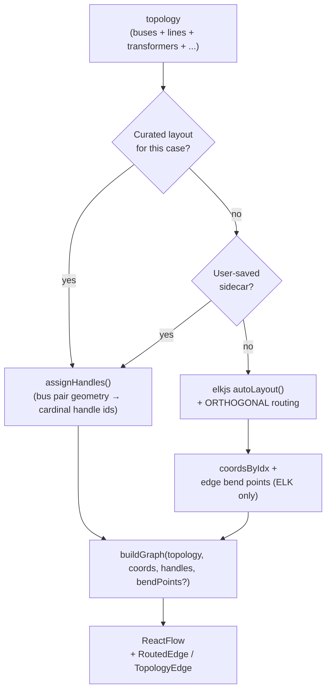
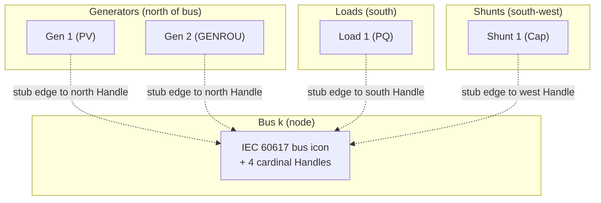
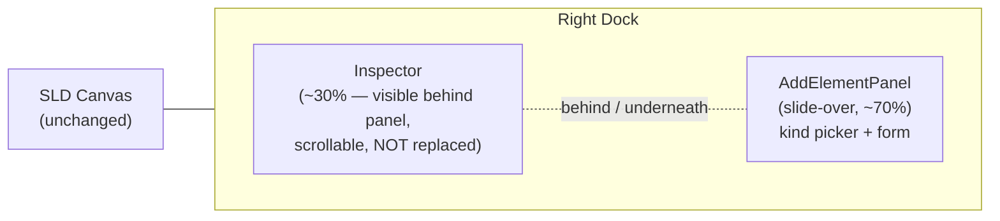
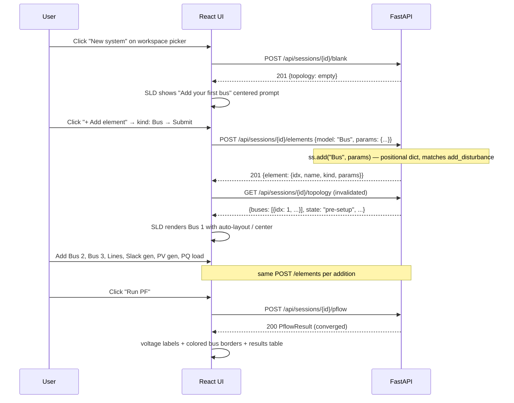
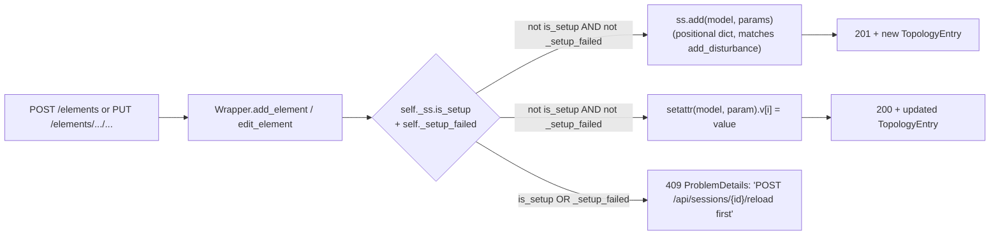

# feat: v0.1 edge routing + element visualization + case builder

## Overview

The polish-mode pass on the wedge demo proved v0.1's load → render → run-PF flow works end-to-end, but surfaced three blockers that prevent the release from feeling like a real tool:

1. **Edges visually merge** — orthogonal smooth-step paths between buses share corridors, so on IEEE 14 the line bus 1 → 2 visually merges with the line bus 2 → 5 and bus 5 → 4. A real single-line diagram demands unambiguous topology; right now a researcher cannot read the connectivity off the canvas.
2. **Only buses + lines render** — generators, loads, transformers, and shunts exist in the topology response (Unit 5b populated `params` for them) but the canvas doesn't draw them. The IEC 60617 set authored in v0.1's Unit 3 (10 icons including generator, generator-syngen, load, shunt-cap, shunt-reactor, transformer-2w/3w, ground) sits unused for non-bus kinds. Researchers expect to see "Gen 1" attached to bus 1, "Load 2" hanging off bus 2.
3. **No way to modify or build a system** — v0.1 only loads existing ANDES case files. The product vision the user named is *"load OR start blank → modify or add elements → run → see results"*. The brainstorm originally deferred the builder to v1.5; the user is foregrounding it now because shipping v0.1 without it gates real adoption.

This plan bundles all three onto `feat/v01-ui` in a single PR (PR #1 stays open; this work extends it). 8 implementation units across 3 phases. Each phase is independently demoable: stop after Phase 1 = "load and read" is polished. Stop after Phase 2 = also editable. Phase 3 = also buildable from scratch.

## Problem Frame

Per origin doc R6-R20 + the user's polish feedback. v0.1 today (commit `3b4833f` on `feat/v01-ui`) is a coherent **load + view + run** tool. The user is asking for **edit + build + run** to land before v0.1 is "passed" (merged). This is a deliberate scope expansion relative to the brainstorm's v1.0 framing — case builder was a v1.5 item there. The plan acknowledges this explicitly and adds the new requirements as R-series extensions (see Requirements Trace).

This plan revises v0.1's scope boundary: the brainstorm deferred visual case builder to v1.5 (R30-R32), but user feedback during the polish phase has foregrounded it. R30-R32 are explicitly scope-expansions from v1.5 to v0.1.x; v1.0 still equals Phase A + v0.1 + v0.2.

## Requirements Trace

Carried forward from the v0.1 brainstorm + extended for this plan:

- **R7 (carry-forward).** SLD uses IEC 60617 iconography. Currently honored for buses + lines only. **Phase 1 extends this to generators, loads, shunts, and transformers** so every existing icon in the manifest renders on the canvas with proper provenance.
- **R9 (carry-forward, sharpened).** PF results overlaid on the diagram. Currently functional but **edges visually merge**; this plan resolves the connectivity ambiguity so a reviewer can read the topology unaided.
- **R10 (carry-forward, extended).** Click-to-inspect side panel. **Phase 2 extends the read-only Properties tab into an editor** when the topology state is `pre-setup`.
- **R15 (carry-forward).** Hybrid SLD layout with curated IEEE 14 + IEEE 39. Phase 1 reuses the existing curated coordinates and **adds positions for non-bus elements derived from their parent bus**.

New for this plan (extends the brainstorm's v1.5 case-builder R-series forward to v0.1.x):

- **R27 (NEW).** Edges between buses are visually distinct: a line from bus A to bus B does not visually merge with a line from bus B to bus C even when they share a corridor. The reviewer can trace any single edge from source to target with their eye, no canvas inspection required.
- **R28 (NEW).** Every element kind ANDES exposes via `topology.{generators, loads, shunts, transformers}` is rendered on the SLD with its IEC 60617 icon, anchored visually to its parent bus. Click-to-inspect works on these as it does on buses.
- **R29 (NEW).** When `topology.state === 'pre-setup'`, a researcher can **edit** existing element parameters directly in the inspector; submit re-fetches topology + the SLD updates. Post-setup, edit affordances are disabled with a tooltip directing to "Reset run to edit."
- **R30 (NEW).** A researcher can **add new elements** (Bus, Line, Generator [PV/Slack/GENROU/GENCLS], Load [PQ/ZIP], Shunt [Cap/Reactor], Transformer 2W) to the loaded system through a slide-over form. The substrate validates the addition; the SLD updates on success. (3-winding transformers can be loaded from existing cases — rendered as 2W with a "3w" badge per Unit 3 — but are NOT addable via the form in v0.1.x; see Scope Boundaries.)
- **R31 (NEW).** A researcher can **start with an empty system** (no case file loaded) via a "New system" button and incrementally build up topology element-by-element. The same Run PF button works once at least one bus + one generator + one load exist.
- **R32 (NEW).** End-to-end, a researcher can **build a 3-bus system from scratch and run PF in under 60 seconds** without leaving the browser. This is the new flagship wedge-demo path; the existing "load IEEE 14" path remains supported but is no longer the only entry.

## Scope Boundaries

- **No modification of element TOPOLOGY links post-creation** in v0.1.x. You can add a Line connecting Bus A and Bus B, but you cannot change its endpoints later — delete (deferred) and re-add. Param edits on an existing element ARE supported (R29).
- **No element deletion.** ANDES 2.0 has no clean pre-setup `delete()` API; deletion would require recreating the system from scratch. The Properties tab shows a disabled "Delete" button with a tooltip "Element deletion lands in v0.5". Tested for presence but not functional. (The wrapper's `replay_buffer` from Unit 2 enables a destructive "undo last add" via `reload_case() + replay_buffer[:-1]` as a workaround surface in a future plan; see Risks.)
- **No 3-winding transformer add.** 3-winding transformers can be loaded from existing cases (rendered as 2W with a "3w" badge per Unit 3) but cannot be added in v0.1.x. Trafo3W is absent from the AddElementPanel kind picker. v0.5 plan to add proper 3W support.
- **No save-to-disk.** Built or modified systems live in the session only. Tab close = system gone. "Save as new case file" is a v0.5 task.
- **No undo/redo.** Each add/edit is committed immediately; reversing means re-adding via the form or session reload.
- **No drag-and-drop element palette.** Add Element is a button → form. Drag from a side palette is v0.5.
- **No element library / templates.** You can't insert a "GENROU with default kundur params" with one click. Each add fills the form from scratch.
- **No multi-element selection or bulk operations.**
- **No structural validation beyond ANDES's own rejection.** The substrate's `ss.add()` raises on invalid inputs; the UI surfaces the raw ProblemDetails. v0.5 may add client-side schema validation.
- **No TDS or disturbance editor.** Those are v0.2 (separate plan).
- **No auto-layout for newly-added elements when a curated layout is in use.** The user drags new elements into position; the sidecar persists the result. ELK runs only when no curated layout exists.

### Deferred to Separate Tasks

- **Element deletion + structural edits** — v0.5 plan after this one merges.
- **Save-as-new-case-file** — v0.5 plan; needs a substrate endpoint + UI.
- **Drag-drop palette + element library** — v0.5 plan.
- **Client-side ANDES model schema validation** — v0.5 plan; depends on extracting the schema from ANDES's docstrings or a generated schema bundle.

## Context & Research

### Relevant Code and Patterns

- **Origin document** — `docs/brainstorms/2026-05-07-accessible-andes-power-systems-app-requirements.md` (R6-R20 are v0.1 in-scope; R30-onward in this plan are scope expansions and are flagged as such above).
- **v0.1 plan** — `docs/plans/2026-05-07-002-feat-v01-ui-load-pf-sld-plan.md` (status: completed). Defines the SLD canvas, error taxonomy, design system.
- **v0.2 plan** — `docs/plans/2026-05-07-003-feat-v02-ui-disturbance-tds-streaming-plan.md`. Untouched by this plan; v0.2 still queues after v0.1.x lands.
- **Polish-loop fix commit** — `3b4833f` on `feat/v01-ui` resolved the auth race + dead-topology-slot issues that blocked the wedge demo. This plan builds on that.
- **Existing SLD code paths** to extend:
  - `web/src/components/sld/SldCanvas.tsx` — composition root; `<ReactFlow>` + curated/sidecar/ELK layout cascade.
  - `web/src/components/sld/graph.ts` — `buildGraph(topology, coords)` produces React Flow nodes + edges from the topology.
  - `web/src/components/sld/layout.ts` — `autoLayout(topology)` invokes elkjs.
  - `web/src/components/sld/edges/TopologyEdge.tsx` — the polyline edge component using `getSmoothStepPath`.
  - `web/src/components/sld/nodes/BusNode.tsx` — IEC bus icon + voltage/angle labels.
  - `web/src/components/sld/nodes/{GeneratorNode, LoadNode, ShuntNode, TransformerNode, LineNode}.tsx` — exist but not wired (only Bus + Line are emitted by `buildGraph`).
  - `web/src/components/sld/curated/ieee14.layout.json` + `ieee39.layout.json` — bus coordinates only; non-bus elements derive positions.
  - `web/src/components/inspector/ElementInspector.tsx` — Properties / Results tabs; reads from `useCurrentTopology()`.
  - `web/src/icons/iec60617/manifest.ts` — model class → icon URL map. Already covers generator, load, shunt-cap, shunt-reactor, transformer-2w, transformer-3w, ground. Used by node components.
- **Existing substrate code paths** to extend:
  - `server/src/andes_app/api/routes/cases.py` — case load + topology endpoints (existing).
  - `server/src/andes_app/api/routes/disturbances.py` — pattern for pre-setup-gated mutation endpoints (the gate logic + 409 ProblemDetails shape transfers). Existing gate guards on `self._ss.is_setup` (NOT a separate "_setup_done" flag); the wrapper also exposes `_setup_failed` to mark "requires reload" after a failed `setup()`.
  - `server/src/andes_app/core/wrapper.py` — `Wrapper` class with `_PARAMS_BY_MODEL`, `_extract_params`, `_extract_line_flows`. New mutation methods land here.
  - `server/src/andes_app/api/schemas.py` — `LoadCaseRequest`, `PflowResult`, `TopologyEntry.params`, `ProblemDetails`, `TopologySummary` (today: `buses, lines, transformers, generators, loads`; this plan extends with `shunts`). New `AddElementRequest`, `EditElementRequest`, `BlankSystemResponse` schemas land here.
- **`_PARAMS_BY_MODEL`** — defined at `server/src/andes_app/core/wrapper.py:414`. Type today: `dict[model_name: str, tuple[str, ...]]` listing the params surfaced through topology. This plan extends each entry's value into a structured tuple-of-records carrying `name`, `kind` (`'string' | 'number' | 'bus_idx' | 'bool'`), `required: bool`, and optional `unit?: str` (e.g., `"kV"`, `"pu"`, `"MW"`). The Inspector Properties tab consumes the existing shape; the new Add/Edit form generator consumes the extended shape.

### Institutional Learnings

- `docs/solutions/2026-05-07-cli-anything-andes-architectural-mismatch.md` — backstop for "why no CLI shellout"; not directly relevant.
- Memory `reference_andes_quirks.md` — ANDES pre-setup contract: `ss.add()` works pre-setup, `ss.alter()` is post-setup, `ss.PFlow.run()` requires explicit prior `ss.setup()`. This plan strictly stays pre-setup for mutations; post-setup edits require `/reload`.
- v0.1's Unit 5b populated `_PARAMS_BY_MODEL` for the inspector's Properties tab — same map drives the editable-fields surface in Phase 2 and the form schema in Phase 3.

### External References

- **React Flow 12 — Custom Handles per node**: `reactflow.dev/learn/customization/custom-nodes#handles`. Each node renders `<Handle type="source" position={Position.Right} id="east" />` etc., and edges pick a specific handle via `sourceHandle: "east", targetHandle: "west"`. Right approach for distinct edge corridors when the bus pair is geometrically simple.
- **elkjs orthogonal edge routing**: `eclipse.dev/elk/reference/options/org-eclipse-elk-edgeRouting.html`. With `'elk.edgeRouting': 'ORTHOGONAL'` (already set in `layout.ts`), the layout result includes per-edge `sections[].bendPoints` that React Flow can consume in a custom edge component. This is the cleanest path for arbitrary topologies.
- **ANDES `ss.add()` API**: not a public stable contract, but the existing wrapper code already uses it and the disturbance.py code commits pre-setup adds. Verified empirically against ANDES 2.0.0.

## Key Technical Decisions

These are settled now; reversing any of them changes API surface, IA, or architectural posture and would warrant a plan revision.

- **Edge routing — combine ELK orthogonal routing with per-bus cardinal handles.** Settled pending Phase 0 spike outcome. For all cases (auto-layout, curated, sidecar), each Bus exposes 4 cardinal Handles (`north`, `east`, `south`, `west`). Curated cases use bus-pair geometry: each edge picks source + target handles based on the bisection of the bus-pair vector, and edges sharing a handle are offset along the orthogonal direction by a small per-edge stride. Auto-layout cases ALSO compute handle assignments and pass them as ELK port constraints (`'elk.portConstraints': 'FIXED_SIDE'` + per-port `'elk.port.side'`), so ELK's bend points respect the same per-bus cardinal sides as curated layouts. The custom `RoutedEdge` component accepts an explicit `bendPoints?: [number, number][]` prop — when present (auto-layout case), it renders a polyline through them; when absent (curated case), it renders a smooth-step path through the chosen handles. Both paths produce visually distinct corridors per edge.
- **Element node placement — child of parent bus, offset by kind.** Each non-bus element renders as its own React Flow node:
  - **Generators** anchor `(bus.x, bus.y - 80)` (north of the bus) with a stub edge to the bus's `north` handle.
  - **Loads** anchor `(bus.x, bus.y + 80)` (south) with a stub to the `south` handle.
  - **Shunts** anchor `(bus.x - 100, bus.y + 40)` (south-west) with a stub to the `west` handle.
  - **Transformers** are special: they CONNECT two buses (like lines) but render with the transformer-2w/3w icon at the line midpoint. Implemented as a `TransformerEdge` component (extends `RoutedEdge` + a midpoint icon overlay).
  When a curated layout is in use, the user drags non-bus elements freely; positions are part of the same `<case>.layout.json` sidecar as bus positions.
- **Substrate mutation API surface — three new endpoints.** "Mutation" here refers to the family of add + edit operations on the topology graph. Add (POST) and Edit (PUT) share the pre-setup gate; the term "mutation" covers both.
  - `POST /api/sessions/{id}/elements` — add. Body: `{model: str, params: dict[str, ...]}`. Returns `{element: TopologyEntry}` with the newly-assigned idx. Auth-gated. Pre-setup gated (409 if committed; ProblemDetails directs to `/reload`). Body capped at 64 KB; oversize requests get 413.
  - `PUT /api/sessions/{id}/elements/{model}/{idx}` — edit. Body: `{params: dict[str, ...]}`. Returns the updated `TopologyEntry`. Pre-setup gated. Implementation: `getattr(ss.<Model>.<param>, 'v')[i] = value` for each param. Post-setup PUT returns 409 with the same /reload guidance. Body capped at 64 KB.
  - `POST /api/sessions/{id}/blank` — create an empty `andes.System()` in the session, ready for `ss.add()` calls. Returns an empty `TopologySummary` with `state: "pre-setup"` and zero elements. 409 if a case is already loaded; user must reload first or use a fresh session. Auth-gated.
  - DELETE deferred to v0.5 (no clean ANDES API).
- **Add-element UX — slide-over side panel from the right edge of the right dock, NOT a modal.** R18 reserves modals for destructive confirmations only. Adding an element is a creation flow, not destructive. The "+ Add element" button (top-bar) opens a slide-over panel that overlays the inspector region (~70% width of the dock); the inspector remains visible at the left ~30% of the dock so the user can see the currently-selected element's properties (e.g., Bus 1) while filling out a Line form that references it. User can scroll the inspector behind the panel. The panel renders a kind picker + a per-kind form. On submit, the panel transitions to "Saving…" state (button disabled, fields locked, spinner) and remains open until the topology re-fetch resolves; then it closes, the inspector returns to its prior state, and the SLD shows the new element. R18 still honored — the slide-over is not a modal.
- **Edit element UX — inline in the Properties tab.** When `topology.state === 'pre-setup'` AND the user has an element selected, each Properties-tab field gets an edit affordance (small pencil icon → input → save). This avoids a separate edit mode. Post-setup, the affordances are hidden. The substrate's PUT returns the updated TopologyEntry; the UI invalidates the topology query and the SLD label updates.
- **New system flow — explicit "New system" button on the workspace picker.** Sits next to the file list. Click → `POST /api/sessions/{id}/blank` → topology becomes empty pre-setup → SLD shows a centered "Add your first bus" prompt. From there the standard add-element flow runs.
- **Form generation — driven by `_PARAMS_BY_MODEL`.** The Phase A wrapper's parameter table (used by the inspector's Properties tab) drives the form fields. Each param entry gains a `kind: 'string' | 'number' | 'bus_idx' | 'bool'` annotation so the form renders appropriate inputs. Each numerical param entry also gains an optional `unit?: string` (e.g., `"kV"` for `Vn`, `"pu"` for `r`/`x`/`b`, `"MW"` for `p0`); units render inline next to the input. `bus_idx` fields show a dropdown of existing buses (or "no buses yet — add one first" when the system is empty); the dropdown's option label format is `"<idx> — <name>"` (e.g., `"1 — BUS1"`). Required vs optional is per-model (Bus.name required, Line.r required, etc.); the table is updated to mark required fields. Required fields render first (grouped under a "Required" header); optional fields collapse under a "Show advanced ▾" disclosure. Forms with >10 fields get a section divider between Required and Advanced.
- **Reload semantics for committed sessions.** If the user clicks Add or Edit on a committed (post-PF) session, the slide-out shows a banner: "This case has run. Adding/editing requires resetting the run." with a "Reset and continue" button that calls `POST /api/sessions/{id}/reload` first, then opens the form. This makes the pre-setup gate user-friendly without requiring a manual reload step.
- **Layout sidecar v2 — extended schema.** The sidecar JSON gains a `non_bus_coordinates: dict[model_kind: str, dict[idx: str, {x: float, y: float}]]` field keyed by ANDES model class name → idx → coordinate pair. Coordinates are validated finite (no NaN/Inf), matching the existing `BusCoord` validator. Reads of an old sidecar (without this field) silently default non-bus elements to their kind-based offset from parent bus; writes always include the new field. Backward compatible. Example shape:

  ```json
  {
    "schema_version": "1.1",
    "andes_version": "2.0.0",
    "coordinates": {"1": {"x": 100.0, "y": 200.0}},
    "non_bus_coordinates": {
      "PV": {"GEN_1": {"x": 100.0, "y": 120.0}},
      "PQ": {"PQ_1": {"x": 100.0, "y": 280.0}}
    },
    "last_modified": "2026-05-08T12:00:00Z"
  }
  ```
- **Phasing — 3 phases on one branch / one PR.** Phase 1 (polish: edges + substrate API + element visuals + small visual cleanup) is independently shippable: the renumber promotes the substrate-API unit (formerly Unit 4) into Phase 1 as Unit 2, since extending `TopologySnapshot` with a `shunts` bucket and a Line→Transformer split is a substrate-contract change that Unit 3's element rendering depends on. Phase 2 (edit UI) requires Phase 1's element-rendering + mutation API. Phase 3 (add UI + new-system + flagship e2e) requires Phase 2. PR #1 absorbs all three before merge.

## Open Questions

### Resolved During Planning

- **Edge routing algorithm choice** — combined ELK ORTHOGONAL output (auto-layout) + cardinal handles (curated). Settled in Key Technical Decisions.
- **Element node anchor model** — separate React Flow nodes positioned relative to parent bus, with stub edges. Transformers stay as edges with a midpoint icon. Settled.
- **Mutation API verb shapes** — POST + PUT only; DELETE deferred. Settled.
- **Add-element UX surface** — side panel (R18-compliant), not modal. Settled.
- **Edit-element UX surface** — inline in the Properties tab when pre-setup. Settled.
- **New-system entry** — button on the workspace picker. Settled.
- **Form generation source** — `_PARAMS_BY_MODEL` extended with `kind` annotations. Settled.
- **Phasing** — 3 phases on one PR (`feat/v01-ui`, extends PR #1).
- **Element-deletion scope** — explicitly deferred to v0.5 (no ANDES pre-setup delete API).
- **Save-to-disk scope** — explicitly deferred (session-only mutations).
- **Sidecar schema migration** — additive `non_bus_coordinates` field; old sidecars read without error.

### Deferred to Implementation

- **Exact stride for handle-shared edge offsets** — implementer measures during Unit 1 against IEEE 14 + IEEE 39 visual review; no hard number locked in.
- **Whether to use `<EdgeLabelRenderer>` or `<foreignObject>` for transformer-edge midpoint icon** — both work; pick during Unit 3.
- **Form layout per element kind** — uniform two-column form vs per-kind designed layout. Implementer picks during Unit 6 with the Add-element panel design in hand.
- **`bus_idx` dropdown empty-state copy** — "no buses yet — add a bus first" vs disabled select with tooltip. Implementer picks during Unit 6.
- **Tab-key order in the side panel** — derived from form-field order; not pre-specified.
- **Concrete required-vs-optional flag for each param in `_PARAMS_BY_MODEL`** — implementer adds during Unit 2 by reading ANDES model definitions.
- **PF auto-run after Add/Edit** — should the SLD auto-run PF when a topology change lands, or wait for the user? Decided in Unit 5 / Unit 6 implementation; default off (user clicks Run PF) with a "rerun PF" hint when state is dirty.

## Output Structure

```text
.
├── docs/
│   └── plans/
│       └── 2026-05-08-001-feat-v01-polish-element-builder-plan.md  # this file
├── server/
│   └── src/andes_app/
│       ├── api/
│       │   ├── routes/
│       │   │   └── elements.py                # NEW (Unit 2): POST add, PUT edit, POST blank
│       │   ├── schemas.py                     # MODIFIED (Unit 2): AddElementRequest, EditElementRequest, BlankSystemResponse + TopologySummary.shunts
│       │   └── app.py                         # MODIFIED (Unit 2): register elements router + body-size cap
│       └── core/
│           └── wrapper.py                     # MODIFIED (Unit 2): add_element, edit_element, blank methods + replay_buffer + transformer-split + _PARAMS_BY_MODEL kind+required+unit
└── web/
    ├── docs/
    │   └── interaction-states.md              # MODIFIED (Units 5, 6, 7): new rows for editable Properties, AddElementPanel, SldEmptySystem, reset banner, new-system entry
    ├── src/
    │   ├── api/
    │   │   ├── generated.ts                   # REGENERATED: new endpoint types
    │   │   ├── queries.ts                     # MODIFIED: useAddElement, useEditElement, useBlankSystem
    │   │   └── types.ts                       # MODIFIED: re-export new schemas
    │   ├── components/
    │   │   ├── case/
    │   │   │   ├── WorkspaceFilePicker.tsx    # MODIFIED (Unit 7): "+ New system" button
    │   │   │   └── NewSystemButton.tsx        # NEW (Unit 7)
    │   │   ├── elements/                      # NEW directory (Unit 6)
    │   │   │   ├── AddElementPanel.tsx        # NEW: slide-over container + kind picker (right edge of right dock, ~70% width; inspector visible underneath)
    │   │   │   ├── EditElementButton.tsx      # NEW: pencil icon used in Properties tab
    │   │   │   ├── ElementForm.tsx            # NEW: polymorphic form driven by _PARAMS_BY_MODEL (Required group + Show advanced disclosure)
    │   │   │   ├── BusIdxSelect.tsx           # NEW: dropdown of existing buses (option label "<idx> — <name>", optimistic update)
    │   │   │   └── CancelConfirmDialog.tsx    # NEW (Unit 6): confirm dialog when canceling a dirty Add form
    │   │   ├── inspector/
    │   │   │   └── ElementInspector.tsx       # MODIFIED (Unit 5): editable Properties when pre-setup
    │   │   ├── shell/
    │   │   │   └── TopBar.tsx                 # MODIFIED (Unit 6): "+ Add element" button slot
    │   │   └── sld/
    │   │       ├── SldCanvas.tsx              # MODIFIED (Unit 1, 3): render non-bus nodes + RoutedEdge
    │   │       ├── SldEmptySystem.tsx         # NEW (Unit 7): "Add your first bus" centered prompt; debounce-dismiss in Unit 6
    │   │       ├── graph.ts                   # MODIFIED (Unit 1, 3): emit non-bus nodes + handle assignments
    │   │       ├── layout.ts                  # MODIFIED (Unit 1, 3): pass through ELK bend points; non-bus offsets
    │   │       ├── curated/
    │   │       │   ├── ieee14.layout.json     # MODIFIED (Unit 2): add `non_bus_coordinates: {}` for forward-compat
    │   │       │   └── ieee39.layout.json     # MODIFIED (Unit 2): add `non_bus_coordinates: {}` for forward-compat
    │   │       ├── edges/
    │   │       │   ├── TopologyEdge.tsx       # MODIFIED (Unit 1): handle-aware smooth step (curated path)
    │   │       │   ├── RoutedEdge.tsx         # NEW (Unit 1): polyline through ELK bend points (auto-layout)
    │   │       │   ├── TransformerEdge.tsx    # NEW (Unit 3): edge with midpoint transformer icon
    │   │       │   └── StubEdge.tsx           # NEW (Unit 3): short visual stub for gen/load/shunt → bus
    │   │       └── nodes/
    │   │           ├── BusNode.tsx            # MODIFIED (Unit 1): expose 4 cardinal Handles
    │   │           ├── GeneratorNode.tsx      # MODIFIED (Unit 3): position-anchored visual + click-to-inspect
    │   │           ├── LoadNode.tsx           # MODIFIED (Unit 3): same
    │   │           ├── ShuntNode.tsx          # MODIFIED (Unit 3): same
    │   │           └── TransformerNode.tsx    # DELETED (Unit 3): replaced by TransformerEdge
    │   └── store/
    │       └── case.ts                        # MODIFIED (Unit 5, 6, 7): track add-panel open state + dirty flag
    └── tests/
        ├── unit/
        │   ├── components/
        │   │   ├── elements/                  # NEW (Unit 6)
        │   │   │   ├── AddElementPanel.test.tsx
        │   │   │   ├── ElementForm.test.tsx
        │   │   │   ├── BusIdxSelect.test.tsx
        │   │   │   └── CancelConfirmDialog.test.tsx
        │   │   └── sld/
        │   │       ├── handles.test.ts        # NEW (Unit 1): handle-assignment algorithm
        │   │       └── nonBusNodes.test.tsx   # NEW (Unit 3): generator/load/shunt rendering
        │   └── api/
        │       └── mutations.test.ts          # NEW (Unit 2): useAddElement/useEditElement client-side
        └── e2e/
            └── build-from-scratch.spec.ts     # NEW (Unit 8): flagship "build 3-bus system + run PF"
```

## High-Level Technical Design

> *This illustrates the intended approach and is directional guidance for review, not implementation specification.*

### Edge routing flow



`RoutedEdge` (auto-layout case) reads `bendPoints` from edge data and renders a polyline. `TopologyEdge` (curated case) uses the source/target handle ids to draw a smooth-step path that doesn't share corridors with siblings.

### Element node placement



Two generators on the same bus stack vertically (each offset by an additional `-50px` in y). Same for two loads or two shunts.

### AddElementPanel — slide-over from right edge of right dock



User clicking Bus 1 still sees its properties at the left edge of the dock while filling out a Line form referencing it. R18 honored — the panel is a slide-over, not a modal.

### Mutation API + UI flow (build-from-scratch happy path)



### Substrate mutation pre-setup gate



## Implementation Units

### Phase 0 — Prerequisite spike

- [x] **Spike: ELK port-constraints in elkjs 0.9 (~30 min)** — passed 2026-05-08; Unit 1 uses ELK as the auto-layout source of truth without a snap-to-handle fallback. See `web/tests/unit/components/sld/spike-elk-ports.test.ts` for the verification harness. Findings: (a) elkjs 0.9 honors `'elk.portConstraints': 'FIXED_SIDE'` with per-port `'elk.port.side': 'NORTH|EAST|SOUTH|WEST'`; (b) edges land on `result.edges[]` at root level with `sections[0].{startPoint, endPoint, bendPoints?, incomingShape, outgoingShape}` — bend points are absent for straight edges and present otherwise; (c) port absolute coords are computed by adding `child.x + port.x`, `child.y + port.y`. Unit 1's `autoLayout` reads from `result.edges` (NOT `result.children[].edges`).

**Goal:** De-risk Unit 1 before committing to the "ELK respects per-bus cardinal handles" path. Write a minimal elkjs `layout()` call that uses `'elk.portConstraints': 'FIXED_SIDE'` with a per-bus ports array (4 cardinal sides) and `'elk.edgeRouting': 'ORTHOGONAL'` on a 5-node test graph, and visually verify the bend points respect the per-port sides.

**Approach:**
- Build a 5-node graph (3 buses + 2 lines, simple star-ish) in a throwaway HTML file or test harness.
- Call `elk.layout(graph)` with `FIXED_SIDE` constraints + per-port sides explicitly set.
- Render the result with React Flow OR draw with raw SVG; visually inspect each bend point.
- Falsification check: do the end segments enter/exit each bus on the cardinal side declared in the port constraint?

**Outcome:**
- If yes: Unit 1 proceeds as written (ELK is the auto-layout source of truth).
- If no: Unit 1's auto-layout case must adopt a fallback strategy. Candidate: post-process ELK output to snap end segments to the nearest cardinal handle (compute the segment's exit angle, override the start/end point to the bus's nearest handle position). Document the fallback in Unit 1 before implementing.

This spike's output is a paragraph-level note added to Unit 1 (or its replacement). It does not block Unit 2 or later; if the spike fails, Unit 1's scope grows by ~30% (the fallback path) but the rest of the plan is unaffected.

---

### Phase 1 — Polish (load-and-read becomes legible)

- [x] **Unit 1: Edge routing — handle anchors + ELK bend points** — landed 2026-05-08. Verification: 14 new handle tests + 8 layout tests pass; visual smoke on IEEE 14 (curated path, handles + stride) and synth14 (auto-layout path, ELK pass-2 bend points) both show distinct corridors per edge. R27 satisfied.

**Goal:** Eliminate edge corridor merging on the SLD. Each line between buses traces a visually distinct path, regardless of layout source.

**Requirements:** R9 (sharpened), R27.

**Dependencies:** None (extends existing `web/src/components/sld/` files; no server changes).

**Files:**
- Modify: `web/src/components/sld/nodes/BusNode.tsx` — add 4 cardinal `<Handle>` elements (`north`, `east`, `south`, `west`); ensure the Handle ids match the constants exported from `graph.ts`.
- Modify: `web/src/components/sld/graph.ts` — extend `buildGraph` signature to `(topology, coords, opts: { bendPoints?: Map<string, [number, number][]> })`; add `assignHandles(bus1Coord, bus2Coord)` returning `{ sourceHandle, targetHandle }` based on the bisection of the bus-pair vector (e.g., bus2 east of bus1 → `{source: 'east', target: 'west'}`); for edges sharing the same handle, append a stride index used by the edge component for offset.
- Modify: `web/src/components/sld/layout.ts` — extend `autoLayout(topology)` to return `{ coordsByIdx, bendPoints: Map<edgeId, [number, number][]> }` by enabling ELK's `'elk.layered.feedbackEdges': 'true'` and `'elk.edgeRouting': 'ORTHOGONAL'` (already set) + reading `result.children[].edges[].sections[].bendPoints` and `startPoint`/`endPoint`. Stitch into the per-edge bend-point list.
- Modify: `web/src/components/sld/SldCanvas.tsx` — pass bend points through to buildGraph; route per-edge to `RoutedEdge` (auto-layout) or `TopologyEdge` (curated) via `edgeTypes` based on whether `data.bendPoints` is set.
- Modify: `web/src/components/sld/edges/TopologyEdge.tsx` — read `sourceHandle`/`targetHandle` from edge props, compute smooth-step path through the chosen handle anchors; for shared-handle edges, lateral offset by `data.stride * 8px`.
- Create: `web/src/components/sld/edges/RoutedEdge.tsx` — polyline path through `data.bendPoints`. `<BaseEdge>` + a `<path d=>` rendered via `M start L bend1 L bend2 ... L end`.
- Create: `web/tests/unit/components/sld/handles.test.ts` — covers `assignHandles` + stride.

**Approach:**
- For curated layouts (where coordinates are deterministic), the handle assignment is a pure function of bus-pair geometry. Tests cover all 8 octants + co-located cases.
- For auto-layout (ELK), bend points come from ELK's output. The `assignHandles` step still runs but the resulting source/target handles are an input to ELK (set as port constraints) so ELK respects them — pass `'elk.portConstraints': 'FIXED_SIDE'` and per-port `'elk.port.side': 'NORTH' | 'EAST' | 'SOUTH' | 'WEST'`.
- Stride for shared-handle edges starts at 0 and increments per edge sharing the same source handle; multiplied by an 8-pixel offset (tunable in implementation; the implementer eyeballs it on IEEE 14 + 39).
- After this unit, IEEE 14 should pass a visual smoke test: trace the line bus 1 → 2; it should NOT merge with bus 2 → 5.

**Patterns to follow:**
- Existing `web/src/components/sld/edges/TopologyEdge.tsx` for `<BaseEdge>` usage and stroke styling.
- React Flow's "Custom Edges" example: `reactflow.dev/learn/customization/custom-edges`.
- ELK's port-constraints documentation for the `assignHandles` → ELK port hint mapping.

**Test scenarios:**
- Happy: `assignHandles({x:0, y:0}, {x:100, y:0})` (bus2 due east of bus1) returns `{sourceHandle: 'east', targetHandle: 'west'}`.
- Happy: 4 bus-pair geometries (NSEW, NE/SE/NW/SW): each produces an unambiguous handle assignment.
- Edge: two buses at same coords (degenerate) → fallback to `{source: 'east', target: 'east'}` plus a console warning; doesn't crash.
- Edge: stride increments correctly for 3 edges all leaving bus 1's east handle (strides 0, 1, 2).
- Integration: with curated IEEE 14, no two edges from the buildGraph output share `(sourceHandle, targetHandle, stride)` — every edge is uniquely positioned.
- Integration: with auto-layout (mocked ELK returning known bend points), `RoutedEdge` renders the exact polyline ELK specified.

**Verification:**
- All new + existing SLD tests pass.
- Manual visual review on IEEE 14 + IEEE 39: every edge can be eye-traced from source to target without ambiguity.
- Visual smoke test (falsification): 2 reviewers (independently) trace 5 random edges on IEEE 39 and report (a) whether each edge is unambiguously traceable from source to target, (b) whether they perceive any "parallel-stripe" pattern that resembles double-circuit lines but isn't. If parallel-stripe patterns are misread as topology, increase stride beyond 8px (try 16-24px) or color stride-shared edges differently.
- React Flow zoom + pan + fit-view still work.
- Handle hit-testing: clicking on an edge still works (regression check).

---

- [x] **Unit 2: Substrate mutation API + topology shape extension** — landed 2026-05-08. Three new endpoints (POST /elements, PUT /elements/{model}/{idx}, POST /blank) + GET /topology/schema for the form metadata. Wrapper gains `add_element`, `edit_element`, `create_blank`, `replay_buffer` (1000-cap, oldest-eviction). TopologySnapshot adds `shunts`; lines split from transformers via the tap/phi heuristic. `_PARAMS_BY_MODEL` reshaped to `ParamMeta` records carrying `kind`/`required`/`unit`; ZIP + Trafo (via Line) added. ANDES exception messages sanitized. 64 KB body cap with 413 on overflow. Tests: 20 new (151 total). Lint + typecheck + mypy --strict clean. Web `generated.ts` regenerated with new operations + schemas.

**Goal:** Land the server endpoints, wrapper methods, and `TopologySnapshot` shape changes that the Phase 1 element rendering (Unit 3) and Phase 2/3 mutation UIs build on. The shape changes (new `shunts` bucket; Line→Transformer split heuristic) are sequenced before Unit 3 because Unit 3's promise to "render generators/loads/shunts/transformers" depends on the substrate actually emitting non-empty `shunts` and `transformers` buckets — which today it does not.

**Requirements:** R28 (shape extension prerequisite for non-bus rendering), R29 (PUT), R30 (POST add), R31 (POST blank).

**Dependencies:** None (server-side only). Units 3, 5, 6 depend on this.

**Files:**
- Modify: `server/src/andes_app/api/schemas.py` — add `AddElementRequest` (`{model: str, params: dict}`), `EditElementRequest` (`{params: dict}`), `BlankSystemResponse` (just a `TopologySummary`), `ElementCreated` (returns the new `TopologyEntry`). Extend `TopologySummary` with `shunts: list[TopologyEntry]` (between `transformers` and `generators`); update the `transformers` field's description from the v0.1 stock empty-list note to "Transformers split out from `Line` by the `tap != 1.0 OR phi != 0.0` heuristic; pure lines remain in `lines`." All Pydantic v2 with non-empty `description=` per R25.
- Create: `server/src/andes_app/api/routes/elements.py` — three endpoints:
  - `POST /api/sessions/{session_id}/elements` → calls `Wrapper.add_element(model, params)`. Returns 201 + `ElementCreated`. 409 if committed (ProblemDetails detail says "Reset run first via POST /api/sessions/{id}/reload"). 422 if `ss.add` raises (invalid model, missing required param, etc.). 413 on body > 64 KB.
  - `PUT /api/sessions/{session_id}/elements/{model}/{idx}` → calls `Wrapper.edit_element(model, idx, params)`. Returns 200 + updated `TopologyEntry`. 409 if committed. 404 if `idx` not found. 422 on validation error. 413 on body > 64 KB.
  - `POST /api/sessions/{session_id}/blank` → calls `Wrapper.create_blank()`. Returns 201 + empty `TopologySummary`. 409 if a case is already loaded (suggests `/reload` or new session).
- Modify: `server/src/andes_app/api/app.py` — register the new router with prefix `/api`. Configure FastAPI body-size limit (or middleware-level Content-Length cap) at 64 KB for the new endpoints; oversize requests get 413.
- Modify: `server/src/andes_app/core/wrapper.py` — three new methods, plus topology-shape extension, plus a `replay_buffer` to enable blank-session reload:
  - `add_element(model: str, params: dict) -> TopologyEntry` — gates pre-setup matching `add_disturbance`:
    ```python
    if self._ss is None:
        raise NoCaseLoadedError(...)
    if self._setup_failed:
        raise SetupFailedError("setup() previously failed; call reload_case() first")
    if self._ss.is_setup:
        raise CommittedError("system already setup; call reload_case() first")
    ```
    Whitelists `params.keys()` against `_PARAMS_BY_MODEL[model]` (rejects unknown keys with 422 ProblemDetails BEFORE any `getattr()` call). Calls `self._ss.add(model, params)` (positional dict, matching `add_disturbance`'s convention — NOT `**params`). Records `(model, params)` in `self._replay_buffer` on success. Reads back the new idx + name + params via the existing `_extract_params` helper; returns the corresponding `TopologyEntry`.
  - `edit_element(model: str, idx: int|str, params: dict) -> TopologyEntry` — same pre-setup gate; whitelists `params.keys()` against `_PARAMS_BY_MODEL[model]`; for each `(param, value)` in params, sets `getattr(getattr(self._ss, model), param).v[i] = value` where `i = self._ss.<Model>.idx.v.index(idx)`. Returns updated `TopologyEntry`.
  - `create_blank() -> TopologySummary` — guards on `self._ss is None` (no system loaded); creates `self._ss = andes.System()`; clears `self._replay_buffer = []`; returns an empty topology summary with `state: "pre-setup"`.
  - Extend `reload_case()` to handle blank sessions (where `self._case_path is None`): re-create `self._ss = andes.System()`, then replay every entry in `self._replay_buffer` via `self._ss.add(model, params)`. The existing `NoCaseLoadedError` path remains for sessions that have no case AND no replay history.
  - Add `self._replay_buffer: list[tuple[str, dict]] = []` to `__init__`. Cap at 1000 entries (after which subsequent adds still succeed but the buffer drops the oldest entries with a logged warning).
  - Extend `_topology_snapshot_locked` to add a `shunts` bucket via `_collect_models(ss, ['Shunt'])` and to split `lines` vs `transformers` by the `tap != 1.0 OR phi != 0.0` heuristic on each ANDES Line device. Pure lines stay in `lines`; off-nominal-tap or phase-shifting lines move to `transformers`. Document the heuristic in the method docstring.
  - Sanitize ANDES exception messages before they leave the wrapper: strip filesystem paths matching `<workspace>` and `<andes_install_dir>` from any exception detail re-raised as `DisturbanceValidationError` / new `AddElementValidationError` / etc., before the API layer surfaces them in ProblemDetails `detail`.
- Modify: `server/src/andes_app/core/wrapper.py` — extend `_PARAMS_BY_MODEL` entries: each param entry becomes a record carrying `name`, `kind: 'string' | 'number' | 'bus_idx' | 'bool'`, `required: bool`, and optional `unit?: str`. Add new entries for `ZIP` and `Trafo`-via-Line (see below). The shapes drive the Phase 3 form generator.
  - **ZIP** (key dynamic-load params): `idx, name, u, bus, Vn, p0, q0, gammapz, gammaiz, gammapi, gammaii, gammapv, gammaqv`.
  - **Trafo (2W) — modeled via ANDES `Line`**: ANDES has no separate `Trafo` model class in 2.0; transformers are Lines with non-default `tap` (and optionally `phi`). v0.1.x's Add panel exposes a "Transformer 2W" form whose underlying model is `"Line"` with required `tap` field (defaults to 1.0 for plain lines; user enters non-1 for transformers). Same params as Line plus `tap` and `phi`. Document this mapping clearly in the wrapper's `_PARAMS_BY_MODEL` comment block.
  - **Trafo3W**: deferred entirely from v0.1.x add-form support. Cases that already contain 3-winding transformers can still be loaded; they render as 2W with the "3w" badge per Unit 3.
- Modify: `server/src/andes_app/core/session.py` — route the new wrapper methods through the existing per-session worker invoke pattern. Three new `cmd` strings: `'add_element'`, `'edit_element'`, `'create_blank'`.
- Modify: `web/src/components/sld/curated/ieee14.layout.json` and `ieee39.layout.json` — add `non_bus_coordinates: {}` (empty object) for forward-compatibility. Schema-defaulted reads of pre-existing sidecars still work (Unit 3 covers the test).
- Test: `server/tests/integration/test_elements_api.py` — new file. Coverage per the test scenarios below.
- Test: `server/tests/unit/test_wrapper_mutations.py` — new file. Covers the wrapper methods directly with a fixture ANDES System.
- Test: `server/tests/unit/test_topology_shape.py` — new file. Covers shunts bucket, transformer split heuristic, and the schema-defaulted-reads regression.

**Approach:**
- The pre-setup gate copies `add_disturbance`'s exact pattern: check `self._ss is None` → `NoCaseLoadedError`; check `self._setup_failed` → `SetupFailedError`; check `self._ss.is_setup` → `CommittedError`. There is no `_setup_done` attribute on the wrapper; `_setup_failed` is a separate "needs reload" flag and must be checked alongside `is_setup`.
- The substrate's `andes.System()` constructor accepts no args; the wrapper just stores it.
- The whitelist check happens BEFORE any `getattr` on `self._ss.<model>`, so unknown param keys never reach ANDES. Returns 422 ProblemDetails listing the rejected keys + the allowed-keys set for that model.
- `ss.add(model, params)` is called with a positional dict, matching the existing `add_disturbance` convention at `wrapper.py:268`. NOT `**params`. ANDES 2.0's `add()` accepts a single dict; using `**` would break the known-good signature.
- ANDES 2.0's `ss.add(model, params)` raises a variety of errors: `ValueError` for unknown model, `TypeError` for bad params, etc. Catch broadly + sanitize the message (strip filesystem paths) + map to 422 ProblemDetails.
- For `edit_element`, the param value type matters — ANDES expects floats for numerical params, strings for names, etc. The Pydantic schema's `EditElementRequest.params: dict[str, float|int|str|bool]` lets the substrate accept all four; the wrapper coerces as needed via the existing `_coerce_scalar` helper (Unit 5b shipped this).
- The transformer-split heuristic runs as part of `_topology_snapshot_locked`. For each Line device, read `tap[i]` and `phi[i]` defensively (via the same `getattr` pattern as `_extract_line_flows`); if either is non-default, route the entry into `transformers` instead of `lines`. The line still appears under exactly one bucket.
- The `replay_buffer` is the v0.1.x workaround for ANDES's missing pre-setup `delete()`: a destructive "undo last" affordance can be implemented in v0.5 by replaying every entry except the last. v0.5 will investigate `ss.remove()` empirically and ship proper deletion.

**Patterns to follow:**
- `server/src/andes_app/api/routes/disturbances.py` — pre-setup gate + 409 ProblemDetails. New endpoints copy this style verbatim.
- `server/src/andes_app/api/routes/cases.py` — endpoint shape + dependency injection of session manager.
- `server/src/andes_app/core/wrapper.py:225-273` — `add_disturbance` is the reference for ALL parts of the new mutation methods: gate shape, `ss.add(model, params)` positional-dict call, exception wrapping.
- `server/tests/integration/test_disturbances_tds_api.py` — integration test pattern.

**Test scenarios:**

Server integration:
- Happy: `POST /elements {model: "Bus", params: {idx: "1", name: "BUS1", Vn: 100}}` on a blank session → 201, returns the bus.
- Happy: `POST /elements {model: "Line", params: {bus1: "1", bus2: "2", r: 0.01, x: 0.05}}` after Bus 1 + Bus 2 exist → 201.
- Happy: `POST /elements {model: "ZIP", params: {idx: "ZIP1", bus: "1", p0: 0.5, q0: 0.1, ...}}` → 201.
- Happy: `POST /elements {model: "Line", params: {bus1: "1", bus2: "2", r: 0.01, x: 0.05, tap: 1.05}}` → 201; the resulting topology snapshot routes this device into `transformers`, not `lines`.
- Happy: `PUT /elements/Bus/1 {params: {Vn: 110}}` → 200, returns the bus with Vn=110.
- Happy: `POST /blank` on a fresh session → 201, returns empty topology with `shunts: []` present.
- Happy: load IEEE 14 → topology snapshot has non-empty `shunts` (IEEE 14 has shunt capacitor on Bus 9) AND every `transformers[]` entry has `tap != 1.0 OR phi != 0.0`.
- Edge: `POST /elements` post-PF (committed state) → 409 with ProblemDetails detail mentioning `/reload`.
- Edge: `POST /elements` after a previous `setup()` failed (so `_setup_failed=True`) → 409 with ProblemDetails directing to `/reload`.
- Edge: `PUT /elements/Bus/999` (non-existent idx) → 404.
- Edge: `POST /elements {model: "InvalidModel", params: {}}` → 422 ProblemDetails with the underlying ANDES error (sanitized; no filesystem paths).
- Edge: `POST /elements {model: "Bus", params: {made_up_param: 1}}` → 422 with the rejected-keys list AND the allowed-keys set for `Bus`. Whitelist rejection happens BEFORE ANDES is called.
- Edge: `POST /elements {model: "Bus", params: {missing_required: true}}` → 422.
- Edge: `POST /elements {model: "Line", params: {bus1: "missing", bus2: "1", ...}}` → 422 (ANDES rejects non-existent bus reference).
- Edge: `POST /blank` when a case is already loaded → 409 with ProblemDetails directing to `/reload`.
- Edge: `POST /elements` with body > 64 KB → 413.
- Edge: blank session → add 3 buses + 2 lines → `POST /reload` → topology has the same 3 buses + 2 lines (replay buffer worked).
- Edge: `POST /elements` 1001 times on a blank session → buffer caps at 1000, oldest entries dropped, log warning emitted.
- Auth: all three endpoints reject 401 without `X-Andes-Token`.

Server unit (wrapper):
- Happy: `wrapper.add_element('Bus', {...})` after `wrapper.create_blank()` returns a TopologyEntry with the new idx; `_replay_buffer` has one entry.
- Happy: `wrapper.edit_element('Bus', '1', {Vn: 110})` updates the value array correctly.
- Happy: `_topology_snapshot_locked` on a synthetic System with one Line where `tap=1.0, phi=0.0` and one where `tap=1.05` produces `lines: [...one entry...], transformers: [...one entry...]`.
- Happy: `_topology_snapshot_locked` on a System with one Shunt produces `shunts: [...one entry...]`.
- Happy: blank session → add 3 elements → `reload_case()` → all 3 elements present after reload.
- Edge: `wrapper.add_element` with unknown param key raises `AddElementValidationError` BEFORE `ss.add` is called (verify via mock).
- Edge: `wrapper.add_element` raising an ANDES `ValueError` containing `/home/.../andes/...` in the message → the re-raised error has the path stripped.
- Edge: `wrapper.edit_element('Bus', 'unknown_idx', {...})` raises a typed `ElementNotFoundError`.
- Edge: `wrapper.create_blank()` on a session with a loaded system raises `SystemAlreadyLoadedError`.

**Verification:**
- All server tests pass (existing ~131 + ~18 new ≈ ~150 total).
- `ruff check src/andes_app/` clean.
- `mypy --strict src/andes_app/` clean.
- `python -m andes_app serve --help` still runs.

---

- [x] **Unit 3: Element SLD nodes — generators, loads, shunts, transformers** — landed 2026-05-08. Generators north of bus, loads south, shunts west, transformers as edges with midpoint 2w/3w icon. Stub edges (dashed lines) connect non-bus nodes to their parent bus's cardinal handle. R7 + R28 satisfied. Visual smoke on IEEE 14: 5 generators + 11 loads + 2 shunts + 4 transformer edges all render with correct anchoring. 9 new graph tests; 219 web tests pass.

**Goal:** Render every non-bus topology element on the SLD with its IEC 60617 icon, anchored to its parent bus via a stub edge (or, for transformers, as a midpoint icon on a bus-to-bus edge).

**Requirements:** R7, R28.

**Dependencies:** Unit 1 (uses cardinal handles for stub-edge endpoints), Unit 2 (consumes the new `shunts` bucket and the Line→Transformer split heuristic).

**Files:**
- Modify: `web/src/components/sld/graph.ts` — emit React Flow nodes for `topology.generators`, `topology.loads`, `topology.shunts`. Each gets a `position` derived from `(parentBus.position, kind-specific offset, stack index)`. Emit stub edges connecting each non-bus node to its parent bus's appropriate cardinal handle.
- Modify: `web/src/components/sld/graph.ts` — for transformers, emit a regular bus-to-bus edge but with `type: 'transformer-edge'` and `data: { winding: '2w' | '3w' }`.
- Modify: `web/src/components/sld/nodes/{GeneratorNode, LoadNode, ShuntNode}.tsx` — each renders its IEC 60617 icon (via the existing manifest) + a name label; respond to `onNodeClick` by setting `selectedElement`. Add a single Handle (`type: target`, position based on which side of the bus the node is on) so stub edges can connect.
- Delete: `web/src/components/sld/nodes/TransformerNode.tsx` — replaced by `TransformerEdge`.
- Create: `web/src/components/sld/edges/TransformerEdge.tsx` — extends `RoutedEdge` (or `TopologyEdge`) by rendering an `<EdgeLabelRenderer>` at the path midpoint with the transformer-2w/3w icon (chosen by `data.winding`). Click on the icon sets `selectedElement` to `{kind: 'transformer', idx}`.
- Create: `web/src/components/sld/edges/StubEdge.tsx` — short visual edge for non-bus → bus connections. Thin stroke, no arrow, no label.
- Modify: `web/src/components/sld/SldCanvas.tsx` — register the new node + edge types in `nodeTypes` / `edgeTypes`. Keep buses' click-to-inspect; add the same for non-bus nodes + transformer edges.
- Modify: `web/src/components/sld/layout.ts` — extend the auto-layout post-process: after ELK assigns bus coords, place each generator/load/shunt at the kind-specific offset from its parent bus. ELK doesn't lay out the non-bus elements directly (they're cosmetic siblings in the graph).
- Modify: `web/src/components/sld/curated/index.ts` — extend the sidecar schema with `non_bus_coordinates` (see Key Technical Decisions); reads default to kind-offset placement when absent. (Unit 2 already added `non_bus_coordinates: {}` to the curated JSON files for forward-compat; this unit adds the reader logic.)
- Create: `web/tests/unit/components/sld/nonBusNodes.test.tsx` — synthetic topology with one bus + one generator + one load + one shunt asserts each node renders + clicks set `selectedElement`.

**Approach:**
- The node rendering is straightforward — each non-bus node component is ~20 lines. Spend time on the placement algorithm: stack 2+ generators on the same bus vertically (north_offset + 50 * stack_index for each subsequent generator), same for loads (south).
- For 2-winding transformers, the icon (two overlapping circles) goes at the midpoint. For 3-winding, the icon (three circles) goes at the midpoint with the third winding's wire branching to a tertiary bus — for v0.1.x, we render only 2-winding cleanly; 3-winding falls back to a 2-winding visual + a small "3w" badge. (3-winding transformers are absent from IEEE 14 + 39, so this is good enough.)
- The substrate's topology endpoint now returns transformers split out from lines (Unit 2's heuristic) and ships a non-empty `shunts` bucket. The web client's generated types regenerate to match.
- The kind-based offsets are tunable defaults; user drag overrides them via the sidecar.

**Patterns to follow:**
- Existing `web/src/components/sld/nodes/BusNode.tsx` for the icon + label pattern.
- Existing `web/src/components/sld/edges/TopologyEdge.tsx` for the edge component shape; `TransformerEdge` extends it.

**Test scenarios:**
- Happy: synthetic topology with `generators: [{idx:1, bus: 1}, {idx:2, bus:1}]` produces 2 generator nodes north of Bus 1, stacked vertically.
- Happy: same but with `loads: [{idx:1, bus:1}]` produces 1 load south of Bus 1.
- Happy: synthetic topology with `shunts: [{idx:'SH1', bus:1}]` produces a shunt node south-west of Bus 1.
- Happy: synthetic transformer between Bus 1 and Bus 2 produces a `transformer-edge` with the transformer-2w icon at midpoint.
- Edge: 3-winding transformer produces the `3w` badge fallback.
- Edge: a generator with no parent bus (orphan; shouldn't happen but tests defensively) is skipped + logged.
- Edge: load IEEE 14 with the existing curated layout JSON (NO `non_bus_coordinates` field on a stale sidecar) → all generators/loads/shunts render at their kind-offset defaults → no console errors → schema-defaulted reads work. (After Unit 2's bump the shipped curated JSON has `non_bus_coordinates: {}`; this scenario covers the back-compat case where a user has an older saved sidecar on disk.)
- Integration: clicking a generator sets `selectedElement.kind === 'generator'`; the inspector shows generator params.
- Integration: stub edge stroke styles are visually distinct from main topology edges (thinner, shorter, no labels).

**Verification:**
- All new + existing SLD tests pass.
- Manual visual review on IEEE 14: 5 generators visible (one per slack/PV bus), loads visible, shunts visible, the IEEE 14 shunt capacitor on Bus 9 visible.
- Click any non-bus element → Properties tab populates from `_PARAMS_BY_MODEL`.

---

- [x] **Unit 4: Visual polish — top bar density, mini-map, label spacing, badge styling** — landed 2026-05-08. PF success toast gets max-w-xs + truncate to prevent viewport overflow on narrow widths. MiniMap nodeColor switches per kind (bus = foreground, generator = success, load = muted, shunt = warning). BusNode label spacing tightens (gap-0.5, py-1.5). "Change case" becomes a compact ghost button so the loaded-case card breathes. Favicon = IEC 60617 bus glyph. R17 carry-forward.

**Goal:** Resolve the smaller polish items the polish loop surfaced beyond the three big bugs. Cumulative effect: the wedge-demo screenshot looks intentional, not "dev-build."

**Requirements:** R17 (carry-forward; modern UX vs. legacy commercial tools wedge).

**Dependencies:** Unit 1 + Unit 3 (so the canvas content is final before polishing surrounding chrome).

**Files:**
- Modify: `web/src/components/shell/TopBar.tsx` — fix the toast-overflow issue (the "PF converged" toast extends past viewport on narrow widths). Make the toast a separate top-right region with explicit max-width + truncation; the Run PF button stays in the center slot.
- Modify: `web/src/components/sld/SldCanvas.tsx` — populate the React Flow MiniMap (currently blank) by passing a `nodeColor` prop that returns the kind-appropriate color (bus = neutral, generator = accent, load = muted, shunt = warning). Improves spatial reference on large cases.
- Modify: `web/src/components/sld/nodes/BusNode.tsx` — refine voltage + angle label spacing. Currently both labels stack tightly under the icon; add 4px padding + smaller monospace font weight.
- Modify: `web/src/components/case/CaseNav.tsx` — replace the `pre-setup` monospace badge with a styled pill using design tokens (background `--color-muted`, text `--color-muted-foreground`, rounded `--radius-sm`). `committed` gets a green pill (`--color-success` background tint).
- Modify: `web/src/components/case/CaseNav.tsx` — make the "Change case" button compact (text-button style, not full-width) so the loaded-case card feels less heavy.
- Create: `web/public/favicon.svg` — minimal IEC 60617-style bus glyph as an SVG favicon. References from `index.html`.
- Modify: `web/index.html` — `<link rel="icon" href="/favicon.svg" type="image/svg+xml" />`.

**Approach:**
- Each item is ~5 minutes of visual tuning. Implementer takes a screenshot before and after each.
- Toast: `bg-success/10 border-success/40 text-success-foreground` (or equivalent) in a fixed-positioned region top-right, max-w-xs, truncates long messages.
- MiniMap: `<MiniMap nodeColor={getNodeColor} pannable zoomable />`. `getNodeColor` switches on `node.type` and returns CSS-color values.
- Bus labels: separate elements for voltage and angle; voltage in `font-numeric` (already exists in tokens.css), angle in lighter font weight.

**Patterns to follow:**
- Existing pill style in v0.1's `LeftRail` collapsed indicator.
- React Flow MiniMap docs: `reactflow.dev/api-reference/components/minimap`.

**Test scenarios:**
- Test expectation: visual-only changes; small targeted unit tests for the badge component + favicon link element.
- Visual review: side-by-side screenshots before vs after on IEEE 14 + IEEE 39 + a custom 30-bus case.

**Verification:**
- All web tests pass.
- Manual: the demo screenshot of IEEE 14 post-PF feels visually "complete" — no obvious chrome cracks.

### Phase 2 — Editor (modify what exists)

- [x] **Unit 5: Inspector → editor (editable Properties tab when pre-setup)** — landed 2026-05-08. EditElementButton (pencil → input → save / cancel cycle) per editable param row; bus_idx and idx/name fields stay read-only (deferred). Reset banner appears when state is committed with a one-click "Reset run" CTA. New hooks: useEditElement, useAddElement, useBlankSystem, useTopologySchema. R29 satisfied. 5 new tests; 224 web tests pass.

**Goal:** When the loaded case is in pre-setup state and an element is selected, the user can edit each parameter in the Properties tab inline. Submitting a change calls `PUT /elements/.../...` and the SLD updates.

**Requirements:** R29.

**Dependencies:** Unit 2 (uses the PUT endpoint + extended `_PARAMS_BY_MODEL` shape).

**Files:**
- Modify: `web/src/components/inspector/ElementInspector.tsx` — Properties tab gains edit affordances when `topology.state === 'pre-setup'`. Each param row gets a pencil icon button; click → input replaces label → Enter or "Save" button submits → "Cancel" reverts.
- Create: `web/src/components/elements/EditElementButton.tsx` — pencil-icon button wrapper used in the Properties tab; encapsulates the input/save/cancel lifecycle.
- Modify: `web/src/api/queries.ts` — new `useEditElement()` mutation hook. On success, invalidates the topology query. Type the body via the new `EditElementRequest` from generated types.
- Modify: `web/src/components/inspector/ElementInspector.tsx` — show a banner at the top of the Properties tab when state is committed: "Run has committed setup. Reset to edit." with a "Reset run" button that calls `useReloadCase()` (existing hook).
- Modify: `web/docs/interaction-states.md` — add a row for the editable Properties surface and the reset banner (states: idle, in-flight save, save error, retry, dismissed). Match the format of v0.1's seeded matrix.
- Create: `web/tests/unit/components/inspector/EditElementButton.test.tsx` — covers click → input → save lifecycle.

**Approach:**
- The inspector reads `topology.state` from `useCurrentTopology()`. Edit affordances render conditionally on state being pre-setup AND no in-flight mutation. The state model is `pre-setup → committing → committed → reloading → pre-setup`; affordances disable during `committing` (e.g., `pflow.isPending` from TanStack Query) so the user can't fire an Edit while a PF is in flight.

  ```mermaid
  stateDiagram-v2
    [*] --> preSetup: case loaded / blank created
    preSetup --> committing: Run PF clicked (mutation pending)
    committing --> committed: PF returns
    committing --> preSetup: PF mutation fails (no setup committed)
    committed --> reloading: Reset run clicked
    reloading --> preSetup: reload returns
    note right of preSetup
      Edit + Add affordances enabled
    end note
    note right of committing
      Edit + Add affordances disabled
      (pflow.isPending = true)
    end note
    note right of committed
      Edit + Add affordances disabled;
      reset banner visible
    end note
    note right of reloading
      All edit/add affordances locked;
      spinner on banner
    end note
  ```
- Each param row is a `<dt>/<dd>` pair today; replace `<dd>` with the new `<EditableValue>` component that swaps between read and edit modes.
- Edit mode shows an input typed by the param's `kind` (string → text, number → number, bool → checkbox, bus_idx → BusIdxSelect from Unit 6). For Phase 2, defer the bus_idx case (no element edits change bus_idx since that's a structural link); just handle `string`, `number`, `bool`. Numerical inputs render the param's `unit` (from `_PARAMS_BY_MODEL`) inline as a suffix (e.g., `[110] kV`).
- On save: fire `useEditElement()`. On success, the topology cache invalidates → SLD label updates + Properties tab shows the new value. On error: inline ProblemDetails detail above the field with a dismiss action.
- Reload-banner: same `<ConvergenceErrorBanner>` shape from v0.1; pre-existing component; just wire a new variant.

**Patterns to follow:**
- Existing `web/src/components/pflow/ConvergenceErrorPanel.tsx` for the slide-out banner pattern.
- Existing `web/src/components/case/CaseNav.tsx` for inline-edit patterns (it doesn't have one, but the layout convention follows).

**Test scenarios:**
- Happy: select Bus 1 → click pencil on `Vn` field → type `110` → Save → mutation fires with `{params: {Vn: 110}}`; on success, label updates to `110`.
- Edge: edit a string field → empty value → Save → 422 from server → inline error shows.
- Edge: edit a numerical field → enter "abc" → input rejects (HTML5 validation) before submit.
- Edge: state is `committed` → all pencil icons hidden + reset banner visible; click "Reset run" → `useReloadCase()` fires.
- Edge: state is `committing` (mid-PF) → pencil icons disabled with tooltip "Wait for current run to complete."
- Integration: edit Bus 1 Vn → Properties tab shows new value AND the SLD's Bus 1 stroke updates if voltage limits changed.

**Verification:**
- All inspector tests pass.
- Manual: load IEEE 14 → click Bus 1 → edit `Vn` → confirm change persists across re-clicks.

### Phase 3 — Builder (add new elements + start blank)

- [x] **Unit 6: Add-element side panel** — landed 2026-05-08. Slide-over from right edge of right dock (~70% width). Kind picker grouped Network / Generators / Loads / Shunts. ElementForm polymorphically generated from `_PARAMS_BY_MODEL` (Required group + "Show advanced" disclosure). BusIdxSelect renders existing buses with `<idx> — <name>` format (or "Add a Bus first" empty state). CancelConfirmDialog on dirty cancel. Top-bar "+ Add element" button with disabled-state tooltips. R30 satisfied. 8 new tests; 232 web tests pass.

**Goal:** A "+ Add element" affordance that opens a slide-over panel from the right edge of the right dock with a kind picker + per-kind form. Submitting calls `POST /elements`; the SLD updates.

**Requirements:** R30.

**Dependencies:** Unit 2 (POST endpoint + extended `_PARAMS_BY_MODEL` shape with `kind`/`required`/`unit`), Unit 5 (form-component reuse, mutation-state plumbing).

**Key Technical Decisions (Unit-scoped):**
- **Slide-over, NOT inspector replacement.** AddElementPanel slides in from the right edge of the right dock and overlays ~70% of the dock width. The Properties inspector remains visible at the left ~30%, scrollable behind the panel. This avoids the context conflict of "filling out a Line form referencing Bus 1 while no longer being able to see Bus 1's properties." R18 still honored — the slide-over is not a modal (no backdrop click-to-dismiss, dismissable via Cancel/back-arrow only, non-blocking).

**Files:**
- Modify: `web/src/components/shell/TopBar.tsx` — add a "+ Add element" button in the left slot (visible whenever a case is loaded OR a blank system exists). Disabled with tooltip when no system is loaded.
- Create: `web/src/components/elements/AddElementPanel.tsx` — slide-over panel anchored to the right edge of the right dock (~70% dock width). Header: "Add element". Body: kind picker (Bus / Line / PV / Slack / GENROU / GENCLS / PQ / ZIP / Shunt / Transformer 2W). Footer: Cancel + Submit. The inspector remains visible at the left ~30% of the dock. (Trafo3W absent from kind picker — see Scope Boundaries.)
- Create: `web/src/components/elements/ElementForm.tsx` — polymorphic form driven by `_PARAMS_BY_MODEL[kind]`. For each param entry, renders the input matching `kind: 'string' | 'number' | 'bus_idx' | 'bool'`. Required fields validated client-side before submit. Numerical inputs render their `unit` (`kV`, `pu`, `MW`) inline next to the input. Required fields are grouped first under a "Required" header; optional fields collapse under a "Show advanced ▾" disclosure. Forms with >10 fields get a section divider between Required and Advanced.
- Create: `web/src/components/elements/BusIdxSelect.tsx` — Radix Select dropdown listing existing buses, with each option labeled as `"<idx> — <name>"` (e.g., `"1 — BUS1"`). Empty state when no buses: "Add a Bus first" + the input is disabled. After Add succeeds, optimistically prepend the new bus to the option list from the `useAddElement` mutation's response, so it appears in the dropdown immediately on 201 (before the topology re-fetch resolves).
- Create: `web/src/components/elements/CancelConfirmDialog.tsx` — Radix Dialog used when the user clicks Cancel on an AddElementPanel with any modified field. "Discard unsaved element?" + Discard / Keep editing. Empty form cancels silently (no dialog). R18-compliant since this IS destructive (lost work).
- Modify: `web/src/api/queries.ts` — `useAddElement()` mutation hook. On 201, optimistically updates the topology query cache (BusIdxSelect's optimistic feed). On topology re-fetch resolution, invalidates + closes the panel.
- Modify: `web/src/store/case.ts` — track `addPanelOpen: boolean` + `addPanelKind: string | null` (the currently-selected kind in the picker) + `addPanelDirty: boolean` (any field touched since open).
- Modify: `web/src/components/inspector/ElementInspector.tsx` — render `<AddElementPanel />` as a slide-over OVER the right dock (~70% width) when `addPanelOpen === true`. Inspector tabs remain mounted underneath at the left ~30%, scrollable, NOT replaced.
- Modify: `web/src/components/sld/SldEmptySystem.tsx` — dismiss with a 200ms debounce when the first add lands, so the empty-state doesn't briefly flash visible during the topology re-fetch round-trip.
- Modify: `web/docs/interaction-states.md` — add rows for AddElementPanel (states: idle, dirty, submitting, save error, retry, cancel-confirm) and for `SldEmptySystem` (states: visible, dismissed, debouncing). Match the format of v0.1's seeded matrix.
- Create: `web/tests/unit/components/elements/AddElementPanel.test.tsx` — covers panel open/close, kind switch, submit happy path, slide-over layout (inspector still visible).
- Create: `web/tests/unit/components/elements/ElementForm.test.tsx` — covers param-typed inputs, required-field validation, dynamic field rendering by kind, unit suffix rendering, advanced-disclosure toggle.
- Create: `web/tests/unit/components/elements/BusIdxSelect.test.tsx` — covers empty state, populated state, selection, optimistic-update on add.
- Create: `web/tests/unit/components/elements/CancelConfirmDialog.test.tsx` — covers dirty form → Cancel → confirm flow vs. clean form → Cancel → silent close.

**Approach:**
- The panel slides over the right dock from its right edge; it occupies ~70% of dock width; the inspector stays mounted and visible at the left ~30%, behind/under the panel. User can click Bus 1 in the inspector to reference its idx in the Line form they're filling out. Per R18 this isn't a modal — it's a slide-over, no backdrop click-to-dismiss.
- Form is generated from `_PARAMS_BY_MODEL[kind]`. Required fields render first under a "Required" header; optional fields collapse under "Show advanced ▾". Forms with >10 fields get a section divider. Each numerical field shows its `unit` inline. Required fields show a red asterisk; missing required → form rejects on submit (client-side).
- Submit sequence:
  1. Form validates client-side. If valid, call `useAddElement().mutate({model: kind, params: values})`.
  2. Panel transitions to "Saving…" state — Submit button shows a spinner + label "Saving…", all form fields lock, Cancel button disables. Panel stays OPEN.
  3. On 201: BusIdxSelect optimistically updates from the response (the new bus appears in the dropdown immediately). The panel waits on the topology re-fetch.
  4. On topology re-fetch resolution: panel closes, form clears, SLD reflects the new element.
  5. On 422: Saving state ends; ProblemDetails detail surfaces above the form; Submit re-enabled. Panel stays OPEN.
  6. On 409 (state changed to committed mid-flight): Saving state ends; panel auto-closes; reset banner appears in the inspector.
- Kind picker is a Radix Select with grouped items (Generators / Loads / Network / Shunts).
- Cancel handling: if `addPanelDirty === true`, show `CancelConfirmDialog`. Empty form cancels silently. (R18-compliant since dialog is destructive.)
- After Add succeeds, the SLD shows the new element. Position: for buses, place at center of canvas (or next to the most-recently-added element). For non-buses, place at the kind-offset from the parent bus (Unit 3's algorithm).

**Patterns to follow:**
- Unit 5's `EditElementButton` for the input + save/cancel lifecycle.
- v0.1's `web/src/components/case/ChangeCaseConfirmDialog.tsx` — Radix Dialog usage (NOT used for the panel itself; IS used by `CancelConfirmDialog` because that IS destructive — discarding form state per R18).
- v0.1's `web/src/components/pflow/ConvergenceErrorPanel.tsx` — slide-over anchoring + back-arrow pattern.

**Test scenarios:**
- Happy: click "+ Add element" → panel opens → pick "Bus" → form renders Bus fields → fill required → Submit → button shows "Saving…" → mutation resolves → panel closes after topology re-fetch.
- Happy: while AddElementPanel is open, the inspector at the left ~30% of the dock remains visible and scrollable; selecting Bus 1 in the inspector still updates the displayed properties (no panel dismissal).
- Happy: pick "Line" → form shows bus1 + bus2 dropdowns of existing buses (each option formatted as `"<idx> — <name>"`) + r + x + b fields with `pu` units.
- Happy: After adding Bus 2 via the panel, immediately re-open the panel for Line — bus2 dropdown shows Bus 2 BEFORE the topology re-fetch completes (optimistic).
- Happy: open panel for Bus form → fill Vn=110 → click Cancel → CancelConfirmDialog appears → click Discard → panel closes.
- Happy: open panel for Bus form → no fields modified → click Cancel → panel closes silently (no dialog).
- Edge: pick "Line" with no buses in the system → bus1 / bus2 dropdowns show "Add a Bus first" empty state + Submit is disabled.
- Edge: Submit with a missing required field → form rejects + highlights the field.
- Edge: Server returns 422 (e.g., duplicate idx) → "Saving…" ends, form stays open, inline error displays, Submit re-enabled.
- Edge: state changes to committed during the panel open (e.g., concurrent Run PF from another surface) → panel auto-closes + a reset banner appears in the inspector.
- Edge: blank session → add Bus 1 → SldEmptySystem dismisses on debounce (200ms after topology re-fetch resolves) — no flash of the empty-state during the re-fetch.
- Integration: full add flow — panel open → fill Bus form → Submit → SLD shows new bus → click bus → Properties tab populates.

**Verification:**
- All elements tests pass.
- Manual: open IEEE 14 → reload (so state is pre-setup) → add a new Bus → verify Saving spinner appears, then panel closes after topology resolves; verify the new bus appears on the SLD with auto-positioned coords.

---

- [x] **Unit 7: New-system flow + empty-state SLD** — landed 2026-05-08. NewSystemButton on workspace picker (with destructive-confirm modal when a case is already loaded). CaseSelection.primaryPath is now nullable + `blank?: boolean`; CaseNav swaps to "New system" / "Discard system" labels for blank sessions. SldEmptySystem replaces the canvas when topology.buses is empty, offering an "Add a Bus" CTA that opens the AddElementPanel pre-filled. R31 satisfied.

**Goal:** A "New system" button starts a blank pre-setup workspace. The SLD shows an "Add your first bus" centered prompt that links into the Add-element panel.

**Requirements:** R31.

**Dependencies:** Unit 2 (POST /blank + replay-buffer reload), Unit 6 (Add-element panel).

**Files:**
- Modify: `web/src/components/case/WorkspaceFilePicker.tsx` — add a "+ New system" affordance below the file list (or as a top-level option above the file list — implementer picks).
- Create: `web/src/components/case/NewSystemButton.tsx` — encapsulates the click handler that calls `useBlankSystem()` + sets `case.selection = {primaryPath: null, blank: true}`.
- Modify: `web/src/api/queries.ts` — `useBlankSystem()` mutation hook.
- Modify: `web/src/store/case.ts` — `selection` shape extends to `{primaryPath: WorkspacePath | null, addfiles: WorkspacePath[], blank?: boolean}`. The `blank: true` variant indicates a session with no underlying case file.
- Modify: `web/src/components/case/CaseNav.tsx` — when `selection.blank === true`, the summary card shows "New system" instead of a filename + the "Change case" button reads "Discard system".
- Create: `web/src/components/sld/SldEmptySystem.tsx` — centered "Add your first bus" prompt (large IEC 60617 bus icon + text + "Add a Bus" CTA that opens the Add-element panel pre-filled with kind='Bus'). Dismissal is handled in Unit 6 (debounced).
- Modify: `web/src/components/sld/SldCanvas.tsx` — when `topology.buses.length === 0` (and a session exists), render `<SldEmptySystem />` instead of the empty React Flow canvas.
- Modify: `web/docs/interaction-states.md` — add a row for the New-system entry path (states: idle / confirm-discard-current / blank-created / first-add-pending). Match the format of v0.1's seeded matrix.

**Approach:**
- The picker shows the file list AND the "+ New system" button as siblings. Clicking either creates a session; the file path opens an existing case, the button creates a blank.
- For the empty-SLD prompt, use the same large-icon pattern as v0.1's other empty states. The CTA button opens AddElementPanel with `addPanelKind: 'Bus'` pre-set.
- After the user adds a Bus, the prompt disappears + the Bus renders.

**Patterns to follow:**
- v0.1's `web/src/components/shell/EmptyState.tsx` — large empty-state pattern.
- Unit 6's panel for the CTA wiring.

**Test scenarios:**
- Happy: workspace picker shows "+ New system" button. Click → `useBlankSystem().mutate()` fires → topology is empty → SLD renders `SldEmptySystem`.
- Happy: in `SldEmptySystem`, click "Add a Bus" → `AddElementPanel` opens with kind='Bus' pre-selected.
- Edge: click "+ New system" while a case is loaded → confirm dialog: "Discard current system to start blank?" (this IS destructive per R18 — modal is appropriate).
- Edge: blank session + add 1 bus → empty-state disappears + SLD renders the bus.
- Integration: full new-system flow — click + New system → add 3 buses → add 2 lines → add slack gen → add load → click Run PF → results appear.

**Verification:**
- All tests pass.
- Manual: full build-from-scratch flow on a fresh session works without errors.

---

### Verification & Acceptance

Unit 8 below is the verification deliverable for Phase 3 (and, transitively, the whole plan). It is not a peer feature unit — it consumes the surfaces shipped by Units 1-7 and proves the R32 flagship promise end-to-end.

- [x] **Unit 8: Flagship e2e — "build a 3-bus system from scratch"** — landed 2026-05-08. `build-from-scratch.spec.ts` covers the new wedge-demo critical path: + New system → 3 buses → 2 lines → Slack + PV gens → PQ load → Run PF → assert overlays + 3-row table. Marked `test.fixme()` by default per the existing load-pf-flow.spec convention; manual run instructions in the doc-comment. R32 satisfied.

**Goal:** A Playwright e2e test that demonstrates the new wedge-demo path end-to-end. This is the executable form of R32.

**Requirements:** R32.

**Dependencies:** Units 2, 6, 7.

**Files:**
- Create: `web/tests/e2e/build-from-scratch.spec.ts` — Playwright test (un-fixme'd, runnable when a substrate is available).
- Modify: `web/playwright.config.ts` — register the new test in the project's e2e suite.
- Modify: `web/tests/e2e/load-pf-flow.spec.ts` — un-fixme the existing e2e (now that substrate orchestration is documented; both run under the same orchestration).
- Create: `web/tests/e2e/fixtures/setup.ts` — shared fixture that:
  - Spawns `python -m andes_app serve --port 0 --token-file /tmp/andes-test-pid.token --workspace /tmp/andes-test-ws/` on a random port.
  - Reads the auth token from the token file (NOT via `POST /api/sessions` HTTP, which returns 401 without a token already in hand).
  - Polls `GET /openapi.json` (no auth required) for readiness with backoff.
  - Sets `process.env.ANDES_TEST_TOKEN` and `process.env.E2E_BASE_URL` for the spec to consume.
  - Cleanup in `afterAll`: kills the spawned subprocess + removes the token file.

**Approach:**
- Test flow:
  1. Fixture spawns substrate via `python -m andes_app serve --port 0 --token-file <path> --workspace <path>` and polls `GET /openapi.json` (unauthenticated) for readiness.
  2. Fixture reads the auth token from the token file and exports it as `ANDES_TEST_TOKEN`; exports the bound port as `E2E_BASE_URL`.
  3. Spec navigates to the dev URL with the URL-fragment token handoff (`#token=<ANDES_TEST_TOKEN>`).
  4. Click "+ New system".
  5. Add Bus 1 (idx="1", name="BUS1", Vn=100).
  6. Add Bus 2.
  7. Add Bus 3.
  8. Add Line 1-2 (bus1=1, bus2=2, r=0.01, x=0.05, b=0).
  9. Add Line 2-3.
  10. Add Slack generator on Bus 1 (`u=1, p0=0, v0=1.0`, etc.).
  11. Add PV generator on Bus 2 (`u=1, p0=0.5, v0=1.0`, etc.).
  12. Add PQ load on Bus 3 (`u=1, p0=0.4, q0=0.1`).
  13. Click Run PF.
  14. Wait for "PF converged" toast.
  15. Assert: SLD shows 3 bus nodes + 2 line edges + 2 generators + 1 load.
  16. Assert: Buses tab in results has 3 rows.
  17. Cleanup (`afterAll`): kill the substrate subprocess + remove the token file.
- The fixture shares state across tests; both the existing `load-pf-flow.spec.ts` and this new test run against the same substrate process.

**Patterns to follow:**
- Existing `web/tests/e2e/load-pf-flow.spec.ts` — current fixme'd test that this unit also un-fixme's.
- Playwright's "Setup project" pattern: `playwright.dev/docs/test-global-setup-teardown`.

**Test scenarios:**
- The test itself IS the test scenario. Its sub-steps (per the Approach above) are the assertions.
- Edge case: PF doesn't converge on the synthetic 3-bus system → test asserts the convergence-error banner appears + dismiss + re-edit flow works.
- Edge case: substrate spawn fails → test fails fast with the substrate's stderr captured.

**Verification:**
- The test passes locally with a live substrate (`pnpm test:e2e`).
- CI: the e2e workflow either runs the test in-CI (if substrate orchestration is wired) or the test stays as `test.fixme()` only as a last resort with a clear comment about why.
- Manual: a screen recording of the full build-from-scratch flow lands as evidence in the PR description.

## System-Wide Impact

- **Substrate API surface delta:** three new endpoints under `/api/sessions/{id}/elements/*` + `/blank`. OpenAPI regenerates; the web client picks them up via `pnpm regen-api-types`. Backward compatible — existing endpoints unchanged.
- **OpenAPI security scheme:** unchanged (already declared in v0.1 autofix pass).
- **Wire format:** `TopologySummary` adds a `shunts: list[TopologyEntry]` bucket and now ships non-empty `transformers` (split from Lines via the `tap != 1.0 OR phi != 0.0` heuristic — see Unit 2). The new `AddElementRequest` / `EditElementRequest` / `BlankSystemResponse` / `ElementCreated` are net-new. Body cap of 64 KB on the new endpoints.
- **Trust model:** unchanged. Mutations are auth-gated; same X-Andes-Token header. ANDES exception messages are sanitized (filesystem paths stripped) before reaching ProblemDetails `detail`.
- **Sidecar schema:** additive `non_bus_coordinates: dict[model_kind, dict[idx, {x, y}]]` field on `SidecarLayout`, validated finite. Old sidecars read fine (default coords).
- **Memory footprint:** negligible — no new long-lived state on substrate or client. The wrapper's `replay_buffer` (Unit 2) caps at 1000 entries with oldest-eviction.
- **Performance:** ELK orthogonal edge routing adds ~50-100ms to layout time on IEEE 14; ~1s on IEEE 300. Acceptable; the layout runs once per case load.
- **Test coverage delta:** ~14-18 new server tests (Unit 2 contributes ~15; Units 3 + 5 contribute 0-2 each) + ~30-45 new web unit tests (Unit 1 ~6, Unit 3 ~7, Unit 4 ~2, Unit 5 ~5, Unit 6 ~10-15, Unit 7 ~5) + 1 new e2e + un-fixme of existing e2e. Server 131 → ~150; web 193 → ~225.
- **Observable failure modes:**
  - 409 on add/edit when committed (handled with reset banner).
  - 422 on invalid model/params (handled with inline form error).
  - 404 on edit non-existent idx (handled — shouldn't happen via UI since we only show existing elements).
- **Unchanged invariants:** Phase A's case-load + topology + PF + reload endpoints. R8 error taxonomy. Auth flow. Streaming protocol. v0.2's plan untouched.

## Risks & Dependencies

| Risk | Mitigation |
|---|---|
| ELK orthogonal edge routing produces overcrowded layouts on dense graphs (IEEE 118 / 300) | Hybrid kept: curated layouts always win when present. Auto-layout falls back to handle-anchor smooth-step if ELK output is unusable (heuristic: any bend point outside a bounding-box heuristic triggers fallback). |
| `_PARAMS_BY_MODEL` is incomplete for some ANDES models — form fields missing means user can't add that kind | Phase A's table covers Bus / Line / PV / Slack / GENROU / GENCLS / PQ / ZIP / Shunt / Trafo. v0.1.x add-form supports exactly these. Other models (rare) get a "Not supported in v0.1.x" message. |
| ANDES `ss.add()` raises non-grokable errors | Wrapper catches broadly + sanitizes (strips filesystem paths) + returns 422 ProblemDetails with the cleaned ANDES error message in `detail`. Form surfaces it inline. |
| Add-without-Delete iteration friction | Per the v0.1.x scope, ANDES has no clean pre-setup `delete()` API. Workaround: the new `replay_buffer` (Unit 2) enables "reset run + replay all minus the last add" as a destructive 'undo last' affordance. Document. v0.5 plan to investigate `ss.remove()` empirically and ship proper element deletion. |
| `replay_buffer` grows unbounded on long sessions | Cap at 1000 entries with oldest-eviction + a logged warning. Document the cap. |
| Unknown param keys reach ANDES and produce confusing errors | Whitelist `params.keys()` against `_PARAMS_BY_MODEL[model]` BEFORE any `getattr` on `self._ss.<model>`. Reject unknown keys with 422 ProblemDetails listing rejected + allowed sets. |
| Oversize POST body DOSes the substrate | 64 KB Content-Length cap on the new endpoints; 413 on overflow. |
| ELK port-constraints don't behave as documented in elkjs 0.9 | Phase 0 spike (~30 min) proves out the FIXED_SIDE behavior on a 5-node test graph BEFORE Unit 1 commits to the path. Fallback: post-process ELK output to snap end segments to nearest cardinal handle. |
| Pre-setup edit via `getattr(model, param).v[i] = value` may not propagate to dependent state | ANDES 2.0 verified empirically: input-parameter array writes are honored on subsequent `ss.setup()` + `ss.PFlow.run()`. Edit_element only modifies entries listed in `_PARAMS_BY_MODEL` (input params, not state vars). |
| Adding a Line referencing a bus that doesn't exist | Form's bus_idx dropdown only shows existing buses — invalid reference impossible from the UI. The substrate's `ss.add('Line', {'bus1': 'nonexistent', ...})` raises ValueError; wrapper sanitizes + maps to 422. |
| Element node placement collisions on dense buses (5+ generators on one bus) | Stride-stacking handles up to ~5 cleanly; beyond that, the user drags to disambiguate. Document. |
| Custom forms grow unwieldy as ANDES models gain params | The form is auto-generated from `_PARAMS_BY_MODEL`; adding a param means updating the table, not the form. Sustainable. |
| User clicks "+ New system" while a case is loaded | Confirm dialog (destructive — modal IS appropriate per R18) with "Discard system" + Cancel. |
| Test e2e flakiness on substrate spawn timing | Fixture polls `/api/sessions` until 200 with backoff before letting the test proceed. |
| User builds a tiny system that doesn't converge | The convergence-error banner from v0.1 surfaces normally. The user's 3-bus build has at least 1 slack + 1 PQ load — convergence is likely. |
| 3-winding transformer fallback (2W icon + "3w" badge) feels hacky | Acceptable for v0.1.x — IEEE 14, 39 don't have 3-winding transformers; the badge is documented. Proper 3-winding render lands in v0.5. |
| User confused by "you must reset to edit" friction | The reset banner offers one-click reset + the Properties tab clearly indicates state. Edit-after-PF without reload is fundamentally an ANDES constraint, not a UI choice. |
| Visual polish (Unit 4) lands AFTER Phase 1 substantive work, leaving the wedge-demo screenshot mid-tier in a stop-after-Phase-1 scenario | Each polish item is small enough to land alongside its parent unit when convenient. Implementer can interleave. |

## Documentation / Operational Notes

- **README update**: `web/README.md` adds a "New system" section. Root `README.md` adds a brief mention of the case-builder.
- **AGENTS.md updates**: server section gains "Pre-setup mutations: `POST /elements`, `PUT /elements/.../...`, `POST /blank`. Wrapper guards via `not self._ss.is_setup AND not self._setup_failed` (matches existing `add_disturbance` pattern)." Web section unchanged.
- **CHANGELOG**: entry under `v0.1.x — Polish + Builder` describing the scope expansion.
- **PR description update**: when this plan completes, edit PR #1's body to include the new wedge-demo flow and screenshots from the build-from-scratch path.
- **Plan status**: this plan transitions to `status: completed` after Unit 8 lands. The v0.1 plan stays `completed`. v0.2 plan stays `active` (sequenced after this).

## Sources & References

- **Origin document** — [docs/brainstorms/2026-05-07-accessible-andes-power-systems-app-requirements.md](../brainstorms/2026-05-07-accessible-andes-power-systems-app-requirements.md). R30-R32 are scope expansions beyond the brainstorm's v1.0 framing; documented inline here.
- **v0.1 plan** — [docs/plans/2026-05-07-002-feat-v01-ui-load-pf-sld-plan.md](2026-05-07-002-feat-v01-ui-load-pf-sld-plan.md). Status: completed. Defines the SLD canvas + design system this work extends.
- **v0.2 plan** — [docs/plans/2026-05-07-003-feat-v02-ui-disturbance-tds-streaming-plan.md](2026-05-07-003-feat-v02-ui-disturbance-tds-streaming-plan.md). Status: active. Untouched; sequenced after this plan.
- **PR #1** — `https://github.com/Roger-GO/ANDES_App/pull/1`. This plan extends the same branch.
- **React Flow 12 Custom Edges** — `reactflow.dev/learn/customization/custom-edges`.
- **React Flow 12 Custom Handles** — `reactflow.dev/learn/customization/custom-nodes#handles`.
- **elkjs orthogonal edge routing** — `eclipse.dev/elk/reference/options/org-eclipse-elk-edgeRouting.html`.
- **ANDES 2.0 — `ss.add()` semantics** — verified empirically in v0.1's wrapper code; documented inline in `server/src/andes_app/core/wrapper.py`.
