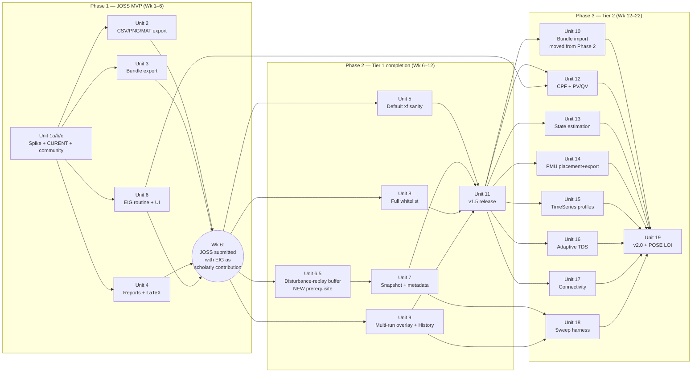
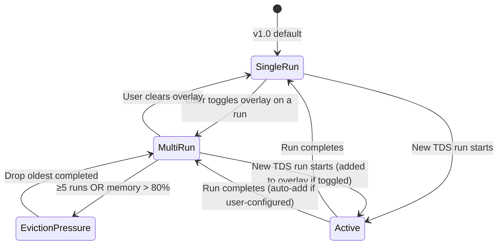

# feat: v2.0 — full ANDES coverage + JOSS publication

## Overview

v2.0 wires every analysis routine ANDES exposes (`PFlow`, `TDS`, `EIG`, `CPF`, `SE`, snapshots, time-series profiles) into the existing FastAPI substrate + React UI shipped in v1.0, plus the publication-grade artefacts (CSV / PNG / MAT export, reports, multi-run overlay, reproducibility bundles) needed to make the tool citable. Backend stays ANDES-only; no Julia / Sienna / multi-backend work happens in v2.0.

The primary outcome is a JOSS-published, Zenodo-DOI-tagged, NSF-POSE-LOI-eligible open-source GUI for ANDES research. The secondary outcome is the substrate completing its reach over the ANDES Python API such that researchers can run their full study workflow without dropping to a notebook.

The plan ships in three phases: a 6-week MVP cut that targets JOSS-paper-shippability, a 6-week completion of the rest of Tier 1 to ship v1.5, and a 10-week Tier 2 sweep that reaches "full coverage" and triggers v2.0 + the NSF POSE LOI.

## Problem Frame

v1.0 (Phase A + v0.1 + v0.2) shipped a working GUI but is honestly closer to "demo" than "tool researchers cite." The honest gap, captured in the origin brainstorm:

- Researchers cannot publish from the tool — no CSV / PNG / MAT export, no run history, no multi-run comparison. Every figure has to be re-rendered in matplotlib outside the app.
- Most ANDES analysis surface isn't reachable: `EIG` (small-signal stability — the *single* most-needed feature for academic stability research), `CPF` (continuation power flow / voltage stability), `SE` (state estimation), `snapshot save/load` (scenario sweeps from converged operating points), `time-series profiles` (multi-period studies), and the full exciter / governor / PSS / renewable model library.
- The disturbance editor's model whitelist is too thin (~9 classes) for real research cases that use IEEEX1 / ESDC2A / IEEEG1 / TGOV1 / IEEEST / SEXS / REGCA1.
- First-touch UX hits a wall: default fault `xf=0.0001` (bolted) diverges most cases; new users see "numerical instability" before they see anything work.
- No publication-grade plumbing: no run history, no reproducibility bundle, no exportable reports. JOSS reviewers, journal reviewers, and grant program officers all want artefacts the tool currently can't produce.

The doc-review pass on the origin brainstorm flagged real concerns the plan must address up front, not defer:

- **Funnel position is unvalidated.** Export gap is the *assumed* binding constraint. Discovery / install / upstream alignment may matter more — the plan therefore commits to a CURENT outreach gate at Wk 1 and a 4-feature MVP cut that lets us submit JOSS by Wk 6 and validate adoption empirically before sinking 16 weeks into Tier 2.
- **"Canonical GUI" is conferred, not declared.** The plan treats CURENT engagement as a Wk 1 precondition with an explicit branch decision at Wk 4, not as a Wk 9 mitigation.
- **Tier 1 over-scoped for JOSS bar.** The plan splits Tier 1 into a 4-feature MVP (Phase 1) that clears the JOSS bar at Wk 6 and a 4-feature completion (Phase 2) that ships v1.5 around Wk 12.
- **BackendAdapter contradiction resolved.** The brainstorm both labelled the BackendAdapter discipline a non-deliverable *and* scheduled it as Wk 1 work. Resolution: drop the formal refactor from v2.0 sequencing entirely. Keep adapter-style hygiene as it falls out of new-routine wiring (each new routine is its own well-shaped function in `wrapper.py` + dataclass result + worker handler — that is already adapter discipline). If the future Sienna fork is ever pursued, the extraction work happens then with the benefit of a real second backend to inform the protocol.

## Requirements Trace

Mapped from `docs/brainstorms/2026-05-09-v2-full-andes-coverage-publication-requirements.md`:

- **R1.** Full ANDES analysis surface in the UI: PF, TDS, EIG, CPF, SE, snapshot, time-series profiles, full model whitelist (Tier 1 #1, #3, #4 + Tier 2 #9, #10, #11, #12)
- **R2.** Publication-grade artefacts: CSV / PNG / MAT export for every chart and table; reproducibility bundle (case + disturbance specs + sim params + results) (Tier 1 #2, #6)
- **R3.** Multi-run overlay (Tier 1 #5)
- **R4.** Reports for PFlow / TDS / EIG with LaTeX copy (Tier 1 #7)
- **R5.** First-touch UX sanity (Tier 1 #8)
- **R6.** Tier 2 completion: PMU export, sub-cycle streaming, adaptive integrator, connectivity, sweep harness (Tier 2 #13, #14, #15, #16)
- **R7.** JOSS paper accepted; Zenodo DOI minted; NSF POSE Phase I LOI submitted by Wk 24
- **R8.** External citations ≥ 3 (origin doc demoted from 10) by month 12 — measured as PASS even at lower count if community-engagement signals (downloads, stars, opened issues) are strong
- **R9.** Substrate stays ANDES-only; no Julia / Sienna / multi-backend wiring

## Scope Boundaries

- No Sienna / PowerSystems.jl / Julia bridge; no multi-backend abstraction layer in code.
- No commercial SaaS; no auth beyond the existing loopback + per-launch token; no multi-tenant work.
- No industry-vertical features that ANDES does not natively support: short-circuit IEC 60909, CIM / CGMES import, OPF / SCOPF, unit commitment, market simulation, N-1 contingency screening as a polished workflow (the Tier 2 sweep harness covers this case for users willing to script it).
- No visual case builder beyond what v0.1.y already shipped (add/edit/delete element forms; no drag-from-palette topology authoring).
- No formal WCAG accessibility audit — spirit-only per v1.0's R20.
- No agent / AI chat surface in the UI (substrate stays agent-ready via OpenAPI; UI does not ship a chat panel).
- No WebGL / 3-D SLD rendering.
- No multi-user real-time collaboration.
- No sub-cycle PMU-rate live streaming via WebSocket. The Tier 2 PMU CSV export covers the use case at lower architectural cost. The brainstorm's #15 is deferred to v2.5 unless a paying customer materialises.

### Deferred to Separate Tasks

- **Backend-adapter formal refactor** — deferred to a follow-up plan if and when a second backend (Sienna or pandapower) is committed to. Current per-routine wrapper-function pattern is sufficient adapter discipline for v2.0.
- **Sub-cycle PMU-rate live streaming** — v2.5; PMU CSV export at full rate via Tier 2 #15 below covers the v2.0 use case.
- **Adaptive integrator UX preset model (`fast` / `accurate`)** — implementation-time decision; brainstorm OQ#6, see Open Questions below.
- **Cross-session run history persistence (disk-backed)** — v2.5; in-memory plus reproducibility bundle export covers the v2.0 use case.

## Context & Research

### Relevant Code and Patterns

**Substrate-side patterns to mirror per new routine:**
- Route file shape: `server/src/andes_app/api/routes/pflow.py` and `server/src/andes_app/api/routes/tds.py` are the templates. Each new routine gets its own file with `_manager(request)`, `_map_worker_error(exc)`, `@router.post("/sessions/{session_id}/<routine>", operation_id="run<Routine>", response_model=…, responses={401, 404, 409, 422})`, async handler that awaits `mgr.invoke(session_id, "<op>", args, timeout=…)`, catches `SessionExpiredError → 404` and `WorkerError → _map_worker_error`. Register in `server/src/andes_app/api/app.py` with `prefix="/api"`.
- Worker dispatch: pure-batch ops register in the `HANDLERS` dict at `server/src/andes_app/core/worker.py`; long-running / streaming ops dispatch above the dict lookup with extra context (`abort_event`, `data_pipe`, `seq`) — pattern at `_handle_run_tds`.
- Wire protocol: control pipe `{op, args, seq}`, data pipe `{type: "result"|"error"|"stream_start"|"stream_frame", seq, …}`. Errors use `{"category": "<class-name>", "detail": str(exc), "extra": {…}}`. Add new `AndesAppError` subclasses in `server/src/andes_app/core/errors.py`; the worker catch-all forwards class name as `category`.
- Wrapper return shape: frozen dataclasses serialised via `_serialize_dataclass(...)`. Mirror `PflowResult`, `TopologySnapshot`.
- Pre-setup vs committed gating: `Wrapper.add_disturbance` raises `DisturbanceCommitError()` if `self._ss.is_setup`. ANDES has *no* public API to revert `is_setup` — `System.reset()` re-calls setup, doesn't clear it. Snapshot and disturbance interaction must respect this (see Key Technical Decisions).

**UI patterns to mirror:**
- Right-dock panels: extend `RightDockTopPanel` union in `web/src/store/ui.ts` and `RIGHT_DOCK_TOP_PANELS` array; add tab spec to `tabs` in `web/src/components/shell/PanelPickerTabs.tsx`; render keyed off `useUiStore((s) => s.activeRightDockTopPanel)` from `App.tsx`. Per-panel `disabledReason` already wires the mid-run gate.
- Forms with validation: `web/src/components/disturbance/DisturbanceForm.tsx` is the canonical discriminated dispatcher; `useEffect` validity callback piped up via `onValidityChange?: (errors) => void`.
- API queries: `web/src/api/queries.ts` is the single TanStack Query hub. Patterns: typed `queryKeys` const, gated `enabled: sessionId !== null`, mutations use `onSuccess` with `queryClient.setQueryData` + Zustand store update + `void queryClient.invalidateQueries`. Errors via `ProblemDetailsError`. 401/404 cascade in `handleGlobalRecoveryError`.
- Zustand stores: one slice per concern. Cross-slice cascades in `web/src/store/index.ts`. Test-only internals via `export const __internal = { … }`.
- uPlot integration: `web/src/components/plots/UPlot.tsx` is the wrapper; data updates use `instance.setData(data, false)` (no scale reset).
- data-testid: kebab-case scoped to component (e.g. `eig-panel`, `eig-scatter`, `eig-mode-row-${idx}`).

**Run-store / runs slice surface (`web/src/store/runs.ts`):**
- Hard cap today: `trimToComparisonLimit` enforces ≤ 1 active + ≤ 1 prior completed. **Multi-run overlay (Tier 1 #5) requires lifting this cap** — see Unit 9.
- Memory budget: `DEFAULT_MEMORY_BUDGET_BYTES = 200 * 1024 * 1024`; eviction drops completed runs first, then takes 10% off the active run's head and flips `connection: 'lagged'`.
- Replay-on-reconnect is server-side via `SessionManager.attach_to_run`; the slice just calls `appendFrame(runId, …)`.

**Streaming pipeline (`server/src/andes_app/core/stream.py`):**
- Schema is group-granular today: `VAR_GROUPS = ("bus_v", "gen_state", "line_flow")`. Per-bus selective streaming would require a fourth `bus_v_selected` group threading a per-run idx subset — deferred to v2.5 per Scope Boundaries.

**Disturbance pre-setup gate (`server/src/andes_app/core/disturbance.py` + `wrapper.py`):**
- `Wrapper.add_disturbance` raises `DisturbanceCommitError` if `is_setup`. Same gate guards `add_element`, `edit_element`, `delete_element`. Worker catches it and sends `{"category": "disturbance-commit", "detail": …}`. Routes translate to 409 with the `"call POST /api/sessions/{id}/reload"` recovery hint.

**Test patterns:**
- Server integration: pytest-asyncio fixture spins up `make_app(...)` + `SessionManager` against `httpx.ASGITransport`. Token = `"c" * 64`. Pattern at `server/tests/integration/test_disturbances_tds_api.py`.
- Server unit: pure pytest, no async. Pattern at `server/tests/unit/test_stream_aggregator.py`.
- Web unit: mock `useCurrentTopology` via `@/api/queries` module mock with `vi.importActual` for everything else; mock fetch via `globalThis.fetch` spy + `setTokenGetter(() => 'test-token')`; manipulate runs store directly via `useRunsStore.setState({ runs: {}, activeRunId: null })`. uPlot mocked at module level.

**AGENTS.md guidance load-bearing for v2.0:**
- Single endpoint per disturbance commit; pre-setup gate; only escape is `POST /sessions/{id}/reload`.
- `PFlow.run()` and `TDS.run()` do NOT auto-call `setup()`; the wrapper's `_ensure_setup()` does it. New routines (`EIG`, `CPF`, `SE`) must follow the same explicit-setup contract.
- HTTP boundary uses ANDES `idx` + `name` directly. Stringify int idxs at the JSON boundary.
- Types codegen via `pnpm regen-api-types` into `web/src/api/generated.ts` after every new endpoint lands.
- All paths repo-relative.
- `mypy --strict` + `ruff check` on `server/src/`; `pnpm lint --max-warnings 0` + `pnpm typecheck` + `pnpm format:check` on `web/`.

### Institutional Learnings

- **`add_disturbance` does NOT append to `_replay_buffer`** (verified at planning time at `wrapper.py:322`, per `docs/plans/2026-05-08-002`). Snapshot/restore semantics in v2.0 must extend or sidestep this — see Unit 7.
- **WS protocol close codes** 4401 auth, 4404 unknown session/run, 4500 worker; **resync is terminal** — UI must not auto-reconnect after a `resync` message.
- **Vite 6 + http-proxy-3** stops forwarding `X-Andes-Token` after ~10h uptime — affects long sweeps (Unit 18). Workaround: dev-server restart.
- **Substrate generates fresh tokens on each launch** — mid-stream session recovery is a pre-existing v0.2 deferred item that the sweep harness makes more visible.
- **`--allow-origin` is exact-match**: `127.0.0.1:5173`, not `localhost:5173`.
- **Source-grounding rule** (`feedback_deepening_needs_source_grounding.md`): a prior deepening pass introduced six P0/P1 errors including a fabricated `reset_to_pre_setup()` API. v2.0 spike work (Unit 1) must read `andes/routines/{eig,cpf,se}.py` directly and cite line numbers; do not trust agent-generated API surface.
- **User collaboration style** (`feedback_collab_style.md`): present full vision alongside recommended-MVP slice; engages with adversarial pressure-testing; values forward-compatible architecture.

### External References

- ANDES 2.0 source: `/home/roger-gracia/andes-project/.venv/lib/python3.12/site-packages/andes/` — authoritative for `routines/eig.py`, `routines/cpf.py`, `routines/se.py`, `utils/snapshot.py`, `models/measurement/pmu.py`, `models/timeseries.py`.
- Origin brainstorm: `docs/brainstorms/2026-05-09-v2-full-andes-coverage-publication-requirements.md`.
- Prior plan: `docs/plans/2026-05-07-003-feat-v02-ui-disturbance-tds-streaming-plan.md` (WS protocol, abort, error taxonomy).
- Prior plan: `docs/plans/2026-05-08-002-feat-v01y-deletion-layout-prerequisites-plan.md` (atomic reload-and-replay, disturbance-replay open question).

## Key Technical Decisions

The doc-review pass on the brainstorm surfaced 30+ findings. Many are resolved here so implementation does not have to re-litigate them.

**KTD-1: BackendAdapter formal refactor is not in v2.0 scope.**
The brainstorm contradiction (non-goal *and* Wk 1 milestone) is resolved by dropping the formal protocol refactor entirely. Each new ANDES routine in v2.0 lands as its own wrapper function + dataclass + worker handler. **Explicit rule: no new `typing.Protocol`, abstract base class, or interface class for backend abstraction in v2.0. Each routine is a concrete method directly on `Wrapper`.** If the Sienna fork is ever pursued, the extraction work happens then with the benefit of a real second backend to inform the protocol shape. *(Resolves doc-review P0: "BackendAdapter section incoherent and undersized.")*

**KTD-2: Tier 1 ships in two phases — EIG pulled into Phase 1 to make JOSS framing defensible.**
Phase 1 (Wk 1–6) = MVP JOSS-shippable cut: export (#2) + reproducibility-bundle export (#6 partial) + reports (#7) + **EIG (#1)** + Unit 1 spike + outreach. Phase 2 (Wk 6–12) = Tier 1 completion: default-sanity (#8) + **disturbance-replay buffer (Unit 6.5, prerequisite for snapshot)** + snapshot (#3) + full whitelist (#4) + multi-run overlay + history (#5) + v1.5 release tag. **Bundle import (#6 completion) deferred to Phase 3 entry** to give Phase 2 schedule slack. JOSS submission at Wk 6 — now with EIG as the substantive scholarly contribution mitigating the "thin GUI wrapper" desk-rejection risk (per ADV-003). *(Resolves doc-review P0 ×3: "Tier 1 over-scoped + Phase 1 doesn't differentiate from thin wrapper + Phase 2 zero slack.")*

**KTD-3: CURENT outreach is a Wk 1 precondition with explicit branch decision at Wk 4.**
Wk 1 task: email Hantao Cui (UTK CURENT) with a working v1.0 demo link, a JOSS paper outline, and an explicit ask: co-authorship + cross-link from upstream `andes/` README, or governance handoff if that's preferred. Wk 4 branch decision: (A) Cui says yes-and-co-author → JOSS paper written jointly, "canonical GUI" framing stays; (B) Cui says yes-but-our-org → evaluate moving the repo under `CURENT/`; (C) Cui says no / silent → reframe success metric from "canonical" to "actively-maintained, JOSS-published, frequently-cited" and proceed independently. *(Resolves doc-review P0: "Canonical GUI assumption" + ADV-001.)*

**KTD-4: Snapshot is PF-state + disturbance-list metadata.**
Snapshots in v2.0 capture the converged PF state (via `andes.utils.snapshot.save_ss`) **and** the substrate-side disturbance list as separate JSON metadata. On restore: the substrate (a) calls `reload_case` (clearing `is_setup`), (b) replays the disturbance list pre-setup, (c) calls `setup()` + `PFlow.run()` to reach the same operating point, (d) optionally restores the dill snapshot to short-circuit (b)+(c) when no new disturbances will be added. The dill snapshot becomes an *optimization*, not the reproducibility contract. *(Resolves doc-review P0: "Snapshot+disturbance pre-setup conflict.")*

**KTD-5: Reproducibility bundle contract.**
A bundle `.zip` contains: (a) the original case file(s) verbatim if unedited, OR a canonical `.xlsx` export if edited; (b) `disturbances.json` (the substrate's `DisturbanceSpec` list); (c) `sim_params.json` (tf, h, vars, decimation, integrator); (d) `results.csv` (long-form per OQ#5); (e) `manifest.json` containing `andes.__version__`, `andes_app.__version__`, case checksum, list of files. Snapshots are explicitly NOT in the bundle (their dill payload is version-locked and undermines portability). On import: ANDES version mismatch surfaces a warning but allows load; missing addfile blocks; edited-case checksum mismatch shows a side-by-side diff before commit. *(Resolves doc-review P0: "Reproducibility bundle under-specifies case-format.")*

**KTD-6: Right-dock IA — consolidate analysis routines into one Analyze panel.**
The brainstorm proposed adding 6 new tabs (EIG, CPF, SE, History, Reports, PMU placement) to the existing 4-tab strip (Inspector / Disturbance / Plot / TDS config). That doesn't fit. Resolution: introduce one new tab `Analyze` whose sub-mode picker (PF / TDS / EIG / CPF / SE) replaces the existing `RunMode = 'pf' | 'tds'` toggle. EIG / CPF / SE results render in the same tab gated by sub-mode. **History** becomes a slide-out drawer triggered from the topbar (not a tab). **Reports** is a `ReportDialog` modal opened from a topbar Export menu. **PMU placement** is a modal opened from the disturbance editor's element picker. Net new tabs: 1 (Analyze). Net removed: 1 (TDS config folds into Analyze sub-mode TDS). *(Resolves doc-review P0: "Right-dock IA cannot host 6 new panels.")*

**KTD-7: EIG large-case strategy.**
Substrate returns `mu` (eigenvalues, full) + `As` shape metadata + `pfactors` sliced by `mode_id` on demand via a separate endpoint `GET /sessions/{id}/eig/modes/{mode_id}/participation`. UI defaults to a filtered scatter view: damping ratio < 5% AND |Re| < 5 (configurable). Pagination kicks in if the scatter exceeds 200 visible points. Scatter selection drives the participation table and damping bar chart (linked-selection model). Empty state when no PF result yet. *(Resolves doc-review P0: "EIG panel design unresolved.")*

**KTD-8: Multi-run overlay cap and selection model.**
`trimToComparisonLimit` is replaced with a configurable retention: default 5 retained completed runs; user-configurable up to 20 via TDS config. **Memory budget: per-run cap = 40 MB (200 MB total / 5 default retention), preserving the existing total budget — not 200 MB × N.** New `overlayRunIds: ReadonlySet<string>` selection set in `RunsState` separate from `activeRunId`. `VariableTreePicker` extended with a per-run filter row. SLD animation overlay pinned to `activeRunId` regardless of overlay selection. Color palette: `runId`-stable hash to one of 8 distinguishable colors; legend is a toggleable chip per run inside the Plot panel. **Retention policy applies on `startRun`, `markRunDone`, and on retention-config-change** (otherwise lowering retention from 20 to 5 would not evict). *(Resolves doc-review P0: "Multi-run overlay design unresolved.")*

**KTD-9: Sweep harness (Tier 2 #16) decomposed.**
Three sub-features: (a) **Sweep dialog** — picks parameter, range, steps; produces a SweepSpec; (b) **Execution model** — sequential via the existing per-session worker (one TDS at a time; no parallel workers in v2.0); progress emitted via WS events to a History drawer panel; (c) **Sweep result viewer** — reuses multi-run overlay infrastructure (Unit 9) but with parameter-axis colour gradient instead of per-run hash. Sweeps cap at 50 runs by default; user-configurable. Cancellable mid-run by aborting the active TDS. Each iteration restarts from a snapshot taken at sweep-start (KTD-4). *(Resolves doc-review P1: "Sweep harness three-features-in-one.")*

**KTD-10: Default `xf` change requires empirical sweep first.**
Before changing `blankFaultSpec` default `xf`, run an empirical sweep on IEEE 14 + IEEE 39 + kundur with default `tf` / `h` / no adaptive: smallest `xf` value where all three converge cleanly. Document in commit message + PR. Probably ~0.05 but verify rather than assume. *(Resolves doc-review P2: "Default xf=0.05 makes the tool worse for primary use case.")*

**KTD-11: Citation goal demoted; community-engagement track added.**
Origin doc's "≥10 external citations by month 12" demoted to ≥3 citations + measurable usage signals (downloads ≥ 100, GitHub stars ≥ 100, opened issues ≥ 5, ANDES-discussions presence). Add a parallel community-work track to sequencing (Unit 1, ongoing). Workload: 4 hr/week explicitly allocated. *(Resolves doc-review P1: "Citation target mathematically aggressive" + "Community work unscheduled.")*

**KTD-12: NSF POSE coalition gate.**
Co-PI commitment is a Wk 12 milestone gate, not a Wk 9 strengthener. If no co-PI commits by Wk 12 (after CURENT outreach + a candidate department-affiliated faculty member), demote NSF POSE from primary funding strategy and reframe the funding story (DOE EERE, ARPA-E PERFORM, NSF PIPP, foundation grants). *(Resolves doc-review P1: "NSF POSE solo-PI viability.")*

**KTD-13: ICP for v2.0 is "researcher publishing."**
v1.0 ICP was "researcher iterating." v2.0 explicitly broadens to "researcher publishing" (different jobs in the workflow): primary value is reproducible artefacts + small-signal stability + multi-run comparison. Tier 2 #10 (SE) and #11 (PMU) serve a third sub-persona (PMU/state-estimation researchers); they ship in v2.0 because they round out ANDES coverage but they are explicitly *not* the primary ICP. *(Resolves doc-review P1: "ICP shift not acknowledged.")*

**KTD-14: Identity tension resolved — UX-modernity stays a constraint, not the wedge.**
v1.0's "modern open-source UX vs. legacy commercial tools" wedge is preserved as a *constraint* on every Tier 1/2 feature (each new panel must respect the existing IA, keyboard accessibility, and aesthetic patterns) but is no longer the *primary positioning*. The v2.0 wedge is "the open-source GUI that completes ANDES's reach into research workflows." *(Resolves doc-review P1: "Identity drift.")*

**KTD-15: CSV schema is long-form.**
Long-form: `(time, variable, value)` rows. Friendlier for `pandas.read_csv` + `pivot`. Already auto-fixed in the brainstorm. *(Resolves brainstorm OQ#5.)*

**KTD-16: Adaptive TDS UX — preset model.**
Two presets: **Auto** (sensible tolerance, hidden) and **Manual** (exposes `rtol`, `atol`, `max_step`). Default Auto. Power-users override via Manual. *(Resolves brainstorm OQ#6.)*

**KTD-17: PMU placement is a modal dialog separate from the disturbance editor.**
PMUs are *measurement* models, not disturbances. Mixing them into the disturbance timeline confuses the mental model. PMU placement: dialog opened from the topbar element-add menu or the SLD bus context menu. *(Resolves brainstorm OQ#7.)*

## Open Questions

### Resolved During Planning

- **Where does the EIG / CPF / SE entry point live?** → KTD-6 (Analyze panel sub-mode picker)
- **What is the snapshot conflict resolution?** → KTD-4 (PF state + disturbance metadata, snapshot is optional optimization)
- **Reproducibility bundle file format and conflict handling?** → KTD-5
- **Right-dock IA scaling?** → KTD-6
- **EIG large-case eigenvalue handling?** → KTD-7
- **Multi-run overlay cap and selection?** → KTD-8
- **Sweep harness decomposition + execution model?** → KTD-9
- **CSV form (long vs wide)?** → KTD-15 (long)
- **Adaptive TDS preset vs raw tolerance?** → KTD-16 (preset, Manual reveals)
- **PMU placement editor location?** → KTD-17 (modal, not in disturbance editor)
- **CURENT relationship contingency?** → KTD-3
- **Citation goal feasibility?** → KTD-11 (demoted)
- **NSF POSE viability?** → KTD-12 (coalition gate)
- **Tier 1 minimum-viable cut?** → KTD-2
- **BackendAdapter scope?** → KTD-1 (dropped)
- **ICP for v2.0?** → KTD-13 (researcher publishing)
- **Identity / wedge framing?** → KTD-14 (UX-modernity is constraint, full-coverage is wedge)

### Deferred to Implementation

- **Analyze panel sub-mode picker visual design** — placement of PF / TDS / EIG / CPF / SE buttons (segmented control vs dropdown vs tabs-within-tab); implementation-time UX call.
- **Per-routine spike findings** — Unit 1 spikes against `andes.routines.{eig,cpf,se}` may surface API quirks that change wiring approach. Don't pre-decide.
- **Empirical `xf` default value** — Unit 5 sweep may show 0.03 / 0.05 / 0.1 are all valid; pick smallest convergent.
- **History drawer placement on the topbar** — left of Run button, right, under a kebab menu — implementation-time call once the topbar layout is reviewed.
- **Reports modal LaTeX-table format** — `\begin{tabular}` vs `booktabs`; pick the one that pastes most cleanly into a recent IEEE-style PSCC paper.
- **Sweep parameter introspection** — which device parameters surface in the sweep dialog; reuse `useAlterableParams` if its scope matches; otherwise add a sweep-specific endpoint.

## Output Structure

Greenfield additions only (existing files modified separately, called out per Unit). No new top-level directories.

```
server/src/andes_app/
  api/routes/
    eig.py                      # NEW (Unit 6) — EIG analysis endpoint
    cpf.py                      # NEW (Unit 12) — Continuation power flow
    se.py                       # NEW (Unit 13) — State estimation
    snapshot.py                 # NEW (Unit 7) — Snapshot save/load + bundle export
    bundle.py                   # NEW (Unit 10, Phase 3) — Bundle import endpoint
    reports.py                  # NEW (Unit 4) — PFlow/TDS/EIG report endpoints
    sweep.py                    # NEW (Unit 18) — Sensitivity sweep orchestrator
    pmu.py                      # NEW (Unit 14) — PMU placement + measurement export
    profiles.py                 # NEW (Unit 15) — Time-series profile import
  core/
    bundle.py                   # NEW (Unit 3 + Unit 10) — Bundle pack/unpack
    eig_result.py               # NEW (Unit 6) — EIG result dataclasses
    cpf_result.py               # NEW (Unit 12)
    se_result.py                # NEW (Unit 13)
    snapshot.py                 # NEW (Unit 7) — Snapshot + disturbance metadata
    report.py                   # NEW (Unit 4) — Report renderers
    sweep.py                    # NEW (Unit 18) — Sweep orchestrator
  errors.py                     # MODIFY — new AndesAppError subclasses

web/src/
  components/
    analyze/                    # NEW directory (Unit 6+8) — Analyze panel
      AnalyzePanel.tsx
      AnalyzeSubModePicker.tsx
      EIGScatter.tsx
      EIGParticipationTable.tsx
      EIGDampingChart.tsx
      CPFCurveChart.tsx         # Unit 12
      SEResidualChart.tsx       # Unit 13
    bundle/                     # NEW (Unit 3 + 10)
      BundleExportDialog.tsx
      BundleImportDialog.tsx
    history/                    # NEW (Unit 9)
      HistoryDrawer.tsx
      HistoryRunRow.tsx
    reports/                    # NEW (Unit 4)
      ReportDialog.tsx
      LatexCopyButton.tsx
    pmu/                        # NEW (Unit 14)
      PmuPlacementDialog.tsx
    profiles/                   # NEW (Unit 15)
      ProfileImportDialog.tsx
    sweep/                      # NEW (Unit 18)
      SweepDialog.tsx
      SweepProgressPanel.tsx
    export/                     # NEW (Unit 2)
      ExportMenu.tsx
      exportToCsv.ts
      exportToPng.ts
      exportToMat.ts
  store/
    analyze.ts                  # NEW (Unit 6+8) — Analyze sub-mode + EIG result state
    bundle.ts                   # NEW (Unit 3+10)
    history.ts                  # NEW (Unit 9)
    pmu.ts                      # NEW (Unit 14)
    profiles.ts                 # NEW (Unit 15)
    sweep.ts                    # NEW (Unit 18)
    runs.ts                     # MODIFY (Unit 9) — lift cap, add overlayRunIds
    ui.ts                       # MODIFY — extend RightDockTopPanel union
```

## High-Level Technical Design

> *This illustrates the intended approach and is directional guidance for review, not implementation specification. The implementing agent should treat it as context, not code to reproduce.*

**Three-phase delivery:**



**Per-routine substrate shape (EIG / CPF / SE all follow this):**

```
[HTTP route file]                    [Worker]                        [Wrapper]
  POST /sessions/{id}/<routine>      HANDLERS["run_<routine>"]       Wrapper.run_<routine>(...)
    └─ async handler                   └─ _handle_run_<routine>        └─ ensure_setup()
        ├─ uuid run_id                     └─ wrapper.run_<routine>     └─ ss.<Routine>.run(...)
        ├─ mgr.invoke(...)                 └─ _serialize_dataclass     └─ extract result
        ├─ catch SessionExpired                                         └─ return @dataclass
        ├─ catch WorkerError →
        │   _map_worker_error
        └─ Pydantic response
```

**Multi-run overlay state machine (Unit 9):**



## Implementation Units

### Phase 1 — JOSS MVP (Wk 1–6)

> **Phase 1 ships: Units 1a/1b/1c, 2, 3, 4, 6.** Unit 5 (xf default sanity) was relocated to Phase 2 to preserve Phase 1 schedule for EIG. Unit 6 (EIG) was relocated from Phase 2 to Phase 1 so the JOSS paper has a substantive scholarly contribution at submission time.

- [x] **Unit 1a: ANDES routine API spike** *(complete: docs/spikes/2026-05-09-andes-routine-surface-spike.md)*

**Goal:** Verify the actual ANDES API surface for `EIG`, `CPF`, `SE`, `snapshot`, `Measurements`, `timeseries`, `PMU` before committing routine wiring. **This is the technical prerequisite for Units 6, 7, 12, 13, 14, 15.**

- [x] **Unit 1b: CURENT outreach kickoff** *(draft ready: docs/outreach/2026-05-09-curent-cui-outreach.md — user sends manually)*

**Goal:** Initiate the CURENT relationship at Wk 1; track responses through the Wk 4 branch decision per KTD-3.

- [x] **Unit 1c: Community-track scaffolding** *(complete: docs/community/community-track.md)*

**Goal:** Stand up the community-engagement doc with Wk 1–24 commitments. Identify 3–5 candidate design-partner labs.

The original Unit 1 (combined) is preserved below — implementers should treat the Files / Approach / Verification sections as the merged content of 1a/1b/1c, but the unit can be marked complete in three independent acceptance gates.

**Requirements:** R1, R7, R8, KTD-3, KTD-11

**Dependencies:** None.

**Files:**
- Create: `docs/spikes/2026-05-09-andes-routine-surface-spike.md` (spike notes; not code)
- Create: `docs/community/community-track.md` (week-by-week community-work commitments)

**Approach:**
- 1 day each: open `andes/routines/eig.py`, `cpf.py`, `se.py`, `utils/snapshot.py`, `models/measurement/pmu.py`, `models/timeseries.py` and document: required prior calls (does it need `setup()`? `PFlow.run()`?), input shapes, output shapes, what attributes the result exposes, what failures look like, whether streaming hooks exist. Cite line numbers per `feedback_deepening_needs_source_grounding.md`.
- Email Hantao Cui at UTK CURENT (Wk 1): working v1.0 demo link, JOSS paper outline, ask for co-authorship + cross-link from upstream `andes/` README. Branch decision recorded by Wk 4 per KTD-3.
- Stand up community-track doc: weekly commitments to ANDES discussions, Discord (if exists), demo video, blog post per release, tutorial proposal for IEEE PES GM 2027.
- Identify 3–5 candidate research labs as design partners; cold-email demo offer.

**Patterns to follow:**
- Spike doc style: `docs/solutions/2026-05-07-cli-anything-andes-architectural-mismatch.md`.

**Test scenarios:**
- Test expectation: none — this unit is research, outreach, and documentation.

**Verification:**
- Spike doc lists, per ANDES routine, the actual function signature, prerequisite state, output shape, and any quirks. Each claim cites a line number in the installed ANDES package.
- CURENT email sent; follow-up tracked in community-track doc.
- Community-track doc has entries for Wk 1–24.

---

- [x] **Unit 2: CSV / PNG / MAT export end-to-end** *(complete: commit 2062532; 679 tests pass)*

**Goal:** Every chart, table, and result panel in the app exposes an Export menu that produces (a) long-form CSV for data, (b) PNG for figures, (c) `.mat` for the EIG state matrix specifically.

**Requirements:** R2, KTD-15

**Dependencies:** Unit 1 spikes (for `.mat` file-format choice).

**Files:**
- Create:
  - `web/src/components/export/ExportMenu.tsx`
  - `web/src/components/export/exportToCsv.ts`
  - `web/src/components/export/exportToPng.ts`
  - `web/src/components/export/exportToMat.ts`
  - `web/tests/unit/components/export/ExportMenu.test.tsx`
  - `web/tests/unit/components/export/exportToCsv.test.ts`
  - `web/tests/unit/components/export/exportToPng.test.ts`
  - `web/tests/unit/components/export/exportToMat.test.ts`
- Modify:
  - `web/src/components/plots/TimeSeriesPlot.tsx` (mount ExportMenu)
  - `web/src/components/plots/ScrubControl.tsx` (mount ExportMenu)
  - `web/src/components/inspector/ResultsTable.tsx` (mount ExportMenu)
  - `web/src/components/sld/SldCanvas.tsx` (mount ExportMenu for SVG-as-PNG)

**Approach:**
- ExportMenu is a dropdown with format options gated on the panel's data type (table → CSV; chart → CSV+PNG; EIG state matrix → CSV+MAT).
- CSV: long-form `(time, variable, value)` for time-series; `(row_label, column, value)` for tables. UTF-8, newline `\n`.
- PNG: render via `html-to-image` (a lightweight, MIT-licensed library) targeting the chart's container `div`; preserves uPlot canvas + axis labels + legend. For SLD, use the existing SVG → `XMLSerializer` → `Blob` path.
- MAT: server-side endpoint `GET /sessions/{id}/eig/state-matrix.mat` uses `scipy.io.savemat` (already a transitive dep via numpy/scipy in the ANDES install) to emit a `.mat` v5 file, returned as `application/octet-stream`. UI Export menu calls this endpoint when format = MAT. Avoids the JS MAT-writer ecosystem gap (no MIT-licensed writer exists; `mat-for-js` is GPL-3 and read-only, verified at planning time).
- File naming: `{case_name}_{run_id_prefix}_{panel}_{timestamp}.{ext}`.
- Concurrency: one export at a time per panel; show inline spinner.

**Patterns to follow:**
- `web/src/components/case/SaveCaseDialog.tsx` for download trigger pattern (Blob + `URL.createObjectURL` + anchor click + revoke).

**Test scenarios:**
- Happy path: a TimeSeriesPlot with 3 variables and 60 rows exports CSV with 180 rows (long-form) plus a header row.
- Happy path: a TimeSeriesPlot exports PNG; the resulting Blob is non-empty and has MIME `image/png`.
- Edge case: empty panel (no run yet) → ExportMenu disabled with tooltip "No data to export."
- Edge case: active run with `connection: 'lagged'` (frames evicted) → CSV export includes an inline header comment `# WARNING: this run dropped X early rows due to memory pressure`.
- Error path: `URL.createObjectURL` throws → toast "Export failed; check browser settings."
- Integration: ResultsTable export of post-PF results → CSV columns match the table's visible columns + filter state.

**Verification:**
- Manual smoke: load IEEE 14, run PF, run TDS for 5s, open every panel, export CSV+PNG, verify all files open in pandas / Image.open.
- Unit tests pass: `pnpm test web/tests/unit/components/export/`.

---

- [x] **Unit 3: Reproducibility bundle export** *(complete: commit eba0a4c; +13 server unit + 9 server integration + 18 web tests)*

**Goal:** Export a `.zip` bundle containing case + disturbance specs + sim params + results (CSV) + manifest with ANDES + app version. Bundle round-trips deterministically across sessions on the same ANDES version.

**Requirements:** R2, KTD-5

**Dependencies:** Unit 2 (CSV emit reused).

**Files:**
- Create:
  - `server/src/andes_app/api/routes/snapshot.py` (subset: bundle export endpoint only; full snapshot save in Unit 7)
  - `server/src/andes_app/core/bundle.py`
  - `server/tests/integration/test_bundle_export_api.py`
  - `server/tests/unit/test_bundle.py`
  - `web/src/components/bundle/BundleExportDialog.tsx`
  - `web/src/store/bundle.ts`
  - `web/tests/unit/components/bundle/BundleExportDialog.test.tsx`
  - `web/tests/unit/store/bundle.test.ts`
- Modify:
  - `server/src/andes_app/api/app.py` (register `bundle` router)
  - `web/src/api/queries.ts` (add `useExportBundle` mutation)
  - `web/src/components/shell/TopBar.tsx` (mount export button)

**Approach:**
- Endpoint `POST /sessions/{id}/bundle/export`. Substrate assembles:
  - Case: original file from workspace if `case.dirty == false`; else canonical `.xlsx` export via existing `Wrapper.save_case`.
  - `disturbances.json`: serialised list of `DisturbanceSpec` Pydantic models from the substrate's in-memory disturbance list.
  - `sim_params.json`: last TDS run's `tf`, `h`, `vars`, `decimation`, `max_rate_hz`, `integrator`.
  - `results.csv`: long-form serialisation of last run's frames from the runs slice (substrate side via `_runs[run_id].frames` → CSV).
  - `manifest.json`: `{ andes_version, andes_app_version, case_filename, case_sha256, disturbance_count, run_id, exported_at, files: [...] }`.
- Returns `application/zip` stream.
- BundleExportDialog: shows bundle contents preview (file list + sizes) before committing the download.

**Patterns to follow:**
- `server/src/andes_app/api/routes/cases.py` for case-file serving pattern.
- `web/src/components/case/SaveCaseDialog.tsx` for download trigger.

**Test scenarios:**
- Happy path: load IEEE 14, add Fault on bus 5, run TDS for 2s, export bundle. Verify ZIP contains 5 files; manifest JSON is valid; results.csv is long-form with correct row count; disturbances.json matches the in-memory list.
- Edge case: no run yet → bundle exported with `results.csv` absent; manifest reflects that.
- Edge case: case edited (`case.dirty == true`) → bundle includes `.xlsx` instead of original `.raw`; manifest notes this.
- Edge case: PSS/E `.raw` + `.dyr` addfile → bundle includes both verbatim if unedited.
- Error path: `wrapper.save_case` raises (e.g., elements pre-setup that ANDES can't roundtrip) → 422 with actionable message.
- Integration: bundle exported from session A on workspace W, dropped into workspace W' on a fresh session — file list matches.

**Verification:**
- Manual smoke: round-trip a bundle through two browser sessions; same TDS rerun produces identical results.csv.
- `pnpm test web/tests/unit/components/bundle/` and `pytest server/tests/integration/test_bundle_export_api.py` pass.

---

- [x] **Unit 4: Reports endpoints (PFlow / TDS) + LaTeX copy** *(complete: commit ff1888a; +28 server unit + 11 integration + 30 web tests; EIG enum forward-compat staged for Unit 6)*

**Goal:** A Reports modal renders human-readable reports from `PFlow.report()` and `TDS.summary()`; a "Copy as LaTeX" action writes a `tabular` block to the clipboard ready to paste into a paper.

**Requirements:** R4

**Dependencies:** Unit 1 spikes (verifies report APIs are stable).

**Files:**
- Create:
  - `server/src/andes_app/api/routes/reports.py`
  - `server/src/andes_app/core/report.py`
  - `server/tests/integration/test_reports_api.py`
  - `server/tests/unit/test_report.py`
  - `web/src/components/reports/ReportDialog.tsx`
  - `web/src/components/reports/LatexCopyButton.tsx`
  - `web/tests/unit/components/reports/ReportDialog.test.tsx`
- Modify:
  - `server/src/andes_app/api/app.py`
  - `web/src/api/queries.ts` (add `useReport` query)
  - `web/src/components/shell/TopBar.tsx` (Export menu adds Report option)

**Approach:**
- Endpoint `GET /sessions/{id}/report?routine={pflow|tds}` returns `{plain_text, structured: { tables: [{title, headers, rows}, ...] }}`. **EIG report variant lands in Unit 6** (when EIG itself ships) — Phase 1 endpoint is `pflow|tds` only; the route's enum widens in Unit 6.
- `core/report.py` calls `ss.PFlow.report()` (writes to a file path ANDES chooses; capture via `tempfile`) and parses into structured tables.
- LatexCopyButton: renders the structured tables as `\begin{tabular}{lrrr}` blocks (or `booktabs` style — implementation-time choice per Open Questions).
- ReportDialog: tab strip per routine; each tab shows plain-text + LatexCopyButton.

**Patterns to follow:**
- `server/src/andes_app/api/routes/pflow.py` for endpoint + worker handler shape.

**Test scenarios:**
- Happy path: load IEEE 14, run PF, GET `/report?routine=pflow` → 200 with non-empty `plain_text` and at least 2 structured tables (Bus voltages, Line flows).
- Happy path: ReportDialog renders structured tables; LatexCopyButton writes valid `\begin{tabular}` to clipboard.
- Edge case: no PF run yet → 409 with "Run PFlow first"; ReportDialog shows empty state.
- Edge case: TDS report requested but no TDS run → same.
- Error path: ANDES report file write fails → 500 with the actual ANDES error.
- Integration: report content matches a manually-run `andes run -p` of the same case.

**Verification:**
- `pytest server/tests/integration/test_reports_api.py` passes; ReportDialog smoke verifies LaTeX paste in a sample TeX document.

---

- [x] **Unit 5: Default-parameter sanity (xf empirical sweep + change)** *(complete: commit 04642f1; xf=0.05; +9 web tests; sweep script + empirical report committed)*

**Goal:** Replace the divergence-prone `xf=0.0001` default with the smallest empirically-validated value that converges cleanly on IEEE 14 + IEEE 39 + kundur **AND a representative inverter-dominant case (REGCA1-based)** with default `tf` / `h` / fixed-step. Add a pre-run check that warns on bolted faults with a stiff system.

**Requirements:** R5, KTD-10

**Dependencies:** None (early Phase 2 task).

**Files:**
- Create:
  - `docs/spikes/2026-05-09-xf-default-empirical.md` (sweep results)
  - `web/src/components/disturbance/BoltedFaultWarning.tsx`
  - `web/tests/unit/components/disturbance/BoltedFaultWarning.test.tsx`
- Modify:
  - `web/src/store/disturbance.ts` (`blankFaultSpec` default `xf`)
  - `web/src/components/disturbance/FaultSpecForm.tsx` (mount BoltedFaultWarning)
  - `web/tests/unit/components/disturbance/AddEventDialog.test.tsx` (update assertion)

**Approach:**
- Empirical sweep: script that loads IEEE 14 + IEEE 39 + kundur, applies a single Fault on a representative bus, runs TDS at default `tf=10`, `h=1/120`, fixed-step Trapezoidal. Try `xf` = 0.0001, 0.001, 0.01, 0.05, 0.1. Record convergence + final-time + max-bus-voltage-overshoot. Smallest `xf` where all 3 cases converge becomes the new default.
- BoltedFaultWarning: shown in FaultSpecForm when `xf < 0.01`; copy: "Bolted faults often diverge with fixed-step integration. If you hit numerical instability, either set `xf ≥ 0.01` or enable adaptive TDS (planned: Unit 16)."
- Update AddEventDialog test to expect the new default.

**Patterns to follow:**
- Existing form-warning pattern: `web/src/components/disturbance/FaultSpecForm.tsx` uses inline `<div role="alert">` for validation errors.

**Test scenarios:**
- Happy path: new user clicks Add disturbance → Add → Run TDS on IEEE 14 → completes without numerical instability banner.
- Happy path: user sets `xf=0.001` → BoltedFaultWarning appears.
- Edge case: user sets `xf=0` → warning still appears; submit allowed (don't block the workflow, just warn).
- Edge case: user sets `xf=0.05` → no warning.

**Verification:**
- xf sweep doc is committed with empirical data and final default value.
- Smoke test on IEEE 14 / 39 / kundur completes without "numerical instability" on default fault.
- All web tests still pass (`pnpm test`).

---

**Wk 6 milestone: JOSS submission.** Phase 1 complete. Submit JOSS paper at this point. Co-author with CURENT if KTD-3 branch (A) realised; otherwise solo with explicit "statement of need" framed around the substrate-first architecture + reproducibility bundle (per ADV-003 mitigation).

---

### Phase 2 — Tier 1 completion (Wk 6–12)

> **Phase 2 ships: Units 5, 6.5, 7, 8, 9, 11.** Unit 6 (EIG) was relocated to Phase 1. **Unit 6.5 is new** — a disturbance-replay buffer infrastructure prerequisite for snapshot/restore (Unit 7) that was hidden in Unit 7's approach in the prior plan version. Unit 10 (bundle import) was relocated to Phase 3 entry to preserve Phase 2 slack. Unit 5 (xf default) was relocated here from Phase 1 (1-day script + 1-line default change).

- [x] **Unit 6.5: Disturbance-replay buffer infrastructure** *(complete: commit 5bf530c; +18 server tests; GET /sessions/{id}/disturbances + replay/clear/list methods)*

**Goal:** Add substrate-side `_disturbance_log: list[DisturbanceSpec]` field to `Wrapper` so committed disturbances can be replayed after `reload_case`. This is the missing infrastructure that Unit 7 (snapshot), Unit 14 (PMU), Unit 15 (TimeSeries profiles), and Unit 18 (sweep) all silently depend on.

**Requirements:** R1, KTD-4

**Dependencies:** Unit 1a (spike confirms ANDES `add` semantics for disturbances post-reload).

**Files:**
- Modify:
  - `server/src/andes_app/core/wrapper.py` — add `_disturbance_log` field; `add_disturbance` appends; `reload_case` clears it; new `replay_disturbances()` method iterates and re-adds; `clear_disturbances()` for snapshot-restore reset
  - `server/src/andes_app/core/disturbance.py` — ensure `DisturbanceSpec` is JSON-serialisable for snapshot metadata
  - `server/src/andes_app/api/routes/disturbances.py` — surface the disturbance list via `GET /sessions/{id}/disturbances` (for client sync after reload)
  - `server/tests/integration/test_disturbances_replay_api.py` (NEW)
  - `server/tests/unit/test_wrapper_disturbance_replay.py` (NEW)

**Approach:**
- Mirror the existing `_replay_buffer` pattern for elements (per `wrapper.py:181, 432`) but keep disturbances in a parallel field — they have different lifecycle semantics (committed pre-setup, locked post-setup, cleared on reload).
- `add_disturbance` appends to `_disturbance_log` BEFORE calling `ss.add(...)` so the log reflects intent even if ANDES rejects.
- `reload_case` clears `_disturbance_log` (matches existing element-buffer behavior).
- `replay_disturbances()` is a no-op if `is_setup` (defensive); intended to run between `reload_case` and `setup()`.
- The route `GET /sessions/{id}/disturbances` returns the current list for client sync — the React `useDisturbanceStore` already maintains a parallel list; this endpoint is the source-of-truth on substrate restart / browser refresh.

**Patterns to follow:**
- `server/src/andes_app/core/wrapper.py` `_replay_buffer` for elements (lines 181, 432) — same shape, parallel field.

**Test scenarios:**
- Happy path: load case, add 3 disturbances, call reload + replay → `_disturbance_log` is restored to the 3 disturbances pre-setup.
- Edge case: `replay_disturbances()` called post-setup → no-op + log warning.
- Edge case: `add_disturbance` rejects (invalid spec) → `_disturbance_log` is NOT mutated (atomic; uses try/except + rollback).
- Integration: snapshot save records `_disturbance_log` in metadata JSON; snapshot restore replays them via `replay_disturbances()`.

**Verification:**
- Round-trip: load → add disturbances → reload → replay → identical `_disturbance_log` and identical PFlow result after setup.

---

- [ ] **Unit 5: Default-parameter sanity (xf empirical sweep + change)** *(relocated from Phase 1)*

This unit's content (full Goal/Requirements/Files/Approach/Test scenarios/Verification) is preserved from the original Unit 5 definition above — only the phase assignment changed. The work is small (1-day empirical sweep + 1-line default + 1 small UI component) and naturally fits as the first task of Phase 2.

---

- [x] **Unit 6: EIG routine + Analyze panel** *(complete: commit 8281742; +17 server tests + 36 web tests; SVG scatter; Run-EIG inside AnalyzePanel)*

**Goal:** Wire `ss.EIG.run()` end-to-end. Substrate exposes `POST /sessions/{id}/eig` returning eigenvalues, damping ratios, mode metadata; UI Analyze panel renders eigenvalue scatter, participation table per selected mode, damping bar chart.

**Important ANDES side-effect (KTD addendum):** `andes/routines/eig.py:768-788` shows `EIG._pre_check` requires `system.PFlow.converged is True` AND if `system.TDS.initialized is False` it silently calls `system.TDS.init()` + `system.TDS.itm_step()`, mutating dae state. Subsequent `run_tds` and `run_pflow` calls will behave differently after EIG has run. **Resolution: accept the side-effect and document it.** The EIG endpoint response includes `tds_initialized: bool` (always `true` after EIG.run); the UI surfaces a small info banner: "Running EIG initialised the dynamic state. Subsequent TDS or re-run PF will start from this initialised dae." If this proves problematic post-launch, escalate to a follow-up plan that snapshots+restores dae around EIG (no public ANDES API for this; would require research-grade work).

**Requirements:** R1, KTD-6, KTD-7

**Dependencies:** Unit 1a spike (EIG API surface — verify side-effect documented above), Unit 2 (export menu reused).

**Files:**
- Create:
  - `server/src/andes_app/api/routes/eig.py`
  - `server/src/andes_app/core/eig_result.py`
  - `server/tests/integration/test_eig_api.py`
  - `server/tests/unit/test_eig_result.py`
  - `web/src/components/analyze/AnalyzePanel.tsx`
  - `web/src/components/analyze/AnalyzeSubModePicker.tsx`
  - `web/src/components/analyze/EIGScatter.tsx`
  - `web/src/components/analyze/EIGParticipationTable.tsx`
  - `web/src/components/analyze/EIGDampingChart.tsx`
  - `web/src/store/analyze.ts`
  - `web/tests/unit/components/analyze/EIGScatter.test.tsx`
  - `web/tests/unit/components/analyze/EIGParticipationTable.test.tsx`
  - `web/tests/unit/store/analyze.test.ts`
- Modify:
  - `server/src/andes_app/core/wrapper.py` (`Wrapper.run_eig`)
  - `server/src/andes_app/core/worker.py` (HANDLERS["run_eig"])
  - `server/src/andes_app/api/app.py`
  - `web/src/store/ui.ts` (RightDockTopPanel union: add 'analyze', remove 'tds-config' which folds into Analyze)
  - `web/src/components/shell/PanelPickerTabs.tsx` (add Analyze tab)
  - `web/src/components/tds/RunButton.tsx` (RunMode → AnalysisMode = 'pflow' | 'tds' | 'eig' | 'cpf' | 'se')

**Approach:**
- Substrate `Wrapper.run_eig()` ensures setup, ensures PF converged (raises `EigPrerequisiteError` otherwise), calls `ss.EIG.run()`, returns `EigResult` dataclass with `eigenvalues: list[complex]`, `damping_ratios: list[float]`, `frequencies_hz: list[float]`, `mode_count: int`, `state_count: int`. `As` (state matrix) returned only as shape metadata; full matrix accessible via separate endpoint to avoid blowing up the response.
- Endpoint `GET /sessions/{id}/eig/modes/{mode_idx}/participation` returns the per-mode participation factor row (substrate slices `EIG.pfactors[mode_idx]`).
- AnalyzePanel: top sub-mode picker (PF / TDS / EIG / CPF-future / SE-future). EIG sub-mode renders three views vertically: scatter (real / imag), participation table (per selected mode), damping bar chart. Linked selection: scatter click → table + bar update.
- EIGScatter: filter defaults to damping < 5% AND |Re| < 5; user-adjustable. Pagination if visible points > 200. Use uPlot scatter mode.
- EIGParticipationTable: virtualized via `react-window` if state_count > 50.
- New analyze store: `{ subMode: 'pflow' | 'tds' | 'eig' | ..., eigResult: EigResult | null, selectedModeId: number | null, filter: { dampingMax, realAbsMax } }`.

**Patterns to follow:**
- `server/src/andes_app/api/routes/pflow.py` (route shape).
- `server/src/andes_app/core/wrapper.py` `run_pflow` (wrapper shape).
- `web/src/components/plots/UPlot.tsx` (uPlot scatter mode).
- `web/src/store/pflow.ts` (slice shape for analyze.ts).

**Test scenarios:**
- Happy path: load kundur_full, run PF, POST `/eig` → 200 with 52 eigenvalues, damping ratios, frequencies. EIGScatter renders 52 points with default filter applied (subset ≤ 52 visible).
- Happy path: click an eigenvalue point → EIGParticipationTable populates with the per-state row; EIGDampingChart highlights the selected mode.
- Edge case: no PF run yet → 409 "Run PFlow first"; UI shows empty state with CTA.
- Edge case: PF non-convergent → 409.
- Edge case: case is purely algebraic (no dynamic states) → 422 with "No dynamic states present; EIG requires generators."
- Edge case: NPCC 140-bus (334 eigenvalues) → scatter paginates; participation virtualizes.
- Error path: ANDES `EIG.run()` raises (e.g., singular Jacobian) → 422 with "Eigenvalue analysis failed: <ANDES detail>."
- Integration: analyze store's subMode change to 'eig' lazy-loads EigResult only on first view.

**Verification:**
- Manual smoke on kundur_full + IEEE 39: identify an under-damped mode in scatter, click it, see participation table populate with sensible state names.
- All tests pass.

---

- [x] **Unit 7: Snapshot save / load with disturbance metadata** *(complete: commit eabd0bb; +59 server + 30 web tests; ANDES load_ss .dyr-bug discovered + auto-fallback handled)*

**Goal:** Snapshot the converged operating point (PF state) plus the substrate-side disturbance list as composable metadata. Restore reloads case → replays disturbances (via Unit 6.5's `replay_disturbances()`) → restores PF state.

**Requirements:** R1, KTD-4

**Dependencies:** Unit 1a spike (snapshot file format), **Unit 6.5 (disturbance-replay buffer infrastructure — hard prerequisite)**.

**Files:**
- Create:
  - `server/src/andes_app/api/routes/snapshot.py` (extend Unit 3's file with snapshot save/load)
  - `server/src/andes_app/core/snapshot.py` (orchestrator)
  - `server/tests/integration/test_snapshot_api.py`
  - `server/tests/unit/test_snapshot.py`
- Modify:
  - `web/src/components/shell/TopBar.tsx` (Snapshot button as part of the existing Save system menu)
  - `web/src/store/bundle.ts` (extend with snapshot list / load actions)
  - `web/src/api/queries.ts`

**Approach:**
- Endpoint `POST /sessions/{id}/snapshot` saves current state: writes (a) `<case>.snapshot/<name>.dill` (PF state via `andes.utils.snapshot.save_ss`); (b) `<case>.snapshot/<name>.json` (disturbance list + sim metadata). The dill file is the optimization; the JSON is the reproducibility contract.
- Endpoint `POST /sessions/{id}/snapshot/restore` body `{ name: string, use_dill_optimization: bool }`. Substrate: (1) `wrapper.reload_case` (clears `is_setup`); (2) replay disturbance list via `wrapper.add_disturbance`; (3) if `use_dill_optimization && file exists && version matches`, `load_ss` to short-circuit setup + PF; else call `setup()` + `PFlow.run()` to reach the same operating point.
- Endpoint `GET /sessions/{id}/snapshots` lists available snapshots for the current case.
- Snapshot menu in TopBar: dropdown with "Save snapshot…" (prompts for name), "Load snapshot…" (lists available), "Delete snapshot…" (with confirm).

**Patterns to follow:**
- `server/src/andes_app/core/wrapper.py` `reload_case` for the reload-and-replay pattern (also at `docs/plans/2026-05-08-002` Unit 3).
- `web/src/components/shell/TopBar.tsx` existing Save system menu.

**Test scenarios:**
- Happy path: load IEEE 14, add Fault, run PF, save snapshot "scenario-A". Add a second disturbance, run TDS. Restore "scenario-A" → System has only the original fault, PF state reproduces.
- Happy path: 5 different snapshots saved at different operating points; lifecycle list, load, delete all work.
- Edge case: snapshot saved pre-setup (no PF) → only the disturbance list is meaningful; restore replays disturbances and stops before setup.
- Edge case: restore with `use_dill_optimization=true` but ANDES version mismatch → falls back to slow path (setup + PFlow.run); user sees a toast.
- Edge case: snapshot on a case that's been edited → snapshot saves anyway; restore loads the snapshot's expected case if available, else 409 with explanation.
- Error path: dill load corrupted → 422 with actionable message; substrate falls back to slow path automatically.
- Integration: snapshot list survives session restart (workspace-side files).

**Verification:**
- Round-trip 5 scenarios from one snapshot; results match within numerical tolerance.

---

- [x] **Unit 8: Full model whitelist (curated additions)** *(complete: commit eaa51ae; +8 server + 2 web tests; 7 models added; KNOWN GAP — TopologySummary needs controllers bucket; Unit 8.1 follow-up)*

**Goal:** Extend the `_PARAMS_BY_MODEL` whitelist in `wrapper.py` with the 7 highest-priority dynamic models so real research cases (IEEE 39 dynamic, kundur, etc.) can be edited and altered through the UI.

**Requirements:** R1

**Dependencies:** None.

**Files:**
- Modify:
  - `server/src/andes_app/core/wrapper.py` (extend `_PARAMS_BY_MODEL`)
  - `server/src/andes_app/api/routes/cases.py` (alterable-params endpoint already exists; verify it picks up new models)
  - `server/tests/integration/test_alterable_params_api.py`
  - `web/src/components/disturbance/ToggleSpecForm.tsx` (model picker reads from substrate; verify new models appear)
  - `web/src/components/disturbance/AlterSpecForm.tsx`
  - `web/tests/unit/components/disturbance/AlterSpecForm.test.tsx`

**Approach:**
- Add ParamMeta entries for: **IEEEX1** (exciter), **ESDC2A** (exciter), **IEEEG1** (governor), **TGOV1** (governor), **IEEEST** (PSS), **SEXS** (exciter, simple), **REGCA1** (renewable, grid-following). Each carries 5–15 alterable parameters per model.
- Hand-curated for v2.0 (~50 ParamMeta tuples total). Auto-generation from `Model.params` introspection deferred to v2.5.
- The existing `useAlterableParams` hook in queries.ts already calls `GET /sessions/{id}/topology/models/{model}/alterable_params` — verify it returns the new models' params correctly.

**Patterns to follow:**
- Existing `_PARAMS_BY_MODEL` entries in `server/src/andes_app/core/wrapper.py` (e.g., GENROU).
- `docs/plans/2026-05-08-001` Unit (whitelist-before-getattr pattern).

**Test scenarios:**
- Happy path: load kundur_full, open AlterSpecForm with model=IEEEX1, see the IEEEX1 params (KA, TA, etc.) in the param picker. Set KA = 200, t = 1.0, run TDS → integration succeeds.
- Edge case: case has no IEEEX1 instances → device picker for that model is empty with explanation.
- Edge case: model not in whitelist (e.g., user types REGCA2 in URL) → 422 with allowed-keys list.
- Integration: `/topology/models/IEEEX1/alterable_params` returns the curated param set.

**Verification:**
- All 7 new models exposed; each has a working alter-disturbance integration test.

---

- [x] **Unit 9: Multi-run overlay (cap lift + overlay state + UI)** *(complete: commit 3c1fb22; +50 web tests; HistoryDrawer + RunLegendChip + 8h×4d color/dash hash for ≤32 runs)*

**Goal:** Lift the `trimToComparisonLimit` 1+1 cap to a configurable retention (default 5, max 20). Add `overlayRunIds` selection set. Plot panel renders multiple runs with stable color hash. Legend toggles per run.

**Requirements:** R3, KTD-8

**Dependencies:** None.

**Files:**
- Modify:
  - `web/src/store/runs.ts` (replace `trimToComparisonLimit` with `applyRetentionPolicy`; add `overlayRunIds: ReadonlySet<string>`; add `setOverlayRuns`, `addOverlayRun`, `removeOverlayRun` actions)
  - `web/src/components/plots/TimeSeriesPlot.tsx` (subscribe to overlay set; render multiple uPlot series families)
  - `web/src/components/plots/VariableTreePicker.tsx` (per-run filter row when overlay > 1)
  - `web/src/components/plots/RunLegendChip.tsx` (NEW)
  - `web/tests/unit/store/runs.test.ts`
  - `web/tests/unit/components/plots/TimeSeriesPlot.test.tsx`
  - `web/tests/unit/components/plots/RunLegendChip.test.tsx`
- Modify:
  - `web/src/components/tds/TdsConfigPanel.tsx` (expose retention setting)
- Create (moved from Unit 18 — needed for Phase 2 overlay UX):
  - `web/src/components/history/HistoryDrawer.tsx` (basic version: list completed runs, pin/unpin to overlay, evict from history)
  - `web/src/store/history.ts` (run-list slice; sweep-progress fields added in Unit 18)
  - `web/tests/unit/components/history/HistoryDrawer.test.tsx`

**Approach:**
- Retention policy: drop oldest completed runs when count > retention; current run is never evicted. Per-run memory cap = total budget / retention (default 200 MB / 5 = 40 MB per run); see KTD-8.
- Color: `runId` SHA-256 → first 3 bytes → HSL hue (with stable saturation/lightness). 8 distinguishable colors via golden-ratio rotation.
- TimeSeriesPlot: builds N series families (one per overlay run). uPlot supports multiple series natively; we just feed all of them.
- VariableTreePicker: when `overlayRunIds.size > 1`, picker shows per-run row chips; each variable is enabled per run.
- SLD overlay (existing, single-run animation) stays pinned to `activeRunId`.

**Patterns to follow:**
- Existing `web/src/store/runs.ts` shape; mutator/selector pattern.
- `web/src/components/plots/UPlot.tsx` for uPlot init.

**Test scenarios:**
- Happy path: run TDS 3 times with different fault clearing times. Toggle overlay on all 3. TimeSeriesPlot renders 3 voltage curves with distinct colors. Legend chips toggle per run.
- Happy path: cap at default 5; 6th run evicts oldest completed.
- Edge case: overlay 2 runs with mismatched `tf` (5s vs 10s) → both render on shared time axis; the 5s curve ends at t=5.
- Edge case: overlay 2 runs with mismatched columns (run A has bus_v only, run B has bus_v + gen_state) → picker reflects intersection + per-run availability.
- Edge case: 50-run sweep emits into runs slice → retention policy keeps last 5 completed (sweep preserves all in a separate sweep store, see Unit 18).
- Error path: memory budget exceeded → eviction proceeds; oldest dropped runs flagged in History (Unit 18 prerequisite).
- Integration: SLD overlay stays pinned to `activeRunId`; switching active run updates the SLD without affecting the plot overlay set.

**Verification:**
- Manual smoke: 3 runs with distinct fault parameters; voltage transients render side-by-side.

---

- [x] **Unit 10: Bundle import flow + conflict resolution** *(complete: commit f5b4e4d; +12 server + 14 web tests; manifest validation + version mismatch + sha-mismatch metadata diff + addfile blocker; 64 MiB cap)*

**Goal:** Import a previously-exported reproducibility bundle. Conflict resolution for ANDES version mismatch, missing addfile, edited case.

**Requirements:** R2, KTD-5

**Dependencies:** Unit 3 (bundle export contract); Unit 6.5 (disturbance replay used during bundle restore).

**Files:**
- Create:
  - `server/src/andes_app/api/routes/bundle.py`
  - `server/tests/integration/test_bundle_import_api.py`
  - `web/src/components/bundle/BundleImportDialog.tsx`
  - `web/src/components/bundle/BundleConflictResolver.tsx`
  - `web/tests/unit/components/bundle/BundleImportDialog.test.tsx`
- Modify:
  - `server/src/andes_app/api/app.py`
  - `web/src/api/queries.ts` (`useImportBundle` mutation)
  - `web/src/components/case/CasePicker.tsx` (Import bundle button next to Open case)

**Approach:**
- Endpoint `POST /sessions/{id}/bundle/import` accepts multipart `.zip`. Substrate (a) validates manifest; (b) checks ANDES version; (c) extracts case to workspace; (d) loads case; (e) replays disturbances; (f) optionally re-runs to validate results.csv matches.
- Conflict resolution returns a `BundleImportPlan` if any conflict is detected; user confirms via UI before commit.
- Conflicts: (1) ANDES version mismatch → warning, allow load; (2) missing addfile → block, surface filename; (3) edited case (sha256 mismatch with workspace original) → conflict resolver dialog showing **filename + checksum + size + element count for both bundle-version and workspace-version side-by-side** (NOT a binary content diff, which is unimplementable for xlsx); user picks "use bundle" or "use workspace original."

**Patterns to follow:**
- `server/src/andes_app/api/routes/cases.py` (case load endpoint).
- v0.1.y workspace file picker.

**Test scenarios:**
- Happy path: bundle exported in session A imports cleanly in session B; 1-line TDS rerun produces identical results.csv (numerical tolerance 1e-9).
- Edge case: ANDES version mismatch (manifest says 2.0.5, installed 2.0.6) → warning shown, user confirms, load proceeds.
- Edge case: addfile (.dyr) missing from bundle → 422 with filename; UI shows BundleConflictResolver with "Re-export bundle" CTA.
- Edge case: case file checksum mismatch → side-by-side filename diff; user picks "use bundle" or "use workspace original."
- Error path: corrupted ZIP → 400 "Bundle is not a valid ZIP archive."
- Error path: manifest missing required fields → 422 with field list.
- Integration: importing a bundle that contains a snapshot reference (Unit 7) loads the snapshot too.

**Verification:**
- Round-trip: export → wipe workspace → import → run → identical numerical output.

---

- [ ] **Unit 11: v1.5 release + JOSS resubmission if needed**

**Goal:** Tag the v1.5 release on `feat/v02-ui` (or successor branch). Mint Zenodo DOI. Update README + CITATION.cff. Refresh JOSS submission with the latest functionality.

**Requirements:** R7

**Dependencies:** Units 1–10 complete.

**Files:**
- Modify:
  - `README.md`
  - `CITATION.cff` (NEW or modify if exists)
  - `package.json`, `pyproject.toml` (version bumps)
  - `docs/release-notes/v1.5.md` (NEW)

**Approach:**
- `git tag v1.5.0`; push tag.
- Zenodo GitHub integration auto-mints a DOI for the tag.
- README updated with: Zenodo DOI badge, JOSS status badge (if submitted), CITATION instructions, screenshot of EIG panel + multi-run overlay.
- CITATION.cff with author list (solo or co-authored per KTD-3 branch outcome), DOI, JOSS reference once accepted.

**Patterns to follow:**
- ANDES upstream's CITATION.cff and README pattern.

**Test scenarios:**
- Test expectation: none — release work.

**Verification:**
- Zenodo DOI minted; README badge resolves; CITATION.cff is valid YAML.

---

### Phase 3 — Tier 2 (Wk 12–22)

- [x] **Unit 12: CPF + PV / QV curves**

**Goal:** Wire `ss.CPF.run()` and `CPF.run_qv(bus)`. UI Analyze sub-mode CPF renders the nose curve and identifies the voltage-collapse margin.

**Requirements:** R6

**Dependencies:** Unit 1 spike, Unit 6 (Analyze panel infrastructure).

**Files:**
- Create:
  - `server/src/andes_app/api/routes/cpf.py`
  - `server/src/andes_app/core/cpf_result.py`
  - `server/tests/integration/test_cpf_api.py`
  - `web/src/components/analyze/CPFCurveChart.tsx`
  - `web/tests/unit/components/analyze/CPFCurveChart.test.tsx`
- Modify:
  - `server/src/andes_app/core/wrapper.py` (`Wrapper.run_cpf`)
  - `server/src/andes_app/core/worker.py`
  - `server/src/andes_app/api/app.py`
  - `web/src/store/analyze.ts` (CPF subMode state)

**Approach:**
- Endpoint `POST /sessions/{id}/cpf` body `{ direction: 'load' | 'gen', step: float, max_iter: int }` returns `CpfResult` with `lambda: list[float]`, `voltages_per_bus: dict[idx, list[float]]`, `nose_idx: int`.
- Endpoint `POST /sessions/{id}/cpf/qv` body `{ bus_idx: str, ... }` for QV-curve at a specific bus.
- CPFCurveChart uses uPlot. X-axis = lambda (continuation parameter); Y-axis = bus voltage; one line per selected bus. Nose point marked.

**Patterns to follow:**
- Unit 6 EIG endpoint shape.

**Test scenarios:**
- Happy path: load IEEE 14, run PF, run CPF → 200 with lambda > 1, nose_idx > 0. CPFCurveChart renders.
- Edge case: CPF doesn't reach nose within max_iter → result returned with `nose_idx: -1` and `truncated: true`.
- Edge case: pre-PF call → 409.
- Error path: divergence → 422 with ANDES detail.
- Integration: select bus 5, run QV → see bus-5-specific curve.

**Verification:**
- IEEE 14 nose curve matches published reference values (e.g., PSAT or MATPOWER).

---

- [x] **Unit 13: State estimation + measurement generator**

**Goal:** Wire `ss.SE.run()` with auto-generated measurement set from PF solution. UI shows residual histogram.

**Requirements:** R6

**Dependencies:** Unit 1 spike, Unit 6 (Analyze panel).

**Files:**
- Create:
  - `server/src/andes_app/api/routes/se.py`
  - `server/src/andes_app/core/se_result.py`
  - `server/tests/integration/test_se_api.py`
  - `web/src/components/analyze/SEResidualChart.tsx`
- Modify:
  - `server/src/andes_app/core/wrapper.py` (`Wrapper.run_se`, `Wrapper.generate_measurements_from_pflow`)
  - `web/src/store/analyze.ts`

**Approach:**
- Endpoint `POST /sessions/{id}/se/measurements/generate` from current PF solution.
- Endpoint `POST /sessions/{id}/se` runs SE; returns residuals + convergence stats.
- SEResidualChart: histogram of normalized residuals; flags anomalies.

**Patterns to follow:**
- Units 6/12 pattern.

**Test scenarios:**
- Happy path: generate measurements from IEEE 14 PF, perturb one measurement by +5%, run SE → residual flag fires on the perturbed measurement.
- Edge case: insufficient measurements (under-determined) → 422.
- Error path: SE doesn't converge → 422.

**Verification:**
- Manual smoke: measurement perturbation surfaces in residual chart.

---

- [x] **Unit 14: PMU placement + synthetic measurement export**

**Goal:** Place PMU model instances at user-selected buses. Auto-add at TDS time. Export PMU output as CSV at full TDS rate.

**Requirements:** R6, KTD-17

**Dependencies:** Unit 2 (CSV export reused).

**Files:**
- Create:
  - `server/src/andes_app/api/routes/pmu.py`
  - `server/tests/integration/test_pmu_api.py`
  - `web/src/components/pmu/PmuPlacementDialog.tsx`
  - `web/src/store/pmu.ts`
  - `web/tests/unit/components/pmu/PmuPlacementDialog.test.tsx`
- Modify:
  - `server/src/andes_app/core/wrapper.py` (`Wrapper.add_pmu`, `Wrapper.list_pmus`, `Wrapper.export_pmu_csv`; **also extend `_PARAMS_BY_MODEL` with PMU's `bus`, `Ta`, `Tv` per `andes/models/measurement/pmu.py:13-19`** so PMU adds flow through the existing element add/_replay_buffer path)
  - PMU adds via `_replay_buffer` like elements (Unit 7 + 8 pattern).
  - `web/src/components/sld/SldCanvas.tsx` (right-click context menu: "Add PMU here")

**Approach:**
- Endpoints: `POST /sessions/{id}/pmu` `{ bus_idx: str }`, `GET /sessions/{id}/pmu`, `DELETE /sessions/{id}/pmu/{idx}`, `GET /sessions/{id}/pmu/{run_id}/export.csv`.
- PmuPlacementDialog: bus list from topology, select N buses, commit. Pre-setup gate enforced.
- PMU export bypasses the WS decimation (full TDS sample rate).

**Patterns to follow:**
- v0.1.y element add/edit pattern (Unit 8 reference).

**Test scenarios:**
- Happy path: place 5 PMUs on IEEE 39, run TDS, export PMU CSV → 5-bus voltage + angle sample per simulation step.
- Edge case: PMU on non-existent bus → 422.
- Edge case: PMU placement post-setup → 409 with reload hint.
- Integration: PMU survives reload-and-replay (Unit 8 replay-buffer).

**Verification:**
- CSV file row count = TDS step count.

---

- [x] **Unit 15: Time-series load / generation profiles**

**Goal:** Import a CSV/XLSX hourly profile, assign to a load or generator, run TDS through the schedule.

**Requirements:** R6

**Dependencies:** None.

**Files:**
- Create:
  - `server/src/andes_app/api/routes/profiles.py`
  - `server/tests/integration/test_profiles_api.py`
  - `web/src/components/profiles/ProfileImportDialog.tsx`
  - `web/src/store/profiles.ts`
  - `web/tests/unit/components/profiles/ProfileImportDialog.test.tsx`
- Modify:
  - `server/src/andes_app/core/wrapper.py` (`Wrapper.add_timeseries`, `Wrapper.list_timeseries`)

**Approach (rewritten against verified ANDES API per Unit 1a spike findings):**
- `andes/models/timeseries.py:38-72` `TimeSeries` model expects: `mode` (integer 1=exact / 2=interpolated; **interpolated path raises NotImplementedError at line 225, default to mode=1 for v2.0**), `path` (xlsx file path on disk, **mandatory, must exist before setup**), `sheet`, `fields` (comma-separated column names), `tkey` (timestamp column, default `'t'`), `model` (target ANDES model class), `dev` (target device idx — NOT `device`/`idx`), `dests` (target device fields — NOT `src`).
- **Substrate wrapper flow:**
  1. `POST /sessions/{id}/profiles/upload` — multipart upload of user's CSV/XLSX. Substrate writes file to `<workspace>/profiles/<uuid>.xlsx` (XLSX written via `openpyxl` if user uploaded CSV; native if XLSX).
  2. `POST /sessions/{id}/profiles` — body `{ profile_path, sheet, fields, tkey, model, dev, dests, mode: 1 }`. Substrate validates file exists + readable, then `ss.add('TimeSeries', {...})` pre-setup. Adds to `_disturbance_log` (Unit 6.5) AND `_replay_buffer` for restoration.
  3. `GET /sessions/{id}/profiles` — returns committed list.
  4. `DELETE /sessions/{id}/profiles/{idx}` — pre-setup only.
- **Critical constraint:** profile file MUST be written to workspace BEFORE `setup()` runs. ProfileImportDialog UX: upload → preview → commit (writes file + calls `add`) → ready to run TDS.
- **Mode=2 (interpolated) deferred to v2.5.** Document as a tooltip on the mode selector: "Interpolation requires ANDES support (currently NotImplementedError); default mode=1 (exact step-aligned)."

**Test scenarios:**
- Happy path: upload xlsx with `t` + `p0` columns covering 0–3600s, assign to PQ_5 with `dests='p0'`, run TDS tf=3600 → bus voltage tracks profile at exact step times.
- Edge case: profile time range shorter than `tf` → ANDES will hold last value; surface this as an info banner before run.
- Edge case: profile assigned to a device deleted post-add → block delete with cascade error, like other element dependents (per `2026-05-08-002` pattern).
- Edge case: user uploads CSV → substrate transcodes to XLSX before writing.
- Edge case: file write fails (disk full / permission) → 500 with actionable message.
- Error path: mandatory field missing (sheet, fields, tkey, model, dev, dests) → 422 with field list.
- Integration: profile survives `reload_case` + replay via Unit 6.5's `replay_disturbances()` (TimeSeries adds via the same path as disturbances).

**Verification:**
- 1-hour smoke (smaller than 24h to keep tests fast) completes; trajectory matches expected profile shape at step boundaries (exact-mode = no interpolation between steps).

---

- [x] **Unit 16: Adaptive TDS (QNDF integrator) — preset + manual**

**Goal:** Add QNDF / variable-step integrator option to TDS config. Two presets: Auto (sensible defaults, hidden) and Manual (exposes rtol/atol/max_step).

**Requirements:** R6, KTD-16

**Dependencies:** None.

**Files:**
- Modify:
  - `server/src/andes_app/core/wrapper.py` (`run_tds` accepts `integrator: 'trapezoidal' | 'qndf'`; threads through to `ss.TDS.config`)
  - `server/src/andes_app/core/worker.py` (`_handle_run_tds` extends `args` parsing)
  - `server/src/andes_app/api/routes/tds.py` (request schema)
  - `web/src/components/tds/TdsConfigPanel.tsx` (integrator preset selector)
  - `web/tests/unit/components/tds/TdsConfigPanel.test.tsx`

**Approach:**
- Auto preset: `rtol=1e-3, atol=1e-6, max_step=0.05`. Manual exposes the three values.
- Per Unit 1 spike: confirm QNDF emits `callpert` correctly; if not, surface this in the spike doc and adjust.

**Test scenarios:**
- Happy path: a stiff case (kundur with bolted fault) that diverges with Trapezoidal converges with QNDF Auto.
- Edge case: tolerance too tight → run never completes → existing abort + numerical-error pipeline catches it.
- Edge case: switching mode mid-edit (before run) → form state is preserved.

**Verification:**
- Tier 1 #5 (default xf) interaction: with QNDF Auto, even xf=0.001 may converge — note in xf-default doc.

---

- [x] **Unit 17: Connectivity / island detection**

**Goal:** Endpoint that returns connected-component island count + bus membership. SLD greys out de-energised buses post-disturbance.

**Requirements:** R6

**Dependencies:** None.

**Files:**
- Create:
  - Endpoint added to `server/src/andes_app/api/routes/cases.py` or new `topology.py`: `GET /sessions/{id}/connectivity`
  - `server/tests/integration/test_connectivity_api.py`
- Modify:
  - `web/src/components/sld/SldCanvas.tsx` (apply island colouring per current run state)
  - `web/src/store/animation.ts` (extend frame contract with island metadata if recomputed per-frame; or compute post-run only)

**Approach:**
- Use `System.connectivity()`. Returns `{ island_count: int, islands: [[bus_idx, ...], ...] }`.
- **Scope locked: post-run only.** Recompute via "Recompute connectivity" button in the SLD overlay. Per-frame island detection would require extending the streaming pipeline's `VAR_GROUPS` schema, which is explicitly deferred to v2.5 along with sub-cycle PMU streaming.

**Test scenarios:**
- Happy path: trip a critical line on IEEE 14 → connectivity returns 2 islands; SLD greys the orphaned island's buses.
- Edge case: no disturbance applied → island_count = 1.
- Edge case: scrubbing back to pre-disturbance → if per-frame, SLD ungreys; if post-run only, no change (document).

**Verification:**
- Manual smoke: line trip produces visible island colouring.

---

- [x] **Unit 18: Sensitivity sweep harness**

**Goal:** Sweep dialog picks parameter + range + steps. Sequential execution via existing per-session worker (one TDS at a time, per KTD-9). Sweep result viewer reuses multi-run overlay (Unit 9) with parameter-axis colour gradient.

**Requirements:** R6, KTD-9

**Dependencies:** Unit 7 (snapshot-restart per iteration), Unit 9 (multi-run overlay infrastructure).

**Files:**
- Create:
  - `server/src/andes_app/api/routes/sweep.py`
  - `server/src/andes_app/core/sweep.py` (orchestrator)
  - `server/tests/integration/test_sweep_api.py`
  - `web/src/components/sweep/SweepDialog.tsx`
  - `web/src/components/sweep/SweepProgressPanel.tsx`
  - `web/src/store/sweep.ts`
  - `web/tests/unit/components/sweep/SweepDialog.test.tsx`
  - `web/tests/unit/components/sweep/SweepProgressPanel.test.tsx`
- Modify:
  - `web/src/components/history/HistoryDrawer.tsx` (extend for sweep progress; basic version landed in Unit 9)
  - `web/src/store/history.ts` (add sweep-progress fields)
- Modify:
  - `web/src/components/plots/TimeSeriesPlot.tsx` (parameter-axis colour gradient mode)

**Approach:**
- Endpoint `POST /sessions/{id}/sweep` body `{ parameter: { kind: 'disturbance.fault.tc', target: ..., range: { start, end, steps } }, sim: { tf, h, vars }, snapshot_name: str }`. Returns immediately with `sweep_id`; progress streamed via WS path `/ws/{session_id}/sweep/{sweep_id}`.
- **Lock-holding model (KTD addendum):** sweep is **one long `invoke`** that holds `sess.lock` for the entire sweep duration. While a sweep is active, all other session-scoped endpoints (`/topology`, `/pflow`, `/tds`, `/eig`, `/cpf`, `/se`, `/disturbances`, etc.) return **503 Service Unavailable** with `Retry-After` header set to estimated remaining sweep time and detail `"Sweep <sweep_id> in progress; <N>/<total> iterations complete"`. The UI surfaces a global "Sweep in progress; data fetches paused" banner and disables non-sweep affordances. Cancellation via `POST /sessions/{id}/abort` releases the lock at the next iteration boundary.
- *Rationale:* Option (B) (asyncio background task with parallel ops) introduces interleaving + race-condition risk for a research tool where deterministic results are paramount. Option (C) (multi-worker per session) is a substantial architecture refactor out of scope for v2.0. Option (A) (single long invoke + 503 + UI banner) is the simplest correct model.
- Substrate orchestrator: load snapshot → loop over steps → mutate parameter via Unit 6.5's `replay_disturbances()` with parameter override → run TDS → record result. Cancellable via existing abort mechanism.
- Results stored in a new `SweepStore` keyed by `sweep_id`; each iteration's result keyed by parameter value.
- HistoryDrawer (introduced in Unit 9, extended here for sweep progress): slide-out from topbar; shows sweep progress + completed runs; per-row "Pin to overlay" action.
- Sweep result viewer: TimeSeriesPlot in "sweep mode" with colour = gradient over parameter values (`colorMode: 'gradient'` prop). Default 'hash' for normal multi-run overlay.

**Patterns to follow:**
- `server/src/andes_app/core/stream.py` for streaming progress.
- Unit 9 multi-run overlay.

**Test scenarios:**
- Happy path: sweep `Fault.tc` from 0.05 to 0.5 in 50 steps on IEEE 14 → 50 runs complete; sweep viewer shows colour gradient.
- Happy path: critical clearing time emerges as the boundary between converging and diverging runs.
- Edge case: cancel mid-sweep at iter 17 → 17 results retained; UI shows truncated sweep.
- Edge case: parameter not present in current System → 422 before sweep starts.
- Edge case: 50 runs would exceed the user's current overlay-cap of 5 → sweep store keeps all 50; multi-run overlay shows only the last 5 unless user pins more from History.
- Error path: one iteration diverges → continue (record as failed); show in HistoryDrawer.
- Integration: sweep snapshot-restart pattern: each iteration loads the same snapshot, applies parameter mutation, runs.

**Verification:**
- Critical clearing time identification on IEEE 14 matches published reference.

---

- [ ] **Unit 19: v2.0 release + NSF POSE LOI submission**

**Goal:** Tag v2.0; refresh README + CITATION.cff; mint new Zenodo DOI; submit NSF POSE Phase I LOI.

**Requirements:** R7, KTD-12

**Dependencies:** Units 12–18 complete; Wk 12 co-PI commitment milestone (KTD-12) status determined.

**Files:**
- Modify:
  - `README.md`, `CITATION.cff`, `package.json`, `pyproject.toml`
  - `docs/release-notes/v2.0.md` (NEW)

**Approach:**
- `git tag v2.0.0`; push.
- Zenodo DOI auto-minted.
- NSF POSE Phase I LOI submission (if KTD-12 co-PI gate passed); else file SBIR / DOE EERE / NSF PIPP alternative.

**Test scenarios:**
- Test expectation: none — release work.

**Verification:**
- DOI resolves; release notes published; LOI submitted (or alternative funding pathway pursued).

## System-Wide Impact

- **Interaction graph:** New analysis routines (EIG, CPF, SE) all consume the per-session worker, contend for the same `sess.lock`. Sweep harness (Unit 18) holds the lock for extended periods; need to ensure UI gates the run-mode toggle while a sweep is active. PMU placement (Unit 14) and TimeSeries profiles (Unit 15) extend the pre-setup add list — `_replay_buffer` semantics carry forward.
- **Error propagation:** New `AndesAppError` subclasses (`EigPrerequisiteError`, `CPFDivergedError`, `SEUnderDeterminedError`, `SnapshotVersionMismatchError`, `BundleConflictError`) flow through worker catch-all → category routing → `_map_worker_error` per route. Each route maps to 409 (precondition), 422 (input invalid), or 500 (unexpected).
- **State lifecycle risks:** Snapshot+disturbance flow (Unit 7) sidesteps ANDES's `is_setup` lock by always going through `reload_case` on restore — slow but correct. PMU placements integrated into `_replay_buffer` so reload-and-replay survives them. Sweep iterations rely on snapshot restore being deterministic; tested in Unit 18 acceptance.
- **API surface parity:** OpenAPI types regenerated after each new endpoint via `pnpm regen-api-types`. Hand-authored brand types in `web/src/api/types.ts` extended (e.g., `EigModeId`, `BundleId`, `SnapshotName`).
- **Integration coverage:** Per-session worker is shared across all routines; integration tests verify worker doesn't deadlock when ops run back-to-back. Multi-run overlay UI tests verify cap-lift + retention policy holds against rapid run starts.
- **Unchanged invariants:** v1.0's WebSocket protocol (auth → ready → start_tds → stream_start → frames → done/error/resync; close codes 4401/4404/4500) is preserved — Tier 2 sweeps add a new WS path `/ws/{id}/sweep/{sweep_id}` rather than extending the existing protocol. Disturbance pre-setup gate is preserved. Token auth model unchanged. PFlow result shape unchanged.

## Risks & Dependencies

| Risk | Mitigation |
|---|---|
| **CURENT relationship doesn't materialise** (Cui declines or silent) | KTD-3 branch decision at Wk 4. Reframe success metric from "canonical" to "actively-maintained, JOSS-published, frequently-cited." Ship JOSS solo with explicit "statement of need" framing. |
| **JOSS desk-rejection for "thin GUI wrapper"** | Frame paper around substrate-first architecture + reproducibility bundle + EIG/CPF/SE routine wiring decisions. Have SoftwareX / JORS / Power & Energy Magazine as fallback venues. |
| **NSF POSE coalition gate fails** (no co-PI by Wk 12) | KTD-12. Demote POSE; pursue DOE EERE / ARPA-E PERFORM / NSF PIPP / foundation grants. |
| **ANDES API quirks block routine wiring** (precedent: setup gate, no streaming hook; EIG side-effect on TDS state per Unit 6 addendum; TimeSeries `add()` shape per Unit 15 spike findings) | Unit 1a spike per routine; 1-day budget each. **Reserve 20% schedule contingency in Phase 2** (re-allocated from Phase 3 per P0 fix — Phase 2 has the highest-quirk-risk units: snapshot via Unit 7, multi-run cap-lift via Unit 9, full whitelist via Unit 8). Phase 3 retains a smaller 10% contingency for Tier 2 wiring surprises. |
| **Snapshot dill format breaks across ANDES minor versions** | KTD-4: dill is optimization, not contract; reload-and-replay is the always-works path. Bundle (Unit 3) doesn't include dill. |
| **Multi-run overlay memory pressure with sweep** | KTD-8 + KTD-9: sweep store separate from runs slice; multi-run overlay caps at 5 retained; sweep keeps all in its own store. |
| **VAP runway changes** ("easy" turns into 60% time) | Phase 1 ships JOSS at Wk 6 — so even if Phase 2/3 slip, the citation flywheel starts. Phase 1's 4-feature MVP cut is intentional contingency. |
| **Solo-maintainer burnout post-publication** | KTD-11: explicit 4 hr/week community track. Issue triage budget ≤ 4 hr/week. CONTRIBUTING.md + good-first-issue labels from Unit 11. |
| **Tier 2 features (PMU sub-cycle streaming) hit performance walls** | Sub-cycle live streaming explicitly deferred to v2.5 in scope boundaries; PMU CSV export (Unit 14) covers the use case at lower cost. |
| **Right-dock IA consolidation breaks v1.0 user expectations** (TDS config tab folded into Analyze) | Migration: keep "TDS config" as a deep-link-able sub-mode of Analyze; document in v1.5 release notes. |
| **External-process timing assumptions** (JOSS 6–10 wk; POSE 30–40%) | Treated as planning assumptions, not measurements. If JOSS slips past month 6, NSF POSE LOI proceeds without it (acceptance is not a hard prerequisite for the LOI). |

## Documentation / Operational Notes

- README updated at every phase milestone (Wk 6, Wk 12, Wk 22).
- CITATION.cff added at Unit 11; updated post-JOSS-acceptance with paper DOI.
- `docs/release-notes/v1.5.md` and `v2.0.md` written at release.
- AGENTS.md updated only if new conventions emerge (e.g., Analyze panel pattern).
- Community-track doc (Unit 1) updated weekly during Phases 2 and 3 with engagement metrics.
- Spike docs (`docs/spikes/2026-05-09-*.md`) committed for future-reference grounding.

## Sources & References

- **Origin document:** [docs/brainstorms/2026-05-09-v2-full-andes-coverage-publication-requirements.md](../brainstorms/2026-05-09-v2-full-andes-coverage-publication-requirements.md)
- Prior plans: `docs/plans/2026-05-07-001` (substrate), `2026-05-07-002` (v0.1), `2026-05-07-003` (v0.2), `2026-05-08-001` (element builder), `2026-05-08-002` (v0.1.y deletion)
- Related code: `server/src/andes_app/core/wrapper.py`, `worker.py`, `stream.py`, `disturbance.py`, `errors.py`; `web/src/store/runs.ts`, `ui.ts`, `disturbance.ts`; `web/src/components/shell/PanelPickerTabs.tsx`, `web/src/components/disturbance/DisturbanceForm.tsx`, `web/src/components/plots/UPlot.tsx`
- ANDES source (authoritative for spike findings): `andes/routines/eig.py`, `cpf.py`, `se.py`; `andes/utils/snapshot.py`; `andes/models/measurement/pmu.py`; `andes/models/timeseries.py`
- Memory: `reference_andes_quirks.md`, `feedback_collab_style.md`, `feedback_deepening_needs_source_grounding.md`, `project_phase_a_progress.md`
- AGENTS.md (canonical agent doc; no CLAUDE.md in this repo)

## Phased Delivery

### Phase 1 — JOSS MVP (Wk 1–6)

**Ships:** JOSS-paper-shippable cut with substantive scholarly contribution. CSV/PNG/MAT export, reproducibility bundle export, reports (PFlow/TDS), **EIG routine + Analyze panel**, Unit 1a/b/c (spike + CURENT outreach + community track), JOSS submission filed.

**Why first:** EIG is the brainstorm's own "single most-needed feature for academic stability research." Pulling it into Phase 1 makes the JOSS paper's "substrate-first + EIG/CPF/SE wiring decisions" framing actually defensible at submission time, mitigating the "thin GUI wrapper" desk-rejection risk (per ADV-003).

**Built-in contingency:** ~20% Phase 1 schedule reserved for ANDES API spike findings (Unit 1a) that may reshape Unit 6 (EIG) wiring.

### Phase 2 — Tier 1 completion (Wk 6–12)

**Ships:** Default-parameter sanity (xf), **disturbance-replay buffer infrastructure (Unit 6.5 — prerequisite for snapshot)**, snapshot save/load, full model whitelist, multi-run overlay + HistoryDrawer, v1.5 release tag + Zenodo DOI.

**Why second:** Snapshot infrastructure (Units 6.5 + 7) is the highest-quirk-risk work in the plan; sequencing it after JOSS submission means that ANDES API surprises do not threaten the publication milestone. CURENT branch decision (Wk 4 of Phase 1) informs Phase 2 framing.

**Built-in contingency:** ~20% Phase 2 schedule reserved (re-allocated from Phase 3 per doc-review P0). Bundle import deferred to Phase 3 entry to preserve this slack.

### Phase 3 — Tier 2 (Wk 12–22)

**Ships:** Bundle import (deferred from Phase 2), CPF, SE, PMU, time-series, adaptive TDS, connectivity, sweep harness. v2.0 release + NSF POSE LOI.

**Why last:** Earns the "full coverage" claim for the LOI. Co-PI commitment gate (KTD-12) at Wk 12 informs whether POSE is the right funding play.

**Deprioritization order:** If schedule pressure materialises, defer Units 13 (SE) and 14 (PMU) to v2.1 first — they serve a specialist sub-ICP per KTD-13 and do not affect the JOSS paper, DOI, or POSE LOI story. Units 12 (CPF), 16 (adaptive TDS), 18 (sweep) are Phase 3 priority because they directly serve the "researcher publishing" ICP.

## Success Metrics

- **Wk 6:** JOSS paper submitted with EIG as the substantive scholarly contribution (per the P0 fix to KTD-2). Phase 1 features (export, bundle export, reports, EIG) pass smoke on IEEE 14 / 39 / kundur. CURENT branch decision recorded (per KTD-3).
- **Wk 12:** v1.5 release tagged (Phase 2 complete: xf default, disturbance-replay buffer, snapshot, full whitelist, multi-run + history). Zenodo DOI minted. Co-PI commitment gate passed (or POSE demoted with pre-qualified alternative path documented).
- **Wk 22:** v2.0 release tagged (Phase 3 complete: bundle import, CPF, SE, PMU, profiles, adaptive TDS, connectivity, sweep). New Zenodo DOI. NSF POSE LOI submitted (or alternative funding pursued per pre-qualification done in Wk 4–8).
- **Month 12:** ≥3 external citations. ≥100 downloads. ≥100 stars. ≥5 opened issues. ≥1 design-partner research group with written feedback (per the doc-review P1 reframing — the binding leading indicator).
