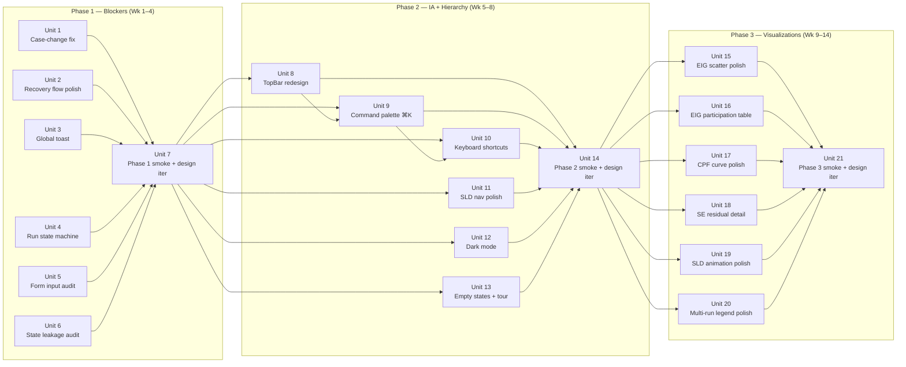

# feat: v2.0 UX polish + iteration

## Overview

v2.0 substantive wiring shipped (37 endpoints, all major analysis routines reachable, +595 tests). User attempts to *use* the tool surface real workflow blockers, IA crowding, and visualization gaps that prevent it from feeling like a modern research tool. This plan refines and polishes across three phases — blockers, IA, visualizations — each phase ending with a Playwright smoke + design-iterator loop.

The bar: a researcher opens the tool fresh, picks a case, and produces a publishable artefact (EIG analysis with CSV export, or sweep nose curve, or bundle round-trip) without hitting a single "I don't know what to click" moment.

## Problem Frame

v2.0 is functionally complete but UX is thin in three categorically different ways:

**1. Workflow blockers (the "this tool is broken" moments)** — surfaced directly in the 3 Playwright smokes this session:
- Case-change → Load doesn't fire `POST /api/sessions/{id}/case`. Substrate keeps prior case; user thinks they switched.
- "Connecting…" badge gets stuck on session-recovery edge cases with no recovery affordance.
- Run buttons get disabled with no hint why (EIG mutated dae state → PF disabled silently).
- Form inputs have keyboard-input quirks (DOM `.value` setter doesn't propagate; React-friendly setter required even for paste).
- State leakage: typing in form inputs accidentally triggers other fields (bus filter contamination during snapshot save).
- Error surfaces are inline-only; some actions look unresponsive when the failure is actually invisible without scrolling.

**2. Information architecture (the "this looks dated" moments):**
- TopBar has 15+ controls flat (Add element, Add PMU, Import profile, Save, Undo, Reload, Run PF, PF/TDS toggle, Labels, Hide, Snapshots, Report, Export bundle, Sweep, History) — no grouping, no command palette, no keyboard surface.
- Right dock has 4 tabs but Analyze tab nests 5 sub-modes (PF/TDS/EIG/CPF/SE) — second-tier navigation isn't discoverable.
- SLD has no minimap, no node search, no zoom-to-fit on large cases (NPCC 140-bus is unusable).
- No dark mode (Tailwind tokens support it; just not wired).
- No keyboard shortcuts; no cheatsheet.
- Empty states are bare ("No case loaded") with no CTA; first-run is silent.

**3. Visualizations (the "this isn't differentiated" moments):**
- EIG scatter is static SVG — no zoom/pan, no hover tooltips, no log-scale toggle.
- EIG participation table is unsorted, capped at top 200 with no filter UI.
- CPF curve has only a nose marker; no lambda slider for what-if exploration.
- SE residual chart is a basic histogram with no per-residual detail panel.
- SLD animation: bus voltages step (no easing); line-flow direction is constant (no arrow animation).
- Multi-run overlay legend chips are color hashes; no swatch picker, no per-run rename.

The 3 dimensions interact: fixing IA without fixing blockers means users still abandon at the first 401-on-load. Polishing visualizations without IA means the polished charts still live in a crowded surface. Hence the phased ordering — blockers first, IA second, viz third.

## Requirements Trace

- **R1.** Eliminate the documented workflow blockers from Phase 1/2/3 smoke docs (case-change, Connecting… loop, disabled-button silence, form input quirks, state leakage, error surface)
- **R2.** TopBar IA scales gracefully past 15 controls via grouped menus + command palette (⌘K) + keyboard shortcuts
- **R3.** Empty states + first-run tour reduce time-to-first-result for a new user from "indeterminate" to "<2 minutes"
- **R4.** SLD navigation works on cases up to 300 buses (minimap + search + zoom-to-fit). **Tested on NPCC 140-bus**; 300-bus is design-aspirational, not a verified test scenario.
- **R5.** Dark mode toggle wired through Tailwind v4 tokens
- **R6.** Charts (EIG scatter, CPF curve, SE residuals, SLD animation, multi-run overlay) gain interactive affordances expected of modern analysis tools (zoom, pan, hover, click-detail, animation easing)
- **R7.** Each phase ends with Playwright smoke + design-iterator pass; visual diffs reviewed before merge
- **R8.** No regressions to v2.0's 1447 tests. Net delta target: +150–+200 new tests across the 3 phases (Phase 1 ≈ +50, Phase 2 ≈ +60, Phase 3 ≈ +50). Volume is a coverage observation, not a quality target — the binding quality signal is per-phase Playwright smoke + design-iterator output.

## Scope Boundaries

- **Not** rebuilding the design system from scratch — we extend existing Tailwind v4 + Radix primitives
- **Not** replacing uPlot or React Flow — we add affordances on top
- **Not** rewriting the substrate — UI work only, except surgical substrate touches needed to fix the case-change bug
- **Not** building a mobile/responsive layout (desktop research tool; out of scope per v1.0 brainstorm)
- **Not** AI/agent chat surface (still out of scope per v1.0 brainstorm)
- **Not** WCAG AA certification — spirit-only per v1.0's R20; we improve keyboard nav + focus states + ARIA labels but don't audit formally
- **Not** new analysis routines (substrate scope frozen at v2.0; only UI/UX work)

### Deferred to Separate Tasks

- **Multi-user collab** — out of scope per v1.0 brainstorm; not v2.0 polish
- **Hosted SaaS UX** — separate plan
- **WebGL / 3-D SLD** — explicitly deferred in v2.0 plan non-goals
- **Sub-cycle PMU live streaming** — deferred to v2.5 per v2.0 plan

## Context & Research

### Relevant Code and Patterns

- TopBar: `web/src/components/shell/TopBar.tsx` (currently flat, 15+ direct buttons mounted)
- Right dock: `web/src/components/shell/PanelPickerTabs.tsx`, `RightDock.tsx`, `AppShell.tsx`
- Form inputs that have keyboard quirks: `web/src/components/disturbance/FaultSpecForm.tsx` (BusIdxSelect), `web/src/components/snapshot/SaveSnapshotDialog.tsx`, `web/src/components/auth/TokenPasteModal.tsx`
- Run button state: `web/src/components/pflow/RunButton.tsx`, `web/src/components/tds/RunButton.tsx`
- Recovery flow: `web/src/api/queries.ts` `handleGlobalRecoveryError`, `web/src/store/session.ts`, `web/src/components/shell/RecoveryBadge.tsx`
- SLD: `web/src/components/sld/SldCanvas.tsx`, `web/src/components/sld/nodes/`, `web/src/components/sld/graph.ts`
- Charts: `web/src/components/plots/UPlot.tsx`, `web/src/components/plots/TimeSeriesPlot.tsx`, `web/src/components/plots/ScrubControl.tsx`, `web/src/components/analyze/EIGScatter.tsx`, `EIGParticipationTable.tsx`, `EIGDampingChart.tsx`, `CPFCurveChart.tsx`, `SEResidualChart.tsx`
- Design tokens: `web/src/styles/tokens.css`, `web/tailwind.config.ts`, Tailwind v4 `@theme` block
- Existing component library: `web/src/components/ui/` (Radix wrappers — Button, Input, Dialog, etc.)

### Institutional Learnings

- `docs/spikes/2026-05-09-v2-phase1-playwright-smoke.md` — Issue 1 (EIG→PF NaN, fixed); Issue 2 (case-change broken, NOT fixed); Issue 3 (React duplicate keys on kundur, NOT fixed)
- `docs/spikes/2026-05-09-v2-phase2-playwright-smoke.md` — React-friendly setter required for snapshot name input; suggests broader form-input audit needed
- `docs/spikes/2026-05-09-v2-phase3-playwright-smoke.md` — radio button (sub-mode picker) requires Playwright `.click()` not DOM `.click()` — the v0.1 form pattern is fragile under automation
- `docs/spikes/2026-05-09-andes-routine-surface-spike.md` — EIG side-effect on TDS state surfaces UX issue documented in Unit 6
- `feedback_collab_style.md` (memory) — user values comprehensive scope + adversarial review + visible iteration progress

### External References

- [uPlot](https://github.com/leeoniya/uPlot) — already in deps; supports cursor sync, hover plugins, zoom-on-scroll plugin (not yet wired)
- [React Flow / xyflow](https://reactflow.dev) — already in deps; has built-in MiniMap component (not yet wired)
- [cmdk](https://cmdk.paco.me) — Radix-flavored command palette primitive; recommended for ⌘K
- [Lucide icons](https://lucide.dev) — **NEW dep** `lucide-react` (NOT a transitive dep of any installed package — verified at planning time; v1 of this plan was wrong)
- Modern reference points for "feels right": Linear (cmdk + keyboard), Notion (slash command), Figma (right-click context menus + cmdk), Vercel dashboard (empty states + onboarding tour)

## Key Technical Decisions

**KTD-1: Three sequential phases, each gated by a Playwright smoke + design-iterator pass.** Phase ordering is blockers → IA → viz because each layer depends on the previous (no point polishing charts in a crowded UI users can't navigate; no point on IA in a tool that hangs on first load).

**KTD-2: Don't replace the existing design system.** Extend Tailwind v4 `@theme` tokens for dark-mode + a small set of motion primitives (durations, easings). Reuse Radix primitives + Lucide icons. The "modern feel" comes from interaction polish, not aesthetic replacement.

**KTD-3: Use `cmdk` for the command palette (⌘K).** Tiny dep (~6KB), Radix-aligned, well-maintained. **Considered & rejected:** `kbar` (heavier, less Radix-aligned), hand-roll (would re-implement accessible focus trap + keyboard nav + fuzzy match — ~400 LOC). Bind to ⌘K (mac) / Ctrl+K (Linux/Win). **Also adds a new dep:** `@radix-ui/react-dropdown-menu` (NOT currently in package.json — verified at planning time; Unit 8's menus need it).

**KTD-4: SLD MiniMap is ALREADY mounted.** Verified at `web/src/components/sld/SldCanvas.tsx:585` — `<MiniMap pannable zoomable />` is rendered today. `<Controls />` provides zoom-to-fit (line 584, `fitView` prop already true). **Unit 11 scope reduces to: (a) node search popover, (b) inspector ↔ canvas selection sync, (c) MiniMap polish (color, viewport rectangle contrast in dark mode).** No "add MiniMap" work needed.

**KTD-5: Adopt `sonner` for the global toast system.** Primary justification (verified at planning time): existing codebase has 9 separate hand-rolled toast/inline-alert patterns across `pflow/RunButton.tsx`, `tds/RunButton.tsx`, `HistoryDrawer`, `ExportMenu`, `LatexCopyButton`, `ReportDialog`, `LoadSnapshotDialog`, `RunLegendChip`, `SldCanvas`. Sonner consolidates these. **Considered & rejected:** Radix Toast primitive (would also work but requires more Provider boilerplate; sonner has smaller per-callsite API). Mount once at AppShell root; use everywhere via hook.

**KTD-6: Form-input audit ships as Unit 5 (Phase 1).** Audit every controlled input against React-friendly setter behavior + keyboard navigation + focus management. Document the pattern in `web/AGENTS.md` (or create) so future inputs are correct by default.

**KTD-7: Run-button state machine externalised.** Each Run button (PF, TDS, EIG, CPF, SE, Sweep) currently computes its own disabled state inline. Extract to `useRunReadiness(routine)` hook returning `{ ready: bool, disabledReason: string | null, recoveryHint: ReactNode | null }`. Tooltips + recovery CTAs become uniform.

**KTD-8: First-run tour uses static React component, not a tour library.** Three-step inline coach (case → run → analyze) shown when `localStorage.getItem('andes-app:first-run') !== 'done'`. No tour library dep; coach state lives in `web/src/store/firstRun.ts`.

**KTD-9: Keyboard shortcuts via `react-hotkeys-hook`** — **NEW dep** (verified absent from package.json at planning time; the v1 of this plan claimed it was already-in-deps, which is wrong). Registered centrally, surfaced via cheatsheet modal opened with `?` (or via cmdk command "Show keyboard shortcuts"). React 19 peer-dep compat verified before adoption.

**KTD-10: Dark mode via the existing `.dark` class on `<html>` + `prefers-color-scheme` initial detection.** Existing `web/src/styles/tokens.css` line 17 already defines `@custom-variant dark (&:where(.dark, .dark *))` — class-based, not attribute-based. The v1 of this plan said `data-theme`; corrected to match in-tree mechanism. Toggle persisted in `localStorage`. **Token extension:** existing tokens.css has 8 semantic tokens (background, foreground, muted, muted-foreground, border, input, primary, primary-foreground); Phase 2 adds `popover`, `popover-foreground`, `card`, `card-foreground`, `dropdown-item-hover` for Radix popover/dropdown surfaces (Unit 12 scope).

**KTD-11: Each phase ends with a `compound-engineering:design:ce-design-iterator` subagent run.** Iterative N-cycle screenshot → analyze → improve loop. Phase 1 = 2 cycles (focus on plumbing); Phase 2 = 4 cycles (IA shifts have more visual surface); Phase 3 = 4 cycles (chart polish is iterative). Total ~10 design-iterator runs across the plan.

**KTD-12: SLD performance budget** — minimap + node search must stay <16ms render on NPCC 140-bus. If perf regresses, pagination/virtualization for the search list.

**KTD-13: Reconciliation with v2.0 plan KTD-14 (UX-modernity = constraint, not wedge).** This polish plan does NOT relitigate KTD-14. The wedge stays "complete ANDES coverage with publication-grade reproducibility" (per v2.0 KTD-14). Polish work makes the wedge usable; it doesn't re-position UX-modernity as the wedge. Plan-level discipline: success metrics measure publishing-workflow friction (Unit 1, 4, 11, 16, 20 deliverables), not aesthetic polish (Units 12, 13, 19, 20 swatch).

**KTD-14: Funding & community timeline relationship.** v2.0 plan committed JOSS submission at v1.5 release tag and NSF POSE LOI at Wk 22-24. **Open Question deferred to user:** does this polish plan execute (a) **before** JOSS submission (delays JOSS by 14 weeks), (b) **in parallel** with JOSS draft + community track (workload doubling), or (c) **after** JOSS acceptance (~Wk 12-16 of v2.0 plan)? The plan author's working assumption is (c) — JOSS submitted at end of v2.0 plan substantive wiring; polish runs Wk 1-14 post-JOSS while review is in flight. **This assumption needs explicit user confirmation before Phase 1 starts.**

## Open Questions

### Resolved During Planning

- **What's the topbar grouping?** → Group into 4 menus: **Run** (PF / TDS / EIG / CPF / SE / Sweep), **Edit** (Add element / Add PMU / Import profile / Undo / Reload), **Export** (Snapshots / Report / Export bundle / Import bundle), **Workspace** (Save / Labels Hide / Dark mode toggle). History stays separate (right-side drawer trigger). Run-mode toggle (PF / TDS) folds into Run menu's first item.
- **Toast lib?** → `sonner` (KTD-5)
- **Command palette lib?** → `cmdk` (KTD-3)
- **Keyboard shortcut bindings?** → ⌘K = command palette; ? = cheatsheet; ⌘Enter = Run (context-aware); g then s = goto Snapshots; g then h = goto History; ⌘D = dark mode toggle; ⌘/ = focus filter input on results table. Full list resolved in Unit 9.
- **Dark mode transition?** → instant swap (no CSS transition on theme switch — avoids flash). 200ms easing for hover/focus states.
- **Tour version-stamping?** → `localStorage.getItem('andes-app:first-run-v')` so we can re-show on major re-designs.

### Deferred to Implementation

- **Per-chart hover tooltip content** — depends on what each chart's data shape supports; resolved when wiring uPlot hover plugin per-chart
- **Cmdk action set scope** — start with the 20 most-used actions; expand based on usage telemetry (which doesn't exist yet — interim approach: include every topbar/menu action + every panel switch)
- **MiniMap placement on SLD** — bottom-right is conventional; verify against React Flow's default; allow user to dismiss via cmdk command
- **First-run tour copy** — write per-step at implementation time; depends on what changes in Phase 1 + 2
- **Run-button-in-menu × first-run coach interaction** — after Unit 8, Run PF lives inside the Run menu. Unit 13 coach says "click Run PF". Two paths: (a) coach targets the center-topbar Run button (context-aware to active routine), (b) coach handles two-step menu-open-then-click. Pick at Unit 13 implementation start.
- **EIG scatter zoom architecture** (Unit 15) — three options: hand-roll matrix transforms, add `d3-zoom` dep, or migrate to a charting lib (Visx / Plot). 1-day spike at Unit 15 start before committing.
- **react-window for participation table** (Unit 16) — current table renders <50ms on NPCC 140-bus per the existing component's footer comment. Verify perf budget before adding the dep; consider conditional-render-via-overflow as alternative.
- **Empty-state CTAs vs first-run tour ROI** — Unit 13 bundles both. Implementation should ship empty-states first, time TTFR, then decide whether the coach is needed (per doc-review reviewer pushback that Linear/Vercel modern tools don't ship intrusive tours).

## High-Level Technical Design

> *This illustrates the intended approach and is directional guidance for review, not implementation specification. The implementing agent should treat it as context, not code to reproduce.*

### Phase ordering and dependencies



### Run-button state machine (KTD-7)

```
useRunReadiness(routine: 'pflow' | 'tds' | 'eig' | 'cpf' | 'se' | 'sweep') -> {
  ready: boolean
  disabledReason: string | null    // "PF must run first" | "EIG mutated dae; reload to re-run PF" | …
  recoveryHint: ReactNode | null   // <Button onClick={reload}>Reload case</Button> | null
}
```

Each Run button consumes the hook; tooltips + inline recovery CTAs become uniform across the app.

### Topbar grouping (KTD resolved)

```
[Workspace ▾]  [Edit ▾]  [Run ▾]                         [Export ▾]  [Labels Hide]  [⌘K]
                          ⏵ Active routine + Run button             [☀/🌙]
```

History drawer trigger stays as a separate icon button on the right edge.

## Implementation Units

### Phase 1 — Blockers (Wk 1–4) [non-overlapping with Phase 2]

- [ ] **Unit 1: Case-change flow fix**

**Goal:** Selecting a different case file in the left rail and clicking Load actually fires `POST /api/sessions/{id}/case` and swaps the substrate's loaded case. Currently broken (Phase 1 smoke Issue 2).

**Requirements:** R1

**Dependencies:** None.

**Files:**
- Modify: `web/src/components/case/WorkspaceFilePicker.tsx` (or wherever Change case → Load lives)
- Modify: `web/src/store/case.ts` — clear `caseSelection` AND `loadedCase` on change-case; trigger fresh `POST /case` on Load
- Modify: `web/src/api/queries.ts` `useLoadCase` — verify it doesn't short-circuit on "same session id"
- Test: `web/tests/unit/components/case/WorkspaceFilePicker.test.tsx` extend with change-case scenario
- Test: `web/tests/e2e/case-change.spec.ts` (NEW) — Playwright e2e: load A → change to B → assert substrate sees B

**Approach:**
- Source-grounded diagnosis (verified by doc-review reading actual code at `web/src/components/case/{CaseNav,WorkspaceFilePicker}.tsx`): the picker's `onLoad` already calls `loadCase.mutate` unconditionally, AND `case.ts` `setCase` already clears topology/sidecar/selection. So the v1 plan's "store retains state" diagnosis is wrong. Most-likely actual cause: race between `CaseNav`'s `useCreateSession` and the picker's `useEnsureSession` instance after the change-case DELETE → CREATE cycle. Either or both consumers may race the second create, with the picker rendering against a stale `sessionId` and silently swallowing the Load click.
- Required investigation (Phase 1 spike, ~1 day): instrument both consumers with a session-id lifecycle log; reproduce the bug; identify which consumer wins.
- Fix path A (likely): single source of truth for session creation — only `CaseNav` calls `useCreateSession`; the picker reads `sessionId` from the store and never creates.
- Fix path B (fallback): explicit Promise sequencing — picker awaits `useEnsureSession` resolution before enabling the Load button.
- Also handle the case where the substrate session is stale (404 on /case POST) — surface as toast "Session expired; reloading…" + auto-create new session.

**Patterns to follow:**
- Existing `useLoadCase` mutation pattern in `web/src/api/queries.ts`

**Test scenarios:**
- Happy path: load IEEE 14, click Change case, pick kundur, click Load → substrate's `/topology` returns kundur's 10 buses
- Edge: substrate session expired between picks → POST /case 404 → auto-recover + retry
- Edge: pick same file as currently loaded → no-op (no spurious mutation)
- Integration: case change clears runs slice, snapshot list reset, disturbance log cleared (per existing case-change cascade in `store/index.ts`)

**Verification:** Phase 1 smoke can complete the IEEE 14 → kundur → IEEE 39 round-trip in a single browser session without page reload.

---

- [ ] **Unit 2: Recovery flow polish**

**Goal:** "Connecting…" badge state has a finite lifecycle with clear recovery affordances. Stuck states never block the UI silently.

**Requirements:** R1

**Dependencies:** None.

**Files:**
- Modify: `web/src/components/shell/RecoveryBadge.tsx`
- Modify: `web/src/store/session.ts` — add `recoveryStuckSince: number | null` timestamp; auto-detect "stuck" after 10s
- Modify: `web/src/api/queries.ts` `handleGlobalRecoveryError` — emit recovery state transitions to a logger
- Test: `web/tests/unit/store/session.test.ts` extend
- Test: `web/tests/unit/components/shell/RecoveryBadge.test.tsx` (NEW)

**Approach:**
- State machine: `idle` → `connecting` → (`live` | `failed`). Add `failed` state with timeout (10s no progress → stuck).
- Stuck state shows: "Cannot reach substrate. Reload page" + Reload button.
- Add explicit "Reset session" cmdk action that clears sessionStorage + reloads.

**Patterns to follow:**
- Existing recovery cascade in `web/src/store/index.ts`

**Test scenarios:**
- Happy path: substrate restart triggers reconnect within 5s; badge briefly shows `connecting`, then `live`
- Edge: substrate down for 30s → badge transitions to `failed` after 10s with Reload CTA visible
- Edge: token expired → badge shows `failed` with "Re-paste token" CTA opening token modal
- Error: network completely offline → `failed` after 10s; user clicks Reload → graceful

**Verification:** Smoke can recover from substrate restart without manual sessionStorage clear.

---

- [ ] **Unit 3: Global toast system (sonner)**

**Goal:** Centralised toast surface for success / error / warning / info notifications. Replace inline-only error surfaces.

**Requirements:** R1

**Dependencies:** None.

**Files:**
- Add dep: `sonner` in `web/package.json`
- Create: `web/src/components/ui/Toaster.tsx` — sonner provider mount + theme bridge
- Create: `web/src/lib/toast.ts` — typed wrapper around sonner: `toast.success(msg, opts)`, `toast.error(msg, opts)`, etc.
- Modify: `web/src/components/shell/AppShell.tsx` — mount `<Toaster />` once
- Modify: across the codebase — replace local `[role="alert"]` inline-error patterns with `toast.error(...)` calls where appropriate (NOT for form-validation alerts, which stay inline)
- Test: `web/tests/unit/lib/toast.test.ts` (NEW)
- Test: integration tests update mocks for toast emission where they previously asserted inline alerts

**Approach:**
- Decide policy: form-validation = inline; transient action results (export complete, snapshot saved, sweep cancelled) = toast; recovery state transitions = toast.
- Add `data-testid="toast-{id}"` for Playwright assertions.
- Document the policy in `web/AGENTS.md`.

**Patterns to follow:**
- `sonner` docs; mount via Provider at AppShell root

**Test scenarios:**
- Happy path: bundle export click → "Bundle saved as andes-bundle-xxx.zip" toast appears, auto-dismisses after 4s
- Edge: 5 toasts in rapid succession → stack with newest on top
- Error: network error during snapshot save → "Snapshot save failed: <detail>" toast with Retry button
- Integration: toast survives unmount of the originating component (sonner is global)

**Verification:** A user closing a successful export dialog sees confirmation; an error during a background mutation surfaces as toast (not just console).

---

- [ ] **Unit 4: Run-button state machine + disabled-reason tooltips**

**Goal:** Every Run button (PF, TDS, EIG, CPF, SE, Sweep) shows a tooltip + inline recovery CTA when disabled. No more silent grey buttons.

**Requirements:** R1, KTD-7

**Dependencies:** None (parallel with Units 1–3).

**Files:**
- Create: `web/src/lib/useRunReadiness.ts` — hook returning `{ ready, disabledReason, recoveryHint }` for a given routine
- Modify: `web/src/components/pflow/RunButton.tsx`, `web/src/components/tds/RunButton.tsx`, `web/src/components/analyze/AnalyzePanel.tsx` (Run EIG/CPF/SE buttons), `web/src/components/sweep/SweepDialog.tsx` — consume the hook
- Add: Radix Tooltip wrapper for disabled buttons (Tooltip activates on hover even when button is disabled — needs `pointer-events-none` workaround per Radix docs)
- Modify: `web/src/components/ui/Button.tsx` (or create a `RunButton` variant) to standardise the disabled-with-tooltip pattern
- Test: `web/tests/unit/lib/useRunReadiness.test.ts` (NEW)
- Test: extend each Run button test with disabled-reason scenarios

**Approach:**
- Hook reads from existing stores (case, pflow, runs, analyze, etc.) and computes the disabled state with reasons.
- Reasons map: "PF must run first" / "EIG mutated dae; reload case to re-run PF" / "Sweep in progress" / "No case loaded" / "Case is dirty; commit edits first".
- Each disabled button shows tooltip on hover. If a recovery action exists (e.g., reload case), show inline below the button.

**Patterns to follow:**
- Existing inline disabled logic in each Run button — extract into the hook
- Radix Tooltip primitive (already in deps)

**Test scenarios:**
- Happy path: PF converged → Run EIG enabled, tooltip absent
- Edge: pre-PF → Run EIG disabled, tooltip "Run PFlow first; EIG requires a converged operating point"
- Edge: post-EIG dae mutation → Run PF disabled, tooltip "EIG initialised the dynamic state; reload case to re-run PF" + inline Reload button
- Edge: Sweep in progress → all other Run buttons disabled, tooltip "Sweep <id> in progress; wait or abort"
- Integration: 6 Run buttons all consume the same hook; behavior identical

**Verification:** Hovering any disabled Run button shows the reason; clicking the recovery action where present resolves the disabled state.

---

- [ ] **Unit 5: Form input audit + React-friendly contract**

**Goal:** Every controlled `<input>` / `<select>` / `<textarea>` in the app accepts paste-from-clipboard, IME composition, and programmatic value sets correctly. Document the contract so future inputs are correct by default.

**Requirements:** R1, KTD-6

**Dependencies:** None.

**Files:**
- Audit: `web/src/components/auth/TokenPasteModal.tsx`, `web/src/components/disturbance/FaultSpecForm.tsx`, `web/src/components/disturbance/AlterSpecForm.tsx`, `web/src/components/disturbance/ToggleSpecForm.tsx`, `web/src/components/snapshot/SaveSnapshotDialog.tsx`, `web/src/components/profiles/ProfileImportDialog.tsx`, `web/src/components/pmu/PmuPlacementDialog.tsx`, `web/src/components/sweep/SweepDialog.tsx`, `web/src/components/inspector/ResultsTable.tsx` (filter input), `web/src/components/elements/AddElementPanel.tsx`
- Create: `web/src/components/ui/Input.tsx` (or extend existing) — canonical controlled-input pattern with proper onChange + onCompositionStart/End handling
- Create: `web/AGENTS.md` (NEW) — document the form-input contract + testing pattern
- Test: extend each form's tests with paste-from-clipboard + IME scenarios
- Test: `web/tests/unit/components/ui/Input.test.tsx` (NEW)

**Approach:**
- Identify the root cause of the React-friendly setter requirement: probably some inputs don't have `onChange={e => setValue(e.target.value)}` correctly bound, OR they use `defaultValue` instead of `value`.
- Fix each input to use the canonical pattern: `value={state}` + `onChange={e => setState(e.target.value)}`.
- For inputs that need formatting/parsing on commit (e.g., numeric inputs), use a separate `onBlur` handler.
- IME composition: wrap onChange to defer state update during composition.

**Patterns to follow:**
- React's [controlled component](https://react.dev/reference/react-dom/components/input#controlling-an-input-with-a-state-variable) docs

**Test scenarios:**
- Happy path: each form input accepts typed text and updates state on each keystroke
- Edge: paste-from-clipboard updates state immediately
- Edge: IME composition (Japanese / Chinese / Korean input) doesn't fire onChange mid-composition
- Edge: programmatic `el.value = 'x'; el.dispatchEvent(new Event('input', {bubbles: true}))` propagates to React state (the React-friendly setter test from Phase 2 smoke should pass without using the prototype-descriptor hack)
- Error: pattern-validation inputs (snapshot name regex) reject invalid input with inline error

**Verification:** Phase 2 smoke's "React-friendly value setter required" finding becomes obsolete — DOM `.value = 'x'` works.

---

- [ ] **Unit 6: State leakage audit**

**Goal:** Form inputs in modals don't accidentally fire other handlers (e.g., bus filter contamination during snapshot save). Each interactive surface has explicit input scoping.

**Requirements:** R1

**Dependencies:** None.

**Files:**
- Audit: every dialog with a text input (`SaveSnapshotDialog`, `LoadSnapshotDialog`, `BundleExportDialog`, `BundleImportDialog`, `PmuPlacementDialog`, `ProfileImportDialog`, `SweepDialog`, `AddEventDialog`, `TokenPasteModal`)
- Audit: keyboard event handlers — find any window-level listeners that don't check for active text input (e.g., `?` shortcut firing inside the snapshot name input)
- Modify: `web/src/lib/useHotkeys.ts` (NEW or extend if exists) — central hotkey registrar that auto-skips when target is an editable element
- Test: `web/tests/unit/components/snapshot/SaveSnapshotDialog.test.tsx` extend with keyboard interaction scenarios
- Test: `web/tests/e2e/state-leakage.spec.ts` (NEW)

**Approach:**
- Catalog all `addEventListener` calls and global key handlers
- Wrap each in a "skip if active element is editable" guard
- Audit Radix Dialog open behavior — should set focus trap and ignore outer-scope hotkeys

**Patterns to follow:**
- `react-hotkeys-hook` (already in deps) handles editable-element skip by default

**Test scenarios:**
- Happy path: typing in snapshot name input does not trigger bus filter
- Edge: ? key inside a Dialog doesn't open cheatsheet (Dialog focus trap)
- Edge: ⌘K from inside a text input opens command palette (special case — palette shortcut is global)
- Integration: focus trap on Dialog correctly returns focus to opener on close

**Verification:** Smoke tests can type into form inputs without contaminating other state.

---

- [ ] **Unit 7: Phase 1 Playwright smoke + design-iterator pass (2 cycles)**

**Goal:** Verify Phase 1 fixes work end-to-end in a real browser; iterate on visual issues surfaced by the design-iterator subagent.

**Requirements:** R1, R7

**Dependencies:** Units 1–6 complete.

**Files:**
- Create: `docs/spikes/<YYYY-MM-DD>-v2-polish-phase1-smoke.md` (date = Phase 1 completion date)
- Create: `web/tests/e2e/polish-phase1-blockers.spec.ts`

**Approach:**
- Playwright smoke covering the 6 fixed blockers: case-change round-trip, recovery from substrate restart, toast-on-export, disabled-button tooltips, paste-into-name-input, no-state-leakage between dialogs
- Dispatch `compound-engineering:design:ce-design-iterator` for 2 cycles focused on the topbar + dialog visuals (low expectation — Phase 2 does the IA work)

**Test scenarios:**
- All Phase 1 acceptance criteria pass in headless Playwright
- Design-iterator flags polish opportunities (logged in spike doc; not all addressed in this phase — fed into Phase 2 as input)

**Verification:** Smoke doc lists each blocker as ✅; design-iterator output is captured for Phase 2 input.

---

### Phase 2 — IA + Visual Hierarchy (Wk 5–8)

- [ ] **Unit 8: TopBar redesign — grouped menus**

**Goal:** Reduce 15 flat controls to 4 grouped dropdown menus + Run button + History trigger + dark-mode toggle. Topbar feels declarative, not cluttered.

**Requirements:** R2

**Dependencies:** Unit 4 (Run-button state machine — Run menu uses it).

**Files:**
- Refactor: `web/src/components/shell/TopBar.tsx`
- Create: `web/src/components/shell/TopBarMenu.tsx` — generic Radix DropdownMenu wrapper with consistent trigger styling
- Create: 4 menu definitions: `WorkspaceMenu.tsx`, `EditMenu.tsx`, `RunMenu.tsx`, `ExportMenu.tsx`
- Modify: existing top-level button components (`SnapshotMenu`, `BundleExportButton`, `ReportDialogButton`, `SweepDialogButton`, `PmuPlacementButton`, `ProfileImportButton`, `AddElementButton`) — keep as components, mount inside the new menus instead of TopBar root
- Test: `web/tests/unit/components/shell/TopBar.test.tsx` rewrite for grouped layout
- Test: `web/tests/unit/components/shell/RunMenu.test.tsx` (NEW)

**Approach:**
- Layout: `[Workspace ▾] [Edit ▾] [Run ▾] (center: active routine name + Run button) (right: [Export ▾] [Labels Hide] [⌘K] [☀/🌙] [📚 History])`
- Each menu opens via Radix DropdownMenu; items have icons (Lucide) + keyboard shortcuts visible on hover
- Run menu's first item is the active routine; selecting another routine swaps the topbar Run button label

**Patterns to follow:**
- Radix DropdownMenu primitive (already in deps via `@radix-ui/react-dropdown-menu`)
- Lucide icon set

**Test scenarios:**
- Happy path: each menu opens on click; items render with icons + shortcuts
- Edge: keyboard navigation (arrow keys + Enter) within each menu works
- Edge: dropdown closes on Escape, on outside click, on item activation
- Integration: Snapshot menu (Save / Load) still works inside the Workspace menu structure
- Accessibility: each trigger has `aria-haspopup="menu"` + `aria-expanded` per Radix defaults

**Verification:** Topbar visually has ≤8 elements at rest; all v2.0 actions reachable in ≤2 clicks.

---

- [ ] **Unit 9: Command palette (⌘K)**

**Goal:** ⌘K (or Ctrl+K) opens a searchable command palette listing every action in the app. Linear-style.

**Requirements:** R2, KTD-3

**Dependencies:** Unit 8 (menu definitions provide the command source).

**Files:**
- Add dep: `cmdk` in `web/package.json`
- Create: `web/src/components/shell/CommandPalette.tsx` — cmdk-based palette
- Create: `web/src/lib/commands.ts` — registry of `Command { id, label, icon, group, action, when?: () => boolean, keywords?: string[] }`
- Modify: `web/src/components/shell/AppShell.tsx` — mount `<CommandPalette />` + bind ⌘K hotkey
- Modify: each menu definition (`WorkspaceMenu`, etc.) to register its actions in the command registry
- Test: `web/tests/unit/components/shell/CommandPalette.test.tsx` (NEW)
- Test: `web/tests/unit/lib/commands.test.ts` (NEW)

**Approach:**
- Single command registry shared with the topbar menus (DRY — menu items derive from commands).
- Filter by label + keywords; show keyboard shortcut hint per command.
- Group: Workspace / Edit / Run / Export / Navigation / Help.
- "Show keyboard shortcuts" is itself a command.

**Patterns to follow:**
- `cmdk` docs; Vercel/Linear patterns

**Test scenarios:**
- Happy path: ⌘K opens palette; type "snapshot" → "Save snapshot…" + "Load snapshot…" surface
- Edge: command's `when()` returns false → command hidden (e.g., "Run EIG" hidden until PF converged)
- Edge: keyboard navigation (arrow keys, Enter) works inside the palette
- Edge: Escape closes palette
- Integration: command from palette and command from menu execute identical action (single source of truth)

**Verification:** Every topbar menu item is also reachable via ⌘K + label.

---

- [ ] **Unit 10: Keyboard shortcuts + cheatsheet modal**

**Goal:** Power-users can drive the app from the keyboard. ? opens a cheatsheet modal listing all shortcuts.

**Requirements:** R2, KTD-9

**Dependencies:** Unit 9 (commands registry provides shortcut bindings).

**Files:**
- Modify: `web/src/lib/commands.ts` — each command's `shortcut?: string` field consumed by `useHotkeys`
- Create: `web/src/components/shell/ShortcutCheatsheet.tsx` — modal listing all shortcuts grouped
- Create: `web/src/lib/useHotkeys.ts` (or extend) — central hotkey registrar
- Modify: `web/src/components/shell/AppShell.tsx` — mount cheatsheet + bind `?`
- Test: `web/tests/unit/components/shell/ShortcutCheatsheet.test.tsx` (NEW)
- Test: `web/tests/unit/lib/useHotkeys.test.ts` (NEW)

**Approach:**
- Bindings: ⌘K (palette), ? (cheatsheet), ⌘Enter (run active routine), ⌘D (dark mode toggle), g s (goto Snapshots — sequence shortcut), g h (goto History), ⌘/ (focus filter input)
- Cheatsheet groups by command group; each row: label + keys
- Hotkeys auto-skip when active element is editable (Unit 6's pattern)

**Patterns to follow:**
- `react-hotkeys-hook` (already in deps)

**Test scenarios:**
- Happy path: ⌘K opens palette; ? opens cheatsheet
- Edge: shortcuts inside text input don't fire (auto-skip)
- Edge: sequence shortcut "g s" with 1s timeout
- Integration: shortcuts in cheatsheet match command registry exactly (no drift)

**Verification:** Cheatsheet displays ≥10 shortcuts; each one works when invoked.

---

- [ ] **Unit 11: SLD navigation polish — node search + selection sync + minimap polish**

**Goal:** SLD scales gracefully past 30 buses. Node search popover, inspector ↔ canvas selection sync, MiniMap viewport-rectangle contrast (especially in dark mode). **MiniMap and zoom-to-fit (Controls fitView) are ALREADY mounted in `web/src/components/sld/SldCanvas.tsx:584-585` — verified by doc-review at planning time. v1 of this plan was wrong about needing to add them.**

**Requirements:** R4, KTD-4

**Dependencies:** None.

**Files:**
- Modify: `web/src/components/sld/SldCanvas.tsx` — mount React Flow's `<MiniMap />`, add zoom-to-fit button
- Create: `web/src/components/sld/SldNodeSearch.tsx` — searchable popover for bus/element selection
- Modify: `web/src/components/sld/nodes/BusNode.tsx` — highlight on selection from search/inspector
- Modify: `web/src/store/sld.ts` (or extend `ui.ts`) — add `selectedNodeId` state shared with inspector
- Test: `web/tests/unit/components/sld/SldNodeSearch.test.tsx` (NEW)
- Test: `web/tests/unit/components/sld/SldCanvas.test.tsx` extend with minimap + zoom-to-fit assertions

**Approach:**
- **Already done (verify only):** MiniMap mounted at SldCanvas.tsx:585 with `pannable zoomable`; Controls with `fitView` at line 584. Verify viewport rectangle contrast in dark mode (Phase 2 Unit 12 dependency).
- **Node search (NEW):** Popover triggered by `⌘/` or icon button; lists every bus/element; searchable on idx + name (substring); selection pans + zooms to the node (zoom level: keep current zoom, just pan to center the node).
- **Selection sync (NEW):** clicking a row in the inspector results table selects + pans to the SLD node. New `selectedNodeId` shared state.
- **MiniMap polish (NEW):** explicit `nodeColor` prop + viewport-rectangle CSS variable for theme adaptation.

**Patterns to follow:**
- React Flow's MiniMap docs
- Existing `useReactFlow` hook usage

**Test scenarios:**
- Happy path: load NPCC 140-bus → minimap renders all buses; search "BUS_50" pans to it
- Edge: zoom-to-fit on empty case → no-op (no nodes)
- Edge: search with no matches → empty state in popover
- Performance: minimap render <16ms on NPCC 140-bus (per KTD-12)
- Integration: clicking bus row in inspector pans SLD to that bus

**Verification:** NPCC 140-bus is navigable.

---

- [ ] **Unit 12: Dark mode**

**Goal:** Toggle between light + dark themes via `data-theme` on `<html>`. Preference persisted in localStorage; initial value from `prefers-color-scheme`.

**Requirements:** R5, KTD-10

**Dependencies:** None.

**Files:**
- Modify: `web/src/styles/tokens.css` — add `[data-theme="dark"]` overrides for semantic tokens (background, foreground, border, muted, etc.)
- Modify: `web/tailwind.config.ts` — verify `@theme` block uses CSS variables (not hard-coded hex)
- Create: `web/src/store/theme.ts` — Zustand slice for `theme: 'light' | 'dark' | 'system'`; persist to localStorage
- Create: `web/src/lib/useTheme.ts` — hook that applies theme to `document.documentElement[data-theme]`
- Modify: `web/src/components/shell/AppShell.tsx` — apply theme on mount
- Modify: `web/src/components/shell/TopBar.tsx` — dark-mode toggle button (Lucide Sun/Moon icon)
- **Modify (added per doc-review):** `web/src/components/analyze/CPFCurveChart.tsx` — `busColor()` uses hard-coded `hsl(h, 65%, 45%)`; will be illegible on dark background. Convert to lightness-adaptive (e.g. oklch with L=0.65 in dark, L=0.45 in light) or theme-conditional palette.
- **Modify (added per doc-review):** `web/src/components/plots/RunLegendChip.tsx` + `web/src/lib/runIdToColor.ts` — verify hash-based colors render adequately in dark mode; add dark-variant lightness if needed.
- **Modify (added per doc-review):** `web/src/components/plots/TimeSeriesPlot.tsx` — PALETTE const at lines 98-118 is hardcoded oklch JS literals; either move to CSS variables or ship a second dark palette switched by theme.
- Test: `web/tests/unit/store/theme.test.ts` (NEW)
- Test: `web/tests/unit/lib/useTheme.test.ts` (NEW)

**Approach:**
- Three modes: light, dark, system. System mode tracks `prefers-color-scheme` via media query listener.
- Avoid flash of wrong theme: read localStorage in inline `<script>` tag in `index.html` and apply class before React hydrates.
- All chart colours need dark-mode variants (uPlot stroke colors via CSS variables, SLD node colors, scatter dots).

**Patterns to follow:**
- Tailwind v4 `@theme` + CSS custom properties
- next-themes-style API (without the dep)

**Test scenarios:**
- Happy path: toggle ☀/🌙 → `data-theme` swaps; all colors invert
- Edge: system mode tracks OS preference change in real time
- Edge: charts (uPlot, SVG scatter, SLD) all reflect dark mode
- Edge: no flash on initial page load

**Verification:** Visual diff before/after toggle shows complete theme swap; no readability regressions.

---

- [ ] **Unit 13: Empty states + first-run tour**

**Goal:** Every empty state has a clear next-action CTA. New users see a 3-step coach (case → run → analyze) on first load.

**Requirements:** R3, KTD-8

**Dependencies:** None.

**Files:**
- Audit: every component with an empty-state branch (no case loaded, no PF result, no EIG result, no runs, no snapshots, no disturbances, no history, no PMUs, no profiles)
- Create: `web/src/components/ui/EmptyState.tsx` — canonical empty-state component with title + description + CTA + icon
- Create: `web/src/components/shell/FirstRunCoach.tsx` — 3-step inline coach
- Create: `web/src/store/firstRun.ts` — coach state + dismissal
- Modify: each component with an empty state to use `<EmptyState />`
- Test: `web/tests/unit/components/shell/FirstRunCoach.test.tsx` (NEW)
- Test: `web/tests/unit/components/ui/EmptyState.test.tsx` (NEW)

**Approach:**
- Coach steps: (1) "Pick a case from the left rail" (highlights left rail), (2) "Click Run PF to compute the operating point" (highlights Run button), (3) "Switch to Analyze to explore EIG, CPF, SE" (highlights Analyze tab). Dismissable; never re-shown unless `localStorage.getItem('andes-app:first-run-v')` mismatches.
- Empty states: "No PF result. Run PF to populate the inspector." + Run PF button. "No snapshots saved yet. Save the current state with ⌘S or via the Workspace menu." Etc.

**Patterns to follow:**
- Vercel dashboard empty-state pattern; Linear's onboarding

**Test scenarios:**
- Happy path: first-run → coach appears step 1; click "Got it" → step 2; complete → coach dismissed forever
- Edge: dismiss mid-coach → never re-shown
- Edge: localStorage cleared → coach re-appears
- Integration: coach highlights respond to actual element positions (use intersection observer)
- Integration: every empty-state CTA actually triggers the appropriate action

**Verification:** A user who has never seen the app can produce a PF result without reading docs.

---

- [ ] **Unit 14: Phase 2 Playwright smoke + design-iterator pass (4 cycles)**

**Goal:** Verify Phase 2 IA works; design-iterator iterates on visual polish.

**Requirements:** R7

**Dependencies:** Units 8–13 complete.

**Files:**
- Create: `docs/spikes/<YYYY-MM-DD>-v2-polish-phase2-smoke.md` (date = Phase 2 completion date)
- Create: `web/tests/e2e/polish-phase2-ia.spec.ts`

**Approach:**
- Smoke covers: topbar menus open/close, palette open/close, search, command execution from palette, dark mode toggle round-trip, first-run coach progression, SLD minimap renders, node search finds bus on kundur
- Dispatch `compound-engineering:design:ce-design-iterator` for 4 cycles — focus on visual hierarchy, spacing, typography, dark-mode contrast

**Verification:** Smoke doc + 4-cycle design iteration captured.

---

### Phase 3 — Visualizations (Wk 9–14)

- [ ] **Unit 15: EIG scatter polish — zoom/pan/hover/log-scale**

**Goal:** EIG eigenvalue scatter is interactive: scroll-zoom, click-drag pan, hover tooltips with eigenvalue + damping + frequency, log-scale toggle for the |Re| axis.

**Requirements:** R6

**Dependencies:** None.

**Files:**
- Modify: `web/src/components/analyze/EIGScatter.tsx` — add d3-zoom or hand-rolled pan/zoom on the SVG; hover state + tooltip; log-scale toggle button
- Test: `web/tests/unit/components/analyze/EIGScatter.test.tsx` extend

**Approach:**
- Scroll-to-zoom centered on cursor; click-drag-to-pan; double-click resets view
- Hover: small tooltip near cursor showing `λ = -0.32 + 6.4i, ζ = 5.0%, f = 1.02 Hz`
- Log scale: toggle button switches |Re| axis to log; useful for cases with widely-spread eigenvalues
- Reset zoom button + cmdk command "Reset EIG zoom"

**Test scenarios:**
- Happy path: scroll on scatter → zoom; drag → pan; hover → tooltip
- Edge: zoom to extreme level → still renders; reset returns to initial view
- Edge: log-scale with negative real parts (just damping<0 modes) → handled gracefully
- Integration: zoom state preserved when switching sub-modes and back

**Verification:** Scatter is comfortable to use on NPCC 140-bus's 334 eigenvalues.

---

- [ ] **Unit 16: EIG participation table — sort + filter + virtualization**

**Goal:** Participation table is sortable per column, filterable by state name, virtualized via `react-window` for >50 states.

**Requirements:** R6

**Dependencies:** None.

**Files:**
- Modify: `web/src/components/analyze/EIGParticipationTable.tsx` — add column sort (click header), filter input, virtualization
- Add dep: `react-window` (light, MIT)
- Test: `web/tests/unit/components/analyze/EIGParticipationTable.test.tsx` extend

**Approach:**
- Sort: click column header toggles asc/desc/none; default = |factor| desc
- Filter: text input filters state name; keyboard `⌘/` focuses it
- Virtualization: only when row count > 50; fixed row height for performance

**Test scenarios:**
- Happy path: click column → rows reorder; type "delta" → filtered to delta states only
- Edge: 334-row table on NPCC virtualizes; scroll renders only visible rows
- Edge: filter with no matches → empty state
- Integration: clearing filter restores full sorted view

**Verification:** NPCC 140-bus participation table is responsive.

---

- [ ] **Unit 17: CPF curve polish — annotations + lambda slider**

**Goal:** CPF curve has nose annotation, lambda slider for what-if exploration, per-bus highlight on hover.

**Requirements:** R6

**Dependencies:** None.

**Files:**
- Modify: `web/src/components/analyze/CPFCurveChart.tsx` — add lambda scrubber slider; on-curve annotations; per-bus hover highlight
- Test: `web/tests/unit/components/analyze/CPFCurveChart.test.tsx` extend

**Approach:**
- Slider below chart: drag to a lambda value → vertical line on chart + readout shows V at each bus for that lambda
- Annotations: nose marker has label "Nose: λ=0.61, V_min=0.78"; if `truncated`, "Truncated at λ_max=0.55 (no nose found)"
- Hover bus line: highlights that bus in the legend + table

**Test scenarios:**
- Happy path: drag slider → vertical line moves; readout updates
- Edge: slider past nose → V values reflect post-nose branch
- Edge: truncated CPF → slider goes only to last computed lambda
- Integration: hovering a bus line in chart highlights matching legend entry

**Verification:** A researcher can identify the voltage-collapse margin per bus interactively.

---

- [ ] **Unit 18: SE residual chart — flag detail panel**

**Goal:** Click a flagged residual bar → side panel shows the measurement source (bus, type, value, expected, residual, flag reason).

**Requirements:** R6

**Dependencies:** None.

**Files:**
- Modify: `web/src/components/analyze/SEResidualChart.tsx` — add click handler on bars; render side panel
- Test: `web/tests/unit/components/analyze/SEResidualChart.test.tsx` extend

**Approach:**
- Bars have `data-testid="se-residual-bar-{idx}"`; click selects
- Side panel (collapsible) shows: measurement type (V / P / Q injection / branch flow), bus idx, measured value, estimated value, residual, flag reason ("≥3σ from estimate")

**Test scenarios:**
- Happy path: click flagged bar → side panel populates with measurement details
- Edge: click non-flagged bar → side panel shows details + "Within tolerance" status
- Integration: re-running SE updates the chart + clears any open detail panel

**Verification:** A state-estimation researcher can identify and inspect anomalous measurements.

---

- [ ] **Unit 19: SLD animation polish — easing + line-flow arrows**

**Goal:** Bus voltage colour transitions ease (cubic-out, 200ms); line flow direction arrows animate when flow changes sign.

**Requirements:** R6

**Dependencies:** None.

**Files:**
- Modify: `web/src/components/sld/nodes/BusNode.tsx` — CSS transition on background color
- Modify: `web/src/components/sld/edges/LineEdge.tsx` (or wherever line flow is rendered) — direction arrow + animation on sign-flip
- Test: `web/tests/unit/components/sld/BusNode.test.tsx` extend
- Test: `web/tests/unit/components/sld/LineEdge.test.tsx` (NEW or extend)

**Approach:**
- Voltage colour: CSS `transition: background-color 200ms cubic-bezier(0.4, 0, 0.2, 1)`
- Line flow: arrow rotates 180° on sign-flip with same easing; arrow size scales with flow magnitude
- Respects `prefers-reduced-motion` (no animation if user prefers)

**Test scenarios:**
- Happy path: voltage updates trigger smooth color transition (visually verified via design-iterator)
- Edge: prefers-reduced-motion → instant updates
- Edge: rapid TDS streaming (60Hz frames) → animations don't pile up (use `requestAnimationFrame` debounce)

**Verification:** Animation feels smooth, not jarring, on 60Hz TDS playback.

---

- [ ] **Unit 20: Multi-run overlay legend polish — swatch picker + per-run rename**

**Goal:** Each run in the multi-run overlay has an editable name + a swatch picker (override the hash color). Legend chips support keyboard nav.

**Requirements:** R6

**Dependencies:** None.

**Files:**
- Modify: `web/src/components/plots/RunLegendChip.tsx` — click swatch opens color picker; double-click name → rename input
- Modify: `web/src/store/runs.ts` — add `displayName?: string`, `colorOverride?: string` per run
- Modify: `web/src/lib/runIdToColor.ts` — respect `colorOverride` when present
- Test: `web/tests/unit/components/plots/RunLegendChip.test.tsx` extend

**Approach:**
- Swatch picker: 8-color palette + custom hex input
- Rename: double-click name, edit inline, Enter to commit / Escape to cancel
- Color overrides persist within session (no need for localStorage)

**Test scenarios:**
- Happy path: double-click run name → input → type → Enter → name persists
- Happy path: click swatch → picker opens → select → color updates everywhere
- Edge: clear color override → falls back to hash color
- Integration: legend chip color matches the line color in TimeSeriesPlot

**Verification:** Researcher can label runs meaningfully (e.g., "Fault @ tc=0.1" / "Fault @ tc=0.2") for paper figures.

---

- [ ] **Unit 21: Phase 3 Playwright smoke + design-iterator pass (4 cycles)**

**Goal:** Verify Phase 3 visualizations work; design-iterator iterates on chart polish.

**Requirements:** R7

**Dependencies:** Units 15–20 complete.

**Files:**
- Create: `docs/spikes/<YYYY-MM-DD>-v2-polish-phase3-smoke.md` (date = Phase 3 completion date)
- Create: `web/tests/e2e/polish-phase3-viz.spec.ts`

**Approach:**
- Smoke covers: EIG scatter zoom/hover, participation table sort+filter+virtualization on NPCC, CPF lambda slider, SE residual click→detail, SLD animation easing, multi-run rename + recolor
- Dispatch design-iterator for 4 cycles — focus on chart aesthetics, hover affordances, spacing, motion

**Verification:** Smoke doc + 4-cycle design iteration captured. Net delta ≥ +200 tests across all 3 phases.

## System-Wide Impact

- **Interaction graph:** Toast system (Unit 3) + run-readiness hook (Unit 4) + commands registry (Unit 9) become shared infrastructure consumed by ~30 components. Changes to any of these ripple widely; contract stability is a v3.0 concern.
- **Error propagation:** Unit 3's toast system replaces inline `[role="alert"]` for transient action results. Form validation alerts stay inline. Document the policy in `web/AGENTS.md`.
- **State lifecycle risks:** Unit 1's case-change fix touches the existing case-change cascade in `store/index.ts` — verify Unit 6.5's disturbance-replay buffer + Unit 9's sweep store both reset correctly on case change. Unit 12's dark-mode toggle should not trigger any data refetch.
- **API surface parity:** Unit 1 may reveal substrate-side bugs in `POST /api/sessions/{id}/case` for change-case scenarios — substrate touches limited to fixing those if found.
- **Integration coverage:** Each phase's Playwright smoke (Units 7, 14, 21) covers cross-component scenarios. Add minimum: case change round-trip; topbar menu → command palette → action; SLD search → inspector selection sync; chart hover → tooltip → click → detail panel.
- **Unchanged invariants:** Substrate API surface (37 endpoints) is unchanged. v2.0's 1447-test baseline is preserved. Substrate-first architecture intact.

## Risks & Dependencies

| Risk | Mitigation |
|---|---|
| **Unit 1 case-change bug is substrate-side, not just frontend** | Phase 1 budget includes 1-day spike to verify which side; substrate fix scope-creeps Unit 1 if needed |
| **Form-input audit (Unit 5) reveals Radix or custom widgets that don't follow controlled-input contract** | Refactor each non-conforming widget; if Radix primitive itself, file upstream issue + workaround |
| **Topbar redesign (Unit 8) breaks existing testIDs and many tests** | Audit before refactor; preserve old testIDs as aliases for one release |
| **SLD minimap performance regression on large cases** | KTD-12 budget; if regress, virtualize minimap node rendering |
| **Dark mode reveals chart color hardcoding** | Unit 12 audit catches this; uPlot/SVG colors moved to CSS variables |
| **Design-iterator cycles produce conflicting feedback across phases** | Each phase has its own iterator pass; freeze visual changes from prior phase before next phase iterator runs |
| **Cmdk + Radix focus management edge cases** | Unit 9's tests cover focus trap; manual smoke verifies in real browser |
| **First-run tour intrusive for power users** | Coach is dismissable forever; ⌘K shortcut surfaces the same actions without coach ceremony |
| **Phase 3's chart polish tempts scope creep** | Each Unit 15–20 is one chart's polish; defer additional chart features to v2.5 |

## Documentation / Operational Notes

- `web/AGENTS.md` (NEW) — **created in Unit 5** with the form-input contract section. Units 3 and 9 modify (not create) it to add their respective sections (toast policy, commands registry pattern). Design-iterator workflow integration: appended in Unit 14.
- Per-phase smoke docs in `docs/spikes/`
- Update `docs/plans/2026-05-09-001-feat-v2-full-andes-coverage-plan.md` Risks section to reference this polish plan
- Release notes for v1.6 (Phase 1 complete) / v1.7 (Phase 2 complete) / v2.0 (Phase 3 complete) — tag at each phase boundary so users see incremental progress

## Sources & References

- **Origin v2.0 plan:** [docs/plans/2026-05-09-001-feat-v2-full-andes-coverage-plan.md](2026-05-09-001-feat-v2-full-andes-coverage-plan.md)
- **Phase 1 smoke (blockers identified):** docs/spikes/2026-05-09-v2-phase1-playwright-smoke.md
- **Phase 2 smoke (form-input quirks):** docs/spikes/2026-05-09-v2-phase2-playwright-smoke.md
- **Phase 3 smoke (sub-mode picker fragility):** docs/spikes/2026-05-09-v2-phase3-playwright-smoke.md
- **External libs:** sonner (toast), cmdk (palette), react-window (virtualization), react-hotkeys-hook (already in deps), Lucide icons (already transitive)
- **Modern reference points:** Linear (cmdk), Notion (slash command), Figma (right-click + cmdk + minimap), Vercel (empty states + onboarding)
- **Tailwind v4 dark mode:** https://tailwindcss.com/docs/dark-mode
- **React Flow MiniMap:** https://reactflow.dev/learn/concepts/built-in-components#minimap

## Phased Delivery

### Phase 1 — Blockers (Wk 1–4, 7 units)

**Ships:** Case-change works, recovery flow polished, global toasts, run-button tooltips with recovery CTAs, form input contract enforced, state leakage eliminated. v1.6 release tag.

**Why first:** Without these, users abandon. Foundation for everything else.

### Phase 2 — IA + Visual Hierarchy (Wk 4–8, 7 units)

**Ships:** Topbar grouped menus, ⌘K command palette, keyboard shortcuts + cheatsheet, SLD minimap + search + zoom-to-fit, dark mode, empty states + first-run tour. v1.7 release tag.

**Why second:** Once users can use the tool without abandoning, modern IA makes them want to keep using it.

### Phase 3 — Visualizations (Wk 8–14, 7 units)

**Ships:** EIG scatter zoom/hover/log-scale, participation table sort/filter/virtualize, CPF curve annotations + lambda slider, SE residual detail panel, SLD animation easing + line-flow arrows, multi-run legend rename + swatch. v2.0 release tag (final).

**Why last:** Chart polish is the visible differentiator vs notebook workflows; depends on a navigable, blocker-free shell.

## Success Metrics

- **End of Phase 1:** Phase 1 smoke completes IEEE 14 → kundur → IEEE 39 round-trip in a single browser session without page reload. Zero "this is broken" moments in a 5-minute exploration session.
- **End of Phase 2:** Topbar visibly has ≤8 elements at rest. ⌘K reaches every v2.0 action. Tour completes on first run.
- **End of Phase 3:** NPCC 140-bus is navigable. EIG scatter usable for stability research. Multi-run overlay legend supports paper-figure-quality labels.
- **Throughout:** Net test delta ≥ +200; v2.0's 1447-test baseline preserved.
- **Qualitative (post-Phase-3):** A returning researcher can complete an EIG analysis with CSV export, save a snapshot, share a bundle, and run a 10-iteration sweep — all without consulting docs.
