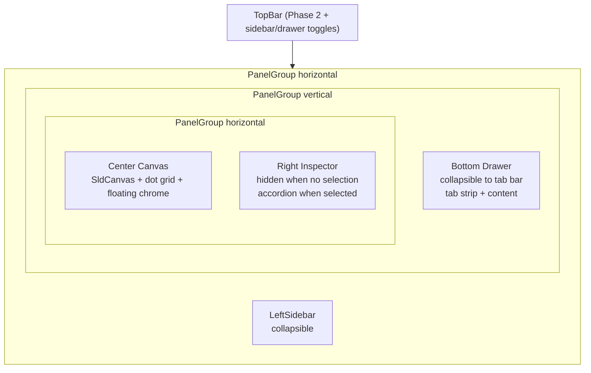
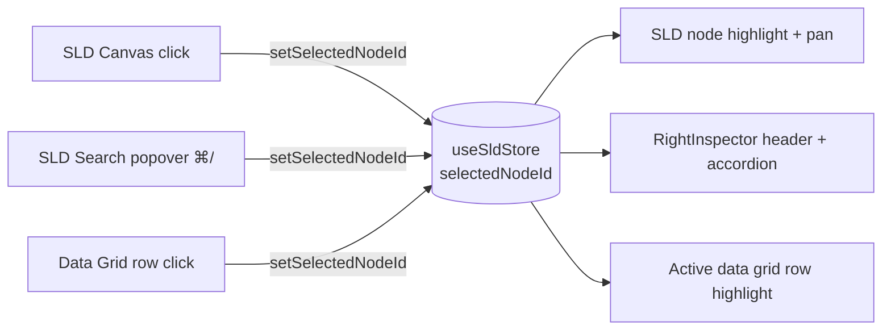
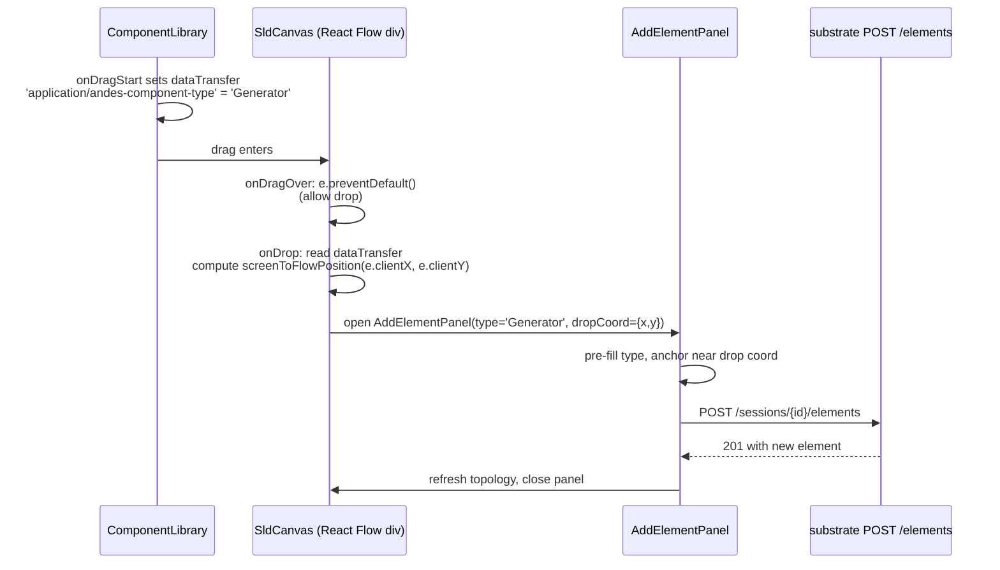

# v3.0 IDE-Style 4-Pane Layout

## Overview

Promote the ANDES App shell from the current `TopBar / LeftRail / Canvas + RightDock(top) / RightDock(bottom)` arrangement to a four-pane IDE-style architecture: collapsible **left sidebar** (case + saved scenarios + drag-drop component library), **center canvas** (SLD with floating overlays on a dot grid), **context-dependent right inspector** (accordion with Properties / Plots / Disturbances), and a resizable **bottom data drawer** (tabbed grids + an Analysis sub-tab that absorbs the existing chart panels). The TopBar gains a Toggle Sidebar control and stays as the global action bar.

The shift trades a generalist research panel layout for a familiar engineering-app metaphor (think VS Code, PSCAD, or DIgSILENT PowerFactory). The bet: domain users find the IDE pattern more legible than the current panel-router approach, and the dense bottom data grid becomes the single canonical surface for browsing topology results without context-switching panels.

## Problem Frame

The current shell, after Phase 1+2+3 polish, is good but generalist. Three friction points motivate this redesign:

1. **No spatial home for topology results.** The current `ResultsTable` lives below the right dock and only shows one bucket at a time. A power-systems researcher wants to scan all bus voltages while watching a TDS streaming chart. The IDE bottom-drawer pattern (always-on, tabbed, dense) solves this directly.
2. **Element editing is hidden.** Adding a new bus or generator currently requires opening the AddElement button in the topbar then picking a type from a dialog. A drag-from-palette affordance is the dominant pattern in every commercial single-line editor (PSCAD, ETAP, DIgSILENT) and matches user expectations for the domain.
3. **Inspector is a panel, not a property sheet.** Power-system researchers compare the App to commercial SLD editors where the right rail is a persistent property sheet that follows selection. The current `ElementInspector` shows the right shape but is co-mounted in a panel router with Disturbance/Plot/Analyze, fighting for the same space.

The 4-pane layout aligns the App's spatial language with what a domain user already knows from one of the commercial tools they're trying to replace. The architectural win is forward-compatible: each pane has a clean responsibility boundary, so future features (multi-window, detached chart panels, custom dashboards) all have a surface to grow on.

## Requirements Trace

- **R1.** Layout uses a flexible nested resizable grid with four distinct regions (left sidebar, center canvas, right inspector, bottom data drawer) plus the existing TopBar.
- **R2.** Left sidebar is collapsible via a TopBar toggle and a keyboard shortcut; collapsed state persists across reloads.
- **R3.** Left sidebar contains: Case Overview (current case + topology badge), Saved Cases / Scenarios (workspace files + snapshots), and a Drag-and-Drop Component Library (Bus / Generator / Load / Shunt / Line / Transformer icons).
- **R4.** Dragging a component icon onto the canvas opens the AddElement form pre-filled with the dropped component's type, anchored at the drop coordinates.
- **R5.** Center canvas renders a subtle dot-grid background; existing zoom/pan Controls float bottom-left and MiniMap floats bottom-right, both with elevated chrome (background, border-radius, drop shadow) that adapts to dark mode.
- **R6.** Right inspector is hidden when nothing is selected; when a node is selected it renders an icon-and-name header plus a Radix Accordion with Properties, Plots, and Disturbances sections. Accordion state persists per-element-kind across selections.
- **R7.** Properties section renders the existing element form fields under the accordion. Plots section renders inline mini-charts when voltage/power data is available (TDS frames or PF result). Disturbances section renders the disturbances scoped to the selected element with add/edit/delete controls.
- **R8.** Bottom drawer is resizable (drag the top edge), collapsible (minimised to a tab bar), and spans the canvas + right inspector width.
- **R9.** Bottom drawer tab strip: Buses | Lines | Generators | Loads | Shunts | Analysis. The five tabular tabs render dense, sortable, monospace-aligned data grids backed by topology + PF results. The Analysis tab hosts a sub-tab strip (Plot | EIG | CPF | SE | TDS) that absorbs the existing chart panels.
- **R10.** Selection sync is bidirectional across all three surfaces: clicking a node in the SLD highlights the corresponding row in the active data grid and populates the right inspector. Clicking a row in any data grid pans the SLD to that node and populates the right inspector. ⌘/ already focuses the SLD search popover (Phase 2 Unit 11) — extend it to also scope to the active data-grid tab when the drawer is focused.
- **R11.** Numbers in data grids use the existing `font-mono` stack for clean decimal alignment.
- **R12.** Layout state (sidebar collapsed, drawer collapsed, drawer height, active drawer tab, active analysis sub-tab) persists in localStorage.

## Scope Boundaries

- **Non-goal:** detached / floating chart windows. The Analysis sub-tab pattern keeps everything docked.
- **Non-goal:** user-customisable layouts (drag panels around, save layout presets). The four-pane structure is fixed; only collapse + resize are user-controlled.
- **Non-goal:** rebuilding the existing TopBar grouped menus (Phase 2 Unit 8). The TopBar gets a Toggle Sidebar control and minor restyling, not a redesign.
- **Non-goal:** rewriting the existing chart components (EIGScatter, CPFCurveChart, SEResidualChart, TimeSeriesPlot, RunLegendChip). They get re-mounted under the Analysis sub-tab, not re-implemented.
- **Non-goal:** removing the SLD canvas's floating Controls + MiniMap that Phase 2 Unit 11 wired up. They get the IDE-style chrome treatment, not replaced.

### Deferred to Separate Tasks

- **Inline plots for non-bus elements (Generator P/Q, Load P/Q, Line flow trajectory) at richer fidelity.** Unit 9 ships bus voltage and basic gen/load output mini-charts; richer per-element analytics (rotor angle, AVR response, line MVA timeline) defer to a v3.1 sub-plan when a domain-specific need lands.
- **Scenario branching** (e.g. fork a snapshot, name a what-if). The Saved Cases section in Unit 4 lists workspace files + snapshots side-by-side; a richer "Scenario" concept (forking, parameter-sweep variants surfaced here, named experiments) is a separate feature that would also require substrate-side support.
- **Multi-window detach.** The IDE pattern naturally lends itself to "pop chart out into its own window" — defer until a user explicitly asks.
- **Drag-to-reorder data-grid columns / saved column profiles.** Unit 12 ships a static column set per tab; reordering is straightforward but not in the spec.
- **Live custom dashboards (drag widgets into the right inspector or drawer).** Forward-compatible architecture allows it; explicitly deferred from this plan.

## Context & Research

### Relevant Code and Patterns

- `web/src/components/shell/AppShell.tsx` — current 3-region shell using `react-resizable-panels`. Holds the prop slots: `topBar / leftRail / inspector / results / dockOverlay / modal`. **This is the file the layout chassis (Unit 1) rewrites.**
- `web/src/components/shell/TopBar.tsx` — Phase 2 grouped menus + theme toggle + cmdk hint + history toggle. **Unit 2 adds Toggle Sidebar + Toggle Drawer controls without rebuilding the bar.**
- `web/src/components/shell/RightDock.tsx` + `web/src/components/shell/PanelPickerTabs.tsx` — current panel router (Inspector / Disturbance / Plot / Analyze). **Unit 15 retires this in favour of the new RightInspector + BottomDrawer Analysis sub-tab.**
- `web/src/components/case/CaseNav.tsx` + `web/src/components/case/WorkspaceFilePicker.tsx` — existing left-rail content. **Unit 3 keeps both as sub-components inside the new LeftSidebar.**
- `web/src/components/sld/SldCanvas.tsx` — React Flow canvas with MiniMap + Controls + node search (Phase 2 Unit 11). **Unit 6 adds the dot-grid background and chrome polish; Unit 5 adds the `onDrop` handler for the DnD palette.**
- `web/src/components/inspector/ElementInspector.tsx` — current per-element form. **Unit 8 ports its form-by-type rendering into the Properties accordion section.**
- `web/src/components/inspector/ResultsTable.tsx` — current bucketed results table. **Units 12 + 13 supersede this with the dense data-grid drawer; the file gets removed and its row-click selection-sync behaviour is preserved by the new BusesGrid + friends.**
- `web/src/components/elements/AddElementButton.tsx` + `AddElementPanel.tsx` — existing element creation flow. **Unit 5 extends to accept a pre-filled element type and an optional drop coordinate.**
- `web/src/components/disturbance/DisturbancePanel.tsx` + `DisturbanceForm.tsx` — current global disturbance editor. **Unit 10 reuses the form components inside a per-element Disturbances accordion section, filtered to the selected element's idx.**
- `web/src/components/analyze/AnalyzePanel.tsx` + sub-mode charts (`EIGScatter`, `EIGParticipationTable`, `EIGDampingChart`, `CPFCurveChart`, `SEResidualChart`) — Phase 2 + Phase 3 polish. **Unit 14 mounts them under the Analysis sub-tab strip without changing them.**
- `web/src/components/plots/TimeSeriesPlot.tsx` + `ScrubControl.tsx` + `VariableTreePicker.tsx` — Plot panel. **Unit 14 mounts under the Plot sub-tab.**
- `web/src/store/sld.ts` — `selectedNodeId` slice (Phase 2 Unit 11). **Units 12 + 14 + 16 extend the writers/readers across the new surfaces.**
- `web/src/store/ui.ts` — UI state slice. **Unit 1 adds `leftSidebarCollapsed`, `bottomDrawerCollapsed`, `bottomDrawerHeightPct`, `activeBottomDrawerTab`, `activeAnalysisSubTab` and migrates `activeRightDockTopPanel` consumers.** Persistence-architecture decision required (see Open Questions / Resolved After Doc-Review).
- `web/src/lib/commands.ts` — Phase 2 Unit 9 command registry. **Unit 2 adds `view.toggleLeftSidebar` + `view.toggleBottomDrawer` commands; Unit 14 EXTENDS each existing `run.{routine}` action to also flip `useUiStore.activeBottomDrawerTab='analysis'` + `activeAnalysisSubTab='<routine>'` after firing the run (no new commands; old `analyze.*` sub-mode commands stay).**
- `web/AGENTS.md` — Phase 1 conventions. Form-input contract (use `<Input>` for any controlled text input), Toast policy (form validation inline; transient action toast; recovery toast), Keyboard policy (use `useHotkeys` from `@/lib/useHotkeys`; never `window.addEventListener`), Run-button readiness (`useRunReadiness`), testid kebab-case, codegen via `pnpm regen-api-types`.
- `web/src/components/shell/ShortcutCheatsheet.tsx` — Phase 2 Unit 10 cheatsheet derives from command registry. **New view-toggle bindings auto-surface when added to the registry.**

### Institutional Learnings

- **TanStack Mutation `isPending` is unreliable in React 19** (Phase 1 regression fix in `useSessionRecovery.ts`). The 1-second debounce is the only "in flight" guard. **Avoid the same trap if any new mutation gating is needed for DnD-driven element creation.**
- **`destructive` Tailwind classes silently no-op in this codebase**; only `danger` is in `tokens.css` (memory `project_destructive_token_bug`). **Use `bg-danger`, `text-danger`, `border-danger` for destructive affordances in new components.**
- **Theme is `.dark` class on `<html>`** via Tailwind v4 `@custom-variant`, NOT `data-theme`. **All new components use semantic tokens; no hardcoded hex.**
- **`<Input>` from `@/components/ui/Input` handles IME composition + React testability**; raw `<input>` breaks for CJK input + `userEvent.type()`. **Component library palette filter inputs and any drawer-tab filter MUST use `<Input>`.**
- **Substrate's `--allow-origin` is per-origin; LAN access requires registering each LAN URL.** Not a layout concern but worth noting if a new dev workflow assumes the LAN URL works out of the box.
- **`useEnsureSession` lives in `useSessionRecovery.ts` only** — single source of truth for session creation. **Nothing in this plan creates sessions; the existing recovery driver covers all entry points (page load, change-case, recovery).**

### External References

- **React Flow drag-and-drop** — official pattern uses HTML5 DnD via `dataTransfer.setData('application/reactflow', type)` on the palette item, `onDragOver` + `onDrop` on the React Flow `<div>` wrapper, and `screenToFlowPosition()` to project the drop coordinate into canvas space. Docs: <https://reactflow.dev/learn/concepts/drag-and-drop>. **Adopt verbatim — it's the same pattern every React Flow tutorial uses.**
- **Radix Accordion** — `@radix-ui/react-accordion` (~4 kB, MIT, React 19 compatible per peerDeps). Single + multiple open modes, controlled + uncontrolled. **New dep for Unit 7.**
- **react-resizable-panels nested PanelGroup** — already in use; supports nested vertical-inside-horizontal layouts cleanly. Tested at scale by Vercel (used in v0.dev). **Continue with this lib for the chassis.**
- **VS Code's IDE-bottom-drawer pattern** — `⌘J` toggles the panel; tab strip with overflow scroll; collapsed state shows just the tab strip. **Adopt the keyboard convention; the rest is house style.**

## Key Technical Decisions

- **KTD-1: Nested PanelGroup chassis.** Use a horizontal `PanelGroup` (LeftSidebar | RightSide) with the right side itself a vertical `PanelGroup` (TopRow | BottomDrawer), and the top row a horizontal `PanelGroup` (Canvas | RightInspector). Three PanelGroups, each with one resize handle. *Rationale:* matches the spec exactly (drawer spans canvas + inspector width, not the full viewport), reuses the existing `react-resizable-panels` patterns, and keeps each split independently controllable. Alternative (CSS Grid + manual pointer drag) was rejected as a re-implementation of what the lib already provides.
- **KTD-2: `.dark` token-driven dot grid.** Implement the dot grid as a CSS background image (radial-gradient + background-size) using `--color-border` at low opacity. *Rationale:* one CSS rule, theme-adaptive automatically, no SVG render cost, no React render cost.
- **KTD-3: HTML5 DnD for the component library, not `dnd-kit` or `react-dnd`.** React Flow's documented pattern uses native HTML5 DnD via `dataTransfer`. *Rationale:* zero new dependencies, matches the canonical React Flow approach, the canvas is the only drop target so we don't need a complex multi-target framework. Alternative `dnd-kit` (~10 kB, accessible) was considered but rejected because the keyboard-DnD a11y story doesn't apply (a power-systems researcher dragging a generator with arrow keys is not a real workflow).
- **KTD-4: Radix Accordion for the right inspector.** Adds `@radix-ui/react-accordion` to deps. *Rationale:* matches the rest of the Radix family already in use (Dialog, Popover, Tabs, Tooltip, etc.); ARIA-correct out of the box; trivial styling. Hand-rolled accordion would re-implement focus management.
- **KTD-5: Hand-rolled data grid using `react-window`, not TanStack Table.** *Rationale:* `react-window` is already in deps (Phase 3 Unit 16, polish plan). Tables top out at ~140 rows for NPCC, ~10 for kundur — TanStack Table's column engine is overkill. The existing `EIGParticipationTable` from the v2.0 polish plan is the pattern to mirror: header click sort, filter input, FixedSizeList virtualisation when rows > 50. Builds on what reviewers already know. **Caveat (per doc-review):** the existing `web/src/components/inspector/ResultsTable.tsx` already implements a 5-bucket sortable monospace tabbed grid with `selectedNodeId` sync — see Open Questions / Resolved After Doc-Review for whether Unit 12 builds a new generic primitive or relocates the existing component.
- **KTD-6: Right inspector is HIDDEN (panel collapses to 0 width) when no selection, not just empty.** *Rationale:* per the spec (R6) — context-dependent visibility. Keeps the canvas wider when nothing is selected. The right inspector panel ref shrinks via `react-resizable-panels`'s `defaultSize={0}` + imperative `panelRef.expand()` on selection; remembers last-expanded width via `useUiStore.rightInspectorWidth`.
- **KTD-7: Bottom drawer collapses to a 32px-tall tab bar (not zero height).** *Rationale:* keeps the tab labels always visible so the user can re-expand by clicking a tab — a true zero-height collapse hides the affordance. Matches VS Code behaviour.
- **KTD-8: Single `selectedNodeId` slice as the selection source of truth.** Already exists from Phase 2 Unit 11 (`web/src/store/sld.ts`). Extend the writer count by 1 (data-grid row click) and the reader count by 1 (active data-grid row highlight). *Rationale:* avoids a parallel "selectedRowId" slice that would drift from the canvas selection.
- **KTD-9: Analysis sub-tab activation routes through the command registry.** Each `Run X` action that already exists in `commands.ts` flips `useUiStore.activeBottomDrawerTab = 'analysis'` AND `activeAnalysisSubTab = '<routine>'` after firing the run. *Rationale:* the user clicking Run EIG should see the EIG result without extra clicks — auto-routing maintains the current "click Run, see chart" UX.
- **KTD-10: Drop-on-canvas opens AddElementPanel pre-filled, NOT a one-click silent add.** *Rationale:* every component type has required parameters (a Bus needs voltage base, a Generator needs S, a Line needs from/to bus indices) that can't be inferred from a drop coordinate alone. The drop seeds the type + (for Bus) the SLD coordinate; the user fills the rest. Alternative ("auto-create with sane defaults") was rejected as a recipe for invalid topology.
- **KTD-11: localStorage key namespace prefix `andes-app:layout-v1:`** for all layout persistence. *Rationale:* matches the `andes-app:theme-preference` + `andes-app:first-run-coach-v1` Phase 2 convention; the `-v1` suffix lets us bump for breaking layout changes without surprising users with bad state.
- **KTD-12: Migration is breaking, not parallel.** This plan deletes the old `RightDock` + `PanelPickerTabs` components and updates every consumer. *Rationale:* maintaining two layout systems doubles complexity. The branching strategy (stack on `feat/v2-polish`) means v2 polish is the rollback target if v3 doesn't land cleanly.

## Open Questions

### Resolved During Planning

- **Where do the analysis result views live?** Bottom drawer Analysis tab with sub-tabs (Plot | EIG | CPF | SE | TDS). Resolved via user pre-plan question.
- **Drag-and-drop scope?** Full DnD palette + drop-to-add, with the drop opening AddElementPanel pre-filled. Resolved via user pre-plan question.
- **Branch strategy?** New branch `feat/v3-ide-layout` stacked on `feat/v2-polish`. Resolved via user pre-plan question.
- **Data grid library?** Hand-rolled with `react-window` (already in deps). Resolved per KTD-5.
- **Accordion library?** `@radix-ui/react-accordion` (new dep). Resolved per KTD-4.
- **DnD library?** Native HTML5 DnD via React Flow's pattern (no new dep). Resolved per KTD-3.

### Deferred to Implementation

- **Should the Plots accordion section poll TDS frames live, or render only on run completion?** Spec says "small, inline data visualisations". Live polling is more useful for active runs but a 60Hz redraw of a 200×100 sparkline for every selection is wasteful. Probable answer: render on run completion; live-poll only when the selected element matches the actively-streaming run's variable set. Defer the exact gating until Unit 9 implementation reveals the perf shape.
- **Should the Disturbances accordion mirror the global DisturbancePanel state or maintain a per-element local view?** They edit the same underlying disturbance store. Probable answer: same store, filtered by selected element idx. Defer the exact filter implementation until Unit 10 reveals which selectors already exist on the disturbance slice.
- ~~**Bottom drawer initial height (% of viewport).** Probable answer: 35% (matches VS Code default).~~ **Resolved:** 35% per KTD; design-iterator pass in Unit 17 may tweak.
- **Saved Cases section grouping.** Workspace files + snapshots side by side, OR two distinct sub-sections, OR collapsed-by-default sections. Defer until Unit 4 reveals what feels right with the actual content.
- **Right inspector minimum width when expanded.** Probable answer: 280px so the form fields stay legible. Defer until Unit 7.

## Output Structure

```text
web/src/
├── components/
│   ├── shell/
│   │   ├── AppShell.tsx                  (REWRITE — 4-pane chassis)
│   │   ├── TopBar.tsx                    (modify — add Toggle Sidebar/Drawer)
│   │   ├── LeftSidebar.tsx               (NEW — replaces LeftRail role)
│   │   ├── SavedCasesList.tsx            (NEW — workspace files + snapshots list)
│   │   ├── ComponentLibrary.tsx          (NEW — DnD palette grid)
│   │   ├── BottomDrawer.tsx              (NEW — resizable + collapsible drawer)
│   │   ├── RightDock.tsx                 (DELETE — superseded)
│   │   └── PanelPickerTabs.tsx           (DELETE — superseded)
│   ├── inspector/
│   │   ├── RightInspector.tsx            (NEW — accordion shell, replaces ElementInspector role)
│   │   ├── PropertiesAccordion.tsx       (NEW — wraps existing form-by-type rendering)
│   │   ├── PlotsAccordion.tsx            (NEW — per-element inline mini-charts)
│   │   ├── DisturbancesAccordion.tsx     (NEW — per-element disturbance editor)
│   │   ├── ElementInspector.tsx          (KEEP — its form-by-type body becomes a sub-component used by PropertiesAccordion)
│   │   └── ResultsTable.tsx              (DELETE — superseded by data grids)
│   ├── data-grid/
│   │   ├── DataGrid.tsx                  (NEW — generic grid: columns + rows + sort + react-window)
│   │   ├── BusesGrid.tsx                 (NEW)
│   │   ├── LinesGrid.tsx                 (NEW)
│   │   ├── GeneratorsGrid.tsx            (NEW)
│   │   ├── LoadsGrid.tsx                 (NEW)
│   │   ├── ShuntsGrid.tsx                (NEW)
│   │   └── AnalysisTab.tsx               (NEW — sub-tab strip + sub-tab router for charts)
│   ├── sld/
│   │   └── SldCanvas.tsx                 (modify — dot grid, chrome polish, onDrop for DnD)
│   └── elements/
│       └── AddElementPanel.tsx           (modify — accept pre-filled type + optional dropCoord)
├── store/
│   └── ui.ts                             (modify — layout fields + persist via localStorage)
└── lib/
    └── commands.ts                       (modify — add view.toggleLeftSidebar/toggleBottomDrawer + analysis.openSubTab.*)

docs/spikes/
└── 2026-XX-XX-v3-ide-layout-smoke.md     (NEW — Unit 17)
```

## High-Level Technical Design

> *This illustrates the intended approach and is directional guidance for review, not implementation specification. The implementing agent should treat it as context, not code to reproduce.*

### Layout chassis



Three nested `PanelGroup`s. Outer = horizontal (LeftSidebar | RightSide). RightSide = vertical (TopRow | BottomDrawer). TopRow = horizontal (Canvas | RightInspector). Each `PanelResizeHandle` is a thin draggable bar with hover affordance.

### Selection sync data flow



The Phase 2 `selectedNodeId` slice already wires the first two writers + first two readers. Units 12 + 16 add the third writer (data-grid row click) and third reader (data-grid row highlight). No new slice; just extend the consumer list.

### Drag-and-drop flow



The drop coordinate seeds the SLD layout for visual anchoring (especially relevant for Bus elements where layout matters). For non-Bus elements (Generator, Load, Shunt, etc.) the user still picks the bus_idx in the form — the drop coordinate is informational.

### Analysis tab routing

```mermaid
graph LR
  Run[TopBar Run menu: Run EIG] -->|action()| Cmd[commands.ts<br/>run.eig action]
  Cmd -->|fire substrate POST| API[POST /eig]
  Cmd -->|setActiveBottomDrawerTab| UI[(useUiStore)]
  Cmd -->|setActiveAnalysisSubTab| UI
  UI --> Drawer[BottomDrawer renders Analysis tab]
  Drawer --> Sub[AnalysisTab renders EIG sub-tab]
  Sub --> Chart[EIGScatter + EIGParticipationTable + EIGDampingChart]
```

Each routine's command in the registry composes the substrate call with the auto-route. The user goes from "click Run" to "see chart" without extra clicks.

## Implementation Units

> Phased delivery (see Phased Delivery section). Each unit lands as one focused commit.

### Phase 1 — Layout chassis (Wk 1-2)

- [ ] **Unit 1: AppShell 4-pane chassis**

**Goal:** Replace the current `topBar / leftRail / inspector / results / dockOverlay / modal` slot system with a new four-region nested PanelGroup chassis. Wire the new `useUiStore` layout fields. Ship behind a temporary `?v3=1` query flag so a fresh-checkout dev can opt into the new layout while the migration stabilises (flag retired in Unit 15).

**Requirements:** R1, R2, R8, R12

**Dependencies:** None (this unit is the foundation).

**Files:**
- Modify: `web/src/components/shell/AppShell.tsx` — full body rewrite. Keep the prop-slot shape but change the prop names to `topBar / leftSidebar / canvas / rightInspector / bottomDrawer / dockOverlay / modal`.
- Modify: `web/src/store/ui.ts` — add `leftSidebarCollapsed: boolean`, `bottomDrawerCollapsed: boolean`, `bottomDrawerHeightPct: number`, `rightInspectorWidthPx: number`, `activeBottomDrawerTab: 'buses'|'lines'|'generators'|'loads'|'shunts'|'analysis'`, `activeAnalysisSubTab: 'plot'|'eig'|'cpf'|'se'|'tds'`. Persist via localStorage under `andes-app:layout-v1:*` keys (mirror the theme + first-run-coach pattern).
- Modify: `web/src/App.tsx` — pass new prop slots; behind `?v3=1` flag for now.
- Test: `web/tests/unit/components/shell/AppShell.test.tsx` — extend for new slot rendering + collapse + persistence.
- Test: `web/tests/unit/store/ui.test.ts` — extend for new fields + localStorage round-trip.

**Approach:**
- Three nested `PanelGroup`s per KTD-1.
- LeftSidebar panel uses `defaultSize={20}` (% of horizontal); collapses via `panelRef.collapse()` to 0% (pinned via `collapsible={true} collapsedSize={0}`).
- RightInspector panel uses `defaultSize={0}` `collapsible={true} minSize={20}`; expands to `useUiStore.rightInspectorWidthPx`-derived size when `selectedNodeId !== null`.
- BottomDrawer panel uses `defaultSize={35}` (% of vertical); collapses to a `minSize={4}` row (the 32px tab bar).
- Persistence: subscribe to store changes and write to localStorage debounced 200ms; hydrate on mount.

**Patterns to follow:**
- Existing `AppShell.tsx` PanelGroup structure (Phase 2 still uses `react-resizable-panels`).
- `web/src/lib/useTheme.ts` for the localStorage hydrate-on-mount pattern.

**Test scenarios:**
- *Happy path:* AppShell mounts with all 4 regions; left sidebar visible at 20%; right inspector hidden; bottom drawer at 35% with collapsed=false.
- *Edge case:* `selectedNodeId === null` → right inspector panel collapsed (size=0). `selectedNodeId === 'bus-5'` → expands to last-known width.
- *Edge case:* localStorage holds `bottomDrawerCollapsed=true, bottomDrawerHeightPct=35` → drawer mounts as collapsed but remembers 35% expand-target.
- *Edge case:* localStorage holds malformed JSON → fall back to defaults (no crash).
- *Edge case:* user drags drawer resize handle → `bottomDrawerHeightPct` updates within 200ms; localStorage persists after debounce.
- *Integration:* `?v3=1` query flag mounts new chassis; without flag, old `RightDock`-based shell continues to render. Verify both code paths render in the same test file.

**Verification:** Loading the app at `/?v3=1` shows the new 4-pane chassis with empty placeholder content in each region; loading without the flag shows the existing v2 shell unchanged.

---

- [ ] **Unit 2: TopBar — Toggle Sidebar / Toggle Drawer controls + commands**

**Goal:** Add icon buttons to the TopBar for toggling the left sidebar and bottom drawer; wire matching commands + keyboard shortcuts via the existing command registry.

**Requirements:** R2, R8

**Dependencies:** Unit 1 (the toggle targets must exist).

**Files:**
- Modify: `web/src/components/shell/TopBar.tsx` — add two new icon buttons in the right cluster (between ThemeToggle and History). testids `top-bar-toggle-sidebar`, `top-bar-toggle-drawer`.
- Modify: `web/src/lib/commands.ts` — add `view.toggleLeftSidebar` (shortcut `meta+b`, ctrl+b) and `view.toggleBottomDrawer` (shortcut `meta+j`, ctrl+j). Mirrors VS Code conventions per the external research note.

**Approach:**
- Buttons use the existing inline-SVG glyph pattern (chevron-left for sidebar, layout-bottom for drawer; check `ThemeToggle.tsx` for the inline SVG style).
- Commands wired through the standard registry — they auto-surface in palette + cheatsheet.
- Active-state styling on buttons: when collapsed, button shows the "expand" affordance; when expanded, "collapse".

**Patterns to follow:**
- `web/src/components/shell/ThemeToggle.tsx` for the icon-button + tooltip + active-state pattern.
- `web/src/lib/commands.ts` existing `view.*` group entries.

**Test scenarios:**
- *Happy path:* clicking `top-bar-toggle-sidebar` flips `useUiStore.leftSidebarCollapsed`; second click flips back.
- *Happy path:* `Meta+B` keyboard shortcut fires the same toggle.
- *Edge case:* shortcut fires while focus is in a text input → does NOT toggle (Phase 1 default `enableOnFormTags: false`).
- *Integration:* commands appear in `useCommandRegistry()` output; cheatsheet auto-renders both rows.

**Verification:** Both toggles work via mouse + keyboard; cheatsheet shows both bindings; the active-state icon flips correctly.

---

### Phase 2 — Left Sidebar (Wk 2-3)

- [ ] **Unit 3: LeftSidebar shell — case overview + sections wrapper**

**Goal:** Build the left sidebar component that wraps three sections (Case Overview, Saved Cases, Component Library). Migrate the existing `CaseNav` rendering into the Case Overview section.

**Requirements:** R3, R12

**Dependencies:** Unit 1.

**Files:**
- Create: `web/src/components/shell/LeftSidebar.tsx` — vertical-stack layout with three sections; collapse via `useUiStore.leftSidebarCollapsed`.
- Modify: `web/src/components/case/CaseNav.tsx` — extract its content into a self-contained section without the outer panel chrome, since LeftSidebar now owns the chrome.
- Modify: `web/src/App.tsx` — mount `<LeftSidebar />` in the `leftSidebar` slot; remove the old `<CaseNav />` mount.
- Test: `web/tests/unit/components/shell/LeftSidebar.test.tsx` (NEW) — renders all three sections; respects collapsed state.

**Approach:**
- Sections separated by a thin `border-border` divider.
- Collapsed state: render nothing (panel is at size=0); the chevron in the TopBar is the re-expand affordance.
- Section headings: small uppercase `text-[10px] font-semibold tracking-wider text-muted-foreground` per the Phase 2 design pass convention.

**Patterns to follow:**
- `web/src/components/shell/CaseNav.tsx` summary card chrome (Phase 1 design pass).

**Test scenarios:**
- *Happy path:* renders Case Overview section with case info; renders Saved Cases section header (content covered by Unit 4); renders Component Library section header (content covered by Unit 5).
- *Happy path:* with no case loaded, Case Overview shows the WorkspaceFilePicker (existing behaviour).
- *Edge case:* `leftSidebarCollapsed === true` → panel renders nothing.

**Verification:** Sidebar appears with three sections; hidden when collapsed.

---

- [ ] **Unit 4: Saved Cases / Scenarios section**

**Goal:** Render a list combining workspace files + saved snapshots. Click → load (workspace file → loadCase, snapshot → restore). Expand or collapse the section header to hide content.

**Requirements:** R3

**Dependencies:** Unit 3.

**Files:**
- Create: `web/src/components/shell/SavedCasesList.tsx` — list item for each workspace file + each snapshot; row icon distinguishes the two; click triggers the appropriate action.
- Test: `web/tests/unit/components/shell/SavedCasesList.test.tsx` (NEW).

**Approach:**
- Two data sources: `useListWorkspaceFiles()` (existing query) and `useListSnapshots()` (existing query, only when a case is loaded).
- Visual grouping: workspace files first (with file-icon), then snapshots below (with snapshot-icon). Each row shows the file/snapshot name, file format / version badge.
- Click: workspace file → call `useLoadCase` (extract the existing handler logic from `WorkspaceFilePicker.onLoad`); snapshot → call `useRestoreSnapshot` (existing).
- Empty state: when no workspace files exist, show "No workspace files. Add one to /tmp/andes_test/" or similar.
- testids: `saved-cases-row-${name}`, `saved-cases-row-snapshot-${name}`.

**Patterns to follow:**
- `web/src/components/snapshot/SnapshotMenu.tsx` for the snapshot-load handler signature.
- `web/src/components/case/WorkspaceFilePicker.tsx` for the file-load handler.
- `<EmptyState />` from Phase 2 Unit 13 for the empty-state copy.

**Test scenarios:**
- *Happy path:* lists 3 workspace files + 2 snapshots; clicking a file fires loadCase mutation.
- *Happy path:* clicking a snapshot row fires restoreSnapshot.
- *Edge case:* no case loaded → snapshot section hidden (snapshots are case-scoped).
- *Edge case:* workspace empty + no case → renders `<EmptyState />`.
- *Integration:* loading the same file as currently active is a no-op (mirror Phase 1 Unit 1's `WorkspaceFilePicker.onLoad` same-file guard).

**Verification:** Selecting any saved case from the sidebar loads it; the SLD canvas refreshes; the Case Overview section reflects the new active case.

---

- [ ] **Unit 5: Drag-and-Drop Component Library + canvas drop handler + AddElement pre-fill**

**Goal:** Render a grid of draggable component-type icons (Bus, Generator, Load, Shunt, Line, Transformer). Wire `dataTransfer` on dragstart. Wire React Flow `onDrop` to open `AddElementPanel` with the dropped type pre-filled and (for Bus) the drop coordinate seeded.

**Requirements:** R3, R4

**Dependencies:** Unit 3.

**Files:**
- Create: `web/src/components/shell/ComponentLibrary.tsx` — 3-column grid of icon tiles; each tile has `draggable=true` and `onDragStart` setting `dataTransfer.setData('application/andes-component-type', type)` + a drag image.
- Modify: `web/src/components/sld/SldCanvas.tsx` — add `onDragOver={e => e.preventDefault()}` and `onDrop={...}` on the React Flow wrapper. Drop handler: read dataTransfer, compute `screenToFlowPosition(e.clientX, e.clientY)`, dispatch via existing pub-sub channel to open AddElementPanel with `{ type, dropCoord }`.
- Modify: `web/src/components/elements/AddElementPanel.tsx` — accept optional `prefillType: ElementType` and `dropCoord: {x: number, y: number}` props (or read from a small Zustand slice / pub-sub channel populated by the drop handler). When `prefillType` is set, skip the type picker step and jump straight to the form.
- Test: `web/tests/unit/components/shell/ComponentLibrary.test.tsx` (NEW) — dragstart sets dataTransfer; testid per tile.
- Test: `web/tests/unit/components/sld/SldCanvas.test.tsx` (extend) — drop event opens AddElementPanel pub-sub channel with the right payload.
- Test: `web/tests/unit/components/elements/AddElementPanel.test.tsx` (extend) — prefillType skips the type-picker; dropCoord seeds the bus form's coordinate fields when type=Bus.

**Approach:**
- Tile layout: 3 columns × 2 rows = 6 tiles for the standard component types. Each tile renders an SVG glyph + label.
- DnD: HTML5 native via `dataTransfer` per KTD-3. MIME type: `application/andes-component-type` to avoid collisions with browser-default DnD.
- Drop handler in SldCanvas: if drop dataTransfer doesn't carry the expected MIME type, ignore (some other DnD interaction).
- For Bus drop: seed AddElementPanel with the React Flow position so the new bus appears at the drop site; for non-Bus drop: the panel still opens with the type pre-filled, but bus_idx remains a user choice.

**Patterns to follow:**
- React Flow DnD docs (external reference).
- `web/src/components/elements/AddElementPanel.tsx` existing form-by-type rendering — extend, don't rewrite.
- Phase 2 pub-sub bridge pattern (Unit 9: `subscribePaletteDialog` / `__requestPaletteDialog`) for dispatching the open-with-prefill from a non-React-component context.

**Test scenarios:**
- *Happy path:* dragstart from Generator tile sets the right dataTransfer payload.
- *Happy path:* drop on canvas with the right payload opens AddElementPanel with prefillType='PV' (or 'Generator', whatever the existing internal type identifier is).
- *Edge case:* drop with no recognised payload → no-op, canvas continues to behave normally.
- *Edge case:* drop on canvas while AddElementPanel is already open → existing panel state cleared, new prefill applied.
- *Edge case:* drop coordinate maps to off-grid React Flow position → handled (use `screenToFlowPosition()` cleanly; no NaN).
- *Integration:* full flow — drag generator → drop on bus 5 area → AddElementPanel opens with type=PV, user selects bus_idx=5, submits → POST /elements fires → topology refreshes → new generator appears in the Generators data grid (Unit 13).

**Verification:** Drag-from-palette flow works end-to-end; new element appears in topology + relevant grid + SLD.

---

### Phase 3 — Center Canvas (Wk 3)

- [ ] **Unit 6: SldCanvas — dot-grid background + IDE chrome on floating overlays**

**Goal:** Add a subtle dot-grid background to the SLD canvas. Apply IDE-style chrome to the existing MiniMap + Controls (white/dark background, border-radius, drop shadow, theme-adaptive).

**Requirements:** R5

**Dependencies:** None (independent of layout chassis).

**Files:**
- Modify: `web/src/components/sld/SldCanvas.tsx` — add a CSS class with `background-image: radial-gradient(...)` for the dot grid; pass `style` overrides to MiniMap + Controls components for the chrome treatment.
- Modify: `web/src/styles/tokens.css` — add `--dot-grid-color` token (light + dark) if needed; otherwise reuse `--color-border` at low opacity.
- Test: `web/tests/unit/components/sld/SldCanvas.test.tsx` (extend) — assert dot-grid class present; assert MiniMap + Controls have chrome styling props.

**Approach:**
- Dot grid via single CSS rule per KTD-2: `background-image: radial-gradient(circle, rgba(...) 1px, transparent 1px); background-size: 16px 16px`. Use a dedicated CSS class (e.g. `.sld-dot-grid`) so the styling stays centralised and theme variables can adjust.
- MiniMap chrome: `bg-background border border-border rounded-lg shadow-lg` (matches the Phase 2 design-pass shadow tokens). MiniMap component accepts `style` and `className` props in React Flow; both work.
- Controls chrome: same treatment.
- Theme-aware: tokens already swap automatically via `.dark` class.

**Patterns to follow:**
- Phase 2 Unit 11 already styled MiniMap viewport-rect with tokens. This is the same pattern applied to the rest of the chrome.

**Test scenarios:**
- *Happy path:* SldCanvas mounts with `sld-dot-grid` class on the React Flow wrapper.
- *Happy path:* MiniMap renders with chrome classes (background, rounded, shadow).
- *Edge case:* `.dark` on `<html>` swaps the dot color (via token); no JS needed.
- *Visual:* design-iterator pass in Unit 17 verifies it doesn't fight the SLD content.

**Verification:** SLD shows a subtle dot grid in light + dark; floating MiniMap and Controls visually separate from the canvas with a soft shadow.

---

### Phase 4 — Right Contextual Inspector (Wk 4-5)

- [ ] **Unit 7: RightInspector accordion shell + visibility wiring**

**Goal:** Build the right inspector component. Hidden when `selectedNodeId === null`; expanded with header + Radix Accordion when selected. Add the `@radix-ui/react-accordion` dependency.

**Requirements:** R6, R10

**Dependencies:** Unit 1.

**Files:**
- Create: `web/src/components/inspector/RightInspector.tsx` — visibility gate + header + Radix Accordion shell with three sections (Properties, Plots, Disturbances). Section content rendered by Units 8/9/10.
- Modify: `web/package.json` + `web/pnpm-lock.yaml` — add `@radix-ui/react-accordion` (~4 kB, MIT, React 19 compat verified per peerDeps).
- Modify: `web/src/components/shell/AppShell.tsx` — wire the right inspector panel ref's `.expand()` / `.collapse()` to `selectedNodeId !== null` via a `useEffect`.
- Test: `web/tests/unit/components/inspector/RightInspector.test.tsx` (NEW) — visibility gate; accordion section rendering; header reflects selected element.

**Approach:**
- Header: icon (per element kind) + element name (e.g. "Generator GENROU_2"). Icon glyphs follow the inline-SVG pattern.
- Accordion: `<Accordion.Root type="multiple">` so multiple sections can be open simultaneously (the spec implies sections are independently collapsible).
- Section default open state: Properties open, Plots + Disturbances closed. Persist user toggles per element-kind under `andes-app:layout-v1:rightInspector:openSections:${kind}`.
- Visibility: when `selectedNodeId === null`, the parent panel's `.collapse()` is called; otherwise `.expand()`.

**Patterns to follow:**
- Radix Accordion patterns from the official docs.
- Phase 2 design pass for header typography (uppercase tracking-wider eyebrow + mono name).

**Test scenarios:**
- *Happy path:* `selectedNodeId === 'bus-5'` → inspector expanded, header reads "Bus BUS_5", three accordion section headings present.
- *Happy path:* clicking an accordion header toggles its content; multiple can be open.
- *Edge case:* `selectedNodeId === null` → inspector hidden (panel collapsed).
- *Edge case:* changing `selectedNodeId` from bus to generator → header swaps, accordion remains open in the same sections (per-kind state remembered).
- *Integration:* selecting a node from the SLD click + from a data grid row + from search popover all expand the inspector to the right element.

**Verification:** Right inspector appears on selection, hides when deselected; accordion sections toggle independently; per-kind open state persists.

---

- [ ] **Unit 8: Properties accordion section**

**Goal:** Render the existing element form-by-type rendering inside the Properties accordion section.

**Requirements:** R7

**Dependencies:** Unit 7.

**Files:**
- Create: `web/src/components/inspector/PropertiesAccordion.tsx` — wraps a sub-component (extracted from `ElementInspector.tsx`) that renders the element-kind-specific form fields.
- Modify: `web/src/components/inspector/ElementInspector.tsx` — extract the form-by-type rendering into a `<ElementFormFields element={...} />` component that PropertiesAccordion mounts. ElementInspector itself can stay as a backward-compat wrapper if there are still consumers (none expected after Unit 15).
- Test: `web/tests/unit/components/inspector/PropertiesAccordion.test.tsx` (NEW) — renders bus form for bus, generator form for generator, etc.

**Approach:**
- Pure refactor of the existing form rendering — no new field types.
- Form values read from + write to the existing element store; no new state.
- Use `<Input>` from `@/components/ui/Input` for any text/number fields per the form contract.

**Patterns to follow:**
- Existing `ElementInspector.tsx` — characterise what's there before extracting.

**Test scenarios:**
- *Happy path:* element=bus → V, theta, area, zone fields render with current values.
- *Happy path:* element=generator → P, Q, V, limits fields render.
- *Edge case:* unknown element kind → fallback empty state.
- *Integration:* edit a value in the form → existing element store updates → SLD label refreshes (if applicable).

**Verification:** Properties section renders the same forms as the previous ElementInspector; no functional regression.

---

- [ ] **Unit 9: Plots accordion section — per-element inline mini-charts**

**Goal:** Render small inline visualisations scoped to the selected element. For a bus: voltage trajectory if a TDS run is available (live or completed); else V from PF result; else empty state. For a generator: P + Q output trajectory or PF point. For a load: P + Q scalar. For lines: P_from + Q_from scalars or trajectory.

**Requirements:** R7

**Dependencies:** Unit 7.

**Files:**
- Create: `web/src/components/inspector/PlotsAccordion.tsx` — switches by element kind; renders the appropriate inline chart sub-component.
- Create: `web/src/components/inspector/InlineSparkline.tsx` (NEW) — small reusable chart (~200×100 px) for time-series data; OR mount the existing `TimeSeriesPlot` with a small fixed-width wrapper if it adapts cleanly.
- Test: `web/tests/unit/components/inspector/PlotsAccordion.test.tsx` (NEW).

**Approach:**
- Bus plot: read voltage from `useRunsStore.runs[activeRunId].busVoltageHistory[busIdx]` (existing animation slice from v0.2). Empty state if no run history; static V badge if PF only.
- Generator plot: read P/Q from runs; same pattern.
- Empty state: `<EmptyState />` with copy "No simulation data for this element. Run PF or TDS to populate."
- Sparkline: hand-rolled SVG with token-driven stroke; matches the existing chart palette scheme (Phase 2 Unit 12).
- Live polling: render last frame on every store change; for active TDS runs this means the chart updates as frames stream. Per the deferred question, defer the throttling decision until implementation reveals the perf shape.

**Patterns to follow:**
- `web/src/components/plots/TimeSeriesPlot.tsx` for the chart pattern.
- `<EmptyState />` from Phase 2 Unit 13 for the no-data state.

**Test scenarios:**
- *Happy path:* selected bus + active TDS run → sparkline renders with voltage trajectory.
- *Happy path:* selected bus + only PF result → static V badge ("V = 1.024 pu").
- *Happy path:* selected generator → P + Q trajectories or scalars.
- *Edge case:* no PF, no TDS → EmptyState with CTA.
- *Edge case:* non-bus element with no per-element data wiring (e.g. shunt) → EmptyState with explanatory copy.

**Verification:** Plots section shows meaningful per-element data when available; gracefully degrades when not.

---

- [ ] **Unit 10: Disturbances accordion section**

**Goal:** Render the disturbances scoped to the selected element. Reuses existing DisturbanceForm components for add/edit. Delete via existing handlers.

**Requirements:** R7

**Dependencies:** Unit 7.

**Files:**
- Create: `web/src/components/inspector/DisturbancesAccordion.tsx` — filters disturbance store by selected element idx; renders list + add button + per-row edit/delete.
- Test: `web/tests/unit/components/inspector/DisturbancesAccordion.test.tsx` (NEW).

**Approach:**
- Read from existing disturbance slice; filter by element idx (the disturbance schema has dev_idx / bus_idx fields per disturbance type — filter accordingly).
- Add button opens existing `AddEventDialog` pre-filled with the element idx.
- Edit / delete buttons reuse existing handlers from `DisturbancePanel.tsx`.
- Empty state: "No disturbances on this element. Add one to model a fault, toggle, or alteration."

**Patterns to follow:**
- `web/src/components/disturbance/DisturbancePanel.tsx` for the row + form patterns.

**Test scenarios:**
- *Happy path:* selected bus has 2 disturbances → both render; click delete on one → store updates.
- *Happy path:* click "Add disturbance" → AddEventDialog opens with bus_idx pre-filled.
- *Edge case:* element with no applicable disturbance types (e.g. shunt where the disturbance store has no relevant types) → EmptyState explains why.

**Verification:** Per-element disturbance editing works; the global DisturbancePanel continues to work in its existing location (until Unit 15 retires it or moves it).

---

### Phase 5 — Bottom Drawer + Data Grids (Wk 6-7)

- [ ] **Unit 11: BottomDrawer chassis — resize + collapse + tab strip**

**Goal:** Build the bottom drawer with a resizable top edge, a collapsible state (collapses to a 32px tab bar), and a tab strip routing to the per-bucket content.

**Requirements:** R8, R9, R12

**Dependencies:** Unit 1.

**Files:**
- Create: `web/src/components/shell/BottomDrawer.tsx` — outer shell + tab strip + content area.
- Modify: `web/src/components/shell/TopBar.tsx` (already in Unit 2) — toggle wires to `useUiStore.bottomDrawerCollapsed`.
- Test: `web/tests/unit/components/shell/BottomDrawer.test.tsx` (NEW).

**Approach:**
- Tab strip uses `@radix-ui/react-tabs` (already in deps).
- Tabs: Buses | Lines | Generators | Loads | Shunts | Analysis. testids `bottom-drawer-tab-${name}`.
- Active tab: from `useUiStore.activeBottomDrawerTab`. Click → setter.
- Collapsed state: panel size = 4% (~32px); only the tab strip visible. Click a tab → expand to last-known height.
- Resize handle: `react-resizable-panels` `<PanelResizeHandle />` at the top of the drawer panel. Hover affordance.
- Content area: render the active tab's content component (BusesGrid / LinesGrid / etc. — Units 12 + 13; AnalysisTab — Unit 14).

**Patterns to follow:**
- Phase 2 Unit 9 / Unit 14 for tabbed UI.
- VS Code `⌘J` toggle behaviour.

**Test scenarios:**
- *Happy path:* drawer renders at default 35% height with 6 tabs; Buses tab active by default.
- *Happy path:* click Lines tab → `activeBottomDrawerTab='lines'`; LinesGrid mounts; localStorage updated.
- *Happy path:* click drawer toggle → collapse to 32px tab bar; click any tab → expand back.
- *Edge case:* resize via top-edge drag → bottomDrawerHeightPct updates; persists.
- *Edge case:* localStorage holds collapsed=true → drawer mounts as collapsed.
- *Integration:* `Meta+J` shortcut toggles collapse (wired in Unit 2).

**Verification:** Drawer behaves like VS Code's bottom panel; collapsed/expanded state persists; tabs route to the right content.

---

- [ ] **Unit 12: DataGrid — generic dense table with sort + virtualization**

**Goal:** Build a reusable DataGrid component used by all 5 tabular tabs. Columns config + row data; click-header sort; monospace numeric cells; row click sets `selectedNodeId`; row highlight when `selectedNodeId` matches; `react-window` virtualization when rows > 50.

**Requirements:** R9, R10, R11

**Dependencies:** Unit 11.

**Files:**
- Create: `web/src/components/data-grid/DataGrid.tsx` — generic component with props `{ columns: ColumnConfig[], rows: Row[], rowIdAccessor: (row) => string, onRowClick?: (id: string) => void, selectedRowId?: string | null }`.
- Test: `web/tests/unit/components/data-grid/DataGrid.test.tsx` (NEW).

**Approach:**
- ColumnConfig: `{ key: string, label: string, accessor: (row) => string|number, numeric?: boolean, width?: number, sortable?: boolean }`.
- Header: clickable when `sortable !== false`; cycles through asc → desc → none (mirror Phase 3 Unit 16 pattern).
- Numeric cells: `font-mono tabular-nums text-right` styling.
- Row click → `onRowClick(rowIdAccessor(row))`; row gets `data-selected="true"` when `selectedRowId === id` and a Tailwind ring/background style.
- Virtualization: when `rows.length > 50`, render via `react-window` `<FixedSizeList>` with 32px row height; below threshold, render a regular `<table>`. Mirror Phase 3 Unit 16 (`EIGParticipationTable`) exactly.
- Empty state: when `rows.length === 0`, render `<EmptyState />` with copy from the calling grid.

**Patterns to follow:**
- `web/src/components/analyze/EIGParticipationTable.tsx` (Phase 3 Unit 16) — the reference implementation for sort + filter + virtualization.

**Test scenarios:**
- *Happy path:* 10 rows, 5 columns → renders as a regular `<table>`.
- *Happy path:* 200 rows → renders as a virtualized list; only ~20 rows in DOM at any scroll.
- *Happy path:* click column header → rows reorder asc; click again → desc; click again → unsorted.
- *Happy path:* row click → onRowClick fires with the row id.
- *Edge case:* `selectedRowId` matches a row → that row has `data-selected="true"`.
- *Edge case:* empty `rows` → EmptyState renders.

**Verification:** DataGrid is a clean reusable primitive; the grid for any bucket is now ~30 lines of column config + data binding.

---

- [ ] **Unit 13: Per-tab grids — BusesGrid + LinesGrid + GeneratorsGrid + LoadsGrid + ShuntsGrid**

**Goal:** Wire each grid's data source from the topology + PF result + animation slice. Define the column set per bucket.

**Requirements:** R9

**Dependencies:** Unit 12.

**Files:**
- Create: `web/src/components/data-grid/BusesGrid.tsx` — columns: idx, name, V, theta, P_inj, Q_inj, area, zone.
- Create: `web/src/components/data-grid/LinesGrid.tsx` — columns: idx, from-bus, to-bus, P_from, Q_from, P_to, Q_to, loss.
- Create: `web/src/components/data-grid/GeneratorsGrid.tsx` — columns: idx, name, bus, P, Q, P_max, P_min, status.
- Create: `web/src/components/data-grid/LoadsGrid.tsx` — columns: idx, name, bus, P, Q, status.
- Create: `web/src/components/data-grid/ShuntsGrid.tsx` — columns: idx, bus, B, G.
- Test: `web/tests/unit/components/data-grid/BusesGrid.test.tsx` (NEW; the others get smaller test files following the same shape).

**Approach:**
- Each grid: read from existing topology slice + (optionally) PF result + animation snapshot for live values.
- Row id: bus → bus idx; line → line idx; generator → `${kind}-${idx}` (e.g. `GENROU-0`); load → `Load-${idx}`; shunt → `Shunt-${idx}`. Matches the `selectedNodeId` keying convention from Phase 2 Unit 11.
- Click handler: `setSelectedNodeId(rowId)` → SLD pans + RightInspector populates.
- Cells with no data (e.g. P_inj before PF runs) → render `—` (em dash).
- Number formatting: 3 decimal places via `value.toFixed(3)`; absent values render as `—`.

**Patterns to follow:**
- `web/src/components/inspector/ResultsTable.tsx` for the existing column-derivation logic (the columns are similar; this is largely a port).

**Test scenarios:**
- *Happy path:* kundur loaded + PF run → BusesGrid renders 10 rows with V values.
- *Happy path:* click row 5 → `selectedNodeId === '5'`; SLD highlights bus 5.
- *Edge case:* no PF result → V/theta/etc. cells render as `—`.
- *Edge case:* no case loaded → grid renders EmptyState.
- *Integration:* sort by V desc → highest-voltage bus at top; selecting highlights right node.

**Verification:** Each tab shows its data; selection sync works in both directions (canvas ↔ grid).

---

- [ ] **Unit 14: Analysis tab — sub-tab strip + chart routing**

**Goal:** Mount the existing analyze panels (TimeSeriesPlot, EIGScatter+EIGParticipationTable+EIGDampingChart, CPFCurveChart, SEResidualChart, TDS RunStatusBadge) under sub-tabs. Wire each Run command to auto-route the active analysis sub-tab.

**Requirements:** R9, R10, KTD-9

**Dependencies:** Unit 11. Doesn't depend on Units 12/13 (analysis tab content is charts, not data grids).

**Files:**
- Create: `web/src/components/data-grid/AnalysisTab.tsx` — sub-tab strip (Plot | EIG | CPF | SE | TDS) + sub-tab router. Active sub-tab from `useUiStore.activeAnalysisSubTab`.
- Modify: `web/src/lib/commands.ts` — each `run.{routine}` action additionally calls `useUiStore.getState().setActiveBottomDrawerTab('analysis')` + `setActiveAnalysisSubTab(routine)`. Existing routine commands extended; no new commands.
- Test: `web/tests/unit/components/data-grid/AnalysisTab.test.tsx` (NEW) — sub-tab routing + persistence + Run-command auto-route integration.

**Approach:**
- Sub-tab strip: `@radix-ui/react-tabs` (already in deps).
- Sub-tab content:
  - Plot → `<TimeSeriesPlot /> + <ScrubControl /> + <VariableTreePicker />` (the existing PlotPanelContent composition).
  - EIG → `<EIGScatter /> + <EIGParticipationTable /> + <EIGDampingChart />` (current AnalyzePanel EIG layout, possibly stacked or side-by-side depending on space).
  - CPF → `<CPFCurveChart />`.
  - SE → `<SEResidualChart />`.
  - TDS → `<RunStatusBadge />` + maybe a new "TDS run controls" component (or reuse the existing TdsConfigPanel).
- Auto-route on Run: per KTD-9, the existing `run.eig` command's action gets `setActiveBottomDrawerTab('analysis'); setActiveAnalysisSubTab('eig'); openSubmittedRoutine();`. Order matters — drawer opens BEFORE the chart needs to render.

**Patterns to follow:**
- `web/src/components/analyze/AnalyzePanel.tsx` for the current sub-mode router (this is being moved, not rewritten).

**Test scenarios:**
- *Happy path:* click Plot sub-tab → TimeSeriesPlot mounts.
- *Happy path:* click Run EIG → `activeBottomDrawerTab === 'analysis'`, `activeAnalysisSubTab === 'eig'`, EIG charts mount, drawer expands if collapsed.
- *Edge case:* drawer collapsed when Run fires → drawer auto-expands.
- *Edge case:* no PF result → EIG chart shows the existing prerequisite empty state.
- *Integration:* the Phase 2 + 3 chart tests still pass — the components mount in a new parent but their internal behaviour is unchanged.

**Verification:** Click any Run command → land on the right chart in the right drawer position with no extra clicks.

---

### Phase 6 — Migration & Polish (Wk 8)

- [ ] **Unit 15: Retire RightDock + PanelPickerTabs + ResultsTable; remove `?v3=1` flag; update App.tsx**

**Goal:** Delete the now-superseded shell components. Update `App.tsx` to mount the new layout slots unconditionally. Verify no orphaned imports.

**Requirements:** all

**Dependencies:** Units 1-14.

**Files:**
- Delete: `web/src/components/shell/RightDock.tsx`.
- Delete: `web/src/components/shell/PanelPickerTabs.tsx`.
- Delete: `web/src/components/inspector/ResultsTable.tsx`.
- Modify: `web/src/App.tsx` — remove `?v3=1` flag branching; mount only the new layout.
- Modify: `web/src/store/ui.ts` — remove `activeRightDockTopPanel` field (replaced by `activeBottomDrawerTab` + `activeAnalysisSubTab`); migration step in the localStorage hydrate to drop the old key.
- Modify any tests that referenced the deleted components — delete or migrate to new component tests.

**Approach:**
- Search for remaining imports of the deleted components: `grep -rn "RightDock\\|PanelPickerTabs\\|ResultsTable" web/src web/tests`.
- Update each consumer to point at the new component or delete the test file.
- Run the full test suite — fix any orphan-test failures.

**Patterns to follow:**
- Phase 1 sweep style: search → migrate → delete.

**Test scenarios:**
- *Happy path:* `pnpm test` passes (1372 + Phase 4 unit tests = ~1500-1600).
- *Happy path:* `pnpm typecheck` passes (no orphan import errors).
- *Happy path:* `pnpm build` passes.
- *Edge case:* localStorage from a prior session has the old `activeRightDockTopPanel` key → hydrate ignores it gracefully.

**Verification:** Old layout entirely removed; no dead code; app renders the new layout for all users.

---

- [ ] **Unit 16: Selection sync verification + DataGrid keyboard nav**

**Goal:** Verify the three-way selection sync works across canvas / grid / inspector. Add keyboard nav to DataGrid (arrow keys move selected row when grid is focused; Enter selects).

**Requirements:** R10

**Dependencies:** Units 12, 13, 7.

**Files:**
- Modify: `web/src/components/data-grid/DataGrid.tsx` — `tabIndex=0` on container + `onKeyDown` for ArrowUp/ArrowDown navigation; Enter calls `onRowClick`.
- Test: extend `DataGrid.test.tsx` for keyboard nav.
- Test: extend `tests/unit/store/sld.test.ts` if needed for the new writer.

**Approach:**
- Keyboard nav: arrow keys advance a "focused row" index (separate from `selectedNodeId` to allow scrolling without committing); Enter sets `selectedNodeId`. Or: arrow keys directly set selectedNodeId (simpler, matches what most data grids do).
- Use `useHotkeys` with a context filter so the bindings are scoped to the active grid (only fire when DataGrid container has focus or contains the active element).

**Patterns to follow:**
- Phase 2 Unit 9 cmdk palette for the keyboard-nav-with-selected-index pattern.

**Test scenarios:**
- *Happy path:* grid has focus, ArrowDown → next row selected.
- *Happy path:* grid has focus, Enter → row click handler fires.
- *Edge case:* grid focus but no rows → no-op.
- *Edge case:* arrow key while focus is in a text input outside the grid → no-op.
- *Integration:* arrow-Enter cycle through buses in BusesGrid → SLD pans through each bus → RightInspector updates per selection.

**Verification:** Keyboard-only navigation through the data grid works; selection propagates to canvas + inspector.

---

- [ ] **Unit 17: v3 layout Playwright smoke + design-iterator pass (4 cycles)**

**Goal:** End-to-end smoke covering the new layout. 4 design-iterator cycles on visual hierarchy, dot-grid contrast, accordion polish, drawer aesthetics.

**Requirements:** R1-R12

**Dependencies:** Units 1-16.

**Files:**
- Create: `docs/spikes/<YYYY-MM-DD>-v3-ide-layout-smoke.md` (date = unit completion date).
- (Optional) Create: `web/tests/e2e/v3-ide-layout.spec.ts` — Playwright tests marked `test.fixme` per the existing convention until substrate orchestration in fixture workspace lands.

**Approach:**
- Smoke walk:
  1. Fresh load with cleared localStorage → 4-pane layout renders, sidebar visible at 20%, right inspector hidden, drawer at 35%.
  2. Toggle left sidebar via TopBar → collapses; persists across reload.
  3. Toggle bottom drawer via TopBar → collapses to 32px tab bar; persists.
  4. Drag Generator from ComponentLibrary → drop on canvas → AddElementPanel opens with type=PV pre-filled at the drop coord.
  5. Click bus 5 on SLD → RightInspector expands with Properties / Plots / Disturbances accordion sections; bus 5 row in BusesGrid (drawer Buses tab) gets `data-selected`.
  6. Click row in GeneratorsGrid → SLD pans to that generator + RightInspector updates.
  7. Click Run EIG from TopBar Run menu → drawer auto-routes to Analysis tab + EIG sub-tab; chart renders.
  8. ⌘B + ⌘J keyboard toggles work.
  9. Theme cycle → dot grid + drawer + inspector all read correctly in dark mode.
- Dispatch `compound-engineering:design:ce-design-iterator` for 4 cycles. Focus per cycle:
  - Cycle 1: dot-grid density + chrome on floating overlays; verify the IDE feel without overwhelming the canvas.
  - Cycle 2: BottomDrawer tab strip typography + active-tab affordance; AnalysisTab sub-tab spacing.
  - Cycle 3: RightInspector accordion section headers + per-element header (icon + name); empty Plots section copy.
  - Cycle 4: ComponentLibrary tile design + drag affordance (cursor change on hover, drag preview); LeftSidebar section dividers + collapsed-state affordance in TopBar.

**Test scenarios:** see Approach (the smoke walk IS the test scenarios).

**Verification:** Smoke doc + 4-cycle design iteration committed; full test suite remains green.

---

## System-Wide Impact

- **Interaction graph:** the layout chassis change ripples to every consumer of the old shell prop slots. Specifically: `App.tsx` (the only direct mounter), and any test that constructs an `<AppShell />` directly. The Phase 2 panel-router (PanelPickerTabs) consumers (Inspector / Disturbance / Plot / Analyze content components) are all moved or renamed but their internal behaviour is untouched.
- **Error propagation:** the existing recovery-state machine + toast system are unchanged. New components' error surfaces follow the existing toast policy (form validation inline; transient action toast; recovery toast). EmptyState components handle the no-data case for grids and accordion sections.
- **State lifecycle risks:** `selectedNodeId` becomes more central — three writers + three readers. Verify the case-clear cascade (Phase 1) clears `selectedNodeId` so a stale selection from a previous case doesn't pin the inspector. Verify the bottom-drawer auto-route from Run commands doesn't fight a user who manually switched to a different tab mid-run (decision: respect the user's manual switch — cancel auto-route once user has changed tab while a run is in flight).
- **API surface parity:** no substrate API changes. All new behaviour wires existing endpoints.
- **Integration coverage:** the smoke walk in Unit 17 covers the cross-component scenarios (selection sync, DnD-to-add, run-to-chart). Add at least one integration test per cross-surface flow that doesn't rely on Playwright (use vitest + RTL).
- **Unchanged invariants:** TopBar Phase 2 grouped menus stay as-is. Command palette + cheatsheet stay as-is (auto-pick up new commands from the registry). Theme system stays as-is. Form-input contract, toast policy, hotkey policy — all preserved. Substrate API surface (37 endpoints) unchanged. Phase 1+2+3 polish work is preserved; this layer sits on top.

## Risks & Dependencies

| Risk | Likelihood | Impact | Mitigation |
|---|---|---|---|
| **Nested PanelGroup edge cases** (resize handle conflicts, collapse propagation) — `react-resizable-panels` is well-tested but 3 nested groups is on the deep end | Med | Med | Spike Unit 1 with a placeholder content tree before wiring real components; verify resize feels right on each handle independently |
| **Per-element Plots section data wiring is more fragile than expected** — animation slice + runs slice may not have selectors keyed the way Unit 9 needs | Med | Med | Defer per-element plot fidelity per Scope Boundaries; Unit 9 ships with bus voltage + gen P/Q only; richer plots → v3.1 |
| **DnD UX polish gap** — drop coordinate ≠ desired bus location for non-Bus elements | Low | Low | KTD-10 — drop opens AddElementPanel pre-filled but user still picks bus_idx for non-Bus types; coord is informational only |
| **`?v3=1` flag becomes a permanent escape hatch** | Low | Low | Unit 15 explicitly retires the flag; commit must remove it |
| **localStorage layout state survives across breaking releases** and shows users a broken layout | Med | Low | KTD-11 — `andes-app:layout-v1:` namespace; bump to `-v2:` for breaking changes; hydrate ignores unknown keys |
| **Bottom drawer Analysis tab fights for vertical space with the canvas + right inspector** on small viewports | Med | Med | Drawer collapses to 32px tab bar (KTD-7); design-iterator cycle 2 verifies the small-viewport experience |
| **Selection sync race** when multiple writers fire in the same tick (e.g. data-grid Enter while a click is in flight) | Low | Low | `setSelectedNodeId` is a simple Zustand `set`; last write wins; no async coordination needed |
| **Migration breaks an in-flight v2.0 PR review** | Med | High | Branch strategy stacks v3 on v2-polish; if v2-polish needs amendments, rebase v3 on the updated v2-polish before merge |
| **Drag image is browser-default ugly** | Low | Low | KTD-3 mentions setting a custom drag image; ship with the default first, polish in design-iterator if needed |

## Phased Delivery

### Phase 1 (Wk 1-2) — Layout chassis: Units 1, 2
Lands the new shell behind a flag; no functional regression because old shell still mounts by default.

### Phase 2 (Wk 2-3) — Left sidebar: Units 3, 4, 5
Lands the new sidebar with case management + saved cases + DnD library. Visible only with `?v3=1`.

### Phase 3 (Wk 3) — Center canvas: Unit 6
Dot grid + chrome polish; works in both old and new layouts.

### Phase 4 (Wk 4-5) — Right inspector: Units 7, 8, 9, 10
Accordion shell + three sections. Visible only with `?v3=1`.

### Phase 5 (Wk 6-7) — Bottom drawer + grids: Units 11, 12, 13, 14
Drawer shell + per-bucket grids + analysis tab. Visible only with `?v3=1`.

### Phase 6 (Wk 8) — Migration + smoke + polish: Units 15, 16, 17
Retire old shell; remove flag; smoke + design-iterator. v3 becomes the default.

Estimated solo budget: **~8 weeks** of focused work. Each phase is independently shippable behind the flag, so Phase 1-5 can land incrementally without breaking v2 users.

## Documentation Plan

- Update `web/AGENTS.md`:
  - Add a "Layout slots" section documenting the new AppShell prop names and which file mounts each slot.
  - Add a "DnD palette" subsection describing the dataTransfer MIME type convention so future component-library entries follow the same pattern.
  - Update the keyboard-shortcut policy to mention the new `⌘B`, `⌘J` bindings.
- Update `README.md` (if user-facing) with a screenshot of the new layout once Unit 17 finalises.
- Add inline comments per the codebase style (terse; only WHY, not WHAT) on any non-obvious nested-PanelGroup ratios.

## Operational / Rollout Notes

- **Rollback:** if v3 has a critical bug after Unit 15, revert the v3 commits but keep the v2 polish. The branch strategy (stack on v2-polish) makes this clean.
- **Migration of layout state:** users with old localStorage from v2 will land on default v3 layout sizes; the hydrate logic explicitly ignores unknown keys, so no crash.
- **Performance smoke:** the new BottomDrawer always-mounts the active tab. Switching tabs unmounts old + mounts new — verify no remount perf regression on Analysis sub-tabs (chart components have intentional remount semantics from v2.0 plan KTD).
- **Browser-DnD interactions:** native DnD can interact with browser default behaviours (drag link, drag image). Verify the canvas drop handler gates by MIME type so a user dragging an image into the window doesn't trigger AddElementPanel.

## Sources & References

- **Origin spec:** user feature description in /ce-plan invocation (no separate brainstorm doc this time — the 4-pane spec is detailed enough to plan from directly).
- **Pre-plan decisions:** user answers to the three AskUserQuestion blocks at plan start (analysis-home = sub-tabbed Analysis, DnD-scope = full, branch = stack on v2-polish).
- **External reference:** React Flow drag-and-drop tutorial — <https://reactflow.dev/learn/concepts/drag-and-drop>.
- **External reference:** Radix Accordion docs — <https://www.radix-ui.com/primitives/docs/components/accordion>.
- **Internal patterns to mirror:**
  - Phase 1 Unit 6 — `useHotkeys` central registrar.
  - Phase 2 Unit 8 — TopBar grouped menus (don't rebuild; extend).
  - Phase 2 Unit 9 — command registry + palette pub-sub.
  - Phase 2 Unit 11 — `selectedNodeId` slice + SLD search popover.
  - Phase 2 Unit 12 — theme + token system.
  - Phase 2 Unit 13 — `<EmptyState />` + `<FirstRunCoach />`.
  - Phase 3 Unit 16 — sort + filter + react-window virtualization (the canonical pattern for the new DataGrid).
- **Saved memories applied:**
  - `feedback_collab_style` — comprehensive scope preferred; user engages with adversarial pressure-testing; values forward-compatible architecture.
  - `project_destructive_token_bug` — use `danger`, not `destructive`, for danger-state styling.
  - `reference_andes_quirks` — substrate API constraints (no relevance to layout, but worth knowing for any DnD-driven element creation that hits `POST /elements`).
- **Existing plans informing this work:**
  - `docs/plans/2026-05-09-001-feat-v2-full-andes-coverage-plan.md` — v2.0 substantive wiring.
  - `docs/plans/2026-05-09-002-feat-v2-polish-ux-iteration-plan.md` — v2.0 polish (Units 1-21 — direct precursor).
  - `docs/spikes/2026-05-10-v2-polish-phase{1,2,3}-smoke.md` — smoke baselines this plan extends.

---

## Doc-Review Findings (2026-05-10)

Six reviewer personas (coherence, feasibility, product-lens, design-lens, scope-guardian, adversarial) reviewed this plan after it was written. Auto-fixes applied silently (terminology drift, command-extend-vs-retire wording, deferred-decision cleanup, ResultsTable cross-reference). The findings below need user decision before Phase 1 starts — they materially change scope, sequencing, or premise.

### CRITICAL — premise + opportunity cost

- **F-PROD-1: The "IDE pattern is more legible to domain users" premise is unsupported.** No design-partner observation, no quoted user, no evidence in the Problem Frame. The named comparison tools (PSCAD, DIgSILENT) are CAD-style, not VS Code-style — they use floating analysis windows, not bottom-drawer sub-tabs. The plan picks features from VS Code where convenient and from CAD tools where convenient, labels the union "the IDE pattern", and bets 8 weeks on it. *Mitigation:* either cite a real user observation, or run Phase 1+2 behind the flag with one design partner gating Phases 3-6.
- **F-PROD-2: This plan implicitly cancels the v2.0 community track for the same 8 weeks.** `docs/community/community-track.md` allocates Wk 6 (JOSS submission), Wk 7 (demo video), Wk 9 (design-partner check-in), Wk 10 (NAPS tutorial proposal), Wk 12 (NSF POSE co-PI gate), Wk 13 (IEEE PES GM tutorial proposal). The v3 plan consumes the same 8 weeks and does not acknowledge the trade-off. The single biggest risk to the project is "no one tries the tool" — chassis rewrite does not address it. *Recommendation:* either explicitly defer the community track and document why, or shelve v3 chassis and run the community track first.

### CRITICAL — implementability blockers

- **F-FEAS-1 (Unit 1): persistence-architecture conflict.** `web/src/store/ui.ts` already uses `zustand/middleware/persist` with `sessionStorage` + `partialize` whitelisting only `tdsIntegrator` + `tdsToleranceOverrides`. Adding layout fields with localStorage persistence requires either (a) splitting into two stores, (b) two persist middlewares (not natively supported), or (c) hand-rolled subscribe-and-write outside the persist middleware. Plan's "mirror the theme + first-run-coach pattern" reference is itself a mismatch — those use bespoke `useTheme.ts`/`useFirstRun.ts` hooks, not `useUiStore.persist`. **Decide before Unit 1:** new `useLayoutStore` slice, OR hand-rolled subscribe pattern, OR migrate the entire UI slice off zustand-persist.
- **F-FEAS-2 (Unit 14): three slices for one concept.** `useRunModeStore.activeRoutine`, `useAnalyzeStore.subMode`, and the proposed `useUiStore.activeAnalysisSubTab` are three parallel selectors for the same concept. The existing `AnalyzeEigSubMode` etc. read from `useAnalyzeStore.subMode`. KTD-9 writes to a different field. The implementer needs an explicit decision: consolidate to one slice, or bidirectionally sync.
- **F-FEAS-3 (Unit 14): AnalyzePanel sub-modes don't map cleanly to the proposed Plot/EIG/CPF/SE/TDS sub-tabs.** Existing AnalyzePanel has `pflow|tds|eig|cpf|se` (no Plot). `subMode === 'tds'` mounts `<TdsConfigPanel />` (config form, not chart). `subMode === 'pflow'` renders text pointing the user back to the Inspector + ResultsTable — both of which are deleted by Unit 15. The mapping table is unspecified.
- **F-FEAS-4 (Unit 5): AddElementPanel cannot stay in the new layout without re-architecting positioning.** Currently `position: absolute; right-0; w-[70%]` of the right dock — explicitly geometry-coupled to the dock that this plan deletes. The `dockOverlay` slot is removed in Unit 1. Decide before Unit 5: where AddElementPanel mounts in the new chassis, and how its positioning math changes.
- **F-FEAS-5 (Unit 5): pub-sub bridge can't carry payload.** Phase 2's `__requestPaletteDialog` accepts a `PaletteDialogKey` (string union, no payload). To carry `{ type, dropCoord }`, plan needs to either extend `useCaseStore.openAddPanel` or add a new payload-carrying channel. Plan punts to "(or read from a small Zustand slice / pub-sub channel populated by the drop handler)" — two different architectures, neither chosen.
- **F-FEAS-6 (Unit 9): the data source the plan names doesn't exist.** Plan claims "read voltage from `useRunsStore.runs[activeRunId].busVoltageHistory[busIdx]`" — that path does not exist. Actual `useRunsStore` stores `t: Float64Array` and `columns: Record<string, Float64Array>` keyed by stream-metadata column name (e.g. `bus.v.5`). `useAnimationStore` is band-only (latest frame, not history) by design. To implement Unit 9, either add a new history slice OR derive the column name and subscribe to `runs[id].columns[name]` (incurring per-frame re-renders that the animation slice was designed to avoid).
- **F-FEAS-7 (Unit 1): `?v3=1` flag conflicts with Unit 1's "full body rewrite" of AppShell.** Can't have both behaviours in one rewritten file with one prop API. To honour the flag, either (a) `AppShellV2.tsx` + `AppShellV3.tsx` with branching in `App.tsx`, OR (b) the flag is wishful thinking and the rewrite is a hard cutover. Plan picks neither explicitly.

### IMPORTANT — scope reduction opportunities

- **F-SCOPE-1: Unit 12 + 13 (DataGrid + 5 wrappers) duplicate existing ResultsTable.** `web/src/components/inspector/ResultsTable.tsx` already implements the 5-bucket sortable monospace tabbed grid with `selectedNodeId` sync, sort, filter, monospace cells, flag colouring, CSV export. Unit 12 + 13 propose 6 new files (DataGrid + 5 grids) that re-implement what 1 file already does. *Cheaper alternative:* relocate ResultsTable to mount in BottomDrawer (Unit 11), add Loads + Shunts tabs (or verify they're already there), skip the new abstraction. **Saves ~1.5 weeks.**
- **F-SCOPE-2: Unit 4 (Saved Cases) is net-new feature, not migration.** Plan creates a unified workspace-files-plus-snapshots browser. The migration goal is just "put existing surfaces in the sidebar". *Cheaper alternative:* mount existing `<WorkspaceFilePicker />` + collapsible snapshot sub-list. Unified browser → separate v3.1 task. **Saves ~3-4 days.**
- **F-SCOPE-3: Unit 5 (DnD palette) is independent of the layout chassis.** No layout unit depends on DnD. The same DnD could ship against the v2 shell (sidebar tile in any sidebar). *Cheaper alternative:* extract DnD to a follow-on unit; sidebar starts with a static "Add element" button pointing to existing flow. **Decouples ~5 days of risk from the chassis migration.**
- **F-SCOPE-4: Unit 9 (Plots accordion) sparkline is partial-defer with full implementation work.** Plan defers "richer plots" to v3.1 but still ships new `InlineSparkline.tsx` + animation-slice integration. *Cheaper alternative:* ship PF-scalar badge only (`V = 1.024 pu` text from existing `pflow.bus_voltages`); defer sparkline to v3.1 in full. **Saves ~3-5 days and avoids F-FEAS-6 entirely.**
- **F-SCOPE-5: `?v3=1` flag adds AppShell test surface for unclear safety gain.** Branch already provides rollback target. Solo developer = the "fresh-checkout dev" the flag protects is you. **Recommend: drop the flag.** Develop on `feat/v3-ide-layout`; merge as a single commit per Phase if needed.

### IMPORTANT — design / IA gaps to spec before unit start

- **F-DESIGN-1 (Unit 5): drag-cancel + drop-outside-canvas are unhandled.** HTML5 DnD fires `dragend` with `dropEffect === "none"` on Escape or out-of-bounds drop; plan has no cleanup handler. Pub-sub channel for AddElementPanel will leak. Spec the `dragend` cleanup before Unit 5 lands.
- **F-DESIGN-2 (KTD-6, Unit 7): collapsed right inspector has no re-discovery affordance.** Sidebar collapse has the TopBar toggle (Unit 2). Right inspector at size=0 has nothing — no toggle, no handle, no pill. First-time users with no selection see no signal that an inspector exists. *Options:* (a) keep at fixed small width with empty-state copy, (b) add TopBar toggle button parallel to the sidebar one, (c) auto-select first bus on case load. Pick one before Unit 7.
- **F-DESIGN-3 (KTD-1): three-PanelGroup corner conflict at canvas/inspector/drawer junction.** Vertical handle (Canvas | Inspector) terminates next to horizontal handle (TopRow | Drawer) at the bottom-right. Pointer hit-test at the corner is library-dependent. Plan flags as Med/Med risk with no actual spike. *Recommend:* add a Unit 0 spike (1-2 days) before Unit 1 to validate the chassis with placeholder content, exercise the four edge cases (imperative resize collision, focus traps in size=0 panels, corner handle conflict, defaultSize=0 + minSize=20 contradiction).
- **F-DESIGN-4 (Unit 14): nested tab strip IA never specified.** Bottom drawer has 6 outer tabs; Analysis sub-tab has 5 inner tabs. Two-level tab nesting with no visual differentiation, no overflow behaviour, no narrow-viewport spec. The plan references VS Code, but VS Code's bottom panel is single-level. Spec visual treatment + overflow before Unit 14.
- **F-DESIGN-5 (KTD-9 vs System-Wide Impact): internal contradiction on auto-route behaviour.** KTD-9 says unconditional auto-route on Run; System-Wide Impact line 852 says "respect user's manual switch — cancel auto-route once user has changed tab while a run is in flight." These are different rules. The implementer will pick one. *Recommend rule:* "auto-route the active sub-tab to match the most recent Run; never auto-expand a manually-collapsed drawer; instead badge the topbar toggle to signal new results." Requires a `drawerHasUnseenResults` bit, not a "respect manual switch" bit.
- **F-DESIGN-6 (R10, Unit 12): LinesGrid row click can't drive `selectedNodeId` because lines aren't React Flow nodes.** SLD edges (lines, transformers) have no node id. Existing `ResultsTable` sets `selectedNodeId = null` for line/transformer rows (and only updates `case.selectedElement`). Plan's "row id: line → line idx" mapping (Unit 13) doesn't address this — pan effect would no-op. Spec the line/transformer selection model before Unit 13.
- **F-DESIGN-7: `selectedNodeId` already collides with `case.selectedElement`.** Two existing slices for the same concept; SldCanvas + ResultsTable already write both. Plan elevates `selectedNodeId` as "source of truth" without retiring `case.selectedElement` or specifying the mapping.

### COHERENCE / TERMINOLOGY (auto-applied)

- `bottomDrawerHeight` → `bottomDrawerHeightPct` for consistency. ✅
- "retires `analyze.*` sub-mode commands and replaces them" → "EXTENDS each existing `run.{routine}` action" for consistency with Unit 14's actual behaviour. ✅
- "Phase 3 Unit 16" → "Phase 3 polish plan Unit 16" + reference to ResultsTable as the more relevant prior art. ✅
- "Unit 10 cheatsheet" → "Phase 2 Unit 10 cheatsheet" for unambiguous phase reference. ✅
- "Bottom drawer initial height (deferred)" → resolved to 35% in KTD per its own pre-decision in Unit 11. ✅

### NOT FIXED, deliberately

- **Branch strategy (F-ADV-3).** Stack-on-feat/v2-polish was a user pre-plan decision. Doc-review notes the concurrency risk (v2-polish review changes might collide with v3 deletions); user decides whether to gate v3 Unit 1 on v2-polish merge OR accept manual ports.
- **8-week budget (F-ADV-7).** Plan's estimate may be 30-50% optimistic per adversarial review (no buffer for 4 Med/Med risks). User decides whether to widen budget or narrow scope (per F-SCOPE-1 through F-SCOPE-5 above, ~2 weeks of scope is removable cleanly).
- **Multi-select model (F-DES-5).** Plan implicitly assumes single-select; no explicit deferral. Add a one-line non-goal in Scope Boundaries: "Multi-element selection (Shift+click, box-select) is explicitly deferred to v3.1+."
- **Identity / positioning (F-PROD-4).** Plan calls v3 "VS Code, PSCAD, or DIgSILENT" while the project's positioning is "modern open-source UX". User decides whether v3 represents a positioning pivot (and updates JOSS paper / demos accordingly) or a misframing in this plan.

### Recommended decision sequence (before Phase 1 kickoff)

1. **Premise validation** — F-PROD-1, F-PROD-2: is v3 the right next move vs. community track?
2. **Scope reductions** — F-SCOPE-1..5: which simplifications to take? (Each is independently reductive.)
3. **Architectural decisions** — F-FEAS-1..7: persistence shape, store consolidation, AddElementPanel mount, payload-carrying pub-sub, Plots data source.
4. **Design specs** — F-DESIGN-1..7: drag-cancel, inspector re-discovery, corner conflict, nested tab IA, auto-route rule, line selection, `selectedNodeId` vs `selectedElement` reconciliation.
5. **Branch + budget** — F-ADV-3, F-ADV-7: gate v3 on v2-polish merge? Accept 30-50% budget overrun risk or cut scope?

If the answer to step 1 is "shelve v3 and run the community track", steps 2-5 are moot.

---

## Resolutions After Doc-Review (2026-05-10)

User decisions on the gating questions, plus architectural defaults the orchestrator will apply during implementation:

### User-decided

- **Premise gate (F-PROD-1, F-PROD-2):** **Proceed with full v3 scope, 8-week budget.** User accepts the budget risk + the implicit deferral of community-track work.
- **Branch strategy (F-ADV-3):** **Wait for v2-polish merge first** (✅ done — PR #2 merged at commit `b8c5c7c`); v3 work continues on `feat/v3-ide-layout` cut from main.
- **Right inspector empty state (F-DESIGN-2):** **Hidden + TopBar toggle button.** Inspector collapses to size=0 when no selection. New `top-bar-toggle-inspector` button (parallel to sidebar/drawer toggles per Unit 2) re-expands to last-known width even with no selection. When toggled open with no selection, inspector renders an `<EmptyState />` card.
- **Auto-route on Run (F-DESIGN-5, KTD-9 contradiction):** **Badge toggle, don't auto-expand.** Each `Run X` action always sets `activeBottomDrawerTab='analysis'` + `activeAnalysisSubTab='<routine>'`. Auto-expand the drawer ONLY if `bottomDrawerCollapsed===false`. If the user has the drawer collapsed, set a new `drawerHasUnreadResults: boolean` field and badge the TopBar drawer toggle with an unread dot. The badge clears when the user opens the drawer or starts a new run on the already-active sub-tab.

### Architectural defaults (orchestrator decisions)

- **F-FEAS-1 (persistence):** Create a new `web/src/store/layout.ts` slice for the layout fields (`leftSidebarCollapsed`, `bottomDrawerCollapsed`, `bottomDrawerHeightPct`, `rightInspectorCollapsed`, `rightInspectorWidthPx`, `activeBottomDrawerTab`, `activeAnalysisSubTab`, `drawerHasUnreadResults`). Use `zustand/middleware/persist` with `localStorage` (NOT sessionStorage) under key `andes-app:layout-v1`. This avoids the partialize conflict with `useUiStore`'s existing sessionStorage persist.
- **F-FEAS-2 (sub-mode triangle):** Make `useAnalyzeStore.subMode` the source of truth (it's the existing field already read by AnalyzeEigSubMode, AnalyzeCpfSubMode, etc.). The new `activeAnalysisSubTab` in the layout slice is a parallel field for layout-only state — when the user clicks an AnalysisTab sub-tab, write both `subMode` AND `activeAnalysisSubTab`. Run commands write to `subMode` (existing behavior) and Unit 14's auto-route writes `activeAnalysisSubTab` matching it. A small `useEffect` in BottomDrawer keeps them in sync. Acceptable drift cost for not requiring a global rename.
- **F-FEAS-3 (AnalyzePanel mapping):** Sub-tabs map: `Plot → <PlotPanelContent />` (new mount of TimeSeriesPlot+ScrubControl+VariableTreePicker — same composition as App.tsx:147-159); `EIG → AnalyzeEigSubMode`; `CPF → AnalyzeCpfSubMode`; `SE → AnalyzeSeSubMode`; `TDS → TdsConfigPanel + RunStatusBadge`. The `pflow` sub-mode is retired — its current "look at Inspector / Results" pointer is moot in v3 because both the Inspector accordion and Buses data grid are always available.
- **F-FEAS-4 (AddElementPanel mount):** Add a new `dockOverlay` slot to the v3 AppShell prop API positioned absolutely over the right side of the canvas + inspector area (NOT dock-relative since dock is gone). AddElementPanel keeps its `absolute right-0 w-[70%]` styling but anchors to the chassis's main content area (PanelGroup containing canvas + inspector + drawer). Same Unit 1 work.
- **F-FEAS-5 (pub-sub payload):** Extend `useCaseStore.openAddPanel(kind, dropCoord?)` to accept an optional drop coordinate. Cleanest: follows the existing API surface; AddElementPanel reads `useCaseStore(s => s.addPanelDropCoord)` for the optional Bus position seed.
- **F-FEAS-6 (Plots data source):** Subscribe to `useRunsStore(s => s.runs[activeRunId]?.columns[derivedColumnName])` with a `requestAnimationFrame` throttle (one render per frame max). Derive column name from the variable group: bus voltage = `bus.v.${busIdx}`, generator P = `${kind}.Pe.${idx}` etc. Read column names from the substrate's stream metadata (already exposed in `RunStream.onMeta`). For PF-only state (no TDS run): show the static scalar from `pflow.bus_voltages[busIdx]` instead.
- **F-FEAS-7 (`?v3=1` flag):** **Dropped.** Branch is the flag.
- **F-DESIGN-1 (drag cleanup):** SldCanvas `onDragEnd` handler clears the AddElementPanel pub-sub channel regardless of `dropEffect`. Implementation: dragend fires after both successful drop and Escape/out-of-bounds; only the dragend handler does cleanup; the drop handler does NOT preempt because dragend always fires after.
- **F-DESIGN-3 (corner conflict):** Unit 1 includes a placeholder-content spike phase BEFORE wiring real components. The spike exercises: (a) imperative resize collision with localStorage persistence, (b) focus traps in size=0 panels (use `unmountOnCollapse` if needed), (c) corner handle conflict at canvas/inspector/drawer junction, (d) `defaultSize=0` + `minSize=20` contradiction. If the lib doesn't handle (c) cleanly, add a 4px dead zone at the corner.
- **F-DESIGN-4 (nested tab IA):** Outer drawer tab strip uses existing `@radix-ui/react-tabs` with `text-sm` (medium-weight, full-bleed at top of drawer). Inner Analysis sub-tab strip uses the same primitive with `text-xs` (compact, with `bg-muted/30` background recess) so it visually reads as nested. Sub-tab strip pinned below outer tab strip (not inside scroll area).
- **F-DESIGN-6 (line/transformer selection):** Extend `selectedNodeId` to accept `line-${idx}` and `xf-${idx}` ids (in addition to bare bus idx and `${kind}-${idx}` for non-bus devices). React Flow `setCenter` no-ops for these (no node), but RightInspector + DataGrid row highlight work. Document inline: "lines/transformers populate the inspector; canvas pan only works for nodes (buses, generators, loads, shunts)."
- **F-DESIGN-7 (`selectedNodeId` vs `case.selectedElement`):** Both coexist as established by Phase 2 Unit 11. Writers (SLD click, search popover, data-grid row click) update BOTH atomically. `selectedNodeId` drives canvas highlight + pan; `case.selectedElement` drives inspector form data + Properties accordion contents. New writers (data-grid click) follow the existing dual-write pattern.
- **Multi-select:** Explicitly out of scope for v3.0. Add to Scope Boundaries.

### Updated Output Structure

```text
web/src/
├── store/
│   ├── layout.ts                         (NEW per F-FEAS-1)
│   └── ui.ts                             (UNCHANGED — layout fields go in layout.ts, not here)
└── ...
```

All other paths from the original Output Structure section are unchanged. The `useUiStore` modifications listed in Unit 1's Files section move to `useLayoutStore` instead.

### Unit 1 modifications

Unit 1 absorbs the spike work (no separate Unit 0). Its approach gets a "Spike step" added before the production chassis wiring:
1. **Spike (1-2 days):** placeholder PanelGroups with simple colored divs in each region. Exercise the four edge cases (a)-(d) from F-DESIGN-3. Document any unexpected lib behavior in inline comments before moving on.
2. **Production wiring:** as originally specified, but with `useLayoutStore` (new slice) instead of fields on `useUiStore`, and WITHOUT the `?v3=1` flag.
