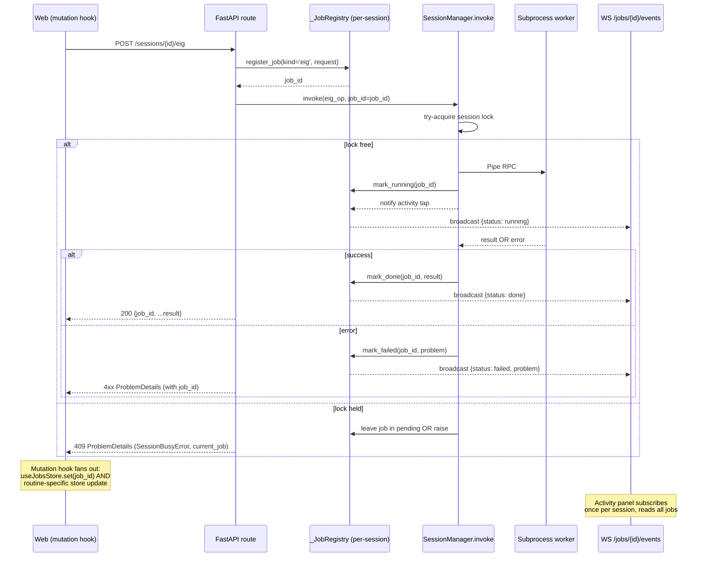
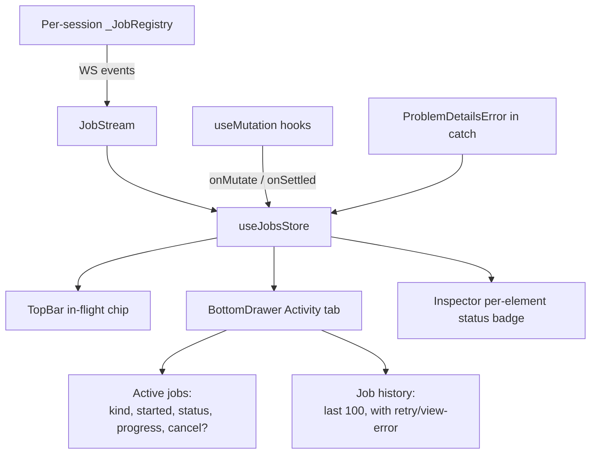

# v3.1 UX Overhaul — Non-Blocking Jobs, Error Visibility, GUI Parity, Dynamic-Properties Inspector

## Overview

The app's layout shell has matured through v3 (4-pane IDE), but the user-visible *behavior* of each action hasn't kept pace. Loading a case, running a routine, or editing a parameter still feels like the app froze, errors surface unevenly (some get a styled banner, most get a generic toast or nothing), several capabilities the substrate exposes are unreachable from the GUI, and the dynamic-model surface that ships with every research case (exciters, governors, PSS, renewable controllers loaded from `.dyr`) is invisible in the inspector. This plan delivers a v3.1 release focused entirely on the *experience* layer across four pillars: a uniform job protocol that keeps every action non-blocking, a typed error envelope with first-class recovery actions, a parity audit that closes the CLI/HTTP-only escape hatches, and a full read-write inspector for dyr-loaded dynamic models.

The work touches the substrate (new job registry, recovery envelope, expanded model whitelist), the web shell (activity panel, ProblemDetails surface, controller node + inspector routing), and existing per-flow components (rewired through the new primitives). The migration is additive on the wire (no breaking endpoint shapes) and gated by feature parity tests so existing UX keeps working through the rollout.

## Problem Frame

Direct user report (paraphrased): *"most actions will block its use, when it fails, it does not show how, loading systems, changing to others, overall the ux is not good and all capabilities are not available through just gui alone. also, no way to access and see the dynamic properties of the systems when available like the dyr or the ones obtained from xlsx, we need to be able to see when something doesnt do the expected action, why its not doing it and how to fix."*

Four distinct gaps map cleanly to this:

1. **Blocking actions.** Every routine except TDS (streaming) and sweep (true background task) currently runs through `SessionManager.invoke()`, which takes a per-session `threading.Lock` and synchronously awaits the worker's Pipe reply on the FastAPI executor (`server/src/andes_app/core/session.py:360-417`). A second click while a routine is in flight blocks silently on the lock until the first completes; the user sees a frozen button with a spinner and no information. Snapshot save can take 60s, restore 120s, bundle import 120s, NPCC 140 case load ~3s, EIG on `kundur_full` several seconds; all of these spin the originating control with no progress, no cancel, and no global "X is running" surface.
2. **Error visibility.** The substrate already produces rfc7807 ProblemDetails with category-specific recovery hints in the detail string (`call POST /api/sessions/{id}/reload`, `Run PFlow first`, etc.) via typed errors in `server/src/andes_app/core/errors.py`. The web client surfaces them through six bespoke banners scoped to specific flows (PF convergence, TDS numerical halt, case parse, etc.), and a single regex (`/reload/i` against the detail string) that decides whether to render a "Reload" action button in two places. Everything outside those flows gets a generic `toast.error(detail)` with no remediation, no error history, and no link back to the originating control. The substrate's actionable hints are present and ignored.
3. **GUI parity.** Several substrate capabilities are reachable only via curl/Python: CPF in `gen` direction with custom `step`/`max_iter`, the entire CPF QV-curve endpoint (`useCpfQvRun` hook exists but no UI consumer), SE `noise_seed`, snapshot restore's debug-aid `use_dill_optimization=false`, the long tail of TDS `tds_config_overrides`, and adding any dynamic model outside the 18-class whitelist in `server/src/andes_app/core/wrapper.py:3160`. Today these are answered by reading the OpenAPI schema and writing a curl command; that's not a tool researchers cite in JOSS papers.
4. **Dynamic-properties invisibility.** The substrate's `GET /sessions/{id}/topology` already returns a fully populated `controllers` bucket containing every dynamic device loaded via `.dyr` or `.xlsx` — `IEEEX1`, `ESDC2A`, `SEXS`, `IEEEG1`, `TGOV1`, `IEEEST`, `REGCA1` (`server/src/andes_app/api/schemas.py:189`; populated by `wrapper._collect_models(ss, list(_CONTROLLER_MODEL_NAMES))` at `wrapper.py:77-96`). The web's `SelectedElement` union (`web/src/store/case.ts:42`) hard-codes the six static kinds and never branches on `'controller'`; the SLD's `graph.ts` never iterates `topology.controllers`; `ElementFormFields` never routes a controller entry to its existing form-by-kind renderer. The data is ready, the schema endpoint is ready, the alterable-params introspection endpoint is ready — the UI consumes none of it. The user asked specifically for *full read-write*, which adds a second layer: per-parameter write policy resolution (in-place vs reload-and-replay) and a config-vs-live dual-column display so researchers can compare the configured value to the value at the current sim time.

The work is cross-cutting by design. A uniform error surface that doesn't apply to every flow is pointless; a job protocol that only covers half the routines forces the user to remember which buttons freeze and which don't; a dynamic-properties inspector that can't write back doesn't replace the Python notebook workflow it's supposed to displace. The end state is a tool where every action a researcher takes either completes invisibly fast or surfaces in a single, consistent activity-and-error surface, with no asymmetric "this one needs the CLI" workarounds.

## Requirements Trace

- **R1.** Every substrate-bound action (case load/reload, PF, TDS, EIG, CPF including QV, SE including measurement generation, sweep, snapshot save/restore, bundle import/export, element add/edit/delete, disturbance commit, profile upload, PMU placement) registers as a `Job` in a per-session `_JobRegistry` and is observable from the web via the same status surface — `pending | running | done | failed | cancelled`.
- **R2.** A second action issued while another holds the session lock fails fast with HTTP 409 `SessionBusyError` carrying `current_job: {id, kind, started_at, can_cancel}` in ProblemDetails extras, instead of blocking on the threading.Lock.
- **R3.** Cancellable jobs (TDS, sweep) expose `DELETE /sessions/{id}/jobs/{job_id}` that signals abort through the existing cooperative-cancel path. Non-cancellable jobs (PF, EIG, CPF, SE, snapshot, bundle) explicitly mark `can_cancel: false` in the job envelope so the UI never offers a cancel that won't work.
- **R4.** The web shell renders an Activity panel as a new tab on the bottom drawer (alongside `Buses | Lines | Generators | Loads | Shunts | Analysis`), driven by a `useJobsStore` Zustand slice fed from job-status events. The panel shows all jobs from this session — in-flight at top, history below — with kind, started-at, status, last error if any, and `Retry` / `View error` / `Cancel` actions where applicable.
- **R5.** The TopBar's existing run-and-status area gains a single live "in-flight" chip that summarises the active job(s) (`Running PF…`, `Streaming TDS (t=4.2/10s)`, `Sweep 7/20`), clickable to open the Activity panel.
- **R6.** All routine endpoints add a `recovery` field to their ProblemDetails extras with orthogonal axes (per KTD-3): `{precondition?: 'pflow-converged' | 'measurements-generated' | 'case-loaded' | 'snapshot-restored', conflict?: 'sweep-running' | 'job-running' | 'session-dead', retryable: 'idempotent' | 'safe-but-different' | 'state-mutating' | 'no', ui_hint?: 'open-pf-tab' | 'open-measurements-form' | 'open-activity-panel', label: string}`. The web has a single `<ProblemDetailsErrorSurface>` component that renders title + detail + recovery as a typed action button. Every existing bespoke error banner (`ParseErrorBanner`, `ConvergenceErrorPanel`, `NumericalErrorBanner`, `RuntimeCrashModal`, the AnalyzePanel inline 409/4xx/5xx banners) migrates to this component or wraps it.
- **R7.** Errors that the user sees end up in the Activity panel's history with the full ProblemDetails preserved, so a dismissed transient toast doesn't lose the diagnostic. Each historical error carries `Retry` (re-issues the original mutation variables) and `View raw` (raw JSON disclosure, mirroring `ParseErrorBanner`'s pattern).
- **R8.** Every Tailwind utility resolving against `--color-destructive` is migrated to `danger`. New components MUST use `bg-danger / text-danger / border-danger`. The CI lint adds a deny rule for `(bg|text|border|ring|outline)-destructive` matches.
- **R9.** GUI parity gaps with concrete substrate support land as first-class UI: CPF `direction: gen` toggle + `step` + `max_iter` inputs in `CpfConfigPanel`, a new CPF QV-curve sub-mode under Analysis (driven by the existing `useCpfQvRun` hook), SE `noise_seed` input in the measurement-generation form, snapshot restore "Force replay (debug)" toggle, TDS advanced overrides drawer exposing the full `tds_config_overrides` keyspace per ANDES schema.
- **R10.** A `gui_location` enum tag (`toolbar | menu | palette | advanced | none`) is added to every FastAPI route. A new CI check (`scripts/check_gui_parity.py`) parses the OpenAPI spec and fails when a route is tagged `none` without an explicit `# parity-deferred: <reason>` comment. The check runs in `.github/workflows/server.yml`.
- **R11.** The command palette (`web/src/lib/commands.ts`) extends to expose every existing route operation that doesn't have a primary UI surface (`Run CPF (gen direction)`, `Generate measurements with noise seed`, etc.), so the palette becomes the documented escape hatch for low-frequency tunables.
- **R12.** The web's `SelectedElement.kind` union widens to include `'controller'` (with `subKind: 'exciter' | 'governor' | 'pss' | 'renewable' | 'measurement' | 'profile'`). `ElementFormFields` and `ElementInspector` route controller entries through the existing form-by-kind path using the substrate's per-class param schema (already exposed via `/topology/schema`). `SldCanvas` renders an `ControllerNode` for each `topology.controllers` entry, anchored at its `gen`/`bus`/`syn` reference's node position with a docked offset.
- **R13.** The inspector renders a dual-column "Configured / Live" display when a TDS or PF result is available: the configured value sits in the left column (editable per write policy), the value at the current scrub time sits in the right column (read-only). A modified-from-default dot appears next to every field whose configured value differs from the substrate-reported default for that ParamMeta.
- **R14. Clone-on-write file-level edit model.** Dynamic-property edits modify a **clone** of the loaded case files (`.raw`/`.dyr`/`.xlsx`), not the in-memory ANDES System directly. On first edit, the substrate copies the active case files to a per-session scratch directory (`<workspace>/.sessions/<session_id>/clone/`) and marks the session as having a "working clone." Subsequent edits modify the clone files in-place via format-specific writers (a `.dyr` line edit for an exciter param, an `.xlsx` cell edit for a dynamic-model row). Each edit triggers a fresh `andes.load(clone_path, setup=False)` + `setup()` cycle so the user immediately sees the effect (PF/TDS/EIG results re-runnable on the new System). Once `setup()` is committed, further edits are blocked (matches ANDES's native invariant); the inspector toggles to "Run mode" with editable inputs disabled and a banner "Setup committed — re-enter Edit mode to make more changes" that reverts to pre-setup state on click (re-loads the clone with `setup=False`, discarding integration state but preserving all file edits).
- **R14a. Undo / redo stack.** The substrate maintains an in-memory undo stack of clone-file diffs per session. Each successful edit pushes the prior file state onto the stack. The inspector exposes `Undo last edit` / `Redo` controls bound to `Ctrl+Z` / `Ctrl+Shift+Z`. The stack caps at 50 entries (LRU eviction of oldest); never persists across substrate restart.
- **R14b. Save as custom case.** A "Save as custom case…" affordance writes the clone files to the workspace as a named case (e.g., `ieee14_tuned.raw` + `ieee14_tuned.dyr`), making the modified case loadable from `WorkspaceFilePicker` / `SavedCasesList` like any other case. Save is idempotent and can be re-invoked to update the saved name.
- **R15. Dynamic-model whitelist extension.** `_PARAMS_BY_MODEL` extends to cover the typical research case set: `EXST1`, `ST6BU`, `GAST`, `HYGOV`, `IEESGO`, `PSS2A`, `REGCP1`, `REECA1`, `REPCA1`. Each gets its ParamMeta dict populated. No `write_policy` field needed (clone-on-write makes the policy uniform: any param the substrate exposes via `ParamMeta` is editable in Edit mode). Out-of-scope for v3.1: `ST7BU`, `Motor3`, `Motor5`, `dynload/`.
- **R16.** Status / activity / error / inspector state additions persist under existing `andes-app:layout-v1` and a new `andes-app:activity-v1` namespace per the v3 convention. No global localStorage rewrites; additive partialize lists.
- **R17.** Existing tests pass through the migration. New behaviour ships with new tests (unit per component, integration for end-to-end job + error flows, acceptance for the parity ledger CI check).
- **R18. Dynamic-content visual indicator.** A persistent badge in the Case Overview section of the LeftSidebar (and in the TopBar status cluster, compact form) shows whether the currently loaded case has dynamic content. Three states: `Dynamic` (controllers + machines loaded; PF/TDS/EIG/CPF/SE all runnable) with green check, `Static-only` (no dyr / no controllers; only PF + Bundle export runnable) with neutral grey dot, `Loading` (between load + setup) with subtle pulse. Hovering the badge shows a tooltip listing the controller categories present (e.g., "2 exciters, 1 governor, 1 PSS" or "No dynamic models — load a .dyr addfile to enable TDS/EIG/CPF/SE"). Run buttons for routines that require dynamic content are disabled with an inline reason banner when `Static-only` (per the existing `useRunReadiness` precondition descriptor pattern).

## Scope Boundaries

- **Non-goal:** rewriting the v3 4-pane chassis (`AppShell`, `LeftSidebar`, `BottomDrawer`, `RightInspector` shells). The Activity panel slots in as a new bottom-drawer tab; the chassis stays.
- **Non-goal:** adopting `BackendAdapter` Protocol / ABC / interface class. v2 KTD-1 (`docs/plans/2026-05-09-001-feat-v2-full-andes-coverage-plan.md`) explicitly retracted this; each new substrate method stays as a concrete wrapper function. This plan adds methods on `Wrapper`, not abstract layers.
- **Non-goal:** Sienna / pandapower / non-ANDES backend wiring. ANDES-only, identical to v2 / v3.
- **Non-goal:** multi-user, multi-session, hosted, or SaaS-shaped concerns. Single-user loopback + per-launch token, identical to v1.0.
- **Non-goal:** rebuilding the bespoke error banners (`ParseErrorBanner` et al.) as a generic error system *and* keeping them visually identical. Visual style of the new `<ProblemDetailsErrorSurface>` matches the existing ParseErrorBanner pattern; the bespoke components either delete or become thin wrappers over the new primitive.
- **Non-goal:** SSE per-job channel. WebSocket + JSON polling are the two channels; SSE would add a third transport for no concrete win on a single-user local app.
- **Non-goal:** sub-cycle PMU-rate streaming. The brainstorm Tier-2 #15 item — out of scope here.
- **Non-goal:** session-mode-aware UI ("you're in TDS-init mode after EIG"). The post-EIG state machine quirk is documented and surfaced via error envelope (`EigDirtyDaeError` recovery hint) but the inspector doesn't render a separate mode badge.
- **Non-goal:** visual case builder beyond v3's existing DnD palette. Adding the v2 dynamic-model whitelist to the palette is in scope; building a new "scenario authoring" surface is not.

### Deferred to Separate Tasks

- **v2 Tier-1 #4 full whitelist (`PSS4B`, `ST7BU`, `Motor3`, `Motor5`, `dynload/*`).** This plan extends the whitelist to cover the typical-research-case set (R15); the remaining ~30 classes ship in a v2-Tier-1 follow-up.
- **v2 Tier-1 #2 CSV / PNG / MAT export polish.** Some hooks exist; the publication-grade export pass is the v2 plan's responsibility, not this one.
- **v2 Tier-1 #5 multi-run overlay.** Separate plan.
- **v2 Tier-1 #6 run-history persistence + reproducibility bundle.** The Activity panel renders in-session job history but does not persist across substrate restarts.
- **v2 Tier-1 #7 LaTeX report copy for SE / CPF / Sweep.** Reports widen in a separate plan.
- **v2 Tier-1 #8 default-parameter sanity (xf=0.05).** Orthogonal to the four pillars.
- **v2 Tier-2 #9 CPF — the QV-curve sub-mode lands here (R9), but the full nose-curve UI plus PV-curve enhancements stay in v2 Tier-2.**
- **v2 Tier-2 #11 PMU placement editor refinements.** Existing dialog is already wired; further polish is separate.
- **v2 Tier-2 #13 adaptive TDS UX (qndf preset).** TDS advanced overrides drawer (R9) exposes the keys but the preset UX is a separate v2 task.
- **v2 Tier-2 #14 connectivity SLD overlay.** Existing connectivity surface stays; v2 covers the post-disturbance island highlight.

## Context & Research

### Relevant Code and Patterns

#### Substrate — job machinery already in place

- `server/src/andes_app/core/session.py:128-156` — `_RunBuffer`: per-streaming-run buffer with bounded deque + asyncio queue per consumer + state machine (`pending → running → completed/error/aborted`). The shape we generalise to `_JobBuffer`.
- `server/src/andes_app/core/session.py:163-191` — `_SweepBuffer`: same pattern but for JSON envelopes (not Arrow binary). **The closest existing analog for a generic-job system.** Unit 1 lifts this into `_JobBuffer` and points `_SweepBuffer` at it as a typed alias.
- `server/src/andes_app/core/session.py:515-562` — `_drive_streaming_run` (TDS WS pipeline): the abort-poll pattern via `mp.Event`. Reusable verbatim for cancellable jobs.
- `server/src/andes_app/core/session.py:360-417` — `SessionManager.invoke`: per-session `threading.Lock` + Pipe RPC. **Modified by Unit 2** to try-acquire and raise `SessionBusyError` instead of blocking.
- `server/src/andes_app/core/session.py:52-72` — `SweepInProgressError`: the precedent for "another action holds the gate, here's structured detail." `SessionBusyError` mirrors this exactly.
- `server/src/andes_app/api/app.py:184-194` — Global FastAPI exception handlers for `HTTPException`, `RequestValidationError`, `SweepInProgressError`. **Modified by Unit 4** to add a `SessionBusyError` handler and to plumb `recovery` extras universally.
- `server/src/andes_app/api/app.py:368-371` — Existing pattern of stuffing `sweep_id/iter_done/iter_total` into ProblemDetails extras. The `recovery` field is the same shape extension.

#### Substrate — error and disturbance log primitives

- `server/src/andes_app/core/errors.py` — All typed exceptions. **Modified by Unit 3** to add a `recovery_kind: str | None` class attribute on each `AndesAppError` subclass, consumed by the per-route `_map_worker_error` helpers (or by a new shared mapper introduced in Unit 4).
- The `_disturbance_log` precedent (commit `5bf530c`, v2 Unit 6.5) — the parallel `add_disturbance` log that replays through `reload_case → setup`. **Migrated by Unit 21** into the unified `_session_mutation_log` per KTD-10 (was misattributed to Unit 18 in an earlier draft).

#### Substrate — element / topology / schema introspection

- `server/src/andes_app/core/wrapper.py:77-96` — `_CONTROLLER_MODEL_NAMES` tuple (`IEEEX1`, `ESDC2A`, `SEXS`, `IEEEG1`, `TGOV1`, `IEEEST`, `REGCA1`, `PMU`, `TimeSeries`). **Extended by Unit 15** to include the new whitelist entries.
- `server/src/andes_app/core/wrapper.py:3160+` — `_PARAMS_BY_MODEL`: per-model ParamMeta dicts. **Extended by Units 15 and 16** to add `WritePolicy` plus the new model classes.
- `server/src/andes_app/api/routes/cases.py:243` — `GET /sessions/{id}/topology/models/{model}/alterable_params`. Already used by `AlterSpecForm`. Repurposed verbatim for the dynamic-props inspector's per-param write-policy lookup.
- `server/src/andes_app/api/schemas.py:147,189` — `TopologySummary.controllers`. Already populated; only the web consumption is missing.

#### Substrate — concrete sync-routine endpoints (uniform job wrapping target)

- `server/src/andes_app/api/routes/pflow.py:141`, `routes/eig.py:255`, `routes/cpf.py:306,363`, `routes/se.py:284,343`, `routes/snapshot.py:464,524,631`, `routes/bundle.py:153,245`, `routes/elements.py:204,265,509,388`, `routes/disturbances.py:116`, `routes/pmu.py:239,346`, `routes/profiles.py:324,412`. All call `mgr.invoke(...)` synchronously. **Each gets a `job_id` issued by Unit 1's registry; the request body stays unchanged; the response gains a `job_id` field.**
- `server/src/andes_app/api/routes/sweep.py:141,199` — Sweep already returns 202 + a sweep_id. Its `sweep_id` becomes a `job_id` in the unified registry. Backward-compatible: `sweep_id` field preserved as an alias.

#### Web — existing error / status / streaming surfaces

- `web/src/api/client.ts` — `ProblemDetailsError`, `ServerError`, `NetworkError`. Already preserves `rawBody` for non-RFC-7807 detail bodies. **Used by Unit 7** as the input to `<ProblemDetailsErrorSurface>`.
- `web/src/api/queries.ts` — every `useMutation` hook + `queryKeys` + `handleGlobalRecoveryError`. **Modified by Unit 6** to register mutations with the new `useJobsStore` on `onMutate/onSettled`. **Modified by Unit 4 (server) and Unit 7 (client)** for the `recovery` field handling.
- `web/src/store/runs.ts` — TDS-specific run state. **Stays TDS-specific** — `useJobsStore` is a parallel slice that subscribes to all routines and references `runId` for TDS rows.
- `web/src/store/pflow.ts`, `store/analyze.ts`, `store/sweep.ts` — per-routine error + running state. **These slices stay** and continue to back per-routine UI; `useJobsStore` is additive aggregation.
- `web/src/streaming/SweepStream.ts` — JSON-WS attach pattern. **Generalised by Unit 5** into `JobStream` for any job kind. `SweepStream` becomes a typed view over `JobStream`.
- `web/src/components/case/ParseErrorBanner.tsx` — the shape (`title + detail + raw-JSON disclosure + dismiss`) the new `<ProblemDetailsErrorSurface>` mirrors. **Deleted by Unit 8** once the new component replaces all callers.
- `web/src/components/pflow/ConvergenceErrorPanel.tsx`, `pflow/RuntimeCrashModal.tsx`, `tds/NumericalErrorBanner.tsx`, `tds/NumericalErrorDetails.tsx`, `analyze/AnalyzePanel.tsx` inline banners — **migrated to wrap `<ProblemDetailsErrorSurface>` by Unit 9.**
- `web/src/lib/useRunReadiness.ts:20-39` — the precondition recovery descriptor pattern. **Extended by Unit 7** so the recovery field in ProblemDetails uses the same descriptor types.
- `web/src/lib/toast.ts` and `web/AGENTS.md:27-46` — toast policy. **Reinforced by Unit 7**: any `toast.error` carrying a recovery action MUST set `action` per the policy; if no action, it's a "transient action result" toast that ALSO routes the error into the Activity panel for history.

#### Web — inspector / SLD plumbing

- `web/src/store/case.ts:42` — `SelectedElement` union. **Widened by Unit 11** to include `'controller'`.
- `web/src/components/inspector/ElementInspector.tsx`, `ElementFormFields.tsx` — `bucketFor()` switches on `selected.kind`. **Unit 11** adds a `'controller'` branch returning `topology.controllers`; `ElementFormFields.paramMetas` already keys on `entry.kind` so the dynamic-model param dicts surface naturally.
- `web/src/components/sld/SldCanvas.tsx`, `web/src/components/sld/graph.ts:740-756` — current iteration over `topology.{generators,loads,shunts}`. **Unit 12** extends `graph.ts` to iterate `topology.controllers` and produce `ControllerNode` instances anchored to their parent device.
- `web/src/components/sld/nodes/` — `BusNode`, `LineNode`, `GeneratorNode`, `LoadNode`, `ShuntNode`. **Unit 12** adds `ControllerNode.tsx` (one component; sub-kind discrimination by `entry.kind` selecting the right glyph + accent colour).
- `web/src/icons/iec60617/manifest.ts` — `iconForModel`. **Unit 12** maps each new controller class to a glyph (re-uses generic controller glyph where IEC60617 doesn't carry a specific symbol; per-class glyphs deferred).
- `web/src/components/inspector/{PropertiesAccordion,PlotsAccordion,DisturbancesAccordion,RightInspector}.tsx` — v3 right-inspector accordion shells. **Unit 13** adds the dual-column config/live render to `PropertiesAccordion`; **Unit 14** adds the modified-from-default dot indicator.
- `web/src/components/inspector/ElementFormFields.tsx:210` — `paramMetas` lookup against `useTopologySchema().models[entry.kind]`. **Already correct** for dynamic models; only the routing into this code path is missing.

#### Web — layout / persistence / commands

- `web/src/store/layout.ts:148` — `LAYOUT_STORAGE_KEY = 'andes-app:layout-v1'`. **Unit 6** adds `activityPanelCollapsed`, `activityPanelTab: 'active' | 'history'`, `selectedJobId` to this slice's persist whitelist.
- `web/src/store/auth.ts:17` — `andes-app:auth-token` in sessionStorage. **No change.**
- `web/src/lib/commands.ts` — Phase 2 Unit 9 command registry. **Unit 17** adds command palette entries for the parity-gap operations; **Unit 6** adds `view.toggleActivityPanel`.
- `web/AGENTS.md` — toast policy + `<Input>` requirement + testid kebab-case + form-input contract. **All inspector + activity components honour this.**

### Institutional Learnings

- **TanStack Mutation `isPending` is unreliable in React 19** (per `docs/plans/2026-05-10-001-feat-v3-ide-layout-plan.md:80`, `docs/plans/2026-05-08-003-feat-v02-readiness-bridge-plan.md:92`). `useJobsStore` derives in-flight state from server job-status events, NOT from `mutation.isPending`. Mutations only flip the local button's spinner; the activity surface reads from the store.
- **`destructive` Tailwind classes silently no-op** (memory `project_destructive_token_bug`). Unit 10 runs the codebase-wide `destructive → danger` sweep. New components MUST use `danger`.
- **`ss.add(...)` is rejected after `setup()`; `System.reset()` doesn't clear `is_setup`** (memory `reference_andes_quirks`; `docs/plans/2026-05-09-001-feat-v2-full-andes-coverage-plan.md:78,97`). The `reload-replay` write policy is the only correct path for params that ANDES sets at setup time; **Unit 0** confirms per-param which is which.
- **WebSocket auth handshake is per-channel** (`docs/plans/2026-05-07-001-feat-andes-app-phase-a-substrate-plan.md:80,103,131,577`). Job-status WS reuses the same handshake; a per-job WS channel does NOT mean a new auth flow.
- **Per-launch tokens; substrate restart invalidates everything.** Job history is in-memory only — substrate restart wipes it; the UI surfaces "substrate restarted" via the existing 401 cascade.
- **`POST /pflow` has no worker timeout** (the synchronous routines mostly don't). **Unit 1** adds a per-job-kind soft timeout enforced on the executor wrapper, with the same shape as the existing TDS (300s) / snapshot (60s) / bundle (120s) timeouts.
- **EIG side-effect: mutates `dae.t`, sets `TDS.initialized`** (`docs/spikes/2026-05-09-andes-routine-surface-spike.md:16-17,42-49`). The `recovery` field for `EigDirtyDaeError` carries `kind: 'reload-case'`; the activity surface displays "Session is in TDS-init mode after EIG" as a sticky banner until reload.
- **CLI-Anything mismatch** (`docs/solutions/2026-05-07-cli-anything-andes-architectural-mismatch.md`). Every "make this reachable" item is a substrate endpoint + UI consumer, NOT a CLI shellout. Holds for every parity gap addressed here.
- **Source-grounding for ANDES claims** (memory `feedback_deepening_needs_source_grounding`). **Unit 0's spike** is mandatory before any write-policy decisions; the deepening reviewer for this plan MUST verify every ANDES-API claim against the actual library source.
- **`--allow-origin` is exact-match per LAN URL** (`docs/plans/2026-05-09-001-feat-v2-full-andes-coverage-plan.md:118`). Activity panel WS connects via the same proxied URL; no LAN-specific work needed.
- **`<Input>` from `@/components/ui/Input` is required** for inspector parameter fields (IME + testability).
- **The Vite 6 + http-proxy-3 X-Andes-Token forwarding bug** (`docs/plans/2026-05-09-001-feat-v2-full-andes-coverage-plan.md:116`). A long-running dev session can see auth fail spuriously. The error surface should NOT special-case this; restart-Vite remains the documented dev workaround.

### External References

- **rfc7807 / rfc9457 ProblemDetails extras** ([Nordic APIs](https://nordicapis.com/a-look-at-problem-details-for-http-apis-rfc/), [Codecentric](https://www.codecentric.de/en/knowledge-hub/blog/charge-your-apis-volume-19-understanding-problem-details-for-http-apis-a-deep-dive-into-rfc-7807-and-rfc-9457), [Axway](https://blog.axway.com/learning-center/apis/api-design/introduction-to-rfc-7807)). Extension members are first-class; typed recovery fits the spec.
- **VS Code `withProgress` / ProgressLocation tiers** ([UX guidelines](https://code.visualstudio.com/api/ux-guidelines/status-bar)). Three-tier (status-bar / notification / modal) surface decision.
- **JetBrains `ProgressManager.checkCanceled()` + `ProcessCanceledException`** ([Background Processes](https://plugins.jetbrains.com/docs/intellij/background-processes.html), [March 2026 post](https://blog.jetbrains.com/platform/2026/03/ui-freezes-and-the-dangers-of-non-cancellable-read-actions-in-background-threads/)). Cooperative cancellation precedent; mirrors the existing TDS `callpert` abort-flag pattern.
- **Ably + RxDB SSE-vs-WebSocket** ([Ably](https://ably.com/blog/websockets-vs-sse), [RxDB](https://rxdb.info/articles/websockets-sse-polling-webrtc-webtransport.html)). Justification for WS-or-polling, no SSE.
- **Linear Inbox separation of toast vs persistent activity** ([Linear docs](https://linear.app/docs/inbox)). Activity panel as job history independent of toasts.
- **Blender F3 Operator Search** ([Manual](https://docs.blender.org/manual/en/2.81/interface/controls/templates/operator_search.html), [T74157](https://projects.blender.org/blender/blender/issues/74157)). Command palette as universal escape hatch + menu-first / palette-fallback tiering.
- **Unity custom inspectors + modified-from-default dot** ([Unity UI Toolkit](https://deepwiki.com/Unity-Technologies/ui-toolkit-manual-code-examples/3.4-custom-inspectors), [Balsamiq](https://balsamiq.com/company/news/227/), [unity-helpers grouping](https://github.com/wallstop/unity-helpers/blob/main/docs/features/inspector/inspector-grouping-attributes.md)). Inspector grouping + modified-state badge precedent.

## Key Technical Decisions

- **KTD-1: Augment, don't replace, the existing routine endpoints — but commit to a durable async-decision rule.** Every routine keeps its current request shape and 200/202 response shape. The new behaviour is *additive*: response gains a `job_id` field, ProblemDetails gains a `recovery` extras field, a new `_JobRegistry` mirrors every invocation, and new `GET /sessions/{id}/jobs/...` / `WS /sessions/{id}/jobs/events` (per-session multiplexed) paths expose the registry. *Rationale:* the existing UI keeps working through the migration; per-routine slices (`pflow.ts`, `analyze.ts`, `sweep.ts`) stay as the source of truth for their domain-specific result data; the new aggregation is a strictly-additive layer.
**Durable rule for future routines (closes the architect's "protocol fork" concern):** any new routine with expected wall-time <2s ships as **synchronous POST + `job_id` in response** + HTTP polling status; any routine ≥2s expected wall-time OR that needs cancellation OR that emits per-step progress ships as **POST + 202 + `job_id` + WS event channel**. This is the contract every new substrate route follows; the dual-shape is a v3.1 *transition* artifact, not a permanent protocol fork. The retirement path is: once all existing client code consumes `job_id` (web v3.1+), a v4.0 substrate could collapse 200/202 into a uniform `JobEnvelope` response. Documented here so the criterion is recoverable.
Alternative considered: introduce a new `POST /sessions/{id}/jobs/{kind}` endpoint family and deprecate the existing routes. Rejected because (a) it doubles the surface during migration, (b) the existing routes encode validation + scheduling per kind that doesn't generalise cleanly, and (c) the wire impact is larger than the user benefit.
- **KTD-2a: Session lock policy flips to non-blocking try-acquire — wire contract.** `SessionManager.invoke()` becomes "try-acquire the lock; if already held, raise `SessionBusyError` with `current_job` in extras; if free, acquire and proceed." Same change applies to `invoke_streaming` (which currently holds the lock for the entire stream duration via `session.py:449` `with sess.lock:`) — a second routine request during a streaming run returns 409, NOT silently blocks. The error envelope encodes the same information the sweep gate already provides. *Rationale:* the silent-queueing behaviour is the single biggest source of "the app froze" complaints; promoting fail-fast is a small substrate change with a large UX payoff. There is NO queueing on 409 — a rejected request must be resubmitted (closes the architect's queueing-case finding). The UI's recovery affordance for `SessionBusyError` is "wait + retry," not "queue this for later."
- **KTD-2b: Session lock becomes `threading.RLock`; internal re-entrant callers explicitly enumerated.** *Critical correction from deepening:* the original plan claimed "the `bypass_sweep_gate=True` pattern is mature" — `git grep bypass_sweep_gate=True server/src/` returns zero call sites. The existing pattern exists in the kwarg signature but no caller uses it; it gates ONLY the sweep-in-progress check, not the lock itself. Internal composite operations (snapshot restore, reload-replay job, bundle import — all of which currently nest `reload_case` → `add_disturbance` loop → `setup` → `PFlow.run`) take the lock once at the outer `mgr.invoke` boundary and stay within the worker. *Decision:* `sess.lock` becomes `threading.RLock` (cheap; same API; supports same-thread re-entry). The new `bypass_session_gate=True` flag is reserved for cross-process or cross-thread callers that may legitimately need to bypass the gate (none identified in v3.1 — the flag is plumbed but unused, future-proofing only). Unit 2 carries an explicit call-site audit (`git grep "mgr\.invoke" server/src/andes_app/`) and any composite operation that emits more than one `invoke` per user request must be refactored into a single worker-side composite (see Unit 21 — the reload-replay job is a single composite handler, not a sequence of route-level invokes). *Rationale:* the original mitigation depended on a precedent that didn't exist. Honest correction: RLock makes the migration safe; the bypass flag is documented for future use; no silent-deadlock risk.
- **KTD-3: Typed `recovery` field on ProblemDetails extras with orthogonal axes, not a single flat enum.** The substrate's typed errors expose three structurally distinct facts about a failure, and the recovery descriptor reflects that:
  ```text
  recovery: {
    precondition?: 'pflow-converged' | 'measurements-generated' | 'case-loaded' | 'snapshot-restored',
    conflict?: 'sweep-running' | 'job-running' | 'session-dead',
    retryable: 'idempotent' | 'safe-but-different' | 'state-mutating' | 'no',
    ui_hint?: 'open-pf-tab' | 'open-measurements-form' | 'open-activity-panel',
    label: string                  # human-facing CTA copy
  }
  ```
  *`retryable` enum semantics* (per adversarial F8 — boolean overclaims idempotency for nondeterministic routines like CPF/SE with seed, adaptive-TDS): `idempotent` = same input produces same result (most pure routines); `safe-but-different` = retry won't corrupt state but may produce a different numerical result (CPF with random predictor step, SE with auto-generated noise_seed if user didn't pin one); `state-mutating` = retrying after a successful step would create a different log entry (most useful for the Activity panel "Retry" decision — never auto-retry these); `no` = retry will likely produce identical failure (most prerequisite errors after the precondition is fixed are NOT retryable in this sense — they need the user to act first). The web's Retry CTA renders differently per kind: `idempotent` is silent retry; `safe-but-different` tooltip warns "may produce different result"; `state-mutating` and `no` hide auto-retry, require user to redrive.
  Each axis answers a separate question: *what state is missing?* (`precondition`), *what other action holds the gate?* (`conflict`), *can the client safely re-fire the same request?* (`retryable`), *if the user wants to act, where do they go?* (`ui_hint`). The web's `<RecoveryActionButton>` reads each axis independently, so `precondition: 'pflow-converged' + ui_hint: 'open-pf-tab'` and `precondition: 'pflow-converged' + ui_hint: undefined` are both renderable correctly. *Rationale:* an earlier draft used a flat 8-value enum mixing preconditions / conflicts / retryability / navigation hints; the architect review flagged that the wire contract was leaking client-shape ("`open-pf-tab` only makes sense if the client is the web shell") and that `retry` as an enum value claimed idempotency the substrate cannot prove. Orthogonal axes keep the wire neutral and let the client compose CTAs. Class-attribute mapping per `AndesAppError` subclass: e.g., `EigPrerequisiteError` → `{precondition: 'pflow-converged', retryable: true, ui_hint: 'open-pf-tab', label: 'Run PFlow first'}`. `SessionBusyError` → `{conflict: 'job-running', retryable: true, label: 'Wait for the current job'}`. `SeUnderDeterminedError` → `{precondition: 'measurements-generated', retryable: true, ui_hint: 'open-measurements-form', label: 'Add more measurements'}`. Alternative: keep the flat enum. Rejected because removals from the wire are hard; the orthogonal shape is correct on the first wire commit.
- **KTD-5: WebSocket for streaming jobs (TDS, sweep, clone-edit setup); HTTP polling for short-batch jobs (PF, EIG, CPF, SE, snapshot, bundle, element ops).** Reuses the existing WS auth handshake; polling uses standard react-query with `refetchInterval` tuned to job kind. *Rationale:* per Ably/RxDB best-practice + the codebase's existing protocol split. SSE would add a third transport with no concrete payoff on a single-user local app. The polling cadence (~250ms) is small for a localhost socket; over-polling cost is negligible.
- **KTD-6: Cancellable jobs honestly self-report `can_cancel: boolean` in the job envelope.** TDS and sweep already use cooperative cancel via `mp.Event`; PF / EIG / CPF / SE call into ANDES routines that don't poll cancel flags. Adding cancel for those would require ANDES API changes. *Rationale:* a fake-cancel button that doesn't actually cancel is worse than no button. The UI never shows cancel for `can_cancel: false`; the documentation explains why. A future ANDES-side cancel hook would unlock the field for those kinds.
- **KTD-7: Inspector single-column with `Modified-from-Original` indicator (revised from earlier dual-column draft).** Under clone-on-write (KTD-9), the inspector renders one column showing the current configured value from the clone file. A `Modified-from-Original` dot (4px `bg-warning` circle with `aria-label="Modified from original case file"`) appears next to any param whose clone-file value differs from the original-case-file value. Hovering the dot shows the original value as a tooltip ("Original: 1.02 → 1.10"). *Rationale:* the original dual-column "Configured / Live" pattern was load-bearing for a write architecture that supported live state inspection; under clone-on-write, the meaningful comparison is "what did you change vs the original?" Live-state values (TDS scrub trajectories) continue to render in the existing Plots accordion section, not inline in the params table. Simpler implementation, simpler mental model.
- **KTD-9: Clone-on-write file-level edit model — edits modify cloned case files, not the in-memory ANDES System.** *Critical revision from user input:* on first edit, the substrate clones the active case files (`.raw`/`.dyr`/`.xlsx`) to `<workspace>/.sessions/<session_id>/clone/`. Each edit invokes a format-specific writer that modifies the clone in place (a `.dyr` text replacement at the correct line for a Type-2 exciter Vrmax, an `.xlsx` cell replacement for an `IEEEX1` row's parameter cell). After each edit the substrate runs `andes.load(clone_path, setup=False) → setup()` to rebuild the System from the modified files; PF/TDS/EIG/CPF/SE all run against the new System. *Rationale:* uses ANDES's native pre-setup gate as the editing window (no fighting `ss.add() rejects after setup`); eliminates per-param write-policy spike (the policy is uniform — any param ANDES exposes via `ParamMeta` is editable in Edit mode); eliminates a separate `_session_mutation_log` (the clone files themselves are the persisted state); eliminates the live-vs-reload-replay race (every edit is "reload from clone + setup," done deterministically by the substrate, with progress surfaced as a single Job). Alternative considered: per-param in-place writes via `ss.<Model>.<param>.v[idx] = value` (the original Unit 0 / `WritePolicy` design). Rejected because (a) ANDES's lifecycle constraints make in-place semantics quirky per-param (some params re-take effect, some don't, some corrupt state), (b) "edit during streaming" was never supportable under the session-lock model anyway (see retired KTD-17), and (c) clone-on-write composes naturally with R14b's save-as-custom-case feature without inventing a separate format. Trade-off: each edit triggers a `setup()` cycle (~0.5-3s depending on case size); the UI surfaces this as a small Job in the activity panel with the existing `<RecoveryActionButton>` if it fails.
- **KTD-9a: Edit / Run mode toggle is explicit; `setup()` commits Edit mode.** The inspector exposes an "Edit mode" / "Run mode" toggle in the header. In Edit mode, param inputs are editable; the substrate operates on the clone files. In Run mode (the default after `setup()`), inputs are read-only; experiments (PF/TDS/EIG/CPF/SE) are runnable. Switching from Run back to Edit reloads the clone with `setup=False`, discarding integration state but preserving all file edits. *Rationale:* surfaces ANDES's native pre-setup / committed state machine as a first-class UI affordance; users always know which mode they're in; runs cannot accidentally trigger an edit-then-reload cycle.
- **KTD-10: Undo / redo stack at substrate level — file-diff-based.** The substrate maintains an in-memory `clone_undo_stack: list[CloneFileSnapshot]` per session. Each successful edit pushes the prior clone file state. `POST /sessions/{id}/case/clone/undo` pops and restores; `POST /sessions/{id}/case/clone/redo` re-applies. Cap at 50 entries (LRU eviction). Never persists across substrate restart. *Rationale:* file-diff is the natural undo granularity for clone-on-write; pops are O(1); no in-memory ANDES state diffing needed. Avoids the `_session_mutation_log` complexity entirely.
- **KTD-12: `gui_location` is committed as an OpenAPI `x-andes-app-gui-location` extension via FastAPI's `openapi_extra` kwarg.** Every route specifies `openapi_extra={"x-andes-app-gui-location": "toolbar"}` (or one of `menu | palette | advanced | none`). The CI script (`scripts/check_gui_parity.py`) reads the OpenAPI JSON, NOT route source. *Rationale:* spec-native, no AST coupling. Sub-second performance budget for the CI script.
- **KTD-13: `<ProblemDetailsErrorSurface>` is a one-component primitive with composition options.** `<ProblemDetailsErrorSurface variant="banner|modal|toast" />` covers the three placements. *Rationale:* one component to test, one regression surface, one styling source. The existing per-flow components become thin shells (or delete entirely) once they delegate to this primitive.
- **KTD-15: BackendAdapter discipline is NOT taken up.** No `Protocol`, no `ABC`, no interface class. Each new substrate method is a concrete `Wrapper.*` function. *Rationale:* v2 KTD-1 explicit retraction. The job registry is a single concrete class; the recovery envelope is a single concrete shape; the clone-on-write router is a single concrete function. No abstract layers.
- **KTD-17: No optimistic UI — every edit is a Job with substrate-confirmed result.** *Revised from earlier draft.* Under clone-on-write (KTD-9), each edit issues a `PUT /sessions/{id}/case/clone/params/{model}/{idx}/{param}` request that returns when the substrate has written the clone file, reloaded, and run setup. The Job typically completes in 0.5-3s and surfaces in the activity panel. The inspector input shows a spinner during the in-flight window; on success the new configured value renders and the live-state column re-populates from the new System; on failure the value reverts and a `<ProblemDetailsErrorSurface variant="banner">` renders adjacent. *Rationale:* the clone-on-write model makes every edit a non-trivial substrate operation (write + reload + setup), not a millisecond in-memory update. Optimistic UI is misleading for an operation that takes 1-3 seconds; the spinner + activity-panel job entry are the honest UX. Eliminates the optimistic-UI race-guard complexity entirely. The dual-column display (Unit 23b) shows configured-value-in-clone vs the value-in-the-original-file (Modified-from-Original indicator), NOT live vs config — see KTD-7 revision below.
- **KTD-18: `_JobRegistry` liveness invariant — `running` jobs are reaped within 10s if the worker process dies.** Every 10s, a background asyncio task in `SessionManager` iterates each session's `_JobRegistry`; for any record with `status='running'`, it checks that the owning worker subprocess `is_alive()`. Stale records are marked `status='failed'` with a synthesized `ProblemDetails` carrying `category: 'WorkerDied'`, `recovery.precondition: 'case-loaded'`, `label: 'Worker process died — reload the case to retry'`. The UI's in-flight chip clears within 10s of worker death, instead of spinning forever until the 180s session-idle-timeout reap. *Rationale:* the data-integrity review identified that without a liveness check, a worker crash produces a stuck "Running PF…" chip the user cannot clear except by closing the tab; this is identical UX to "app froze," which is the headline problem the plan exists to fix. The 10s cadence is a small heartbeat on a small dict; negligible cost.
- **KTD-19: `_JobRegistry` retention is semantic, not pure-FIFO — failed jobs are kept longer.** Retention rule: never evict `running` or `pending` jobs; among terminal jobs, keep the last 20 failed (or all failed if fewer) plus the last 50 successful, evicting older successful entries first when over the combined cap of N=100. *Rationale:* the Open Questions section previously deferred retention to implementation, but the architect review identified that retention IS the contract for "did I miss an error" — the user's #1 complaint. Failed jobs are the high-value entries; FIFO across all kinds would silently drop a hour-old PF failure as soon as 21 sweeps complete. The semantic policy keeps failures visible until manually dismissed or vastly outnumbered.
- **KTD-20: Jobs that mutate session identity are tracked at the `SessionManager` level, not per-session.** Snapshot restore, bundle import, and `reload_case` create or replace the session in-place from the user's perspective. *Decision:* these jobs are registered in a separate `SessionManager._global_job_registry` (one per `SessionManager`, not per session) so the `job_id` outlives any single session-id and the activity panel can show the job's completion banner AFTER the session it was operating on has been replaced. Each global-registry record carries BOTH `originating_session_id` (for audit/scope filtering) AND `replacement_session_id` (set when the operation creates a new session). `GET /sessions/{id}/jobs` filters the global registry by `originating_session_id == id OR replacement_session_id == id` so cross-session leakage cannot occur (security F4). The web's `useJobsStore` reads both registries via this scoped `GET /jobs` endpoint. When the originating session is reaped while a global-registry job is still running, the job continues; the liveness sweeper for global-registry jobs uses the worker PID directly (not `sess.worker.is_alive()`) since the parent session may be gone. *Rationale:* the architect review identified that R7 ("errors that the user sees end up in the Activity panel's history") cannot hold for session-replacing operations under a strictly per-session registry — the registry would die with the session before the user could see the result. Two-tier registry with originating/replacement scoping resolves this without leaking cross-session metadata.

## Open Questions

### Resolved During Planning

- **Scope of the overhaul?** End-to-end across all four pillars (per user choice). Captured in R1-R17.
- **Read-write or read-only inspector?** Full read-write, with `WritePolicy` per-param resolving the lifecycle constraints. Captured in R14, KTD-9, KTD-10.
- **Async-job protocol — SSE / WS / polling?** WS for streaming jobs, polling for short-batch jobs. Captured in KTD-5.
- **Cancellation semantics?** Cooperative for TDS and sweep (existing pattern); honest `can_cancel: false` for the rest. Captured in R3, KTD-6.
- **Error envelope shape?** Typed `recovery` field on ProblemDetails extras with enum kind + label. Captured in R6, KTD-3.
- **Activity panel placement?** New tab in the existing v3 bottom drawer. Captured in R4, KTD-4.
- **Bespoke error banner fate?** Migrated to delegate to `<ProblemDetailsErrorSurface>` step by step, then deleted. Captured in KTD-14.
- **`destructive → danger` sweep?** In scope (Unit 10), with CI lint guard. Captured in R8.
- **GUI parity ledger?** OpenAPI-driven, `gui_location` tag per route, CI check. Captured in R10, KTD-12.
- **Backend-adapter refactor?** Explicitly NOT done. Captured in KTD-15.
- **Whitelist expansion scope?** Nine classes typical to research cases; remaining ~30 deferred. Captured in R15, KTD-11.

### Resolved After Deepening

- **Job registry retention policy.** Resolved by KTD-19: failed jobs preserved up to 20, successful FIFO at 50, in-flight never evicted, combined cap N=100.
- **WS shape for job events.** Resolved: per-session multiplexed `WS /sessions/{id}/jobs/events` (single connection per session, kind discrimination in payload). NOT per-job WS — would proliferate connections.
- **`_session_mutation_log` semantics.** Resolved by KTD-10: single chronologically-ordered log, coalesced per `(model, idx, param)` before replay, cap N=200.
- **`gui_location` tag mechanism.** Resolved by KTD-12: OpenAPI extension via `openapi_extra`.
- **Live edits during streaming.** Resolved by KTD-9: not supported in v3.1 (session lock held by streaming run); deferred to a future v3.2 with split control/result channels.
- **Internal-caller re-entrancy.** Resolved by KTD-2b: `sess.lock` becomes `RLock`; bypass flag plumbed but unused in v3.1.

### Deferred to Implementation

- **Polling cadence for short-batch jobs.** Probable answer: 250ms while pending/running, drop to 0 (stop polling) on terminal state. Defer the exact value until Unit 5 sees real latency on the typical case sizes.
- **`SessionBusyError` retry-after value.** Probable answer: omit `Retry-After` for non-cancellable in-flight jobs (no useful retry hint), set `Retry-After: 1` for cancellable. Defer until Unit 2 plumbs the error.
- **WritePolicy spike output: how many params actually support `'live'`?** Unknown until Unit 0 runs. Hypothesis: most numeric continuous params (Kp, Ki, T1, T2, Vmax, Vmin) are `'live'`; a few setup-time-only params (Tf for some exciters, time-constant arrays that get pre-multiplied) are `'reload-replay'`; reference indexes (`syn`, `bus`, `avr`) are `'immutable'` — they bind device topology.
- **TopBar in-flight chip text style for two simultaneous jobs.** Probable answer: `Running PF + Streaming TDS` with comma separation; truncate to `Running 3 jobs` when N≥3, expand on click. Defer until Unit 7.
- **ControllerNode visual treatment when no controller-class glyph exists.** Probable answer: a generic "controller" pill anchored offset from the parent device. Defer per-class icon work until v2 brand-iconography pass.
- **Inspector "Attached controllers" sub-section under a generator inspector.** Probable answer: list IEEEX1/IEEEG1/IEEEST attached to a given generator by `syn` reference; click links to the controller's own inspector view. Defer until Unit 13 implementation.
- **Activity panel job-row sort.** Probable answer: in-flight at top (started-at descending), terminal below (ended-at descending). Defer until Unit 6.

## High-Level Technical Design

> *This illustrates the intended approach and is directional guidance for review, not implementation specification. The implementing agent should treat it as context, not code to reproduce.*

### Job lifecycle protocol



Key shape: the substrate's behaviour is *the existing behaviour plus a job_id and a side-channel*. No route's response semantics change for the happy path; the activity surface is an observer.

### Error envelope

```mermaid
graph LR
  Wrapper[Wrapper raises<br/>EigPrerequisiteError]
  Map[Shared _map_worker_error<br/>reads recovery_kind class attr]
  Body[ProblemDetails:<br/>title, detail, category,<br/>recovery: {kind, label},<br/>job_id, extras]
  Web[ProblemDetailsError<br/>preserves recovery]
  Surface[ProblemDetailsErrorSurface<br/>renders title + detail +<br/>recovery action button]

  Wrapper --> Map
  Map --> Body
  Body --> Web
  Web --> Surface
```

The recovery field is the typed handle: the client switches on `recovery.kind` to decide which CTA to render. `'reload-case'` triggers `useReloadCase`. `'run-pflow'` opens the PF tab and prefocuses the Run button. `'wait-for-sweep'` opens the Sweep progress panel. The web has one component handling all of them; the substrate has one extras shape emitting all of them.

### Inspector data flow for dynamic models

```mermaid
graph LR
  Topo[topology.controllers] --> Bucket[bucketFor extended]
  Bucket --> Inspector[ElementFormFields]
  Schema[topology/schema] --> Meta[ParamMeta dict<br/>+ writePolicy]
  Meta --> Inspector
  RunStore[useRunsStore<br/>per-element trajectories] --> Live[Live column data]
  Inspector --> Field[Per-param field:<br/>configured input + live value + modified dot]
  Field -->|on commit| WritePut[PUT /elements/.../params/{param}]
  WritePut --> Router[Substrate write router]
  Router -->|live policy| InPlace[ss.Model.param.v idx = value]
  Router -->|reload-replay policy| Log[_dynamic_param_log append + auto-reload job]
  Router -->|immutable policy| Reject[422 ProblemDetails with recovery]
```

The substrate is the policy oracle; the UI is policy-naive. A `'reload-replay'` write becomes a Job in its own right (reload + replay + setup + optional PF) with progress and cancel-honest semantics.

### Activity panel + status surface composition



The store is fed from two sources: server-pushed job events (canonical) and client-side mutation hooks (for instant-feedback before the first server event arrives). The two converge on the same `JobRecord` shape; reconciliation prefers server-pushed state.

## Output Structure

```text
server/src/andes_app/
├── core/
│   ├── jobs.py                            (NEW — _JobRegistry, JobRecord, JobKind)
│   ├── session.py                         (modify — try-acquire lock, integrate registry, SessionBusyError)
│   ├── errors.py                          (modify — recovery_kind class attr, SessionBusyError)
│   ├── wrapper.py                         (modify — _PARAMS_BY_MODEL extensions, WritePolicy)
│   ├── disturbance.py                     (modify — _dynamic_param_log if needed)
│   └── session_mutation_log.py               (NEW — mirrors _disturbance_log)
├── api/
│   ├── app.py                             (modify — SessionBusyError handler, recovery field plumbing)
│   ├── schemas.py                         (modify — JobRecord schema, recovery extras shape, WritePolicy)
│   ├── error_mapping.py                   (NEW — shared _map_worker_error consolidation)
│   ├── routes/
│   │   ├── jobs.py                        (NEW — GET /jobs, GET /jobs/{id}, DELETE /jobs/{id}, WS /jobs/{id}/events)
│   │   ├── elements.py                    (modify — gui_location tags, dynamic-param write router)
│   │   ├── pflow.py / eig.py / cpf.py /   (each modify — gui_location tags, recovery field, job_id field)
│   │   │   se.py / sweep.py / tds.py /
│   │   │   snapshot.py / bundle.py /
│   │   │   pmu.py / profiles.py /
│   │   │   disturbances.py / cases.py /
│   │   │   workspace.py / sessions.py /
│   │   │   reports.py / ws.py
│   │   └── dynamic_params.py              (NEW — PUT /elements/{model}/{idx}/params/{param})

server/tests/
├── unit/
│   ├── core/test_jobs.py                  (NEW)
│   ├── core/test_session_mutation_log.py     (NEW)
│   ├── api/test_error_mapping.py          (NEW)
│   ├── api/test_recovery_envelope.py      (NEW)
│   └── api/test_session_busy.py           (NEW)
├── integration/
│   ├── test_jobs_end_to_end.py            (NEW)
│   ├── test_dynamic_param_writes.py       (NEW)
│   └── test_gui_parity_tags.py            (NEW)
└── acceptance/
    └── test_parity_ledger.py              (NEW — runs scripts/check_gui_parity.py)

scripts/
└── check_gui_parity.py                    (NEW — OpenAPI ledger CI check)

web/src/
├── store/
│   ├── jobs.ts                            (NEW — useJobsStore)
│   ├── layout.ts                          (modify — activity-panel persistence)
│   └── case.ts                            (modify — SelectedElement adds 'controller')
├── streaming/
│   └── JobStream.ts                       (NEW — generalises SweepStream)
├── api/
│   ├── client.ts                          (modify — ProblemDetailsError.recovery getter)
│   └── queries.ts                         (modify — register every mutation with useJobsStore)
├── components/
│   ├── shell/
│   │   ├── ActivityPanel.tsx              (NEW — bottom drawer tab body)
│   │   ├── BottomDrawer.tsx               (modify — add Activity tab)
│   │   ├── TopBar.tsx                     (modify — in-flight chip)
│   │   └── InFlightChip.tsx               (NEW)
│   ├── error/
│   │   ├── ProblemDetailsErrorSurface.tsx (NEW — banner/modal/toast variants)
│   │   ├── RecoveryActionButton.tsx       (NEW — typed CTA)
│   │   └── ErrorHistoryRow.tsx            (NEW — activity panel error row)
│   ├── case/
│   │   └── ParseErrorBanner.tsx           (modify → thin wrapper → DELETE)
│   ├── pflow/
│   │   ├── ConvergenceErrorPanel.tsx      (modify → wraps ProblemDetailsErrorSurface)
│   │   └── RuntimeCrashModal.tsx          (modify → wraps ProblemDetailsErrorSurface variant=modal)
│   ├── tds/
│   │   ├── NumericalErrorBanner.tsx       (modify → wraps ProblemDetailsErrorSurface)
│   │   └── NumericalErrorDetails.tsx      (modify → becomes detail-formatter helper)
│   ├── analyze/
│   │   ├── AnalyzePanel.tsx               (modify → inline banners delegate)
│   │   ├── CpfConfigPanel.tsx             (NEW — direction + step + max_iter exposure)
│   │   └── CpfQvCurvePanel.tsx            (NEW — QV sub-mode UI)
│   ├── snapshot/
│   │   └── LoadSnapshotDialog.tsx         (modify — Force replay toggle)
│   ├── tds/
│   │   └── TdsConfigPanel.tsx             (modify — advanced overrides drawer)
│   ├── inspector/
│   │   ├── PropertiesAccordion.tsx        (modify — dual-column config/live)
│   │   ├── ElementFormFields.tsx          (modify — controller branch, write-policy routing)
│   │   ├── ElementInspector.tsx           (modify — controller branch)
│   │   ├── ModifiedFromDefaultDot.tsx     (NEW)
│   │   ├── LiveValueColumn.tsx            (NEW)
│   │   └── AttachedControllersSection.tsx (NEW — under generator inspector)
│   ├── sld/
│   │   ├── graph.ts                       (modify — iterate topology.controllers)
│   │   ├── SldCanvas.tsx                  (modify — register ControllerNode)
│   │   └── nodes/
│   │       └── ControllerNode.tsx         (NEW)
│   └── ui/
│       └── (existing primitives unchanged)
├── lib/
│   ├── commands.ts                        (modify — palette parity entries, toggle activity)
│   └── useRunReadiness.ts                 (modify — share recovery descriptor type)

web/tests/
├── unit/
│   ├── store/jobs.test.ts                 (NEW)
│   ├── streaming/JobStream.test.ts        (NEW)
│   ├── components/error/ProblemDetailsErrorSurface.test.tsx (NEW)
│   ├── components/shell/ActivityPanel.test.tsx (NEW)
│   ├── components/shell/InFlightChip.test.tsx  (NEW)
│   ├── components/inspector/ControllerInspection.test.tsx (NEW)
│   ├── components/inspector/PropertiesAccordion.test.tsx (extend)
│   ├── components/sld/ControllerNode.test.tsx (NEW)
│   ├── components/analyze/CpfQvCurvePanel.test.tsx (NEW)
│   └── components/analyze/CpfConfigPanel.test.tsx (NEW)
└── e2e/
    ├── job-lifecycle.spec.ts              (NEW — Playwright happy + cancel + error)
    ├── error-recovery.spec.ts             (NEW — recovery action click flows)
    └── controller-inspector.spec.ts       (NEW — load kundur, inspect IEEEX1, edit param)
```

## Implementation Units

Phased delivery: Phase 0 first (gate everything downstream), then Phases 1-2 in parallel (substrate + web frame), then Phase 3 (error surface) after the substrate envelope lands, then Phase 4 (parity), then Phases 5-6 (inspector read then write). Each unit lands as one focused commit.

### Phase 0 — Discovery (Wk 1)

- [ ] **Unit 0: Clone-on-write file-format manipulation spike**

**Goal:** For each case file format the substrate ingests (`.raw` / PSS/E, `.dyr` / dynamic data, `.xlsx` / ANDES native), determine the safe in-place edit primitive for the param classes in scope (R15). Produce a per-format writer module + a per-class param-to-file-location index that Unit 21 ingests directly.

**Requirements:** R14 (informs).

**Dependencies:** None.

**Files:**
- Create: `docs/spikes/2026-05-29-clone-write-format-spike.md` — methodology + per-format edit primitives + per-class param-to-line/cell index.
- Create: `docs/spikes/2026-05-29-clone-write-index.json` — machine-readable `{model, param}` → `{file_format, edit_op}` table consumed by Unit 21's writer.
- Test: `server/tests/unit/spike/test_clone_write_index.py` — schema-validates the JSON.

**Approach:**
- **`.dyr` writer:** PSS/E `.dyr` is line-based. Each line begins with bus number, model name, and a tuple of parameters in a documented order. The spike documents the line schema per model class (IEEEX1, IEEEG1, etc.) and the parameter ordering within each line so a single-line in-place edit can update the target parameter without touching siblings.
- **`.xlsx` writer:** ANDES `.xlsx` cases have one sheet per model class; each row is one device; columns are params. The spike documents the column-name conventions and uses `openpyxl` (already a dep per `profiles.py`) for the cell-level edit. Sheet + column name + row idx → cell coordinate.
- **`.raw` writer:** PSS/E `.raw` is text-based; dynamic-controller params are NOT in `.raw` (they're in the paired `.dyr`). So a `.raw` edit only touches static topology (bus voltage base, line impedance), which is already exposed via the existing `PUT /elements/{model}/{idx}` route. The spike scope here is to confirm zero edits route to `.raw` for dynamic-model params.
- Per-class verification: load `kundur_full`, programmatically edit one param via the writer, run `andes.load(...) + setup()`, observe the param value via `ss.<Model>.<param>.v[idx]` matches the edit. Record outcome per class.

**Patterns to follow:**
- `server/src/andes_app/core/psse_writer.py` for existing `.raw` write patterns.
- `server/src/andes_app/api/routes/profiles.py` for existing `.xlsx` writing via `openpyxl`.

**Execution note:** Research output; no test-first. Time-boxed at 10 person-days (per adversarial F11); if not converged on ≥80% of classes, remaining classes default to "save-as-only" (read-only inspector for those classes; user can still save a custom case but cannot edit individual params via the inspector — they edit the file externally).

**Test scenarios:**
- *Happy path:* for each in-scope class, the spike produces a writer that successfully updates one parameter and re-loads cleanly.
- *Schema validation:* `clone-write-index.json` validates against the typed schema.
- *Edge case:* writing to a malformed `.dyr` line surfaces a clear `CloneEditError`.

**Verification:** A reviewer can trace any in-scope `(model, param)` pair to a specific file format + edit operation in the spike output.

---

---

### Phase 1 — Substrate job protocol + error envelope (Wk 1-3)

- [ ] **Unit 1: `_JobRegistry` + `_JobBuffer` + JobRecord schema**

**Goal:** Introduce a per-session in-memory job registry that records every routine invocation with a `job_id`, kind, request payload, status, started/ended-at, optional result reference, optional ProblemDetails on failure. Generalise the existing `_SweepBuffer` JSON-event pattern into a `_JobBuffer` keyed by `job_id`.

**Requirements:** R1, R3, R4 (substrate side).

**Dependencies:** None (foundation).

**Files:**
- Create: `server/src/andes_app/core/jobs.py` — `JobKind` enum, `JobStatus` enum, `JobRecord` dataclass, `_JobRegistry` class (bounded ring buffer per session, retention N=100 per KTD-16 deferred).
- Modify: `server/src/andes_app/core/session.py` — own a `_JobRegistry` per session; refactor `_SweepBuffer` into a typed view over `_JobBuffer` (kind='sweep'); refactor `_RunBuffer` to share the JSON-events sub-channel for non-binary status updates (binary frames still flow on the existing TDS pipe).
- Modify: `server/src/andes_app/api/schemas.py` — `JobRecord`/`JobStatus` Pydantic schemas; `JobResponseEnvelope` (the new shape every routine returns wrapping `job_id` + result-or-problem).
- Test: `server/tests/unit/core/test_jobs.py` — registry happy paths + eviction + concurrent register/list.

**Approach:**
- `_JobRegistry`: `{job_id: JobRecord}` dict + insertion-ordered list for chronology; thread-safe via `threading.Lock`; eviction trims terminal jobs first, never in-flight.
- `JobRecord` fields: `id`, `kind`, `status`, `started_at`, `updated_at`, `ended_at?`, `progress?` (0..1 or `null`), `can_cancel`, `request_summary` (dict; serializable subset of original request), `result_ref?`, `problem?` (ProblemDetails dict).
- Sweep keeps its `_SweepBuffer` interface; new JobRegistry calls it through `register_job(kind='sweep', sweep_id=...)`.
- No public route exposes the registry yet (Unit 5 adds the routes).

**Patterns to follow:**
- `server/src/andes_app/core/session.py:163-191` `_SweepBuffer` — verbatim shape with a generic JSON-events deque.
- Existing `SessionManager` lock semantics for thread-safety on registry mutation.

**Test scenarios:**
- *Happy path:* registry returns a fresh `job_id`; `mark_running` / `mark_done` / `mark_failed` transitions land; `list_jobs(session_id)` returns chronological order.
- *Edge case:* eviction with N=100 + 101 terminal jobs preserves the most recent 100.
- *Edge case:* eviction with N=100 + 100 in-flight jobs never evicts.
- *Integration:* a sweep registered through the legacy `_SweepBuffer` path appears in the JobRegistry with `kind='sweep'`.
- *Concurrency:* two threads registering and listing concurrently don't drop a record.

**Verification:** `_JobRegistry` instances can be created, populated, listed, and evicted from unit tests without any FastAPI or worker integration.

---

- [ ] **Unit 2: `SessionBusyError` + `SessionManager.invoke` try-acquire**

**Goal:** Replace `SessionManager.invoke`'s blocking `lock.acquire()` with `lock.acquire(blocking=False)`; raise `SessionBusyError` with `current_job: JobRecord` extras when held. Preserve the internal `bypass_session_gate=True` flag for re-entrant calls (worker bookkeeping).

**Requirements:** R2.

**Dependencies:** Unit 1.

**Files:**
- Modify: `server/src/andes_app/core/errors.py` — add `SessionBusyError(AndesAppError)` with class attrs `recovery_kind = 'wait-for-job'`, `http_status = 409`, and a `current_job: JobRecord | None` constructor field.
- Modify: `server/src/andes_app/core/session.py` — `invoke()` try-acquires; on failure, looks up the current in-flight job from `_JobRegistry`; raises `SessionBusyError(current_job=...)`. Internal callers (worker callbacks, snapshot restore's inner load) pass `bypass_session_gate=True`.
- Test: `server/tests/unit/core/test_session_busy.py` — try-acquire raises with the right detail; bypass flag re-enters.
- Test: `server/tests/integration/test_session_busy_concurrent.py` — two HTTP requests on the same session: second gets 409 with `current_job` extras.

**Approach:**
- Try-acquire is the only correctness-critical change. The error envelope details come from the `_JobRegistry` lookup populated by Unit 1.
- The internal-bypass flag matches the existing `bypass_sweep_gate=True` pattern verbatim.

**Patterns to follow:**
- `server/src/andes_app/core/errors.py` for the typed-error pattern.
- `server/src/andes_app/core/session.py:386-405` sweep-gate `if not bypass_sweep_gate` check — mirror exactly.

**Test scenarios:**
- *Happy path:* a single invoke acquires + releases cleanly.
- *Concurrency:* two simultaneous invokes — second raises `SessionBusyError` with the first's `JobRecord` in `current_job`.
- *Edge case:* `bypass_session_gate=True` bypasses the try-acquire and re-enters the lock as the same thread (or shares a re-entrant `RLock` — confirm the existing primitive supports this; if `threading.Lock` is non-reentrant, switch to `RLock` here, ADR-noted).
- *Edge case:* `SessionBusyError` raised when no `_JobRegistry` entry exists yet (lock held but record not yet inserted — race window) — fall back to `current_job=None`, recovery still `wait-for-job`.
- *Integration:* HTTP POST /pflow while another /pflow is in flight returns 409 + ProblemDetails with `current_job.id` matching the first.

**Verification:** Existing sweep-in-progress behaviour unchanged; new session-busy behaviour observable end-to-end.

---

- [ ] **Unit 3: `recovery_kind` class attr + ProblemDetails extras shape**

**Goal:** Add `recovery_kind: str | None` class attribute to every `AndesAppError` subclass in `errors.py`. Define the `RecoveryDescriptor` schema (`{kind, label}`) and a mapping from kind to default label. Update `ProblemDetails` extras to include `recovery: RecoveryDescriptor | None`.

**Requirements:** R6 (substrate side).

**Dependencies:** Unit 1 (for `JobRecord` shape that some descriptors reference).

**Files:**
- Modify: `server/src/andes_app/core/errors.py` — add `recovery_kind` class attr to each subclass: `NoCaseLoadedError → 'load-case'`, `CaseLoadError → 'load-case'`, `SetupFailedError → 'reload-case'`, `DisturbanceCommitError → 'reload-case'`, `EigPrerequisiteError → 'run-pflow'`, `CpfPrerequisiteError → 'run-pflow'`, `SePrerequisiteError → 'run-pflow'`, `EigDirtyDaeError → 'reload-case'`, `EigComputationError → 'retry'`, `CpfDivergedError → 'retry'`, `SeNonConvergentError → 'retry'`, `SeUnderDeterminedError → 'add-measurements'`, `ElementValidationError → 'none'`, `ElementNotFoundError → 'none'`, `ElementHasDependentsError → 'none'`, `SystemAlreadyLoadedError → 'reload-case'`, `SessionBusyError → 'wait-for-job'`, `SweepInProgressError → 'wait-for-sweep'`.
- Modify: `server/src/andes_app/api/schemas.py` — `RecoveryKind = Literal[...]` enum; `RecoveryDescriptor` model; `ProblemDetails.recovery: RecoveryDescriptor | None` field; default-label registry mapping each kind to a user-facing string.
- Test: `server/tests/unit/api/test_recovery_envelope.py` — every error class round-trips with the right recovery kind.
- Test: `server/tests/integration/test_recovery_envelope.py` — provoke each error class via HTTP, assert the recovery field is present and correctly typed.

**Approach:**
- The class attribute is the single source of truth; route mapping (Unit 4) consults `exc.__class__.recovery_kind` rather than per-route hardcoded mappings.
- Default labels are user-facing strings the UI renders unless overridden by extras (e.g., `EigDirtyDaeError` could override with "Reload case (session in TDS-init mode)" if a more specific copy improves discoverability).
- A `recovery: None` value means "no canonical recovery action"; the UI renders the error without a CTA.

**Patterns to follow:**
- The existing `category: <class-name>` pattern in `app.py` exception handler — same shape, additive field.
- Pydantic v2 model definitions in `api/schemas.py` for the new types.

**Test scenarios:**
- *Happy path:* `EigPrerequisiteError` raised → ProblemDetails.recovery = {kind: 'run-pflow', label: 'Run PFlow first'}.
- *Happy path:* `SeUnderDeterminedError` → recovery.kind = 'add-measurements'.
- *Edge case:* `ElementValidationError` → recovery.kind = 'none' (validation errors don't have a generic recovery).
- *Edge case:* a typed error with no `recovery_kind` defined → recovery = None.
- *Integration:* every route that raises a typed error produces the recovery field in its 4xx response.

**Verification:** ProblemDetails responses from every routine carry the new field; the OpenAPI schema documents `recovery`.

---

- [ ] **Unit 4a: Shared error mapping module + per-route extras audit + global exception handler integration**

**Goal:** Build the shared `api/error_mapping.py` module + `SessionBusyError → 409` handler. Audit (do not yet migrate) every existing per-route `_map_worker_error` to document its extras shape and any per-route HTTP-status overrides; capture findings in test fixtures consumed by Unit 4b. Plumb `recovery` field (per KTD-3 axes) into ProblemDetails.

**Requirements:** R2, R6 (server-side plumbing).

**Dependencies:** Units 1, 2, 3.

**Files:**
- Create: `server/src/andes_app/api/error_mapping.py` — `WORKER_ERROR_HTTP_MAP: dict[type[AndesAppError], int]`; `map_worker_error(exc: WorkerError, *, extras: dict | None = None) -> HTTPException`.
- Create: `server/src/andes_app/api/_error_audit.md` — temporary in-repo audit doc enumerating each route's `_map_worker_error`, its extras shape, and any per-route status overrides. Deleted by Unit 4b once migration completes.
- Modify: `server/src/andes_app/api/app.py` — `@app.exception_handler(SessionBusyError)`; modify existing handlers to emit `recovery` axes in ProblemDetails body.
- Test: `server/tests/unit/api/test_error_mapping.py` — every typed error maps with correct status + recovery axes.

**Approach:**
- The shared mapper accepts extras as a kwarg: `raise map_worker_error(e, extras={'dependents': [...]})`.
- Routes are NOT migrated in this unit — only the audit doc is produced. The audit lists each route, the worker-error types it can raise, and any extras it currently emits that the shared mapper must support.
- The audit catches: per-route logging context, per-route HTTP status overrides (snapshot returns 422 vs 503 on `SetupFailedError` in different call paths), per-route wrapping of `WorkerError` vs `AndesAppError`.

**Patterns to follow:**
- Existing per-route `_map_worker_error` helpers — read each one before writing the audit.
- Global `SweepInProgressError` handler in `app.py:192-194` for the new `SessionBusyError` handler.

**Test scenarios:**
- *Happy path:* `map_worker_error(EigPrerequisiteError())` returns 409 with `recovery.precondition: 'pflow-converged'`.
- *Happy path:* `map_worker_error(ElementHasDependentsError(...), extras={'dependents': [...], 'total': 7})` returns 422 with both extras + `recovery.retryable: false`.
- *Edge case:* unknown `AndesAppError` subclass (added without map entry) → 500 with a clear log + no silent recovery.
- *Concurrency:* `SessionBusyError` from try-acquire returns 409 + `current_job` extras + `recovery.conflict: 'job-running'`.
- *Audit:* `_error_audit.md` enumerates every route's `_map_worker_error` shape; reviewed against the shared mapper signature for shape compatibility.

**Verification:** The shared mapper exists and is fully tested; no routes have been migrated yet; the audit identifies any route whose extras shape doesn't fit the shared mapper and surfaces that as a pre-4b blocker.

---

- [ ] **Unit 4b: Incremental per-route migration to shared mapper**

**Goal:** Migrate every route from local `_map_worker_error` to the shared mapper, one route family per commit. Each migration preserves the audit's documented extras shape.

**Requirements:** R6 (migration).

**Dependencies:** Unit 4a (the mapper + the audit doc).

**Files:**
- Modify per commit: route family at a time. Suggested grouping: (i) routine routes (`pflow.py`, `eig.py`, `cpf.py`, `se.py`, `tds.py`, `sweep.py`); (ii) state routes (`snapshot.py`, `bundle.py`, `cases.py`); (iii) edit routes (`elements.py`, `disturbances.py`); (iv) addfile routes (`pmu.py`, `profiles.py`); (v) misc (`reports.py`, `workspace.py`, `sessions.py`, `ws.py`).
- Delete: each route's `def _map_worker_error` after migration.
- Delete: `server/src/andes_app/api/_error_audit.md` after all routes migrated.
- Test: each route's existing error tests must pass unchanged; extend with assertions on the new `recovery` axes field.

**Approach:**
- Per-route commit: replace `raise _map_worker_error(e)` with `raise map_worker_error(e, extras=<route's documented extras shape>)`. Delete the local helper. Run that route's tests.
- Screenshot diff doesn't apply (backend); regression coverage is the test suite. If a route lacks coverage on a specific extras shape, add the test BEFORE migrating.

**Patterns to follow:**
- Unit 4a's audit doc as the source of truth for each route's extras.

**Test scenarios:**
- Per route: every existing error response shape preserved.
- Cross-route: `git grep "def _map_worker_error"` returns zero hits after the final migration commit.
- Regression: full integration test suite passes.

**Verification:** All routes consume the shared mapper; no local copies remain.

---

### Phase 2 — Substrate job registry routes + cancellation surface (Wk 2-3)

- [ ] **Unit 5a: `/jobs` router infrastructure + per-session multiplexed WS**

**Goal:** Build the new `jobs` router (list, get, cancel, session-multiplexed WS) PLUS the `_run_as_job(kind, request_summary)` context manager pattern (NEW; used by 5b's per-routine wiring) PLUS the liveness sweeper task (KTD-18). No routine routes are modified in this unit — the registry has read-only consumers and the liveness check, nothing else.

**Requirements:** R1, R3, R5 (infra side).

**Dependencies:** Units 1, 2.

**Files:**
- Create: `server/src/andes_app/api/routes/jobs.py` — `GET /sessions/{id}/jobs` (filter by kind/status), `GET /sessions/{id}/jobs/{job_id}`, `DELETE /sessions/{id}/jobs/{job_id}`, `WS /sessions/{id}/jobs/events` (per-session multiplexed, per KTD resolution).
- Create: `server/src/andes_app/api/_run_as_job.py` — context manager `_run_as_job(session_id, kind, request_summary)` that yields a `job_id` and handles registry transitions (`register_job → mark_running → mark_done/failed`); auto-emits WS event broadcast on each transition.
- Modify: `server/src/andes_app/api/app.py` — register `jobs` router; start the liveness sweeper task in the lifespan event.
- Modify: `server/src/andes_app/core/session.py` — `SessionManager` owns the 10s liveness sweeper (per KTD-18) that marks dead-worker `running` jobs as `failed`.
- Modify: `server/src/andes_app/core/jobs.py` (from Unit 1) — add `SessionManager._global_job_registry` for session-mutating jobs per KTD-20.
- Test: `server/tests/unit/api/test_jobs_routes.py` — list/get/cancel happy paths against a mocked registry.
- Test: `server/tests/integration/test_jobs_liveness.py` — kill a worker mid-PF (simulated); job marked `failed` within 10s.
- Test: `server/tests/integration/test_jobs_ws_events.py` — open per-session WS, push two synthetic events, observe both.

**Approach:**
- `_run_as_job` is the migration target — 5b changes every routine route to wrap its `mgr.invoke` call in `async with _run_as_job(...) as job_id:`.
- **`_run_as_job` exception clause is explicit (adversarial F4):** `except Exception as exc:` (NOT `BaseException` — preserves `KeyboardInterrupt`/`SystemExit`/`asyncio.CancelledError` for the server's lifecycle handling); on catch, `mark_failed(job_id, synthesized_problem_details_500_with_category='WorkerInternalError', detail=str(exc))` then re-raises. This prevents the "stuck `running` because the exception escaped the registry transitions" trap that the liveness sweeper would NOT catch (worker is still alive — it raised and returned to idle).
- **`_run_as_job` covers `mgr.invoke` ONLY** (feasibility F3) — it is NOT used for `mgr.start_streaming_run` (TDS WS) or `mgr.start_sweep`. Those register through dedicated `register_streaming_job(session_id, kind, request_summary)` and `register_sweep_job(...)` methods called from inside `SessionManager.start_streaming_run` / `start_sweep`; the `mark_done/mark_failed` transitions fire from `_drive_streaming_run` / sweep background task respectively. Unit 5c plumbs these explicit hooks.
- WS shape: one connection per session, JSON envelope `{job_id, kind, status, progress?, problem?}`. Subscribed clients receive every transition for any job in the session.
- **WS auth handshake** (security F3): the new `/jobs/events` WS reuses the existing TDS first-message-token handshake. **Extract** a shared `require_ws_auth(websocket)` helper from `server/src/andes_app/api/routes/ws.py:96-119` and call it at the start of both the TDS WS handler and the new `/jobs/events` handler. Same 2-second deadline, same 4401 close code on failure.
- Liveness sweeper: 10s asyncio task; iterates only sessions with at least one `running` job (skips idle sessions) to keep cost proportional to active work; per-session `for job in sess._JobRegistry: if job.status == 'running' and not sess.worker.is_alive(): mark_failed(...)`; for `_global_job_registry` records, the check uses worker PID directly per KTD-20.

**Patterns to follow:**
- `server/src/andes_app/api/routes/sweep.py` for the WS subscription pattern (one connection per session).
- `server/src/andes_app/core/session.py` `_drive_streaming_run` (line 515) for the asyncio task lifecycle.

**Test scenarios:**
- *Happy path:* GET /jobs returns the empty list for a fresh session; after a synthesised JobRecord, GET returns it.
- *Happy path:* DELETE on `can_cancel: true` succeeds; on `can_cancel: false` returns 409 with `recovery.conflict: 'job-running', recovery.retryable: false`.
- *Edge case:* per-session WS reconnect after a 30s drop — incoming connection replays the recent events from the buffer (matches sweep behaviour).
- *Liveness:* `sess.worker.is_alive() == False` while a job has `status='running'` — within 10s the job transitions to `failed` with `category: 'WorkerDied'`.
- *Concurrent:* multiple WS subscribers receive the same broadcast; no event loss.

**Verification:** The /jobs surface exists end-to-end; routine routes are unaffected; the liveness sweeper runs without crashing.

---

- [ ] **Unit 5b: Per-routine route migration to `_run_as_job`**

**Goal:** Wrap every routine route's `mgr.invoke` call in `_run_as_job`. Each response gains a `job_id` field. Per-route family per commit.

**Requirements:** R1 (routine integration).

**Dependencies:** Unit 5a.

**Files (per commit grouping):**
- 5b-i (routines): `routes/pflow.py`, `eig.py`, `cpf.py`, `se.py`.
- 5b-ii (state): `routes/snapshot.py`, `bundle.py`, `cases.py`.
- 5b-iii (edits): `routes/elements.py`, `disturbances.py`.
- 5b-iv (addfile): `routes/pmu.py`, `profiles.py`.
- Per commit: extend per-route integration tests to assert `job_id` in response + `GET /jobs/{job_id}` returns the right record.
- Modify schemas: each response schema gets an optional `job_id: str` (additive).

**Approach:**
- Mechanical wrapping: `async with _run_as_job(session_id, 'pflow', request.model_dump()) as job_id: result = await mgr.invoke(...); return {**result, 'job_id': job_id}`.
- The `request_summary` field is the user-facing variables for retry — captured for the activity panel's Retry button (Unit 11).
- Session-mutating routes (snapshot restore, bundle import, cases reload) use `SessionManager._global_job_registry` per KTD-20.

**Patterns to follow:**
- The `_run_as_job` context manager from Unit 5a.
- KTD-20's global registry placement.

**Test scenarios:**
- *Per route happy path:* POST returns 200 with `job_id`; `GET /jobs/{job_id}` returns the matching record.
- *Per route error:* 4xx error response carries `job_id` in extras + transitions the registry record to `failed`.
- *Session-mutating:* snapshot restore creates a JobRecord in the global registry; visible via `GET /jobs` even after the session it restored INTO has been replaced.
- *Regression:* each route's existing tests pass unchanged.

**Verification:** Every routine endpoint emits a `job_id`; the activity panel sees every action.

---

- [ ] **Unit 5c: TDS + sweep `job_id` reconciliation**

**Goal:** Make TDS streaming and sweep emit `job_id` as the canonical identifier; preserve the legacy `run_id` (TDS) and `sweep_id` (sweep) fields as aliases for backward compatibility.

**Requirements:** R1 (streaming integration).

**Dependencies:** Unit 5a.

**Files:**
- Modify: `server/src/andes_app/api/routes/tds.py` and `routes/ws.py` — the existing `run_id` is preserved; a new `job_id` field is emitted on the same record.
- Modify: `server/src/andes_app/api/routes/sweep.py` — `sweep_id` preserved; `job_id` is the same uuid.
- Modify: `server/src/andes_app/core/session.py` — `_RunBuffer` and `_SweepBuffer` are typed views over the unified `_JobBuffer` from Unit 1.
- Test: `server/tests/integration/test_tds_job_id.py` — POST /tds returns BOTH `run_id` and `job_id`; they're identical.
- Test: `server/tests/integration/test_sweep_job_id.py` — POST /sweep returns BOTH `sweep_id` and `job_id`; they're identical.

**Approach:**
- The two existing IDs become aliases — the wire shape gains a new field, nothing is removed.
- The web's existing TDS / sweep flows continue to work; new flows can use `job_id`.

**Patterns to follow:**
- The aliasing pattern from existing snapshot routes that share an id across fields.

**Test scenarios:**
- *Happy path (TDS):* `run_id === job_id` in response.
- *Happy path (sweep):* `sweep_id === job_id` in response.
- *Regression:* existing `useRunsStore` / `useSweepStore` consumers unaffected.

**Verification:** TDS and sweep are first-class citizens in the unified job registry with no client breakage.

---

### Phase 3 — Web job model + activity panel (Wk 3-5)

- [ ] **Unit 6: `useJobsStore` + `JobStream` + mutation registration**

**Goal:** Add a `useJobsStore` Zustand slice keyed by `job_id` mirroring the substrate's JobRecord. Generalise `SweepStream.ts` into `JobStream.ts` (typed view: `SweepStream = JobStream<'sweep'>`). Hook every existing `useMutation` in `api/queries.ts` to register its variables into the store on `onMutate` and reconcile on response/error.

**Requirements:** R1, R4 (web side).

**Dependencies:** Unit 5 (server-side job_id + WS).

**Files:**
- Create: `web/src/store/jobs.ts` — Zustand slice with `JobRecord` map, `addJob`, `updateJob`, `removeJob`, eviction at 100 terminal entries.
- Create: `web/src/streaming/JobStream.ts` — generalises `SweepStream`; auth handshake + status-event consumption.
- Modify: `web/src/streaming/SweepStream.ts` — becomes typed alias / view; existing consumers unaffected.
- Modify: `web/src/api/queries.ts` — every mutation hook (`useRunPflow`, `useEigRun`, `useCpfRun`, `useSeRun`, `useSaveSnapshot`, `useRestoreSnapshot`, `useLoadCase`, `useReloadCase`, `useAddElement`, `useEditElement`, `useDeleteElement`, `useExportBundle`, `useImportBundle`, `useUploadProfile`, `useAddProfile`, `useAddPmu`, `useDeletePmu`, `useAbortRun`, `useSaveCase`, etc.) registers a placeholder `JobRecord` on `onMutate` with `id: undefined` and reconciles to the substrate's `job_id` on success.
- Modify: `web/src/store/layout.ts` — persist `activityPanelTab: 'active' | 'history'`, `activityPanelCollapsed: boolean`, `selectedJobId: string | null` under `andes-app:layout-v1`. Add a new key `andes-app:activity-v1` for jobs-specific state if shape clarity benefits (e.g., dismissed-error IDs).
- **`useJobsStore` partialize is strictly limited** (security F2): `partialize: (s) => ({ dismissedJobIds: s.dismissedJobIds })`. The full `JobRecord` map (including `request_summary` payloads, error details, completed job results) is in-memory only and MUST NOT be persisted to localStorage. Per KTD-16 the activity panel state is in-memory; only display-state metadata persists.
- Test: `web/tests/unit/store/jobs.test.ts` — store happy paths + eviction + concurrent updates.
- Test: `web/tests/unit/streaming/JobStream.test.ts` — WS event consumption.

**Approach:**
- Two write paths into the store: mutation hooks (instant feedback before server confirms) and `JobStream` events (canonical state). Reconciliation by `job_id`: if the server-pushed event arrives first (rare), the placeholder is merged; if the mutation hook fires first, the server event upgrades to the canonical record.
- `JobStream` opens one WS per session (not per job) — `WS /sessions/{id}/jobs/events` is added in Unit 5 as a session-level multiplexed channel. (Update Unit 5 if not present; otherwise the per-job WS is fine but resource-heavier on the client.)
- Eviction in `useJobsStore`: oldest terminal entry first; never evict in-flight; cap at 100 by default.
- `useJobsStore` does NOT replace `useRunsStore` (TDS-specific) or `useSweepStore`; it aggregates and indexes.

**Patterns to follow:**
- `web/src/store/runs.ts` for the Zustand slice shape + retention policy.
- `web/src/streaming/SweepStream.ts` for the JSON-WS consumer.
- `web/src/store/layout.ts:148` for the persist + partialize pattern.

**Test scenarios:**
- *Happy path:* `addJob` then `updateJob` produces a chronological record; `removeJob` evicts.
- *Happy path:* JobStream consuming a status event updates the store.
- *Edge case:* mutation hook fires `onMutate` before WS event arrives — placeholder reconciles on response.
- *Edge case:* WS disconnect + reconnect resumes from the substrate's buffer (via the WS protocol's `last_event_id` if present; otherwise full-state re-sync via `GET /jobs`).
- *Edge case:* 101st terminal job evicts the oldest.
- *Integration:* `useRunPflow().mutate()` populates the store; the test mocks `JobStream` to push `{status: done}`; the store reaches terminal state.

**Verification:** The store reflects every active and recent job; no mutation flow misses registration.

---

- [ ] **Unit 7: `<ProblemDetailsErrorSurface>` + `<RecoveryActionButton>` primitives**

**Goal:** Build the single error UI primitive used everywhere. Three variants: `banner` (inline), `modal` (PF crash analog), `toast` (transient with action). Each renders title + detail + recovery action.

**Requirements:** R6 (web side), R7.

**Dependencies:** Unit 4 (server emits `recovery`), Unit 6 (store for error history).

**Files:**
- Create: `web/src/components/error/ProblemDetailsErrorSurface.tsx` — three-variant component.
- Create: `web/src/components/error/RecoveryActionButton.tsx` — switch on `recovery.kind`; routes to the right side effect (`useReloadCase`, navigate to PF tab, open Sweep progress, re-run failed mutation, etc.).
- Create: `web/src/components/error/ErrorHistoryRow.tsx` — used by the Activity panel for terminal-state error rows.
- Modify: `web/src/api/client.ts` — `ProblemDetailsError.recovery: RecoveryDescriptor | null` getter that reads from the rawBody.
- Modify: `web/src/lib/useRunReadiness.ts` — share the `RecoveryDescriptor` type definition so readiness preconditions and post-error recoveries use the same shape.
- Test: `web/tests/unit/components/error/ProblemDetailsErrorSurface.test.tsx` — each variant renders correctly; recovery button fires the right side effect.
- Test: `web/tests/unit/components/error/RecoveryActionButton.test.tsx` — each recovery kind routes correctly.

**Approach:**
- `variant="banner"`: matches `ParseErrorBanner` visual (title + detail + raw-JSON disclosure + dismiss + recovery action).
- `variant="modal"`: matches `RuntimeCrashModal` visual (the existing R18 "one allowed non-destructive modal").
- `variant="toast"`: passes through to `toast.error` with the recovery as the `action` field per the AGENTS.md toast policy.
- The recovery button's onClick fires the corresponding store action (no inline imperative logic); the recovery descriptor's `action` field can carry an arbitrary callback identifier.

**Patterns to follow:**
- `web/src/components/case/ParseErrorBanner.tsx` for the banner shape.
- `web/src/components/pflow/RuntimeCrashModal.tsx` for the modal shape.
- `web/src/lib/toast.ts` for the toast policy contract.
- The token system: `bg-danger`, `text-danger`, `border-danger` everywhere — NO `destructive`.

**Test scenarios:**
- *Happy path (banner):* renders title, detail, raw-JSON disclosure; clicking Dismiss removes it; clicking "Reload case" fires `useReloadCase`.
- *Happy path (modal):* renders, blocks user interaction with backdrop, has a single "Close" affordance plus the recovery action.
- *Happy path (toast):* surface registers a toast via `lib/toast.ts` with action button if recovery is present.
- *Edge case:* recovery = null → no CTA, just title + detail + dismiss.
- *Edge case:* recovery.kind unknown to the web client (forward-compat) → render the label as plain text, no side effect.
- *Edge case:* raw ProblemDetails JSON body present (e.g., `dependents` for delete-blocked) → still renders, with the typed body surfaced in the raw-JSON disclosure.
- *Integration:* `useRunPflow` mutation throws a `ProblemDetailsError` with `recovery.kind = 'reload-case'`; calling component renders the banner; clicking the action triggers a reload.

**Verification:** Every existing bespoke error component can be replaced with this primitive, preserving the per-flow visual + behaviour.

---

- [ ] **Unit 8: Migrate `ParseErrorBanner` + retire**

**Goal:** Replace `ParseErrorBanner` with `<ProblemDetailsErrorSurface variant="banner">`. Visual + behavioural parity; delete the bespoke component after callers migrate.

**Requirements:** R6 (migration).

**Dependencies:** Unit 7.

**Files:**
- Modify: `web/src/components/case/ParseErrorBanner.tsx` — becomes a thin wrapper that calls `<ProblemDetailsErrorSurface>`. Mark `@deprecated`. Once all callers are migrated, delete the file.
- Modify: every caller (`WorkspaceFilePicker.tsx`, `SavedCasesList.tsx`, etc.) to call the new primitive directly.
- Test: extend `tests/unit/components/case/WorkspaceFilePicker.test.tsx` to assert the new component renders with the same testids.

**Approach:**
- Step 1: caller-side migration to the new primitive.
- Step 2: visual screenshot diff against the prior baseline (existing v2/v3 screenshots in repo root) — accept only if pixel-equivalent OR explicitly approved style change.
- Step 3: delete `ParseErrorBanner.tsx`.

**Patterns to follow:**
- KTD-14 incremental migration policy.

**Test scenarios:**
- *Happy path:* a parse error from `useLoadCase` renders the new banner with the same testid as before.
- *Edge case:* the "View raw error" disclosure shows the same raw JSON body.
- *Visual:* design-iterator pass confirms parity.

**Verification:** `git grep "ParseErrorBanner"` returns zero hits after the migration.

---

- [ ] **Unit 9: Migrate `ConvergenceErrorPanel`, `RuntimeCrashModal`, `NumericalErrorBanner`, AnalyzePanel inline banners**

**Goal:** Same step-by-step migration for every remaining bespoke error component. Each becomes a wrapper around `<ProblemDetailsErrorSurface>` with the routine-specific extras flowing through.

**Requirements:** R6 (migration).

**Dependencies:** Unit 7.

**Files:**
- Modify: `web/src/components/pflow/ConvergenceErrorPanel.tsx`, `pflow/RuntimeCrashModal.tsx`, `tds/NumericalErrorBanner.tsx`, `tds/NumericalErrorDetails.tsx` (becomes a detail-formatter helper used by the new banner's extras renderer), `analyze/AnalyzePanel.tsx` (per-routine 409 + 4xx + 5xx inline branches).
- Test: extend per-component tests to assert the new shape.
- Test: extend e2e `web/tests/e2e/error-recovery.spec.ts` (NEW) — load a non-convergent case, click "Run again" recovery.

**Approach:**
- The routine-specific detail data (iteration count, mismatch_max, worst_bus, t_current, etc.) flows through ProblemDetails extras and renders in the banner's expandable detail section via a per-routine formatter function.
- The "Run again" CTA on the convergence panel becomes a `recovery.kind: 'retry'` descriptor with the original mutation variables captured by Unit 6's store.

**Patterns to follow:**
- KTD-14 incremental + screenshot-diff gate.

**Test scenarios:**
- *Happy path:* PF non-convergence renders the same iteration / mismatch detail; "Run again" re-fires the PF mutation.
- *Happy path:* TDS numerical error renders the same `t_current` detail.
- *Happy path:* EIG/CPF/SE 409 (prerequisite) renders with "Run PFlow" CTA wired.
- *Edge case:* legacy banners with no `recovery` field (during the staged rollout) — fall back to dismiss-only behaviour.
- *e2e:* Load a non-convergent variant of IEEE 14, observe banner, click recovery, observe re-run.

**Verification:** All bespoke error components are wrappers; the underlying error UI is one component.

---

- [ ] **Unit 10: `destructive → danger` codebase sweep + CI lint guard**

**Goal:** Migrate every `(bg|text|border|ring|outline)-destructive` Tailwind utility to `-danger`. Add an ESLint rule (or grep-based pre-commit check) that fails on new `destructive` references.

**Requirements:** R8.

**Dependencies:** None (parallel-safe).

**Files:**
- Modify: every `web/src/**/*.tsx` matching the regex `(bg|text|border|ring|outline)-destructive`. Replace with `-danger`.
- Create: `web/eslint-rules/no-destructive-token.js` (or extend `web/.eslintrc` with `no-restricted-syntax`) — fail on `destructive` token references in className strings.
- Modify: `web/.eslintrc.*` — enable the new rule.
- Test: `web/tests/unit/lint/no-destructive-token.test.ts` (NEW) — verifies the rule catches the deny pattern.

**Approach:**
- `git grep -l 'destructive' web/src/` enumerates the offenders.
- ESLint custom rule scans JSX className string literals; simple regex.
- The Phase 1 sweep retires the memory item `project_destructive_token_bug`.

**Patterns to follow:**
- `web/.eslintrc.*` existing custom rule registration.
- The token system: `danger`, NOT `destructive`.

**Test scenarios:**
- *Happy path:* every existing `destructive` usage replaced with `danger` and renders correctly in light + dark.
- *Edge case:* lint rule fails CI when a developer adds a new `destructive` token.
- *Visual:* screenshot diff confirms no visual regression on the migrated components.

**Verification:** `git grep '-destructive' web/src/` returns zero matches; CI lint blocks regressions.

---

- [ ] **Unit 11: `<ActivityPanel>` + `<InFlightChip>` + drawer tab integration**

**Goal:** Build the Activity panel as a new bottom-drawer tab (alongside the v3 `Buses | Lines | ... | Analysis` tabs). Build the TopBar in-flight chip summarising active jobs. Wire both to `useJobsStore`.

**Requirements:** R4, R5, R7.

**Dependencies:** Units 6, 7.

**Files:**
- Create: `web/src/components/shell/ActivityPanel.tsx` — two sub-tabs ("Active" / "History"); rows per JobRecord with kind, started, status, cancel button when applicable, retry / view-error / select.
- Create: `web/src/components/shell/InFlightChip.tsx` — TopBar control summarising active jobs; click opens the Activity panel + expands the drawer if collapsed.
- Modify: `web/src/components/shell/BottomDrawer.tsx` — add the 7th tab ("Activity"); the existing drawer-tab-strip pattern accommodates.
- Modify: `web/src/components/shell/TopBar.tsx` — mount the in-flight chip in the right cluster.
- Modify: `web/src/store/layout.ts` — `activeBottomDrawerTab` widens to include `'activity'`.
- Modify: `web/src/lib/commands.ts` — add `view.toggleActivityPanel` (shortcut `meta+shift+j`); update the existing `view.toggleBottomDrawer` to default to `'activity'` tab when the user has unread jobs.
- Test: `web/tests/unit/components/shell/ActivityPanel.test.tsx` — renders active + history sub-tabs; rows render JobRecord correctly.
- Test: `web/tests/unit/components/shell/InFlightChip.test.tsx` — chip displays the right summary for 0 / 1 / N active jobs.
- Test: extend `web/tests/unit/components/shell/BottomDrawer.test.tsx` — Activity tab renders.

**Approach:**
- Active sub-tab: in-flight jobs ordered by `started_at` desc, with live status updates.
- History sub-tab: terminal jobs (done, failed, cancelled) ordered by `ended_at` desc, with retry actions for failed (via the original mutation variables captured in `request_summary`).
- The chip's click target opens the drawer to the Activity tab; the chip's hover tooltip lists each active job.
- The "View error" affordance on a failed row opens an inline `<ProblemDetailsErrorSurface variant="modal">` with the captured ProblemDetails.

**Patterns to follow:**
- `web/src/components/history/HistoryDrawer.tsx` for the existing rows-of-runs UI (Activity panel generalises this).
- `web/src/components/shell/BottomDrawer.tsx` tab strip.
- `web/src/components/shell/TopBar.tsx` icon-button + tooltip pattern.

**Test scenarios:**
- *Happy path:* job in flight → chip shows "Running PF…"; Activity panel Active tab shows the row.
- *Happy path:* job completes → chip hides; History tab shows the terminal row.
- *Happy path:* failed job → History row shows error icon + Retry + View Error; clicking Retry re-fires the original mutation.
- *Happy path:* cancellable job → row shows Cancel button; clicking fires DELETE /jobs/{id}.
- *Edge case:* 0 active jobs → chip hidden.
- *Edge case:* ≥3 active jobs → chip collapses to "Running 3 jobs"; expanding lists each.
- *Edge case:* error-history row dismissed by user — persists as dismissed under `andes-app:activity-v1`.
- *Integration:* keyboard `Meta+Shift+J` toggles the panel.

**Verification:** Every action's progress and outcome appears in one consistent surface.

---

- [ ] **Unit 12: `HistoryDrawer` generalises to job history**

**Goal:** The existing `HistoryDrawer` is TDS-runs-only. Extend it to render ALL job kinds; the existing TDS-only behaviour becomes a filter view ("Runs only"). Reuse `useJobsStore` as the data source.

**Requirements:** R4 (history rendering parity).

**Dependencies:** Unit 6, Unit 11.

**Files:**
- Modify: `web/src/components/history/HistoryDrawer.tsx` and `HistoryRunRow.tsx` — read from `useJobsStore` filtered by `kind in ['tds-stream', 'sweep']` for the default "Runs" view; add a kind-filter selector for other job kinds.
- Test: extend `web/tests/unit/components/history/HistoryDrawer.test.tsx` — generalised rendering.

**Approach:**
- The TDS-specific run rows continue to exist (with their TDS-specific affordances: scrub, overlay, etc.); they're now sourced from JobRecord + the TDS-specific result in `useRunsStore` joined by `runId === job_id`.
- The "All" view is a new selector that surfaces every job kind in one chronological list (overlaps Activity panel; deliberately — HistoryDrawer is the older surface for users used to it).

**Patterns to follow:**
- `web/src/components/history/HistoryDrawer.tsx` existing structure.

**Test scenarios:**
- *Happy path:* TDS runs continue to render with scrub controls.
- *Happy path:* PF/EIG/CPF/SE jobs render as simple rows in the "All" view.
- *Edge case:* kind filter persists in localStorage.
- *Regression:* existing TDS-only behaviour unchanged when the user keeps the default filter.

**Verification:** No TDS-related regression; non-TDS jobs visible in history.

---

### Phase 4 — GUI parity gaps + parity ledger CI (Wk 5-6)

- [ ] **Unit 13: CPF Advanced config + QV-curve sub-mode**

**Goal:** Expose CPF `direction: gen`, `step`, `max_iter` in the existing `CpfConfigPanel`. Wire up the entirely-missing CPF QV-curve UI driven by the existing `useCpfQvRun` hook. New "QV" sub-tab under the Analysis panel.

**Requirements:** R9.

**Dependencies:** Unit 6 (jobs integration).

**Files:**
- Modify: `web/src/components/analyze/CpfConfigPanel.tsx` (currently hardcodes `direction: 'load'`) — add direction toggle + step + max_iter inputs. Gate behind an "Advanced" disclosure (collapsed by default).
- Create: `web/src/components/analyze/CpfQvCurvePanel.tsx` — bus picker + run button + chart driven by `useCpfQvRun`. Mounts as a QV sub-tab under the Analysis sub-tab strip.
- Modify: `web/src/store/analyze.ts` — `activeCpfSubMode: 'nose' | 'qv'`.
- Modify: `web/src/store/layout.ts` — `activeAnalysisSubTab` already exists; the QV sub-mode is a sibling under `'cpf'`.
- Modify: `web/src/lib/commands.ts` — `run.cpf` adds an optional `direction` arg; new `run.cpfQv` command.
- Test: `web/tests/unit/components/analyze/CpfConfigPanel.test.tsx` — Advanced disclosure renders + fields submit correctly.
- Test: `web/tests/unit/components/analyze/CpfQvCurvePanel.test.tsx` — bus picker + run + chart.
- Test: extend `web/tests/e2e/analyze.spec.ts` (or NEW) — run QV-curve on IEEE 14 bus 5.

**Approach:**
- Advanced disclosure uses the same disclosure shape as `TdsConfigPanel`.
- Bus picker is the existing `BusIdxSelect` component.
- The QV chart is a new SVG line plot styled to match `CpfCurveChart`.

**Patterns to follow:**
- `web/src/components/tds/TdsConfigPanel.tsx` for the Advanced disclosure shape.
- `web/src/components/analyze/CPFCurveChart.tsx` for the chart styling.
- `web/src/components/elements/BusIdxSelect.tsx` for the bus picker.

**Test scenarios:**
- *Happy path:* Advanced disclosure expands; setting direction='gen' and submitting passes through to the substrate.
- *Happy path:* QV-curve renders for IEEE 14 bus 5 — chart shows the V vs Q nose.
- *Edge case:* invalid step (negative) → ProblemDetailsErrorSurface banner inline.
- *Edge case:* QV-curve with `useCpfQvRun` returning 409 (no PF) → renders the recovery banner with "Run PFlow first" CTA.
- *Integration:* the QV sub-mode is reachable from the command palette.

**Verification:** Every CPF endpoint variant (load nose, gen nose, QV) is reachable from the GUI.

---

- [ ] **Unit 14: SE noise_seed + snapshot Force-replay + TDS advanced overrides**

**Goal:** Expose the three remaining parity gaps: `noise_seed` in SE measurement generation, `use_dill_optimization=false` toggle in snapshot restore, and the full `tds_config_overrides` keyspace in TDS Advanced.

**Requirements:** R9.

**Dependencies:** Unit 6.

**Files:**
- Modify: `web/src/components/analyze/AnalyzePanel.tsx` — SE measurement form adds an optional `noise_seed` text input (defaults blank).
- Modify: `web/src/components/snapshot/LoadSnapshotDialog.tsx` — "Force replay (debug)" toggle in an Advanced disclosure.
- Modify: `web/src/components/tds/TdsConfigPanel.tsx` — expand the existing Advanced disclosure to expose every key in the substrate's `tds_config_overrides` schema (driven by an OpenAPI-derived schema lookup).
- Test: extend per-component tests.

**Approach:**
- All three are additive form fields under existing Advanced disclosures — no new dialogs, no new flows.
- The TDS overrides schema comes from the FastAPI schema (e.g., `TdsRunRequest.tds_config_overrides: dict[str, ...]`) — render as a key-value editor with autocomplete on known ANDES keys.

**Patterns to follow:**
- The existing Advanced-disclosure pattern in `TdsConfigPanel`.
- Form-input contract: `<Input>` from `@/components/ui/Input` for every text field.

**Test scenarios:**
- *Happy path:* SE noise_seed input accepts a string, passes through.
- *Happy path:* snapshot Force-replay toggle, when on, sets `use_dill_optimization=false`.
- *Happy path:* TDS overrides key/value editor accepts a custom key and submits.
- *Edge case:* invalid noise_seed (non-numeric where required) → form-level inline error.

**Verification:** All three former "advanced settings the substrate accepts but UI doesn't expose" items reachable from the GUI.

---

- [ ] **Unit 15: Substrate dynamic-model whitelist expansion (`_PARAMS_BY_MODEL`)**

**Goal:** Extend `_PARAMS_BY_MODEL` to cover the R15 set: `EXST1`, `ST6BU`, `GAST`, `HYGOV`, `IEESGO`, `PSS2A`, `REGCP1`, `REECA1`, `REPCA1`. Each gets a complete ParamMeta dict and a populated `WritePolicy` column from Unit 0's spike.

**Requirements:** R15, R14 (write-policy plumbing).

**Dependencies:** Unit 0.

**Files:**
- Modify: `server/src/andes_app/core/wrapper.py` — `_CONTROLLER_MODEL_NAMES` extended; `_PARAMS_BY_MODEL` extended with 9 new entries; each entry includes `write_policy` per param.
- Modify: `server/src/andes_app/api/schemas.py` — `ParamMeta` model gains `write_policy: WritePolicy`.
- Test: `server/tests/unit/core/test_params_by_model.py` (extend) — every new class has a complete ParamMeta dict.
- Test: `server/tests/integration/test_topology_schema.py` (extend) — `/topology/schema` returns ParamMeta with write_policy for the new classes.
- Test: `server/tests/integration/test_alterable_params.py` — `/topology/models/{model}/alterable_params` works for each.

**Approach:**
- Each new class is ~30 lines of param dict.
- The spike's JSON output drives the write_policy assignment.
- Tests load a case containing each class and verify the schema endpoint surfaces it.

**Patterns to follow:**
- Existing `_PARAMS_BY_MODEL` entries (especially IEEEX1, IEEEG1 — siblings of the new entries).
- The ParamMeta shape in `api/schemas.py`.

**Test scenarios:**
- *Happy path:* each new class returns a complete schema.
- *Happy path:* `alterable_params` returns the alterable subset.
- *Edge case:* a case with a class outside the whitelist still works for static elements (no regression).

**Verification:** Loading a `kundur_full` variant with EXST1 + GAST + PSS2A produces complete schema responses for all three.

---

- [ ] **Unit 16: GUI-parity ledger + CI check**

**Goal:** Add a `gui_location` tag to every FastAPI route. Build a CI check that parses the OpenAPI spec, surfaces every route without a tag, and fails when a new route lands `none` without explicit deferral.

**Requirements:** R10.

**Dependencies:** None (parallel-safe).

**Files:**
- Modify: every `server/src/andes_app/api/routes/*.py` — annotate each route with `openapi_extra={"x-andes-app-gui-location": "<enum>"}` (or `x-andes-app-parity-deferred: "<reason>"`).
- Create: `scripts/check_gui_parity.py` — imports `app.openapi()`, walks `schema['paths']`, asserts each route has the tag, exits non-zero on missing tags or `none` without deferral. Outputs a one-line ledger summary to stdout for CI logs.
- Modify: `.github/workflows/server.yml` — add a parity-ledger CI step.
- *(Removed per scope guardian: separate generated `docs/gui-parity-ledger.md` and separate `test_parity_ledger.py` acceptance test. The CI step is the acceptance; the script's stdout output is the ledger.)*

**Approach:**
- Per KTD-12: each FastAPI route declares `openapi_extra={"x-andes-app-gui-location": "<enum>"}` (and `x-andes-app-parity-deferred: "<reason>"` for `none`-tagged routes, ELIMINATING any docstring-comment parsing per security F5). The CI script (`scripts/check_gui_parity.py`) imports `app.openapi()` directly, walks `schema['paths']`, and asserts each route carries the tag.
- **Caveat (adversarial F7): the OpenAPI spec only captures `@router.get/.post/.put/.delete`-decorated routes.** Raw Starlette mounts (`app.mount(...)`), `app.add_websocket_route(...)`, or routes with `include_in_schema=False` are NOT discovered. The script outputs a list of these as a SEPARATE manual-review section ("non-OpenAPI routes — verify GUI parity by hand"). The CI step fails-closed on missing OpenAPI tags AND on the presence of any unreviewed non-OpenAPI route. This prevents fail-open on routes outside the OpenAPI surface.
- The script also renders the ledger as Markdown for the docs folder (consumed by users + maintainers; rendered on every run).
- CI fails when a new OpenAPI route lands without a tag OR when a new non-OpenAPI route lands without an explicit `# parity-reviewed: <date>` marker in the route's source.

**Patterns to follow:**
- The existing acceptance-test pattern in `server/tests/acceptance/walkthrough.sh` — opaque, run-the-script style.
- The `.github/workflows/server.yml` existing job shape.

**Test scenarios:**
- *Happy path:* every existing route gets a tag; the ledger renders.
- *Edge case:* a route tagged `none` without `# parity-deferred: <reason>` fails CI.
- *Edge case:* a route tagged `palette` triggers a check that `web/src/lib/commands.ts` references it.

**Verification:** The ledger file is published in `docs/`; CI blocks new untagged routes.

---

- [ ] ~~**Unit 17: Command palette parity additions**~~ — *retired during scope review.* The palette commands for each parity gap (`run.cpf.gen`, `run.cpf.qv`, `run.se.with-noise-seed`, `restore.snapshot.force-replay`, `tds.config.override`) are added inside Units 13 and 14 alongside the corresponding UI changes, in the same commit. Units 13/14 each include a `web/src/lib/commands.ts` modification for their respective additions. This removes the artificial dependency on Unit 16's ledger and matches the typical research-tool pattern of "ship the feature + its discoverability together."

---

### Phase 5 — Dynamic-properties inspector (read) (Wk 6-7)

- [ ] **Unit 18: `SelectedElement` union widen + inspector controller branch**

**Goal:** Widen `SelectedElement.kind` to include `'controller'` (with `subKind`). Add the controller branch in `bucketFor` and `ElementFormFields`. Existing per-kind form rendering picks up the dynamic-model params naturally because `paramMetas` already keys on `entry.kind`.

**Requirements:** R12.

**Dependencies:** None (web-only refactor; depends on the substrate's existing `controllers` bucket which is already populated).

**Files:**
- Modify: `web/src/store/case.ts` — `SelectedElement = { kind: 'controller'; subKind: ControllerSubKind; idx: string } | <existing kinds>`.
- Modify: `web/src/components/inspector/ElementInspector.tsx`, `ElementFormFields.tsx` — add `case 'controller': return topology.controllers` branch in `bucketFor`.
- Modify: `web/src/components/inspector/RightInspector.tsx` — header icon + name for controllers (use the icon manifest from Unit 19 once it lands; placeholder generic glyph here).
- Test: `web/tests/unit/components/inspector/ControllerInspection.test.tsx` (NEW) — selecting a controller idx renders the inspector with the right ParamMeta.

**Approach:**
- The subKind discriminates exciter/governor/pss/renewable/measurement/profile for icon + accordion-state-persistence purposes (the v3 plan persists accordion open-state per element-kind).
- ParamMeta render is unchanged from Unit 8 of v3 — `paramMetas` already keys on `entry.kind`.

**Patterns to follow:**
- `web/src/store/case.ts:42` existing discriminated union.
- `web/src/components/inspector/ElementFormFields.tsx:39-58` bucketFor pattern.

**Test scenarios:**
- *Happy path:* selecting IEEEX1 by idx renders its Vrmax/Vrmin/Ka/Ta fields.
- *Happy path:* selecting IEEEG1 by idx renders its T1/T2/PMAX fields.
- *Edge case:* unknown controller class (whitelist mismatch) → renders an empty-state banner.
- *Integration:* selection sync — clicking a controller node on the SLD (Unit 19) updates the inspector.

**Verification:** Every controller in `kundur_full` is selectable + inspectable.

---

- [ ] **Unit 19: `ControllerNode` SLD render + topology iteration**

**Goal:** Iterate `topology.controllers` in `graph.ts` and produce React Flow nodes for each controller, anchored at its `gen`/`bus`/`syn` reference's parent node with a docked offset. Render `ControllerNode.tsx` with a class-discriminated glyph.

**Requirements:** R12.

**Dependencies:** Unit 18.

**Files:**
- Modify: `web/src/components/sld/graph.ts` — iterate `topology.controllers`; resolve parent device by `entry.params.{gen,bus,syn}`; emit a React Flow node at a docked offset.
- Create: `web/src/components/sld/nodes/ControllerNode.tsx` — class-discriminated glyph (exciter / governor / pss / renewable / measurement / profile), label = `entry.params.idx`.
- Modify: `web/src/components/sld/SldCanvas.tsx` — register `ControllerNode` in the React Flow nodeTypes map.
- Modify: `web/src/icons/iec60617/manifest.ts` — add minimal class → glyph mapping (`exciter → generic-controller.svg`, etc.; per-class IEC60617 glyphs deferred).
- Test: `web/tests/unit/components/sld/ControllerNode.test.tsx` (NEW) — renders + click triggers `setSelectedNodeId`.
- Test: extend `web/tests/unit/components/sld/SldCanvas.test.tsx` — controllers render alongside static nodes.

**Approach:**
- Docked offset: small "T"-junction off the parent device (top-right corner, 24px offset), with a thin connector line.
- Multiple controllers on the same parent stack vertically.
- Selection: clicking a controller node updates `useSldStore.selectedNodeId` to the controller's React Flow node id, which the inspector observes per Unit 18.

**Patterns to follow:**
- Existing `GeneratorNode.tsx`, `LoadNode.tsx` shape — same Hovered + Selected visual states.
- `web/src/components/sld/graph.ts:740-756` existing node-iteration pattern.

**Test scenarios:**
- *Happy path:* loading kundur_full renders ControllerNodes for IEEEX1, IEEEG1, IEEEST instances at their syn ref's parent generator.
- *Happy path:* clicking a ControllerNode selects + opens inspector.
- *Edge case:* two controllers on the same generator render side-by-side without overlap.
- *Edge case:* a controller whose parent ref is missing renders disconnected at a default position with a warning glyph.

**Verification:** kundur_full's full dynamic stack visible on the SLD.

---

- [ ] **Unit 20: `<AttachedControllersSection>` + per-bus / per-generator drill-down**

**Goal:** Under a selected generator's inspector, list the attached controllers (IEEEX1, IEEEG1, etc.) bound by `syn` reference. Each row is clickable to switch the inspector selection to that controller.

**Requirements:** R12.

**Dependencies:** Units 18, 19.

**Files:**
- Create: `web/src/components/inspector/AttachedControllersSection.tsx` — accordion section under PropertiesAccordion for generators.
- Modify: `web/src/components/inspector/PropertiesAccordion.tsx` — mount this section conditionally when `selected.kind === 'generator'`.
- Test: `web/tests/unit/components/inspector/AttachedControllersSection.test.tsx` (NEW).

**Approach:**
- Section reads `topology.controllers` filtered by `entry.params.syn === selected.idx`.
- Each row: glyph + class name + idx + chevron; click sets `useSldStore.selectedNodeId` to the controller's id.
- Empty state: "No dynamic controllers attached. Pair this case with a .dyr file to add exciters / governors."

**Patterns to follow:**
- `web/src/components/inspector/PropertiesAccordion.tsx` (v3 Unit 8) section shape.
- `<EmptyState />` from v3 Unit 13.

**Test scenarios:**
- *Happy path:* generator with attached IEEEX1 + IEEEG1 renders both rows.
- *Happy path:* clicking a row switches the inspector to the controller.
- *Edge case:* generator with no controllers renders the empty state.

**Verification:** The user can navigate from generator → exciter → governor without opening the controller picker manually.

---

### Phase 6 — Dynamic-properties inspector (write) + dual-column live state (Wk 7-9)

- [ ] **Unit 21: Clone-on-write substrate API — clone manager + format writers + edit endpoints**

**Goal:** Implement the clone-on-write architecture (KTD-9). On first edit, clone the active case files to a per-session scratch directory; each edit invokes a format-specific writer; after each successful edit, reload from the clone with `setup()` so the new System is ready to run. Add the edit / undo / redo / save-as routes. Persist nothing across substrate restart (per the existing per-launch-token model); the clone lives in the session's scratch dir and is cleaned up on session reap.

**Requirements:** R14, R14a, R14b.

**Dependencies:** Unit 0, Unit 15.

**Files:**
- Create: `server/src/andes_app/core/clone_manager.py` — `CloneManager` per-session: tracks `original_paths`, `clone_dir`, `clone_paths`, `is_initialized`, `undo_stack: list[CloneSnapshot]`. `init_clone()` copies originals to `<workspace>/.sessions/<session_id>/clone/`; `apply_edit(model, idx, param, value)` dispatches to the right format writer + pushes prior state to undo stack + reloads + setups; `undo()` / `redo()` pop/push from the stack; `save_as(new_name)` copies clone files to `<workspace>/<new_name>.{raw,dyr,xlsx}`. Stack cap = 50, LRU eviction.
- Create: `server/src/andes_app/core/clone_writers/__init__.py` + per-format modules `dyr_writer.py`, `xlsx_writer.py`, `raw_writer.py`. Each takes a `(file_path, model, idx, param, value)` tuple and edits the file in place; uses the `clone-write-index.json` from Unit 0.
- Modify: `server/src/andes_app/core/wrapper.py` — new methods `init_clone()`, `apply_clone_edit(...)`, `undo_clone_edit()`, `redo_clone_edit()`, `save_clone_as(name)`, `reset_clone()` (delete clone dir + revert to original). Internally these delegate to `CloneManager`.
- Create: `server/src/andes_app/api/routes/clone.py`:
  - `POST /sessions/{id}/case/clone` — initializes clone if not already; returns clone metadata.
  - `PUT /sessions/{id}/case/clone/params/{model}/{idx}/{param}` — applies one edit; returns the new param value + job_id.
  - `POST /sessions/{id}/case/clone/undo` — pops one edit from the stack.
  - `POST /sessions/{id}/case/clone/redo` — re-applies one popped edit.
  - `POST /sessions/{id}/case/clone/save-as` — body `{name: string}` writes the clone to the workspace as `<name>.{raw,dyr,xlsx}`.
  - `POST /sessions/{id}/case/clone/reset` — discards the clone, reverts to the original case files.
- Modify: `server/src/andes_app/api/schemas.py` — `CloneEditRequest`, `CloneEditResponse`, `CloneSaveAsRequest`.
- Test: `server/tests/unit/core/test_clone_manager.py` — init + edit + undo/redo + save_as round-trips; stack cap LRU eviction.
- Test: `server/tests/unit/core/test_clone_writers.py` — per-format writer happy path + malformed file recovery.
- Test: `server/tests/integration/test_clone_edit_flow.py` — load kundur_full → init clone → edit IEEEX1.Vrmax → run TDS → observe new Vrmax in `ss.IEEEX1.Vrmax.v[0]` post-setup → undo → observe original Vrmax restored.
- Test: `server/tests/integration/test_clone_save_as.py` — edit → save-as `kundur_tuned.dyr` → load `kundur_tuned` from workspace → observe edits preserved.

**Approach:**
- **Whitelist-first validation (security F1, retained):** the `PUT` route's first action is `if model not in _CONTROLLER_MODEL_NAMES or param not in _PARAMS_BY_MODEL[model]: raise ElementValidationError(...)`. Never falls back to reflective `getattr`.
- **Edit lifecycle:** route → whitelist check → `CloneManager.init_clone()` if not initialized → push prior file state to undo stack → format-writer applies in-place edit → `andes.load(clone_path, setup=False)` → `setup()` → response carries the new value and the job_id.
- **Format writers:** `.dyr` writer parses the file line-by-line, finds the line matching `(bus, model, idx)`, replaces the target field at the documented column position (per Unit 0's spike index). `.xlsx` writer uses `openpyxl` to find the cell `(sheet=model, row=idx, column=param)` and write the value. `.raw` writer is not invoked for dynamic-controller params; if called, raises `CloneEditError(...)` with `recovery.ui_hint: 'use-edit-element'`.
- **Save-as semantics (R14b):** copies all clone files to the workspace under the user's chosen name. Returns the new workspace entry so it appears in `SavedCasesList` immediately. Save-as is idempotent — re-invoking with the same name overwrites.
- **Reset:** explicit `reset_clone()` deletes the clone dir and reverts the session to operate on the original files. Useful as a "Discard all my edits" affordance.
- **Cleanup:** the session reaper deletes the session's clone dir on session reap.

**Patterns to follow:**
- `server/src/andes_app/core/snapshot.py` for the per-session scratch directory pattern.
- `server/src/andes_app/api/routes/profiles.py` for the existing `openpyxl`-based `.xlsx` write pattern.
- `server/src/andes_app/core/psse_writer.py` for `.raw` text manipulation precedent.

**Test scenarios:**
- *Happy path:* init_clone copies the original files to scratch; subsequent edits modify the clone, not the originals.
- *Happy path:* edit IEEEX1.Vrmax → reload → `ss.IEEEX1.Vrmax.v[0]` reflects the new value.
- *Happy path (undo):* edit then undo restores the original file state; the System after re-setup has the original Vrmax.
- *Happy path (redo):* undo + redo round-trips through the same final state.
- *Happy path (save-as):* edit + save-as → loading the saved case from workspace produces a System with the edit applied.
- *Edge case (whitelist):* `PUT .../params/Bus/V` returns 422 (Bus is not a dynamic controller — use existing editElement).
- *Edge case (path traversal):* `PUT .../params/IEEEX1/../etc/passwd/value` rejected by FastAPI path validation; secondary check in the route validates `idx` against the topology.
- *Edge case (malformed dyr):* writer encounters a `.dyr` line that doesn't match the expected pattern → raises `CloneEditError` surfaced to UI; clone state unchanged.
- *Edge case (concurrent edit during streaming):* TDS streaming holds session lock; `PUT /case/clone/params/...` returns 409 with `recovery.conflict: 'job-running'`. **(Retained from prior data-integrity F5 coverage.)**
- *Edge case (stack cap):* 51st edit evicts the oldest stack entry; undo can no longer recover the evicted edit.
- *Edge case (reset):* reset_clone deletes the clone dir; subsequent edits would re-init from originals.
- *Concurrent:* the session lock serialises edits; never two simultaneous edits.

**Verification:** The substrate accepts clone-on-write edits, persists them in the clone files, exposes save-as for custom cases, and supports a 50-deep undo/redo stack — all without touching the original case files.

---

- [ ] **Unit 22: Inspector clone-edit UI — Edit/Run mode toggle + undo/redo + save-as dialog**

**Goal:** Wire the inspector's per-param input to commit via the new clone endpoint. Add the Edit/Run mode toggle in the RightInspector header. Wire undo/redo via Ctrl+Z / Ctrl+Shift+Z. Add the "Save as custom case…" dialog.

**Requirements:** R14, R14a, R14b, R17.

**Dependencies:** Units 18, 21. *(Per pattern review F11: Unit 22 does NOT depend on Units 19, 20 — they can ship in parallel.)*

**Files:**
- Modify: `web/src/components/inspector/RightInspector.tsx` — add Edit/Run mode toggle in the header (an icon button + label).
- Modify: `web/src/components/inspector/ElementFormFields.tsx` — input is enabled only in Edit mode; commits via `useCloneEdit` mutation; on success, value updates from substrate response.
- Modify: `web/src/api/queries.ts` — `useCloneEdit`, `useCloneUndo`, `useCloneRedo`, `useCloneSaveAs`, `useCloneReset` mutation hooks.
- Modify: `web/src/store/case.ts` — add `cloneInitialized: boolean`, `cloneUndoDepth: number`, `cloneRedoDepth: number` derived state from the substrate.
- Create: `web/src/components/inspector/EditModeToggle.tsx` — the toggle component; on switch to Edit mode after a previous setup, fires a `POST /case/clone/reset` (or a `reload-clone-pre-setup` call) to discard integration state.
- Create: `web/src/components/case/SaveAsCustomCaseDialog.tsx` — Radix dialog: input for case name + Save/Cancel. Validates that the name doesn't collide with existing workspace files.
- Modify: `web/src/lib/commands.ts` — add `clone.undo` (Ctrl+Z), `clone.redo` (Ctrl+Shift+Z), `clone.save-as` (Ctrl+Shift+S), `clone.reset` (no shortcut, accessible from menu only), `inspector.toggle-edit-mode`.
- Test: `web/tests/unit/components/inspector/EditModeToggle.test.tsx` (NEW).
- Test: `web/tests/unit/components/case/SaveAsCustomCaseDialog.test.tsx` (NEW).
- Test: `web/tests/e2e/controller-inspector.spec.ts` (NEW) — load kundur → toggle Edit mode → edit IEEEX1.Vrmax → see new value + Modified-from-Original dot → run TDS in Run mode → save-as `kundur_tuned` → reload `kundur_tuned` from workspace → verify Vrmax is the edited value.

**Approach:**
- **Edit mode toggle behavior:** the toggle starts in Run mode. Switching to Edit mode triggers a `reload-clone-pre-setup` round-trip on the substrate (so post-setup integration state is discarded). The inspector inputs become enabled. The Run-button readiness reason indicates "Setup pending — make edits, then click Run to commit."
- **Edit commit:** each edit fires `useCloneEdit({model, idx, param, value})`. The mutation hook awaits the substrate's response (clone written + reload + setup). The input shows a spinner during the in-flight window; on success, the response's `new_value` updates the form. On failure, the value reverts and a `<ProblemDetailsErrorSurface variant="banner">` renders below the input.
- **Undo / redo:** Ctrl+Z fires `useCloneUndo`; Ctrl+Shift+Z fires `useCloneRedo`. The redo stack is cleared when a new edit lands after an undo. The substrate is the source of truth for stack depth.
- **Save as:** dialog opens via Ctrl+Shift+S or a menu button. Name validation rejects collisions with existing files (case-insensitive). On Save, the dialog fires `useCloneSaveAs({name})`; on success, the new case appears in `SavedCasesList`.
- **TDS streaming guard (retained):** while a TDS streams, edit inputs are disabled with tooltip "TDS streaming — edit available when run completes."

**Patterns to follow:**
- The existing `useEditElement` mutation hook (`api/queries.ts`).
- v3 Unit 8 `PropertiesAccordion` form-by-type rendering for the param input style.
- The existing `SnapshotMenu` dialog pattern for the save-as dialog.

**Test scenarios:**
- *Happy path (edit + run):* toggle Edit mode → edit IEEEX1.Vrmax → toggle Run mode → run TDS → trajectory reflects the new Vrmax.
- *Happy path (undo):* edit → Ctrl+Z → value reverts; the input shows the original value.
- *Happy path (redo):* edit → undo → redo → value is back to the edited value.
- *Happy path (save-as):* edit → Save As `kundur_tuned` → dialog confirms; `SavedCasesList` shows the new entry.
- *Edge case (new-edit-clears-redo):* edit P → undo → edit Q → redo stack is empty (Q replaced the undone P in the stack).
- *Edge case (substrate rejects):* edit with out-of-bounds value → 422 → input reverts + banner inline.
- *Edge case (TDS streaming):* during TDS, input is disabled with tooltip per KTD-9.
- *Edge case (name collision):* save-as with an existing workspace file name → inline form error "Name already in use; pick a different name."
- *Edge case (reset):* clicking "Discard all edits" in the menu fires `useCloneReset`; clone is gone; original case is back.
- *e2e:* full kundur tuning flow including save-and-reload.

**Verification:** Researchers can edit every whitelisted dynamic param via the inspector with undo/redo and save the modified case as a custom workspace entry.

---

- [ ] **Unit 23: Modified-from-Original dot + clone-vs-original tooltip (revised from earlier dual-column)**

**Goal:** Add the `Modified-from-Original` dot per param field per KTD-7 (revised). The dot appears when the clone-file value differs from the original-file value. Hover surfaces a tooltip "Original: X.YZ → A.BC".

**Requirements:** R13 (UI side; revised under clone-on-write).

**Dependencies:** Units 18, 21. *(Drops former 23a substrate work — `ParamMeta.default_value` is not needed under clone-on-write; the "original" is the original case file's value, not the ANDES schema default.)*

**Files:**
- Create: `web/src/components/inspector/ModifiedFromOriginalDot.tsx` — 4px `bg-warning` circle next to a param label; rendered when the substrate's `clone_diff` for that field is non-empty.
- Modify: `web/src/components/inspector/ElementFormFields.tsx` — for each param field, conditionally render the dot based on a new `useCloneDiff(model, idx)` hook.
- Modify: `web/src/api/queries.ts` — `useCloneDiff(model, idx)` reads `GET /sessions/{id}/case/clone/diff/{model}/{idx}` (returns `{param: {original, current}}` pairs for the params that differ).
- Modify: `server/src/andes_app/api/routes/clone.py` (Unit 21) — add `GET /case/clone/diff/{model}/{idx}` endpoint that diffs clone vs original file for the requested device.
- Test: `web/tests/unit/components/inspector/ModifiedFromOriginalDot.test.tsx` (NEW).

**Approach:**
- The substrate is the single source of truth for "what changed" — comparing two files server-side is cheaper than shipping both states to the client.
- The dot's tooltip shows both values (original vs current). Click action: surfaces a 1-click "Revert this field" mini-button that fires `useCloneEdit` with the original value.

**Patterns to follow:**
- Existing tooltip / hover-card patterns in v3 components (e.g., the run-readiness reason banner).

**Test scenarios:**
- *Happy path:* clone has Vrmax=2.0 (original was 1.5) → dot renders; tooltip shows "Original: 1.5 → 2.0".
- *Happy path:* clone value == original value → dot does NOT render.
- *Edge case:* no clone initialised → all dots hidden (nothing to diff).
- *Edge case:* "Revert this field" mini-button fires `useCloneEdit({value: original_value})` → field reverts.

**Verification:** Researchers can see at a glance which params they've changed from the original; reverting a single field is one click.

---

- [ ] **Unit 24: Dynamic-content visual indicator + run-button gating**

**Goal:** Render a persistent badge in the Case Overview section + a compact form in the TopBar status cluster that shows whether the loaded case has dynamic content (per R18). Disable Run buttons for routines requiring dynamic content when the case is Static-only.

**Requirements:** R18.

**Dependencies:** None (independent; can ship in any phase).

**Files:**
- Create: `web/src/components/case/DynamicContentBadge.tsx` — badge with three visual states: `dynamic` (green check + "Dynamic" label), `static-only` (grey dot + "Static-only" label), `loading` (subtle pulse + "Loading…"). Hover tooltip shows controller categories present (e.g., "2 exciters, 1 governor, 1 PSS") or absent (e.g., "No dynamic models — load a .dyr addfile to enable TDS/EIG/CPF/SE").
- Modify: `web/src/components/case/CaseNav.tsx` — mount the badge prominently in Case Overview.
- Modify: `web/src/components/shell/TopBar.tsx` — mount a compact form (just the icon + tooltip) in the right status cluster.
- Modify: `web/src/lib/useRunReadiness.ts` — add a precondition descriptor `dynamic-content-required` returned by routines (TDS/EIG/CPF/SE) when the case has no controllers; the `<RunButton>` renders this reason inline.
- Modify: `server/src/andes_app/api/schemas.py` — `TopologySummary.has_dynamic_content: bool` (derived from `len(controllers) > 0`); `TopologySummary.dynamic_summary: dict[str, int]` (e.g., `{exciters: 2, governors: 1, pss: 1, renewables: 0}`).
- Modify: `server/src/andes_app/core/wrapper.py` — `topology_snapshot` populates the new fields.
- Test: `web/tests/unit/components/case/DynamicContentBadge.test.tsx` (NEW) — three states render.
- Test: `web/tests/unit/lib/useRunReadiness.test.ts` (extend) — `dynamic-content-required` reason triggers on Static-only case.
- Test: `server/tests/integration/test_topology_dynamic_summary.py` — kundur_full reports `has_dynamic_content: true` with non-zero counts; IEEE 14 raw-only reports `false`.

**Approach:**
- The badge color uses semantic tokens: green from `--color-success` (already in tokens.css), grey from `--color-muted-foreground`, pulse animation from Tailwind's `animate-pulse`.
- The TopBar form trades the full label for a single icon; the tooltip on hover gives the full picture.
- Run buttons consult `useRunReadiness` which now includes `dynamic-content-required` per routine; clicking a disabled button surfaces an inline banner "TDS requires dynamic-model data. Load a `.dyr` addfile via the case picker to enable."

**Patterns to follow:**
- The existing `<EmptyState />` icon pattern.
- The existing `useRunReadiness` reason descriptor pattern (Phase 2 readiness-bridge plan).

**Test scenarios:**
- *Happy path:* load kundur_full → badge shows "Dynamic ✓" + tooltip lists controllers; TDS/EIG run buttons enabled.
- *Happy path:* load IEEE 14 raw without dyr → badge shows "Static-only" + tooltip "No dynamic models — load a .dyr addfile…"; TDS/EIG run buttons disabled with inline reason.
- *Edge case:* during case load (between picker click and topology response) → badge shows "Loading…" pulse.
- *Edge case:* clone-edit adds a dynamic model (via dyr file edit) → topology re-fetches → badge transitions to Dynamic without page refresh.

**Verification:** Users immediately know whether their loaded case supports the dynamic routines, and the Run buttons honor the dependency.

---

## System-Wide Impact

- **Interaction graph:** Every routine flow (PF, EIG, CPF, SE, TDS, sweep, snapshot, bundle, element add/edit/delete) now registers in `_JobRegistry`. The session lock try-acquire affects every concurrent invocation. The `recovery` field flows through every ProblemDetails. The activity panel and in-flight chip observe every job. The inspector's controller branch affects every selection. The write router affects every dynamic-param edit.
- **Error propagation:** Substrate-side exceptions now carry `recovery_kind`. Client-side `ProblemDetailsError` exposes `recovery`. Every component that handles errors must consume the new field — coordinated by the migration of bespoke banners in Units 8-9.
- **State lifecycle risks:** `_JobRegistry` retention can grow unbounded if eviction is misconfigured (Unit 1 caps at N=100); WS reconnection on substrate restart needs to re-sync state (Unit 6 handles via `GET /jobs`); the `_session_mutation_log` replay must be idempotent across reloads (Unit 21 mirrors disturbance log).
- **API surface parity:** Every routine endpoint adds an optional `job_id` response field; ProblemDetails responses gain `recovery`. Existing clients (the old web bundle running against a new substrate) are unaffected — fields are additive.
- **Integration coverage:** The Phase-1 substrate changes are end-to-end testable via the existing `walkthrough.sh` acceptance test extended with job_id assertions. The web-side changes are covered by per-component unit tests + three new e2e specs (job-lifecycle, error-recovery, controller-inspector).
- **Unchanged invariants:** Every existing routine endpoint's request shape stays unchanged. Every existing WebSocket close code stays unchanged. The per-launch token auth model stays unchanged. The single-user loopback trust model stays unchanged. The existing `useRunsStore` (TDS-specific) and `useSweepStore` (sweep-specific) slices stay as-is; `useJobsStore` is additive aggregation. The substrate's "ss.add() rejects after setup" rule stays — the dynamic-param write path respects it (via reload-replay for setup-time params, never via post-setup add).

## Risks & Dependencies

| Risk | Likelihood | Impact | Mitigation |
|---|---|---|---|
| Unit 0 file-format spike discovers ANDES `.dyr` line schemas vary across ANDES versions, breaking the writer for older cases | Medium | Medium | Per-format writer reads ANDES's documented `.dyr` schema for the pinned ANDES version (>=2.0,<3.0); if a case fails parsing, the route returns 422 with `recovery: 'load-different-case'`. The spike documents per-class line schemas; CI catches drift via integration tests against representative cases. |
| Clone-edit triggers re-`setup()` per edit; large cases (NPCC 140) make every edit feel slow (~3s) | Medium | Medium | Edit Job surfaces in the activity panel with spinner so the user understands it's working. Future v3.2 may add a "batch edit" mode that defers `setup()` until the user clicks Run, but v3.1's per-edit re-setup gives immediate-feedback semantics which match the user's stated mental model. |
| Clone file write corrupts the file (e.g., partial write on substrate crash mid-edit) | Low | High | Format writers use `tempfile.NamedTemporaryFile` + `os.replace` for atomic file replacement; partial writes never reach the clone. On substrate restart, the in-memory undo stack is gone but the clone files reflect the last successful edit (recoverable by user). |
| Save-as collides with an existing workspace file and silently overwrites | Low | Medium | Unit 22's dialog validates the name client-side against `useListWorkspaceFiles`; substrate also rejects collisions server-side with `recovery: 'pick-different-name'`. Double-gate. |
| Undo stack lost on substrate restart, surprising users mid-session | Low | Medium | Save-As is the persistence story — users who want to keep edits across substrate restart save them as a custom case. Undo is documented as session-scoped only; tooltip on the Undo button reads "Undo (session-scoped — Save As to keep across restart)." |
| **Session-lock try-acquire breaks an internal caller that legitimately re-enters the lock.** | Medium (without KTD-2b) → Low (with KTD-2b) | High | KTD-2b: `sess.lock` becomes `RLock` (resolves same-thread re-entry); Unit 2 audits every `mgr.invoke` call site; composite operations (Unit 21's clone-edit job) become single worker-side handlers, not chained route-level invokes. The `bypass_session_gate` flag is plumbed but unused in v3.1 — documented for future cross-process callers. |
| **`_JobRegistry` shows a `running` job after the worker died until the 180s session-idle reap.** | Medium | High (matches "app froze" UX the plan exists to fix) | KTD-18: a 10s asyncio sweeper marks worker-dead `running` jobs as `failed` with `category: 'WorkerDied'` + recovery hint. Unit 5a tests this. |
| Snapshot save/restore drops clone edits because snapshot machinery only captures the in-memory ANDES System | Medium | Medium | Per KTD-9 the clone files are the canonical source. Snapshot save copies the active clone files into the snapshot's sidecar dir; restore copies them back to a fresh clone dir for the restored session. Unit 21 includes the snapshot integration. |
| **Mutation/WS race produces doubled rows in the activity panel: a WS-pushed JobRecord arrives before the `onMutate` placeholder reconciles.** | Medium | Medium (credibility-destroying UX bug; hard to repro under test) | Unit 6 reconciliation uses kind + started_at heuristic within a 500ms window; alternative deferred-onMutate by 100ms documented. Unit 6 test scenario explicitly exercises the inverse race (WS arrives before mutation response). |
| **The `recovery` axes shape leaks UI routing knowledge (`ui_hint: 'open-pf-tab'`) to non-web clients.** | Low | Medium (locks a UI-shaped contract into the wire) | KTD-3 makes `ui_hint` optional — the wire stays declarative about substrate state; clients that don't render hints simply ignore the field. Hint values are documented but non-prescriptive. |
| The `recovery` field on ProblemDetails is consumed inconsistently across the migrated banners — some pass it through, some lose it | Medium | Medium | Step-by-step migration + screenshot diff + per-component test that asserts the recovery action button renders when present. |
| Dynamic-model whitelist expansion (Unit 15) discovers ANDES quirks (a `.dyr` line format the writer doesn't handle, an `.xlsx` column convention that varies) | Medium | Medium | Unit 0 documents the per-class line/cell index via spike; downstream tests load representative cases for each class. If a class's writer fails on a real case, that class falls back to "save-as-only" (read the param, but no direct in-place edit; user can still save-as and edit the file externally). |
| The job-id field added to every routine endpoint breaks a client that strictly validates response shapes | Low | Low | Field is additive and optional. The existing web client ignores unknown fields. The OpenAPI codegen regenerates types via `pnpm regen-api-types`. |
| The `gui_location` CI check fails on every existing route at first (since they're untagged) | Medium | Low | Unit 16 lands the tags on every route in the same PR as the CI check; CI never sees an intermediate state. |
| The destructive→danger sweep (Unit 10b) introduces visual regressions in components no current screenshot baseline covers | Low | Medium | Unit 10a lands the lint rule FIRST with `--max-warnings <current-count>`; Unit 10b drops max-warnings to zero with per-component screenshot diff. Two-step sequencing protects against bundled-commit drift. |
| WS reconnection storms during dev (Vite proxy bug) confound the job-events stream | Medium | Low | Document in dev README; the existing X-Andes-Token forwarding bug is already documented (memory item `project_phase_a_progress`). No new mitigation needed; the activity panel falls back to `GET /jobs` polling on WS error. |
| **Edit during TDS streaming is not supported in v3.1** (session lock held by streaming) | Medium | Low | KTD-9 honest scope note; the Edit/Run mode toggle (Unit 22) makes the lifecycle explicit. Future v3.2 may split the lock. |
| Spike (Unit 0) takes longer than estimated, blocking Phase 6 | Medium | Medium | Phase 6 has a hard dependency on Unit 0. If the spike runs long, Phases 4-5 continue independently. The plan's phased sequencing allows this without stalling other work. |

## Phased Delivery

### Phase 0 — Discovery (Wk 1)
- **Unit 0** — ANDES write-policy spike. **Blocking gate for Phase 6.**

### Phase 1 — Substrate job protocol + error envelope (Wk 1-3)
- Unit 1 — `_JobRegistry` + JobRecord schema
- Unit 2 — SessionBusyError + try-acquire + `RLock` migration (KTD-2b)
- Unit 3 — `recovery` axes shape + per-error mapping (KTD-3)
- Unit 4a — Shared error mapping module + audit doc
- Unit 4b — Incremental per-route migration to shared mapper

**Phase 1 ships v3.0.1: substrate changes are additive, the existing web client continues to work unchanged. The release notes call out the new `recovery` field as a forward signal for the web team.**

### Phase 2 — Substrate job routes (Wk 2-4, overlaps Phase 1)
- Unit 5a — `/jobs` router infrastructure + per-session WS + liveness sweeper (KTD-18) + global registry (KTD-20)
- Unit 5b — Per-routine route migration to `_run_as_job` (i: routines, ii: state, iii: edits, iv: addfile)
- Unit 5c — TDS + sweep `job_id` reconciliation

### Phase 3 — Web job model + error surface (Wk 3-5)
- Unit 6 — `useJobsStore` + JobStream + mutation registration (with mutation/WS race reconciliation)
- Unit 7 — `<ProblemDetailsErrorSurface>` primitives + axes-aware `<RecoveryActionButton>`
- Unit 8 — `ParseErrorBanner` migration
- Unit 9a — `ConvergenceErrorPanel` + `RuntimeCrashModal` migration (PF family)
- Unit 9b — `NumericalErrorBanner` + `NumericalErrorDetails` migration (TDS family)
- Unit 9c — AnalyzePanel inline banners migration (EIG / CPF / SE per-routine)
- Unit 10a — ESLint `no-destructive-token` rule + CI integration (ratchet-down via `--max-warnings`)
- Unit 10b — `destructive → danger` codebase sweep
- Unit 11a — Drawer Activity tab + `InFlightChip` mount
- Unit 11b — ActivityPanel rows + retry actions + View Error modal
- Unit 12 — `HistoryDrawer` generalisation

**Phase 3 milestone: the user sees the activity panel, every action surfaces in one place, every error renders consistently. Major perceptible UX win even without Phases 4-6.**

### Phase 4 — GUI parity (Wk 5-6)
- Unit 13 — CPF Advanced + QV-curve sub-mode + corresponding palette commands (Unit 17 absorbed)
- Unit 14 — SE noise_seed + snapshot Force-replay + TDS overrides + corresponding palette commands (Unit 17 absorbed)
- Unit 15 — Substrate whitelist expansion (split per family: 15a exciters, 15b governors, 15c PSS, 15d renewables — each sub-unit is one class group, ~3 classes per commit)
- Unit 16 — Parity ledger CI (OpenAPI extension per KTD-12; compressed — no separate generated docs file, no separate acceptance test)
- ~~Unit 17~~ — *retired*; palette additions folded into Units 13 and 14 commits since the gaps are enumerated in the plan.

**Phase 4 milestone: every advertised substrate capability is reachable from the UI.**

### Phase 5 — Dynamic-properties inspector read + dynamic-content indicator (Wk 6-7)
- Unit 18 — SelectedElement widening + inspector controller branch
- Unit 19 — ControllerNode SLD render *(parallelisable with Unit 20)*
- Unit 20 — AttachedControllersSection *(parallelisable with Unit 19)*
- Unit 24 — Dynamic-content visual indicator + Run-button gating *(parallelisable with any phase; can ship earlier if needed for user feedback)*

**Phase 5 milestone: kundur_full's dynamic stack is visible; users instantly see whether their case supports TDS/EIG/CPF/SE.**

### Phase 6 — Clone-on-write inspector (Wk 7-9)
- Unit 0 — Clone-on-write file-format manipulation spike *(gates Phase 6; time-boxed at 10 person-days)*
- Unit 21 — Clone-on-write substrate API (clone manager + format writers + edit/undo/redo/save-as routes)
- Unit 22 — Inspector clone-edit UI + Edit/Run mode toggle + undo/redo + save-as dialog *(parallelisable with Unit 23 after Unit 21 lands)*
- Unit 23 — Modified-from-Original dot + revert-this-field affordance *(parallelisable with Unit 22)*

**Phase 6 milestone (v3.1.0 release): full feature complete. Tag a single v3.1.0 release; mint Zenodo DOI.**

## Alternative Approaches Considered

- **Replace all routine endpoints with a unified `POST /jobs/{kind}` family.** Rejected. Doubles the surface during migration, breaks every existing client, and the per-kind validation that lives in each route doesn't generalise cleanly. The additive approach (KTD-1) achieves the same UX with smaller blast radius.
- **Server-Sent Events for job status.** Rejected. Adds a third transport (WS + HTTP-polling already exist). Single-user local app sees no concrete advantage over WS for streaming jobs and HTTP polling for short-batch jobs.
- **`destructive` token in `tokens.css` to make existing usages work.** Rejected. Two tokens for the same semantic ("danger" + "destructive") invites the bug to recur. Sweep + lint rule prevents recurrence (Unit 10).
- **Inspector dual-column always rendered (with placeholders for missing live data).** Rejected per KTD-7. Empty placeholders are noise; conditional rendering respects user attention.
- **Full backend-adapter Protocol refactor.** Rejected per KTD-15 / v2 KTD-1. No abstract layers; each substrate method stays concrete. The cost-benefit isn't there until a second backend exists.
- **Inspector write through a generic GraphQL-style endpoint.** Rejected. The REST + per-policy routing in Unit 21 is simpler and matches the rest of the codebase.

## Success Metrics

- **Perceived blocking actions:** zero. Every action either completes in <200ms (silent) or registers in the activity panel.
- **Errors with actionable recovery:** 100% of typed substrate errors render with a `<RecoveryActionButton>` (validated by Unit 7's test that every `recovery.kind` resolves to a wired action).
- **CLI-only escape hatches in the parity ledger:** zero (validated by Unit 16's CI).
- **Dynamic-model parameter coverage:** the 9 new R15 classes + the existing 7 = 16 classes fully inspectable and editable.
- **Substrate-side regression count:** zero existing acceptance tests fail.
- **Web-side visual regression count:** zero (Unit 14's screenshot-diff gate).

## Documentation Plan

- Update `docs/onboarding.md` (if present) with the new job/activity/error patterns.
- Generate `docs/gui-parity-ledger.md` from the CI script (Unit 16).
- Add a "Recovering from errors" section to the user-facing README explaining the recovery button semantics.
- Update `web/AGENTS.md` toast policy to reference `<ProblemDetailsErrorSurface>` as the canonical error surface.
- Update `AGENTS.md` (project root) with the new job protocol architectural decision and the WritePolicy spike output reference.

## Operational / Rollout Notes

- The substrate-side changes (Phases 1-2, Phase 4 substrate work, Phase 6 substrate work) ship as the v3.0.1 → v3.1.0 substrate release sequence. Each is backward-compatible with the previous web client.
- The web-side changes (Phases 3, 5, 6 client work) ship as v3.1.0-rc{1,2,3}. Pre-RC1 web clients continue to work against v3.0.1+ substrates because the new ProblemDetails fields are additive.
- The `andes-app:layout-v1` localStorage key continues to work; the additive Activity persistence keys are new and don't conflict.
- Per-launch token model means substrate restart = browser auth refresh. The activity panel shows "Substrate restarted — sign in" rather than retrying forever (handled by existing `handleGlobalRecoveryError` per learning #15).
- No database migration. No CI/CD migration (the new server.yml step is additive). No external-service migration.

## Future Considerations

- **Cross-restart job history.** Out of scope here (v2 Tier-1 #6). The architecture supports it (`_JobRegistry` could persist to a workspace file; web side already keys by `job_id`); a future plan can take this up.
- **Sub-cycle PMU-rate live streaming for selected variables.** Out of scope (v2 Tier-2 #15).
- **Custom controller class authoring in the UI.** Out of scope; remains a Python notebook task per the v2 brainstorm's explicit non-goal.
- **Multi-session job aggregation.** Out of scope (single-user model).
- **Operator search advanced mode (full API surface).** Unit 17 covers the high-value subset. A future "All operators" mode could expose every OpenAPI operation by name; deferred until users ask.

## Sources & References

- **Origin document:** [docs/brainstorms/2026-05-09-v2-full-andes-coverage-publication-requirements.md](docs/brainstorms/2026-05-09-v2-full-andes-coverage-publication-requirements.md)
- **Predecessor plans:** [docs/plans/2026-05-10-001-feat-v3-ide-layout-plan.md](docs/plans/2026-05-10-001-feat-v3-ide-layout-plan.md), [docs/plans/2026-05-09-001-feat-v2-full-andes-coverage-plan.md](docs/plans/2026-05-09-001-feat-v2-full-andes-coverage-plan.md), [docs/plans/2026-05-09-002-feat-v2-polish-ux-iteration-plan.md](docs/plans/2026-05-09-002-feat-v2-polish-ux-iteration-plan.md)
- **Spike (predecessor):** [docs/spikes/2026-05-09-andes-routine-surface-spike.md](docs/spikes/2026-05-09-andes-routine-surface-spike.md)
- **Institutional learning:** [docs/solutions/2026-05-07-cli-anything-andes-architectural-mismatch.md](docs/solutions/2026-05-07-cli-anything-andes-architectural-mismatch.md)
- **Substrate key files:** `server/src/andes_app/core/session.py`, `core/errors.py`, `core/wrapper.py`, `api/app.py`, `api/routes/*.py`, `api/schemas.py`
- **Web key files:** `web/src/store/{case,runs,sweep,layout,pflow,analyze}.ts`, `web/src/api/{client,queries}.ts`, `web/src/components/{inspector,sld,shell,error,analyze}/*.tsx`, `web/src/streaming/SweepStream.ts`
- **External design references:** [VS Code UX guidelines](https://code.visualstudio.com/api/ux-guidelines/status-bar), [JetBrains Background Processes](https://plugins.jetbrains.com/docs/intellij/background-processes.html), [Linear Inbox](https://linear.app/docs/inbox), [Blender Operator Search](https://docs.blender.org/manual/en/2.81/interface/controls/templates/operator_search.html), [Unity Custom Inspectors](https://deepwiki.com/Unity-Technologies/ui-toolkit-manual-code-examples/3.4-custom-inspectors), [RFC 7807](https://www.rfc-editor.org/rfc/rfc7807.html), [RxDB transport comparison](https://rxdb.info/articles/websockets-sse-polling-webrtc-webtransport.html), [Ably WS vs SSE](https://ably.com/blog/websockets-vs-sse).
