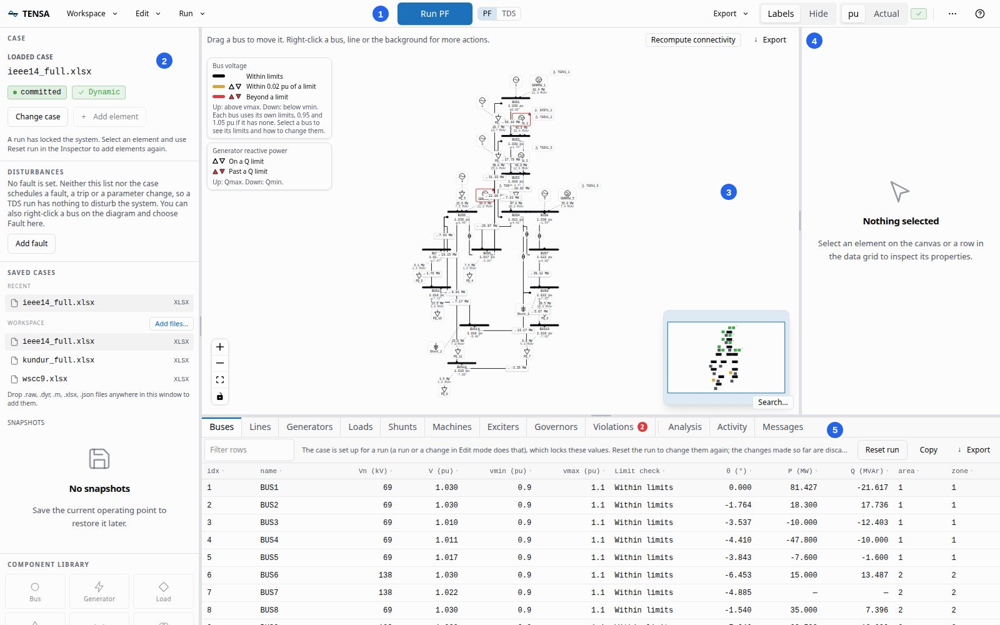
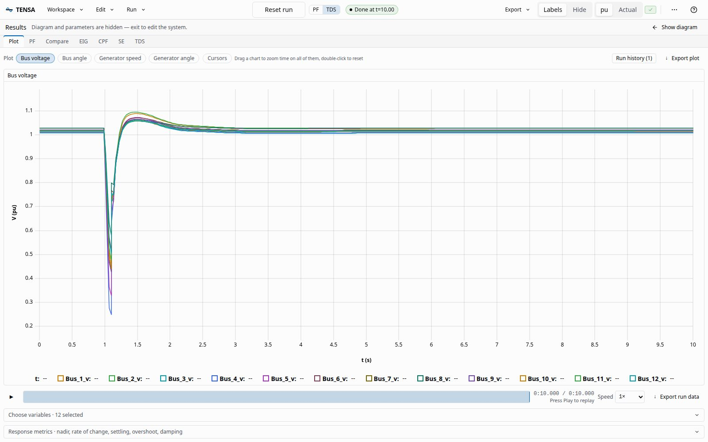
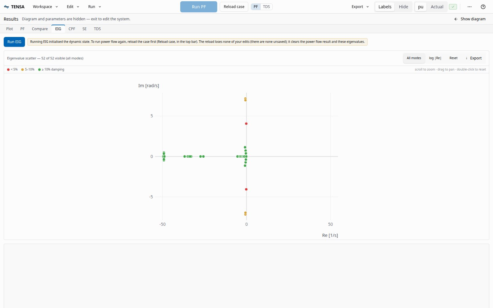
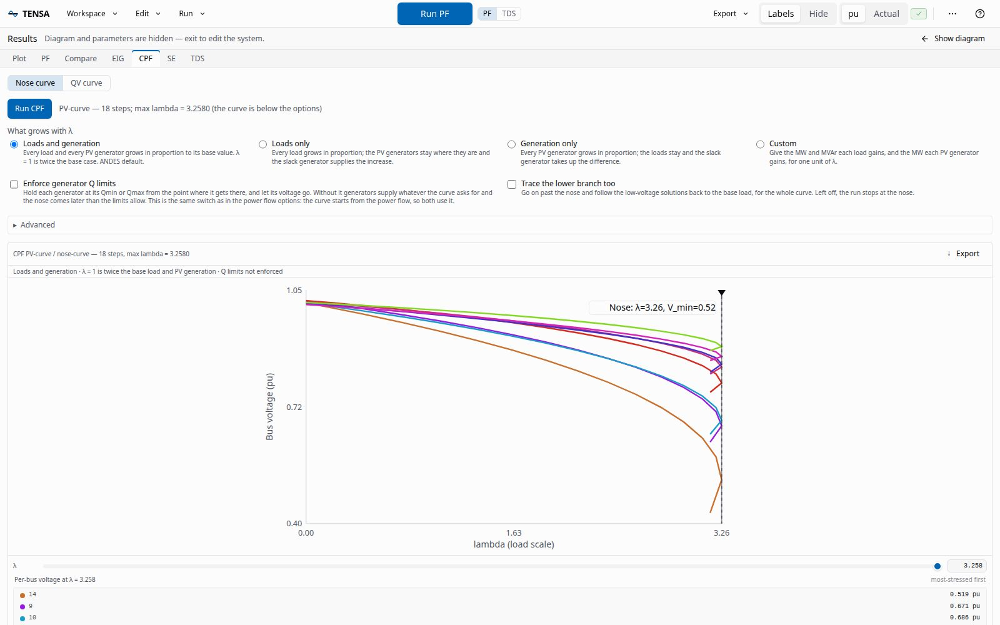

# UI tour

This page walks through the window, region by region, and then through the analyses. It describes what is there and where to find it. The [quick start](quickstart.md) is the page to follow if you want to do something first.

## The window

The picture shows IEEE 14 after a power flow. Five areas make up the window, numbered in the picture.

1. **Top bar.** The menus, the run button and the display toggles.
2. **Left rail.** The case, its disturbances, the saved cases, the snapshots and the component library.
3. **Diagram.** The one-line diagram of the loaded case.
4. **Inspector.** The properties of whatever element you select.
5. **Bottom drawer.** The tables of the case, the analyses and their plots, the activity list and the ANDES messages.

The panels can be hidden to give the diagram room: `Ctrl+B` toggles the left rail, `Ctrl+\` the inspector and `Ctrl+J` the bottom drawer (`Cmd` instead of `Ctrl` on a Mac). Dividers between the panels can be dragged to resize them. `Ctrl+Shift+L` switches between the light and the dark theme.

## Top bar

**Workspace** holds what concerns the files and the saved state of the case: **Open case**, **Save**, **Save system as** (writes the system back to an `.xlsx`, `.raw` or `.json` file), **Save snapshot** and **Load snapshot**, **Import bundle** and **Reports**. Before a case has been run it also offers **Add element**, **Add PMU** and **Import profile**.

**Edit** has **Undo** and **Redo** for the edits made before a run, **Reload from file**, which discards them, and the switch to Edit mode for changing controller parameters.

**Run** picks the routine the run button runs: power flow, time-domain simulation (TDS), eigenvalue analysis (EIG), continuation power flow (CPF), state estimation (SE) or a parameter sweep. It also opens the run history.

The big blue button is **Run PF** or **Run TDS**, according to the **PF | TDS** toggle beside it. While a time-domain run goes, it turns into **Abort**, and `Esc` does the same. After a run, it reads **Reset run**, which reloads the case so that you can change it and run again.

**Export** saves a bundle, a snapshot or an HTML report. Plots have an export menu of their own: CSV and PNG, COMTRADE for a time-domain run, and a MATLAB `.mat` file of the state matrix and eigenvalues for the eigenvalue plot.

The other controls on the right of the bar:

- **Labels | Hide** shows or hides the numbers on the diagram.
- **pu | Actual** switches bus voltage between per unit and kV, and generator speed between per unit and Hz. Angles are in degrees and powers in MW and MVAr either way.
- The check mark chip says whether the loaded case has the dynamic models a time-domain run needs.
- The search button (`Ctrl+K`) opens the command palette, which finds every command by name.
- **History** lists the runs kept in this browser, so you can rename them, pin two to compare, or delete them.
- The theme switch changes between the light and dark theme.
- The **?** menu has the keyboard shortcuts, a link to the API reference the server serves at `/docs`, and the TENSA and ANDES versions of the server.

Below about 1800 px of window width, the search button, the theme switch and History move into a **...** menu, and on narrower windows so do the panel toggles and the **Labels** and **pu | Actual** switches. Each of them is still a command with a keyboard shortcut.

## Left rail

- **Case** shows the loaded case and its state: `pre-setup` before a run, `committed` after one. A second badge says whether the case has dynamic models (`Dynamic`) or not (`Static-only`). **Change case** loads another, and **Add element** opens the element builder.
- **Disturbances** lists what the next time-domain run will do to the system: the faults, trips and parameter changes you added, plus any the case file itself holds. **Add fault** (or **Add disturbance**) opens a form for a fault on a bus, a line or device trip (a toggle), or a scheduled parameter change (an alter).
- **Saved cases** lists the case files of the workspace, and the ones you opened recently. **Add files** copies files into the workspace, and so does dropping them anywhere on the window: `.raw`, `.dyr`, `.m`, `.xlsx` and `.json` files. A `.raw` dropped together with its `.dyr` opens as the pair.
- **Snapshots** lists the snapshots you saved for this case, under a **Save snapshot** button that saves one. A snapshot records the case, its disturbances and the diagram as it was placed. Click a snapshot to restore it: that reloads the case, adds the disturbances again, solves the power flow and puts the diagram back.
- **Component library** has a tile for each kind of element: bus, generator, load, shunt, line, transformer and battery. Click a tile, or drag it onto the diagram, to open the element form with that kind selected.

## Diagram

The diagram is a traditional busbar one-line. Drag a bus, a generator, a load or a shunt to move it: where you leave it is saved in a layout file beside the case, so it is there when you open the case again. The file holds the whole diagram as it is drawn, the lines included, and every way of saving the system takes it along, so a case saved under a new name, a restored snapshot and an imported bundle all open with the picture they were saved with. Right-click a bus, a line or the background for more actions, such as putting a fault on a bus or, on the background, saving a snapshot.

A generator, a load or a shunt is joined to its bus by a connector that leaves from the middle of the face that points at the bus and lands on the bar, at a dot. Under or over the bar the connector drops square onto it. Past the tip of the bar it runs to the tip, as a diagonal. If you prefer right angles, right-click the background and pick **Right angle** under **Device connectors** (**Straight** puts the diagonals back); the choice is saved with the layout. Lines and transformers land on the bars too, each at a dot of its own, and a bar grows when it has more connections than it has room for.

To place something without dragging, click it and press the arrow keys, with Shift for bigger steps. The right-click menu of a bus, a generator, a load or a shunt has **Move with arrow keys**, which selects it for the keys. The padlock button at the bottom left locks the diagram: while it is on, nothing can be dragged or selected, and the bar above the diagram says so.

After a power flow the diagram carries the results. Each bus shows its voltage and angle, each line and transformer its flow, and each machine and load its power. Buses turn amber when they are within 0.02 pu of a limit and red beyond it, each against its own limits, and lines turn amber and red as they near and pass their rating. A small triangle marks the side of the limit, and a generator held at a reactive limit is marked too. The legends at the top left say which is which.

Zoom with the buttons at the bottom left or the mouse wheel. The minimap at the bottom right shows where you are, and **Search** (`Ctrl+/`) jumps to a bus or an element by name. **Recompute connectivity** counts the electrical islands of the system after a run.

## Inspector

Click an element on the diagram, or a row of a table, and the inspector shows its properties, the plots of its variables from the last run, and the disturbances that act on it. Before a run, a pencil beside a value changes it, and the bin in the header deletes the element. The mode button in the header, which reads **Run** or **Edit**, switches Edit mode on and off. In Edit mode the parameters of the case's controllers can be changed. Those changes are made on a copy of the case, so nothing touches the loaded system until you commit them with **Save parameter edits as case**.

## Bottom drawer

The first tabs are tables of the case: **Buses**, **Lines**, **Generators**, **Loads**, **Shunts**, and the dynamic models **Machines**, **Exciters** and **Governors**. Before a run they hold the case's own values, and a double-click on a value changes it. Paste a block copied from a spreadsheet, filter the rows, or copy the table out. After a run the tables also show the results (voltage, angle, P and Q for buses, flows and loading for lines). A run locks the values until you press **Reset run** in the table's bar.

- **Violations** lists every limit a power flow breaks (voltage, line loading, generator reactive power), with a count on the tab.
- **Analysis** holds the analyses, described below.
- **Activity** lists the jobs of this page load, in flight or finished, with a cancel button for a running one and a retry for a failed one.
- **Messages** lists what ANDES said while it loaded the case and ran: a device that failed to initialise, a power flow that stopped at its iteration limit, a fault applied at a given time. A count on the tab shows when there is something to read.

## Analyses

The **Analysis** tab has a sub-tab for each routine. `Ctrl+Shift+M` (or **Expand plot**) opens the **results view**, which hides the diagram and gives the analysis the whole window. **Show diagram** brings it back.

**PF** sets the options of a power flow: the tolerance and iteration limit, a flat start, and whether generators are held at their reactive limits. A power flow that does not converge offers adjusted retries, and one that does gets a summary of generation, load, shunts, losses and the slack output.

**Compare** sets two power flows side by side: the change of every bus voltage and angle, of every line's flow, loss and loading, and of the system totals, with the largest change first. The last ten converged power flows are kept.

**TDS** sets the run: the end time (10 s by default), the step, the groups of variables to stream, the integrator (a fixed-step trapezoidal one, or the adaptive QNDF) and, optionally, any ANDES variable by name. **Frequency control** adds a droop or a fast frequency response on a battery or another distributed generator. The results stream into the **Plot** tab while the run goes: bus voltage, bus angle, generator speed and generator angle, with two cursors that read values and differences between two instants, a scrub bar to replay the run, and a table of response metrics (nadir, rate of change, settling time, overshoot, damping).

**EIG** runs the small-signal analysis and plots the eigenvalues. Click a point to see its participation factors.

**CPF** traces the nose curve of the bus voltages as the load grows, in the direction you choose, with or without the generators' reactive limits, and a **QV curve** for one bus. The loading margin and the nose are marked on the curve.

**SE** has two steps: **Generate measurements** builds a measurement set from the converged power flow, and **Run SE** estimates the state from it and plots the residuals.

A parameter sweep is started from **Run** and is shown with its progress.

## Saving and exporting

- **Save system as** writes the case, with the edits you made, to a file in the workspace. An `.xlsx` or a `.json` file holds the whole case. A `.raw` file holds the power-flow data only, as the format does: the machines, the controllers and the other dynamic models are left out of it. The diagram's layout is written beside the file, whichever format it is. A `.raw` file numbers its generators, loads and lines afresh when it is read, and the layout finds them again by the buses they are on.
- A **snapshot** stores the operating point, the disturbances and the diagram's layout, so that you can restore them later. If you have rearranged the diagram since the snapshot was saved, the restore says so and **Keep my layout** brings your arrangement back.
- A **bundle** is a `.zip` with the case file, the disturbances, the simulation settings, the results as CSV and the diagram's layout, which reproduces a study on another machine. **Import bundle** in the Workspace menu reads one back.
- The **HTML report** is one self-contained file with the power flow tables, the limits it breaks, the comparison of two power flows, a chart of each plotted quantity, the eigenvalues and ANDES's own reports. It opens in any browser and prints.
- A time-domain run exports as **COMTRADE** (IEEE C37.111): a `.cfg` and an ASCII `.dat` in one `.zip`.

Finished runs and the kept power flows are stored in the browser, so a reload does not lose them. They are back in the run history and in the Compare tab the next time the page opens.

## Keyboard shortcuts

Press `?` for the full list. The ones used most are:

| Keys | Does |
| --- | --- |
| `Ctrl+K` | Open the command palette |
| `Ctrl+O`, `Ctrl+S` | Open a case, save |
| `Ctrl+Z`, `Ctrl+Y` | Undo, redo an edit |
| `Ctrl+B`, `Ctrl+J`, `Ctrl+\` | Toggle the left rail, the bottom drawer, the inspector |
| `Ctrl+Shift+M` | Toggle the results view |
| `Ctrl+/` | Search the diagram |
| `Esc` | Abort a running time-domain simulation |
| `r` then `p`, `t`, `e`, `c`, `s`, `w` | Pick the routine to run: PF, TDS, EIG, CPF, SE, sweep |
| `g` then `h`, `s` | Open the run history, save a snapshot |

On a Mac, `Cmd` replaces `Ctrl`.
